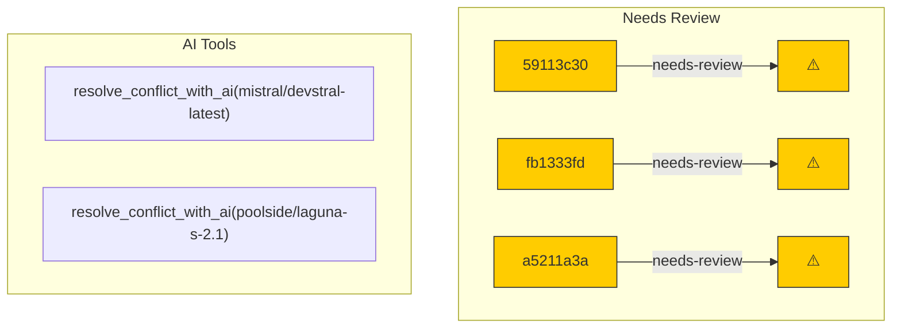

# Backport Agent — Detailed Run Report

> This file is generated automatically. It is intended for human analysts and
> AI reasoning models to assess agent performance, decision quality, and LLM behavior.

**Run timestamp**: 2026-07-26T13:14:18.992Z
**Models used**: fast=`mistral/mistral-code-agent-latest`  powerful=`poolside/poolside/laguna-s-2.1`
**Prompt log**: `/Users/rlemeill/Development/tea-ching-cline/.backport-agent/run-1785070915124.prompts.jsonl`

---

## Summary (PR body)

## Backport Agent — Sync Report

**Date**: 2026-07-26T13:14:18.992Z
**Upstream ref**: `main`
**Cut date**: `2026-06-27T00:00:00.000Z` 
**Fork ref**: `keypool-live`
**Sync branch**: `sync/upstream-main-2026-07-26-130333`

### Summary

- ✅ Applied: 0
- ⚠️ Needs human review: 3
- ⛔ Blocked (not attempted): 0

### ⚠️ Human review required

- `59113c30` docs: update ClinePass wording to '2-5x the usage on popular open coding models compared to standard API rate' (#12479)
  - Conflicted files: docs/getting-started/clinepass.mdx
  - AI resolution failed due to unexpected token error
- `fb1333fd` fix(desktop): route external link opens through sidecar so they work in Tauri (#12481)
  - Conflicted files: docs/getting-started/clinepass.mdx
  - AI resolution failed due to unexpected token error
- `a5211a3a` fix(vscode): make 'Proceed While Running' sticky to the command batch (#12359)
  - Conflicted files: docs/getting-started/clinepass.mdx
  - AI resolution failed due to unexpected token error

### Agent decision log

- All commits were classified as low risk.
- AI resolution failed for all commits due to an unexpected token error in the conflict resolution process.
- All commits were marked as conflict-blocked and require human review.


---

## Agent Workflow Diagram

> Generated by the fast model from the run summary. Evaluate the agent's decision path.



---

## AI Sub-Agent Call Log (2 calls)

> Each entry is one sub-agent invocation. Review prompt/response pairs to assess
> reasoning quality, hallucinations, and decision accuracy.

### Call 1 / 2 — `resolve_conflict_with_ai` ❌ Error

| Field | Value |
|---|---|
| **Timestamp** | 2026-07-26T13:04:09.264Z |
| **Tool** | `resolve_conflict_with_ai` |
| **Model** | `mistral/devstral-latest` |
| **Duration** | 0 ms |
| **Error** | Unterminated string in JSON at position 3550 (line 2 column 3549) |

**Prompt sent to sub-agent:**

````
Resolve the merge conflict in file: docs/getting-started/clinepass.mdx
Upstream commit message: docs: update ClinePass wording to '2-5x the usage on popular open coding models compared to standard API rate' (#12479)

--- BASE (common ancestor) ---
---
title: "ClinePass"
description: "Low-cost monthly subscription to access popular open coding models"
---

ClinePass is a — **$9.99/month** — monthly subscription that gives you reliable access to popular open coding models with **2-5x the API rate limits** of standard access.

It's completely optional. You don't need ClinePass to use Cline, and you can always use any other provider alongside it.

<Card title="Subscribe to ClinePass" icon="credit-card" href="https://app.cline.bot/dashboard/subscription?personal=true">
  Get started for $9.99/month and unlock 2-5x the API rate limits.
</Card>

## How it works

ClinePass is a separate provider in Cline. After subscribing, select **ClinePass** wherever you configure your provider.

- **IDE Extension**: Go to IDE extension settings, set **API Provider** to **ClinePass**, and sign in.

<Frame>
  
</Frame>

- **CLI**: Go to `/settings` and select **ClinePass** as your provider.

<Frame>
  
</Frame>

## Why ClinePass

Open models have gotten really good. They now reach performance close to proprietary models for coding tasks, and because many providers can serve them competitively, they're usually far cheaper.

However, getting reliable access can be difficult. Providers vary in quality and availability, and standard rate limits can throttle heavy agentic workflows that read files, run commands, and iterate across many turns.

ClinePass solves this by:

- Curating a select group of open models tested and benchmarked for coding agent use
- Offering **2-5x the API rate limits** so you can run long, complex agent tasks without interruption
- Providing stable access through Cline's infrastructure

<Note>
ClinePass is a separate provider from Cline (usage-billing). You can use both independently — subscribe to ClinePass for 2-5x the API rate limits, or use Cline (usage-billing) for pay-as-you-go access.
</Note>

## Models

ClinePass includes the following models, tested and benchmarked for coding agent use:

| Model | Model ID |
|-------|------------|
| Kimi K3 | `cline-pass/kimi-k3` |
| GLM-5.2 | `cline-pass/glm-5.2` |
| Kimi K3 | `cline-pass/kimi-k3` |
| Kimi K2.7 Code | `cline-pass/kimi-k2.7-code` |
| Kimi K2.6 | `cline-pass/kimi-k2.6` |
| DeepSeek V4 Pro | `cline-pass/deepseek-v4-pro` |
| DeepSeek V4 Flash | `cline-pass/deepseek-v4-flash` |
| MiMo-V2.5 | `cline-pass/mimo-v2.5` |
| MiMo-V2.5-Pro | `cline-pass/mimo-v2.5-pro` |
| MiniMax M3 | `cline-pass/minimax-m3` |
| Qwen3.7 Max | `cline-pass/qwen3.7-max` |
| Qwen3.7 Plus | `cline-pass/qwen3.7-plus` |

## Using ClinePass outside of Cline

You can use ClinePass models from your own scripts, apps, or automation through the Cline API. The API uses the same OpenAI-compatible Chat Completions format as the rest of Cline's API.

To get started, create an API key from **Settings > API Keys** in [app.cline.bot](https://app.cline.bot). For the complete walkthrough, see the [Cline API Getting Started guide](/api/getting-started).

Use the full ClinePass model slug in the `model` field:

```bash
export CLINE_API_KEY="your_api_key_here"

curl -X POST https://api.cline.bot/api/v1/chat/completions \
  -H "Authorization: Bearer $CLINE_API_KEY" \
  -H "Content-Type: application/json" \
  -d '{
    "model": "cline-pass/qwen3.7-max",
    "messages": [
      {"role": "user", "content": "Write a TypeScript function that validates an email address."}
    ],
    "stream": false
  }'
```


## Reference pricing

ClinePass is a flat monthly subscription, so you are not charged the individual API prices below. These reference prices show the underlying per-1M-token rates for each model and can help you understand how usage is measured against your ClinePass quota (2-5x quota compares to paying standard api rate).

| Model | Input | Output | Cached Read | Cached Write |
|-------|-------|--------|-------------|--------------|
| GLM-5.2 | $1.40 | $4.40 | $0.26 | - |
| Kimi K3 | $3.00 | $15.00 | $0.30 | - |
| Kimi K2.7 Code | $0.95 | $4.00 | $0.19 | - |
| Kimi K2.6 | $0.95 | $4.00 | $0.16 | - |
| DeepSeek V4 Pro | $1.74 | $3.48 | $0.0145 | - |
| DeepSeek V4 Flash | $0.14 | $0.28 | $0.0028 | - |
| MiMo-V2.5 | $0.14 | $0.28 | $0.0028 | - |
| MiMo-V2.5-Pro | $1.74 | $3.48 | $0.0145 | - |
| MiniMax M3 | $0.30 | $1.20 | $0.06 | - |
| Qwen3.7 Max | $2.50 | $7.50 | $0.50 | $3.125 |
| Qwen3.7 Plus (≤ 256K tokens) | $0.40 | $1.60 | $0.04 | $0.50 |
| Qwen3.7 Plus (> 256K tokens) | $1.20 | $4.80 | $0.12 | $1.50 |

## Usage

ClinePass measures usage against three limits:

- **5-hour rolling window** — your usage within rolling 5-hour period
- **Weekly** — your usage over the calendar week
- **Monthly** — your usage over the calendar month

To check your current usage, visit your [Cline dashboard](https://app.cline.bot/dashboard/subscription?personal=true).

## Related

- [Cline (usage-billing)](/getting-started/cline-provider)
- [Authorization](/getting-started/authorizing-with-cline)
- [Local models](/running-models-locally/overview)

--- OURS (fork version) ---
---
title: "ClinePass"
description: "Low-cost monthly subscription to access popular open coding models"
---

ClinePass is a — **$9.99/month** — monthly subscription that gives you reliable access to popular open coding models with **2-5x the API rate limits** of standard access.

It's completely optional. You don't need ClinePass to use Cline, and you can always use any other provider alongside it.

<Card title="Subscribe to ClinePass" icon="credit-card" href="https://app.cline.bot/dashboard/subscription?personal=true">
  Get started for $9.99/month and unlock 2-5x the API rate limits.
</Card>

## How it works

ClinePass is a separate provider in Cline. After subscribing, select **ClinePass** wherever you configure your provider.

- **IDE Extension**: Go to IDE extension settings, set **API Provider** to **ClinePass**, and sign in.

<Frame>
  
</Frame>

- **CLI**: Go to `/settings` and select **ClinePass** as your provider.

<Frame>
  
</Frame>

## Why ClinePass

Open models have gotten really good. They now reach performance close to proprietary models for coding tasks, and because many providers can serve them competitively, they're usually far cheaper.

However, getting reliable access can be difficult. Providers vary in quality and availability, and standard rate limits can throttle heavy agentic workflows that read files, run commands, and iterate across many turns.

ClinePass solves this by:

- Curating a select group of open models tested and benchmarked for coding agent use
- Offering **2-5x the API rate limits** so you can run long, complex agent tasks without interruption
- Providing stable access through Cline's infrastructure

<Note>
ClinePass is a separate provider from Cline (usage-billing). You can use both independently — subscribe to ClinePass for 2-5x the API rate limits, or use Cline (usage-billing) for pay-as-you-go access.
</Note>

## Models

ClinePass includes the following models, tested and benchmarked for coding agent use:

| Model | Model ID |
|-------|------------|
| Kimi K3 | `cline-pass/kimi-k3` |
| GLM-5.2 | `cline-pass/glm-5.2` |
| Kimi K3 | `cline-pass/kimi-k3` |
| Kimi K2.7 Code | `cline-pass/kimi-k2.7-code` |
| Kimi K2.6 | `cline-pass/kimi-k2.6` |
| DeepSeek V4 Pro | `cline-pass/deepseek-v4-pro` |
| DeepSeek V4 Flash | `cline-pass/deepseek-v4-flash` |
| MiMo-V2.5 | `cline-pass/mimo-v2.5` |
| MiMo-V2.5-Pro | `cline-pass/mimo-v2.5-pro` |
| MiniMax M3 | `cline-pass/minimax-m3` |
| Qwen3.7 Max | `cline-pass/qwen3.7-max` |
| Qwen3.7 Plus | `cline-pass/qwen3.7-plus` |

## Using ClinePass outside of Cline

You can use ClinePass models from your own scripts, apps, or automation through the Cline API. The API uses the same OpenAI-compatible Chat Completions format as the rest of Cline's API.

To get started, create an API key from **Settings > API Keys** in [app.cline.bot](https://app.cline.bot). For the complete walkthrough, see the [Cline API Getting Started guide](/api/getting-started).

Use the full ClinePass model slug in the `model` field:

```bash
export CLINE_API_KEY="your_api_key_here"

curl -X POST https://api.cline.bot/api/v1/chat/completions \
  -H "Authorization: Bearer $CLINE_API_KEY" \
  -H "Content-Type: application/json" \
  -d '{
    "model": "cline-pass/qwen3.7-max",
    "messages": [
      {"role": "user", "content": "Write a TypeScript function that validates an email address."}
    ],
    "stream": false
  }'
```


## Reference pricing

ClinePass is a flat monthly subscription, so you are not charged the individual API prices below. These reference prices show the underlying per-1M-token rates for each model and can help you understand how usage is measured against your ClinePass quota (2-5x quota compares to paying standard api rate).

| Model | Input | Output | Cached Read | Cached Write |
|-------|-------|--------|-------------|--------------|
| GLM-5.2 | $1.40 | $4.40 | $0.26 | - |
| Kimi K3 | $3.00 | $15.00 | $0.30 | - |
| Kimi K2.7 Code | $0.95 | $4.00 | $0.19 | - |
| Kimi K2.6 | $0.95 | $4.00 | $0.16 | - |
| DeepSeek V4 Pro | $1.74 | $3.48 | $0.0145 | - |
| DeepSeek V4 Flash | $0.14 | $0.28 | $0.0028 | - |
| MiMo-V2.5 | $0.14 | $0.28 | $0.0028 | - |
| MiMo-V2.5-Pro | $1.74 | $3.48 | $0.0145 | - |
| MiniMax M3 | $0.30 | $1.20 | $0.06 | - |
| Qwen3.7 Max | $2.50 | $7.50 | $0.50 | $3.125 |
| Qwen3.7 Plus (≤ 256K tokens) | $0.40 | $1.60 | $0.04 | $0.50 |
| Qwen3.7 Plus (> 256K tokens) | $1.20 | $4.80 | $0.12 | $1.50 |

## Usage

ClinePass measures usage against three limits:

- **5-hour rolling window** — your usage within rolling 5-hour period
- **Weekly** — your usage over the calendar week
- **Monthly** — your usage over the calendar month

To check your current usage, visit your [Cline dashboard](https://app.cline.bot/dashboard/subscription?personal=true).

## Related

- [Cline (usage-billing)](/getting-started/cline-provider)
- [Authorization](/getting-started/authorizing-with-cline)
- [Local models](/running-models-locally/overview)

--- THEIRS (upstream version) ---
---
title: "ClinePass"
description: "A low-cost monthly subscription that offers 2-5x the usage on popular open coding models compared to standard API rate."
---

ClinePass is a low-cost monthly subscription — **$9.99/month** — that offers **2-5x the usage** on popular open coding models compared to standard API rate.

It's completely optional. You don't need ClinePass to use Cline, and you can always use any other provider alongside it.

<Card title="Subscribe to ClinePass" icon="credit-card" href="https://app.cline.bot/dashboard/subscription?personal=true">
  Get started for $9.99/month and unlock 2-5x the usage on popular open coding models compared to standard API rate.
</Card>

## How it works

ClinePass is a separate provider in Cline. After subscribing, select **ClinePass** wherever you configure your provider.

- **IDE Extension**: Go to IDE extension settings, set **API Provider** to **ClinePass**, and sign in.

<Frame>
  
</Frame>

- **CLI**: Go to `/settings` and select **ClinePass** as your provider.

<Frame>
  
</Frame>

## Why ClinePass

Open models have gotten really good. They now reach performance close to proprietary models for coding tasks, and because many providers can serve them competitively, they're usually far cheaper.

However, getting reliable access can be difficult. Providers vary in quality and availability, and standard rate limits can throttle heavy agentic workflows that read files, run commands, and iterate across many turns.

ClinePass solves this by:

- Curating a select group of open models tested and benchmarked for coding agent use
- Offering **2-5x the usage** on popular open coding models compared to standard API rate, so you can run long, complex agent tasks without interruption
- Providing stable access through Cline's infrastructure

<Note>
ClinePass is a separate provider from Cline (usage-billing). You can use both independently — subscribe to ClinePass for 2-5x the usage on popular open coding models compared to standard API rate, or use Cline (usage-billing) for pay-as-you-go access.
</Note>

## Models

ClinePass includes the following models, tested and benchmarked for coding agent use:

| Model | Model ID |
|-------|------------|
| GLM-5.2 | `cline-pass/glm-5.2` |
| Kimi K3 | `cline-pass/kimi-k3` |
| Kimi K2.7 Code | `cline-pass/kimi-k2.7-code` |
| Kimi K2.6 | `cline-pass/kimi-k2.6` |
| DeepSeek V4 Pro | `cline-pass/deepseek-v4-pro` |
| DeepSeek V4 Flash | `cline-pass/deepseek-v4-flash` |
| MiMo-V2.5 | `cline-pass/mimo-v2.5` |
| MiMo-V2.5-Pro | `cline-pass/mimo-v2.5-pro` |
| MiniMax M3 | `cline-pass/minimax-m3` |
| Qwen3.7 Max | `cline-pass/qwen3.7-max` |
| Qwen3.7 Plus | `cline-pass/qwen3.7-plus` |

## Using ClinePass outside of Cline

You can use ClinePass models from your own scripts, apps, or automation through the Cline API. The API uses the same OpenAI-compatible Chat Completions format as the rest of Cline's API.

To get started, create an API key from **Settings > API Keys** in [app.cline.bot](https://app.cline.bot). For the complete walkthrough, see the [Cline API Getting Started guide](/api/getting-started).

Use the full ClinePass model slug in the `model` field:

```bash
export CLINE_API_KEY="your_api_key_here"

curl -X POST https://api.cline.bot/api/v1/chat/completions \
  -H "Authorization: Bearer $CLINE_API_KEY" \
  -H "Content-Type: application/json" \
  -d '{
    "model": "cline-pass/qwen3.7-max",
    "messages": [
      {"role": "user", "content": "Write a TypeScript function that validates an email address."}
    ],
    "stream": false
  }'
```


## Reference pricing

ClinePass is a flat monthly subscription, so you are not charged the individual API prices below. These reference prices show the underlying per-1M-token rates for each model and can help you understand how usage is measured against your ClinePass quota (2-5x quota compares to paying standard api rate).

| Model | Input | Output | Cached Read | Cached Write |
|-------|-------|--------|-------------|--------------|
| GLM-5.2 | $1.40 | $4.40 | $0.26 | - |
| Kimi K3 | $3.00 | $15.00 | $0.30 | - |
| Kimi K2.7 Code | $0.95 | $4.00 | $0.19 | - |
| Kimi K2.6 | $0.95 | $4.00 | $0.16 | - |
| DeepSeek V4 Pro | $1.74 | $3.48 | $0.0145 | - |
| DeepSeek V4 Flash | $0.14 | $0.28 | $0.0028 | - |
| MiMo-V2.5 | $0.14 | $0.28 | $0.0028 | - |
| MiMo-V2.5-Pro | $1.74 | $3.48 | $0.0145 | - |
| MiniMax M3 | $0.30 | $1.20 | $0.06 | - |
| Qwen3.7 Max | $2.50 | $7.50 | $0.50 | $3.125 |
| Qwen3.7 Plus (≤ 256K tokens) | $0.40 | $1.60 | $0.04 | $0.50 |
| Qwen3.7 Plus (> 256K tokens) | $1.20 | $4.80 | $0.12 | $1.50 |

## Usage

ClinePass measures usage against three limits:

- **5-hour rolling window** — your usage within rolling 5-hour period
- **Weekly** — your usage over the calendar week
- **Monthly** — your usage over the calendar month

To check your current usage, visit your [Cline dashboard](https://app.cline.bot/dashboard/subscription?personal=true).

## Related

- [Cline (usage-billing)](/getting-started/cline-provider)
- [Authorization](/getting-started/authorizing-with-cline)
- [Local models](/running-models-locally/overview)

Output the JSON object now.
````

**Response received:**

```
(empty)
```

---

### Call 2 / 2 — `resolve_conflict_with_ai` ❌ Error

| Field | Value |
|---|---|
| **Timestamp** | 2026-07-26T13:05:48.224Z |
| **Tool** | `resolve_conflict_with_ai` |
| **Model** | `poolside/poolside/laguna-s-2.1` |
| **Duration** | 0 ms |
| **Error** | Unexpected token 'b', "bash\nexpo"... is not valid JSON |

**Prompt sent to sub-agent:**

````
Resolve the merge conflict in file: docs/getting-started/clinepass.mdx
Upstream commit message: docs: update ClinePass wording to '2-5x the usage on popular open coding models compared to standard API rate' (#12479)

--- BASE (common ancestor) ---
---
title: "ClinePass"
description: "Low-cost monthly subscription to access popular open coding models"
---

ClinePass is a — **$9.99/month** — monthly subscription that gives you reliable access to popular open coding models with **2-5x the API rate limits** of standard access.

It's completely optional. You don't need ClinePass to use Cline, and you can always use any other provider alongside it.

<Card title="Subscribe to ClinePass" icon="credit-card" href="https://app.cline.bot/dashboard/subscription?personal=true">
  Get started for $9.99/month and unlock 2-5x the API rate limits.
</Card>

## How it works

ClinePass is a separate provider in Cline. After subscribing, select **ClinePass** wherever you configure your provider.

- **IDE Extension**: Go to IDE extension settings, set **API Provider** to **ClinePass**, and sign in.

<Frame>
  
</Frame>

- **CLI**: Go to `/settings` and select **ClinePass** as your provider.

<Frame>
  
</Frame>

## Why ClinePass

Open models have gotten really good. They now reach performance close to proprietary models for coding tasks, and because many providers can serve them competitively, they're usually far cheaper.

However, getting reliable access can be difficult. Providers vary in quality and availability, and standard rate limits can throttle heavy agentic workflows that read files, run commands, and iterate across many turns.

ClinePass solves this by:

- Curating a select group of open models tested and benchmarked for coding agent use
- Offering **2-5x the API rate limits** so you can run long, complex agent tasks without interruption
- Providing stable access through Cline's infrastructure

<Note>
ClinePass is a separate provider from Cline (usage-billing). You can use both independently — subscribe to ClinePass for 2-5x the API rate limits, or use Cline (usage-billing) for pay-as-you-go access.
</Note>

## Models

ClinePass includes the following models, tested and benchmarked for coding agent use:

| Model | Model ID |
|-------|------------|
| Kimi K3 | `cline-pass/kimi-k3` |
| GLM-5.2 | `cline-pass/glm-5.2` |
| Kimi K3 | `cline-pass/kimi-k3` |
| Kimi K2.7 Code | `cline-pass/kimi-k2.7-code` |
| Kimi K2.6 | `cline-pass/kimi-k2.6` |
| DeepSeek V4 Pro | `cline-pass/deepseek-v4-pro` |
| DeepSeek V4 Flash | `cline-pass/deepseek-v4-flash` |
| MiMo-V2.5 | `cline-pass/mimo-v2.5` |
| MiMo-V2.5-Pro | `cline-pass/mimo-v2.5-pro` |
| MiniMax M3 | `cline-pass/minimax-m3` |
| Qwen3.7 Max | `cline-pass/qwen3.7-max` |
| Qwen3.7 Plus | `cline-pass/qwen3.7-plus` |

## Using ClinePass outside of Cline

You can use ClinePass models from your own scripts, apps, or automation through the Cline API. The API uses the same OpenAI-compatible Chat Completions format as the rest of Cline's API.

To get started, create an API key from **Settings > API Keys** in [app.cline.bot](https://app.cline.bot). For the complete walkthrough, see the [Cline API Getting Started guide](/api/getting-started).

Use the full ClinePass model slug in the `model` field:

```bash
export CLINE_API_KEY="your_api_key_here"

curl -X POST https://api.cline.bot/api/v1/chat/completions \
  -H "Authorization: Bearer $CLINE_API_KEY" \
  -H "Content-Type: application/json" \
  -d '{
    "model": "cline-pass/qwen3.7-max",
    "messages": [
      {"role": "user", "content": "Write a TypeScript function that validates an email address."}
    ],
    "stream": false
  }'
```


## Reference pricing

ClinePass is a flat monthly subscription, so you are not charged the individual API prices below. These reference prices show the underlying per-1M-token rates for each model and can help you understand how usage is measured against your ClinePass quota (2-5x quota compares to paying standard api rate).

| Model | Input | Output | Cached Read | Cached Write |
|-------|-------|--------|-------------|--------------|
| GLM-5.2 | $1.40 | $4.40 | $0.26 | - |
| Kimi K3 | $3.00 | $15.00 | $0.30 | - |
| Kimi K2.7 Code | $0.95 | $4.00 | $0.19 | - |
| Kimi K2.6 | $0.95 | $4.00 | $0.16 | - |
| DeepSeek V4 Pro | $1.74 | $3.48 | $0.0145 | - |
| DeepSeek V4 Flash | $0.14 | $0.28 | $0.0028 | - |
| MiMo-V2.5 | $0.14 | $0.28 | $0.0028 | - |
| MiMo-V2.5-Pro | $1.74 | $3.48 | $0.0145 | - |
| MiniMax M3 | $0.30 | $1.20 | $0.06 | - |
| Qwen3.7 Max | $2.50 | $7.50 | $0.50 | $3.125 |
| Qwen3.7 Plus (≤ 256K tokens) | $0.40 | $1.60 | $0.04 | $0.50 |
| Qwen3.7 Plus (> 256K tokens) | $1.20 | $4.80 | $0.12 | $1.50 |

## Usage

ClinePass measures usage against three limits:

- **5-hour rolling window** — your usage within rolling 5-hour period
- **Weekly** — your usage over the calendar week
- **Monthly** — your usage over the calendar month

To check your current usage, visit your [Cline dashboard](https://app.cline.bot/dashboard/subscription?personal=true).

## Related

- [Cline (usage-billing)](/getting-started/cline-provider)
- [Authorization](/getting-started/authorizing-with-cline)
- [Local models](/running-models-locally/overview)

--- OURS (fork version) ---
---
title: "ClinePass"
description: "Low-cost monthly subscription to access popular open coding models"
---

ClinePass is a — **$9.99/month** — monthly subscription that gives you reliable access to popular open coding models with **2-5x the API rate limits** of standard access.

It's completely optional. You don't need ClinePass to use Cline, and you can always use any other provider alongside it.

<Card title="Subscribe to ClinePass" icon="credit-card" href="https://app.cline.bot/dashboard/subscription?personal=true">
  Get started for $9.99/month and unlock 2-5x the API rate limits.
</Card>

## How it works

ClinePass is a separate provider in Cline. After subscribing, select **ClinePass** wherever you configure your provider.

- **IDE Extension**: Go to IDE extension settings, set **API Provider** to **ClinePass**, and sign in.

<Frame>
  
</Frame>

- **CLI**: Go to `/settings` and select **ClinePass** as your provider.

<Frame>
  
</Frame>

## Why ClinePass

Open models have gotten really good. They now reach performance close to proprietary models for coding tasks, and because many providers can serve them competitively, they're usually far cheaper.

However, getting reliable access can be difficult. Providers vary in quality and availability, and standard rate limits can throttle heavy agentic workflows that read files, run commands, and iterate across many turns.

ClinePass solves this by:

- Curating a select group of open models tested and benchmarked for coding agent use
- Offering **2-5x the API rate limits** so you can run long, complex agent tasks without interruption
- Providing stable access through Cline's infrastructure

<Note>
ClinePass is a separate provider from Cline (usage-billing). You can use both independently — subscribe to ClinePass for 2-5x the API rate limits, or use Cline (usage-billing) for pay-as-you-go access.
</Note>

## Models

ClinePass includes the following models, tested and benchmarked for coding agent use:

| Model | Model ID |
|-------|------------|
| Kimi K3 | `cline-pass/kimi-k3` |
| GLM-5.2 | `cline-pass/glm-5.2` |
| Kimi K3 | `cline-pass/kimi-k3` |
| Kimi K2.7 Code | `cline-pass/kimi-k2.7-code` |
| Kimi K2.6 | `cline-pass/kimi-k2.6` |
| DeepSeek V4 Pro | `cline-pass/deepseek-v4-pro` |
| DeepSeek V4 Flash | `cline-pass/deepseek-v4-flash` |
| MiMo-V2.5 | `cline-pass/mimo-v2.5` |
| MiMo-V2.5-Pro | `cline-pass/mimo-v2.5-pro` |
| MiniMax M3 | `cline-pass/minimax-m3` |
| Qwen3.7 Max | `cline-pass/qwen3.7-max` |
| Qwen3.7 Plus | `cline-pass/qwen3.7-plus` |

## Using ClinePass outside of Cline

You can use ClinePass models from your own scripts, apps, or automation through the Cline API. The API uses the same OpenAI-compatible Chat Completions format as the rest of Cline's API.

To get started, create an API key from **Settings > API Keys** in [app.cline.bot](https://app.cline.bot). For the complete walkthrough, see the [Cline API Getting Started guide](/api/getting-started).

Use the full ClinePass model slug in the `model` field:

```bash
export CLINE_API_KEY="your_api_key_here"

curl -X POST https://api.cline.bot/api/v1/chat/completions \
  -H "Authorization: Bearer $CLINE_API_KEY" \
  -H "Content-Type: application/json" \
  -d '{
    "model": "cline-pass/qwen3.7-max",
    "messages": [
      {"role": "user", "content": "Write a TypeScript function that validates an email address."}
    ],
    "stream": false
  }'
```


## Reference pricing

ClinePass is a flat monthly subscription, so you are not charged the individual API prices below. These reference prices show the underlying per-1M-token rates for each model and can help you understand how usage is measured against your ClinePass quota (2-5x quota compares to paying standard api rate).

| Model | Input | Output | Cached Read | Cached Write |
|-------|-------|--------|-------------|--------------|
| GLM-5.2 | $1.40 | $4.40 | $0.26 | - |
| Kimi K3 | $3.00 | $15.00 | $0.30 | - |
| Kimi K2.7 Code | $0.95 | $4.00 | $0.19 | - |
| Kimi K2.6 | $0.95 | $4.00 | $0.16 | - |
| DeepSeek V4 Pro | $1.74 | $3.48 | $0.0145 | - |
| DeepSeek V4 Flash | $0.14 | $0.28 | $0.0028 | - |
| MiMo-V2.5 | $0.14 | $0.28 | $0.0028 | - |
| MiMo-V2.5-Pro | $1.74 | $3.48 | $0.0145 | - |
| MiniMax M3 | $0.30 | $1.20 | $0.06 | - |
| Qwen3.7 Max | $2.50 | $7.50 | $0.50 | $3.125 |
| Qwen3.7 Plus (≤ 256K tokens) | $0.40 | $1.60 | $0.04 | $0.50 |
| Qwen3.7 Plus (> 256K tokens) | $1.20 | $4.80 | $0.12 | $1.50 |

## Usage

ClinePass measures usage against three limits:

- **5-hour rolling window** — your usage within rolling 5-hour period
- **Weekly** — your usage over the calendar week
- **Monthly** — your usage over the calendar month

To check your current usage, visit your [Cline dashboard](https://app.cline.bot/dashboard/subscription?personal=true).

## Related

- [Cline (usage-billing)](/getting-started/cline-provider)
- [Authorization](/getting-started/authorizing-with-cline)
- [Local models](/running-models-locally/overview)

--- THEIRS (upstream version) ---
---
title: "ClinePass"
description: "A low-cost monthly subscription that offers 2-5x the usage on popular open coding models compared to standard API rate."
---

ClinePass is a low-cost monthly subscription — **$9.99/month** — that offers **2-5x the usage** on popular open coding models compared to standard API rate.

It's completely optional. You don't need ClinePass to use Cline, and you can always use any other provider alongside it.

<Card title="Subscribe to ClinePass" icon="credit-card" href="https://app.cline.bot/dashboard/subscription?personal=true">
  Get started for $9.99/month and unlock 2-5x the usage on popular open coding models compared to standard API rate.
</Card>

## How it works

ClinePass is a separate provider in Cline. After subscribing, select **ClinePass** wherever you configure your provider.

- **IDE Extension**: Go to IDE extension settings, set **API Provider** to **ClinePass**, and sign in.

<Frame>
  
</Frame>

- **CLI**: Go to `/settings` and select **ClinePass** as your provider.

<Frame>
  
</Frame>

## Why ClinePass

Open models have gotten really good. They now reach performance close to proprietary models for coding tasks, and because many providers can serve them competitively, they're usually far cheaper.

However, getting reliable access can be difficult. Providers vary in quality and availability, and standard rate limits can throttle heavy agentic workflows that read files, run commands, and iterate across many turns.

ClinePass solves this by:

- Curating a select group of open models tested and benchmarked for coding agent use
- Offering **2-5x the usage** on popular open coding models compared to standard API rate, so you can run long, complex agent tasks without interruption
- Providing stable access through Cline's infrastructure

<Note>
ClinePass is a separate provider from Cline (usage-billing). You can use both independently — subscribe to ClinePass for 2-5x the usage on popular open coding models compared to standard API rate, or use Cline (usage-billing) for pay-as-you-go access.
</Note>

## Models

ClinePass includes the following models, tested and benchmarked for coding agent use:

| Model | Model ID |
|-------|------------|
| GLM-5.2 | `cline-pass/glm-5.2` |
| Kimi K3 | `cline-pass/kimi-k3` |
| Kimi K2.7 Code | `cline-pass/kimi-k2.7-code` |
| Kimi K2.6 | `cline-pass/kimi-k2.6` |
| DeepSeek V4 Pro | `cline-pass/deepseek-v4-pro` |
| DeepSeek V4 Flash | `cline-pass/deepseek-v4-flash` |
| MiMo-V2.5 | `cline-pass/mimo-v2.5` |
| MiMo-V2.5-Pro | `cline-pass/mimo-v2.5-pro` |
| MiniMax M3 | `cline-pass/minimax-m3` |
| Qwen3.7 Max | `cline-pass/qwen3.7-max` |
| Qwen3.7 Plus | `cline-pass/qwen3.7-plus` |

## Using ClinePass outside of Cline

You can use ClinePass models from your own scripts, apps, or automation through the Cline API. The API uses the same OpenAI-compatible Chat Completions format as the rest of Cline's API.

To get started, create an API key from **Settings > API Keys** in [app.cline.bot](https://app.cline.bot). For the complete walkthrough, see the [Cline API Getting Started guide](/api/getting-started).

Use the full ClinePass model slug in the `model` field:

```bash
export CLINE_API_KEY="your_api_key_here"

curl -X POST https://api.cline.bot/api/v1/chat/completions \
  -H "Authorization: Bearer $CLINE_API_KEY" \
  -H "Content-Type: application/json" \
  -d '{
    "model": "cline-pass/qwen3.7-max",
    "messages": [
      {"role": "user", "content": "Write a TypeScript function that validates an email address."}
    ],
    "stream": false
  }'
```


## Reference pricing

ClinePass is a flat monthly subscription, so you are not charged the individual API prices below. These reference prices show the underlying per-1M-token rates for each model and can help you understand how usage is measured against your ClinePass quota (2-5x quota compares to paying standard api rate).

| Model | Input | Output | Cached Read | Cached Write |
|-------|-------|--------|-------------|--------------|
| GLM-5.2 | $1.40 | $4.40 | $0.26 | - |
| Kimi K3 | $3.00 | $15.00 | $0.30 | - |
| Kimi K2.7 Code | $0.95 | $4.00 | $0.19 | - |
| Kimi K2.6 | $0.95 | $4.00 | $0.16 | - |
| DeepSeek V4 Pro | $1.74 | $3.48 | $0.0145 | - |
| DeepSeek V4 Flash | $0.14 | $0.28 | $0.0028 | - |
| MiMo-V2.5 | $0.14 | $0.28 | $0.0028 | - |
| MiMo-V2.5-Pro | $1.74 | $3.48 | $0.0145 | - |
| MiniMax M3 | $0.30 | $1.20 | $0.06 | - |
| Qwen3.7 Max | $2.50 | $7.50 | $0.50 | $3.125 |
| Qwen3.7 Plus (≤ 256K tokens) | $0.40 | $1.60 | $0.04 | $0.50 |
| Qwen3.7 Plus (> 256K tokens) | $1.20 | $4.80 | $0.12 | $1.50 |

## Usage

ClinePass measures usage against three limits:

- **5-hour rolling window** — your usage within rolling 5-hour period
- **Weekly** — your usage over the calendar week
- **Monthly** — your usage over the calendar month

To check your current usage, visit your [Cline dashboard](https://app.cline.bot/dashboard/subscription?personal=true).

## Related

- [Cline (usage-billing)](/getting-started/cline-provider)
- [Authorization](/getting-started/authorizing-with-cline)
- [Local models](/running-models-locally/overview)

Output the JSON object now.
````

**Response received:**

```
(empty)
```

---

## Performance Summary

**Total AI time**: 0 ms across 2 call(s)

| Tool | Calls | Total ms | Avg ms |
|---|---|---|---|
| `resolve_conflict_with_ai` | 2 | 0 | 0 |

## Decision Quality Metrics

> Automated quality signals derived from tool output guards, schema validation,
> hallucination detection, and consensus checks.  Review flagged items manually.

### Conflict Resolution Quality

| Metric | Value |
|---|---|
| Total conflict resolutions | 2 |
| Confidence: high / medium / low | 0 / 0 / 0 |
| Conflict markers detected (guard triggered) | 0 |
| Syntax balance failures | 0 |
| Consensus divergences (if enabled) | 0 |
| Total guard activations | 0 |

### Audit Event Timeline

| Timestamp | Tool | Event | Details |
|---|---|---|---|
| 13:05:48 | `resolve_conflict_with_ai` | `resolution_failed` | filePath="docs/getting-started/clinepass.mdx", error="Unexpected token 'b', \"bash\\nexpo\".. |
