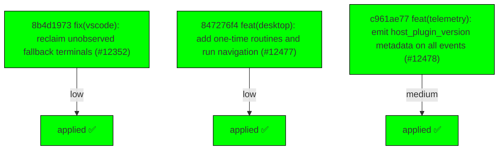

# Backport Agent — Detailed Run Report

> This file is generated automatically. It is intended for human analysts and
> AI reasoning models to assess agent performance, decision quality, and LLM behavior.

**Run timestamp**: 2026-07-26T13:43:56.579Z
**Models used**: fast=`mistral/mistral-code-agent-latest`  powerful=`poolside/poolside/laguna-s-2.1`
**Prompt log**: `/Users/rlemeill/Development/tea-ching-cline/.backport-agent/run-1785072812118.prompts.jsonl`

---

## Summary (PR body)

## Backport Agent — Sync Report

**Date**: 2026-07-26T13:43:56.579Z
**Upstream ref**: `main`
**Cut date**: `2026-06-27T00:00:00.000Z` 
**Fork ref**: `keypool-live`
**Sync branch**: `sync/upstream-main-2026-07-26-133455`

### Summary

- ✅ Applied: 3
- ⚠️ Needs human review: 0
- ⛔ Blocked (not attempted): 0

### Applied commits

- `8b4d1973` [low] fix(vscode): reclaim unobserved fallback terminals (#12352)
- `847276f4` [low] feat(desktop): add one-time routines and run navigation (#12477)
- `c961ae77` [medium] feat(telemetry): emit host_plugin_version metadata on all events (#12478)

### Agent decision log

- All commits applied cleanly; no conflicts or validation failures


---

## Agent Workflow Diagram

> Generated by the fast model from the run summary. Evaluate the agent's decision path.



---

## AI Sub-Agent Call Log (1 call)

> Each entry is one sub-agent invocation. Review prompt/response pairs to assess
> reasoning quality, hallucinations, and decision accuracy.

### Call 1 / 1 — `analyze_commit_for_backport` ✅ OK

| Field | Value |
|---|---|
| **Timestamp** | 2026-07-26T13:34:55.049Z |
| **Tool** | `analyze_commit_for_backport` |
| **Model** | `mistral/mistral-code-agent-latest` |
| **Duration** | 4033 ms |
| **Tokens in** | 8853 |
| **Tokens out** | 184 |
| **Cost** | $0.000000 |

**Prompt sent to sub-agent:**

```
Commit SHA: c961ae773029534ad5473db0e0939d941b9dca24
Commit message:
feat(telemetry): emit host_plugin_version metadata on all events (#12478)

Changed files (5):
apps/vscode/src/sdk/sdk-telemetry.test.ts
apps/vscode/src/sdk/sdk-telemetry.ts
apps/vscode/src/services/telemetry/TelemetryService.test.ts
apps/vscode/src/services/telemetry/TelemetryService.ts
sdk/packages/shared/src/services/telemetry.ts

Diff:
commit c961ae773029534ad5473db0e0939d941b9dca24
Author: Mikołaj Kondratek <19799111+mkondratek@users.noreply.github.com>
Date:   Thu Jul 23 11:42:37 2026 +0200

    feat(telemetry): emit host_plugin_version metadata on all events (#12478)
    
    * feat(telemetry): emit host_plugin_version metadata on all events
    
    The host already reports its Cline distribution version over the
    hostbridge (getHostVersion.clineVersion — the JetBrains plugin version
    on JetBrains, the extension version on VSCode), but telemetry never
    attached it: extension_version is always the cline-core bundle version,
    so JetBrains events could not be tied to a plugin release.
    
    Attach it as a new optional host_plugin_version metadata field, omitted
    when the host does not report one.
    
    Co-Authored-By: Claude Fable 5 <noreply@anthropic.com>
    
    * test(telemetry): loop over host version cases instead of interleaving stubs
    
    Review feedback: the two host_plugin_version cases were interleaved via
    onFirstCall/onSecondCall stubs across two service instances. Run one
    mock-assert-reset cycle per case so the only differences between them —
    the host version response and the expected reported value — are visible
    in the case table.
    
    Co-Authored-By: Claude Fable 5 <noreply@anthropic.com>
    
    * test(telemetry): guarantee stub cleanup in host_plugin_version test
    
    Review feedback: the loop installed process-global stubs and only
    restored them on the happy path — a rejected create() or failed
    assertion would leak exhausted stubs into subsequent tests and leave
    the service undisposed. Use a sinon sandbox restored in finally, and
    dispose the service there too.
    
    Co-Authored-By: Claude Fable 5 <noreply@anthropic.com>
    
    * feat(telemetry): carry host_plugin_version on SDK-pipeline events too
    
    Review feedback: main's production controller emits task lifecycle,
    token usage, tool usage, and provider-failure events through a separate
    SDK telemetry service whose metadata is built independently, so those
    events still omitted the plugin version.
    
    Add the optional host_plugin_version field to the shared SDK
    TelemetryMetadata contract and resolve it from the authoritative
    getHostVersion response during the policy service's init. The metadata
    update is sequenced before the host telemetry setting is applied, and
    events stay gated until that setting lands, so no event can be emitted
    without the field in place. A failed host-version lookup degrades to
    the previous behavior (field absent, telemetry still enabled).
    
    Co-Authored-By: Claude Fable 5 <noreply@anthropic.com>
    
    ---------
    
    Co-authored-by: Claude Fable 5 <noreply@anthropic.com>
---
 apps/vscode/src/sdk/sdk-telemetry.test.ts          | 67 +++++++++++++++++++++-
 apps/vscode/src/sdk/sdk-telemetry.ts               | 21 ++++++-
 .../services/telemetry/TelemetryService.test.ts    | 43 ++++++++++++++
 .../src/services/telemetry/TelemetryService.ts     |  7 +++
 sdk/packages/shared/src/services/telemetry.ts      |  6 ++
 5 files changed, 139 insertions(+), 5 deletions(-)

diff --git a/apps/vscode/src/sdk/sdk-telemetry.test.ts b/apps/vscode/src/sdk/sdk-telemetry.test.ts
index 0cd54fb03d..085cb1b331 100644
--- a/apps/vscode/src/sdk/sdk-telemetry.test.ts
+++ b/apps/vscode/src/sdk/sdk-telemetry.test.ts
@@ -16,6 +16,12 @@ vi.mock("@cline/core", () => ({
 const telemetryState = vi.hoisted(() => ({
 	clineTelemetrySetting: "unset" as string | undefined,
 	hostSetting: 1,
+	hostVersion: {
+		platform: "VS Code",
+		version: "1.103.0",
+		clineType: "VSCode Extension",
+	} as { platform: string; version: string; clineType: string; clineVersion?: string },
+	hostVersionError: undefined as Error | undefined,
 	subscribeCallback: undefined as ((event: { isEnabled: number }) => void) | undefined,
 	unsubscribe: vi.fn(),
 }))
@@ -33,6 +39,12 @@ vi.mock("@/hosts/host-provider", () => ({
 	HostProvider: {
 		env: {
 			getTelemetrySettings: vi.fn(async () => ({ isEnabled: telemetryState.hostSetting })),
+			getHostVersion: vi.fn(async () => {
+				if (telemetryState.hostVersionError) {
+					throw telemetryState.hostVersionError
+				}
+				return telemetryState.hostVersion
+			}),
 			subscribeToTelemetrySettings: vi.fn((_request, callbacks: { onResponse: (event: { isEnabled: number }) => void }) => {
 				telemetryState.subscribeCallback = callbacks.onResponse
 				return telemetryState.unsubscribe
@@ -47,6 +59,12 @@ describe("VscodeTelemetryPolicyService", () => {
 	beforeEach(() => {
 		telemetryState.clineTelemetrySetting = "unset"
 		telemetryState.hostSetting = Setting.ENABLED
+		telemetryState.hostVersion = {
+			platform: "VS Code",
+			version: "1.103.0",
+			clineType: "VSCode Extension",
+		}
+		telemetryState.hostVersionError = undefined
 		telemetryState.subscribeCallback = undefined
 		telemetryState.unsubscribe.mockReset()
 		coreTelemetryMocks.createConfig.mockClear()
@@ -156,6 +174,49 @@ describe("VscodeTelemetryPolicyService", () => {
 		expect(handle.telemetry.recordCounter).toHaveBeenCalledWith("required", 1, undefined, undefined, true)
 	})
 
+	it("applies host_plugin_version metadata before enabling events when the host reports one", async () => {
+		telemetryState.hostVersion = {
+			platform: "IntelliJ IDEA Ultimate",
+			version: "2026.1.1",
+			clineType: "Cline for JetBrains",
+			clineVersion: "1.1.61",
+		}
+		const handle = createHandle()
+		const service = new VscodeTelemetryPolicyService(handle)
+		await settlePromises()
+
+		service.capture({ event: "task.created" })
+
+		expect(handle.telemetry.updateMetadata).toHaveBeenCalledWith({ host_plugin_version: "1.1.61" })
+		expect(handle.telemetry.capture).toHaveBeenCalledWith({ event: "task.created" })
+		const updateOrder = handle.telemetry.updateMetadata.mock.invocationCallOrder[0]
+		const captureOrder = handle.telemetry.capture.mock.invocationCallOrder[0]
+		expect(updateOrder).toBeLessThan(captureOrder)
+	})
+
+	it("omits host_plugin_version metadata when the host does not report one", async () => {
+		const handle = createHandle()
+		const service = new VscodeTelemetryPolicyService(handle)
+		await settlePromises()
+
+		service.capture({ event: "task.created" })
+
+		expect(handle.telemetry.updateMetadata).not.toHaveBeenCalled()
+		expect(handle.telemetry.capture).toHaveBeenCalledWith({ event: "task.created" })
+	})
+
+	it("still enables telemetry when the host version lookup fails", async () => {
+		telemetryState.hostVersionError = new Error("host bridge unavailable")
+		const handle = createHandle()
+		const service = new VscodeTelemetryPolicyService(handle)
+		await settlePromises()
+
+		service.capture({ event: "task.created" })
+
+		expect(handle.telemetry.updateMetadata).not.toHaveBeenCalled()
+		expect(handle.telemetry.capture).toHaveBeenCalledWith({ event: "task.created" })
+	})
+
 	it("always forwards metadata mutators and cleans up on dispose", async () => {
 		const handle = createHandle()
 		const service = new VscodeTelemetryPolicyService(handle)
@@ -196,10 +257,12 @@ type MockTelemetry = ITelemetryService & {
 	capture: ITelemetryService["capture"] & Mock<ITelemetryService["capture"]>
 	captureRequired: ITelemetryService["captureRequired"] & Mock<ITelemetryService["captureRequired"]>
 	recordCounter: ITelemetryService["recordCounter"] & Mock<ITelemetryService["recordCounter"]>
+	updateMetadata: ITelemetryService["updateMetadata"] & Mock<ITelemetryService["updateMetadata"]>
 	updateCommonProperties: ITelemetryService["updateCommonProperties"] & Mock<ITelemetryService["updateCommonProperties"]>
 }
 
 async function settlePromises(): Promise<void> {
-	await Promise.resolve()
-	await Promise.resolve()
+	for (let i = 0; i < 6; i++) {
+		await Promise.resolve()
+	}
 }
diff --git a/apps/vscode/src/sdk/sdk-telemetry.ts b/apps/vscode/src/sdk/sdk-telemetry.ts
index 2b3362c0e4..e5f8aa5151 100644
--- a/apps/vscode/src/sdk/sdk-telemetry.ts
+++ b/apps/vscode/src/sdk/sdk-telemetry.ts
@@ -146,9 +146,14 @@ export class VscodeTelemetryPolicyService implements ITelemetryService {
 	}
 
 	private initializeHostTelemetryState(): void {
-		HostProvider.env
-			.getTelemetrySettings({})
-			.then((settings) => {
+		// Resolve host-derived metadata together with the telemetry setting and apply
+		// it first: events stay gated until the setting is applied, so this ordering
+		// guarantees no event is emitted before host_plugin_version is in place.
+		Promise.all([this.resolveHostPluginVersion(), HostProvider.env.getTelemetrySettings({})])
+			.then(([hostPluginVersion, settings]) => {
+				if (hostPluginVersion) {
+					this.handle.telemetry.updateMetadata({ host_plugin_version: hostPluginVersion })
+				}
 				this.applyHostTelemetrySetting(settings.isEnabled)
 			})
 			.catch((error) => {
@@ -172,6 +177,16 @@ export class VscodeTelemetryPolicyService implements ITelemetryService {
 		}
 	}
 
+	private async resolveHostPluginVersion(): Promise<string | undefined> {
+		try {
+			const hostVersion = await HostProvider.env.getHostVersion({})
+			return hostVersion.clineVersion || undefined
+		} catch (error) {
+			Logger.warn("[SdkTelemetry] Failed to resolve host version for telemetry metadata", error)
+			return undefined
+		}
+	}
+
 	private applyHostTelemetrySetting(setting: Setting): void {
 		this.hostTelemetryEnabled = setting === Setting.ENABLED || setting === Setting.UNSUPPORTED
 	}
diff --git a/apps/vscode/src/services/telemetry/TelemetryService.test.ts b/apps/vscode/src/services/telemetry/TelemetryService.test.ts
index 5a850f6b4b..0ac9948a57 100644
--- a/apps/vscode/src/services/telemetry/TelemetryService.test.ts
+++ b/apps/vscode/src/services/telemetry/TelemetryService.test.ts
@@ -99,6 +99,49 @@ describe("Telemetry system is abstracted and can easily switch between providers
 			await localService.dispose()
 		})
 
+		it("should derive host_plugin_version from the host's clineVersion", async () => {
+			const cases = [
+				{
+					hostVersion: {
+						platform: "IntelliJ IDEA Ultimate",
+						version: "2026.1.1",
+						clineType: "Cline for JetBrains",
+						clineVersion: "1.1.61",
+					},
+					expectedHostPluginVersion: "1.1.61" as string | undefined,
+				},
+				{
+					hostVersion: {
+						platform: "VS Code",
+						version: "1.103.0",
+						clineType: "VSCode Extension",
+					},
+					expectedHostPluginVersion: undefined,
+				},
+			]
+
+			for (const { hostVersion, expectedHostPluginVersion } of cases) {
+				const sandbox = sinon.createSandbox()
+				let service: TelemetryService | undefined
+				try {
+					const provider = new NoOpTelemetryProvider()
+					const logSpy = sandbox.spy(provider, "log")
+					sandbox.stub(HostProvider.env, "getHostVersion").resolves(hostVersion)
+					sandbox.stub(TelemetryProviderFactory, "createProviders").resolves([provider])
+
+					service = await TelemetryService.create()
+					logSpy.resetHistory()
+					service.captureTaskCreated("task-123", "openai")
+
+					assert.ok(logSpy.calledOnce, `service should emit an event (${hostVersion.clineType})`)
+					assert.strictEqual(logSpy.firstCall.args[1]?.host_plugin_version, expectedHostPluginVersion)
+				} finally {
+					sandbox.restore()
+					await service?.dispose()
+				}
+			}
+		})
+
 		it("should include remote workspace metadata on workspace.initialized events", async () => {
 			const noOpProvider = new NoOpTelemetryProvider()
 			const logSpy = sinon.spy(noOpProvider, "log")
diff --git a/apps/vscode/src/services/telemetry/TelemetryService.ts b/apps/vscode/src/services/telemetry/TelemetryService.ts
index c40eee87f7..892e92cb2c 100644
--- a/apps/vscode/src/services/telemetry/TelemetryService.ts
+++ b/apps/vscode/src/services/telemetry/TelemetryService.ts
@@ -105,6 +105,12 @@ export type TelemetryMetadata = {
 	 * all use the same extension or plugin.
 	 */
 	cline_type: string
+	/**
+	 * The version of the host-side Cline distribution package: the JetBrains plugin version
+	 * (e.g. 1.1.61) on JetBrains, the extension version on VSCode (where it matches
+	 * `extension_version`). Absent when the host does not report one (e.g. CLI).
+	 */
+	host_plugin_version?: string
 	/** The name of the host IDE or environment e.g. VSCode, Cursor, IntelliJ Professional Edition, etc. */
 	platform: string
 	/** The version of the host environment */
@@ -410,6 +416,7 @@ export class TelemetryService {
 		const hostVersion = await HostProvider.env.getHostVersion({})
 		const metadata: TelemetryMetadata = {
 			extension_version: extensionVersion,
+			...(hostVersion.clineVersion ? { host_plugin_version: hostVersion.clineVersion } : {}),
 			platform: hostVersion.platform || "unknown",
 			platform_version: hostVersion.version || "unknown",
 			cline_type: hostVersion.clineType || "unknown",
diff --git a/sdk/packages/shared/src/services/telemetry.ts b/sdk/packages/shared/src/services/telemetry.ts
index 13db7dd4ad..330d6aaa90 100644
--- a/sdk/packages/shared/src/services/telemetry.ts
+++ b/sdk/packages/shared/src/services/telemetry.ts
@@ -82,6 +82,12 @@ export interface CaptureTaskLifecycleEventInput {
 
 export interface TelemetryMetadata {
 	extension_version: string;
+	/**
+	 * The version of the host-side Cline distribution package: the JetBrains plugin version
+	 * (e.g. 1.1.61) on JetBrains, the extension version on VSCode (where it matches
+	 * `extension_version`). Absent when the host does not report one.
+	 */
+	host_plugin_version?: string;
 	cline_type: string;
 	platform: string;
 	platform_version: string;

Output the JSON object now.
```

**Response received:**

````
```json
{
  "summary": "Adds optional `host_plugin_version` metadata to telemetry events to distinguish JetBrains plugin versions from core bundle versions. Updates SDK and VSCode telemetry services to resolve and emit this field when available.",
  "keyChanges": [
    "Adds `host_plugin_version` to telemetry metadata contract",
    "Resolves host version via `getHostVersion` during telemetry init",
    "Applies metadata before enabling events to ensure coverage",
    "Gracefully handles missing/failed host version lookups",
    "Updates tests to cover version presence/absence cases"
  ],
  "backportComplexity": "moderate",
  "semanticRiskFactors": [
    "Adds optional field to shared telemetry interface",
    "Changes telemetry initialization sequence"
  ],
  "recommendation": "apply-with-care"
}
```
````

---

## Performance Summary

**Total AI time**: 4033 ms across 1 call(s)
**Total input tokens**: 8853
**Total output tokens**: 184

| Tool | Calls | Total ms | Avg ms | Input tok | Output tok |
|---|---|---|---|---|---|
| `analyze_commit_for_backport` | 1 | 4033 | 4033 | 8853 | 184 |

## Decision Quality Metrics

> Automated quality signals derived from tool output guards, schema validation,
> hallucination detection, and consensus checks.  Review flagged items manually.

### Commit Analysis Quality

| Metric | Value |
|---|---|
| Total analyze calls | 1 |
| Commits with semantic risk factors | 1 |
| Possible hallucinated references (total) | 0 |

### Audit Event Timeline

| Timestamp | Tool | Event | Details |
|---|---|---|---|
| 13:34:55 | `analyze_commit_for_backport` | `analysis_complete` | sha="c961ae773029534ad5473db0e0939d941b9dca2, recommendation="apply-with-care", complexity="moderate" |
