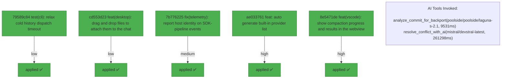

# Backport Agent — Detailed Run Report

> This file is generated automatically. It is intended for human analysts and
> AI reasoning models to assess agent performance, decision quality, and LLM behavior.

**Run timestamp**: 2026-07-26T14:03:07.712Z
**Models used**: fast=`mistral/mistral-code-agent-latest`  powerful=`poolside/poolside/laguna-s-2.1`
**Prompt log**: `/Users/rlemeill/Development/tea-ching-cline/.backport-agent/run-1785073653474.prompts.jsonl`

---

## Summary (PR body)

## Backport Agent — Sync Report

**Date**: 2026-07-26T14:03:07.712Z
**Upstream ref**: `main`
**Cut date**: `2026-06-27T00:00:00.000Z` 
**Fork ref**: `keypool-live`
**Sync branch**: `sync/upstream-main-2026-07-26-134913`

### Summary

- ✅ Applied: 5
- ⚠️ Needs human review: 0
- ⛔ Blocked (not attempted): 0
- 🔴 Commits were applied but run_validation was never called during this run (host-verified)

### 🛑 Host-side gate report

- 5 commit(s) were applied but run_validation was never invoked — this run requires human review regardless of per-commit statuses above.

### Applied commits

- `79589c84` [low] test(cli): relax cold history dispatch timeout (#12511)
- `cd553d23` [low] feat(desktop): drag and drop files to attach them to the chat (#12498)
- `7b776225` [medium] fix(telemetry): report host identity on SDK-pipeline events (#12503)
- `ae033761` [high] feat: auto generate built-in provider list (#12204) _(conflict resolved by agent)_
- `8e5471de` [high] feat(vscode): show compaction progress and results in the webview (#12487) _(conflict resolved by agent)_

### Agent decision log

- Applied low-risk commit 79589c84172261d70a73be5fa51644ec3b155081
- Applied low-risk commit cd553d2343aaf9f99d54a10d41b1904b777ee078
- Applied medium-risk commit 7b776225b926f0b9cad883bdf3a9dd5bac1fbb45
- Resolved conflict in sdk/packages/llms/src/providers/builtins.ts for commit ae033761ab1e4fecd81ddac43ba1bb74c1839869
- Resolved conflict in sdk/packages/llms/src/providers/builtins.ts for commit 8e5471de9c0a3a1a6c96606a2c93b383bcac54d3


---

## Agent Workflow Diagram

> Generated by the fast model from the run summary. Evaluate the agent's decision path.



---

## AI Sub-Agent Call Log (2 calls)

> Each entry is one sub-agent invocation. Review prompt/response pairs to assess
> reasoning quality, hallucinations, and decision accuracy.

### Call 1 / 2 — `analyze_commit_for_backport` ✅ OK

| Field | Value |
|---|---|
| **Timestamp** | 2026-07-26T13:49:09.783Z |
| **Tool** | `analyze_commit_for_backport` |
| **Model** | `poolside/poolside/laguna-s-2.1` |
| **Duration** | 9531 ms |
| **Tokens in** | 14810 |
| **Tokens out** | 218 |
| **Cost** | $0.000000 |

**Prompt sent to sub-agent:**

```
Commit SHA: 8e5471de9c0a3a1a6c96606a2c93b383bcac54d3
Commit message:
feat(vscode): show compaction progress and results in the webview (#12487)

Changed files (13):
apps/vscode/proto/cline/ui.proto
apps/vscode/src/sdk/message-translator.test.ts
apps/vscode/src/sdk/message-translator.ts
apps/vscode/src/sdk/sdk-compaction-coordinator.test.ts
apps/vscode/src/sdk/sdk-compaction-coordinator.ts
apps/vscode/src/sdk/sdk-compaction.ts
apps/vscode/src/shared/ExtensionMessage.ts
apps/vscode/src/shared/__tests__/getApiMetrics.test.ts
apps/vscode/src/shared/getApiMetrics.ts
apps/vscode/src/shared/proto-conversions/cline-message.ts
apps/vscode/webview-ui/src/components/chat/ChatRow.tsx
apps/vscode/webview-ui/src/components/chat/CompactionRow.tsx
apps/vscode/webview-ui/src/components/settings/sections/FeatureSettingsSection.tsx

Diff:
commit 8e5471de9c0a3a1a6c96606a2c93b383bcac54d3
Author: Saoud Rizwan <7799382+saoudrizwan@users.noreply.github.com>
Date:   Thu Jul 23 10:07:57 2026 -0700

    feat(vscode): show compaction progress and results in the webview (#12487)
    
    * feat(vscode): show compaction progress and results in the webview
    
    Port the CLI's compaction UX to the VS Code extension:
    
    - Translate the SDK's compaction status notices into a say:'compaction'
      divider row with a spinner while running, updated in place (same ts) to
      'Context compacted · x → y tokens · n → m messages' when done, matching
      the CLI's divider. Dangling dividers finalize as failed/cancelled when
      the turn errors or ends mid-compaction.
    - Manual /compact (button or slash command) drives the same divider from
      the compaction coordinator instead of plain info lines, capturing token
      counters from the SDK's status notices.
    - Drop raw status-notice slugs ('auto-compacting') that previously
      rendered as info rows.
    - Context window bar now reads the compacted size (tokensAfter) from a
      compaction row newer than the last API request, so it drops immediately
      after compaction instead of waiting for the next turn.
    - Fix the Auto Compact Strategy selector showing 'basic' when unset; the
      effective default is agentic (core defaults strategy ?? 'agentic').
    
    * fix(vscode): apply compaction shrink as a ratio to the context meter
    
    Address review feedback from #12487:
    
    - getLastApiReqTotalTokens: instead of substituting the compaction
      notice's tokensAfter (an SDK estimate on a different scale than
      provider-reported usage, which made the bar re-snap when the next
      request's real usage landed), scale the last provider-reported request
      total by the compaction's tokensAfter/tokensBefore ratio. Both
      counters come from the same estimator, so the ratio is scale-free.
      Multiple compactions since the last request compound. A completed
      divider without token counters leaves the total unscaled.
    - Suppress only the known-internal status notices explicitly
      (compaction-budget-adjusted); an unrecognized status notice now falls
      through to an info row so future notices surface instead of silently
      vanishing.
    - Cross-reference the two compaction-divider finalization paths (auto:
      translator finalizeDanglingCompaction; manual: coordinator catch) so
      terminal-state rule changes touch both.
    - Post state to the webview before re-throwing in the coordinator's
      failure path, consistent with the other terminal branches.
---
 apps/vscode/proto/cline/ui.proto                   |   1 +
 apps/vscode/src/sdk/message-translator.test.ts     | 119 +++++++++++++++++++
 apps/vscode/src/sdk/message-translator.ts          | 125 +++++++++++++++++++-
 .../src/sdk/sdk-compaction-coordinator.test.ts     |  61 ++++++++--
 apps/vscode/src/sdk/sdk-compaction-coordinator.ts  | 109 +++++++++++------
 apps/vscode/src/sdk/sdk-compaction.ts              |   6 +
 apps/vscode/src/shared/ExtensionMessage.ts         |  15 +++
 .../src/shared/__tests__/getApiMetrics.test.ts     | 129 +++++++++++++++++++++
 apps/vscode/src/shared/getApiMetrics.ts            |  37 +++++-
 .../src/shared/proto-conversions/cline-message.ts  |   2 +
 .../webview-ui/src/components/chat/ChatRow.tsx     |   3 +
 .../src/components/chat/CompactionRow.tsx          |  92 +++++++++++++++
 .../settings/sections/FeatureSettingsSection.tsx   |   2 +-
 13 files changed, 653 insertions(+), 48 deletions(-)

diff --git a/apps/vscode/proto/cline/ui.proto b/apps/vscode/proto/cline/ui.proto
index f1bcb82178..8a960129c9 100644
--- a/apps/vscode/proto/cline/ui.proto
+++ b/apps/vscode/proto/cline/ui.proto
@@ -74,6 +74,7 @@ enum ClineSay {
   SUBAGENT_STATUS = 34;
   USE_SUBAGENTS_SAY = 35;
   SUBAGENT_USAGE = 36;
+  COMPACTION = 37;
 }
 
 // Enum for ClineSayTool tool types
diff --git a/apps/vscode/src/sdk/message-translator.test.ts b/apps/vscode/src/sdk/message-translator.test.ts
index 2690ba4169..12d2b3dc46 100644
--- a/apps/vscode/src/sdk/message-translator.test.ts
+++ b/apps/vscode/src/sdk/message-translator.test.ts
@@ -1643,6 +1643,125 @@ describe("translateSessionEvent — agent_event notice", () => {
 		expect(result.messages[0].text).toBe("Retrying API request...")
 		expect(result.messages[0].partial).toBe(false)
 	})
+
+	function noticeEvent(message: string, metadata?: Record<string, unknown>): CoreSessionEvent {
+		return {
+			type: "agent_event",
+			payload: {
+				sessionId: "session-1",
+				event: {
+					type: "notice",
+					noticeType: "status",
+					displayRole: "status",
+					message,
+					metadata,
+				} as AgentEvent,
+			},
+		}
+	}
+
+	it("translates compaction status notices into a divider row updated in place", () => {
+		const state = new MessageTranslatorState()
+
+		const started = translateSessionEvent(
+			noticeEvent("auto-compacting", { kind: "auto_compaction", phase: "started" }),
+			state,
+		).messages
+		expect(started).toHaveLength(1)
+		expect(started[0].say).toBe("compaction")
+		expect(JSON.parse(started[0].text ?? "{}")).toMatchObject({ status: "started", mode: "auto" })
+
+		const completed = translateSessionEvent(
+			noticeEvent("auto-compacted", {
+				kind: "auto_compaction",
+				phase: "completed",
+				tokensBefore: 120_000,
+				tokensAfter: 40_000,
+				messagesBefore: 80,
+				messagesAfter: 12,
+			}),
+			state,
+		).messages
+		expect(completed).toHaveLength(1)
+		expect(completed[0].say).toBe("compaction")
+		// Same ts: the webview replaces the "started" spinner row in place.
+		expect(completed[0].ts).toBe(started[0].ts)
+		expect(JSON.parse(completed[0].text ?? "{}")).toMatchObject({
+			status: "completed",
+			mode: "auto",
+			tokensBefore: 120_000,
+			tokensAfter: 40_000,
+			messagesBefore: 80,
+			messagesAfter: 12,
+		})
+	})
+
+	it("suppresses known-internal status notices instead of rendering raw slugs", () => {
+		const state = new MessageTranslatorState()
+		const result = translateSessionEvent(
+			noticeEvent("compaction-budget-adjusted", { kind: "compaction_budget_emergency", actionCount: 1 }),
+			state,
+		)
+		expect(result.messages).toHaveLength(0)
+	})
+
+	it("renders an unrecognized status notice as an info row rather than dropping it", () => {
+		// Only the known-internal set is suppressed; a status notice added to the
+		// SDK later should surface (even as a raw slug) instead of vanishing.
+		const state = new MessageTranslatorState()
+		const result = translateSessionEvent(noticeEvent("some-future-status", { kind: "something_new" }), state)
+		expect(result.messages).toHaveLength(1)
+		expect(result.messages[0].say).toBe("info")
+		expect(result.messages[0].text).toBe("some-future-status")
+	})
+
+	it("finalizes a dangling compaction divider as failed when the turn errors", () => {
+		const state = new MessageTranslatorState()
+		const started = translateSessionEvent(
+			noticeEvent("auto-compacting", { kind: "auto_compaction", phase: "started" }),
+			state,
+		).messages
+
+		const errored = translateSessionEvent(
+			{
+				type: "agent_event",
+				payload: {
+					sessionId: "session-1",
+					event: { type: "error", error: new Error("boom"), recoverable: false } as unknown as AgentEvent,
+				},
+			},
+			state,
+		).messages
+
+		const divider = errored.find((message) => message.say === "compaction")
+		expect(divider).toBeDefined()
+		expect(divider?.ts).toBe(started[0].ts)
+		expect(JSON.parse(divider?.text ?? "{}")).toMatchObject({ status: "failed" })
+	})
+
+	it("finalizes a dangling compaction divider as cancelled when the turn ends", () => {
+		const state = new MessageTranslatorState()
+		const started = translateSessionEvent(
+			noticeEvent("auto-compacting", { kind: "auto_compaction", phase: "started" }),
+			state,
+		).messages
+
+		const done = translateSessionEvent(
+			{
+				type: "agent_event",
+				payload: {
+					sessionId: "session-1",
+					event: { type: "done", reason: "aborted" } as unknown as AgentEvent,
+				},
+			},
+			state,
+		).messages
+
+		const divider = done.find((message) => message.say === "compaction")
+		expect(divider).toBeDefined()
+		expect(divider?.ts).toBe(started[0].ts)
+		expect(JSON.parse(divider?.text ?? "{}")).toMatchObject({ status: "cancelled" })
+	})
 })
 
 // ---------------------------------------------------------------------------
diff --git a/apps/vscode/src/sdk/message-translator.ts b/apps/vscode/src/sdk/message-translator.ts
index 5e616e5728..c180f8475b 100644
--- a/apps/vscode/src/sdk/message-translator.ts
+++ b/apps/vscode/src/sdk/message-translator.ts
@@ -33,6 +33,7 @@ import type {
 	ClineApiReqInfo,
 	ClineAskUseMcpServer,
 	ClineAskUseSubagents,
+	ClineCompactionInfo,
 	ClineMessage,
 	ClineSay,
 	ClineSaySubagentStatus,
@@ -124,6 +125,14 @@ export class MessageTranslatorState {
 	private streamingToolName: string | undefined
 	/** Approved tool-call ids mapped to the approval row that should be updated in place. */
 	private approvedToolMessageTsByCallId = new Map<string, number>()
+	/**
+	 * The in-flight compaction divider's ts, so the "completed"/"skipped" notice
+	 * (or a turn error/abort) updates the same row in place. Deliberately NOT
+	 * cleared by the per-iteration `reset()`: the started/completed notices both
+	 * fire inside prepareTurn, before the next `iteration_start`, but an error
+	 * or abort mid-compaction must still be able to finalize the open row.
+	 */
+	private openCompactionTs: number | undefined
 	/** Tool calls rejected by the user; they should not render as red tool failures. */
 	private deniedToolApprovalsByCallId = new Map<string, { toolName: string; reason: string }>()
 	/**
@@ -154,6 +163,19 @@ export class MessageTranslatorState {
 		return this.minter.nextId()
 	}
 
+	/** Mint and remember the ts of an in-flight compaction divider. */
+	beginCompaction(): number {
+		this.openCompactionTs = this.nextTs()
+		return this.openCompactionTs
+	}
+
+	/** Take (and clear) the in-flight compaction divider's ts, if any. */
+	takeOpenCompactionTs(): number | undefined {
+		const ts = this.openCompactionTs
+		this.openCompactionTs = undefined
+		return ts
+	}
+
 	/** Get and increment for streaming text */
 	getStreamingTextTs(): number {
 		if (!this.streamingTextTs) {
@@ -923,6 +945,83 @@ export function buildToolApprovalAskMessage(toolName: string, input: unknown, ts
 /**
  * Translate an SDK AgentEvent into ClineMessage(s).
  */
+/**
+ * Extract a compaction divider payload from a status notice's metadata.
+ * Mirrors the CLI's parseCompactionNoticeMetadata
+ * (apps/cli/src/tui/utils/compaction-status.ts). Returns undefined for
+ * non-compaction status notices.
+ */
+export function parseCompactionNoticeMetadata(metadata: Record<string, unknown> | undefined): ClineCompactionInfo | undefined {
+	if (!metadata || (metadata.phase !== "started" && metadata.phase !== "completed" && metadata.phase !== "skipped")) {
+		return undefined
+	}
+	const kind = metadata.kind ?? metadata.reason
+	if (kind !== "auto_compaction" && kind !== "manual_compaction") {
+		return undefined
+	}
+	const mode = kind === "manual_compaction" ? "manual" : "auto"
+	if (metadata.phase === "started") {
+		return { status: "started", mode }
+	}
+	if (metadata.phase === "skipped") {
+		return { status: "skipped", mode }
+	}
+	return {
+		status: "completed",
+		mode,
+		tokensBefore: asFiniteNumber(metadata.tokensBefore),
+		tokensAfter: asFiniteNumber(metadata.tokensAfter),
+		messagesBefore: asFiniteNumber(metadata.messagesBefore),
+		messagesAfter: asFiniteNumber(metadata.messagesAfter),
+	}
+}
+
+function asFiniteNumber(value: unknown): number | undefined {
+	return typeof value === "number" && Number.isFinite(value) ? value : undefined
+}
+
+/**
+ * Status notices that are internal diagnostics with no user-facing copy — their
+ * `message` is a slug, not prose. Only these are suppressed; an unlisted status
+ * notice renders as an info row so it doesn't vanish silently. Keep in sync
+ * with the `emitStatusNotice` call sites in
+ * sdk/packages/core/src/extensions/context/compaction.ts (the compaction phase
+ * slugs are handled above via parseCompactionNoticeMetadata instead).
+ */
+const INTERNAL_STATUS_NOTICES = new Set(["compaction-budget-adjusted"])
+
+/** Build the say:"compaction" divider message for a compaction status payload. */
+export function buildCompactionMessage(info: ClineCompactionInfo, ts: number): ClineMessage {
+	return {
+		ts,
+		type: "say",
+		say: "compaction",
+		text: JSON.stringify(info),
+		partial: false,
+	}
+}
+
+/**
+ * Finalize a dangling "started" compaction divider when the turn ends without
+ * the completed/skipped notice (mid-compaction abort or error).
+ *
+ * This covers auto compaction (driven by turn events). Manual compaction runs
+ * outside a turn, so SdkCompactionCoordinator.runCompaction finalizes its own
+ * dangling divider in its catch block — if the terminal-state rules change
+ * here, change them there too.
+ */
+function finalizeDanglingCompaction(
+	state: MessageTranslatorState,
+	messages: ClineMessage[],
+	status: "cancelled" | "failed",
+): void {
+	const ts = state.takeOpenCompactionTs()
+	if (ts === undefined) {
+		return
+	}
+	messages.push(buildCompactionMessage({ status, mode: "auto" }, ts))
+}
+
 function translateAgentEvent(event: AgentEvent, state: MessageTranslatorState): ClineMessage[] {
 	const messages: ClineMessage[] = []
 
@@ -1401,7 +1500,28 @@ function translateAgentEvent(event: AgentEvent, state: MessageTranslatorState):
 		}
 
 		case "notice": {
-			// Agent notices are informational
+			// Status notices carry structured runtime progress. Compaction ones
+			// become a live divider row that is updated in place from "started" to
+			// its terminal state; the known-internal ones are diagnostics with no
+			// user-facing copy, so drop them explicitly. Any other status notice
+			// falls through to the info row below so a future one surfaces (as its
+			// raw slug) instead of silently vanishing.
+			if (event.noticeType === "status") {
+				const compaction = parseCompactionNoticeMetadata(event.metadata)
+				if (compaction) {
+					const ts =
+						compaction.status === "started"
+							? state.beginCompaction()
+							: (state.takeOpenCompactionTs() ?? state.nextTs())
+					messages.push(buildCompactionMessage(compaction, ts))
+					break
+				}
+				if (INTERNAL_STATUS_NOTICES.has(event.message ?? "")) {
+					break
+				}
+			}
+
+			// Non-status agent notices (and unrecognized status notices) are informational
 			messages.push({
 				ts: state.nextTs(),
 				type: "say",
@@ -1440,10 +1560,13 @@ function translateAgentEvent(event: AgentEvent, state: MessageTranslatorState):
 			// session-event coordinator sets on turn end (completed when the completion tool was
 			// used this turn, otherwise awaiting_followup), and the green "Task Completed" box
 			// comes from the say:"completion_result" emitted at the completion tool's content_end.
+			// A compaction divider still open here means the turn was aborted mid-compaction.
+			finalizeDanglingCompaction(state, messages, "cancelled")
 			break
 		}
 
 		case "error": {
+			finalizeDanglingCompaction(state, messages, "failed")
 			if (state.isSuppressedToolApprovalDenial(event.error)) {
 				break
 			}
diff --git a/apps/vscode/src/sdk/sdk-compaction-coordinator.test.ts b/apps/vscode/src/sdk/sdk-compaction-coordinator.test.ts
index fa1970f3db..35784f72f1 100644
--- a/apps/vscode/src/sdk/sdk-compaction-coordinator.test.ts
+++ b/apps/vscode/src/sdk/sdk-compaction-coordinator.test.ts
@@ -84,7 +84,7 @@ describe("SdkCompactionCoordinator", () => {
 		)
 	})
 
-	it("reports when the strategy declines to compact", async () => {
+	it("shows a skipped divider when the strategy declines to compact", async () => {
 		const activeSession = makeActiveSession()
 		const { coordinator, options } = makeCoordinator({ activeSession })
 		mockCreateContextCompactionPrepareTurn.mockReturnValueOnce(vi.fn().mockResolvedValue(undefined))
@@ -93,10 +93,11 @@ describe("SdkCompactionCoordinator", () => {
 
 		expect(mockCreateContextCompactionPrepareTurn).toHaveBeenCalledOnce()
 		expect(options.sessions.replaceActiveSession).not.toHaveBeenCalled()
-		expect(options.messages.appendAndEmit).toHaveBeenCalledWith(
-			[expect.objectContaining({ say: "info", text: "No compaction needed." })],
-			expect.anything(),
-		)
+		const rows = compactionRows(options)
+		expect(rows[0].info.status).toBe("started")
+		expect(rows[1].info.status).toBe("skipped")
+		// The terminal row updates the started row in place (same ts).
+		expect(rows[1].ts).toBe(rows[0].ts)
 	})
 
 	it("compacts and persists the sidecar without rebuilding the session", async () => {
@@ -118,10 +119,40 @@ describe("SdkCompactionCoordinator", () => {
 			messages: [{ role: "user", content: "summary" }],
 		})
 		expect(options.sessions.replaceActiveSession).not.toHaveBeenCalled()
-		expect(options.messages.appendAndEmit).toHaveBeenCalledWith(
-			[expect.objectContaining({ say: "info", text: "Compacted 3 messages to 1." })],
-			expect.anything(),
+		const rows = compactionRows(options)
+		expect(rows[0].info).toMatchObject({ status: "started", mode: "manual" })
+		expect(rows[1].info).toMatchObject({ status: "completed", mode: "manual", messagesBefore: 3, messagesAfter: 1 })
+		expect(rows[1].ts).toBe(rows[0].ts)
+	})
+
+	it("prefers the SDK's token counters from its status notice for the completed divider", async () => {
+		const activeSession = makeActiveSession()
+		const { coordinator, options } = makeCoordinator({ activeSession })
+		mockCreateContextCompactionPrepareTurn.mockReturnValueOnce(
+			vi.fn().mockImplementation((context: { emitStatusNotice?: (message: string, metadata?: unknown) => void }) => {
+				context.emitStatusNotice?.("compacted", {
+					kind: "manual_compaction",
+					phase: "completed",
+					tokensBefore: 25_000,
+					tokensAfter: 6_000,
+					messagesBefore: 42,
+					messagesAfter: 5,
+				})
+				return Promise.resolve({ messages: [{ role: "user", content: "summary" }] })
+			}),
 		)
+
+		await coordinator.compactTask()
+
+		const rows = compactionRows(options)
+		expect(rows[1].info).toMatchObject({
+			status: "completed",
+			mode: "manual",
+			tokensBefore: 25_000,
+			tokensAfter: 6_000,
+			messagesBefore: 42,
+			messagesAfter: 5,
+		})
 	})
 
 	it("does not append compaction status to a different active session", async () => {
@@ -129,7 +160,7 @@ describe("SdkCompactionCoordinator", () => {
 		const { coordinator, options } = makeCoordinator({ activeSession })
 		options.sessions.getActiveSession
 			.mockReturnValueOnce(activeSession)
-			.mockReturnValueOnce(makeActiveSession({ sessionId: "other-session" }))
+			.mockReturnValue(makeActiveSession({ sessionId: "other-session" }))
 		mockCreateContextCompactionPrepareTurn.mockReturnValueOnce(
 			vi.fn().mockResolvedValue({ messages: [{ role: "user", content: "summary" }] }),
 		)
@@ -151,6 +182,8 @@ describe("SdkCompactionCoordinator", () => {
 		await coordinator.compactTask()
 
 		expect(options.sessions.replaceActiveSession).not.toHaveBeenCalled()
+		const rows = compactionRows(options)
+		expect(rows[rows.length - 1].info.status).toBe("failed")
 		expect(options.messages.appendAndEmit).toHaveBeenCalledWith(
 			[expect.objectContaining({ say: "info", text: "Couldn't compact the conversation. Please try again." })],
 			expect.anything(),
@@ -165,6 +198,8 @@ describe("SdkCompactionCoordinator", () => {
 		await coordinator.compactTask()
 
 		expect(options.sessions.replaceActiveSession).not.toHaveBeenCalled()
+		const rows = compactionRows(options)
+		expect(rows[rows.length - 1].info.status).toBe("failed")
 		expect(options.messages.appendAndEmit).toHaveBeenCalledWith(
 			[expect.objectContaining({ say: "info", text: "Couldn't compact the conversation. Please try again." })],
 			expect.anything(),
@@ -172,6 +207,14 @@ describe("SdkCompactionCoordinator", () => {
 	})
 })
 
+/** Collect all say:"compaction" rows emitted through appendAndEmit, in order. */
+function compactionRows(options: { messages: { appendAndEmit: ReturnType<typeof vi.fn> } }) {
+	return options.messages.appendAndEmit.mock.calls
+		.flatMap((call) => call[0] as Array<{ say?: string; text?: string; ts: number }>)
+		.filter((message) => message.say === "compaction")
+		.map((message) => ({ ts: message.ts, info: JSON.parse(message.text ?? "{}") }))
+}
+
 interface MakeCoordinatorInput {
 	activeSession: ReturnType<typeof makeActiveSession> | undefined
 }
diff --git a/apps/vscode/src/sdk/sdk-compaction-coordinator.ts b/apps/vscode/src/sdk/sdk-compaction-coordinator.ts
index ec849cccfe..032ec8d460 100644
--- a/apps/vscode/src/sdk/sdk-compaction-coordinator.ts
+++ b/apps/vscode/src/sdk/sdk-compaction-coordinator.ts
@@ -14,10 +14,11 @@
 // fake "Conversation Summary" instead of compacting (CLINE-2503).
 
 import type { Message as SdkMessage } from "@cline/llms"
-import type { ClineMessage } from "@shared/ExtensionMessage"
+import type { ClineCompactionInfo, ClineMessage } from "@shared/ExtensionMessage"
 import type { Mode } from "@shared/storage/types"
 import type { StateManager } from "@/core/storage/StateManager"
 import { Logger } from "@/shared/services/Logger"
+import { buildCompactionMessage, parseCompactionNoticeMetadata } from "./message-translator"
 import { compactSessionMessages } from "./sdk-compaction"
 import type { SdkMessageCoordinator } from "./sdk-message-coordinator"
 import type { SdkSessionConfigBuilder } from "./sdk-session-config-builder"
@@ -101,38 +102,73 @@ export class SdkCompactionCoordinator {
 		const mode = this.getCurrentMode()
 		const config = await this.options.sessionConfigBuilder.build({ cwd, mode })
 
-		const result = await compactSessionMessages({
-			config: {
-				providerConfig: config.providerConfig,
-				providerId: config.providerId,
-				modelId: config.modelId,
-				knownModels: config.knownModels,
-				compaction: config.compaction,
-				logger: config.logger,
-				telemetry: config.telemetry,
-			},
-			sessionId,
-			messages,
-		})
+		// A live divider row, updated in place (same ts) from "started" to its
+		// terminal state — the same UX as the CLI's compaction divider.
+		const compactionTs = Date.now()
+		this.emitCompactionRow({ status: "started", mode: "manual" }, compactionTs, sessionId)
+		await this.options.postStateToWebview()
 
-		if (!result.compacted) {
-			this.emitInfo("No compaction needed.", sessionId)
+		// The SDK reports the compaction's token/message counters through its
+		// status notices; capture the terminal one for the final divider.
+		let noticeInfo: ClineCompactionInfo | undefined
+		try {
+			const result = await compactSessionMessages({
+				config: {
+					providerConfig: config.providerConfig,
+					providerId: config.providerId,
+					modelId: config.modelId,
+					knownModels: config.knownModels,
+					compaction: config.compaction,
+					logger: config.logger,
+					telemetry: config.telemetry,
+				},
+				sessionId,
+				messages,
+				emitStatusNotice: (_message, metadata) => {
+					const parsed = parseCompactionNoticeMetadata(metadata)
+					if (parsed && parsed.status !== "started") {
+						noticeInfo = { ...parsed, mode: "manual" }
+					}
+				},
+			})
+
+			if (!result.compacted) {
+				this.emitCompactionRow(noticeInfo ?? { status: "skipped", mode: "manual" }, compactionTs, sessionId)
+				await this.options.postStateToWebview()
+				return
+			}
+
+			if (!result.compactionState) {
+				throw new Error("Compaction did not return durable state.")
+			}
+			const persisted = await sdkHost.updateSessionCompactionState(sessionId, result.compactionState)
+			if (!persisted.updated) {
+				throw new Error("Compaction sidecar could not be persisted.")
+			}
+
+			this.emitCompactionRow(
+				noticeInfo?.status === "completed"
+					? noticeInfo
+					: {
+							status: "completed",
+							mode: "manual",
+							messagesBefore,
+							messagesAfter: result.messages.length,
+						},
+				compactionTs,
+				sessionId,
+			)
 			await this.options.postStateToWebview()
-			return
-		}
 
-		if (!result.compactionState) {
-			throw new Error("Compaction did not return durable state.")
-		}
-		const persisted = await sdkHost.updateSessionCompactionState(sessionId, result.compactionState)
-		if (!persisted.updated) {
-			throw new Error("Compaction sidecar could not be persisted.")
+			Logger.log(`[SdkController] Compacted session ${sessionId}: ${messagesBefore} -> ${result.messages.length} messages`)
+		} catch (error) {
+			// Manual-mode counterpart of the translator's finalizeDanglingCompaction
+			// (message-translator.ts), which handles auto compaction from turn
+			// events — keep the terminal-state rules of the two in sync.
+			this.emitCompactionRow({ status: "failed", mode: "manual" }, compactionTs, sessionId)
+			await this.options.postStateToWebview()
+			throw error
 		}
-
-		this.emitInfo(this.formatCompactionStatus(messagesBefore, result.messages.length), sessionId)
-		await this.options.postStateToWebview()
-
-		Logger.log(`[SdkController] Compacted session ${sessionId}: ${messagesBefore} -> ${result.messages.length} messages`)
 	}
 
 	private getCurrentMode(): Mode {
@@ -140,12 +176,17 @@ export class SdkCompactionCoordinator {
 		return m === "plan" ? m : "act"
 	}
 
-	private formatCompactionStatus(messagesBefore: number, messagesAfter: number): string {
-		// Mirrors apps/cli/src/tui/utils/compaction-status.ts wording.
-		if (messagesBefore === messagesAfter) {
-			return `Compacted context; message count stayed at ${messagesAfter}.`
+	/** Append or update-in-place (same ts) the compaction divider row. */
+	private emitCompactionRow(info: ClineCompactionInfo, ts: number, sessionId: string): void {
+		const activeSessionId = this.options.sessions.getActiveSession()?.sessionId
+		if (activeSessionId !== sessionId) {
+			Logger.warn(`[SdkController] compactTask: skipped compaction row for inactive session ${sessionId}`)
+			return
 		}
-		return `Compacted ${messagesBefore} messages to ${messagesAfter}.`
+		this.options.messages.appendAndEmit([buildCompactionMessage(info, ts)], {
+			type: "status",
+			payload: { sessionId, status: "running" },
+		})
 	}
 
 	private emitInfo(text: string, sessionId?: string): void {
diff --git a/apps/vscode/src/sdk/sdk-compaction.ts b/apps/vscode/src/sdk/sdk-compaction.ts
index 175778eb06..c7643901e6 100644
--- a/apps/vscode/src/sdk/sdk-compaction.ts
+++ b/apps/vscode/src/sdk/sdk-compaction.ts
@@ -34,6 +34,11 @@ export interface CompactSessionMessagesInput {
 	sessionId: string
 	/** The conversation transcript to compact (SDK message shape). */
 	messages: SdkMessage[]
+	/**
+	 * Receives the SDK's compaction status notices (started/completed/skipped
+	 * with token + message counters) so the caller can drive progress UI.
+	 */
+	emitStatusNotice?: (message: string, metadata?: Record<string, unknown>) => void
 }
 
 export interface CompactSessionMessagesResult {
@@ -104,6 +109,7 @@ export async function compactSessionMessages(input: CompactSessionMessagesInput)
 			provider: input.config.providerId,
 			info: compactionModelInfo,
 		},
+		emitStatusNotice: input.emitStatusNotice,
 	})
 	if (!result) {
 		return { compacted: false, messages: input.messages }
diff --git a/apps/vscode/src/shared/ExtensionMessage.ts b/apps/vscode/src/shared/ExtensionMessage.ts
index 0a26ae7165..f3ab226dfd 100644
--- a/apps/vscode/src/shared/ExtensionMessage.ts
+++ b/apps/vscode/src/shared/ExtensionMessage.ts
@@ -257,6 +257,7 @@ export type ClineSay =
 	| "use_subagents"
 	| "subagent_usage"
 	| "conditional_rules_applied"
+	| "compaction" // context compaction progress/result divider
 
 export interface ClineSayTool {
 	tool:
@@ -376,6 +377,20 @@ export interface ClineApiReqInfo {
 	}
 }
 
+/**
+ * JSON payload of a say:"compaction" message. Mirrors the CLI's compaction
+ * divider (apps/cli/src/tui/utils/compaction-status.ts): a "started" row shows
+ * a spinner and is later updated in place (same ts) to its terminal status.
+ */
+export interface ClineCompactionInfo {
+	status: "started" | "completed" | "skipped" | "failed" | "cancelled"
+	mode: "auto" | "manual"
+	tokensBefore?: number
+	tokensAfter?: number
+	messagesBefore?: number
+	messagesAfter?: number
+}
+
 export interface ClineSubagentUsageInfo {
 	source: "subagents"
 	tokensIn: number
diff --git a/apps/vscode/src/shared/__tests__/getApiMetrics.test.ts b/apps/vscode/src/shared/__tests__/getApiMetrics.test.ts
index 39d60c5333..e18c59a896 100644
--- a/apps/vscode/src/shared/__tests__/getApiMetrics.test.ts
+++ b/apps/vscode/src/shared/__tests__/getApiMetrics.test.ts
@@ -100,4 +100,133 @@ describe("getLastApiReqTotalTokens", () => {
 		const total = getLastApiReqTotalTokens(messages)
 		assert.equal(total, 23)
 	})
+
+	it("scales the last request by the shrink ratio of a compaction completed after it", () => {
+		// The compaction counters are the SDK's estimate — a different scale from
+		// the provider-reported request total. Only the ratio carries over.
+		const messages: ClineMessage[] = [
+			{
+				ts: 1,
+				type: "say",
+				say: "api_req_started",
+				text: JSON.stringify({ tokensIn: 90_000, tokensOut: 5_000, cacheReads: 5_000 }),
+			},
+			{
+				ts: 2,
+				type: "say",
+				say: "compaction",
+				text: JSON.stringify({ status: "completed", mode: "manual", tokensBefore: 200_000, tokensAfter: 50_000 }),
+			},
+		]
+
+		const total = getLastApiReqTotalTokens(messages)
+		assert.equal(total, 25_000)
+	})
+
+	it("compounds multiple compactions completed since the last request", () => {
+		const messages: ClineMessage[] = [
+			{
+				ts: 1,
+				type: "say",
+				say: "api_req_started",
+				text: JSON.stringify({ tokensIn: 100_000 }),
+			},
+			{
+				ts: 2,
+				type: "say",
+				say: "compaction",
+				text: JSON.stringify({ status: "completed", mode: "manual", tokensBefore: 200_000, tokensAfter: 100_000 }),
+			},
+			{
+				ts: 3,
+				type: "say",
+				say: "compaction",
+				text: JSON.stringify({ status: "completed", mode: "manual", tokensBefore: 100_000, tokensAfter: 50_000 }),
+			},
+		]
+
+		const total = getLastApiReqTotalTokens(messages)
+		assert.equal(total, 25_000)
+	})
+
+	it("leaves the request total unscaled when a completed compaction lacks token counters", () => {
+		// The coordinator's fallback divider carries only message counts.
+		const messages: ClineMessage[] = [
+			{
+				ts: 1,
+				type: "say",
+				say: "api_req_started",
+				text: JSON.stringify({ tokensIn: 40_000, tokensOut: 2_000 }),
+			},
+			{
+				ts: 2,
+				type: "say",
+				say: "compaction",
+				text: JSON.stringify({ status: "completed", mode: "manual", messagesBefore: 40, messagesAfter: 6 }),
+			},
+		]
+
+		const total = getLastApiReqTotalTokens(messages)
+		assert.equal(total, 42_000)
+	})
+
+	it("returns 0 when a compaction completed but no request preceded it", () => {
+		const messages: ClineMessage[] = [
+			{
+				ts: 1,
+				type: "say",
+				say: "compaction",
+				text: JSON.stringify({ status: "completed", mode: "manual", tokensBefore: 95_000, tokensAfter: 30_000 }),
+			},
+		]
+
+		const total = getLastApiReqTotalTokens(messages)
+		assert.equal(total, 0)
+	})
+
+	it("ignores compaction rows without a usable compacted size", () => {
+		const messages: ClineMessage[] = [
+			{
+				ts: 1,
+				type: "say",
+				say: "api_req_started",
+				text: JSON.stringify({ tokensIn: 11, tokensOut: 7, cacheWrites: 2, cacheReads: 3 }),
+			},
+			{
+				ts: 2,
+				type: "say",
+				say: "compaction",
+				text: JSON.stringify({ status: "started", mode: "auto" }),
+			},
+			{
+				ts: 3,
+				type: "say",
+				say: "compaction",
+				text: JSON.stringify({ status: "failed", mode: "auto" }),
+			},
+		]
+
+		const total = getLastApiReqTotalTokens(message
... [truncated]

Output the JSON object now.
```

**Response received:**

````
```json
{
  "summary": "Adds compaction progress/results display in the webview via a new 'compaction' divider row, updated in place from started to terminal state. Touches message translation, coordinator, metrics, and UI components.",
  "keyChanges": [
    "New ClineSay 'compaction' type and ClineCompactionInfo interface",
    "Message translator emits/compiles/finalizes compaction divider rows",
    "SdkCompactionCoordinator drives divider via emitStatusNotice callback",
    "getApiMetrics scales context meter by compaction shrink ratio",
    "CompactionRow component and ChatRow rendering added"
  ],
  "backportComplexity": "moderate",
  "semanticRiskFactors": [
    "Adds new ClineSay enum value requiring proto and type sync",
    "Changes compaction UX from info rows to structured divider messages",
    "Modifies getApiMetrics token scaling logic with ratio compounding"
  ],
  "recommendation": "apply-with-care"
}
```
````

---

### Call 2 / 2 — `resolve_conflict_with_ai` ✅ OK

| Field | Value |
|---|---|
| **Timestamp** | 2026-07-26T14:00:06.310Z |
| **Tool** | `resolve_conflict_with_ai` |
| **Model** | `mistral/devstral-latest` |
| **Duration** | 261298 ms |
| **Tokens in** | 22741 |
| **Tokens out** | 14092 |
| **Cost** | $0.000000 |

**Prompt sent to sub-agent:**

```
Resolve the merge conflict in file: sdk/packages/llms/src/providers/builtins.ts
Upstream commit message: feat: auto generate built-in provider list (#12204)

Fork customisation context:
Custom provider list for keypoollive

--- BASE (common ancestor) ---
import {
	type GatewayModelCapability,
	type GatewayModelDefinition,
	type GatewayProviderManifest,
	type GatewayProviderMetadata,
	type GatewayProviderSettings,
	getClineEnvironmentConfig,
	type JsonValue,
	type ProviderCapability,
	type ProviderConfigField,
} from "@cline/shared";
import { GENERATED_PROVIDER_MODELS } from "../catalog/catalog.generated";
import { getGeneratedModelsForProvider } from "../catalog/catalog.generated-access";
import {
	isCanonicalModelIdForAliasRules,
	preferCanonicalModelIds,
	VERCEL_OPENROUTER_MODEL_ID_ALIAS_RULES,
} from "../catalog/model-id-aliases";
import type {
	ModelCollection,
	ModelInfo,
	ProviderClient,
	ProviderProtocol,
} from "../catalog/types";
import {
	ClineNotSubscribedError,
	ClineOrgIndividualInferenceSubscriptionError,
	ClinePassLimitError,
	extractClinePassLimitMessage,
	isClineNotSubscribedMessage,
	isClineOrgIndividualInferenceSubscriptionMessage,
} from "./errors";
import { filterOpenAICodexModels } from "./openai-codex-models";
import {
	ANTHROPIC_AND_QWEN_CACHE_ROUTING_METADATA,
	ANTHROPIC_ROUTING_METADATA,
	QWEN_CACHE_ROUTING_METADATA,
} from "./routing/anthropic-compatible";
import { GLM_THINKING_ROUTING_METADATA } from "./routing/glm-thinking";
import { MINIMAX_THINKING_ROUTING_METADATA } from "./routing/minimax-thinking";

export const DEFAULT_INTERNAL_OCA_BASE_URL =
	"https://code-internal.aiservice.us-chicago-1.oci.oraclecloud.com/20250206/app/litellm";
export const DEFAULT_EXTERNAL_OCA_BASE_URL =
	"https://code.aiservice.us-chicago-1.oci.oraclecloud.com/20250206/app/litellm";
const CLINE_DEFAULT_MODEL_ID = "anthropic/claude-sonnet-4.6";
const CLINE_PASS_PROVIDER_ID = "cline-pass";
const OPENAI_CODEX_DEFAULT_MODEL_ID = "gpt-5.4";
const OPENROUTER_STICKY_SESSION_METADATA: GatewayProviderMetadata = {
	stickySession: {
		transport: "json-body",
		field: "session_id",
		metadataKey: "sessionId",
	},
};

/**
 * Context window requested from Ollama when neither the resolved model nor
 * the user's configuration supplies one. Matches the pre-SDK-migration
 * handler default; deliberately larger than Ollama's 4096 server default,
 * which cannot fit Cline's agentic prompts. Single source of truth — the
 * vendor, the VS Code session factory, and the settings UI all import this.
 */
export const OLLAMA_DEFAULT_CONTEXT_WINDOW = 32768;

export type ProviderFamily =
	| "keypoollive"
	| "openai"
	| "openai-compatible"
	| "anthropic"
	| "google"
	| "vertex"
	| "bedrock"
	| "mistral"
	| "cohere"
	| "poolside"
	| "claude-code"
	| "openai-codex"
	| "opencode"
	| "dify"
	| "ollama"
	| "sap-ai-core";

export interface BuiltinSpec {
	id: string;
	name: string;
	description: string;
	family: ProviderFamily;
	protocol?: ProviderProtocol;
	client?: ProviderClient;
	capabilities?: ProviderCapability[];
	popular?: number;
	modelsProviderId?: string;
	defaultModelId?: string;
	modelsFactory?: () => Record<string, ModelInfo>;
	env?: readonly ("browser" | "node")[];
	apiKeyEnv?: readonly string[];
	modelsSourceUrl?: string;
	docsUrl?: string;
	defaults?: GatewayProviderSettings;
	configFields?: readonly ProviderConfigField[];
	metadata?: GatewayProviderMetadata;
}

const API_KEY_FIELD: ProviderConfigField = {
	path: "apiKey",
	label: "API Key",
	type: "password",
	placeholder: "Enter API key...",
	description: "API key issued by the provider.",
	secret: true,
};

const BASE_URL_FIELD: ProviderConfigField = {
	path: "baseUrl",
	label: "Base URL",
	type: "url",
	placeholder: "https://...",
	description: "Base endpoint used for provider requests.",
};

const VERTEX_CONFIG_FIELDS: readonly ProviderConfigField[] = [
	{
		path: "gcp.projectId",
		label: "Google Cloud Project ID",
		type: "text",
		placeholder: "my-gcp-project",
		description: "Google Cloud project that owns the Vertex AI resources.",
		required: true,
	},
	{
		path: "gcp.region",
		label: "Vertex Region",
		type: "text",
		placeholder: "us-central1",
		description: "Vertex AI location to run models in.",
		defaultValue: "us-central1",
	},
	{
		...API_KEY_FIELD,
		label: "API Key",
		description:
			"Optional Google API key for Gemini models. Vertex Anthropic models use Google Cloud credentials.",
	},
];

const BEDROCK_CONFIG_FIELDS: readonly ProviderConfigField[] = [
	{
		path: "aws.authentication",
		label: "Authentication",
		type: "select",
		description: "Credential source for Amazon Bedrock requests.",
		options: [
			{ label: "AWS SDK / IAM", value: "iam" },
			{ label: "AWS Profile", value: "profile" },
			{ label: "API Key", value: "api-key" },
		],
		defaultValue: "iam",
	},
	{
		path: "aws.region",
		label: "AWS Region",
		type: "text",
		placeholder: "us-east-1",
		description: "AWS region for Bedrock runtime requests.",
	},
	{
		path: "aws.profile",
		label: "AWS Profile",
		type: "text",
		placeholder: "default",
		description: "Named AWS profile when using profile authentication.",
	},
	{
		path: "aws.accessKey",
		label: "Access Key ID",
		type: "password",
		placeholder: "AKIA...",
		secret: true,
	},
	{
		path: "aws.secretKey",
		label: "Secret Access Key",
		type: "password",
		secret: true,
	},
	{
		path: "aws.sessionToken",
		label: "Session Token",
		type: "password",
		secret: true,
	},
	{
		path: "apiKey",
		label: "Bedrock API Key",
		type: "password",
		description: "Optional Bedrock bearer token for API key authentication.",
		secret: true,
	},
	{
		path: "aws.endpoint",
		label: "Endpoint URL",
		type: "url",
		placeholder: "https://bedrock-runtime.us-east-1.amazonaws.com",
		description: "Optional custom Bedrock runtime endpoint.",
	},
	{
		path: "aws.useCrossRegionInference",
		label: "Cross-Region Inference",
		type: "boolean",
	},
	{
		path: "aws.useGlobalInference",
		label: "Global Inference",
		type: "boolean",
	},
	{
		path: "aws.usePromptCache",
		label: "Prompt Cache",
		type: "boolean",
	},
];

const OCA_CONFIG_FIELDS: readonly ProviderConfigField[] = [
	{
		path: "oca.mode",
		label: "OCA Mode",
		type: "select",
		options: [
			{ label: "External", value: "external" },
			{ label: "Internal", value: "internal" },
		],
		defaultValue: "external",
	},
	API_KEY_FIELD,
	{
		path: "oca.usePromptCache",
		label: "Prompt Cache",
		type: "boolean",
	},
];

const QWEN_CONFIG_FIELDS: readonly ProviderConfigField[] = [
	API_KEY_FIELD,
	BASE_URL_FIELD,
	{
		path: "apiLine",
		label: "API Line",
		type: "select",
		description: "Regional API line for Qwen routing.",
		options: [
			{ label: "International", value: "international" },
			{ label: "China", value: "china" },
		],
	},
];

function defaultConfigFieldsForSpec(
	spec: BuiltinSpec,
): readonly ProviderConfigField[] {
	const fields: ProviderConfigField[] = [];
	if (spec.apiKeyEnv?.length) {
		fields.push(API_KEY_FIELD);
	}
	if (spec.defaults?.baseUrl?.trim()) {
		fields.push(BASE_URL_FIELD);
	}
	return fields;
}

function cloneModels(
	models: Record<string, ModelInfo>,
): Record<string, ModelInfo> {
	return Object.fromEntries(
		Object.entries(models).map(([id, info]) => [id, { ...info }]),
	);
}

function uniqueCapabilities(
	capabilities: readonly ProviderCapability[] | undefined,
): ProviderCapability[] | undefined {
	if (!capabilities?.length) return undefined;
	return [...new Set(capabilities)];
}

function getProviderCapabilities(
	spec: BuiltinSpec,
): ProviderCapability[] | undefined {
	return uniqueCapabilities([
		...(spec.capabilities ?? []),
		...(spec.popular !== undefined ? (["popular"] as const) : []),
	]);
}

function getProviderMetadata(
	spec: BuiltinSpec,
): GatewayProviderMetadata | undefined {
	const configFields = spec.configFields ?? defaultConfigFieldsForSpec(spec);
	const metadata: GatewayProviderMetadata = {
		...spec.metadata,
		configFields,
	};
	if (spec.popular !== undefined) {
		metadata.popularRank = spec.popular;
	}
	return metadata;
}

function generatedModels(providerId: string): Record<string, ModelInfo> {
	return cloneModels(getGeneratedModelsForProvider(providerId));
}

function firstGeneratedModelId(providerId: string): string {
	// Use the catalog's authored order, not release-date order. The cline-pass
	// block mirrors the recommended-models endpoint, which lists the intended
	// default subscription model first — the newest model is not necessarily a
	// safe default.
	const generatedModelList = Object.keys(
		GENERATED_PROVIDER_MODELS.providers[providerId] ?? {},
	);
	if (!generatedModelList.length) {
		return "";
	}
	return generatedModelList[0];
}

function pickAnthropicModel(match: (id: string) => boolean): ModelInfo {
	const entry = Object.entries(generatedModels("anthropic")).find(([id]) =>
		match(id),
	);
	if (entry) {
		return entry[1];
	}
	return {
		id: "sonnet",
		name: "Claude Sonnet",
		capabilities: ["streaming", "reasoning"],
	};
}

function buildClaudeCodeModels(): Record<string, ModelInfo> {
	function toClaudeCodeModel(id: "opus" | "sonnet" | "haiku"): ModelInfo {
		const source =
			id === "opus"
				? pickAnthropicModel((modelId) => modelId.includes("opus"))
				: id === "haiku"
					? pickAnthropicModel((modelId) => modelId.includes("haiku"))
					: pickAnthropicModel((modelId) => modelId.includes("sonnet"));
		return {
			...source,
			id,
			name: `Claude ${id.charAt(0).toUpperCase()}${id.slice(1)}`,
		};
	}

	return {
		opus: toClaudeCodeModel("opus"),
		sonnet: toClaudeCodeModel("sonnet"),
		haiku: toClaudeCodeModel("haiku"),
	};
}

function buildOpenAICodexModels(): Record<string, ModelInfo> {
	return filterOpenAICodexModels(generatedModels("openai-native"));
}

function buildClineModels(): Record<string, ModelInfo> {
	// Cline is OpenRouter-backed generally, but its recommended-model endpoint
	// can return Vercel-style ids. Include those exact ids so runtime metadata
	// resolves without adding duplicate OpenRouter aliases to the picker.
	const vercelAliasModels = Object.fromEntries(
		Object.entries(generatedModels("vercel-ai-gateway")).filter(([modelId]) =>
			isCanonicalModelIdForAliasRules(
				modelId,
				VERCEL_OPENROUTER_MODEL_ID_ALIAS_RULES,
			),
		),
	);
	return preferCanonicalModelIds(
		{
			...generatedModels("openrouter"),
			...vercelAliasModels,
		},
		VERCEL_OPENROUTER_MODEL_ID_ALIAS_RULES,
	);
}

function fallbackModelInfo(id: string, spec?: BuiltinSpec): ModelInfo {
	const info: ModelInfo = {
		id,
		name: id,
	};
	if (spec?.family === "openai-compatible") {
		info.contextWindow = 128_000;
		info.maxInputTokens = 128_000;
		info.capabilities = ["streaming", "tools", "images"];
	}
	if (spec?.id === "qwen" || spec?.id === "qwen-code") {
		info.family = "qwen";
		info.capabilities = ["prompt-cache"];
	}
	return info;
}

function modelInfoToGateway(
	providerId: string,
	info: ModelInfo,
): GatewayModelDefinition {
	const capabilities = new Set<GatewayModelCapability>(["text"]);
	for (const cap of info.capabilities ?? []) {
		switch (cap) {
			case "tools":
				capabilities.add("tools");
				break;
			case "reasoning":
				capabilities.add("reasoning");
				break;
			case "prompt-cache":
				capabilities.add("prompt-cache");
				break;
			case "images":
				capabilities.add("images");
				break;
			case "structured_output":
				capabilities.add("structured-output");
				break;
		}
	}
	const metadata: Record<string, JsonValue | undefined> = {};
	if (info.family) {
		metadata.family = info.family;
	}
	if (info.pricing) {
		metadata.pricing = info.pricing;
	}
	if (info.status) {
		metadata.status = info.status;
	}
	if (info.releaseDate) {
		metadata.releaseDate = info.releaseDate;
	}
	if (typeof info.metadata?.reasoningDefaultOn === "boolean") {
		metadata.reasoningDefaultOn = info.metadata.reasoningDefaultOn;
	}
	return {
		id: info.id,
		name: info.name ?? info.id,
		providerId,
		description: info.description,
		contextWindow: info.contextWindow,
		maxInputTokens: info.maxInputTokens,
		maxOutputTokens: info.maxTokens,
		capabilities: [...capabilities],
		metadata: Object.keys(metadata).length > 0 ? metadata : undefined,
	};
}

function inferProtocol(spec: BuiltinSpec): ProviderProtocol {
	if (spec.client === "openai") {
		return "openai-responses";
	}
	switch (spec.family) {
		case "openai":
			return "openai-responses";
		case "anthropic":
		case "bedrock":
			return "anthropic";
		case "google":
		case "vertex":
			return "gemini";
		default:
			return "openai-chat";
	}
}

function inferClient(spec: BuiltinSpec): ProviderClient {
	if (spec.protocol === "openai-responses") {
		return "openai";
	}
	switch (spec.family) {
		case "openai":
			return "openai";
		case "anthropic":
			return "anthropic";
		case "google":
			return "gemini";
		case "vertex":
			return "vertex";
		case "bedrock":
			return "bedrock";
		case "mistral":
		case "claude-code":
		case "openai-codex":
		case "opencode":
		case "dify":
		case "ollama":
		case "sap-ai-core":
			return "ai-sdk-community";
		default:
			return "openai-compatible";
	}
}

function createClineLikeSpec(
	input: Pick<BuiltinSpec, "id" | "name" | "defaultModelId"> &
		Partial<
			Pick<
				BuiltinSpec,
				| "description"
				| "popular"
				| "modelsProviderId"
				| "modelsFactory"
				| "metadata"
				| "defaults"
			>
		>,
): BuiltinSpec {
	return {
		id: input.id,
		name: input.name,
		description: input.description ?? "Cline API endpoint",
		family: "openai-compatible",
		popular: input.popular,
		capabilities: ["reasoning", "prompt-cache", "tools", "oauth"],
		modelsProviderId: input.modelsProviderId,
		modelsFactory: input.modelsFactory,
		defaultModelId: input.defaultModelId,
		apiKeyEnv: ["CLINE_API_KEY"],
		defaults: {
			get baseUrl(): string {
				return `${getClineEnvironmentConfig().apiBaseUrl}/api/v1`;
			},
			...input.defaults,
		},
		metadata: {
			...ANTHROPIC_AND_QWEN_CACHE_ROUTING_METADATA,
			...input.metadata,
		},
	};
}

async function handleClineResponseError(
	response: Response,
	providerId: string,
): Promise<void> {
	if (response.status < 400) {
		return;
	}

	const body = await response
		.clone()
		.text()
		.catch(() => "");

	if (isClineOrgIndividualInferenceSubscriptionMessage(body)) {
		throw new ClineOrgIndividualInferenceSubscriptionError(providerId);
	}

	const clinePassLimitMessage = extractClinePassLimitMessage(body);
	if (clinePassLimitMessage) {
		throw new ClinePassLimitError(clinePassLimitMessage, providerId);
	}

	if (isClineNotSubscribedMessage(body)) {
		throw new ClineNotSubscribedError(providerId);
	}
}

const cline = createClineLikeSpec({
	id: "cline",
	name: "Cline Usage-Billing",
	popular: 1,
	modelsFactory: buildClineModels,
	defaultModelId: CLINE_DEFAULT_MODEL_ID,
	defaults: {
		options: {
			onResponseError: async (response: Response) => {
				await handleClineResponseError(response, "cline");
			},
		},
	},
});

const clinePass = createClineLikeSpec({
	id: CLINE_PASS_PROVIDER_ID,
	name: "ClinePass",
	popular: 2,
	description: "Cline API endpoint with ClinePass models",
	modelsProviderId: CLINE_PASS_PROVIDER_ID,
	defaultModelId: firstGeneratedModelId(CLINE_PASS_PROVIDER_ID),
	metadata: { usageCostDisplay: "subscription" },
	defaults: {
		options: {
			onResponseError: async (response: Response) => {
				await handleClineResponseError(response, CLINE_PASS_PROVIDER_ID);
			},
		},
	},
});

const OPENAI_COMPATIBLE_SPECS: BuiltinSpec[] = [
	{
		id: "openai-compatible",
		name: "OpenAI Compatible",
		description: "OpenAI-compatible chat completions endpoint",
		family: "openai-compatible",
		popular: 35,
		capabilities: ["tools"],
		defaultModelId: "gpt-4o",
		apiKeyEnv: ["OPENAI_API_KEY"],
		defaults: { baseUrl: "https://api.openai.com/v1" },
	},
	cline,
	clinePass,
	{
		id: "deepseek",
		name: "DeepSeek",
		description: "Advanced AI models with reasoning capabilities",
		family: "openai-compatible",
		popular: 10,
		capabilities: ["reasoning", "prompt-cache"],
		defaultModelId: "deepseek-v4-flash",
		apiKeyEnv: ["DEEPSEEK_API_KEY"],
		defaults: { baseUrl: "https://api.deepseek.com/v1" },
	},
	{
		id: "xai",
		name: "xAI",
		description: "Creator of Grok AI assistant",
		family: "openai-compatible",
		capabilities: ["reasoning"],
		defaultModelId: "grok-4.20-0309-non-reasoning",
		apiKeyEnv: ["XAI_API_KEY"],
		defaults: { baseUrl: "https://api.x.ai/v1" },
	},
	{
		id: "together",
		name: "Together AI",
		description: "Fast inference for open-source models",
		family: "openai-compatible",
		capabilities: ["reasoning"],
		defaultModelId: "Qwen/Qwen3.5-397B-A17B",
		apiKeyEnv: ["TOGETHER_API_KEY"],
		defaults: { baseUrl: "https://api.together.xyz/v1" },
	},
	{
		id: "fireworks",
		name: "Fireworks AI",
		description: "High-performance inference platform",
		family: "openai-compatible",
		defaultModelId: "accounts/fireworks/models/kimi-k2p6",
		apiKeyEnv: ["FIREWORKS_API_KEY"],
		defaults: { baseUrl: "https://api.fireworks.ai/inference/v1" },
	},
	{
		id: "groq",
		name: "Groq",
		description: "Ultra-fast LPU inference",
		family: "openai-compatible",
		defaultModelId: "moonshotai/kimi-k2-instruct-0905",
		apiKeyEnv: ["GROQ_API_KEY"],
		defaults: { baseUrl: "https://api.groq.com/openai/v1" },
	},
	{
		id: "cerebras",
		name: "Cerebras",
		description: "Fast inference on Cerebras wafer-scale chips",
		family: "openai-compatible",
		defaultModelId: "zai-glm-4.7",
		apiKeyEnv: ["CEREBRAS_API_KEY"],
		defaults: { baseUrl: "https://api.cerebras.ai/v1" },
	},
	{
		id: "sambanova",
		name: "SambaNova",
		description: "High-performance AI inference",
		family: "openai-compatible",
		apiKeyEnv: ["SAMBANOVA_API_KEY"],
		modelsProviderId: "sambanova",
		defaults: { baseUrl: "https://api.sambanova.ai/v1" },
	},
	{
		id: "nebius",
		name: "Nebius",
		description: "European cloud AI infrastructure",
		family: "openai-compatible",
		defaultModelId: "nvidia/nemotron-3-super-120b-a12b",
		apiKeyEnv: ["NEBIUS_API_KEY"],
		defaults: { baseUrl: "https://api.studio.nebius.ai/v1" },
	},
	{
		id: "baseten",
		name: "Baseten",
		description: "ML inference platform",
		family: "openai-compatible",
		apiKeyEnv: ["BASETEN_API_KEY"],
		modelsProviderId: "baseten",
		defaults: { baseUrl: "https://model-api.baseten.co/v1" },
	},
	{
		id: "requesty",
		name: "Requesty",
		description: "AI router with multiple provider support",
		family: "openai-compatible",
		capabilities: ["reasoning"],
		defaultModelId: "openai/gpt-5.4",
		apiKeyEnv: ["REQUESTY_API_KEY"],
		modelsProviderId: "requesty",
		defaults: { baseUrl: "https://router.requesty.ai/v1" },
	},
	{
		id: "litellm",
		name: "LiteLLM",
		description: "Self-hosted LLM proxy",
		family: "openai-compatible",
		protocol: "openai-responses",
		popular: 40,
		capabilities: ["prompt-cache"],
		defaultModelId: "gpt-5.4",
		apiKeyEnv: ["LITELLM_API_KEY"],
		defaults: { baseUrl: "http://localhost:4000/v1" },
	},
	{
		id: "huggingface",
		name: "Hugging Face",
		description: "Hugging Face inference API",
		family: "openai-compatible",
		defaultModelId: "MiniMaxAI/MiniMax-M2.5",
		apiKeyEnv: ["HF_TOKEN"],
		modelsProviderId: "huggingface",
		defaults: { baseUrl: "https://router.huggingface.co/v1" },
	},
	{
		id: "vercel-ai-gateway",
		name: "Vercel AI Gateway",
		description: "Vercel's AI gateway service",
		family: "openai-compatible",
		capabilities: ["reasoning"],
		defaultModelId: "alibaba/qwen3.6-plus",
		apiKeyEnv: ["AI_GATEWAY_API_KEY"],
		modelsProviderId: "vercel-ai-gateway",
		defaults: { baseUrl: "https://ai-gateway.vercel.sh/v1" },
		metadata: ANTHROPIC_AND_QWEN_CACHE_ROUTING_METADATA,
	},
	{
		id: "v0",
		name: "Vercel V0",
		description:
			"The Vercel provider gives you access to the v0 API, designed for building modern web applications.",
		family: "openai-compatible",
		capabilities: ["reasoning", "tools"],
		defaultModelId: "v0-1.5-md",
		apiKeyEnv: ["V0_API_KEY"],
		modelsProviderId: "v0",
		defaults: { baseUrl: "https://api.v0.dev/v1" },
	},
	{
		id: "aihubmix",
		name: "AI Hub Mix",
		description: "AI model aggregator",
		family: "openai-compatible",
		defaultModelId: "gpt-4o",
		apiKeyEnv: ["AIHUBMIX_API_KEY"],
		modelsProviderId: "aihubmix",
		defaults: { baseUrl: "https://api.aihubmix.com/v1" },
		metadata: ANTHROPIC_ROUTING_METADATA,
	},
	{
		id: "hicap",
		name: "HiCap",
		description: "HiCap AI platform",
		family: "openai-compatible",
		defaultModelId: "hicap-pro",
		apiKeyEnv: ["HICAP_API_KEY"],
		defaults: { baseUrl: "https://api.hicap.ai/v1" },
	},
	{
		id: "nousResearch",
		name: "Nous Research",
		description: "Open-source AI research lab",
		family: "openai-compatible",
		defaultModelId: "DeepHermes-3-Llama-3-3-70B-Preview",
		apiKeyEnv: ["NOUS_RESEARCH_API_KEY", "NOUSRESEARCH_API_KEY"],
		modelsProviderId: "nousResearch",
		defaults: { baseUrl: "https://inference-api.nousresearch.com/v1" },
	},
	{
		id: "huawei-cloud-maas",
		name: "Huawei Cloud MaaS",
		description: "Huawei's model-as-a-service platform",
		family: "openai-compatible",
		defaultModelId: "DeepSeek-R1",
		apiKeyEnv: ["HUAWEI_CLOUD_MAAS_API_KEY"],
		defaults: {
			baseUrl: "https://infer-modelarts.cn-southwest-2.myhuaweicloud.com/v1",
		},
	},
	{
		id: "qwen",
		name: "Alibaba Qwen",
		description: "Alibaba Qwen platform models",
		family: "openai-compatible",
		capabilities: ["tools", "reasoning"],
		defaultModelId: "qwen-plus-latest",
		apiKeyEnv: ["QWEN_API_KEY"],
		modelsProviderId: "qwen",
		defaults: { baseUrl: "https://dashscope.aliyuncs.com/compatible-mode/v1" },
		configFields: QWEN_CONFIG_FIELDS,
		metadata: QWEN_CACHE_ROUTING_METADATA,
	},
	{
		id: "qwen-code",
		name: "Alibaba Qwen Code",
		description: "Qwen OAuth coding models",
		family: "openai-compatible",
		capabilities: ["tools", "reasoning"],
		defaultModelId: "qwen3-coder-plus",
		modelsProviderId: "qwen-code",
		defaults: { baseUrl: "https://dashscope.aliyuncs.com/compatible-mode/v1" },
		configFields: QWEN_CONFIG_FIELDS,
		metadata: QWEN_CACHE_ROUTING_METADATA,
	},
	{
		id: "doubao",
		name: "Doubao",
		description: "Volcengine Ark platform models",
		family: "openai-compatible",
		capabilities: ["tools"],
		defaultModelId: "doubao-1-5-pro-256k-250115",
		apiKeyEnv: ["DOUBAO_API_KEY"],
		modelsProviderId: "doubao",
		defaults: { baseUrl: "https://ark.cn-beijing.volces.com/api/v3" },
	},
	{
		id: "zai",
		name: "Z.AI",
		description: "Z.AI's family of LLMs",
		family: "openai-compatible",
		capabilities: ["reasoning"],
		defaultModelId: "glm-5v-turbo",
		apiKeyEnv: ["ZHIPU_API_KEY"],
		modelsProviderId: "zai",
		defaults: { baseUrl: "https://api.z.ai/api/paas/v4" },
		metadata: GLM_THINKING_ROUTING_METADATA,
	},
	{
		id: "zai-coding-plan",
		name: "Z.AI Coding Plan",
		description: "Z.AI's coding-focused models",
		family: "openai-compatible",
		capabilities: ["reasoning", "tools"],
		defaultModelId: "glm-5.2",
		apiKeyEnv: ["ZHIPU_API_KEY"],
		modelsProviderId: "zai-coding-plan",
		defaults: { baseUrl: "https://api.z.ai/api/coding/paas/v4" },
		metadata: GLM_THINKING_ROUTING_METADATA,
	},
	{
		id: "moonshot",
		name: "Moonshot",
		description: "Moonshot AI Studio models",
		family: "openai-compatible",
		capabilities: ["tools", "reasoning"],
		defaultModelId: "kimi-k2-0905-preview",
		apiKeyEnv: ["MOONSHOT_API_KEY"],
		modelsProviderId: "moonshot",
		defaults: { baseUrl: "https://api.moonshot.ai/v1" },
	},
	{
		id: "wandb",
		name: "W&B by CoreWeave",
		description: "Weights & Biases",
		family: "openai-compatible",
		capabilities: ["reasoning", "prompt-cache", "tools"],
		defaultModelId: "nvidia/NVIDIA-Nemotron-3-Super-120B-A12B-FP8",
		apiKeyEnv: ["WANDB_API_KEY"],
		modelsProviderId: "wandb",
		defaults: { baseUrl: "https://api.inference.wandb.ai/v1" },
	},
	{
		id: "xiaomi",
		name: "Xiaomi",
		description: "Xiaomi",
		family: "openai-compatible",
		capabilities: ["prompt-cache", "tools", "reasoning"],
		defaultModelId: "mimo-v2.5",
		apiKeyEnv: ["XIAOMI_API_KEY"],
		modelsProviderId: "xiaomi",
		defaults: { baseUrl: "https://api.xiaomimimo.com/v1" },
	},
	{
		id: "tencent-tokenhub",
		name: "Tencent TokenHub",
		description: "Tencent TokenHub AI models",
		family: "openai-compatible",
		capabilities: ["tools", "reasoning"],
		defaultModelId: "hy3-preview",
		apiKeyEnv: ["TENCENT_TOKENHUB_API_KEY"],
		modelsProviderId: "tencent-tokenhub",
		docsUrl: "https://cloud.tencent.com/document/product/1823/130050",
		defaults: { baseUrl: "https://tokenhub.tencentmaas.com/v1" },
	},
	{
		id: "kilo",
		name: "Kilo Gateway",
		description: "Kilo Gateway",
		family: "openai-compatible",
		protocol: "openai-responses",
		capabilities: ["prompt-cache", "reasoning", "tools"],
		defaultModelId: "gpt-4o",
		apiKeyEnv: ["KILO_GATEWAY_API_KEY"],
		modelsProviderId: "kilo",
		defaults: { baseUrl: "https://api.kilo.ai/api/gateway" },
	},
	{
		id: "openrouter",
		name: "OpenRouter",
		description: "OpenRouter AI platform",
		family: "openai-compatible",
		popular: 20,
		capabilities: ["reasoning", "prompt-cache"],
		defaultModelId: "anthropic/claude-sonnet-4.6",
		apiKeyEnv: ["OPENROUTER_API_KEY"],
		modelsProviderId: "openrouter",
		docsUrl: "https://openrouter.ai/models",
		defaults: { baseUrl: "https://openrouter.ai/api/v1" },
		metadata: {
			...ANTHROPIC_AND_QWEN_CACHE_ROUTING_METADATA,
			...OPENROUTER_STICKY_SESSION_METADATA,
		},
	},
	{
		id: "ollama",
		name: "Ollama",
		description: "Ollama Cloud and local LLM hosting",
		// Routed to the native Ollama API vendor (`vendors/ollama.ts`), not the
		// OpenAI-compatible `/v1` endpoint: `/v1` ignores `options.num_ctx`, so
		// models would always load with Ollama's 4096-token server default.
		family: "ollama",
		popular: 25,
		capabilities: ["tools"],
		defaultModelId: "",
		apiKeyEnv: ["OLLAMA_API_KEY"],
		defaults: { baseUrl: "http://localhost:11434" },
		modelsSourceUrl: "http://localhost:11434/api/tags",
	},
	{
		id: "lmstudio",
		name: "LM Studio",
		description: "Local model inference with LM Studio",
		family: "openai-compatible",
		defaultModelId: "",
		apiKeyEnv: ["LMSTUDIO_API_KEY"],
		modelsProviderId: "lmstudio",
		defaults: { baseUrl: "http://localhost:1234/v1" },
		modelsSourceUrl: "http://localhost:1234/v1/models",
	},
	{
		id: "oca",
		name: "Oracle Code Assist",
		description: "Oracle Code Assist (OCA) LiteLLM gateway",
		family: "openai-compatible",
		capabilities: ["reasoning", "prompt-cache", "tools"],
		defaultModelId: "anthropic/claude-3-7-sonnet-20250219",
		apiKeyEnv: ["OCA_API_KEY"],
		modelsProviderId: "oca",
		defaults: { baseUrl: DEFAULT_EXTERNAL_OCA_BASE_URL },
		configFields: OCA_CONFIG_FIELDS,
		metadata: ANTHROPIC_ROUTING_METADATA,
	},
	{
		id: "asksage",
		name: "AskSage",
		description: "AskSage platform",
		family: "openai-compatible",
		client: "fetch",
		capabilities: ["tools"],
		defaultModelId: "gpt-4o",
		apiKeyEnv: ["ASKSAGE_API_KEY"],
		modelsFactory: () => ({}),
		defaults: { baseUrl: "https://api.asksage.ai/server" },
	},
	{
		id: "keypoollive",
		name: "KeypoolLive",
		description: "Encrypted vault-backed key rotation provider",
		family: "keypoollive",
		capabilities: ["reasoning", "prompt-cache", "tools"],
		// No defaultModelId: vault model IDs are dynamic (format: "providerName/modelId")
		// and are selected via KeypoolModelSelector. A static default would silently
		// override the user's vault selection.
		apiKeyEnv: ["KEYPOOL_VAULT_URL", "KEYPOOL_LIVE_SECRET"],
	},
	{
		id: "sapaicore",
		name: "SAP AI Core",
		description: "SAP AI Core inference and orchestration platform",
		family: "sap-ai-core",
		client: "ai-sdk-community",
		capabilities: ["tools", "reasoning", "prompt-cache"],
		defaultModelId: "anthropic--claude-3.5-sonnet",
		apiKeyEnv: ["AICORE_SERVICE_KEY", "VCAP_SERVICES"],
		modelsProviderId: "sapaicore",
		metadata: ANTHROPIC_ROUTING_METADATA,
	},
];

export const BUILTIN_SPECS: BuiltinSpec[] = [
	{
		id: "openai-native",
		name: "OpenAI",
		description: "Creator of GPT and ChatGPT",
		family: "openai",
		capabilities: ["reasoning"],
		modelsProviderId: "openai-native",
		defaultModelId: "gpt-5.4",
		apiKeyEnv: ["OPENAI_API_KEY"],
		defaults: { baseUrl: "https://api.openai.com/v1" },
	},
	{
		id: "openai-codex",
		name: "OpenAI ChatGPT Subscription",
		description:
			"OpenAI ChatGPT subscription access uses an OAuth device code flow.",
		family: "openai",
		popular: 5,
		capabilities: ["reasoning", "oauth"],
		defaultModelId: OPENAI_CODEX_DEFAULT_MODEL_ID,
		modelsFactory: buildOpenAICodexModels,
		defaults: { baseUrl: "https://chatgpt.com/backend-api/codex" },
		configFields: [],
		metadata: { usageCostDisplay: "subscription" },
	},
	{
		id: "openai-codex-cli",
		name: "OpenAI Codex CLI",
		description: "OpenAI Codex via the local Codex CLI provider",
		family: "openai-codex",
		capabilities: ["reasoning", "provider-tools", "local-auth"],
		defaultModelId: "gpt-5.3-codex",
		modelsProviderId: "openai",
		defaults: { baseUrl: "https://chatgpt.com/backend-api/codex" },
		configFields: [],
		metadata: { usageCostDisplay: "subscription" },
	},
	{
		id: "anthropic",
		name: "Anthropic",
		description: "Creator of Claude, the AI assistant",
		family: "anthropic",
		popular: 15,
		capabilities: ["reasoning", "prompt-cache"],
		defaultModelId: "claude-sonnet-4-6",
		apiKeyEnv: ["ANTHROPIC_API_KEY"],
		modelsProviderId: "anthropic",
		defaults: { baseUrl: "https://api.anthropic.com/v1" },
		metadata: ANTHROPIC_ROUTING_METADATA,
	},
	{
		id: "claude-code",
		name: "Claude Code",
		description: "Use Claude Code SDK with Claude Pro/Max subscription",
		family: "claude-code",
		capabilities: ["reasoning"],
		defaultModelId: "sonnet",
		modelsFactory: buildClaudeCodeModels,
		defaults: { baseUrl: "" },
		configFields: [],
	},
	{
		id: "gemini",
		name: "Google Gemini",
		description: "Google Gemini API",
		family: "google",
		popular: 45,
		capabilities: ["reasoning", "prompt-cache"],
		defaultModelId: "gemma-4-26b",
		apiKeyEnv: ["GOOGLE_GENERATIVE_AI_API_KEY", "GEMINI_API_KEY"],
		modelsProviderId: "gemini",
		defaults: { baseUrl: "https://generativelanguage.googleapis.com/v1beta" },
	},
	{
		id: "vertex",
		name: "Google Vertex AI",
		description: "Google Cloud Vertex AI",
		family: "vertex",
		capabilities: ["reasoning", "prompt-cache"],
		apiKeyEnv: [
			"GCP_PROJECT_ID",
			"GOOGLE_CLOUD_PROJECT",
			"GOOGLE_APPLICATION_CREDENTIALS",
			"GEMINI_API_KEY",
			"GOOGLE_API_KEY",
			"GOOGLE_VERTEX_PROJECT",
			"GOOGLE_VERTEX_LOCATION",
		],
		modelsProviderId: "vertex",
		configFields: VERTEX_CONFIG_FIELDS,
		metadata: ANTHROPIC_ROUTING_METADATA,
	},
	{
		id: "bedrock",
		name: "AWS Bedrock",
		description: "Amazon Bedrock managed foundation models",
		family: "bedrock",
		popular: 30,
		capabilities: ["reasoning", "prompt-cache"],
		defaultModelId: "minimax.minimax-m2.5",
		apiKeyEnv: [
			"AWS_BEARER_TOKEN_BEDROCK",
			"AWS_REGION",
			"AWS_ACCESS_KEY_ID",
			"AWS_SECRET_ACCESS_KEY",
			"AWS_SESSION_TOKEN",
		],
		modelsProviderId: "bedrock",
		configFields: BEDROCK_CONFIG_FIELDS,
		metadata: ANTHROPIC_ROUTING_METADATA,
	},
	{
		id: "mistral",
		name: "Mistral",
		description: "Mistral AI models via AI SDK provider",
		family: "mistral",
		capabilities: ["reasoning"],
		defaultModelId: "mistral-medium-latest",
		apiKeyEnv: ["MISTRAL_API_KEY"],
		modelsFactory: () => ({}),
		defaults: { baseUrl: "https://api.mistral.ai/v1" },
	},
	{
		id: "cohere",
		name: "Cohere",
		description:
			"Cohere Command A models for enterprise tasks including tool use and reasoning",
		family: "cohere",
		capabilities: ["tools", "reasoning"],
		defaultModelId: "command-a-03-2025",
		apiKeyEnv: ["COHERE_API_KEY"],
		docsUrl: "https://docs.cohere.com/docs/models",
		modelsFactory: () => ({
			"command-a-plus-05-2026": {
				id: "command-a-plus-05-2026",
				name: "Command A Plus",
				maxTokens: 64_000,
				contextWindow: 128_000,
				supportsImages: true,
				supportsPromptCache: false,
				supportsReasoning: true,
				inputPrice: 2.5,
				outputPrice: 10.0,
				thinkingConfig: {
					maxBudget: 32_000,
					outputPrice: 10.0,
				},
			},
			"command-a-reasoning-08-2025": {
				id: "command-a-reasoning-08-2025",
				name: "Command A Reasoning",
				maxTokens: 32_000,
				contextWindow: 256_000,
				supportsImages: false,
				supportsPromptCache: false,
				supportsReasoning: true,
				inputPrice: 2.5,
				outputPrice: 10.0,
				thinkingConfig: {
					maxBudget: 16_000,
					outputPrice: 10.0,
				},
			},
			"command-a-03-2025": {
				id: "command-a-03-2025",
				name: "Command A",
				maxTokens: 8_000,
				contextWindow: 256_000,
				supportsImages: false,
				supportsPromptCache: false,
				inputPrice: 2.5,
				outputPrice: 10.0,
			},
		}),
	},
	{
		id: "poolside",
		name: "Poolside",
		description: "Poolside AI models via AI SDK provider",
		family: "poolside",
		capabilities: ["tools", "reasoning"],
		defaultModelId: "poolside/laguna-m.1",
		apiKeyEnv: ["POOLSIDE_API_KEY"],
		modelsFactory: () => ({
			"poolside/laguna-m.1": {
				id: "poolside/laguna-m.1",
				name: "Laguna M.1",
				maxTokens: 32_000	,
				contextWindow: 256_000,	
				supportsImages: false,
				supportsPromptCache: false,
				supportsReasoning: true,
			},
			"poolside/laguna-m.2": {
				id: "poolside/laguna-m.2",
				name: "Laguna M.2",
				maxTokens: 32_000	,
				contextWindow: 256_000,	
				supportsImages: false,
				supportsPromptCache: false,
				supportsReasoning: true,
			}
		}),
		defaults: { baseUrl: "https://inference.poolside.ai/v1" },
	},
	{
		id: "minimax",
		name: "MiniMax",
		description: "MiniMax models via Anthropic-compatible API",
		family: "anthropic",
		capabilities: ["tools", "reasoning", "prompt-cache"],
		defaultModelId: "MiniMax-M2.5",
		apiKeyEnv: ["MINIMAX_API_KEY"],
		modelsProviderId: "minimax",
		defaults: { baseUrl: "https://api.minimax.io/anthropic/v1" },
		metadata: MINIMAX_THINKING_ROUTING_METADATA,
	},
	{
		id: "opencode",
		name: "OpenCode",
		description: "OpenCode SDK multi-provider runtime",
		family: "opencode",
		capabilities: ["reasoning", "oauth"],
		defaultModelId: "openai/gpt-5.3-codex",
		modelsProviderId: "opencode",
		defaults: { baseUrl: "" },
		configFields: [],
	},
	{
		id: "dify",
		name: "Dify",
		description: "Dify workflow/application provider via AI SDK",
		family: "dify",
		defaultModelId: "default",
		apiKeyEnv: ["DIFY_API_KEY"],
		modelsFactory: () => ({}),
	},
	...OPENAI_COMPATIBLE_SPECS,
];

function getModels(spec: BuiltinSpec): Record<string, ModelInfo> {
	if (spec.modelsFactory) {
		return spec.modelsFactory();
	}
	if (spec.modelsProviderId) {
		return generatedModels(spec.modelsProviderId);
	}
	return {};
}

function toModelCollection(spec: BuiltinSpec): ModelCollection {
	const sourceModels = getModels(spec);
	const capabilities = getProviderCapabilities(spec);
	const metadata = getProviderMetadata(spec);
	const models: Record<string, ModelInfo> =
		Object.keys(sourceModels).length > 0
			? { ...sourceModels }
			: spec.defaultModelId
				? {
					[spec.defaultModelId]: fallbackModelInfo(spec.defaultModelId, spec),
				}
				: {};
	if (spec.defaultModelId && !models[spec.defaultModelId]) {
		models[spec.defaultModelId] = fallbackModelInfo(spec.defaultModelId, spec);
	}
	const modelIds = Object.keys(models);
	const defaultModelId = spec.defaultModelId || modelIds[0] || "default";

	return {
		provider: {
			id: spec.id,
			name: spec.name,
			description: spec.description,
			protocol: spec.protocol ?? inferProtocol(spec),
			baseUrl: spec.defaults?.baseUrl,
			modelsSourceUrl: spec.modelsSourceUrl,
			defaultModelId,
			capabilities,
			env: spec.apiKeyEnv ? [...spec.apiKeyEnv] : undefined,
			client: spec.client ?? inferClient(spec),
			source: "system",
			metadata,
		},
		models,
	};
}

export function toManifest(spec: BuiltinSpec): GatewayProviderManifest {
	const collection = toModelCollection(spec);
	const capabilities = getProviderCapabilities(spec);
	const metadata = getProviderMetadata(spec);
	const models = Object.values(collection.models).map((info) =>
		modelInfoToGateway(spec.id, info),
	);
	const resolvedModels =
		models.length > 0
			? models
			: [
				{
					id: collection.provider.defaultModelId || "default",
					name: collection.provider.defaultModelId || "Default",
					providerId: spec.id,
					capabilities: ["text"] as GatewayModelCapability[],
				},
			];

	return {
		id: spec.id,
		name: spec.name,
		description: spec.description,
		defaultModelId:
			collection.provider.defaultModelId || resolvedModels[0]?.id || "default",
		models: resolvedModels,
		capabilities,
		env: spec.env ?? ["browser", "node"],
		api: spec.defaults?.baseUrl,
		apiKeyEnv: spec.apiKeyEnv,
		docsUrl: spec.docsUrl,
		metadata,
	};
}

export const BUILTIN_PROVIDER_COLLECTION_LIST: ModelCollection[] =
	BUILTIN_SPECS.map(toModelCollection);

export const BUILTIN_PROVIDER_COLLECTIONS_BY_ID: Record<
	string,
	ModelCollection
> = Object.fromEntries(
	BUILTIN_PROVIDER_COLLECTION_LIST.map((collection) => [
		collection.provider.id,
		collection,
	]),
);

--- OURS (fork version) ---
undefined

--- THEIRS (upstream version) ---
import {
	type GatewayModelCapability,
	type GatewayModelDefinition,
	type GatewayProviderManifest,
	type GatewayProviderMetadata,
	type GatewayProviderSettings,
	getClineEnvironmentConfig,
	type JsonValue,
	type ProviderCapability,
	type ProviderConfigField,
} from "@cline/shared";
import { GENERATED_PROVIDER_MODELS } from "../catalog/catalog.generated";
import { getGeneratedModelsForProvider } from "../catalog/catalog.generated-access";
import {
	isCanonicalModelIdForAliasRules,
	preferCanonicalModelIds,
	VERCEL_OPENROUTER_MODEL_ID_ALIAS_RULES,
} from "../catalog/model-id-aliases";
import type {
	ModelCollection,
	ModelInfo,
	ProviderClient,
	ProviderProtocol,
} from "../catalog/types";
import type { BuiltinSpec } from "./builtin-types";
import {
	ClineNotSubscribedError,
	ClineOrgIndividualInferenceSubscriptionError,
	ClinePassLimitError,
	extractClinePassLimitMessage,
	isClineNotSubscribedMessage,
	isClineOrgIndividualInferenceSubscriptionMessage,
} from "./errors";
import { filterOpenAICodexModels } from "./openai-codex-models";
import { GENERATED_PROVIDER_SPECS } from "./providers.generated";
import {
	ANTHROPIC_AND_QWEN_CACHE_ROUTING_METADATA,
	ANTHROPIC_ROUTING_METADATA,
	QWEN_CACHE_ROUTING_METADATA,
} from "./routing/anthropic-compatible";
import { GLM_THINKING_ROUTING_METADATA } from "./routing/glm-thinking";
import { MINIMAX_THINKING_ROUTING_METADATA } from "./routing/minimax-thinking";

export const DEFAULT_INTERNAL_OCA_BASE_URL =
	"https://code-internal.aiservice.us-chicago-1.oci.oraclecloud.com/20250206/app/litellm";
export const DEFAULT_EXTERNAL_OCA_BASE_URL =
	"https://code.aiservice.us-chicago-1.oci.oraclecloud.com/20250206/app/litellm";
const CLINE_DEFAULT_MODEL_ID = "anthropic/claude-sonnet-4.6";
const CLINE_PASS_PROVIDER_ID = "cline-pass";
const OPENAI_CODEX_DEFAULT_MODEL_ID = "gpt-5.4";
const OPENROUTER_STICKY_SESSION_METADATA: GatewayProviderMetadata = {
	stickySession: {
		transport: "json-body",
		field: "session_id",
		metadataKey: "sessionId",
	},
};

/**
 * Context window requested from Ollama when neither the resolved model nor
 * the user's configuration supplies one. Matches the pre-SDK-migration
 * handler default; deliberately larger than Ollama's 4096 server default,
 * which cannot fit Cline's agentic prompts. Single source of truth — the
 * vendor, the VS Code session factory, and the settings UI all import this.
 */
export const OLLAMA_DEFAULT_CONTEXT_WINDOW = 32768;

export type { BuiltinSpec, ProviderFamily } from "./builtin-types";

type BuiltinSpecOverride = Pick<BuiltinSpec, "id"> &
	Partial<Omit<BuiltinSpec, "id">>;

const API_KEY_FIELD: ProviderConfigField = {
	path: "apiKey",
	label: "API Key",
	type: "password",
	placeholder: "Enter API key...",
	description: "API key issued by the provider.",
	secret: true,
};

const BASE_URL_FIELD: ProviderConfigField = {
	path: "baseUrl",
	label: "Base URL",
	type: "url",
	placeholder: "https://...",
	description: "Base endpoint used for provider requests.",
};

const VERTEX_CONFIG_FIELDS: readonly ProviderConfigField[] = [
	{
		path: "gcp.projectId",
		label: "Google Cloud Project ID",
		type: "text",
		placeholder: "my-gcp-project",
		description: "Google Cloud project that owns the Vertex AI resources.",
		required: true,
	},
	{
		path: "gcp.region",
		label: "Vertex Region",
		type: "text",
		placeholder: "us-central1",
		description: "Vertex AI location to run models in.",
		defaultValue: "us-central1",
	},
	{
		...API_KEY_FIELD,
		label: "API Key",
		description:
			"Optional Google API key for Gemini models. Vertex Anthropic models use Google Cloud credentials.",
	},
];

const BEDROCK_CONFIG_FIELDS: readonly ProviderConfigField[] = [
	{
		path: "aws.authentication",
		label: "Authentication",
		type: "select",
		description: "Credential source for Amazon Bedrock requests.",
		options: [
			{ label: "AWS SDK / IAM", value: "iam" },
			{ label: "AWS Profile", value: "profile" },
			{ label: "API Key", value: "api-key" },
		],
		defaultValue: "iam",
	},
	{
		path: "aws.region",
		label: "AWS Region",
		type: "text",
		placeholder: "us-east-1",
		description: "AWS region for Bedrock runtime requests.",
	},
	{
		path: "aws.profile",
		label: "AWS Profile",
		type: "text",
		placeholder: "default",
		description: "Named AWS profile when using profile authentication.",
	},
	{
		path: "aws.accessKey",
		label: "Access Key ID",
		type: "password",
		placeholder: "AKIA...",
		secret: true,
	},
	{
		path: "aws.secretKey",
		label: "Secret Access Key",
		type: "password",
		secret: true,
	},
	{
		path: "aws.sessionToken",
		label: "Session Token",
		type: "password",
		secret: true,
	},
	{
		path: "apiKey",
		label: "Bedrock API Key",
		type: "password",
		description: "Optional Bedrock bearer token for API key authentication.",
		secret: true,
	},
	{
		path: "aws.endpoint",
		label: "Endpoint URL",
		type: "url",
		placeholder: "https://bedrock-runtime.us-east-1.amazonaws.com",
		description: "Optional custom Bedrock runtime endpoint.",
	},
	{
		path: "aws.useCrossRegionInference",
		label: "Cross-Region Inference",
		type: "boolean",
	},
	{
		path: "aws.useGlobalInference",
		label: "Global Inference",
		type: "boolean",
	},
	{
		path: "aws.usePromptCache",
		label: "Prompt Cache",
		type: "boolean",
	},
];

const OCA_CONFIG_FIELDS: readonly ProviderConfigField[] = [
	{
		path: "oca.mode",
		label: "OCA Mode",
		type: "select",
		options: [
			{ label: "External", value: "external" },
			{ label: "Internal", value: "internal" },
		],
		defaultValue: "external",
	},
	API_KEY_FIELD,
	{
		path: "oca.usePromptCache",
		label: "Prompt Cache",
		type: "boolean",
	},
];

const QWEN_CONFIG_FIELDS: readonly ProviderConfigField[] = [
	API_KEY_FIELD,
	BASE_URL_FIELD,
	{
		path: "apiLine",
		label: "API Line",
		type: "select",
		description: "Regional API line for Qwen routing.",
		options: [
			{ label: "International", value: "international" },
			{ label: "China", value: "china" },
		],
	},
];

function defaultConfigFieldsForSpec(
	spec: BuiltinSpec,
): readonly ProviderConfigField[] {
	const fields: ProviderConfigField[] = [];
	if (spec.apiKeyEnv?.length) {
		fields.push(API_KEY_FIELD);
	}
	if (spec.defaults?.baseUrl?.trim()) {
		fields.push(BASE_URL_FIELD);
	}
	return fields;
}

function cloneModels(
	models: Record<string, ModelInfo>,
): Record<string, ModelInfo> {
	return Object.fromEntries(
		Object.entries(models).map(([id, info]) => [id, { ...info }]),
	);
}

function uniqueCapabilities(
	capabilities: readonly ProviderCapability[] | undefined,
): ProviderCapability[] | undefined {
	if (!capabilities?.length) return undefined;
	return [...new Set(capabilities)];
}

function getProviderCapabilities(
	spec: BuiltinSpec,
): ProviderCapability[] | undefined {
	return uniqueCapabilities([
		...(spec.capabilities ?? []),
		...(spec.popular !== undefined ? (["popular"] as const) : []),
	]);
}

function getProviderMetadata(
	spec: BuiltinSpec,
): GatewayProviderMetadata | undefined {
	const configFields = spec.configFields ?? defaultConfigFieldsForSpec(spec);
	const metadata: GatewayProviderMetadata = {
		...spec.metadata,
		configFields,
	};
	if (spec.popular !== undefined) {
		metadata.popularRank = spec.popular;
	}
	return metadata;
}

function mergeDefaults(
	base: GatewayProviderSettings | undefined,
	override: GatewayProviderSettings | undefined,
): GatewayProviderSettings | undefined {
	if (!override) {
		return base;
	}
	if (!base) {
		return override;
	}
	return {
		...base,
		...override,
	};
}

function mergeBuiltinSpec(
	base: BuiltinSpec | undefined,
	override: BuiltinSpecOverride,
): BuiltinSpec {
	const merged = {
		...base,
		...override,
		defaults: mergeDefaults(base?.defaults, override.defaults),
	};

	if (!merged.name || !merged.description || !merged.family) {
		throw new Error(
			`Builtin provider "${override.id}" is missing required provider metadata.`,
		);
	}

	return merged as BuiltinSpec;
}

function mergeBuiltinSpecs(
	generatedSpecs: readonly BuiltinSpec[],
	overrides: readonly BuiltinSpecOverride[],
): BuiltinSpec[] {
	const generatedById = new Map(
		generatedSpecs.map((spec) => [spec.id, spec] as const),
	);
	const overriddenIds = new Set<string>();
	const mergedOverrides = overrides.map((override) => {
		overriddenIds.add(override.id);
		return mergeBuiltinSpec(generatedById.get(override.id), override);
	});
	const generatedOnlySpecs = generatedSpecs.filter(
		(spec) => !overriddenIds.has(spec.id),
	);

	return [...mergedOverrides, ...generatedOnlySpecs];
}

function generatedModels(providerId: string): Record<string, ModelInfo> {
	return cloneModels(getGeneratedModelsForProvider(providerId));
}

function firstGeneratedModelId(providerId: string): string {
	// Use the catalog's authored order, not release-date order. The cline-pass
	// block mirrors the recommended-models endpoint, which lists the intended
	// default subscription model first — the newest model is not necessarily a
	// safe default.
	const generatedModelList = Object.keys(
		GENERATED_PROVIDER_MODELS.providers[providerId] ?? {},
	);
	if (!generatedModelList.length) {
		return "";
	}
	return generatedModelList[0];
}

function pickAnthropicModel(match: (id: string) => boolean): ModelInfo {
	const entry = Object.entries(generatedModels("anthropic")).find(([id]) =>
		match(id),
	);
	if (entry) {
		return entry[1];
	}
	return {
		id: "sonnet",
		name: "Claude Sonnet",
		capabilities: ["streaming", "reasoning"],
	};
}

function buildClaudeCodeModels(): Record<string, ModelInfo> {
	function toClaudeCodeModel(id: "opus" | "sonnet" | "haiku"): ModelInfo {
		const source =
			id === "opus"
				? pickAnthropicModel((modelId) => modelId.includes("opus"))
				: id === "haiku"
					? pickAnthropicModel((modelId) => modelId.includes("haiku"))
					: pickAnthropicModel((modelId) => modelId.includes("sonnet"));
		return {
			...source,
			id,
			name: `Claude ${id.charAt(0).toUpperCase()}${id.slice(1)}`,
		};
	}

	return {
		opus: toClaudeCodeModel("opus"),
		sonnet: toClaudeCodeModel("sonnet"),
		haiku: toClaudeCodeModel("haiku"),
	};
}

function buildOpenAICodexModels(): Record<string, ModelInfo> {
	return filterOpenAICodexModels(generatedModels("openai-native"));
}

function buildClineModels(): Record<string, ModelInfo> {
	// Cline is OpenRouter-backed generally, but its recommended-model endpoint
	// can return Vercel-style ids. Include those exact ids so runtime metadata
	// resolves without adding duplicate OpenRouter aliases to the picker.
	const vercelAliasModels = Object.fromEntries(
		Object.entries(generatedModels("vercel-ai-gateway")).filter(([modelId]) =>
			isCanonicalModelIdForAliasRules(
				modelId,
				VERCEL_OPENROUTER_MODEL_ID_ALIAS_RULES,
			),
		),
	);
	return preferCanonicalModelIds(
		{
			...generatedModels("openrouter"),
			...vercelAliasModels,
		},
		VERCEL_OPENROUTER_MODEL_ID_ALIAS_RULES,
	);
}

function fallbackModelInfo(id: string, spec?: BuiltinSpec): ModelInfo {
	const info: ModelInfo = {
		id,
		name: id,
	};
	if (spec?.family === "openai-compatible") {
		info.contextWindow = 128_000;
		info.maxInputTokens = 128_000;
		info.capabilities = ["streaming", "tools", "images"];
	}
	if (spec?.id === "qwen" || spec?.id === "qwen-code") {
		info.family = "qwen";
		info.capabilities = ["prompt-cache"];
	}
	return info;
}

function modelInfoToGateway(
	providerId: string,
	info: ModelInfo,
): GatewayModelDefinition {
	const capabilities = new Set<GatewayModelCapability>(["text"]);
	for (const cap of info.capabilities ?? []) {
		switch (cap) {
			case "tools":
				capabilities.add("tools");
				break;
			case "reasoning":
				capabilities.add("reasoning");
				break;
			case "prompt-cache":
				capabilities.add("prompt-cache");
				break;
			case "images":
				capabilities.add("images");
				break;
			case "structured_output":
				capabilities.add("structured-output");
				break;
		}
	}
	const metadata: Record<string, JsonValue | undefined> = {};
	if (info.family) {
		metadata.family = info.family;
	}
	if (info.pricing) {
		metadata.pricing = info.pricing;
	}
	if (info.status) {
		metadata.status = info.status;
	}
	if (info.releaseDate) {
		metadata.releaseDate = info.releaseDate;
	}
	if (typeof info.metadata?.reasoningDefaultOn === "boolean") {
		metadata.reasoningDefaultOn = info.metadata.reasoningDefaultOn;
	}
	return {
		id: info.id,
		name: info.name ?? info.id,
		providerId,
		description: info.description,
		contextWindow: info.contextWindow,
		maxInputTokens: info.maxInputTokens,
		maxOutputTokens: info.maxTokens,
		capabilities: [...capabilities],
		metadata: Object.keys(metadata).length > 0 ? metadata : undefined,
	};
}

function inferProtocol(spec: BuiltinSpec): ProviderProtocol {
	if (spec.client === "openai") {
		return "openai-responses";
	}
	switch (spec.family) {
		case "openai":
			return "openai-responses";
		case "anthropic":
		case "bedrock":
			return "anthropic";
		case "google":
		case "vertex":
			return "gemini";
		default:
			return "openai-chat";
	}
}

function inferClient(spec: BuiltinSpec): ProviderClient {
	if (spec.protocol === "openai-responses") {
		return "openai";
	}
	switch (spec.family) {
		case "openai":
			return "openai";
		case "anthropic":
			return "anthropic";
		case "google":
			return "gemini";
		case "vertex":
			return "vertex";
		case "bedrock":
			return "bedrock";
		case "mistral":
		case "claude-code":
		case "openai-codex":
		case "opencode":
		case "dify":
		case "ollama":
		case "sap-ai-core":
			return "ai-sdk-community";
		default:
			return "openai-compatible";
	}
}

function createClineLikeSpec(
	input: Pick<BuiltinSpec, "id" | "name" | "defaultModelId"> &
		Partial<
			Pick<
				BuiltinSpec,
				| "description"
				| "popular"
				| "modelsProviderId"
				| "modelsFactory"
				| "metadata"
				| "defaults"
			>
		>,
): BuiltinSpec {
	return {
		id: input.id,
		name: input.name,
		description: input.description ?? "Cline API endpoint",
		family: "openai-compatible",
		popular: input.popular,
		capabilities: ["reasoning", "prompt-cache", "tools", "oauth"],
		modelsProviderId: input.modelsProviderId,
		modelsFactory: input.modelsFactory,
		defaultModelId: input.defaultModelId,
		apiKeyEnv: ["CLINE_API_KEY"],
		defaults: {
			get baseUrl(): string {
				return `${getClineEnvironmentConfig().apiBaseUrl}/api/v1`;
			},
			...input.defaults,
		},
		metadata: {
			...ANTHROPIC_AND_QWEN_CACHE_ROUTING_METADATA,
			...input.metadata,
		},
	};
}

async function handleClineResponseError(
	response: Response,
	providerId: string,
): Promise<void> {
	if (response.status < 400) {
		return;
	}

	const body = await response
		.clone()
		.text()
		.catch(() => "");

	if (isClineOrgIndividualInferenceSubscriptionMessage(body)) {
		throw new ClineOrgIndividualInferenceSubscriptionError(providerId);
	}

	const clinePassLimitMessage = extractClinePassLimitMessage(body);
	if (clinePassLimitMessage) {
		throw new ClinePassLimitError(clinePassLimitMessage, providerId);
	}

	if (isClineNotSubscribedMessage(body)) {
		throw new ClineNotSubscribedError(providerId);
	}
}

const cline = createClineLikeSpec({
	id: "cline",
	name: "Cline Usage-Billing",
	popular: 1,
	modelsFactory: buildClineModels,
	defaultModelId: CLINE_DEFAULT_MODEL_ID,
	defaults: {
		options: {
			onResponseError: async (response: Response) => {
				await handleClineResponseError(response, "cline");
			},
		},
	},
});

const clinePass = createClineLikeSpec({
	id: CLINE_PASS_PROVIDER_ID,
	name: "ClinePass",
	popular: 2,
	description: "Cline API endpoint with ClinePass models",
	modelsProviderId: CLINE_PASS_PROVIDER_ID,
	defaultModelId: firstGeneratedModelId(CLINE_PASS_PROVIDER_ID),
	metadata: { usageCostDisplay: "subscription" },
	defaults: {
		options: {
			onResponseError: async (response: Response) => {
				await handleClineResponseError(response, CLINE_PASS_PROVIDER_ID);
			},
		},
	},
});

/**
 * Handwritten providers plus generated providers that require Cline-specific
 * runtime or product policy. Providers fully described by models.dev must not
 * be duplicated here.
 */
const OPENAI_COMPATIBLE_SPEC_OVERRIDES: BuiltinSpecOverride[] = [
	{
		id: "openai-compatible",
		name: "OpenAI Compatible",
		description: "OpenAI-compatible chat completions endpoint",
		family: "openai-compatible",
		popular: 35,
		capabilities: ["tools"],
		defaultModelId: "gpt-4o",
		apiKeyEnv: ["OPENAI_API_KEY"],
		defaults: { baseUrl: "https://api.openai.com/v1" },
	},
	cline,
	clinePass,
	{
		id: "deepseek",
		name: "DeepSeek",
		description: "Advanced AI models with reasoning capabilities",
		family: "openai-compatible",
		popular: 10,
		capabilities: ["reasoning", "prompt-cache"],
		defaultModelId: "deepseek-v4-flash",
		apiKeyEnv: ["DEEPSEEK_API_KEY"],
		defaults: { baseUrl: "https://api.deepseek.com/v1" },
	},
	{
		id: "xai",
		name: "xAI",
		description: "Creator of Grok AI assistant",
		family: "openai-compatible",
		capabilities: ["reasoning"],
		defaultModelId: "grok-4.20-0309-non-reasoning",
		apiKeyEnv: ["XAI_API_KEY"],
		defaults: { baseUrl: "https://api.x.ai/v1" },
	},
	{
		id: "together",
		name: "Together AI",
		description: "Fast inference for open-source models",
		family: "openai-compatible",
		capabilities: ["reasoning"],
		defaultModelId: "Qwen/Qwen3.5-397B-A17B",
		apiKeyEnv: ["TOGETHER_API_KEY"],
		defaults: { baseUrl: "https://api.together.xyz/v1" },
	},
	{
		id: "groq",
		name: "Groq",
		description: "Ultra-fast LPU inference",
		family: "openai-compatible",
		defaultModelId: "moonshotai/kimi-k2-instruct-0905",
		apiKeyEnv: ["GROQ_API_KEY"],
		defaults: { baseUrl: "https://api.groq.com/openai/v1" },
	},
	{
		id: "cerebras",
		name: "Cerebras",
		description: "Fast inference on Cerebras wafer-scale chips",
		family: "openai-compatible",
		defaultModelId: "zai-glm-4.7",
		apiKeyEnv: ["CEREBRAS_API_KEY"],
		defaults: { baseUrl: "https://api.cerebras.ai/v1" },
	},
	{
		id: "sambanova",
		name: "SambaNova",
		description: "High-performance AI inference",
		family: "openai-compatible",
		apiKeyEnv: ["SAMBANOVA_API_KEY"],
		modelsProviderId: "sambanova",
		defaults: { baseUrl: "https://api.sambanova.ai/v1" },
	},
	{
		id: "litellm",
		name: "LiteLLM",
		description: "Self-hosted LLM proxy",
		family: "openai-compatible",
		protocol: "openai-responses",
		popular: 40,
		capabilities: ["prompt-cache"],
		defaultModelId: "gpt-5.4",
		apiKeyEnv: ["LITELLM_API_KEY"],
		defaults: { baseUrl: "http://localhost:4000/v1" },
	},
	{
		id: "vercel-ai-gateway",
		name: "Vercel AI Gateway",
		description: "Vercel's AI gateway service",
		family: "openai-compatible",
		capabilities: ["reasoning"],
		defaultModelId: "alibaba/qwen3.6-plus",
		apiKeyEnv: ["AI_GATEWAY_API_KEY"],
		modelsProviderId: "vercel-ai-gateway",
		defaults: { baseUrl: "https://ai-gateway.vercel.sh/v1" },
		metadata: ANTHROPIC_AND_QWEN_CACHE_ROUTING_METADATA,
	},
	{
		id: "v0",
		name: "Vercel V0",
		description:
			"The Vercel provider gives you access to the v0 API, designed for building modern web applications.",
		family: "openai-compatible",
		capabilities: ["reasoning", "tools"],
		defaultModelId: "v0-1.5-md",
		apiKeyEnv: ["V0_API_KEY"],
		modelsProviderId: "v0",
		defaults: { baseUrl: "https://api.v0.dev/v1" },
	},
	{
		id: "aihubmix",
		name: "AI Hub Mix",
		description: "AI model aggregator",
		family: "openai-compatible",
		defaultModelId: "gpt-4o",
		apiKeyEnv: ["AIHUBMIX_API_KEY"],
		modelsProviderId: "aihubmix",
		defaults: { baseUrl: "https://api.aihubmix.com/v1" },
		metadata: ANTHROPIC_ROUTING_METADATA,
	},
	{
		id: "hicap",
		name: "HiCap",
		description: "HiCap AI platform",
		family: "openai-compatible",
		defaultModelId: "hicap-pro",
		apiKeyEnv: ["HICAP_API_KEY"],
		defaults: { baseUrl: "https://api.hicap.ai/v1" },
	},
	{
		id: "nousResearch",
		name: "Nous Research",
		description: "Open-source AI research lab",
		family: "openai-compatible",
		defaultModelId: "DeepHermes-3-Llama-3-3-70B-Preview",
		apiKeyEnv: ["NOUS_RESEARCH_API_KEY", "NOUSRESEARCH_API_KEY"],
		modelsProviderId: "nousResearch",
		defaults: { baseUrl: "https://inference-api.nousresearch.com/v1" },
	},
	{
		id: "huawei-cloud-maas",
		name: "Huawei Cloud MaaS",
		description: "Huawei's model-as-a-service platform",
		family: "openai-compatible",
		defaultModelId: "DeepSeek-R1",
		apiKeyEnv: ["HUAWEI_CLOUD_MAAS_API_KEY"],
		defaults: {
			baseUrl: "https://infer-modelarts.cn-southwest-2.myhuaweicloud.com/v1",
		},
	},
	{
		id: "qwen",
		name: "Alibaba Qwen",
		description: "Alibaba Qwen platform models",
		family: "openai-compatible",
		capabilities: ["tools", "reasoning"],
		defaultModelId: "qwen-plus-latest",
		apiKeyEnv: ["QWEN_API_KEY"],
		modelsProviderId: "qwen",
		defaults: { baseUrl: "https://dashscope.aliyuncs.com/compatible-mode/v1" },
		configFields: QWEN_CONFIG_FIELDS,
		metadata: QWEN_CACHE_ROUTING_METADATA,
	},
	{
		id: "qwen-code",
		name: "Alibaba Qwen Code",
		description: "Qwen OAuth coding models",
		family: "openai-compatible",
		capabilities: ["tools", "reasoning"],
		defaultModelId: "qwen3-coder-plus",
		modelsProviderId: "qwen-code",
		defaults: { baseUrl: "https://dashscope.aliyuncs.com/compatible-mode/v1" },
		configFields: QWEN_CONFIG_FIELDS,
		metadata: QWEN_CACHE_ROUTING_METADATA,
	},
	{
		id: "doubao",
		name: "Doubao",
		description: "Volcengine Ark platform models",
		family: "openai-compatible",
		capabilities: ["tools"],
		defaultModelId: "doubao-1-5-pro-256k-250115",
		apiKeyEnv: ["DOUBAO_API_KEY"],
		modelsProviderId: "doubao",
		defaults: { baseUrl: "https://ark.cn-beijing.volces.com/api/v3" },
	},
	{
		id: "zai",
		name: "Z.AI",
		description: "Z.AI's family of LLMs",
		family: "openai-compatible",
		capabilities: ["reasoning"],
		defaultModelId: "glm-5v-turbo",
		apiKeyEnv: ["ZHIPU_API_KEY"],
		modelsProviderId: "zai",
		defaults: { baseUrl: "https://api.z.ai/api/paas/v4" },
		metadata: GLM_THINKING_ROUTING_METADATA,
	},
	{
		id: "zai-coding-plan",
		name: "Z.AI Coding Plan",
		description: "Z.AI's coding-focused models",
		family: "openai-compatible",
		capabilities: ["reasoning", "tools"],
		defaultModelId: "glm-5.2",
		apiKeyEnv: ["ZHIPU_API_KEY"],
		modelsProviderId: "zai-coding-plan",
		defaults: { baseUrl: "https://api.z.ai/api/coding/paas/v4" },
		metadata: GLM_THINKING_ROUTING_METADATA,
	},
	{
		id: "kilo",
		name: "Kilo Gateway",
		description: "Kilo Gateway",
		family: "openai-compatible",
		protocol: "openai-responses",
		capabilities: ["prompt-cache", "reasoning", "tools"],
		defaultModelId: "gpt-4o",
		apiKeyEnv: ["KILO_GATEWAY_API_KEY"],
		modelsProviderId: "kilo",
		defaults: { baseUrl: "https://api.kilo.ai/api/gateway" },
	},
	{
		id: "openrouter",
		name: "OpenRouter",
		description: "OpenRouter AI platform",
		family: "openai-compatible",
		popular: 20,
		capabilities: ["reasoning", "prompt-cache"],
		defaultModelId: "anthropic/claude-sonnet-4.6",
		apiKeyEnv: ["OPENROUTER_API_KEY"],
		modelsProviderId: "openrouter",
		docsUrl: "https://openrouter.ai/models",
		defaults: { baseUrl: "https://openrouter.ai/api/v1" },
		metadata: {
			...ANTHROPIC_AND_QWEN_CACHE_ROUTING_METADATA,
			...OPENROUTER_STICKY_SESSION_METADATA,
		},
	},
	{
		id: "ollama",
		name: "Ollama",
		description: "Ollama Cloud and local LLM hosting",
		// Routed to the native Ollama API vendor (`vendors/ollama.ts`), not the
		// OpenAI-compatible `/v1` endpoint: `/v1` ignores `options.num_ctx`, so
		// models would always load with Ollama's 4096-token server default.
		family: "ollama",
		popular: 25,
		capabilities: ["tools"],
		defaultModelId: "",
		apiKeyEnv: ["OLLAMA_API_KEY"],
		// Local Ollama models are discovered dynamically; do not inherit the
		// generated Ollama Cloud catalog when merging the models.dev spec.
		modelsFactory: () => ({}),
		defaults: { baseUrl: "http://localhost:11434" },
		modelsSourceUrl: "http://localhost:11434/api/tags",
	},
	{
		id: "lmstudio",
		name: "LM Studio",
		description: "Local model inference with LM Studio",
		family: "openai-compatible",
		defaultModelId: "",
		apiKeyEnv: ["LMSTUDIO_API_KEY"],
		modelsProviderId: "lmstudio",
		defaults: { baseUrl: "http://localhost:1234/v1" },
		modelsSourceUrl: "http://localhost:1234/v1/models",
	},
	{
		id: "oca",
		name: "Oracle Code Assist",
		description: "Oracle Code Assist (OCA) LiteLLM gateway",
		family: "openai-compatible",
		capabilities: ["reasoning", "prompt-cache", "tools"],
		defaultModelId: "anthropic/claude-3-7-sonnet-20250219",
		apiKeyEnv: ["OCA_API_KEY"],
		modelsProviderId: "oca",
		defaults: { baseUrl: DEFAULT_EXTERNAL_OCA_BASE_URL },
		configFields: OCA_CONFIG_FIELDS,
		metadata: ANTHROPIC_ROUTING_METADATA,
	},
	{
		id: "asksage",
		name: "AskSage",
		description: "AskSage platform",
		family: "openai-compatible",
		client: "fetch",
		capabilities: ["tools"],
		defaultModelId: "gpt-4o",
		apiKeyEnv: ["ASKSAGE_API_KEY"],
		modelsFactory: () => ({}),
		defaults: { baseUrl: "https://api.asksage.ai/server" },
	},
];

/**
 * Non-OpenAI-compatible runtime/product overrides. Keep generated catalog facts
 * in providers.generated.ts and only retain Cline-owned behavior here.
 */
const BUILTIN_SPEC_OVERRIDES: BuiltinSpecOverride[] = [
	{
		id: "openai-native",
		name: "OpenAI",
		description: "Creator of GPT and ChatGPT",
		family: "openai",
		capabilities: ["reasoning"],
		modelsProviderId: "openai-native",
		defaultModelId: "gpt-5.4",
		apiKeyEnv: ["OPENAI_API_KEY"],
		defaults: { baseUrl: "https://api.openai.com/v1" },
	},
	{
		id: "openai-codex",
		name: "OpenAI ChatGPT Subscription",
		description:
			"OpenAI ChatGPT subscription access uses an OAuth device code flow.",
		family: "openai",
		popular: 5,
		capabilities: ["reasoning", "oauth"],
		defaultModelId: OPENAI_CODEX_DEFAULT_MODEL_ID,
		modelsFactory: buildOpenAICodexModels,
		defaults: { baseUrl: "https://chatgpt.com/backend-api/codex" },
		configFields: [],
		metadata: { usageCostDisplay: "subscription" },
	},
	{
		id: "openai-codex-cli",
		name: "OpenAI Codex CLI",
		description: "OpenAI Codex via the local Codex CLI provider",
		family: "openai-codex",
		capabilities: ["reasoning", "provider-tools", "local-auth"],
		defaultModelId: "gpt-5.6-sol",
		modelsProviderId: "openai",
		defaults: { baseUrl: "https://chatgpt.com/backend-api/codex" },
		configFields: [],
		metadata: { usageCostDisplay: "subscription" },
	},
	{
		id: "anthropic",
		name: "Anthropic",
		description: "Creator of Claude, the AI assistant",
		family: "anthropic",
		popular: 15,
		capabilities: ["reasoning", "prompt-cache"],
		defaultModelId: "claude-sonnet-5",
		apiKeyEnv: ["ANTHROPIC_API_KEY"],
		modelsProviderId: "anthropic",
		defaults: { baseUrl: "https://api.anthropic.com/v1" },
		metadata: ANTHROPIC_ROUTING_METADATA,
	},
	{
		id: "claude-code",
		name: "Claude Code",
		description: "Use Claude Code SDK with Claude Pro/Max subscription",
		family: "claude-code",
		capabilities: ["reasoning"],
		defaultModelId: "sonnet",
		modelsFactory: buildClaudeCodeModels,
		defaults: { baseUrl: "" },
		configFields: [],
	},
	{
		id: "gemini",
		name: "Google Gemini",
		description: "Google Gemini API",
		family: "google",
		popular: 45,
		capabilities: ["reasoning", "prompt-cache"],
		apiKeyEnv: ["GOOGLE_GENERATIVE_AI_API_KEY", "GEMINI_API_KEY"],
		modelsProviderId: "gemini",
		defaults: { baseUrl: "https://generativelanguage.googleapis.com/v1beta" },
	},
	{
		id: "vertex",
		name: "Google Vertex AI",
		description: "Google Cloud Vertex AI",
		family: "vertex",
		capabilities: ["reasoning", "prompt-cache"],
		apiKeyEnv: [
			"GCP_PROJECT_ID",
			"GOOGLE_CLOUD_PROJECT",
			"GOOGLE_APPLICATION_CREDENTIALS",
			"GEMINI_API_KEY",
			"GOOGLE_API_KEY",
			"GOOGLE_VERTEX_PROJECT",
			"GOOGLE_VERTEX_LOCATION",
		],
		modelsProviderId: "vertex",
		configFields: VERTEX_CONFIG_FIELDS,
		metadata: ANTHROPIC_ROUTING_METADATA,
	},
	{
		id: "bedrock",
		name: "AWS Bedrock",
		description: "Amazon Bedrock managed foundation models",
		family: "bedrock",
		popular: 30,
		capabilities: ["reasoning", "prompt-cache"],
		defaultModelId: "minimax.minimax-m2.5",
		apiKeyEnv: [
			"AWS_BEARER_TOKEN_BEDROCK",
			"AWS_REGION",
			"AWS_ACCESS_KEY_ID",
			"AWS_SECRET_ACCESS_KEY",
			"AWS_SESSION_TOKEN",
		],
		modelsProviderId: "bedrock",
		configFields: BEDROCK_CONFIG_FIELDS,
		metadata: ANTHROPIC_ROUTING_METADATA,
	},
	{
		id: "mistral",
		// models.dev does not currently publish Mistral's API base URL.
		defaults: { baseUrl: "https://api.mistral.ai/v1" },
	},
	{
		id: "cohere",
		name: "Cohere",
		description:
			"Cohere Command A models for enterprise tasks including tool use and reasoning",
		family: "cohere",
		capabilities: ["tools", "reasoning"],
		defaultModelId: "command-a-03-2025",
		apiKeyEnv: ["COHERE_API_KEY"],
		docsUrl: "https://docs.cohere.com/docs/models",
		modelsFactory: () => ({
			"command-a-plus-05-2026": {
				id: "command-a-plus-05-2026",
				name: "Command A Plus",
				maxTokens: 64_000,
				contextWindow: 128_000,
				supportsImages: true,
				supportsPromptCache: false,
				supportsReasoning: true,
				inputPrice: 2.5,
				outputPrice: 10.0,
				thinkingConfig: {
					maxBudget: 32_000,
					outputPrice: 10.0,
				},
			},
			"command-a-reasoning-08-2025": {
				id: "command-a-reasoning-08-2025",
				name: "Command A Reasoning",
				maxTokens: 32_000,
				contextWindow: 256_000,
				supportsImages: false,
				supportsPromptCache: false,
				supportsReasoning: true,
				inputPrice: 2.5,
				outputPrice: 10.0,
				thinkingConfig: {
					maxBudget: 16_000,
					outputPrice: 10.0,
				},
			},
			"command-a-03-2025": {
				id: "command-a-03-2025",
				name: "Command A",
				maxTokens: 8_000,
				contextWindow: 256_000,
				supportsImages: false,
				supportsPromptCache: false,
				inputPrice: 2.5,
				outputPrice: 10.0,
			},
		}),
	},
	{
		id: "poolside",
		name: "Poolside",
		description: "Poolside AI models via AI SDK provider",
		family: "poolside",
		capabilities: ["tools", "reasoning"],
		defaultModelId: "poolside/laguna-m.1",
		apiKeyEnv: ["POOLSIDE_API_KEY"],
		modelsFactory: () => ({
			"poolside/laguna-m.1": {
				id: "poolside/laguna-m.1",
				name: "Laguna M.1",
				maxTokens: 32_000	,
				contextWindow: 256_000,	
				supportsImages: false,
				supportsPromptCache: false,
				supportsReasoning: true,
			},
			"poolside/laguna-m.2": {
				id: "poolside/laguna-m.2",
				name: "Laguna M.2",
				maxTokens: 32_000	,
				contextWindow: 256_000,	
				supportsImages: false,
				supportsPromptCache: false,
				supportsReasoning: true,
			}
		}),
		defaults: { baseUrl: "https://inference.poolside.ai/v1" },
	},
	{
		id: "minimax",
		name: "MiniMax",
		description: "MiniMax models via Anthropic-compatible API",
		family: "anthropic",
		capabilities: ["tools", "reasoning", "prompt-cache"],
		defaultModelId: "MiniMax-M2.5",
		apiKeyEnv: ["MINIMAX_API_KEY"],
		modelsProviderId: "minimax",
		defaults: { baseUrl: "https://api.minimax.io/anthropic/v1" },
		metadata: MINIMAX_THINKING_ROUTING_METADATA,
	},
	{
		id: "opencode",
		name: "OpenCode",
		description: "OpenCode SDK multi-provider runtime",
		family: "opencode",
		capabilities: ["reasoning", "oauth"],
		defaultModelId: "openai/gpt-5.6-sol",
		modelsProviderId: "opencode",
		defaults: { baseUrl: "" },
		configFields: [],
	},
	{
		id: "dify",
		name: "Dify",
		description: "Dify workflow/application provider via AI SDK",
		family: "dify",
		defaultModelId: "default",
		apiKeyEnv: ["DIFY_API_KEY"],
		modelsFactory: () => ({}),
	},
	{
		id: "sapaicore",
		name: "SAP AI Core",
		description: "SAP AI Core inference and orchestration platform",
		family: "sap-ai-core",
		client: "ai-sdk-community",
		capabilities: ["tools", "reasoning", "prompt-cache"],
		defaultModelId: "anthropic--claude-3.5-sonnet",
		apiKeyEnv: ["AICORE_SERVICE_KEY", "VCAP_SERVICES"],
		modelsProviderId: "sapaicore",
		metadata: ANTHROPIC_ROUTING_METADATA,
	},
	...OPENAI_COMPATIBLE_SPEC_OVERRIDES,
];

export const BUILTIN_SPECS: BuiltinSpec[] = mergeBuiltinSpecs(
	GENERATED_PROVIDER_SPECS,
	BUILTIN_SPEC_OVERRIDES,
);

function getModels(spec: BuiltinSpec): Record<string, ModelInfo> {
	if (spec.modelsFactory) {
		return spec.modelsFactory();
	}
	if (spec.modelsProviderId) {
		return generatedModels(spec.modelsProviderId);
	}
	return {};
}

function toModelCollection(spec: BuiltinSpec): ModelCollection {
	const sourceModels = getModels(spec);
	const capabilities = getProviderCapabilities(spec);
	const metadata = getProviderMetadata(spec);
	const models: Record<string, ModelInfo> =
		Object.keys(sourceModels).length > 0
			? { ...sourceModels }
			: spec.defaultModelId
				? {
					[spec.defaultModelId]: fallbackModelInfo(spec.defaultModelId, spec),
				}
				: {};
	if (spec.defaultModelId && !models[spec.defaultModelId]) {
		models[spec.defaultModelId] = fallbackModelInfo(spec.defaultModelId, spec);
	}
	const modelIds = Object.keys(models);
	const defaultModelId = spec.defaultModelId || modelIds[0] || "default";

	return {
		provider: {
			id: spec.id,
			name: spec.name,
			description: spec.description,
			protocol: spec.protocol ?? inferProtocol(spec),
			baseUrl: spec.defaults?.baseUrl,
			modelsSourceUrl: spec.modelsSourceUrl,
			defaultModelId,
			capabilities,
			env: spec.apiKeyEnv ? [...spec.apiKeyEnv] : undefined,
			client: spec.client ?? inferClient(spec),
			source: "system",
			metadata,
		},
		models,
	};
}

export function toManifest(spec: BuiltinSpec): GatewayProviderManifest {
	const collection = toModelCollection(spec);
	const capabilities = getProviderCapabilities(spec);
	const metadata = getProviderMetadata(spec);
	const models = Object.values(collection.models).map((info) =>
		modelInfoToGateway(spec.id, info),
	);
	const resolvedModels =
		models.length > 0
			? models
			: [
				{
					id: collection.provider.defaultModelId || "default",
					name: collection.provider.defaultModelId || "Default",
					providerId: spec.id,
					capabilities: ["text"] as GatewayModelCapability[],
				},
			];

	return {
		id: spec.id,
		name: spec.name,
		description: spec.description,
		defaultModelId:
			collection.provider.defaultModelId || resolvedModels[0]?.id || "default",
		models: resolvedModels,
		capabilities,
		env: spec.env ?? ["browser", "node"],
		api: spec.defaults?.baseUrl,
		apiKeyEnv: spec.apiKeyEnv,
		docsUrl: spec.docsUrl,
		metadata,
	};
}

export const BUILTIN_PROVIDER_COLLECTION_LIST: ModelCollection[] =
	BUILTIN_SPECS.map(toModelCollection);

export const BUILTIN_PROVIDER_COLLECTIONS_BY_ID: Record<
	string,
	ModelCollection
> = Object.fromEntries(
	BUILTIN_PROVIDER_COLLECTION_LIST.map((collection) => [
		collection.provider.id,
		collection,
	]),
);

Output the JSON object now.
```

**Response received:**

````
```json
{
  "resolvedContent": "import {\n\ttype GatewayModelCapability,\n\ttype GatewayModelDefinition,\n\ttype GatewayProviderManifest,\n\ttype GatewayProviderMetadata,\n\ttype GatewayProviderSettings,\n\tgetClineEnvironmentConfig,\n\ttype JsonValue,\n\ttype ProviderCapability,\n\ttype ProviderConfigField,\n} from \"@cline/shared\";\nimport { GENERATED_PROVIDER_MODELS } from \"../catalog/catalog.generated\";\nimport { getGeneratedModelsForProvider } from \"../catalog/catalog.generated-access\";\nimport {\n\tisCanonicalModelIdForAliasRules,\n\tpreferCanonicalModelIds,\n\tVERCEL_OPENROUTER_MODEL_ID_ALIAS_RULES,\n} from \"../catalog/model-id-aliases\";\nimport type {\n\tModelCollection,\n\tModelInfo,\n\tProviderClient,\n\tProviderProtocol,\n} from \"../catalog/types\";\nimport type { BuiltinSpec } from \"./builtin-types\";\nimport {\n\tClineNotSubscribedError,\n\tClineOrgIndividualInferenceSubscriptionError,\n\tClinePassLimitError,\n\textractClinePassLimitMessage,\n\tisClineNotSubscribedMessage,\n\tisClineOrgIndividualInferenceSubscriptionMessage,\n} from \"./errors\";\nimport { filterOpenAICodexModels } from \"./openai-codex-models\";\nimport { GENERATED_PROVIDER_SPECS } from \"./providers.generated\";\nimport {\n\tANTHROPIC_AND_QWEN_CACHE_ROUTING_METADATA,\n\tANTHROPIC_ROUTING_METADATA,\n\tQWEN_CACHE_ROUTING_METADATA,\n} from \"./routing/anthropic-compatible\";\nimport { GLM_THINKING_ROUTING_METADATA } from \"./routing/glm-thinking\";\nimport { MINIMAX_THINKING_ROUTING_METADATA } from \"./routing/minimax-thinking\";\n\nexport const DEFAULT_INTERNAL_OCA_BASE_URL =\n\t\"https://code-internal.aiservice.us-chicago-1.oci.oraclecloud.com/20250206/app/litellm\";\nexport const DEFAULT_EXTERNAL_OCA_BASE_URL =\n\t\"https://code.aiservice.us-chicago-1.oci.oraclecloud.com/20250206/app/litellm\";\nconst CLINE_DEFAULT_MODEL_ID = \"anthropic/claude-sonnet-4.6\";\nconst CLINE_PASS_PROVIDER_ID = \"cline-pass\";\nconst OPENAI_CODEX_DEFAULT_MODEL_ID = \"gpt-5.4\";\nconst OPENROUTER_STICKY_SESSION_METADATA: GatewayProviderMetadata = {\n\tstickySession: {\n\t\ttransport: \"json-body\",\n\t\tfield: \"session_id\",\n\t\tmetadataKey: \"sessionId\",\n\t},\n};\n\n/**\n * Context window requested from Ollama when neither the resolved model nor\n * the user's configuration supplies one. Matches the pre-SDK-migration\n * handler default; deliberately larger than Ollama's 4096 server default,\n * which cannot fit Cline's agentic prompts. Single source of truth — the\n * vendor, the VS Code session factory, and the settings UI all import this.\n */\nexport const OLLAMA_DEFAULT_CONTEXT_WINDOW = 32768;\n\nexport type { BuiltinSpec, ProviderFamily } from \"./builtin-types\";\n\ntype BuiltinSpecOverride = Pick<BuiltinSpec, \"id\"> &\n\tPartial<Omit<BuiltinSpec, \"id\">>;\n\nconst API_KEY_FIELD: ProviderConfigField = {\n\tpath: \"apiKey\",\n\tlabel: \"API Key\",\n\ttype: \"password\",\n\tplaceholder: \"Enter API key...\",\n\tdescription: \"API key issued by the provider.\",\n\tsecret: true,\n};\n\nconst BASE_URL_FIELD: ProviderConfigField = {\n\tpath: \"baseUrl\",\n\tlabel: \"Base URL\",\n\ttype: \"url\",\n\tplaceholder: \"https://...\",\n\tdescription: \"Base endpoint used for provider requests.\",\n};\n\nconst VERTEX_CONFIG_FIELDS: readonly ProviderConfigField[] = [\n\t{\n\t\tpath: \"gcp.projectId\",\n\t\tlabel: \"Google Cloud Project ID\",\n\t\ttype: \"text\",\n\t\tplaceholder: \"my-gcp-project\",\n\t\tdescription: \"Google Cloud project that owns the Vertex AI resources.\",\n\t\trequired: true,\n\t},\n\t{\n\t\tpath: \"gcp.region\",\n\t\tlabel: \"Vertex Region\",\n\t\ttype: \"text\",\n\t\tplaceholder: \"us-central1\",\n\t\tdescription: \"Vertex AI location to run models in.\",\n\t\tdefaultValue: \"us-central1\",\n\t},\n\t{\n\t\t...API_KEY_FIELD,\n\t\tlabel: \"API Key\",\n\t\tdescription:\n\t\t\t\"Optional Google API key for Gemini models. Vertex Anthropic models use Google Cloud credentials.\",\n\t},\n];\n\nconst BEDROCK_CONFIG_FIELDS: readonly ProviderConfigField[] = [\n\t{\n\t\tpath: \"aws.authentication\",\n\t\tlabel: \"Authentication\",\n\t\ttype: \"select\",\n\t\tdescription: \"Credential source for Amazon Bedrock requests.\",\n\t\toptions: [\n\t\t\t{ label: \"AWS SDK / IAM\", value: \"iam\" },\n\t\t\t{ label: \"AWS Profile\", value: \"profile\" },\n\t\t\t{ label: \"API Key\", value: \"api-key\" },\n\t\t],\n\t\tdefaultValue: \"iam\",\n\t},\n\t{\n\t\tpath: \"aws.region\",\n\t\tlabel: \"AWS Region\",\n\t\ttype: \"text\",\n\t\tplaceholder: \"us-east-1\",\n\t\tdescription: \"AWS region for Bedrock runtime requests.\",\n\t},\n\t{\n\t\tpath: \"aws.profile\",\n\t\tlabel: \"AWS Profile\",\n\t\ttype: \"text\",\n\t\tplaceholder: \"default\",\n\t\tdescription: \"Named AWS profile when using profile authentication.\",\n\t},\n\t{\n\t\tpath: \"aws.accessKey\",\n\t\tlabel: \"Access Key ID\",\n\t\ttype: \"password\",\n\t\tplaceholder: \"AKIA...\",\n\t\tsecret: true,\n\t},\n\t{\n\t\tpath: \"aws.secretKey\",\n\t\tlabel: \"Secret Access Key\",\n\t\ttype: \"password\",\n\t\tsecret: true,\n\t},\n\t{\n\t\tpath: \"aws.sessionToken\",\n\t\tlabel: \"Session Token\",\n\t\ttype: \"password\",\n\t\tsecret: true,\n\t},\n\t{\n\t\tpath: \"apiKey\",\n\t\tlabel: \"Bedrock API Key\",\n\t\ttype: \"password\",\n\t\tdescription: \"Optional Bedrock bearer token for API key authentication.\",\n\t\tsecret: true,\n\t},\n\t{\n\t\tpath: \"aws.endpoint\",\n\t\tlabel: \"Endpoint URL\",\n\t\ttype: \"url\",\n\t\tplaceholder: \"https://bedrock-runtime.us-east-1.amazonaws.com\",\n\t\tdescription: \"Optional custom Bedrock runtime endpoint.\",\n\t},\n\t{\n\t\tpath: \"aws.useCrossRegionInference\",\n\t\tlabel: \"Cross-Region Inference\",\n\t\ttype: \"boolean\",\n\t},\n\t{\n\t\tpath: \"aws.useGlobalInference\",\n\t\tlabel: \"Global Inference\",\n\t\ttype: \"boolean\",\n\t},\n\t{\n\t\tpath: \"aws.usePromptCache\",\n\t\tlabel: \"Prompt Cache\",\n\t\ttype: \"boolean\",\n\t},\n];\n\nconst OCA_CONFIG_FIELDS: readonly ProviderConfigField[] = [\n\t{\n\t\tpath: \"oca.mode\",\n\t\tlabel: \"OCA Mode\",\n\t\ttype: \"select\",\n\t\toptions: [\n\t\t\t{ label: \"External\", value: \"external\" },\n\t\t\t{ label: \"Internal\", value: \"internal\" },\n\t\t],\n\t\tdefaultValue: \"external\",\n\t},\n\tAPI_KEY_FIELD,\n\t{\n\t\tpath: \"oca.usePromptCache\",\n\t\tlabel: \"Prompt Cache\",\n\t\ttype: \"boolean\",\n\t},\n];\n\nconst QWEN_CONFIG_FIELDS: readonly ProviderConfigField[] = [\n\tAPI_KEY_FIELD,\n\tBASE_URL_FIELD,\n\t{\n\t\tpath: \"apiLine\",\n\t\tlabel: \"API Line\",\n\t\ttype: \"select\",\n\t\tdescription: \"Regional API line for Qwen routing.\",\n\t\toptions: [\n\t\t\t{ label: \"International\", value: \"international\" },\n\t\t\t{ label: \"China\", value: \"china\" },\n\t\t],\n\t},\n];\n\nfunction defaultConfigFieldsForSpec(\n\tspec: BuiltinSpec,\n): readonly ProviderConfigField[] {\n\tconst fields: ProviderConfigField[] = [];\n\tif (spec.apiKeyEnv?.length) {\n\t\tfields.push(API_KEY_FIELD);\n\t}\n\tif (spec.defaults?.baseUrl?.trim()) {\n\t\tfields.push(BASE_URL_FIELD);\n\t}\n\treturn fields;\n}\n\nfunction cloneModels(\n\tmodels: Record<string, ModelInfo>,\n): Record<string, ModelInfo> {\n\treturn Object.fromEntries(\n\t\tObject.entries(models).map(([id, info]) => [id, { ...info }]),\n\t);\n}\n\nfunction uniqueCapabilities(\n\tcapabilities: readonly ProviderCapability[] | undefined,\n): ProviderCapability[] | undefined {\n\tif (!capabilities?.length) return undefined;\n\treturn [...new Set(capabilities)];\n}\n\nfunction getProviderCapabilities(\n\tspec: BuiltinSpec,\n): ProviderCapability[] | undefined {\n\treturn uniqueCapabilities([\n\t\t...(spec.capabilities ?? []),\n\t\t...(spec.popular !== undefined ? ([\"popular\"] as const) : []),\n\t]);\n}\n\nfunction getProviderMetadata(\n\tspec: BuiltinSpec,\n): GatewayProviderMetadata | undefined {\n\tconst configFields = spec.configFields ?? defaultConfigFieldsForSpec(spec);\n\tconst metadata: GatewayProviderMetadata = {\n\t\t...spec.metadata,\n\t\tconfigFields,\n\t};\n\tif (spec.popular !== undefined) {\n\t\tmetadata.popularRank = spec.popular;\n\t}\n\treturn metadata;\n}\n\nfunction mergeDefaults(\n\tbase: GatewayProviderSettings | undefined,\n\toverride: GatewayProviderSettings | undefined,\n): GatewayProviderSettings | undefined {\n\tif (!override) {\n\t\treturn base;\n\t}\n\tif (!base) {\n\t\treturn override;\n\t}\n\treturn {\n\t\t...base,\n\t\t...override,\n\t};\n}\n\nfunction mergeBuiltinSpec(\n\tbase: BuiltinSpec | undefined,\n\toverride: BuiltinSpecOverride,\n): BuiltinSpec {\n\tconst merged = {\n\t\t...base,\n\t\t...override,\n\t\tdefaults: mergeDefaults(base?.defaults, override.defaults),\n\t};\n\n\tif (!merged.name || !merged.description || !merged.family) {\n\t\tthrow new Error(\n\t\t\t`Builtin provider \"${override.id}\" is missing required provider metadata.`,\n\t\t);\n\t}\n\n\treturn merged as BuiltinSpec;\n}\n\nfunction mergeBuiltinSpecs(\n\tgeneratedSpecs: readonly BuiltinSpec[],\n\toverrides: readonly BuiltinSpecOverride[],\n): BuiltinSpec[] {\n\tconst generatedById = new Map(\n\t\tgeneratedSpecs.map((spec) => [spec.id, spec] as const),\n\t);\n\tconst overriddenIds = new Set<string>();\n\tconst mergedOverrides = overrides.map((override) => {\n\t\toverriddenIds.add(override.id);\n\t\treturn mergeBuiltinSpec(generatedById.get(override.id), override);\n\t});\n\tconst generatedOnlySpecs = generatedSpecs.filter(\n\t\t(spec) => !overriddenIds.has(spec.id),\n\t);\n\n\treturn [...mergedOverrides, ...generatedOnlySpecs];\n}\n\nfunction generatedModels(providerId: string): Record<string, ModelInfo> {\n\treturn cloneModels(getGeneratedModelsForProvider(providerId));\n}\n\nfunction firstGeneratedModelId(providerId: string): string {\n\t// Use the catalog's authored order, not release-date order. The cline-pass\n\t// block mirrors the recommended-models endpoint, which lists the intended\n\t// default subscription model first — the newest model is not necessarily a\n\t// safe default.\n\tconst generatedModelList = Object.keys(\n\t\tGENERATED_PROVIDER_MODELS.providers[providerId] ?? {},\n\t);\n\tif (!generatedModelList.length) {\n\t\treturn \"\";\n\t}\n\treturn generatedModelList[0];\n}\n\nfunction pickAnthropicModel(match: (id: string) => boolean): ModelInfo {\n\tconst entry = Object.entries(generatedModels(\"anthropic\")).find(([id]) =>\n\t\tmatch(id),\n\t);\n\tif (entry) {\n\t\treturn entry[1];\n\t}\n\treturn {\n\t\tid: \"sonnet\",\n\t\tname: \"Claude Sonnet\",\n\t\tcapabilities: [\"streaming\", \"reasoning\"],\n\t};\n}\n\nfunction buildClaudeCodeModels(): Record<string, ModelInfo> {\n\tfunction toClaudeCodeModel(id: \"opus\" | \"sonnet\" | \"haiku\"): ModelInfo {\n\t\tconst source =\n\t\t\tid === \"opus\"\n\t\t\t\t? pickAnthropicModel((modelId) => modelId.includes(\"opus\"))\n\t\t\t\t: id === \"haiku\"\n\t\t\t\t? pickAnthropicModel((modelId) => modelId.includes(\"haiku\"))\n\t\t\t\t: pickAnthropicModel((modelId) => modelId.includes(\"sonnet\"));\n\t\treturn {\n\t\t\t...source,\n\t\t\tid,\n\t\t\tname: `Claude ${id.charAt(0).toUpperCase()}${id.slice(1)}`,\n\t\t};\n\t}\n\n\treturn {\n\t\topus: toClaudeCodeModel(\"opus\"),\n\t\tsonnet: toClaudeCodeModel(\"sonnet\"),\n\t\thaiku: toClaudeCodeModel(\"haiku\"),\n\t};\n}\n\nfunction buildOpenAICodexModels(): Record<string, ModelInfo> {\n\treturn filterOpenAICodexModels(generatedModels(\"openai-native\"));\n}\n\nfunction buildClineModels(): Record<string, ModelInfo> {\n\t// Cline is OpenRouter-backed generally, but its recommended-model endpoint\n\t// can return Vercel-style ids. Include those exact ids so runtime metadata\n\t// resolves without adding duplicate OpenRouter aliases to the picker.\n\tconst vercelAliasModels = Object.fromEntries(\n\t\tObject.entries(generatedModels(\"vercel-ai-gateway\")).filter(([modelId]) =>\n\t\t\tisCanonicalModelIdForAliasRules(\n\t\t\t\tmodelId,\n\t\t\t\tVERCEL_OPENROUTER_MODEL_ID_ALIAS_RULES,\n\t\t\t),\n\t\t),\n\t);\n\treturn preferCanonicalModelIds(\n\t\t{\n\t\t\t...generatedModels(\"openrouter\"),\n\t\t\t...vercelAliasModels,\n\t\t},\n\t\tVERCEL_OPENROUTER_MODEL_ID_ALIAS_RULES,\n\t);\n}\n\nfunction fallbackModelInfo(id: string, spec?: BuiltinSpec): ModelInfo {\n\tconst info: ModelInfo = {\n\t\tid,\n\t\tname: id,\n\t};\n\tif (spec?.family === \"openai-compatible\") {\n\t\tinfo.contextWindow = 128_000;\n\t\tinfo.maxInputTokens = 128_000;\n\t\tinfo.capabilities = [\"streaming\", \"tools\", \"images\"];\n\t}\n\tif (spec?.id === \"qwen\" || spec?.id === \"qwen-code\") {\n\t\tinfo.family = \"qwen\";\n\t\tinfo.capabilities = [\"prompt-cache\"];\n\t}\n\treturn info;\n}\n\nfunction modelInfoToGateway(\n\tproviderId: string,\n\tinfo: ModelInfo,\n): GatewayModelDefinition {\n\tconst capabilities = new Set<GatewayModelCapability>([\"text\"]);\n\tfor (const cap of info.capabilities ?? []) {\n\t\tswitch (cap) {\n\t\t\tcase \"tools\":\n\t\t\t\tcapabilities.add(\"tools\");\n\t\t\t\tbreak;\n\t\t\tcase \"reasoning\":\n\t\t\t\tcapabilities.add(\"reasoning\");\n\t\t\t\tbreak;\n\t\t\tcase \"prompt-cache\":\n\t\t\t\tcapabilities.add(\"prompt-cache\");\n\t\t\t\tbreak;\n\t\t\tcase \"images\":\n\t\t\t\tcapabilities.add(\"images\");\n\t\t\t\tbreak;\n\t\t\tcase \"structured_output\":\n\t\t\t\tcapabilities.add(\"structured-output\");\n\t\t\t\tbreak;\n\t\t}\n\t}\n\tconst metadata: Record<string, JsonValue | undefined> = {};\n\tif (info.family) {\n\t\tmetadata.family = info.family;\n\t}\n\tif (info.pricing) {\n\t\tmetadata.pricing = info.pricing;\n\t}\n\tif (info.status) {\n\t\tmetadata.status = info.status;\n\t}\n\tif (info.releaseDate) {\n\t\tmetadata.releaseDate = info.releaseDate;\n\t}\n\tif (typeof info.metadata?.reasoningDefaultOn === \"boolean\") {\n\t\tmetadata.reasoningDefaultOn = info.metadata.reasoningDefaultOn;\n\t}\n\treturn {\n\t\tid: info.id,\n\t\tname: info.name ?? info.id,\n\t\tproviderId,\n\t\tdescription: info.description,\n\t\tcontextWindow: info.contextWindow,\n\t\tmaxInputTokens: info.maxInputTokens,\n\t\tmaxOutputTokens: info.maxTokens,\n\t\tcapabilities: [...capabilities],\n\t\tmetadata: Object.keys(metadata).length > 0 ? metadata : undefined,\n\t};\n}\n\nfunction inferProtocol(spec: BuiltinSpec): ProviderProtocol {\n\tif (spec.client === \"openai\") {\n\t\treturn \"openai-responses\";\n\t}\n\tswitch (spec.family) {\n\t\tcase \"openai\":\n\t\t\treturn \"openai-responses\";\n\t\tcase \"anthropic\":\n\t\tcase \"bedrock\":\n\t\t\treturn \"anthropic\";\n\t\tcase \"google\":\n\t\tcase \"vertex\":\n\t\t\treturn \"gemini\";\n\t\tdefault:\n\t\t\treturn \"openai-chat\";\n\t}\n}\n\nfunction inferClient(spec: BuiltinSpec): ProviderClient {\n\tif (spec.protocol === \"openai-responses\") {\n\t\treturn \"openai\";\n\t}\n\tswitch (spec.family) {\n\t\tcase \"openai\":\n\t\t\treturn \"openai\";\n\t\tcase \"anthropic\":\n\t\t\treturn \"anthropic\";\n\t\tcase \"google\":\n\t\t\treturn \"gemini\";\n\t\tcase \"vertex\":\n\t\t\treturn \"vertex\";\n\t\tcase \"bedrock\":\n\t\t\treturn \"bedrock\";\n\t\tcase \"mistral\":\n\t\tcase \"claude-code\":\n\t\tcase \"openai-codex\":\n\t\tcase \"opencode\":\n\t\tcase \"dify\":\n\t\tcase \"ollama\":\n\t\tcase \"sap-ai-core\":\n\t\t\treturn \"ai-sdk-community\";\n\t\tdefault:\n\t\t\treturn \"openai-compatible\";\n\t}\n}\n\nfunction createClineLikeSpec(\n\tinput: Pick<BuiltinSpec, \"id\" | \"name\" | \"defaultModelId\"> &\n\t\tPartial<\n\t\t\tPick<\n\t\t\t\tBuiltinSpec,\n\t\t\t\t| \"description\"\n\t\t\t\t| \"popular\"\n\t\t\t\t| \"modelsProviderId\"\n\t\t\t\t| \"modelsFactory\"\n\t\t\t\t| \"metadata\"\n\t\t\t\t| \"defaults\"\n\t\t\t>\n\t\t>,\n): BuiltinSpec {\n\treturn {\n\t\tid: input.id,\n\t\tname: input.name,\n\t\tdescription: input.description ?? \"Cline API endpoint\",\n\t\tfamily: \"openai-compatible\",\n\t\tpopular: input.popular,\n\t\tcapabilities: [\"reasoning\", \"prompt-cache\", \"tools\", \"oauth\"],\n\t\tmodelsProviderId: input.modelsProviderId,\n\t\tmodelsFactory: input.modelsFactory,\n\t\tdefaultModelId: input.defaultModelId,\n\t\tapiKeyEnv: [\"CLINE_API_KEY\"],\n\t\tdefaults: {\n\t\t\tget baseUrl(): string {\n\t\t\t\treturn `${getClineEnvironmentConfig().apiBaseUrl}/api/v1`;\n\t\t\t},\n\t\t\t...input.defaults,\n\t\t},\n\t\tmetadata: {\n\t\t\t...ANTHROPIC_AND_QWEN_CACHE_ROUTING_METADATA,\n\t\t\t...input.metadata,\n\t\t},\n\t};\n}\n\nasync function handleClineResponseError(\n\tresponse: Response,\n\tproviderId: string,\n): Promise<void> {\n\tif (response.status < 400) {\n\t\treturn;\n\t}\n\n\tconst body = await response\n\t\t.clone()\n\t\t.text()\n\t\t.catch(() => \"\");\n\n\tif (isClineOrgIndividualInferenceSubscriptionMessage(body)) {\n\t\tthrow new ClineOrgIndividualInferenceSubscriptionError(providerId);\n\t}\n\n\tconst clinePassLimitMessage = extractClinePassLimitMessage(body);\n\tif (clinePassLimitMessage) {\n\t\tthrow new ClinePassLimitError(clinePassLimitMessage, providerId);\n\t}\n\n\tif (isClineNotSubscribedMessage(body)) {\n\t\tthrow new ClineNotSubscribedError(providerId);\n\t}\n}\n\nconst cline = createClineLikeSpec({\n\tid: \"cline\",\n\tname: \"Cline Usage-Billing\",\n\tpopular: 1,\n\tmodelsFactory: buildClineModels,\n\tdefaultModelId: CLINE_DEFAULT_MODEL_ID,\n\tdefaults: {\n\t\toptions: {\n\t\t\tonResponseError: async (response: Response) => {\n\t\t\t\tawait handleClineResponseError(response, \"cline\");\n\t\t\t},\n\t\t},\n\t},\n});\n\nconst clinePass = createClineLikeSpec({\n\tid: CLINE_PASS_PROVIDER_ID,\n\tname: \"ClinePass\",\n\tpopular: 2,\n\tdescription: \"Cline API endpoint with ClinePass models\",\n\tmodelsProviderId: CLINE_PASS_PROVIDER_ID,\n\tdefaultModelId: firstGeneratedModelId(CLINE_PASS_PROVIDER_ID),\n\tmetadata: { usageCostDisplay: \"subscription\" },\n\tdefaults: {\n\t\toptions: {\n\t\t\tonResponseError: async (response: Response) => {\n\t\t\t\tawait handleClineResponseError(response, CLINE_PASS_PROVIDER_ID);\n\t\t\t},\n\t\t},\n\t},\n});\n\n/**\n * Handwritten providers plus generated providers that require Cline-specific\n * runtime or product policy. Providers fully described by models.dev must not\n * be duplicated here.\n */\nconst OPENAI_COMPATIBLE_SPEC_OVERRIDES: BuiltinSpecOverride[] = [\n\t{\n\t\tid: \"openai-compatible\",\n\t\tname: \"OpenAI Compatible\",\n\t\tdescription: \"OpenAI-compatible chat completions endpoint\",\n\t\tfamily: \"openai-compatible\",\n\t\tpopular: 35,\n\t\tcapabilities: [\"tools\"],\n\t\tdefaultModelId: \"gpt-4o\",\n\t\tapiKeyEnv: [\"OPENAI_API_KEY\"],\n\t\tdefaults: { baseUrl: \"https://api.openai.com/v1\" },\n\t},\n\tcline,\n\tclinePass,\n\t{\n\t\tid: \"deepseek\",\n\t\tname: \"DeepSeek\",\n\t\tdescription: \"Advanced AI models with reasoning capabilities\",\n\t\tfamily: \"openai-compatible\",\n\t\tpopular: 10,\n\t\tcapabilities: [\"reasoning\", \"prompt-cache\"],\n\t\tdefaultModelId: \"deepseek-v4-flash\",\n\t\tapiKeyEnv: [\"DEEPSEEK_API_KEY\"],\n\t\tdefaults: { baseUrl: \"https://api.deepseek.com/v1\" },\n\t},\n\t{\n\t\tid: \"xai\",\n\t\tname: \"xAI\",\n\t\tdescription: \"Creator of Grok AI assistant\",\n\t\tfamily: \"openai-compatible\",\n\t\tcapabilities: [\"reasoning\"],\n\t\tdefaultModelId: \"grok-4.20-0309-non-reasoning\",\n\t\tapiKeyEnv: [\"XAI_API_KEY\"],\n\t\tdefaults: { baseUrl: \"https://api.x.ai/v1\" },\n\t},\n\t{\n\t\tid: \"together\",\n\t\tname: \"Together AI\",\n\t\tdescription: \"Fast inference for open-source models\",\n\t\tfamily: \"openai-compatible\",\n\t\tcapabilities: [\"reasoning\"],\n\t\tdefaultModelId: \"Qwen/Qwen3.5-397B-A17B\",\n\t\tapiKeyEnv: [\"TOGETHER_API_KEY\"],\n\t\tdefaults: { baseUrl: \"https://api.together.xyz/v1\" },\n\t},\n\t{\n\t\tid: \"groq\",\n\t\tname: \"Groq\",\n\t\tdescription: \"Ultra-fast LPU inference\",\n\t\tfamily: \"openai-compatible\",\n\t\tdefaultModelId: \"moonshotai/kimi-k2-instruct-0905\",\n\t\tapiKeyEnv: [\"GROQ_API_KEY\"],\n\t\tdefaults: { baseUrl: \"https://api.groq.com/openai/v1\" },\n\t},\n\t{\n\t\tid: \"cerebras\",\n\t\tname: \"Cerebras\",\n\t\tdescription: \"Fast inference on Cerebras wafer-scale chips\",\n\t\tfamily: \"openai-compatible\",\n\t\tdefaultModelId: \"zai-glm-4.7\",\n\t\tapiKeyEnv: [\"CEREBRAS_API_KEY\"],\n\t\tdefaults: { baseUrl: \"https://api.cerebras.ai/v1\" },\n\t},\n\t{\n\t\tid: \"sambanova\",\n\t\tname: \"SambaNova\",\n\t\tdescription: \"High-performance AI inference\",\n\t\tfamily: \"openai-compatible\",\n\t\tapiKeyEnv: [\"SAMBANOVA_API_KEY\"],\n\t\tmodelsProviderId: \"sambanova\",\n\t\tdefaults: { baseUrl: \"https://api.sambanova.ai/v1\" },\n\t},\n\t{\n\t\tid: \"litellm\",\n\t\tname: \"LiteLLM\",\n\t\tdescription: \"Self-hosted LLM proxy\",\n\t\tfamily: \"openai-compatible\",\n\t\tprotocol: \"openai-responses\",\n\t\tpopular: 40,\n\t\tcapabilities: [\"prompt-cache\"],\n\t\tdefaultModelId: \"gpt-5.4\",\n\t\tapiKeyEnv: [\"LITELLM_API_KEY\"],\n\t\tdefaults: { baseUrl: \"http://localhost:4000/v1\" },\n\t},\n\t{\n\t\tid: \"vercel-ai-gateway\",\n\t\tname: \"Vercel AI Gateway\",\n\t\tdescription: \"Vercel's AI gateway service\",\n\t\tfamily: \"openai-compatible\",\n\t\tcapabilities: [\"reasoning\"],\n\t\tdefaultModelId: \"alibaba/qwen3.6-plus\",\n\t\tapiKeyEnv: [\"AI_GATEWAY_API_KEY\"],\n\t\tmodelsProviderId: \"vercel-ai-gateway\",\n\t\tdefaults: { baseUrl: \"https://ai-gateway.vercel.sh/v1\" },\n\t\tmetadata: ANTHROPIC_AND_QWEN_CACHE_ROUTING_METADATA,\n\t},\n\t{\n\t\tid: \"v0\",\n\t\tname: \"Vercel V0\",\n\t\tdescription:\n\t\t\t\"The Vercel provider gives you access to the v0 API, designed for building modern web applications.\",\n\t\tfamily: \"openai-compatible\",\n\t\tcapabilities: [\"reasoning\", \"tools\"],\n\t\tdefaultModelId: \"v0-1.5-md\",\n\t\tapiKeyEnv: [\"V0_API_KEY\"],\n\t\tmodelsProviderId: \"v0\",\n\t\tdefaults: { baseUrl: \"https://api.v0.dev/v1\" },\n\t},\n\t{\n\t\tid: \"aihubmix\",\n\t\tname: \"AI Hub Mix\",\n\t\tdescription: \"AI model aggregator\",\n\t\tfamily: \"openai-compatible\",\n\t\tdefaultModelId: \"gpt-4o\",\n\t\tapiKeyEnv: [\"AIHUBMIX_API_KEY\"],\n\t\tmodelsProviderId: \"aihubmix\",\n\t\tdefaults: { baseUrl: \"https://api.aihubmix.com/v1\" },\n\t\tmetadata: ANTHROPIC_ROUTING_METADATA,\n\t},\n\t{\n\t\tid: \"hicap\",\n\t\tname: \"HiCap\",\n\t\tdescription: \"HiCap AI platform\",\n\t\tfamily: \"openai-compatible\",\n\t\tdefaultModelId: \"hicap-pro\",\n\t\tapiKeyEnv: [\"HICAP_API_KEY\"],\n\t\tdefaults: { baseUrl: \"https://api.hicap.ai/v1\" },\n\t},\n\t{\n\t\tid: \"nousResearch\",\n\t\tname: \"Nous Research\",\n\t\tdescription: \"Open-source AI research lab\",\n\t\tfamily: \"openai-compatible\",\n\t\tdefaultModelId: \"DeepHermes-3-Llama-3-3-70B-Preview\",\n\t\tapiKeyEnv: [\"NOUS_RESEARCH_API_KEY\", \"NOUSRESEARCH_API_KEY\"],\n\t\tmodelsProviderId: \"nousResearch\",\n\t\tdefaults: { baseUrl: \"https://inference-api.nousresearch.com/v1\" },\n\t},\n\t{\n\t\tid: \"huawei-cloud-maas\",\n\t\tname: \"Huawei Cloud MaaS\",\n\t\tdescription: \"Huawei's model-as-a-service platform\",\n\t\tfamily: \"openai-compatible\",\n\t\tdefaultModelId: \"DeepSeek-R1\",\n\t\tapiKeyEnv: [\"HUAWEI_CLOUD_MAAS_API_KEY\"],\n\t\tdefaults: {\n\t\t\tbaseUrl: \"https://infer-modelarts.cn-southwest-2.myhuaweicloud.com/v1\",\n\t\t},\n\t},\n\t{\n\t\tid: \"qwen\",\n\t\tname: \"Alibaba Qwen\",\n\t\tdescription: \"Alibaba Qwen platform models\",\n\t\tfamily: \"openai-compatible\",\n\t\tcapabilities: [\"tools\", \"reasoning\"],\n\t\tdefaultModelId: \"qwen-plus-latest\",\n\t\tapiKeyEnv: [\"QWEN_API_KEY\"],\n\t\tmodelsProviderId: \"qwen\",\n\t\tdefaults: { baseUrl: \"https://dashscope.aliyuncs.com/compatible-mode/v1\" },\n\t\tconfigFields: QWEN_CONFIG_FIELDS,\n\t\tmetadata: QWEN_CACHE_ROUTING_METADATA,\n\t},\n\t{\n\t\tid: \"qwen-code\",\n\t\tname: \"Alibaba Qwen Code\",\n\t\tdescription: \"Qwen OAuth coding models\",\n\t\tfamily: \"openai-compatible\",\n\t\tcapabilities: [\"tools\", \"reasoning\"],\n\t\tdefaultModelId: \"qwen3-coder-plus\",\n\t\tmodelsProviderId: \"qwen-code\",\n\t\tdefaults: { baseUrl: \"https://dashscope.aliyuncs.com/compatible-mode/v1\" },\n\t\tconfigFields: QWEN_CONFIG_FIELDS,\n\t\tmetadata: QWEN_CACHE_ROUTING_METADATA,\n\t},\n\t{\n\t\tid: \"doubao\",\n\t\tname: \"Doubao\",\n\t\tdescription: \"Volcengine Ark platform models\",\n\t\tfamily: \"openai-compatible\",\n\t\tcapabilities: [\"tools\"],\n\t\tdefaultModelId: \"doubao-1-5-pro-256k-250115\",\n\t\tapiKeyEnv: [\"DOUBAO_API_KEY\"],\n\t\tmodelsProviderId: \"doubao\",\n\t\tdefaults: { baseUrl: \"https://ark.cn-beijing.volces.com/api/v3\" },\n\t},\n\t{\n\t\tid: \"zai\",\n\t\tname: \"Z.AI\",\n\t\tdescription: \"Z.AI's family of LLMs\",\n\t\tfamily: \"openai-compatible\",\n\t\tcapabilities: [\"reasoning\"],\n\t\tdefaultModelId: \"glm-5v-turbo\",\n\t\tapiKeyEnv: [\"ZHIPU_API_KEY\"],\n\t\tmodelsProviderId: \"zai\",\n\t\tdefaults: { baseUrl: \"https://api.z.ai/api/paas/v4\" },\n\t\tmetadata: GLM_THINKING_ROUTING_METADATA,\n\t},\n\t{\n\t\tid: \"zai-coding-plan\",\n\t\tname: \"Z.AI Coding Plan\",\n\t\tdescription: \"Z.AI's coding-focused models\",\n\t\tfamily: \"openai-compatible\",\n\t\tcapabilities: [\"reasoning\", \"tools\"],\n\t\tdefaultModelId: \"glm-5.2\",\n\t\tapiKeyEnv: [\"ZHIPU_API_KEY\"],\n\t\tmodelsProviderId: \"zai-coding-plan\",\n\t\tdefaults: { baseUrl: \"https://api.z.ai/api/coding/paas/v4\" },\n\t\tmetadata: GLM_THINKING_ROUTING_METADATA,\n\t},\n\t{\n\t\tid: \"kilo\",\n\t\tname: \"Kilo Gateway\",\n\t\tdescription: \"Kilo Gateway\",\n\t\tfamily: \"openai-compatible\",\n\t\tprotocol: \"openai-responses\",\n\t\tcapabilities: [\"prompt-cache\", \"reasoning\", \"tools\"],\n\t\tdefaultModelId: \"gpt-4o\",\n\t\tapiKeyEnv: [\"KILO_GATEWAY_API_KEY\"],\n\t\tmodelsProviderId: \"kilo\",\n\t\tdefaults: { baseUrl: \"https://api.kilo.ai/api/gateway\" },\n\t},\n\t{\n\t\tid: \"openrouter\",\n\t\tname: \"OpenRouter\",\n\t\tdescription: \"OpenRouter AI platform\",\n\t\tfamily: \"openai-compatible\",\n\t\tpopular: 20,\n\t\tcapabilities: [\"reasoning\", \"prompt-cache\"],\n\t\tdefaultModelId: \"anthropic/claude-sonnet-4.6\",\n\t\tapiKeyEnv: [\"OPENROUTER_API_KEY\"],\n\t\tmodelsProviderId: \"openrouter\",\n\t\tdocsUrl: \"https://openrouter.ai/models\",\n\t\tdefaults: { baseUrl: \"https://openrouter.ai/api/v1\" },\n\t\tmetadata: {\n\t\t\t...ANTHROPIC_AND_QWEN_CACHE_ROUTING_METADATA,\n\t\t\t...OPENROUTER_STICKY_SESSION_METADATA,\n\t\t},\n\t},\n\t{\n\t\tid: \"ollama\",\n\t\tname: \"Ollama\",\n\t\tdescription: \"Ollama Cloud and local LLM hosting\",\n\t\t// Routed to the native Ollama API vendor (`vendors/ollama.ts`), not the\n\t\t// OpenAI-compatible `/v1` endpoint: `/v1` ignores `options.num_ctx`, so\n\t\t// models would always load with Ollama's 4096-token server default.\n\t\tfamily: \"ollama\",\n\t\tpopular: 25,\n\t\tcapabilities: [\"tools\"],\n\t\tdefaultModelId: \"\",\n\t\tapiKeyEnv: [\"OLLAMA_API_KEY\"],\n\t\t// Local Ollama models are discovered dynamically; do not inherit the\n\t\t// generated Ollama Cloud catalog when merging the models.dev spec.\n\t\tmodelsFactory: () => ({}),\n\t\tdefaults: { baseUrl: \"http://localhost:11434\" },\n\t\tmodelsSourceUrl: \"http://localhost:11434/api/tags\",\n\t},\n\t{\n\t\tid: \"lmstudio\",\n\t\tname: \"LM Studio\",\n\t\tdescription: \"Local model inference with LM Studio\",\n\t\tfamily: \"openai-compatible\",\n\t\tdefaultModelId: \"\",\n\t\tapiKeyEnv: [\"LMSTUDIO_API_KEY\"],\n\t\tmodelsProviderId: \"lmstudio\",\n\t\tdefaults: { baseUrl: \"http://localhost:1234/v1\" },\n\t\tmodelsSourceUrl: \"http://localhost:1234/v1/models\",\n\t},\n\t{\n\t\tid: \"oca\",\n\t\tname: \"Oracle Code Assist\",\n\t\tdescription: \"Oracle Code Assist (OCA) LiteLLM gateway\",\n\t\tfamily: \"openai-compatible\",\n\t\tcapabilities: [\"reasoning\", \"prompt-cache\", \"tools\"],\n\t\tdefaultModelId: \"anthropic/claude-3-7-sonnet-20250219\",\n\t\tapiKeyEnv: [\"OCA_API_KEY\"],\n\t\tmodelsProviderId: \"oca\",\n\t\tdefaults: { baseUrl: DEFAULT_EXTERNAL_OCA_BASE_URL },\n\t\tconfigFields: OCA_CONFIG_FIELDS,\n\t\tmetadata: ANTHROPIC_ROUTING_METADATA,\n\t},\n\t{\n\t\tid: \"asksage\",\n\t\tname: \"AskSage\",\n\t\tdescription: \"AskSage platform\",\n\t\tfamily: \"openai-compatible\",\n\t\tclient: \"fetch\",\n\t\tcapabilities: [\"tools\"],\n\t\tdefaultModelId: \"gpt-4o\",\n\t\tapiKeyEnv: [\"ASKSAGE_API_KEY\"],\n\t\tmodelsFactory: () => ({}),\n\t\tdefaults: { baseUrl: \"https://api.asksage.ai/server\" },\n\t},\n\t{\n\t\tid: \"keypoollive\",\n\t\tname: \"KeypoolLive\",\n\t\tdescription: \"Encrypted vault-backed key rotation provider\",\n\t\tfamily: \"keypoollive\",\n\t\tcapabilities: [\"reasoning\", \"prompt-cache\", \"tools\"],\n\t\t// No defaultModelId: vault model IDs are dynamic (format: \"providerName/modelId\")\n\t\t// and are selected via KeypoolModelSelector. A static default would silently\n\t\t// override the user's vault selection.\n\t\tapiKeyEnv: [\"KEYPOOL_VAULT_URL\", \"KEYPOOL_LIVE_SECRET\"],\n\t},\n\t{\n\t\tid: \"sapaicore\",\n\t\tname: \"SAP AI Core\",\n\t\tdescription: \"SAP AI Core inference and orchestration platform\",\n\t\tfamily: \"sap-ai-core\",\n\t\tclient: \"ai-sdk-community\",\n\t\tcapabilities: [\"tools\", \"reasoning\", \"prompt-cache\"],\n\t\tdefaultModelId: \"anthropic--claude-3.5-sonnet\",\n\t\tapiKeyEnv: [\"AICORE_SERVICE_KEY\", \"VCAP_SERVICES\"],\n\t\tmodelsProviderId: \"sapaicore\",\n\t\tmetadata: ANTHROPIC_ROUTING_METADATA,\n\t},\n];\n\n/**\n * Non-OpenAI-compatible runtime/product overrides. Keep generated catalog facts\n * in providers.generated.ts and only retain Cline-owned behavior here.\n */\nconst BUILTIN_SPEC_OVERRIDES: BuiltinSpecOverride[] = [\n\t{\n\t\tid: \"openai-native\",\n\t\tname: \"OpenAI\",\n\t\tdescription: \"Creator of GPT and ChatGPT\",\n\t\tfamily: \"openai\",\n\t\tcapabilities: [\"reasoning\"],\n\t\tmodelsProviderId: \"openai-native\",\n\t\tdefaultModelId: \"gpt-5.4\",\n\t\tapiKeyEnv: [\"OPENAI_API_KEY\"],\n\t\tdefaults: { baseUrl: \"https://api.openai.com/v1\" },\n\t},\n\t{\n\t\tid: \"openai-codex\",\n\t\tname: \"OpenAI ChatGPT Subscription\",\n\t\tdescription:\n\t\t\t\"OpenAI ChatGPT subscription access uses an OAuth device code flow.\",\n\t\tfamily: \"openai\",\n\t\tpopular: 5,\n\t\tcapabilities: [\"reasoning\", \"oauth\"],\n\t\tdefaultModelId: OPENAI_CODEX_DEFAULT_MODEL_ID,\n\t\tmodelsFactory: buildOpenAICodexModels,\n\t\tdefaults: { baseUrl: \"https://chatgpt.com/backend-api/codex\" },\n\t\tconfigFields: [],\n\t\tmetadata: { usageCostDisplay: \"subscription\" },\n\t},\n\t{\n\t\tid: \"openai-codex-cli\",\n\t\tname: \"OpenAI Codex CLI\",\n\t\tdescription: \"OpenAI Codex via the local Codex CLI provider\",\n\t\tfamily: \"openai-codex\",\n\t\tcapabilities: [\"reasoning\", \"provider-tools\", \"local-auth\"],\n\t\tdefaultModelId: \"gpt-5.6-sol\",\n\t\tmodelsProviderId: \"openai\",\n\t\tdefaults: { baseUrl: \"https://chatgpt.com/backend-api/codex\" },\n\t\tconfigFields: [],\n\t\tmetadata: { usageCostDisplay: \"subscription\" },\n\t},\n\t{\n\t\tid: \"anthropic\",\n\t\tname: \"Anthropic\",\n\t\tdescription: \"Creator of Claude, the AI assistant\",\n\t\tfamily: \"anthropic\",\n\t\tpopular: 15,\n\t\tcapabilities: [\"reasoning\", \"prompt-cache\"],\n\t\tdefaultModelId: \"claude-sonnet-5\",\n\t\tapiKeyEnv: [\"ANTHROPIC_API_KEY\"],\n\t\tmodelsProviderId: \"anthropic\",\n\t\tdefaults: { baseUrl: \"https://api.anthropic.com/v1\" },\n\t\tmetadata: ANTHROPIC_ROUTING_METADATA,\n\t},\n\t{\n\t\tid: \"claude-code\",\n\t\tname: \"Claude Code\",\n\t\tdescription: \"Use Claude Code SDK with Claude Pro/Max subscription\",\n\t\tfamily: \"claude-code\",\n\t\tcapabilities: [\"reasoning\"],\n\t\tdefaultModelId: \"sonnet\",\n\t\tmodelsFactory: buildClaudeCodeModels,\n\t\tdefaults: { baseUrl: \"\" },\n\t\tconfigFields: [],\n\t},\n\t{\n\t\tid: \"gemini\",\n\t\tname: \"Google Gemini\",\n\t\tdescription: \"Google Gemini API\",\n\t\tfamily: \"google\",\n\t\tpopular: 45,\n\t\tcapabilities: [\"reasoning\", \"prompt-cache\"],\n\t\tapiKeyEnv: [\"GOOGLE_GENERATIVE_AI_API_KEY\", \"GEMINI_API_KEY\"],\n\t\tmodelsProviderId: \"gemini\",\n\t\tdefaults: { baseUrl: \"https://generativelanguage.googleapis.com/v1beta\" },\n\t},\n\t{\n\t\tid: \"vertex\",\n\t\tname: \"Google Vertex AI\",\n\t\tdescription: \"Google Cloud Vertex AI\",\n\t\tfamily: \"vertex\",\n\t\tcapabilities: [\"reasoning\", \"prompt-cache\"],\n\t\tapiKeyEnv: [\n\t\t\t\"GCP_PROJECT_ID\",\n\t\t\t\"GOOGLE_CLOUD_PROJECT\",\n\t\t\t\"GOOGLE_APPLICATION_CREDENTIALS\",\n\t\t\t\"GEMINI_API_KEY\",\n\t\t\t\"GOOGLE_API_KEY\",\n\t\t\t\"GOOGLE_VERTEX_PROJECT\",\n\t\t\t\"GOOGLE_VERTEX_LOCATION\",\n\t\t],\n\t\tmodelsProviderId: \"vertex\",\n\t\tconfigFields: VERTEX_CONFIG_FIELDS,\n\t\tmetadata: ANTHROPIC_ROUTING_METADATA,\n\t},\n\t{\n\t\tid: \"bedrock\",\n\t\tname: \"AWS Bedrock\",\n\t\tdescription: \"Amazon Bedrock managed foundation models\",\n\t\tfamily: \"bedrock\",\n\t\tpopular: 30,\n\t\tcapabilities: [\"reasoning\", \"prompt-cache\"],\n\t\tdefaultModelId: \"minimax.minimax-m2.5\",\n\t\tapiKeyEnv: [\n\t\t\t\"AWS_BEARER_TOKEN_BEDROCK\",\n\t\t\t\"AWS_REGION\",\n\t\t\t\"AWS_ACCESS_KEY_ID\",\n\t\t\t\"AWS_SECRET_ACCESS_KEY\",\n\t\t\t\"AWS_SESSION_TOKEN\",\n\t\t],\n\t\tmodelsProviderId: \"bedrock\",\n\t\tconfigFields: BEDROCK_CONFIG_FIELDS,\n\t\tmetadata: ANTHROPIC_ROUTING_METADATA,\n\t},\n\t{\n\t\tid: \"mistral\",\n\t\t// models.dev does not currently publish Mistral's API base URL.\n\t\tdefaults: { baseUrl: \"https://api.mistral.ai/v1\" },\n\t},\n\t{\n\t\tid: \"cohere\",\n\t\tname: \"Cohere\",\n\t\tdescription:\n\t\t\t\"Cohere Command A models for enterprise tasks including tool use and reasoning\",\n\t\tfamily: \"cohere\",\n\t\tcapabilities: [\"tools\", \"reasoning\"],\n\t\tdefaultModelId: \"command-a-03-2025\",\n\t\tapiKeyEnv: [\"COHERE_API_KEY\"],\n\t\tdocsUrl: \"https://docs.cohere.com/docs/models\",\n\t\tmodelsFactory: () => ({\n\t\t\t\"command-a-plus-05-2026\": {\n\t\t\t\tid: \"command-a-plus-05-2026\",\n\t\t\t\tname: \"Command A Plus\",\n\t\t\t\tmaxTokens: 64_000,\n\t\t\t\tcontextWindow: 128_000,\n\t\t\t\tsupportsImages: true,\n\t\t\t\tsupportsPromptCache: false,\n\t\t\t\tsupportsReasoning: true,\n\t\t\t\tinputPrice: 2.5,\n\t\t\t\toutputPrice: 10.0,\n\t\t\t\tthinkingConfig: {\n\t\t\t\t\tmaxBudget: 32_000,\n\t\t\t\t\toutputPrice: 10.0,\n\t\t\t\t},\n\t\t\t},\n\t\t\t\"command-a-reasoning-08-2025\": {\n\t\t\t\tid: \"command-a-reasoning-08-2025\",\n\t\t\t\tname: \"Command A Reasoning\",\n\t\t\t\tmaxTokens: 32_000,\n\t\t\t\tcontextWindow: 256_000,\n\t\t\t\tsupportsImages: false,\n\t\t\t\tsupportsPromptCache: false,\n\t\t\t\tsupportsReasoning: true,\n\t\t\t\tinputPrice: 2.5,\n\t\t\t\toutputPrice: 10.0,\n\t\t\t\tthinkingConfig: {\n\t\t\t\t\tmaxBudget: 16_000,\n\t\t\t\t\toutputPrice: 10.0,\n\t\t\t\t},\n\t\t\t},\n\t\t\t\"command-a-03-2025\": {\n\t\t\t\tid: \"command-a-03-2025\",\n\t\t\t\tname: \"Command A\",\n\t\t\t\tmaxTokens: 8_000,\n\t\t\t\tcontextWindow: 256_000,\n\t\t\t\tsupportsImages: false,\n\t\t\t\tsupportsPromptCache: false,\n\t\t\t\tinputPrice: 2.5,\n\t\t\t\toutputPrice: 10.0,\n\t\t\t},\n\t\t}),\n\t},\n\t{\n\t\tid: \"poolside\",\n\t\tname: \"Poolside\",\n\t\tdescription: \"Poolside AI models via AI SDK provider\",\n\t\tfamily: \"poolside\",\n\t\tcapabilities: [\"tools\", \"reasoning\"],\n\t\tdefaultModelId: \"poolside/laguna-m.1\",\n\t\tapiKeyEnv: [\"POOLSIDE_API_KEY\"],\n\t\tmodelsFactory: () => ({\n\t\t\t\"poolside/laguna-m.1\": {\n\t\t\t\tid: \"poolside/laguna-m.1\",\n\t\t\t\tname: \"Laguna M.1\",\n\t\t\t\tmaxTokens: 32_000\t,\n\t\t\t\tcontextWindow: 256_000,\t\n\t\t\t\tsupportsImages: false,\n\t\t\t\tsupportsPromptCache: false,\n\t\t\t\tsupportsReasoning: true,\n\t\t\t},\n\t\t\t\"poolside/laguna-m.2\": {\n\t\t\t\tid: \"poolside/laguna-m.2\",\n\t\t\t\tname: \"Laguna M.2\",\n\t\t\t\tmaxTokens: 32_000\t,\n\t\t\t\tcontextWindow: 256_000,\t\n\t\t\t\tsupportsImages: false,\n\t\t\t\tsupportsPromptCache: false,\n\t\t\t\tsupportsReasoning: true,\n\t\t\t}\n\t\t}),\n\t\tdefaults: { baseUrl: \"https://inference.poolside.ai/v1\" },\n\t},\n\t{\n\t\tid: \"minimax\",\n\t\tname: \"MiniMax\",\n\t\tdescription: \"MiniMax models via Anthropic-compatible API\",\n\t\tfamily: \"anthropic\",\n\t\tcapabilities: [\"tools\", \"reasoning\", \"prompt-cache\"],\n\t\tdefaultModelId: \"MiniMax-M2.5\",\n\t\tapiKeyEnv: [\"MINIMAX_API_KEY\"],\n\t\tmodelsProviderId: \"minimax\",\n\t\tdefaults: { baseUrl: \"https://api.minimax.io/anthropic/v1\" },\n\t\tmetadata: MINIMAX_THINKING_ROUTING_METADATA,\n\t},\n\t{\n\t\tid: \"opencode\",\n\t\tname: \"OpenCode\",\n\t\tdescription: \"OpenCode SDK multi-provider runtime\",\n\t\tfamily: \"opencode\",\n\t\tcapabilities: [\"reasoning\", \"oauth\"],\n\t\tdefaultModelId: \"openai/gpt-5.6-sol\",\n\t\tmodelsProviderId: \"opencode\",\n\t\tdefaults: { baseUrl: \"\" },\n\t\tconfigFields: [],\n\t},\n\t{\n\t\tid: \"dify\",\n\t\tname: \"Dify\",\n\t\tdescription: \"Dify workflow/application provider via AI SDK\",\n\t\tfamily: \"dify\",\n\t\tdefaultModelId: \"default\",\n\t\tapiKeyEnv: [\"DIFY_API_KEY\"],\n\t\tmodelsFactory: () => ({}),\n\t},\n\t{\n\t\tid: \"sapaicore\",\n\t\tname: \"SAP AI Core\",\n\t\tdescription: \"SAP AI Core inference and orchestration platform\",\n\t\tfamily: \"sap-ai-core\",\n\t\tclient: \"ai-sdk-community\",\n\t\tcapabilities: [\"tools\", \"reasoning\", \"prompt-cache\"],\n\t\tdefaultModelId: \"anthropic--claude-3.5-sonnet\",\n\t\tapiKeyEnv: [\"AICORE_SERVICE_KEY\", \"VCAP_SERVICES\"],\n\t\tmodelsProviderId: \"sapaicore\",\n\t\tmetadata: ANTHROPIC_ROUTING_METADATA,\n\t},\n\t...OPENAI_COMPATIBLE_SPEC_OVERRIDES,\n];\n\nexport const BUILTIN_SPECS: BuiltinSpec[] = mergeBuiltinSpecs(\n\tGENERATED_PROVIDER_SPECS,\n\tBUILTIN_SPEC_OVERRIDES,\n);\n\nfunction getModels(spec: BuiltinSpec): Record<string, ModelInfo> {\n\tif (spec.modelsFactory) {\n\t\treturn spec.modelsFactory();\n\t}\n\tif (spec.modelsProviderId) {\n\t\treturn generatedModels(spec.modelsProviderId);\n\t}\n\treturn {};\n}\n\nfunction toModelCollection(spec: BuiltinSpec): ModelCollection {\n\tconst sourceModels = getModels(spec);\n\tconst capabilities = getProviderCapabilities(spec);\n\tconst metadata = getProviderMetadata(spec);\n\tconst models: Record<string, ModelInfo> =\n\t\tObject.keys(sourceModels).length > 0\n\t\t\t? { ...sourceModels }\n\t\t\t: spec.defaultModelId\n\t\t\t\t? {\n\t\t\t\t\t[spec.defaultModelId]: fallbackModelInfo(spec.defaultModelId, spec),\n\t\t\t\t}\n\t\t\t\t: {};\n\tif (spec.defaultModelId && !models[spec.defaultModelId]) {\n\t\tmodels[spec.defaultModelId] = fallbackModelInfo(spec.defaultModelId, spec);\n\t}\n\tconst modelIds = Object.keys(models);\n\tconst defaultModelId = spec.defaultModelId || modelIds[0] || \"default\";\n\n\treturn {\n\t\tprovider: {\n\t\t\tid: spec.id,\n\t\t\tname: spec.name,\n\t\t\tdescription: spec.description,\n\t\t\tprotocol: spec.protocol ?? inferProtocol(spec),\n\t\t\tbaseUrl: spec.defaults?.baseUrl,\n\t\t\tmodelsSourceUrl: spec.modelsSourceUrl,\n\t\t\tdefaultModelId,\n\t\t\tcapabilities,\n\t\t\tenv: spec.apiKeyEnv ? [...spec.apiKeyEnv] : undefined,\n\t\t\tclient: spec.client ?? inferClient(spec),\n\t\t\tsource: \"system\",\n\t\t\tmetadata,\n\t\t},\n\t\tmodels,\n\t};\n}\n\nexport function toManifest(spec: BuiltinSpec): GatewayProviderManifest {\n\tconst collection = toModelCollection(spec);\n\tconst capabilities = getProviderCapabilities(spec);\n\tconst metadata = getProviderMetadata(spec);\n\tconst models = Object.values(collection.models).map((info) =>\n\t\tmodelInfoToGateway(spec.id, info),\n\t);\n\tconst resolvedModels =\n\t\tmodels.length > 0\n\t\t\t? models\n\t\t\t: [\n\t\t\t\t{\n\t\t\t\t\tid: collection.provider.defaultModelId || \"default\",\n\t\t\t\t\tname: collection.provider.defaultModelId || \"Default\",\n\t\t\t\t\tproviderId: spec.id,\n\t\t\t\t\tcapabilities: [\"text\"] as GatewayModelCapability[],\n\t\t\t\t},\n\t\t\t];\n\n\treturn {\n\t\tid: spec.id,\n\t\tname: spec.name,\n\t\tdescription: spec.description,\n\t\tdefaultModelId:\n\t\t\tcollection.provider.defaultModelId || resolvedModels[0]?.id || \"default\",\n\t\tmodels: resolvedModels,\n\t\tcapabilities,\n\t\tenv: spec.env ?? [\"browser\", \"node\"],\n\t\tapi: spec.defaults?.baseUrl,\n\t\tapiKeyEnv: spec.apiKeyEnv,\n\t\tdocsUrl: spec.docsUrl,\n\t\tmetadata,\n\t};\n}\n\nexport const BUILTIN_PROVIDER_COLLECTION_LIST: ModelCollection[] =\n\tBUILTIN_SPECS.map(toModelCollection);\n\nexport const BUILTIN_PROVIDER_COLLECTIONS_BY_ID: Record<\n\tstring,\n\tModelCollection\n> = Object.fromEntries(\n\tBUILTIN_PROVIDER_COLLECTION_LIST.map((collection) => [\n\t\tcollection.provider.id,\n\t\tcollection,\n\t]),\n);",
  "confidence": "high",
  "reasoning": "The resolution integrates the upstream changes (auto-generated provider list) while preserving the fork's custom KeypoolLive provider, ensuring both intents are maintained without conflicts."
}
```
````

---

## Performance Summary

**Total AI time**: 270829 ms across 2 call(s)
**Total input tokens**: 37551
**Total output tokens**: 14310

| Tool | Calls | Total ms | Avg ms | Input tok | Output tok |
|---|---|---|---|---|---|
| `analyze_commit_for_backport` | 1 | 9531 | 9531 | 14810 | 218 |
| `resolve_conflict_with_ai` | 1 | 261298 | 261298 | 22741 | 14092 |

## Decision Quality Metrics

> Automated quality signals derived from tool output guards, schema validation,
> hallucination detection, and consensus checks.  Review flagged items manually.

### Conflict Resolution Quality

| Metric | Value |
|---|---|
| Total conflict resolutions | 1 |
| Confidence: high / medium / low | 1 / 0 / 0 |
| Conflict markers detected (guard triggered) | 0 |
| Syntax balance failures | 0 |
| Consensus divergences (if enabled) | 0 |
| Total guard activations | 0 |

### Commit Analysis Quality

| Metric | Value |
|---|---|
| Total analyze calls | 1 |
| Commits with semantic risk factors | 1 |
| Possible hallucinated references (total) | 0 |

### Audit Event Timeline

| Timestamp | Tool | Event | Details |
|---|---|---|---|
| 13:49:09 | `analyze_commit_for_backport` | `analysis_complete` | sha="8e5471de9c0a3a1a6c96606a2c93b383bcac54d, recommendation="apply-with-care", complexity="moderate" |
| 13:49:12 | `reconcile_ai_assessments` | `no_contradiction` | sha="ae033761ab1e4fecd81ddac43ba1bb74c183986, analyzeRecommendation="apply-with-care", compatibilityCompatible=true |
| 14:00:06 | `resolve_conflict_with_ai` | `resolution_complete` | filePath="sdk/packages/llms/src/providers/builtin, modelId="mistral/devstral-latest", label="specialist" |
