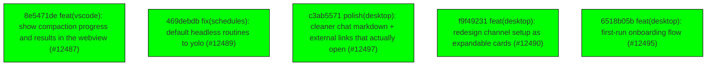

# Backport Agent — Detailed Run Report

> This file is generated automatically. It is intended for human analysts and
> AI reasoning models to assess agent performance, decision quality, and LLM behavior.

**Run timestamp**: 2026-07-27T18:11:06.929Z
**Models used**: fast=`mistral/mistral-code-agent-latest`  powerful=`poolside/poolside/laguna-s-2.1`
**Prompt log**: `/Users/rlemeill/Development/tea-ching-cline/.backport-agent/run-1785174847584.prompts.jsonl`

---

## Summary (PR body)

## Backport Agent — Sync Report

**Date**: 2026-07-27T18:11:06.929Z
**Upstream ref**: `main`
**Cut date**: `2026-06-27T00:00:00.000Z` 
**Fork ref**: `keypool-live`
**Sync branch**: `sync/upstream-main-2026-07-27-175745`

### Summary

- ✅ Applied: 5
- ⚠️ Needs human review: 0
- ⛔ Blocked (not attempted): 0

### Applied commits

- `8e5471de` [high] feat(vscode): show compaction progress and results in the webview (#12487)
- `469debdb` [high] fix(schedules): default headless routines to yolo (#12489)
- `c3ab5571` [low] polish(desktop): cleaner chat markdown + external links that actually open (#12497)
- `f9f49231` [low] feat(desktop): redesign channel setup as expandable cards (#12490)
- `6518b05b` [low] feat(desktop): first-run onboarding flow (#12495)

### Agent decision log

- All commits were successfully applied without conflicts.
- Validation passed for all risk levels.
- No human review required.


---

## Agent Workflow Diagram

> Generated by the fast model from the run summary. Evaluate the agent's decision path.



---

## AI Sub-Agent Call Log (3 calls)

> Each entry is one sub-agent invocation. Review prompt/response pairs to assess
> reasoning quality, hallucinations, and decision accuracy.

### Call 1 / 3 — `analyze_commit_for_backport` ❌ Error

| Field | Value |
|---|---|
| **Timestamp** | 2026-07-27T17:57:17.791Z |
| **Tool** | `analyze_commit_for_backport` |
| **Model** | `poolside/poolside/laguna-s-2.1` |
| **Duration** | 0 ms |
| **Error** | Schema validation failed: [
  {
    "origin": "array",
    "code": "too_big",
    "maximum": 5,
    "inclusive": true,
    "path": [
      "keyChanges"
    ],
    "message": "Too big: expected array to have <=5 items"
  }
] |

**Prompt sent to sub-agent:**

```
Commit SHA: 8e5471de9c0a3a1a6c96606a2c93b383bcac54d3
Commit message:
feat(vscode): show compaction progress and results in the webview (#12487)

Changed files (12):
apps/vscode/proto/cline/ui.proto
apps/vscode/src/sdk/message-translator.test.ts
apps/vscode/src/sdk/message-translator.ts
apps/vscode/src/sdk/sdk-compaction-coordinator.test.ts
apps/vscode/src/sdk/sdk-compaction-coordinator.ts
apps/vscode/src/sdk/sdk-compaction.ts
apps/vscode/src/shared/ExtensionMessage.ts
apps/vscode/src/shared/__tests__/getApiMetrics.test.ts
apps/vscode/src/shared/getApiMetrics.ts
apps/vscode/src/shared/proto-conversions/cline-message.ts
apps/vscode/webview-ui/src/components/chat/ChatRow.tsx
apps/vscode/webview-ui/src/components/settings/sections/FeatureSettingsSection.tsx

Diff:
commit 8e5471de9c0a3a1a6c96606a2c93b383bcac54d3
Author: Saoud Rizwan <7799382+saoudrizwan@users.noreply.github.com>
Date:   Thu Jul 23 10:07:57 2026 -0700

    feat(vscode): show compaction progress and results in the webview (#12487)
    
    * feat(vscode): show compaction progress and results in the webview
    
    Port the CLI's compaction UX to the VS Code extension:
    
    - Translate the SDK's compaction status notices into a say:'compaction'
      divider row with a spinner while running, updated in place (same ts) to
      'Context compacted · x → y tokens · n → m messages' when done, matching
      the CLI's divider. Dangling dividers finalize as failed/cancelled when
      the turn errors or ends mid-compaction.
    - Manual /compact (button or slash command) drives the same divider from
      the compaction coordinator instead of plain info lines, capturing token
      counters from the SDK's status notices.
    - Drop raw status-notice slugs ('auto-compacting') that previously
      rendered as info rows.
    - Context window bar now reads the compacted size (tokensAfter) from a
      compaction row newer than the last API request, so it drops immediately
      after compaction instead of waiting for the next turn.
    - Fix the Auto Compact Strategy selector showing 'basic' when unset; the
      effective default is agentic (core defaults strategy ?? 'agentic').
    
    * fix(vscode): apply compaction shrink as a ratio to the context meter
    
    Address review feedback from #12487:
    
    - getLastApiReqTotalTokens: instead of substituting the compaction
      notice's tokensAfter (an SDK estimate on a different scale than
      provider-reported usage, which made the bar re-snap when the next
      request's real usage landed), scale the last provider-reported request
      total by the compaction's tokensAfter/tokensBefore ratio. Both
      counters come from the same estimator, so the ratio is scale-free.
      Multiple compactions since the last request compound. A completed
      divider without token counters leaves the total unscaled.
    - Suppress only the known-internal status notices explicitly
      (compaction-budget-adjusted); an unrecognized status notice now falls
      through to an info row so future notices surface instead of silently
      vanishing.
    - Cross-reference the two compaction-divider finalization paths (auto:
      translator finalizeDanglingCompaction; manual: coordinator catch) so
      terminal-state rule changes touch both.
    - Post state to the webview before re-throwing in the coordinator's
      failure path, consistent with the other terminal branches.
---
 apps/vscode/proto/cline/ui.proto                   |   1 +
 apps/vscode/src/sdk/message-translator.test.ts     | 119 +++++++++++++++++++
 apps/vscode/src/sdk/message-translator.ts          | 125 +++++++++++++++++++-
 .../src/sdk/sdk-compaction-coordinator.test.ts     |  61 ++++++++--
 apps/vscode/src/sdk/sdk-compaction-coordinator.ts  | 109 +++++++++++------
 apps/vscode/src/sdk/sdk-compaction.ts              |   6 +
 apps/vscode/src/shared/ExtensionMessage.ts         |  15 +++
 .../src/shared/__tests__/getApiMetrics.test.ts     | 129 +++++++++++++++++++++
 apps/vscode/src/shared/getApiMetrics.ts            |  37 +++++-
 .../src/shared/proto-conversions/cline-message.ts  |   2 +
 .../webview-ui/src/components/chat/ChatRow.tsx     |   3 +
 .../src/components/chat/CompactionRow.tsx          |  92 +++++++++++++++
 .../settings/sections/FeatureSettingsSection.tsx   |   2 +-
 13 files changed, 653 insertions(+), 48 deletions(-)

diff --git a/apps/vscode/proto/cline/ui.proto b/apps/vscode/proto/cline/ui.proto
index f1bcb82178..8a960129c9 100644
--- a/apps/vscode/proto/cline/ui.proto
+++ b/apps/vscode/proto/cline/ui.proto
@@ -74,6 +74,7 @@ enum ClineSay {
   SUBAGENT_STATUS = 34;
   USE_SUBAGENTS_SAY = 35;
   SUBAGENT_USAGE = 36;
+  COMPACTION = 37;
 }
 
 // Enum for ClineSayTool tool types
diff --git a/apps/vscode/src/sdk/message-translator.test.ts b/apps/vscode/src/sdk/message-translator.test.ts
index 2690ba4169..12d2b3dc46 100644
--- a/apps/vscode/src/sdk/message-translator.test.ts
+++ b/apps/vscode/src/sdk/message-translator.test.ts
@@ -1643,6 +1643,125 @@ describe("translateSessionEvent — agent_event notice", () => {
 		expect(result.messages[0].text).toBe("Retrying API request...")
 		expect(result.messages[0].partial).toBe(false)
 	})
+
+	function noticeEvent(message: string, metadata?: Record<string, unknown>): CoreSessionEvent {
+		return {
+			type: "agent_event",
+			payload: {
+				sessionId: "session-1",
+				event: {
+					type: "notice",
+					noticeType: "status",
+					displayRole: "status",
+					message,
+					metadata,
+				} as AgentEvent,
+			},
+		}
+	}
+
+	it("translates compaction status notices into a divider row updated in place", () => {
+		const state = new MessageTranslatorState()
+
+		const started = translateSessionEvent(
+			noticeEvent("auto-compacting", { kind: "auto_compaction", phase: "started" }),
+			state,
+		).messages
+		expect(started).toHaveLength(1)
+		expect(started[0].say).toBe("compaction")
+		expect(JSON.parse(started[0].text ?? "{}")).toMatchObject({ status: "started", mode: "auto" })
+
+		const completed = translateSessionEvent(
+			noticeEvent("auto-compacted", {
+				kind: "auto_compaction",
+				phase: "completed",
+				tokensBefore: 120_000,
+				tokensAfter: 40_000,
+				messagesBefore: 80,
+				messagesAfter: 12,
+			}),
+			state,
+		).messages
+		expect(completed).toHaveLength(1)
+		expect(completed[0].say).toBe("compaction")
+		// Same ts: the webview replaces the "started" spinner row in place.
+		expect(completed[0].ts).toBe(started[0].ts)
+		expect(JSON.parse(completed[0].text ?? "{}")).toMatchObject({
+			status: "completed",
+			mode: "auto",
+			tokensBefore: 120_000,
+			tokensAfter: 40_000,
+			messagesBefore: 80,
+			messagesAfter: 12,
+		})
+	})
+
+	it("suppresses known-internal status notices instead of rendering raw slugs", () => {
+		const state = new MessageTranslatorState()
+		const result = translateSessionEvent(
+			noticeEvent("compaction-budget-adjusted", { kind: "compaction_budget_emergency", actionCount: 1 }),
+			state,
+		)
+		expect(result.messages).toHaveLength(0)
+	})
+
+	it("renders an unrecognized status notice as an info row rather than dropping it", () => {
+		// Only the known-internal set is suppressed; a status notice added to the
+		// SDK later should surface (even as a raw slug) instead of vanishing.
+		const state = new MessageTranslatorState()
+		const result = translateSessionEvent(noticeEvent("some-future-status", { kind: "something_new" }), state)
+		expect(result.messages).toHaveLength(1)
+		expect(result.messages[0].say).toBe("info")
+		expect(result.messages[0].text).toBe("some-future-status")
+	})
+
+	it("finalizes a dangling compaction divider as failed when the turn errors", () => {
+		const state = new MessageTranslatorState()
+		const started = translateSessionEvent(
+			noticeEvent("auto-compacting", { kind: "auto_compaction", phase: "started" }),
+			state,
+		).messages
+
+		const errored = translateSessionEvent(
+			{
+				type: "agent_event",
+				payload: {
+					sessionId: "session-1",
+					event: { type: "error", error: new Error("boom"), recoverable: false } as unknown as AgentEvent,
+				},
+			},
+			state,
+		).messages
+
+		const divider = errored.find((message) => message.say === "compaction")
+		expect(divider).toBeDefined()
+		expect(divider?.ts).toBe(started[0].ts)
+		expect(JSON.parse(divider?.text ?? "{}")).toMatchObject({ status: "failed" })
+	})
+
+	it("finalizes a dangling compaction divider as cancelled when the turn ends", () => {
+		const state = new MessageTranslatorState()
+		const started = translateSessionEvent(
+			noticeEvent("auto-compacting", { kind: "auto_compaction", phase: "started" }),
+			state,
+		).messages
+
+		const done = translateSessionEvent(
+			{
+				type: "agent_event",
+				payload: {
+					sessionId: "session-1",
+					event: { type: "done", reason: "aborted" } as unknown as AgentEvent,
+				},
+			},
+			state,
+		).messages
+
+		const divider = done.find((message) => message.say === "compaction")
+		expect(divider).toBeDefined()
+		expect(divider?.ts).toBe(started[0].ts)
+		expect(JSON.parse(divider?.text ?? "{}")).toMatchObject({ status: "cancelled" })
+	})
 })
 
 // ---------------------------------------------------------------------------
diff --git a/apps/vscode/src/sdk/message-translator.ts b/apps/vscode/src/sdk/message-translator.ts
index 5e616e5728..c180f8475b 100644
--- a/apps/vscode/src/sdk/message-translator.ts
+++ b/apps/vscode/src/sdk/message-translator.ts
@@ -33,6 +33,7 @@ import type {
 	ClineApiReqInfo,
 	ClineAskUseMcpServer,
 	ClineAskUseSubagents,
+	ClineCompactionInfo,
 	ClineMessage,
 	ClineSay,
 	ClineSaySubagentStatus,
@@ -124,6 +125,14 @@ export class MessageTranslatorState {
 	private streamingToolName: string | undefined
 	/** Approved tool-call ids mapped to the approval row that should be updated in place. */
 	private approvedToolMessageTsByCallId = new Map<string, number>()
+	/**
+	 * The in-flight compaction divider's ts, so the "completed"/"skipped" notice
+	 * (or a turn error/abort) updates the same row in place. Deliberately NOT
+	 * cleared by the per-iteration `reset()`: the started/completed notices both
+	 * fire inside prepareTurn, before the next `iteration_start`, but an error
+	 * or abort mid-compaction must still be able to finalize the open row.
+	 */
+	private openCompactionTs: number | undefined
 	/** Tool calls rejected by the user; they should not render as red tool failures. */
 	private deniedToolApprovalsByCallId = new Map<string, { toolName: string; reason: string }>()
 	/**
@@ -154,6 +163,19 @@ export class MessageTranslatorState {
 		return this.minter.nextId()
 	}
 
+	/** Mint and remember the ts of an in-flight compaction divider. */
+	beginCompaction(): number {
+		this.openCompactionTs = this.nextTs()
+		return this.openCompactionTs
+	}
+
+	/** Take (and clear) the in-flight compaction divider's ts, if any. */
+	takeOpenCompactionTs(): number | undefined {
+		const ts = this.openCompactionTs
+		this.openCompactionTs = undefined
+		return ts
+	}
+
 	/** Get and increment for streaming text */
 	getStreamingTextTs(): number {
 		if (!this.streamingTextTs) {
@@ -923,6 +945,83 @@ export function buildToolApprovalAskMessage(toolName: string, input: unknown, ts
 /**
  * Translate an SDK AgentEvent into ClineMessage(s).
  */
+/**
+ * Extract a compaction divider payload from a status notice's metadata.
+ * Mirrors the CLI's parseCompactionNoticeMetadata
+ * (apps/cli/src/tui/utils/compaction-status.ts). Returns undefined for
+ * non-compaction status notices.
+ */
+export function parseCompactionNoticeMetadata(metadata: Record<string, unknown> | undefined): ClineCompactionInfo | undefined {
+	if (!metadata || (metadata.phase !== "started" && metadata.phase !== "completed" && metadata.phase !== "skipped")) {
+		return undefined
+	}
+	const kind = metadata.kind ?? metadata.reason
+	if (kind !== "auto_compaction" && kind !== "manual_compaction") {
+		return undefined
+	}
+	const mode = kind === "manual_compaction" ? "manual" : "auto"
+	if (metadata.phase === "started") {
+		return { status: "started", mode }
+	}
+	if (metadata.phase === "skipped") {
+		return { status: "skipped", mode }
+	}
+	return {
+		status: "completed",
+		mode,
+		tokensBefore: asFiniteNumber(metadata.tokensBefore),
+		tokensAfter: asFiniteNumber(metadata.tokensAfter),
+		messagesBefore: asFiniteNumber(metadata.messagesBefore),
+		messagesAfter: asFiniteNumber(metadata.messagesAfter),
+	}
+}
+
+function asFiniteNumber(value: unknown): number | undefined {
+	return typeof value === "number" && Number.isFinite(value) ? value : undefined
+}
+
+/**
+ * Status notices that are internal diagnostics with no user-facing copy — their
+ * `message` is a slug, not prose. Only these are suppressed; an unlisted status
+ * notice renders as an info row so it doesn't vanish silently. Keep in sync
+ * with the `emitStatusNotice` call sites in
+ * sdk/packages/core/src/extensions/context/compaction.ts (the compaction phase
+ * slugs are handled above via parseCompactionNoticeMetadata instead).
+ */
+const INTERNAL_STATUS_NOTICES = new Set(["compaction-budget-adjusted"])
+
+/** Build the say:"compaction" divider message for a compaction status payload. */
+export function buildCompactionMessage(info: ClineCompactionInfo, ts: number): ClineMessage {
+	return {
+		ts,
+		type: "say",
+		say: "compaction",
+		text: JSON.stringify(info),
+		partial: false,
+	}
+}
+
+/**
+ * Finalize a dangling "started" compaction divider when the turn ends without
+ * the completed/skipped notice (mid-compaction abort or error).
+ *
+ * This covers auto compaction (driven by turn events). Manual compaction runs
+ * outside a turn, so SdkCompactionCoordinator.runCompaction finalizes its own
+ * dangling divider in its catch block — if the terminal-state rules change
+ * here, change them there too.
+ */
+function finalizeDanglingCompaction(
+	state: MessageTranslatorState,
+	messages: ClineMessage[],
+	status: "cancelled" | "failed",
+): void {
+	const ts = state.takeOpenCompactionTs()
+	if (ts === undefined) {
+		return
+	}
+	messages.push(buildCompactionMessage({ status, mode: "auto" }, ts))
+}
+
 function translateAgentEvent(event: AgentEvent, state: MessageTranslatorState): ClineMessage[] {
 	const messages: ClineMessage[] = []
 
@@ -1401,7 +1500,28 @@ function translateAgentEvent(event: AgentEvent, state: MessageTranslatorState):
 		}
 
 		case "notice": {
-			// Agent notices are informational
+			// Status notices carry structured runtime progress. Compaction ones
+			// become a live divider row that is updated in place from "started" to
+			// its terminal state; the known-internal ones are diagnostics with no
+			// user-facing copy, so drop them explicitly. Any other status notice
+			// falls through to the info row below so a future one surfaces (as its
+			// raw slug) instead of silently vanishing.
+			if (event.noticeType === "status") {
+				const compaction = parseCompactionNoticeMetadata(event.metadata)
+				if (compaction) {
+					const ts =
+						compaction.status === "started"
+							? state.beginCompaction()
+							: (state.takeOpenCompactionTs() ?? state.nextTs())
+					messages.push(buildCompactionMessage(compaction, ts))
+					break
+				}
+				if (INTERNAL_STATUS_NOTICES.has(event.message ?? "")) {
+					break
+				}
+			}
+
+			// Non-status agent notices (and unrecognized status notices) are informational
 			messages.push({
 				ts: state.nextTs(),
 				type: "say",
@@ -1440,10 +1560,13 @@ function translateAgentEvent(event: AgentEvent, state: MessageTranslatorState):
 			// session-event coordinator sets on turn end (completed when the completion tool was
 			// used this turn, otherwise awaiting_followup), and the green "Task Completed" box
 			// comes from the say:"completion_result" emitted at the completion tool's content_end.
+			// A compaction divider still open here means the turn was aborted mid-compaction.
+			finalizeDanglingCompaction(state, messages, "cancelled")
 			break
 		}
 
 		case "error": {
+			finalizeDanglingCompaction(state, messages, "failed")
 			if (state.isSuppressedToolApprovalDenial(event.error)) {
 				break
 			}
diff --git a/apps/vscode/src/sdk/sdk-compaction-coordinator.test.ts b/apps/vscode/src/sdk/sdk-compaction-coordinator.test.ts
index fa1970f3db..35784f72f1 100644
--- a/apps/vscode/src/sdk/sdk-compaction-coordinator.test.ts
+++ b/apps/vscode/src/sdk/sdk-compaction-coordinator.test.ts
@@ -84,7 +84,7 @@ describe("SdkCompactionCoordinator", () => {
 		)
 	})
 
-	it("reports when the strategy declines to compact", async () => {
+	it("shows a skipped divider when the strategy declines to compact", async () => {
 		const activeSession = makeActiveSession()
 		const { coordinator, options } = makeCoordinator({ activeSession })
 		mockCreateContextCompactionPrepareTurn.mockReturnValueOnce(vi.fn().mockResolvedValue(undefined))
@@ -93,10 +93,11 @@ describe("SdkCompactionCoordinator", () => {
 
 		expect(mockCreateContextCompactionPrepareTurn).toHaveBeenCalledOnce()
 		expect(options.sessions.replaceActiveSession).not.toHaveBeenCalled()
-		expect(options.messages.appendAndEmit).toHaveBeenCalledWith(
-			[expect.objectContaining({ say: "info", text: "No compaction needed." })],
-			expect.anything(),
-		)
+		const rows = compactionRows(options)
+		expect(rows[0].info.status).toBe("started")
+		expect(rows[1].info.status).toBe("skipped")
+		// The terminal row updates the started row in place (same ts).
+		expect(rows[1].ts).toBe(rows[0].ts)
 	})
 
 	it("compacts and persists the sidecar without rebuilding the session", async () => {
@@ -118,10 +119,40 @@ describe("SdkCompactionCoordinator", () => {
 			messages: [{ role: "user", content: "summary" }],
 		})
 		expect(options.sessions.replaceActiveSession).not.toHaveBeenCalled()
-		expect(options.messages.appendAndEmit).toHaveBeenCalledWith(
-			[expect.objectContaining({ say: "info", text: "Compacted 3 messages to 1." })],
-			expect.anything(),
+		const rows = compactionRows(options)
+		expect(rows[0].info).toMatchObject({ status: "started", mode: "manual" })
+		expect(rows[1].info).toMatchObject({ status: "completed", mode: "manual", messagesBefore: 3, messagesAfter: 1 })
+		expect(rows[1].ts).toBe(rows[0].ts)
+	})
+
+	it("prefers the SDK's token counters from its status notice for the completed divider", async () => {
+		const activeSession = makeActiveSession()
+		const { coordinator, options } = makeCoordinator({ activeSession })
+		mockCreateContextCompactionPrepareTurn.mockReturnValueOnce(
+			vi.fn().mockImplementation((context: { emitStatusNotice?: (message: string, metadata?: unknown) => void }) => {
+				context.emitStatusNotice?.("compacted", {
+					kind: "manual_compaction",
+					phase: "completed",
+					tokensBefore: 25_000,
+					tokensAfter: 6_000,
+					messagesBefore: 42,
+					messagesAfter: 5,
+				})
+				return Promise.resolve({ messages: [{ role: "user", content: "summary" }] })
+			}),
 		)
+
+		await coordinator.compactTask()
+
+		const rows = compactionRows(options)
+		expect(rows[1].info).toMatchObject({
+			status: "completed",
+			mode: "manual",
+			tokensBefore: 25_000,
+			tokensAfter: 6_000,
+			messagesBefore: 42,
+			messagesAfter: 5,
+		})
 	})
 
 	it("does not append compaction status to a different active session", async () => {
@@ -129,7 +160,7 @@ describe("SdkCompactionCoordinator", () => {
 		const { coordinator, options } = makeCoordinator({ activeSession })
 		options.sessions.getActiveSession
 			.mockReturnValueOnce(activeSession)
-			.mockReturnValueOnce(makeActiveSession({ sessionId: "other-session" }))
+			.mockReturnValue(makeActiveSession({ sessionId: "other-session" }))
 		mockCreateContextCompactionPrepareTurn.mockReturnValueOnce(
 			vi.fn().mockResolvedValue({ messages: [{ role: "user", content: "summary" }] }),
 		)
@@ -151,6 +182,8 @@ describe("SdkCompactionCoordinator", () => {
 		await coordinator.compactTask()
 
 		expect(options.sessions.replaceActiveSession).not.toHaveBeenCalled()
+		const rows = compactionRows(options)
+		expect(rows[rows.length - 1].info.status).toBe("failed")
 		expect(options.messages.appendAndEmit).toHaveBeenCalledWith(
 			[expect.objectContaining({ say: "info", text: "Couldn't compact the conversation. Please try again." })],
 			expect.anything(),
@@ -165,6 +198,8 @@ describe("SdkCompactionCoordinator", () => {
 		await coordinator.compactTask()
 
 		expect(options.sessions.replaceActiveSession).not.toHaveBeenCalled()
+		const rows = compactionRows(options)
+		expect(rows[rows.length - 1].info.status).toBe("failed")
 		expect(options.messages.appendAndEmit).toHaveBeenCalledWith(
 			[expect.objectContaining({ say: "info", text: "Couldn't compact the conversation. Please try again." })],
 			expect.anything(),
@@ -172,6 +207,14 @@ describe("SdkCompactionCoordinator", () => {
 	})
 })
 
+/** Collect all say:"compaction" rows emitted through appendAndEmit, in order. */
+function compactionRows(options: { messages: { appendAndEmit: ReturnType<typeof vi.fn> } }) {
+	return options.messages.appendAndEmit.mock.calls
+		.flatMap((call) => call[0] as Array<{ say?: string; text?: string; ts: number }>)
+		.filter((message) => message.say === "compaction")
+		.map((message) => ({ ts: message.ts, info: JSON.parse(message.text ?? "{}") }))
+}
+
 interface MakeCoordinatorInput {
 	activeSession: ReturnType<typeof makeActiveSession> | undefined
 }
diff --git a/apps/vscode/src/sdk/sdk-compaction-coordinator.ts b/apps/vscode/src/sdk/sdk-compaction-coordinator.ts
index ec849cccfe..032ec8d460 100644
--- a/apps/vscode/src/sdk/sdk-compaction-coordinator.ts
+++ b/apps/vscode/src/sdk/sdk-compaction-coordinator.ts
@@ -14,10 +14,11 @@
 // fake "Conversation Summary" instead of compacting (CLINE-2503).
 
 import type { Message as SdkMessage } from "@cline/llms"
-import type { ClineMessage } from "@shared/ExtensionMessage"
+import type { ClineCompactionInfo, ClineMessage } from "@shared/ExtensionMessage"
 import type { Mode } from "@shared/storage/types"
 import type { StateManager } from "@/core/storage/StateManager"
 import { Logger } from "@/shared/services/Logger"
+import { buildCompactionMessage, parseCompactionNoticeMetadata } from "./message-translator"
 import { compactSessionMessages } from "./sdk-compaction"
 import type { SdkMessageCoordinator } from "./sdk-message-coordinator"
 import type { SdkSessionConfigBuilder } from "./sdk-session-config-builder"
@@ -101,38 +102,73 @@ export class SdkCompactionCoordinator {
 		const mode = this.getCurrentMode()
 		const config = await this.options.sessionConfigBuilder.build({ cwd, mode })
 
-		const result = await compactSessionMessages({
-			config: {
-				providerConfig: config.providerConfig,
-				providerId: config.providerId,
-				modelId: config.modelId,
-				knownModels: config.knownModels,
-				compaction: config.compaction,
-				logger: config.logger,
-				telemetry: config.telemetry,
-			},
-			sessionId,
-			messages,
-		})
+		// A live divider row, updated in place (same ts) from "started" to its
+		// terminal state — the same UX as the CLI's compaction divider.
+		const compactionTs = Date.now()
+		this.emitCompactionRow({ status: "started", mode: "manual" }, compactionTs, sessionId)
+		await this.options.postStateToWebview()
 
-		if (!result.compacted) {
-			this.emitInfo("No compaction needed.", sessionId)
+		// The SDK reports the compaction's token/message counters through its
+		// status notices; capture the terminal one for the final divider.
+		let noticeInfo: ClineCompactionInfo | undefined
+		try {
+			const result = await compactSessionMessages({
+				config: {
+					providerConfig: config.providerConfig,
+					providerId: config.providerId,
+					modelId: config.modelId,
+					knownModels: config.knownModels,
+					compaction: config.compaction,
+					logger: config.logger,
+					telemetry: config.telemetry,
+				},
+				sessionId,
+				messages,
+				emitStatusNotice: (_message, metadata) => {
+					const parsed = parseCompactionNoticeMetadata(metadata)
+					if (parsed && parsed.status !== "started") {
+						noticeInfo = { ...parsed, mode: "manual" }
+					}
+				},
+			})
+
+			if (!result.compacted) {
+				this.emitCompactionRow(noticeInfo ?? { status: "skipped", mode: "manual" }, compactionTs, sessionId)
+				await this.options.postStateToWebview()
+				return
+			}
+
+			if (!result.compactionState) {
+				throw new Error("Compaction did not return durable state.")
+			}
+			const persisted = await sdkHost.updateSessionCompactionState(sessionId, result.compactionState)
+			if (!persisted.updated) {
+				throw new Error("Compaction sidecar could not be persisted.")
+			}
+
+			this.emitCompactionRow(
+				noticeInfo?.status === "completed"
+					? noticeInfo
+					: {
+							status: "completed",
+							mode: "manual",
+							messagesBefore,
+							messagesAfter: result.messages.length,
+						},
+				compactionTs,
+				sessionId,
+			)
 			await this.options.postStateToWebview()
-			return
-		}
 
-		if (!result.compactionState) {
-			throw new Error("Compaction did not return durable state.")
-		}
-		const persisted = await sdkHost.updateSessionCompactionState(sessionId, result.compactionState)
-		if (!persisted.updated) {
-			throw new Error("Compaction sidecar could not be persisted.")
+			Logger.log(`[SdkController] Compacted session ${sessionId}: ${messagesBefore} -> ${result.messages.length} messages`)
+		} catch (error) {
+			// Manual-mode counterpart of the translator's finalizeDanglingCompaction
+			// (message-translator.ts), which handles auto compaction from turn
+			// events — keep the terminal-state rules of the two in sync.
+			this.emitCompactionRow({ status: "failed", mode: "manual" }, compactionTs, sessionId)
+			await this.options.postStateToWebview()
+			throw error
 		}
-
-		this.emitInfo(this.formatCompactionStatus(messagesBefore, result.messages.length), sessionId)
-		await this.options.postStateToWebview()
-
-		Logger.log(`[SdkController] Compacted session ${sessionId}: ${messagesBefore} -> ${result.messages.length} messages`)
 	}
 
 	private getCurrentMode(): Mode {
@@ -140,12 +176,17 @@ export class SdkCompactionCoordinator {
 		return m === "plan" ? m : "act"
 	}
 
-	private formatCompactionStatus(messagesBefore: number, messagesAfter: number): string {
-		// Mirrors apps/cli/src/tui/utils/compaction-status.ts wording.
-		if (messagesBefore === messagesAfter) {
-			return `Compacted context; message count stayed at ${messagesAfter}.`
+	/** Append or update-in-place (same ts) the compaction divider row. */
+	private emitCompactionRow(info: ClineCompactionInfo, ts: number, sessionId: string): void {
+		const activeSessionId = this.options.sessions.getActiveSession()?.sessionId
+		if (activeSessionId !== sessionId) {
+			Logger.warn(`[SdkController] compactTask: skipped compaction row for inactive session ${sessionId}`)
+			return
 		}
-		return `Compacted ${messagesBefore} messages to ${messagesAfter}.`
+		this.options.messages.appendAndEmit([buildCompactionMessage(info, ts)], {
+			type: "status",
+			payload: { sessionId, status: "running" },
+		})
 	}
 
 	private emitInfo(text: string, sessionId?: string): void {
diff --git a/apps/vscode/src/sdk/sdk-compaction.ts b/apps/vscode/src/sdk/sdk-compaction.ts
index 175778eb06..c7643901e6 100644
--- a/apps/vscode/src/sdk/sdk-compaction.ts
+++ b/apps/vscode/src/sdk/sdk-compaction.ts
@@ -34,6 +34,11 @@ export interface CompactSessionMessagesInput {
 	sessionId: string
 	/** The conversation transcript to compact (SDK message shape). */
 	messages: SdkMessage[]
+	/**
+	 * Receives the SDK's compaction status notices (started/completed/skipped
+	 * with token + message counters) so the caller can drive progress UI.
+	 */
+	emitStatusNotice?: (message: string, metadata?: Record<string, unknown>) => void
 }
 
 export interface CompactSessionMessagesResult {
@@ -104,6 +109,7 @@ export async function compactSessionMessages(input: CompactSessionMessagesInput)
 			provider: input.config.providerId,
 			info: compactionModelInfo,
 		},
+		emitStatusNotice: input.emitStatusNotice,
 	})
 	if (!result) {
 		return { compacted: false, messages: input.messages }
diff --git a/apps/vscode/src/shared/ExtensionMessage.ts b/apps/vscode/src/shared/ExtensionMessage.ts
index 0a26ae7165..f3ab226dfd 100644
--- a/apps/vscode/src/shared/ExtensionMessage.ts
+++ b/apps/vscode/src/shared/ExtensionMessage.ts
@@ -257,6 +257,7 @@ export type ClineSay =
 	| "use_subagents"
 	| "subagent_usage"
 	| "conditional_rules_applied"
+	| "compaction" // context compaction progress/result divider
 
 export interface ClineSayTool {
 	tool:
@@ -376,6 +377,20 @@ export interface ClineApiReqInfo {
 	}
 }
 
+/**
+ * JSON payload of a say:"compaction" message. Mirrors the CLI's compaction
+ * divider (apps/cli/src/tui/utils/compaction-status.ts): a "started" row shows
+ * a spinner and is later updated in place (same ts) to its terminal status.
+ */
+export interface ClineCompactionInfo {
+	status: "started" | "completed" | "skipped" | "failed" | "cancelled"
+	mode: "auto" | "manual"
+	tokensBefore?: number
+	tokensAfter?: number
+	messagesBefore?: number
+	messagesAfter?: number
+}
+
 export interface ClineSubagentUsageInfo {
 	source: "subagents"
 	tokensIn: number
diff --git a/apps/vscode/src/shared/__tests__/getApiMetrics.test.ts b/apps/vscode/src/shared/__tests__/getApiMetrics.test.ts
index 39d60c5333..e18c59a896 100644
--- a/apps/vscode/src/shared/__tests__/getApiMetrics.test.ts
+++ b/apps/vscode/src/shared/__tests__/getApiMetrics.test.ts
@@ -100,4 +100,133 @@ describe("getLastApiReqTotalTokens", () => {
 		const total = getLastApiReqTotalTokens(messages)
 		assert.equal(total, 23)
 	})
+
+	it("scales the last request by the shrink ratio of a compaction completed after it", () => {
+		// The compaction counters are the SDK's estimate — a different scale from
+		// the provider-reported request total. Only the ratio carries over.
+		const messages: ClineMessage[] = [
+			{
+				ts: 1,
+				type: "say",
+				say: "api_req_started",
+				text: JSON.stringify({ tokensIn: 90_000, tokensOut: 5_000, cacheReads: 5_000 }),
+			},
+			{
+				ts: 2,
+				type: "say",
+				say: "compaction",
+				text: JSON.stringify({ status: "completed", mode: "manual", tokensBefore: 200_000, tokensAfter: 50_000 }),
+			},
+		]
+
+		const total = getLastApiReqTotalTokens(messages)
+		assert.equal(total, 25_000)
+	})
+
+	it("compounds multiple compactions completed since the last request", () => {
+		const messages: ClineMessage[] = [
+			{
+				ts: 1,
+				type: "say",
+				say: "api_req_started",
+				text: JSON.stringify({ tokensIn: 100_000 }),
+			},
+			{
+				ts: 2,
+				type: "say",
+				say: "compaction",
+				text: JSON.stringify({ status: "completed", mode: "manual", tokensBefore: 200_000, tokensAfter: 100_000 }),
+			},
+			{
+				ts: 3,
+				type: "say",
+				say: "compaction",
+				text: JSON.stringify({ status: "completed", mode: "manual", tokensBefore: 100_000, tokensAfter: 50_000 }),
+			},
+		]
+
+		const total = getLastApiReqTotalTokens(messages)
+		assert.equal(total, 25_000)
+	})
+
+	it("leaves the request total unscaled when a completed compaction lacks token counters", () => {
+		// The coordinator's fallback divider carries only message counts.
+		const messages: ClineMessage[] = [
+			{
+				ts: 1,
+				type: "say",
+				say: "api_req_started",
+				text: JSON.stringify({ tokensIn: 40_000, tokensOut: 2_000 }),
+			},
+			{
+				ts: 2,
+				type: "say",
+				say: "compaction",
+				text: JSON.stringify({ status: "completed", mode: "manual", messagesBefore: 40, messagesAfter: 6 }),
+			},
+		]
+
+		const total = getLastApiReqTotalTokens(messages)
+		assert.equal(total, 42_000)
+	})
+
+	it("returns 0 when a compaction completed but no request preceded it", () => {
+		const messages: ClineMessage[] = [
+			{
+				ts: 1,
+				type: "say",
+				say: "compaction",
+				text: JSON.stringify({ status: "completed", mode: "manual", tokensBefore: 95_000, tokensAfter: 30_000 }),
+			},
+		]
+
+		const total = getLastApiReqTotalTokens(messages)
+		assert.equal(total, 0)
+	})
+
+	it("ignores compaction rows without a usable compacted size", () => {
+		const messages: ClineMessage[] = [
+			{
+				ts: 1,
+				type: "say",
+				say: "api_req_started",
+				text: JSON.stringify({ tokensIn: 11, tokensOut: 7, cacheWrites: 2, cacheReads: 3 }),
+			},
+			{
+				ts: 2,
+				type: "say",
+				say: "compaction",
+				text: JSON.stringify({ status: "started", mode: "auto" }),
+			},
+			{
+				ts: 3,
+				type: "say",
+				say: "compaction",
+				text: JSON.stringify({ status: "failed", mode: "auto" }),
+			},
+		]
+
+		const total = getLastApiReqTotalTokens(message
... [truncated]

Output the JSON object now.
```

**Response received:**

```
(empty)
```

---

### Call 2 / 3 — `analyze_commit_for_backport` ✅ OK

| Field | Value |
|---|---|
| **Timestamp** | 2026-07-27T17:57:24.450Z |
| **Tool** | `analyze_commit_for_backport` |
| **Model** | `poolside/poolside/laguna-s-2.1` |
| **Duration** | 6538 ms |
| **Tokens in** | 15763 |
| **Tokens out** | 264 |
| **Cost** | $0.000000 |

**Prompt sent to sub-agent:**

```
Commit SHA: 469debdb30c3fed884ec548ee9f4ca053ae52d5e
Commit message:
fix(schedules): default headless routines to yolo (#12489)

Changed files (30):
apps/cli/src/commands/schedule/common.ts
apps/cli/src/commands/schedule/handlers.ts
apps/cli/src/commands/schedule/import-export.ts
apps/cli/src/wizards/schedule/index.ts
apps/cline-hub/src/server/schedules.ts
apps/cline-hub/src/webview/package.json
apps/cline-hub/src/webview/src/components/views/settings/routine-view.tsx
apps/examples/desktop-app/sidecar/commands.ts
apps/examples/desktop-app/webview/components/views/chat/chat-input-bar.tsx
apps/examples/desktop-app/webview/components/views/settings/routine-view.tsx
apps/examples/desktop-app/webview/hooks/chat-session/constants.ts
apps/vscode/src/sdk/cline-session-factory.test.ts
bun.lock
sdk/packages/core/src/cron/runner/cron-runner.test.ts
sdk/packages/core/src/cron/runner/cron-runner.ts
sdk/packages/core/src/cron/service/schedule-command-service.ts
sdk/packages/core/src/cron/service/schedule-service.test.ts
sdk/packages/core/src/cron/service/schedule-service.ts
sdk/packages/core/src/cron/specs/cron-spec-parser.test.ts
sdk/packages/core/src/cron/store/sqlite-cron-store.test.ts
sdk/packages/core/src/cron/store/sqlite-cron-store.ts
sdk/packages/core/src/hub/daemon/runtime-handlers.ts
sdk/packages/core/src/hub/server/fetch-wiring.test.ts
sdk/packages/core/src/services/providers/local-provider-service.test.ts
sdk/packages/core/src/hub/server/fetch-wiring.test.ts
sdk/packages/shared/src/hub.test.ts
sdk/packages/shared/src/hub.ts
sdk/packages/shared/src/index.browser.ts
sdk/packages/shared/src/index.ts
sdk/packages/shared/src/providers/defaults.ts

Diff:
commit 469debdb30c3fed884ec548ee9f4ca053ae52d5e
Author: Bee <68532117+abeatrix@users.noreply.github.com>
Date:   Thu Jul 23 14:53:03 2026 -0700

    fix(schedules): default headless routines to yolo (#12489)
    
    * fix(schedules): default headless routines to yolo
    
    Centralize the Cline default model ID in @cline/shared while preserving the @cline/llms export. Keep explicit modes stable and disable ask_question for unattended scheduled runs.
    
    * autoapprove
    
    * fix unit test
    
    * fix(schedules): harden headless routine execution
    
    ---------
    
    Co-authored-by: Saoud Rizwan <7799382+saoudrizwan@users.noreply.github.com>
---
 apps/cli/src/commands/schedule/common.ts           |   6 +-
 apps/cli/src/commands/schedule/handlers.ts         |   8 +-
 apps/cli/src/commands/schedule/import-export.ts    |  10 +-
 apps/cli/src/wizards/schedule/index.ts             |   8 +-
 apps/cline-hub/src/server/schedules.ts             |  15 ++-
 apps/cline-hub/src/webview/package.json            |   1 +
 .../src/components/views/settings/routine-view.tsx |   9 +-
 apps/examples/desktop-app/sidecar/commands.ts      |  15 ++-
 .../components/views/chat/chat-input-bar.tsx       |   5 +-
 .../components/views/settings/routine-view.tsx     |  11 +-
 .../webview/hooks/chat-session/constants.ts        |   6 +-
 apps/vscode/src/sdk/cline-session-factory.test.ts  |   4 +-
 bun.lock                                           |   1 +
 .../core/src/cron/runner/cron-runner.test.ts       | 133 ++++++++++++++++++++-
 sdk/packages/core/src/cron/runner/cron-runner.ts   |  20 ++--
 .../src/cron/service/schedule-command-service.ts   |   6 +-
 .../core/src/cron/service/schedule-service.test.ts | 122 ++++++++++++++++++-
 .../core/src/cron/service/schedule-service.ts      |   2 +-
 .../core/src/cron/specs/cron-spec-parser.test.ts   |   1 +
 .../core/src/cron/store/sqlite-cron-store.test.ts  |  66 ++++++++++
 .../core/src/cron/store/sqlite-cron-store.ts       |   8 +-
 .../core/src/hub/daemon/runtime-handlers.ts        |   7 ++
 .../core/src/hub/server/fetch-wiring.test.ts       |  73 ++++++++++-
 .../providers/local-provider-service.test.ts       |   3 +-
 sdk/packages/llms/src/index.browser.ts             |   1 +
 sdk/packages/llms/src/index.ts                     |   1 +
 sdk/packages/llms/src/providers/builtins.test.ts   |  10 +-
 sdk/packages/llms/src/providers/builtins.ts        |   2 +-
 sdk/packages/shared/src/hub.test.ts                |  25 +++-
 sdk/packages/shared/src/hub.ts                     |  32 ++++-
 sdk/packages/shared/src/index.browser.ts           |   1 +
 sdk/packages/shared/src/index.ts                   |   1 +
 sdk/packages/shared/src/providers/defaults.ts      |   2 +
 33 files changed, 543 insertions(+), 72 deletions(-)

diff --git a/apps/cli/src/commands/schedule/common.ts b/apps/cli/src/commands/schedule/common.ts
index 4cf1c1650a..845638806d 100644
--- a/apps/cli/src/commands/schedule/common.ts
+++ b/apps/cli/src/commands/schedule/common.ts
@@ -148,8 +148,10 @@ export function isJsonPath(path: string): boolean {
 	return path.toLowerCase().endsWith(".json");
 }
 
-export function parseMode(raw: string | undefined): "act" | "plan" | undefined {
-	if (raw === "act" || raw === "plan") {
+export function parseMode(
+	raw: string | undefined,
+): "act" | "plan" | "yolo" | undefined {
+	if (raw === "act" || raw === "plan" || raw === "yolo") {
 		return raw;
 	}
 	return undefined;
diff --git a/apps/cli/src/commands/schedule/handlers.ts b/apps/cli/src/commands/schedule/handlers.ts
index ed13e0498e..9b6867a5b9 100644
--- a/apps/cli/src/commands/schedule/handlers.ts
+++ b/apps/cli/src/commands/schedule/handlers.ts
@@ -1,3 +1,4 @@
+import { CLINE_DEFAULT_MODEL_ID } from "@cline/shared";
 import type { Command } from "commander";
 import { ensureSchedulerHub } from "./client";
 import {
@@ -9,6 +10,7 @@ import {
 	mergeScheduleMetadata,
 	parseJsonObjectFlag,
 	parseList,
+	parseMode,
 	resolveAddress,
 	toPositiveInt,
 } from "./common";
@@ -63,8 +65,8 @@ export function registerScheduleCommands(
 		.option("--disabled", "Create in disabled state")
 		.option("--max-parallel <n>", "Max parallel executions", "1")
 		.option("--metadata-json <json>", "Metadata as JSON object")
-		.option("--mode <act|plan>", "Execution mode")
-		.option("--model <model>", "Model to use", "openai/gpt-5.3-codex")
+		.option("--mode <act|plan|yolo>", "Execution mode", "yolo")
+		.option("--model <model>", "Model to use", CLINE_DEFAULT_MODEL_ID)
 		.option("--provider <id>", "Provider ID", "cline")
 		.option("--system-prompt <text>", "System prompt override")
 		.option("--tags <list>", "Comma-separated tags")
@@ -96,7 +98,7 @@ export function registerScheduleCommands(
 					prompt: opts.prompt,
 					provider: opts.provider,
 					model: opts.model,
-					mode: opts.mode === "plan" ? "plan" : "act",
+					mode: parseMode(opts.mode) ?? "yolo",
 					workspaceRoot: opts.workspace,
 					cwd: opts.cwd,
 					systemPrompt: opts.systemPrompt,
diff --git a/apps/cli/src/commands/schedule/import-export.ts b/apps/cli/src/commands/schedule/import-export.ts
index e26750ed92..9e87b08821 100644
--- a/apps/cli/src/commands/schedule/import-export.ts
+++ b/apps/cli/src/commands/schedule/import-export.ts
@@ -1,5 +1,6 @@
 import { mkdir, readFile, writeFile } from "node:fs/promises";
 import { dirname, isAbsolute, resolve } from "node:path";
+import { CLINE_DEFAULT_MODEL_ID } from "@cline/shared";
 import type { Command } from "commander";
 import { ensureSchedulerHub } from "./client";
 import {
@@ -39,7 +40,7 @@ function resolveImportedModelSelection(parsed: Record<string, unknown>): {
 		modelSelection?.modelId ??
 			parsed.modelId ??
 			parsed.model ??
-			"openai/gpt-5.3-codex",
+			CLINE_DEFAULT_MODEL_ID,
 	).trim();
 	return { provider, model };
 }
@@ -165,7 +166,10 @@ export function registerScheduleImportCommand(
 					prompt: String(parsed.prompt ?? "").trim(),
 					provider,
 					model,
-					mode: parsed.mode === "plan" ? "plan" : "act",
+					mode:
+						parseMode(
+							typeof parsed.mode === "string" ? parsed.mode : undefined,
+						) ?? "yolo",
 					workspaceRoot,
 					cwd: String(parsed.cwd ?? "").trim() || undefined,
 					systemPrompt:
@@ -229,7 +233,7 @@ export function registerScheduleUpdateCommand(
 		.option("--enabled", "Enable the schedule")
 		.option("--max-parallel <n>", "New max parallel executions")
 		.option("--metadata-json <json>", "New metadata as JSON object")
-		.option("--mode <act|plan>", "New execution mode")
+		.option("--mode <act|plan|yolo>", "New execution mode")
 		.option("--model <model>", "New model")
 		.option("--name <name>", "New name")
 		.option("--pause", "Pause the schedule")
diff --git a/apps/cli/src/wizards/schedule/index.ts b/apps/cli/src/wizards/schedule/index.ts
index 7272c2c095..a4b02d727c 100644
--- a/apps/cli/src/wizards/schedule/index.ts
+++ b/apps/cli/src/wizards/schedule/index.ts
@@ -1,4 +1,5 @@
 import * as p from "@clack/prompts";
+import { CLINE_DEFAULT_MODEL_ID } from "@cline/shared";
 import {
 	ensureSchedulerHub,
 	type HubScheduleClient,
@@ -135,10 +136,11 @@ async function actionCreate(client: HubScheduleClient): Promise<void> {
 	const mode = await p.select({
 		message: "Agent mode",
 		options: [
+			{ value: "yolo", label: "Yolo", hint: "execute without approvals" },
 			{ value: "act", label: "Act", hint: "execute tasks" },
 			{ value: "plan", label: "Plan", hint: "plan only" },
 		],
-		initialValue: "act",
+		initialValue: "yolo",
 	});
 	if (isCancel(mode)) return;
 
@@ -214,8 +216,8 @@ async function actionCreate(client: HubScheduleClient): Promise<void> {
 		cronPattern,
 		prompt: (prompt as string).trim(),
 		provider: provider ?? "cline",
-		model: model ?? "openai/gpt-5.3-codex",
-		mode: (mode as string) === "plan" ? "plan" : "act",
+		model: model ?? CLINE_DEFAULT_MODEL_ID,
+		mode: mode as "act" | "plan" | "yolo",
 		workspaceRoot: (workspace as string).trim(),
 		systemPrompt,
 		maxIterations,
diff --git a/apps/cline-hub/src/server/schedules.ts b/apps/cline-hub/src/server/schedules.ts
index 47368d67b4..b32ec1bec9 100644
--- a/apps/cline-hub/src/server/schedules.ts
+++ b/apps/cline-hub/src/server/schedules.ts
@@ -4,8 +4,10 @@ import {
 	HubScheduleService,
 } from "@cline/core";
 import {
+	CLINE_DEFAULT_MODEL_ID,
 	ONE_TIME_SCHEDULE_CRON_PATTERN,
 	ONE_TIME_SCHEDULE_RUN_AT_METADATA_KEY,
+	readHubScheduleMode,
 } from "@cline/shared";
 import { asTrimmedString, toPositiveInt } from "./utils";
 
@@ -65,10 +67,6 @@ function asTrimmedStringArray(value: unknown): string[] | undefined {
 	return values.length > 0 ? values : undefined;
 }
 
-function routineScheduleMode(value: unknown): "act" | "plan" | "yolo" {
-	return value === "plan" || value === "yolo" ? value : "act";
-}
-
 export async function handleRoutineScheduleCommand(
 	command: string,
 	args?: Record<string, unknown>,
@@ -123,9 +121,9 @@ export async function handleRoutineScheduleCommand(
 			prompt,
 			modelSelection: {
 				providerId: asTrimmedString(args?.provider) ?? "cline",
-				modelId: asTrimmedString(args?.model) ?? "openai/gpt-5.3-codex",
+				modelId: asTrimmedString(args?.model) ?? CLINE_DEFAULT_MODEL_ID,
 			},
-			mode: routineScheduleMode(args?.mode),
+			mode: readHubScheduleMode(args, "yolo"),
 			workspaceRoot: routineWorkspaceRoot,
 			cwd: asTrimmedString(args?.cwd),
 			systemPrompt: asTrimmedString(args?.system_prompt),
@@ -141,6 +139,7 @@ export async function handleRoutineScheduleCommand(
 	const scheduleId = asTrimmedString(args?.schedule_id);
 	if (!scheduleId) throw new Error(`${command} requires schedule_id`);
 	if (command === "update_routine_schedule") {
+		const mode = readHubScheduleMode(args);
 		const name = asTrimmedString(args?.name);
 		const timing = routineScheduleTiming(args);
 		const prompt = asTrimmedString(args?.prompt);
@@ -157,9 +156,9 @@ export async function handleRoutineScheduleCommand(
 			prompt,
 			modelSelection: {
 				providerId: asTrimmedString(args?.provider) ?? "cline",
-				modelId: asTrimmedString(args?.model) ?? "openai/gpt-5.3-codex",
+				modelId: asTrimmedString(args?.model) ?? CLINE_DEFAULT_MODEL_ID,
 			},
-			mode: routineScheduleMode(args?.mode),
+			...(mode === undefined ? {} : { mode }),
 			workspaceRoot: routineWorkspaceRoot,
 			cwd: asTrimmedString(args?.cwd) ?? null,
 			systemPrompt:
diff --git a/apps/cline-hub/src/webview/package.json b/apps/cline-hub/src/webview/package.json
index d92e2c21c3..fb12f6615c 100644
--- a/apps/cline-hub/src/webview/package.json
+++ b/apps/cline-hub/src/webview/package.json
@@ -10,6 +10,7 @@
 	},
 	"dependencies": {
 		"@base-ui/react": "^1.3.0",
+		"@cline/shared": "workspace:*",
 		"@fontsource-variable/schibsted-grotesk": "^5.2.8",
 		"@radix-ui/react-use-controllable-state": "^1.2.2",
 		"@rive-app/react-webgl2": "^4.27.2",
diff --git a/apps/cline-hub/src/webview/src/components/views/settings/routine-view.tsx b/apps/cline-hub/src/webview/src/components/views/settings/routine-view.tsx
index dbd7a573ca..eac15fedd7 100644
--- a/apps/cline-hub/src/webview/src/components/views/settings/routine-view.tsx
+++ b/apps/cline-hub/src/webview/src/components/views/settings/routine-view.tsx
@@ -1,6 +1,7 @@
 "use client";
 
 import {
+	CLINE_DEFAULT_MODEL_ID,
 	ONE_TIME_SCHEDULE_CRON_PATTERN,
 	ONE_TIME_SCHEDULE_RUN_AT_METADATA_KEY,
 } from "@cline/shared";
@@ -150,7 +151,7 @@ interface ProcessContext {
 }
 
 const FALLBACK_PROVIDER_MODELS: Record<string, string[]> = {
-	cline: ["anthropic/claude-sonnet-4.6"],
+	cline: [CLINE_DEFAULT_MODEL_ID],
 	anthropic: ["claude-sonnet-4-6"],
 	"openai-native": ["gpt-5.3-codex"],
 	openrouter: ["anthropic/claude-sonnet-4.6"],
@@ -236,7 +237,7 @@ function getScheduleProviderModel(schedule: RoutineSchedule): {
 		model:
 			schedule.modelSelection?.modelId?.trim() ||
 			schedule.model?.trim() ||
-			"openai/gpt-5.3-codex",
+			CLINE_DEFAULT_MODEL_ID,
 	};
 }
 
@@ -399,7 +400,7 @@ export function RoutineSchedulesContent() {
 		scheduleDays: ["MON", "TUE", "WED", "THU", "FRI"],
 		prompt: "Review PRs opened yesterday and summarize issues.",
 		provider: "cline",
-		model: "openai/gpt-5.3-codex",
+		model: CLINE_DEFAULT_MODEL_ID,
 		workspaceRoot: "",
 		systemPrompt: "",
 		timeoutSeconds: "",
@@ -797,7 +798,7 @@ export function RoutineSchedulesContent() {
 			const model =
 				asTrimmedFormString(createForm.model) ||
 				(visibleProviderModels[provider] ?? [])[0] ||
-				"openai/gpt-6-sol";
+				CLINE_DEFAULT_MODEL_ID;
 			const systemPrompt = asTrimmedFormString(createForm.systemPrompt);
 			const timeoutSeconds = parseOptionalPositiveInt(
 				createForm.timeoutSeconds,
diff --git a/apps/examples/desktop-app/sidecar/commands.ts b/apps/examples/desktop-app/sidecar/commands.ts
index 858e527a9c..e560dbc1fd 100644
--- a/apps/examples/desktop-app/sidecar/commands.ts
+++ b/apps/examples/desktop-app/sidecar/commands.ts
@@ -52,9 +52,11 @@ import {
 	updateMcpSettingsFileSync,
 } from "@cline/core";
 import {
+	CLINE_DEFAULT_MODEL_ID,
 	getClineEnvironmentConfig,
 	ONE_TIME_SCHEDULE_CRON_PATTERN,
 	ONE_TIME_SCHEDULE_RUN_AT_METADATA_KEY,
+	readHubScheduleMode,
 } from "@cline/shared";
 import { readFileSyncStrippingUtf8Bom } from "@cline/shared/node";
 import packageJson from "../package.json";
@@ -550,10 +552,6 @@ function asTrimmedStringArray(value: unknown): string[] | undefined {
 	return values.length > 0 ? values : undefined;
 }
 
-function routineScheduleMode(value: unknown): "act" | "plan" | "yolo" {
-	return value === "plan" || value === "yolo" ? value : "act";
-}
-
 async function handleRoutineScheduleCommand(
 	command: string,
 	args?: Record<string, unknown>,
@@ -660,9 +658,9 @@ async function handleRoutineScheduleCommand(
 				prompt,
 				modelSelection: {
 					providerId: asTrimmedString(args?.provider) ?? "cline",
-					modelId: asTrimmedString(args?.model) ?? "openai/gpt-5.3-codex",
+					modelId: asTrimmedString(args?.model) ?? CLINE_DEFAULT_MODEL_ID,
 				},
-				mode: routineScheduleMode(args?.mode),
+				mode: readHubScheduleMode(args, "yolo"),
 				workspaceRoot,
 				cwd: asTrimmedString(args?.cwd),
 				systemPrompt: asTrimmedString(args?.system_prompt),
@@ -677,6 +675,7 @@ async function handleRoutineScheduleCommand(
 		const scheduleId = asTrimmedString(args?.schedule_id);
 		if (!scheduleId) throw new Error(`${command} requires schedule_id`);
 		if (command === "update_routine_schedule") {
+			const mode = readHubScheduleMode(args);
 			const name = asTrimmedString(args?.name);
 			const timing = routineScheduleTiming(args);
 			const prompt = asTrimmedString(args?.prompt);
@@ -693,9 +692,9 @@ async function handleRoutineScheduleCommand(
 				prompt,
 				modelSelection: {
 					providerId: asTrimmedString(args?.provider) ?? "cline",
-					modelId: asTrimmedString(args?.model) ?? "openai/gpt-5.3-codex",
+					modelId: asTrimmedString(args?.model) ?? CLINE_DEFAULT_MODEL_ID,
 				},
-				mode: routineScheduleMode(args?.mode),
+				...(mode === undefined ? {} : { mode }),
 				workspaceRoot,
 				cwd: asTrimmedString(args?.cwd) ?? null,
 				systemPrompt:
diff --git a/apps/examples/desktop-app/webview/components/views/chat/chat-input-bar.tsx b/apps/examples/desktop-app/webview/components/views/chat/chat-input-bar.tsx
index 6324d8f8ec..39aefdb691 100644
--- a/apps/examples/desktop-app/webview/components/views/chat/chat-input-bar.tsx
+++ b/apps/examples/desktop-app/webview/components/views/chat/chat-input-bar.tsx
@@ -1,5 +1,6 @@
 "use client";
 
+import { CLINE_DEFAULT_MODEL_ID } from "@cline/shared/browser";
 import {
 	ArrowUp,
 	Brain,
@@ -62,7 +63,7 @@ const BUILTIN_SLASH_COMMANDS: SlashCommand[] = [
 ];
 
 const FALLBACK_PROVIDER_MODELS: Record<string, string[]> = {
-	cline: ["anthropic/claude-sonnet-4.6"],
+	cline: [CLINE_DEFAULT_MODEL_ID],
 	anthropic: ["claude-sonnet-4-6"],
 	"openai-native": ["gpt-5.5"],
 	openrouter: ["anthropic/claude-sonnet-4.6"],
@@ -70,7 +71,7 @@ const FALLBACK_PROVIDER_MODELS: Record<string, string[]> = {
 };
 
 const FALLBACK_PROVIDER_REASONING_MODELS: Record<string, string[]> = {
-	cline: ["anthropic/claude-sonnet-4.6"],
+	cline: [CLINE_DEFAULT_MODEL_ID],
 	anthropic: ["claude-sonnet-4-6"],
 	"openai-native": ["gpt-5.5"],
 	openrouter: ["anthropic/claude-sonnet-4.6"],
diff --git a/apps/examples/desktop-app/webview/components/views/settings/routine-view.tsx b/apps/examples/desktop-app/webview/components/views/settings/routine-view.tsx
index c9a0533ab0..8346fca219 100644
--- a/apps/examples/desktop-app/webview/components/views/settings/routine-view.tsx
+++ b/apps/examples/desktop-app/webview/components/views/settings/routine-view.tsx
@@ -1,6 +1,7 @@
 "use client";
 
 import {
+	CLINE_DEFAULT_MODEL_ID,
 	ONE_TIME_SCHEDULE_CRON_PATTERN,
 	ONE_TIME_SCHEDULE_RUN_AT_METADATA_KEY,
 } from "@cline/shared/browser";
@@ -166,7 +167,7 @@ interface ProcessContext {
 }
 
 const FALLBACK_PROVIDER_MODELS: Record<string, string[]> = {
-	cline: ["anthropic/claude-sonnet-4.6"],
+	cline: [CLINE_DEFAULT_MODEL_ID],
 	anthropic: ["claude-sonnet-4-6"],
 	"openai-native": ["gpt-5.3-codex"],
 	openrouter: ["anthropic/claude-sonnet-4.6"],
@@ -245,7 +246,7 @@ function getScheduleProviderModel(schedule: RoutineSchedule): {
 		model:
 			schedule.modelSelection?.modelId?.trim() ||
 			schedule.model?.trim() ||
-			"openai/gpt-5.3-codex",
+			CLINE_DEFAULT_MODEL_ID,
 	};
 }
 
@@ -576,7 +577,7 @@ export function RoutineSchedulesContent({
 		scheduleDays: ["MON", "TUE", "WED", "THU", "FRI"],
 		prompt: "Review PRs opened yesterday and summarize issues.",
 		provider: "cline",
-		model: "openai/gpt-5.3-codex",
+		model: CLINE_DEFAULT_MODEL_ID,
 		workspaceRoot: "",
 		systemPrompt: "",
 		timeoutSeconds: "",
@@ -992,7 +993,7 @@ export function RoutineSchedulesContent({
 			const model =
 				asTrimmedFormString(createForm.model) ||
 				(visibleProviderModels[provider] ?? [])[0] ||
-				"openai/gpt-5.3-codex";
+				CLINE_DEFAULT_MODEL_ID;
 			const systemPrompt = asTrimmedFormString(createForm.systemPrompt);
 			const timeoutSeconds = parseOptionalPositiveInt(
 				createForm.timeoutSeconds,
@@ -1013,7 +1014,7 @@ export function RoutineSchedulesContent({
 				prompt,
 				provider,
 				model,
-				mode: editingSchedule?.mode ?? "act",
+				mode: editingSchedule?.mode ?? "yolo",
 				workspace_root: workspaceRoot,
 				cwd: editingSchedule ? (editingSchedule.cwd ?? null) : workspaceRoot,
 				system_prompt: editingSchedule
diff --git a/apps/examples/desktop-app/webview/hooks/chat-session/constants.ts b/apps/examples/desktop-app/webview/hooks/chat-session/constants.ts
index 9f67c87484..1f4b9aab8d 100644
--- a/apps/examples/desktop-app/webview/hooks/chat-session/constants.ts
+++ b/apps/examples/desktop-app/webview/hooks/chat-session/constants.ts
@@ -1,3 +1,4 @@
+import { CLINE_DEFAULT_MODEL_ID } from "@cline/shared/browser";
 import type { ChatSessionConfig } from "@/lib/chat-schema";
 import { readModelSelectionStorageFromWindow } from "@/lib/model-selection";
 import { normalizeProviderId } from "@/lib/provider-id";
@@ -16,15 +17,12 @@ export const OAUTH_MANAGED_PROVIDERS = new Set([
 	"openai-codex",
 ]);
 
-// Default Cline model — keep in sync with @cline/llms CLINE_DEFAULT_MODEL
-const CLINE_DEFAULT_MODEL = "anthropic/claude-sonnet-4.6";
-
 export const DEFAULT_CHAT_CONFIG: ChatSessionConfig = {
 	sessionId: undefined,
 	workspaceRoot: "",
 	cwd: "",
 	provider: "cline",
-	model: CLINE_DEFAULT_MODEL,
+	model: CLINE_DEFAULT_MODEL_ID,
 	apiKey: process.env.CLINE_API_KEY || "",
 	mode: "act",
 	systemPrompt: undefined,
diff --git a/apps/vscode/src/sdk/cline-session-factory.test.ts b/apps/vscode/src/sdk/cline-session-factory.test.ts
index edd952d532..f5d3fcffd0 100644
--- a/apps/vscode/src/sdk/cline-session-factory.test.ts
+++ b/apps/vscode/src/sdk/cline-session-factory.test.ts
@@ -138,7 +138,9 @@ function makeBaseConfig(overrides: Partial<CoreSessionConfig> = {}): CoreSession
 
 describe("getDefaultModelIdForProvider", () => {
 	it("uses the SDK provider catalog for the Cline default model", () => {
-		expect(getDefaultModelIdForProvider("cline")).toBe("anthropic/claude-sonnet-4.6")
+		expect(getDefaultModelIdForProvider("cline")).toBe(
+			LlmsModels.MODEL_COLLECTIONS_BY_PROVIDER_ID.cline.provider.defaultModelId,
+		)
 	})
 
 	it("uses the generated Gemini provider default", () => {
diff --git a/bun.lock b/bun.lock
index f4a8874aa2..0dae260474 100644
--- a/bun.lock
+++ b/bun.lock
@@ -75,6 +75,7 @@
       "version": "0.0.0",
       "dependencies": {
         "@base-ui/react": "^1.3.0",
+        "@cline/shared": "workspace:*",
         "@fontsource-variable/schibsted-grotesk": "^5.2.8",
         "@radix-ui/react-use-controllable-state": "^1.2.2",
         "@rive-app/react-webgl2": "^4.27.2",
diff --git a/sdk/packages/core/src/cron/runner/cron-runner.test.ts b/sdk/packages/core/src/cron/runner/cron-runner.test.ts
index 1802da74d5..ceea236a30 100644
--- a/sdk/packages/core/src/cron/runner/cron-runner.test.ts
+++ b/sdk/packages/core/src/cron/runner/cron-runner.test.ts
@@ -7,7 +7,9 @@ import {
 } from "node:fs";
 import { tmpdir } from "node:os";
 import { join } from "node:path";
+import type { ChatStartSessionRequest, CronOneOffSpec } from "@cline/shared";
 import { afterEach, beforeEach, describe, expect, it } from "vitest";
+import { DefaultToolNames } from "../../extensions/tools/constants";
 import type { HubScheduleRuntimeHandlers } from "../service/schedule-service";
 import { SqliteCronStore } from "../store/sqlite-cron-store";
 import { CronMaterializer } from "./cron-materializer";
@@ -15,12 +17,25 @@ import { CronRunner } from "./cron-runner";
 
 function fakeHandlers(): {
 	handlers: HubScheduleRuntimeHandlers;
-	calls: { start: number; send: number; stop: number; prompts: string[] };
+	calls: {
+		start: number;
+		send: number;
+		stop: number;
+		prompts: string[];
+		startRequests: ChatStartSessionRequest[];
+	};
 } {
-	const calls = { start: 0, send: 0, stop: 0, prompts: [] as string[] };
+	const calls = {
+		start: 0,
+		send: 0,
+		stop: 0,
+		prompts: [] as string[],
+		startRequests: [] as ChatStartSessionRequest[],
+	};
 	const handlers: HubScheduleRuntimeHandlers = {
-		async startSession(_req) {
+		async startSession(req) {
 			calls.start += 1;
+			calls.startRequests.push(req);
 			return { sessionId: `sess_${calls.start}` };
 		},
 		async sendSession(_sessionId, req) {
@@ -109,6 +124,16 @@ describe("CronRunner", () => {
 		expect(calls.start).toBe(1);
 		expect(calls.send).toBe(1);
 		expect(calls.stop).toBe(1);
+		expect(calls.startRequests[0]?.mode).toBe("yolo");
+		expect(calls.startRequests[0]?.toolPolicies?.["*"]).toEqual({
+			autoApprove: true,
+		});
+		expect(
+			calls.startRequests[0]?.toolPolicies?.[DefaultToolNames.ASK],
+		).toEqual({ enabled: false, autoApprove: true });
+		expect(
+			calls.startRequests[0]?.toolPolicies?.[DefaultToolNames.SUBMIT_AND_EXIT],
+		).toEqual({ enabled: true, autoApprove: true });
 
 		const run = requireValue(
 			store.listRuns({ specId: upserted.record.specId })[0],
@@ -119,6 +144,108 @@ describe("CronRunner", () => {
 		expect(existsSync(reportPath)).toBe(true);
 	});
 
+	it("falls back to yolo for an unknown mode and disables questions", async () => {
+		const { handlers, calls } = fakeHandlers();
+		const upserted = store.upsertSpec({
+			externalId: "headless-unknown",
+			sourcePath: "headless-unknown.md",
+			triggerKind: "one_off",
+			sourceHash: "h",
+			parseStatus: "valid",
+			spec: {
+				triggerKind: "one_off",
+				id: "headless-unknown",
+				title: "Headless unknown",
+				prompt: "Do it",
+				workspaceRoot,
+				enabled: true,
+				mode: "unknown" as CronOneOffSpec["mode"],
+				tools: [DefaultToolNames.ASK, DefaultToolNames.READ_FILES],
+			},
+		});
+		store.updateSpecNextRunAt(
+			upserted.record.specId,
+			new Date(Date.now() - 1_000).toISOString(),
+		);
+		const runner = new CronRunner({
+			store,
+			materializer,
+			runtimeHandlers: handlers,
+			workspaceRoot,
+			specs: { cronSpecsDir: cronDir },
+		});
+
+		await runner.tick();
+		await runner.dispose();
+
+		const request = requireValue(calls.startRequests[0]);
+		expect(request.mode).toBe("yolo");
+		expect(request.toolPolicies?.["*"]).toEqual({
+			enabled: false,
+			autoApprove: true,
+		});
+		expect(request.toolPolicies?.[DefaultToolNames.READ_FILES]).toEqual({
+			enabled: true,
+			autoApprove: true,
+		});
+		expect(request.toolPolicies?.[DefaultToolNames.ASK]).toEqual({
+			enabled: false,
+			autoApprove: true,
+		});
+		expect(request.toolPolicies?.[DefaultToolNames.SUBMIT_AND_EXIT]).toEqual({
+			enabled: true,
+			autoApprove: true,
+		});
+	});
+
+	it.each([
+		"act",
+		"plan",
+		"yolo",
+	] as const)("preserves an explicit %s mode for scheduled runs", async (mode) => {
+		const { handlers, calls } = fakeHandlers();
+		const upserted = store.upsertSpec({
+			externalId: `explicit-${mode}`,
+			sourcePath: `explicit-${mode}.md`,
+			triggerKind: "one_off",
+			sourceHash: `h-${mode}`,
+			parseStatus: "valid",
+			spec: {
+				triggerKind: "one_off",
+				id: `explicit-${mode}`,
+				title: `Explicit ${mode}`,
+				prompt: "Do it",
+				workspaceRoot,
+				enabled: true,
+				mode,
+			},
+		});
+		store.updateSpecNextRunAt(
+			upserted.record.specId,
+			new Date(Date.now() - 1_000).toISOString(),
+		);
+		const runner = new CronRunner({
+			store,
+			materializer,
+			runtimeHandlers: handlers,
+			workspaceRoot,
+			specs: { cronSpecsDir: cronDir },
+		});
+
+		await runner.tick();
+		await runner.dispose();
+
+		const request = requireValue(calls.startRequests[0]);
+		expect(request.mode).toBe(mode);
+		expect(request.toolPolicies?.[DefaultToolNames.ASK]).toEqual({
+			enabled: false,
+			autoApprove: true,
+		});
+		expect(request.toolPolicies?.[DefaultToolNames.SUBMIT_AND_EXIT]).toEqual(
+			mode === "yolo" ? { enabled: true, autoApprove: true } : undefined,
+		);
+	});
+
 	it("marks runs failed when the runtime throws", async () => {
 		const handlers: HubScheduleRuntimeHandlers = {
 			async startSession() {
diff --git a/sdk/packages/core/src/cron/runner/cron-runner.ts b/sdk/packages/core/src/cron/runner/cron-runner.ts
index dae64867c3..dba9a53903 100644
--- a/sdk/packages/core/src/cron/runner/cron-runner.ts
+++ b/sdk/packages/core/src/cron/runner/cron-runner.ts
@@ -61,16 +61,20 @@ function cronExtensionEnabled(
 function buildToolPolicies(
 	spec: CronSpecRecord,
 	mode: "act" | "plan" | "yolo",
-): ChatStartSessionRequest["toolPolicies"] | undefined {
-	if (spec.tools === undefined) {
-		return { "*": { autoApprove: true } };
-	}
-	const policies: NonNullable<ChatStartSessionRequest["toolPolicies"]> = {
-		"*": { enabled: false, autoApprove: true },
-	};
-	for (const tool of spec.tools) {
+): NonNullable<ChatStartSessionRequest["toolPolicies"]> {
+	const policies: NonNullable<ChatStartSessionRequest["toolPolicies"]> =
+		spec.tools === undefined
+			? { "*": { autoApprove: true } }
+			: { "*": { enabled: false, autoApprove: true } };
+	for (const tool of spec.tools ?? []) {
 		policies[tool] = { enabled: true, autoApprove: true };
 	}
+	// Scheduled runs are headless, so they cannot wait for a human response.
+	policies[DefaultToolNames.ASK] = {
+		...policies[DefaultToolNames.ASK],
+		enabled: false,
+		autoApprove: true,
+	};
 	if (mode === "yolo") {
 		policies[DefaultToolNames.SUBMIT_AND_EXIT] = {
 			enabled: true,
diff --git a/sdk/packages/core/src/cron/service/schedule-command-service.ts b/sdk/packages/core/src/cron/service/schedule-command-service.ts
index 2e023506e5..161c48c823 100644
--- a/sdk/packages/core/src/cron/service/schedule-command-service.ts
+++ b/sdk/packages/core/src/cron/service/schedule-command-service.ts
@@ -4,7 +4,7 @@ import type {
 	HubScheduleCreateInput,
 	HubScheduleUpdateInput,
 } from "@cline/shared";
-import { createSessionId } from "@cline/shared";
+import { createSessionId, readHubScheduleMode } from "@cline/shared";
 import type { HubScheduleService } from "./schedule-service";
 
 function okReply(
@@ -158,6 +158,7 @@ export class HubScheduleCommandService {
 	private toCreateInput(
 		payload: Record<string, unknown>,
 	): HubScheduleCreateInput {
+		const mode = readHubScheduleMode(payload, "yolo");
 		const modelSelection =
 			payload.modelSelection &&
 			typeof payload.modelSelection === "object" &&
@@ -172,12 +173,14 @@ export class HubScheduleCommandService {
 		return {
 			...(payload as unknown as HubScheduleCreateInput),
 			modelSelection,
+			mode,
 		};
 	}
 
 	private toUpdateInput(
 		payload: Record<string, unknown>,
 	): HubScheduleUpdateInput {
+		const mode = readHubScheduleMode(payload);
 		const modelSelection =
 			payload.modelSelection &&
 			typeof payload.modelSelection === "object" &&
@@ -193,6 +196,7 @@ export class HubScheduleCommandService {
 		return {
 			...(payload as unknown as HubScheduleUpdateInput),
 			modelSelection,
+			...(mode === undefined ? {} : { mode }),
 		};
 	}
 }
diff --git a/sdk/packages/core/src/cron/service/schedule-service.test.ts b/sdk/packages/core/src/cron/service/schedule-service.test.ts
index b0d48d5446..0abde47300 100644
--- a/sdk/packages/core/src/cron/service/schedule-service.test.ts
+++ b/sdk/packages/core/src/cron/service/schedule-service.test.ts
@@ -3,10 +3,12 @@ import { createRequire } from "node:module";
 import { tmpdir } from "node:os";
 import { dirname, join } from "node:path";
 import {
+	type CronScheduleSpec,
 	ONE_TIME_SCHEDULE_CRON_PATTERN,
 	ONE_TIME_SCHEDULE_RUN_AT_METADATA_KEY,
 } from "@cline/shared";
 import { afterEach, describe, expect, it, vi } from "vitest";
+import { SqliteCronStore } from "../store/sqlite-cron-store";
 import { HubScheduleCommandService } from "./schedule-command-service";
 import { HubScheduleService } from "./schedule-service";
 
@@ -80,6 +82,7 @@ describe("HubScheduleService", () => {
 				timeoutSeconds: 30,
 				metadata: { delivery: { threadId: "thread-1" } },
 			});
+			expect(created.mode).toBe("yolo");
 
 			const execution = await service.triggerScheduleNow(created.scheduleId);
 			expect(execution?.status).toBe("success");
@@ -110,6 +113,57 @@ describe("HubScheduleService", () => {
 		}
 	});
 
+	sqliteIt(
+		"maps missing and unknown stored modes to yolo while preserving act",
+		async () => {
+			const dbPath = await createTempDbPath();
+			cleanupPaths.push(dbPath);
+			const store = new SqliteCronStore({ dbPath });
+			for (const [scheduleId, mode] of [
+				["sched-missing", undefined],
+				["sched-unknown", "unknown"],
+				["sched-act", "act"],
+			] as const) {
+				store.upsertSpec({
+					externalId: scheduleId,
+					sourcePath: `hub/schedules/${scheduleId}.cron.md`,
+					triggerKind: "schedule",
+					sourceHash: `hash-${scheduleId}`,
+					parseStatus: "valid",
+					spec: {
+						triggerKind: "schedule",
+						id: scheduleId,
+						title: scheduleId,
+						prompt: "Do the work",
+						workspaceRoot: "/workspace",
+						schedule: "0 * * * *",
+						enabled: true,
+						mode: mode as CronScheduleSpec["mode"],
+						source: "hub-schedule",
+					},
+				});
+			}
+			store.close();
+
+			const service = new HubScheduleService({
+				dbPath,
+				runtimeHandlers: {
+					startSession: vi.fn(async () => ({ sessionId: "unused" })),
+					sendSession: vi.fn(async () => ({ result: { text: "unused" } })),
+					abortSession: vi.fn(async () => ({ applied: true })),
+					stopSession: vi.fn(async () => ({ applied: true })),
+				},
+			});
+			try {
+				expect(service.getSchedule("sched-missing")?.mode).toBe("yolo");
+				expect(service.getSchedule("sched-unknown")?.mode).toBe("yolo");
+				expect(service.getSchedule("sched-act")?.mode).toBe("act");
+			} finally {
+				await service.dispose();
+			}
+		},
+	);
+
 	sqliteIt("publishes failed schedule execution events", async () => {
 		const dbPath = await createTempDbPath();
 		cleanupPaths.push(dbPath);
@@ -237,7 +291,63 @@ describe("HubScheduleService", () => {
 				expect(createdRepl
... [truncated]

Output the JSON object now.
```

**Response received:**

```
{
  "summary": "Centralizes the default model ID into @cline/shared, adds a 'yolo' mode for headless scheduled runs, and disables ask_question for unattended execution. Touches many files across CLI, hub, SDK, and examples.",
  "keyChanges": [
    "New CLINE_DEFAULT_MODEL_ID exported from @cline/shared replacing hardcoded model strings",
    "Adds 'yolo' mode for scheduled runs defaulting to yolo when mode is missing/unknown",
    "Disables ASK tool and auto-approves tools in headless scheduled runs",
    "New readHubScheduleMode helper for consistent mode parsing across hub and CLI",
    "Updates to cron runner, schedule service, and webview routine views"
  ],
  "backportComplexity": "moderate",
  "semanticRiskFactors": [
    "Adds new export CLINE_DEFAULT_MODEL_ID and readHubScheduleMode to @cline/shared affecting many consumers",
    "Changes default mode for scheduled runs from 'act' to 'yolo' which may affect behavior in custom providers",
    "Modifies tool policy handling in cron runner to disable ASK tool for headless runs"
  ],
  "recommendation": "apply-with-care"
}
```

---

### Call 3 / 3 — `check_customization_compatibility` ✅ OK

| Field | Value |
|---|---|
| **Timestamp** | 2026-07-27T17:57:33.220Z |
| **Tool** | `check_customization_compatibility` |
| **Model** | `poolside/poolside/laguna-s-2.1` |
| **Duration** | 6890 ms |
| **Tokens in** | 12685 |
| **Tokens out** | 204 |
| **Cost** | $0.000000 |

**Prompt sent to sub-agent:**

```
Declared fork customisations:
  1. Pattern: apps/vscode/src/core/api/providers/cohere.ts,sdk/packages/llms/src/providers/vendors/cohere.ts,sdk/packages/llms/src/providers/vendors/cohere.test.ts,apps/vscode/src/core/prompts/system-prompt/variants/native-cohere/**,apps/vscode/webview-ui/src/components/settings/providers/CohereProvider.tsx,apps/vscode/webview-ui/src/components/settings/providers/CohereProvider.test.tsx,apps/vscode/src/shared/api.ts,apps/vscode/proto/cline/models.proto,apps/vscode/src/shared/proto-conversions/models/api-configuration-conversion.ts,apps/vscode/src/shared/storage/state-keys.ts,apps/vscode/src/sdk/cline-session-factory.ts,apps/vscode/webview-ui/src/components/settings/utils/providerUtils.ts,apps/vscode/webview-ui/src/components/settings/ApiOptions.tsx,apps/vscode/webview-ui/src/components/settings/providers/providerSettingsRegistry.ts,sdk/packages/llms/src/providers/builtins.ts,sdk/packages/llms/src/providers/builtin-types.ts,sdk/packages/llms/src/providers/ids.ts
     Description: Ajoute le fournisseur Cohere pour l'accès aux modèles de langage Cohere. Depuis 4.0.0, la logique vendor est dans sdk/packages/llms/src/providers/vendors/cohere.ts ; le legacy apps/vscode/src/core/api/providers/cohere.ts subsiste dans le fork. Le pont de la clé API entre l'extension VSCode et le SDK passe par PROVIDER_API_KEY_MAP dans cline-session-factory.ts — l'entrée 'cohere: "cohereApiKey"' est critique. Le fournisseur prend en charge la gestion des modèles Cohere, la configuration du raisonnement pour les modèles command-a* (mode thinking), la compatibilité des outils avec strict_tools, la correction des rapports d'utilisation des tokens via un wrapper fetch personnalisé, et un variant de prompt système dédié (native-cohere).

  2. Pattern: apps/vscode/src/core/api/providers/poolside.ts,sdk/packages/llms/src/providers/vendors/poolside.ts,sdk/packages/llms/src/providers/vendors/poolside.test.ts,apps/vscode/src/core/prompts/system-prompt/variants/poolside/**,apps/vscode/webview-ui/src/components/settings/providers/PoolsideProvider.tsx,apps/vscode/webview-ui/src/components/settings/providers/PoolsideProvider.test.tsx,apps/vscode/src/shared/api.ts,apps/vscode/proto/cline/models.proto,apps/vscode/src/shared/proto-conversions/models/api-configuration-conversion.ts,apps/vscode/src/shared/storage/state-keys.ts,apps/vscode/src/sdk/cline-session-factory.ts,sdk/packages/llms/src/providers/builtins.ts,sdk/packages/llms/src/providers/builtin-types.ts,sdk/packages/llms/src/providers/ids.ts,apps/vscode/webview-ui/src/components/settings/utils/providerUtils.ts,apps/vscode/webview-ui/src/components/settings/ApiOptions.tsx,apps/vscode/webview-ui/src/components/settings/providers/providerSettingsRegistry.ts
     Description: Ajoute le fournisseur Poolside pour l'accès aux modèles de langage Poolside. Depuis 4.0.0, la logique vendor est dans sdk/packages/llms/src/providers/vendors/poolside.ts ; le legacy apps/vscode/src/core/api/providers/poolside.ts subsiste dans le fork. SPÉCIFICITÉ CRITIQUE : l'API https://inference.poolside.ai requiert que le model ID inclue le préfixe "poolside/" (ex: "poolside/laguna-m.1"). Quand poolside est appelé en tant que sous-fournisseur via keypoollive, le composite ID "poolside/laguna-m.1" est parsé et le bare ID "laguna-m.1" est transmis — le vendor doit re-ajouter le préfixe. Le pont de la clé API passe par PROVIDER_API_KEY_MAP dans cline-session-factory.ts. Un variant de prompt système dédié (poolside) existe également.

  3. Pattern: apps/vscode/src/core/keypoollive/**,apps/vscode/src/core/api/providers/keypoollive.ts,apps/vscode/src/core/api/providers/__tests__/keypoollive.test.ts,apps/vscode/src/core/controller/models/keypool*.ts,apps/vscode/src/core/controller/models/resolveModelInfo.ts,apps/vscode/src/test/core/keypoollive/**,apps/vscode/src/sdk/cline-session-factory.ts,sdk/packages/llms/src/providers/vendors/keypoollive.ts,sdk/packages/llms/src/providers/vendors/keypoollive.test.ts,sdk/packages/llms/src/providers/vendors/keypoollive-browser.ts,sdk/packages/llms/src/providers/vendors/keypoollive-browser.example.ts,sdk/packages/llms/src/providers/ids.ts,sdk/packages/llms/src/providers/builtins.ts,sdk/packages/llms/src/providers/builtins-runtime.ts,sdk/packages/llms/src/providers/builtin-types.ts,sdk/packages/core/src/integration/keypoollive-tools.live.test.ts,sdk/packages/core/src/integration/keypoollive-vault.live.test.ts,apps/vscode/src/shared/api.ts,apps/vscode/proto/cline/models.proto,apps/vscode/src/shared/proto-conversions/models/api-configuration-conversion.ts,apps/vscode/src/shared/storage/state-keys.ts,apps/vscode/src/sdk/cline-session-factory.ts,apps/vscode/src/sdk/vscode-session-host.ts,apps/vscode/webview-ui/src/components/settings/providers/KeypoolLiveProvider.tsx,apps/vscode/webview-ui/src/components/settings/utils/providerUtils.ts,apps/vscode/webview-ui/src/utils/validate.ts,apps/vscode/webview-ui/src/components/settings/ApiOptions.tsx,sdk/packages/core/src/services/local-runtime-bootstrap.ts,sdk/packages/llms/src/providers/request-headers.ts
     Description: Ajoute le fournisseur KeypoolLive : accès à un coffre-fort de clés API chiffré (AiVault), gestion de pool de clés (KeyPool), rotation automatique, suivi d'utilisation via SQLite (KeypoolUsageDb), et gestion de session (SessionKeyManager). Le fournisseur est enregistré dans la chaîne complète : shared/api.ts → proto/cline/models.proto → api-configuration-conversion.ts → state-keys.ts (secrets) → cline-session-factory.ts → SDK vendor. Il expose onze RPC/contrôleurs keypool* (dont quatre RPCs gRPC historiques : keypoolGetVaultModels, keypoolRotateKey, keypoolGetUsageStats, keypoolGetErrorStats, plus keypoolCheckUpdate, keypoolGetLogMarkdown, keypoolGetRecentLogs, keypoolInjectEnvConfig, keypoolInstallUpdate, keypoolPurgeStats, keypoolSaveLogMarkdown). Un vendor navigateur (keypoollive-browser.ts) existe pour les contextes web.
FIXES POST-MIGRATION 4.0.0 appliqués dans le SDK vendor (keypoollive.ts) : - MAX_KEY_ATTEMPTS est dynamique (= nombre de clés dans le vault, via _poolKeys.length)
  et non hardcodé à 5. Sans ce fix, seules 5 clés sur N sont tentées lors d'une rotation.
- supportsImages est normalisé depuis inputModalities dans resolveNextApiConfig :
  certains fournisseurs vault (ex: Mistral) utilisent inputModalities: ["text","image"]
  au lieu d'un booléen supportsImages explicite.

FIXES dans la couche VSCode : - AiVault.ts normalise également supportsImages depuis inputModalities. - buildSessionConfig (cline-session-factory.ts) injecte KEYPOOL_VAULT_URL et
  KEYPOOL_LIVE_SECRET dans process.env ET injecte le contextWindow du vault
  (variable keypooliveContextWindow) pour le modèle sélectionné.
- resolveModelInfo inclut un step 4 de fallback vault (loadAiVault) pour keypoollive
  quand le catalog SDK retourne 'unknown'.
- providerUtils.ts keypoollive ne hardcode pas 128000 comme contextWindow par défaut.

  4. Pattern: sdk/packages/core/src/extensions/tools/executors/crawler/**,sdk/packages/core/src/extensions/tools/executors/web-fetch.ts,sdk/packages/core/src/integration/smart-web-fetch.live.test.ts,apps/vscode/src/shared/crawlerFetch.ts,sdk/packages/shared/src/tools/crawler.ts,sdk/packages/core/src/extensions/tools/definitions.ts,sdk/packages/core/src/extensions/tools/executors/index.ts,sdk/packages/llms/src/providers/vendors/keypoollive.ts,sdk/packages/llms/src/index.ts
     Description: Ajoute un système de récupération web intelligent avec support pour les crawlers spécialisés (Firecrawl, Exa) : détection automatique des crawlers disponibles via un resolver de clés, basculement transparent vers le fetch natif si aucun crawler n'est disponible, gestion des erreurs et réessais, intégration avec le vault keypoollive pour les clés des crawlers, formatage structuré des résultats. Côté VSCode, apps/vscode/src/shared/crawlerFetch.ts fait le pont ; côté SDK, les types partagés sont dans sdk/packages/shared/src/tools/crawler.ts.


Upstream diff to evaluate:
commit 469debdb30c3fed884ec548ee9f4ca053ae52d5e
Author: Bee <68532117+abeatrix@users.noreply.github.com>
Date:   Thu Jul 23 14:53:03 2026 -0700

    fix(schedules): default headless routines to yolo (#12489)
    
    * fix(schedules): default headless routines to yolo
    
    Centralize the Cline default model ID in @cline/shared while preserving the @cline/llms export. Keep explicit modes stable and disable ask_question for unattended scheduled runs.
    
    * autoapprove
    
    * fix unit test
    
    * fix(schedules): harden headless routine execution
    
    ---------
    
    Co-authored-by: Saoud Rizwan <7799382+saoudrizwan@users.noreply.github.com>
---
 apps/cli/src/commands/schedule/common.ts           |   6 +-
 apps/cli/src/commands/schedule/handlers.ts         |   8 +-
 apps/cli/src/commands/schedule/import-export.ts    |  10 +-
 apps/cli/src/wizards/schedule/index.ts             |   8 +-
 apps/cline-hub/src/server/schedules.ts             |  15 ++-
 apps/cline-hub/src/webview/package.json            |   1 +
 .../src/components/views/settings/routine-view.tsx |   9 +-
 apps/examples/desktop-app/sidecar/commands.ts      |  15 ++-
 .../components/views/chat/chat-input-bar.tsx       |   5 +-
 .../components/views/settings/routine-view.tsx     |  11 +-
 .../webview/hooks/chat-session/constants.ts        |   6 +-
 apps/vscode/src/sdk/cline-session-factory.test.ts  |   4 +-
 bun.lock                                           |   1 +
 .../core/src/cron/runner/cron-runner.test.ts       | 133 ++++++++++++++++++++-
 sdk/packages/core/src/cron/runner/cron-runner.ts   |  20 ++--
 .../src/cron/service/schedule-command-service.ts   |   6 +-
 .../core/src/cron/service/schedule-service.test.ts | 122 ++++++++++++++++++-
 .../core/src/cron/service/schedule-service.ts      |   2 +-
 .../core/src/cron/specs/cron-spec-parser.test.ts   |   1 +
 .../core/src/cron/store/sqlite-cron-store.test.ts  |  66 ++++++++++
 .../core/src/cron/store/sqlite-cron-store.ts       |   8 +-
 .../core/src/hub/daemon/runtime-handlers.ts        |   7 ++
 .../core/src/hub/server/fetch-wiring.test.ts       |  73 ++++++++++-
 .../providers/local-provider-service.test.ts       |   3 +-
 sdk/packages/llms/src/index.browser.ts             |   1 +
 sdk/packages/llms/src/index.ts                     |   1 +
 sdk/packages/llms/src/providers/builtins.test.ts   |  10 +-
 sdk/packages/llms/src/providers/builtins.ts        |   2 +-
 sdk/packages/shared/src/hub.test.ts                |  25 +++-
 sdk/packages/shared/src/hub.ts                     |  32 ++++-
 sdk/packages/shared/src/index.browser.ts           |   1 +
 sdk/packages/shared/src/index.ts                   |   1 +
 sdk/packages/shared/src/providers/defaults.ts      |   2 +
 33 files changed, 543 insertions(+), 72 deletions(-)

diff --git a/apps/cli/src/commands/schedule/common.ts b/apps/cli/src/commands/schedule/common.ts
index 4cf1c1650a..845638806d 100644
--- a/apps/cli/src/commands/schedule/common.ts
+++ b/apps/cli/src/commands/schedule/common.ts
@@ -148,8 +148,10 @@ export function isJsonPath(path: string): boolean {
 	return path.toLowerCase().endsWith(".json");
 }
 
-export function parseMode(raw: string | undefined): "act" | "plan" | undefined {
-	if (raw === "act" || raw === "plan") {
+export function parseMode(
+	raw: string | undefined,
+): "act" | "plan" | "yolo" | undefined {
+	if (raw === "act" || raw === "plan" || raw === "yolo") {
 		return raw;
 	}
 	return undefined;
diff --git a/apps/cli/src/commands/schedule/handlers.ts b/apps/cli/src/commands/schedule/handlers.ts
index ed13e0498e..9b6867a5b9 100644
--- a/apps/cli/src/commands/schedule/handlers.ts
+++ b/apps/cli/src/commands/schedule/handlers.ts
@@ -1,3 +1,4 @@
+import { CLINE_DEFAULT_MODEL_ID } from "@cline/shared";
 import type { Command } from "commander";
 import { ensureSchedulerHub } from "./client";
 import {
@@ -9,6 +10,7 @@ import {
 	mergeScheduleMetadata,
 	parseJsonObjectFlag,
 	parseList,
+	parseMode,
 	resolveAddress,
 	toPositiveInt,
 } from "./common";
@@ -63,8 +65,8 @@ export function registerScheduleCommands(
 		.option("--disabled", "Create in disabled state")
 		.option("--max-parallel <n>", "Max parallel executions", "1")
 		.option("--metadata-json <json>", "Metadata as JSON object")
-		.option("--mode <act|plan>", "Execution mode")
-		.option("--model <model>", "Model to use", "openai/gpt-5.3-codex")
+		.option("--mode <act|plan|yolo>", "Execution mode", "yolo")
+		.option("--model <model>", "Model to use", CLINE_DEFAULT_MODEL_ID)
 		.option("--provider <id>", "Provider ID", "cline")
 		.option("--system-prompt <text>", "System prompt override")
 		.option("--tags <list>", "Comma-separated tags")
@@ -96,7 +98,7 @@ export function registerScheduleCommands(
 					prompt: opts.prompt,
 					provider: opts.provider,
 					model: opts.model,
-					mode: opts.mode === "plan" ? "plan" : "act",
+					mode: parseMode(opts.mode) ?? "yolo",
 					workspaceRoot: opts.workspace,
 					cwd: opts.cwd,
 					systemPrompt: opts.systemPrompt,
diff --git a/apps/cli/src/commands/schedule/import-export.ts b/apps/cli/src/commands/schedule/import-export.ts
index e26750ed92..9e87b08821 100644
--- a/apps/cli/src/commands/schedule/import-export.ts
+++ b/apps/cli/src/commands/schedule/import-export.ts
@@ -1,5 +1,6 @@
 import { mkdir, readFile, writeFile } from "node:fs/promises";
 import { dirname, isAbsolute, resolve } from "node:path";
+import { CLINE_DEFAULT_MODEL_ID } from "@cline/shared";
 import type { Command } from "commander";
 import { ensureSchedulerHub } from "./client";
 import {
@@ -39,7 +40,7 @@ function resolveImportedModelSelection(parsed: Record<string, unknown>): {
 		modelSelection?.modelId ??
 			parsed.modelId ??
 			parsed.model ??
-			"openai/gpt-5.3-codex",
+			CLINE_DEFAULT_MODEL_ID,
 	).trim();
 	return { provider, model };
 }
@@ -165,7 +166,10 @@ export function registerScheduleImportCommand(
 					prompt: String(parsed.prompt ?? "").trim(),
 					provider,
 					model,
-					mode: parsed.mode === "plan" ? "plan" : "act",
+					mode:
+						parseMode(
+							typeof parsed.mode === "string" ? parsed.mode : undefined,
+						) ?? "yolo",
 					workspaceRoot,
 					cwd: String(parsed.cwd ?? "").trim() || undefined,
 					systemPrompt:
@@ -229,7 +233,7 @@ export function registerScheduleUpdateCommand(
 		.option("--enabled", "Enable the schedule")
 		.option("--max-parallel <n>", "New max parallel executions")
 		.option("--metadata-json <json>", "New metadata as JSON object")
-		.option("--mode <act|plan>", "New execution mode")
+		.option("--mode <act|plan|yolo>", "New execution mode")
 		.option("--model <model>", "New model")
 		.option("--name <name>", "New name")
 		.option("--pause", "Pause the schedule")
diff --git a/apps/cli/src/wizards/schedule/index.ts b/apps/cli/src/wizards/schedule/index.ts
index 7272c2c095..a4b02d727c 100644
--- a/apps/cli/src/wizards/schedule/index.ts
+++ b/apps/cli/src/wizards/schedule/index.ts
@@ -1,4 +1,5 @@
 import * as p from "@clack/prompts";
+import { CLINE_DEFAULT_MODEL_ID } from "@cline/shared";
 import {
 	ensureSchedulerHub,
 	type HubScheduleClient,
@@ -135,10 +136,11 @@ async function actionCreate(client: HubScheduleClient): Promise<void> {
 	const mode = await p.select({
 		message: "Agent mode",
 		options: [
+			{ value: "yolo", label: "Yolo", hint: "execute without approvals" },
 			{ value: "act", label: "Act", hint: "execute tasks" },
 			{ value: "plan", label: "Plan", hint: "plan only" },
 		],
-		initialValue: "act",
+		initialValue: "yolo",
 	});
 	if (isCancel(mode)) return;
 
@@ -214,8 +216,8 @@ async function actionCreate(client: HubScheduleClient): Promise<void> {
 		cronPattern,
 		prompt: (prompt as string).trim(),
 		provider: provider ?? "cline",
-		model: model ?? "openai/gpt-5.3-codex",
-		mode: (mode as string) === "plan" ? "plan" : "act",
+		model: model ?? CLINE_DEFAULT_MODEL_ID,
+		mode: mode as "act" | "plan" | "yolo",
 		workspaceRoot: (workspace as string).trim(),
 		systemPrompt,
 		maxIterations,
diff --git a/apps/cline-hub/src/server/schedules.ts b/apps/cline-hub/src/server/schedules.ts
index 47368d67b4..b32ec1bec9 100644
--- a/apps/cline-hub/src/server/schedules.ts
+++ b/apps/cline-hub/src/server/schedules.ts
@@ -4,8 +4,10 @@ import {
 	HubScheduleService,
 } from "@cline/core";
 import {
+	CLINE_DEFAULT_MODEL_ID,
 	ONE_TIME_SCHEDULE_CRON_PATTERN,
 	ONE_TIME_SCHEDULE_RUN_AT_METADATA_KEY,
+	readHubScheduleMode,
 } from "@cline/shared";
 import { asTrimmedString, toPositiveInt } from "./utils";
 
@@ -65,10 +67,6 @@ function asTrimmedStringArray(value: unknown): string[] | undefined {
 	return values.length > 0 ? values : undefined;
 }
 
-function routineScheduleMode(value: unknown): "act" | "plan" | "yolo" {
-	return value === "plan" || value === "yolo" ? value : "act";
-}
-
 export async function handleRoutineScheduleCommand(
 	command: string,
 	args?: Record<string, unknown>,
@@ -123,9 +121,9 @@ export async function handleRoutineScheduleCommand(
 			prompt,
 			modelSelection: {
 				providerId: asTrimmedString(args?.provider) ?? "cline",
-				modelId: asTrimmedString(args?.model) ?? "openai/gpt-5.3-codex",
+				modelId: asTrimmedString(args?.model) ?? CLINE_DEFAULT_MODEL_ID,
 			},
-			mode: routineScheduleMode(args?.mode),
+			mode: readHubScheduleMode(args, "yolo"),
 			workspaceRoot: routineWorkspaceRoot,
 			cwd: asTrimmedString(args?.cwd),
 			systemPrompt: asTrimmedString(args?.system_prompt),
@@ -141,6 +139,7 @@ export async function handleRoutineScheduleCommand(
 	const scheduleId = asTrimmedString(args?.schedule_id);
 	if (!scheduleId) throw new Error(`${command} requires schedule_id`);
 	if (command === "update_routine_schedule") {
+		const mode = readHubScheduleMode(args);
 		const name = asTrimmedString(args?.name);
 		const timing = routineScheduleTiming(args);
 		const prompt = asTrimmedString(args?.prompt);
@@ -157,9 +156,9 @@ export async function handleRoutineScheduleCommand(
 			prompt,
 			modelSelection: {
 				providerId: asTrimmedString(args?.provider) ?? "cline",
-				modelId: asTrimmedString(args?.model) ?? "openai/gpt-5.3-codex",
+				modelId: asTrimmedString(args?.model) ?? CLINE_DEFAULT_MODEL_ID,
 			},
-			mode: routineScheduleMode(args?.mode),
+			...(mode === undefined ? {} : { mode }),
 			workspaceRoot: routineWorkspaceRoot,
 			cwd: asTrimmedString(args?.cwd) ?? null,
 			systemPrompt:
diff --git a/apps/cline-hub/src/webview/package.json b/apps/cline-hub/src/webview/package.json
index d92e2c21c3..fb12f6615c 100644
--- a/apps/cline-hub/src/webview/package.json
+++ b/apps/cline-hub/src/webview/package.json
@@ -10,6 +10,7 @@
 	},
 	"dependencies": {
 		"@base-ui/react": "^1.3.0",
+		"@cline/shared": "workspace:*",
 		"@fontsource-variable/schibsted-grotesk": "^5.2.8",
 		"@radix-ui/react-use-controllable-state": "^1.2.2",
 		"@rive-app/react-webgl2": "^4.27.2",
diff --git a/apps/cline-hub/src/webview/src/components/views/settings/routine-view.tsx b/apps/cline-hub/src/webview/src/components/views/settings/routine-view.tsx
index dbd7a573ca..eac15fedd7 100644
--- a/apps/cline-hub/src/webview/src/components/views/settings/routine-view.tsx
+++ b/apps/cline-hub/src/webview/src/components/views/settings/routine-view.tsx
@@ -1,6 +1,7 @@
 "use client";
 
 import {
+	CLINE_DEFAULT_MODEL_ID,
 	ONE_TIME_SCHEDULE_CRON_PATTERN,
 	ONE_TIME_SCHEDULE_RUN_AT_METADATA_KEY,
 } from "@cline/shared";
@@ -150,7 +151,7 @@ interface ProcessContext {
 }
 
 const FALLBACK_PROVIDER_MODELS: Record<string, string[]> = {
-	cline: ["anthropic/claude-sonnet-4.6"],
+	cline: [CLINE_DEFAULT_MODEL_ID],
 	anthropic: ["claude-sonnet-4-6"],
 	"openai-native": ["gpt-5.3-codex"],
 	openrouter: ["anthropic/claude-sonnet-4.6"],
@@ -236,7 +237,7 @@ function getScheduleProviderModel(schedule: RoutineSchedule): {
 		model:
 			schedule.modelSelection?.modelId?.trim() ||
 			schedule.model?.trim() ||
-			"openai/gpt-5.3-codex",
+			CLINE_DEFAULT_MODEL_ID,
 	};
 }
 
@@ -399,7 +400,7 @@ export function RoutineSchedulesContent() {
 		scheduleDays: ["MON", "TUE", "WED", "THU", "FRI"],
 		prompt: "Review PRs opened yesterday and summarize issues.",
 		provider: "cline",
-		model: "openai/gpt-5.3-codex",
+		model: CLINE_DEFAULT_MODEL_ID,
 		workspaceRoot: "",
 		systemPrompt: "",
 		timeoutSeconds: "",
@@ -797,7 +798,7 @@ export function RoutineSchedulesContent() {
 			const model =
 				asTrimmedFormString(createForm.model) ||
 				(visibleProviderModels[provider] ?? [])[0] ||
-				"openai/gpt-6-sol";
+				CLINE_DEFAULT_MODEL_ID;
 			const systemPrompt = asTrimmedFormString(createForm.systemPrompt);
 			const timeoutSeconds = parseOptionalPositiveInt(
 				createForm.timeoutSeconds,
diff --git a/apps/examples/desktop-app/sidecar/commands.ts b/apps/examples/desktop-app/sidecar/commands.ts
index 858e527a9c..e560dbc1fd 100644
--- a/apps/examples/desktop-app/sidecar/commands.ts
+++ b/apps/examples/desktop-app/sidecar/commands.ts
@@ -52,9 +52,11 @@ import {
 	updateMcpSettingsFileSync,
 } from "@cline/core";
 import {
+	CLINE_DEFAULT_MODEL_ID,
 	getClineEnvironmentConfig,
 	ONE_TIME_SCHEDULE_CRON_PATTERN,
 	ONE_TIME_SCHEDULE_RUN_AT_METADATA_KEY,
+	readHubScheduleMode,
 } from "@cline/shared";
 import { readFileSyncStrippingUtf8Bom } from "@cline/shared/node";
 import packageJson from "../package.json";
@@ -550,10 +552,6 @@ function asTrimmedStringArray(value: unknown): string[] | undefined {
 	return values.length > 0 ? values : undefined;
 }
 
-function routineScheduleMode(value: unknown): "act" | "plan" | "yolo" {
-	return value === "plan" || value === "yolo" ? value : "act";
-}
-
 async function handleRoutineScheduleCommand(
 	command: string,
 	args?: Record<string, unknown>,
@@ -660,9 +658,9 @@ async function handleRoutineScheduleCommand(
 				prompt,
 				modelSelection: {
 					providerId: asTrimmedString(args?.provider) ?? "cline",
-					modelId: asTrimmedString(args?.model) ?? "openai/gpt-5.3-codex",
+					modelId: asTrimmedString(args?.model) ?? CLINE_DEFAULT_MODEL_ID,
 				},
-				mode: routineScheduleMode(args?.mode),
+				mode: readHubScheduleMode(args, "yolo"),
 				workspaceRoot,
 				cwd: asTrimmedString(args?.cwd),
 				systemPrompt: asTrimmedString(args?.system_prompt),
@@ -677,6 +675,7 @@ async function handleRoutineScheduleCommand(
 		const scheduleId = asTrimmedString(args?.schedule_id);
 		if (!scheduleId) throw new Error(`${command} requires schedule_id`);
 		if (command === "update_routine_schedule") {
+			const mode = readHubScheduleMode(args);
 			const name = asTrimmedString(args?.name);
 			const timing = routineScheduleTiming(args);
 			const prompt = asTrimmedString(args?.prompt);
@@ -693,9 +692,9 @@ async function handleRoutineScheduleCommand(
 				prompt,
 				modelSelection: {
 					providerId: asTrimmedString(args?.provider) ?? "cline",
-					modelId: asTrimmedString(args?.model) ?? "openai/gpt-5.3-codex",
+					modelId: asTrimmedString(args?.model) ?? CLINE_DEFAULT_MODEL_ID,
 				},
-				mode: routineScheduleMode(args?.mode),
+				...(mode === undefined ? {} : { mode }),
 				workspaceRoot,
 				cwd: asTrimmedString(args?.cwd) ?? null,
 				systemPrompt:
diff --git a/apps/examples/desktop-app/webview/components/views/chat/chat-input-bar.tsx b/apps/examples/desktop-app/webview/components/views/chat/chat-input-bar.tsx
index 6324d8f8ec..39aefdb691 100644
--- a/apps/examples/desktop-app/webview/components/views/chat/chat-input-bar.tsx
+++ b/apps/examples/desktop-app/webview/components/views/chat/chat-input-bar.tsx
@@ -1,5 +1,6 @@
 "use client";
 
+import { CLINE_DEFAULT_MODEL_ID } from "@cline/shared/browser";
 import {
 	ArrowUp,
 	Brain,
@@ -62,7 +63,7 @@ const BUILTIN_SLASH_COMMANDS: SlashCommand[] = [
 ];
 
 const FALLBACK_PROVIDER_MODELS: Record<string, string[]> = {
-	cline: ["anthropic/claude-sonnet-4.6"],
+	cline: [CLINE_DEFAULT_MODEL_ID],
 	anthropic: ["claude-sonnet-4-6"],
 	"openai-native": ["gpt-5.5"],
 	openrouter: ["anthropic/claude-sonnet-4.6"],
@@ -70,7 +71,7 @@ const FALLBACK_PROVIDER_MODELS: Record<string, string[]> = {
 };
 
 const FALLBACK_PROVIDER_REASONING_MODELS: Record<string, string[]> = {
-	cline: ["anthropic/claude-sonnet-4.6"],
+	cline: [CLINE_DEFAULT_MODEL_ID],
 	anthropic: ["claude-sonnet-4-6"],
 	"openai-native": ["gpt-5.5"],
 	openrouter: ["anthropic/claude-sonnet-4.6"],
diff --git a/apps/examples/desktop-app/webview/components/views/settings/routine-view.tsx b/apps/examples/desktop-app/webview/components/views/settings/routine-view.tsx
index c9a0533ab0..8346fca219 100644
--- a/apps/examples/desktop-app/webview/components/views/settings/routine-view.tsx
+++ b/apps/examples/desktop-app/webview/components/views/settings/routine-view.tsx
@@ -1,6 +1,7 @@
 "use client";
 
 import {
+	CLINE_DEFAULT_MODEL_ID,
 	ONE_TIME_SCHEDULE_CRON_PATTERN,
 	ONE_TIME_SCHEDULE_RUN_AT_METADATA_KEY,
 } from "@cline/shared/browser";
@@ -166,7 +167,7 @@ interface ProcessContext {
 }
 
 const FALLBACK_PROVIDER_MODELS: Record<string, string[]> = {
-	cline: ["anthropic/claude-sonnet-4.6"],
+	cline: [CLINE_DEFAULT_MODEL_ID],
 	anthropic: ["claude-sonnet-4-6"],
 	"openai-native": ["gpt-5.3-codex"],
 	openrouter: ["anthropic/claude-sonnet-4.6"],
@@ -245,7 +246,7 @@ function getScheduleProviderModel(schedule: RoutineSchedule): {
 		model:
 			schedule.modelSelection?.modelId?.trim() ||
 			schedule.model?.trim() ||
-			"openai/gpt-5.3-codex",
+			CLINE_DEFAULT_MODEL_ID,
 	};
 }
 
@@ -576,7 +577,7 @@ export function RoutineSchedulesContent({
 		scheduleDays: ["MON", "TUE", "WED", "THU", "FRI"],
 		prompt: "Review PRs opened yesterday and summarize issues.",
 		provider: "cline",
-		model: "openai/gpt-5.3-codex",
+		model: CLINE_DEFAULT_MODEL_ID,
 		workspaceRoot: "",
 		systemPrompt: "",
 		timeoutSeconds: "",
@@ -992,7 +993,7 @@ export function RoutineSchedulesContent({
 			const model =
 				asTrimmedFormString(createForm.model) ||
 				(visibleProviderModels[provider] ?? [])[0] ||
-				"openai/gpt-5.3-codex";
+				CLINE_DEFAULT_MODEL_ID;
 			const systemPrompt = asTrimmedFormString(createForm.systemPrompt);
 			const timeoutSeconds = parseOptionalPositiveInt(
 				createForm.timeoutSeconds,
@@ -1013,7 +1014,7 @@ export function RoutineSchedulesContent({
 				prompt,
 				provider,
 				model,
-				mode: editingSchedule?.mode ?? "act",
+				mode: editingSchedule?.mode ?? "yolo",
 				workspace_root: workspaceRoot,
 				cwd: editingSchedule ? (editingSchedule.cwd ?? null) : workspaceRoot,
 				system_prompt: editingSchedule
diff --git a/apps/examples/desktop-app/webview/hooks/chat-session/constants.ts b/apps/examples/desktop-app/webview/hooks/chat-session/constants.ts
index 9f67c87484..1f4b9aab8d 100644
--- a/apps/examples/desktop-app/webview/hooks/chat-session/constants.ts
+++ b/apps/examples/desktop-app/webview/hooks/chat-session/constants.ts
@@ -1,3 +1,4 @@
+import { CLINE_DEFAULT_MODEL_ID } from "@cline/shared/browser";
 import type { ChatSessionConfig } from "@/lib/chat-schema";
 import { readModelSelectionStorageFromWindow } from "@/lib/model-selection";
 import { normalizeProviderId } from "@/lib/provider-id";
@@ -16,15 +17,12 @@ export const OAUTH_MANAGED_PROVIDERS = new Set([
 	"openai-codex",
 ]);
 
-// Default Cline model — keep in sync with @cline/llms CLINE_DEFAULT_MODEL
-const CLINE_DEFAULT_MODEL = "anthropic/claude-sonnet-4.6";
-
 export const DEFAULT_CHAT_CONFIG: ChatSessionConfig = {
 	sessionId: undefined,
 	workspaceRoot: "",
 	cwd: "",
 	provider: "cline",
-	model: CLINE_DEFAULT_MODEL,
+	model: CLINE_DEFAULT_MODEL_ID,
 	apiKey: process.env.CLINE_API_KEY || "",
 	mode: "act",
 	systemPrompt: undefined,
diff --git a/apps/vscode/src/sdk/cline-session-factory.test.ts b/apps/vscode/src/sdk/cline-session-factory.test.ts
index edd952d532..f5d3fcffd0 100644
--- a/apps/vscode/src/sdk/cline-session-factory.test.ts
+++ b/apps/vscode/src/sdk/cline-session-factory.test.ts
@@ -138,7 +138,9 @@ function makeBaseConfig(overrides: Partial<CoreSessionConfig> = {}): CoreSession
 
 describe("getDefaultModelIdForProvider", () => {
 	it("uses the SDK provider catalog for the Cline default model", () => {
-		expect(getDefaultModelIdForProvider("cline")).toBe("anthropic/claude-sonnet-4.6")
+		expect(getDefaultModelIdForProvider("cline")).toBe(
+			LlmsModels.MODEL_COLLECTIONS_BY_PROVIDER_ID.cline.provider.defaultModelId,
+		)
 	})
 
 	it("uses the generated Gemini provider default", () => {
diff --git a/bun.lock b/bun.lock
index f4a8874aa2..0dae260474 100644
--- a/bun.lock
+++ b/bun.lock
@@ -75,6 +75,7 @@
       "version": "0.0.0",
       "dependencies": {
         "@base-ui/react": "^1.3.0",
+        "@cline/shared": "workspace:*",
         "@fontsource-variable/schibsted-grotesk": "^5.2.8",
         "@radix-ui/react-use-controllable-state": "^1.2.2",
         "@rive-app/react-webgl2": "^4.27.2",
diff --git a/sdk/packages/core/src/cron/runner/cron-runner.test.ts b/sdk/packages/core/src/cron/runner/cron-runner.test.ts
index 1802da74d5..ceea236a30 100644
--- a/sdk/packages/core/src/cron/runner/cron-runner.test.ts
+++ b/sdk/packages/core/src/cron/runner/cron-runner.test.ts
@@ -7,7 +7,9 @@ import {
 } from "node:fs";
 import { tmpdir } from "node:os";
 import { join } from "node:path";
+import type { ChatStartSessionRequest, CronOneOffSpec } from "@cline/shared";
 import { afterEach, beforeEach, describe, expect, it } from "vitest";
+import { DefaultToolNames } from "../../extensions/tools/constants";
 import type { HubScheduleRuntimeHandlers } from "../service/schedule-service";
 import { SqliteCronStore } from "../store/sqlite-cron-store";
 import { CronMaterializer } from "./cron-materializer";
@@ -15,12 +17,25 @@ import { CronRunner } from "./cron-runner";
 
 function fakeHandlers(): {
 	handlers: HubScheduleRuntimeHandlers;
-	calls: { start: number; send: number; stop: number; prompts: string[] };
+	calls: {
+		start: number;
+		send: number;
+		stop: number;
+		prompts: string[];
+		startRequests: ChatStartSessionRequest[];
+	};
 } {
-	const calls = { start: 0, send: 0, stop: 0, prompts: [] as string[] };
+	const calls = {
+		start: 0,
+		send: 0,
+		stop: 0,
+		prompts: [] as string[],
+		startRequests: [] as ChatStartSessionRequest[],
+	};
 	const handlers: HubScheduleRuntimeHandlers = {
-		async startSession(_req) {
+		async startSession(req) {
 			calls.start += 1;
+			calls.startRequests.push(req);
 			return { sessionId: `sess_${calls.start}` };
 		},
 		async sendSession(_sessionId, req) {
@@ -109,6 +124,16 @@ describe("CronRunner", () => {
 		expect(calls.start).toBe(1);
 		expect(calls.send).toBe(1);
 		expect(calls.stop).toBe(1);
+		expect(calls.startRequests[0]?.mode).toBe("yolo");
+		expect(calls.startRequests[0]?.toolPolicies?.["*"]).toEqual({
+			autoApprove: true,
+		});
+		expect(
+			calls.startRequests[0]?.toolPolicies?.[DefaultToolNames.ASK],
+		).toEqual({ enabled: false, autoApprove: true });
+		expect(
+			calls.startRequests[0]?.toolPolicies?.[DefaultToolNames.SUBMIT_AND_EXIT],
+		).toEqual({ enabled: true, autoApprove: true });
 
 		const run = requireValue(
 			store.listRuns({ specId: upserted.record.specId })[0],
@@ -119,6 +144,108 @@ describe("CronRunner", () => {
 		expect(existsSync(reportPath)).toBe(true);
 	});
 
+	it("falls back to yolo for an unknown mode and disables questions", async () => {
+		const { handlers, calls } = fakeHandlers();
+		const upserted = store.upsertSpec({
+			externalId: "headless-unknown",
+			sourcePath: "headless-unknown.md",
+			triggerKind: "one_off",
+			sourceHash: "h",
+			parseStatus: "valid",
+			spec: {
+				triggerKind: "one_off",
+				id: "headless-unknown",
+				title: "Headless unknown",
+				prompt: "Do it",
+				workspaceRoot,
+				enabled: true,
+				mode: "unknown" as CronOneOffSpec["mode"],
+				tools: [DefaultToolNames.ASK, DefaultToolNames.READ_FILES],
+			},
+		});
+		store.updateSpecNextRunAt(
+			upserted.record.specId,
+			new Date(Date.now() - 1_000).toISOString(),
+		);
+		const runner = new CronRunner({
+			store,
+			materializer,
+			runtimeHandlers: handlers,
+			workspaceRoot,
+			specs: { cronSpecsDir: cronDir },
+		});
+
+		await runner.tick();
+		await runner.dispose();
+
+		const request = requireValue(calls.startRequests[0]);
+		expect(request.mode).toBe("yolo");
+		expect(request.toolPolicies?.["*"]).toEqual({
+			enabled: false,
+			autoApprove: true,
+		});
+		expect(request.toolPolicies?.[DefaultToolNames.READ_FILES]).toEqual({
+			enabled: true,
+			autoApprove: true,
+		});
+		expect(request.toolPolicies?.[DefaultToolNames.ASK]).toEqual({
+			enabled: false,
+			autoApprove: true,
+		});
+		expect(request.toolPolicies?.[DefaultToolNames.SUBMIT_AND_EXIT]).toEqual({
+			enabled: true,
+			autoApprove: true,
+		});
+	});
+
+	it.each([
+		"act",
+		"plan",
+		"yolo",
+	] as const)("preserves an explicit %s mode for scheduled runs", async (mode) => {
+		const { handlers, calls } = fakeHandlers();
+		const upserted = store.upsertSpec({
+			externalId: `explicit-${mode}`,
+			sourcePath: `explicit-${mode}.md`,
+			triggerKind: "one_off",
+			sourceHash: `h-${mode}`,
+			parseStatus: "valid",
+			spec: {
+				triggerKind: "one_off",
+				id: `explicit-${mode}`,
+				title: `Explicit ${mode}`,
+				prompt: "Do it",
+				workspaceRoot,
+				enabled: true,
+				mode,
+			},
+		});
+		store.updateSpecNextRunAt(
+			upserted.record.specId,
+			new Date(Date.now() - 1_000).toISOString(),
+		);
+		const runner = new CronRunner({
+			store,
+			materializer,
+			runtimeHandlers: handlers,
+			workspaceRoot,
+			specs: { cronSpecsDir: cronDir },
+		});
+
+		await runner.tick();
+		await runner.dispose();
+
+		const request = requireValue(calls.startRequests[0]);
+		expect(request.mode).toBe(mode);
+		expect(request.toolPolicies?.[DefaultToolNames.ASK]).toEqual({
+			enabled: false,
+			autoApprove: true,
+		});
+		expect(request.toolPolicies?.[DefaultToolNames.SUBMIT_AND_EXIT]).toEqual(
+			mode === "yolo" ? { enabled: true, autoApprove: true } : undefined,
+		);
+	});
+
 	it("marks runs failed when the runtime throws", async () => {
 		const handlers: HubScheduleRuntimeHandlers = {
 			async startSession() {
diff --git a/sdk/packages/core/src/cron/runner/cron-runner.ts b/sdk/packages/core/src/cron/runner/cron-runner.ts
index dae64867c3..dba9a53903 100644
--- a/sdk/packages/core/src/cron/runner/cron-runner.ts
+++ b/sdk/packages/core/src/cron/runner/cron-runner.ts
@@ -61,16 +61,20 @@ function cronExtensionEnabled(
 function buildToolPolicies(
 	spec: CronSpecRecord,
 	mode: "act" | "plan" | "yolo",
-): ChatStartSessionRequest["toolPolicies"] | undefined {
-	if (spec.tools === undefined) {
-		return { "*": { autoApprove: true } };
-	}
-	const policies: NonNullable<ChatStartSessionRequest["toolPolicies"]> = {
-		"*": { enabled: false, autoApprove: true },
-	};
-	for (const tool of spec.tools) {
+): NonNullable<ChatStartSessionRequest["toolPolicies"]> {
+	const policies: NonNullable<ChatStartSessionRequest["toolPolicies"]> =
+		spec.tools === undefined
+			? { "*": { autoApprove: true } }
+			: { "*": { enabled: false, autoApprove: true } };
+	for (const tool of spec.tools ?? []) {
 		policies[tool] = { enabled: true, autoApprove: true };
 	}
+	// Scheduled runs are headless, so they cannot wait for a human response.
+	policies[DefaultToolNames.ASK] = {
+		...policies[DefaultToolNames.ASK],
+		enabled: false,
+		autoApprove: true,
+	};
 	if (mode === "yolo") {
 		policies[DefaultToolNames.SUBMIT_AND_EXIT] = {
 			enabled: true,
diff --git a/sdk/packages/core/src/cron/service/schedule-command-service.ts b/sdk/packages/core/src/cron/service/schedule-command-service.ts
index 2e023506e5..161c48c823 100644
--- a/sdk/packages/core/src/cron/service/schedule-command-service.ts
+++ b/sdk/packages/core/src/cron/service/schedule-command-service.ts
@@ -4,7 +4,7 @@ import type {
 	HubScheduleCreateInput,
 	HubScheduleUpdateInput,
 } from "@cline/shared";
-import { createSessionId } from "@cline/shared";
+import { createSessionId, readHubScheduleMode } from "@cline/shared";
 import type { HubScheduleService } from "./schedule-service";
 
 function okReply(
@@ -158,6 +158,7 @@ export class HubScheduleCommandService {
 	private toCreateInput(
 		payload: Record<string, unknown>,
 	): HubScheduleCreateInput {
+		const mode = readHubScheduleMode(payload, "yolo");
 		const modelSelection =
 			payload.modelSelection &&
 			typeof payload.modelSelection === "object" &&
@@ -172,12 +173,14 @@ export class HubScheduleCommandService {
 		return {
 			...(payload as unknown as HubScheduleCreateInput),
 			modelSelection,
+			mode,
 		};
 	}
 
 	private toUpdateInput(
 		payload: Record<string, unknown>,
 	): HubScheduleUpdateInput {
+		const mode = readHubScheduleMode(payload);
 		const modelSelection =
 			payload.modelSelection &&
 			typeof payload.modelSelection === "object" &&
@@ -193,6 +196,7 @@ export class HubScheduleCommandService {
 		return {
 			...(payload as unknown as HubScheduleUpdateInput),
 			modelSelection,
+			...(mode === undefined ? {} : { mode }),
 		};
 	}
 }
diff --git a/sdk/packages/core/src/cron/service/schedule-service.test.ts b/sdk/packages/core/src/cron/service/schedule-service.test.ts
index b0d48d5446..0abde47300 100644
--- a/sdk/packages/core/src/cron/service/schedule-service.test.ts
+++ b/sdk/packages/core/src/cron/service/schedule-service.test.ts
@@ -3,10 +3,12 @@ import { createRequire } from "node:module";
 import { tmpdir } from "node:os";
 import { dirname, join } from "node:path";
 import {
+	type CronScheduleSpec,
 	ONE_TIME_SCHEDULE_CRON_PATTERN,
 	ONE_TIME_SCHEDULE_RUN_AT_METADATA_KEY,
 } from "@cline/shared";
 import { afterEach, describe, expect, it, vi } from "vitest";
+import { SqliteCronStore } from "../store/sqlite-cron-store";
 import { HubScheduleCommandService } from "./schedule-command-service";
 import { HubScheduleService } from "./schedule-service";
 
@@ -80,6 +82,7 @@ describe("HubScheduleService", () => {
 				timeoutSeconds: 30,
 				metadata: { delivery: { threadId: "thread-1" } },
 			});
+			expect(created.mode).toBe("yolo");
 
 			const execution = await service.triggerScheduleNow(created.scheduleId);
 			expect(execution?.status).toBe("success");
@@ -110,6 +113,57 @@ describe("HubScheduleService", () => {
 		}
 	});
 
+	sqliteIt(
+		"maps missing and unknown stored modes to yolo while preserving act",
+		async () => {
+			const dbPath = await createTempDbPath();
+			cleanupPaths.push(dbPath);
+			const store = new SqliteCronStore({ dbPath });
+			for (const [scheduleId, mode] of [
+				["sched-missing", undefined],
+				["sched-unknown", "unknown"],
+				["sched-act", "act"],
+			] as const) {
+				store.upsertSpec({
+					externalId: scheduleId,
+					sourcePath: `hub/schedules/${scheduleId}.cron.md`,
+					triggerKind: "schedule",
+					sourceHash: `hash-${scheduleId}`,
+					parseStatus: "valid",
+					spec: {
+						triggerKind: "schedule",
+						id: scheduleId,
+						title: scheduleId,
+						prompt: "Do the work",
+						workspaceRoot: "/workspace",
+						schedule: "0 * * * *",
+						enabled: true,
+						mode: mode as CronScheduleSpec["mode"],
+						source: "hub-schedule",
+					},
+				});
+			}
+			store.close();
+
+			const service = new HubScheduleService({
+				dbPath,
+				runtimeHandlers: {
+					startSession: vi.fn(async () => ({ sessionId: "unused" })),
+					sendSession: vi.fn(async () => ({ result: { text: "unused" } })),
+					abortSession: vi.fn(async () => ({ applied: true })),
+					stopSession: vi.fn(async () => ({ applied: true })),
+				},
+			});
+			try {
+				expect(service.getSchedule("sched-missing")?.mode).toBe("yolo");
+				expect(service.getSchedule("sched-unknown")?.mode).toBe("yolo");
+				expect(service.getSchedule("sched-act")?.mode).toBe("act");
+			} finally {
+				await service.dispose();
+			}
+		},
+	);
+
 	sqliteIt("publishes failed schedule execution events", async () => {
 		const dbPath = await createTempDbPath();
 		cleanupPaths.push(dbPath);
@@ -237,7 +291,63 @@ describe("HubScheduleService", () => {
 				expect(createdRepl
... [truncated]

Output the JSON object now.
```

**Response received:**

```
{"compatible": true, "affectedCustomizations": ["sdk/packages/llms/src/providers/builtins.ts", "sdk/packages/llms/src/providers/ids.ts", "sdk/packages/llms/src/index.ts", "sdk/packages/shared/src/providers/defaults.ts"], "semanticConflicts": [], "warnings": ["Upstream centralizes CLINE_DEFAULT_MODEL_ID in @cline/shared and changes default schedule mode to 'yolo'; verify fork's cline-session-factory.ts and provider default model IDs remain compatible.", "Upstream adds 'yolo' to parseMode and readHubScheduleMode; fork's keypoollive/keypoollive-browser vendor may need to handle new mode value.", "Upstream changes toolPolicies behavior for ASK and SUBMIT_AND_EXIT in headless runs; verify fork's keypoollive tool integration remains consistent."], "recommendation": "Verify fork's cline-session-factory.ts and provider default model IDs align with the centralized CLINE_DEFAULT_MODEL_ID and new 'yolo' mode handling in upstream."}
```

---

## Performance Summary

**Total AI time**: 13428 ms across 3 call(s)
**Total input tokens**: 28448
**Total output tokens**: 468

| Tool | Calls | Total ms | Avg ms | Input tok | Output tok |
|---|---|---|---|---|---|
| `analyze_commit_for_backport` | 2 | 6538 | 3269 | 15763 | 264 |
| `check_customization_compatibility` | 1 | 6890 | 6890 | 12685 | 204 |

## Decision Quality Metrics

> Automated quality signals derived from tool output guards, schema validation,
> hallucination detection, and consensus checks.  Review flagged items manually.

### Commit Analysis Quality

| Metric | Value |
|---|---|
| Total analyze calls | 2 |
| Commits with semantic risk factors | 1 |
| Possible hallucinated references (total) | 0 |

### Compatibility Check Quality

| Metric | Value |
|---|---|
| Total compatibility checks | 1 |
| Checks with file content enrichment | 1 |
| Incompatible results | 0 |

### Audit Event Timeline

| Timestamp | Tool | Event | Details |
|---|---|---|---|
| 17:54:07 | `loadCustomizations` | `manifest_loaded` | sourceKind="file", path=".backport-agent/customizations.yaml", sha256_16="6b63cdd33abb331e" |
| 17:55:31 | `classify_commit_risk` | `risk_classified` | sha="8e5471de9c0a3a1a6c96606a2c93b383bcac54d, level="high", changedFileCount=13 |
| 17:55:31 | `classify_commit_risk` | `risk_classified` | sha="469debdb30c3fed884ec548ee9f4ca053ae52d5, level="high", changedFileCount=33 |
| 17:55:31 | `classify_commit_risk` | `risk_classified` | sha="c3ab5571940cfde3352a1c8fe8b90e8babf0539, level="low", changedFileCount=4 |
| 17:55:32 | `classify_commit_risk` | `risk_classified` | sha="f9f492319e7a53fad353fdd08f2c5d34419bbc0, level="low", changedFileCount=3 |
| 17:55:32 | `classify_commit_risk` | `risk_classified` | sha="6518b05b6ca4168ed9fe8912118aec184df3d55, level="low", changedFileCount=23 |
| 17:57:17 | `analyze_commit_for_backport` | `analysis_failed` | sha="8e5471de9c0a3a1a6c96606a2c93b383bcac54d, error="Schema validation failed: [\n  {\n    \ |
| 17:57:24 | `analyze_commit_for_backport` | `analysis_complete` | sha="469debdb30c3fed884ec548ee9f4ca053ae52d5, recommendation="apply-with-care", complexity="moderate" |
| 17:57:26 | `check_customization_compatibility` | `deterministic_customization_match` | sha="469debdb30c3fed884ec548ee9f4ca053ae52d5, matchedIds=["smart-web-crawling-integration","coher, explicitCount=0 |
| 17:57:33 | `check_customization_compatibility` | `compatibility_check_complete` | compatible=true, affectedCustomizations=["sdk/packages/llms/src/providers/builti, semanticConflictsCount=0 |
| 17:57:43 | `reconcile_ai_assessments` | `no_contradiction` | sha="8e5471de9c0a3a1a6c96606a2c93b383bcac54d, analyzeRecommendation="review-required", compatibilityCompatible=true |
| 17:57:43 | `reconcile_ai_assessments` | `no_contradiction` | sha="469debdb30c3fed884ec548ee9f4ca053ae52d5, analyzeRecommendation="apply-with-care", compatibilityCompatible=true |
