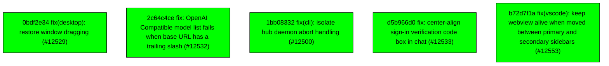

# Backport Agent — Detailed Run Report

> This file is generated automatically. It is intended for human analysts and
> AI reasoning models to assess agent performance, decision quality, and LLM behavior.

**Run timestamp**: 2026-08-03T10:35:24.020Z
**Models used**: fast=`mistral/mistral-code-agent-latest`  powerful=`openrouter/poolside/laguna-s-2.1:free`
**Prompt log**: `/Users/rlemeill/Development/tea-ching-cline/.backport-agent/run-1785752662184.prompts.jsonl`

---

## Summary (PR body)

## Backport Agent — Sync Report

**Date**: 2026-08-03T10:35:24.020Z
**Upstream ref**: `cline/cline.git@main`
**Cut date**: `2026-06-27T00:00:00.000Z` 
**Fork ref**: `TEA-ching/cline@keypool-live`
**Sync branch**: `sync/upstream-main-2026-08-03-102615`

### Summary

- ✅ Applied: 5
- ⚠️ Needs human review: 0
- ⛔ Blocked (not attempted): 0

### Applied commits

- `0bdf2e34` [low] fix(desktop): restore window dragging (#12529)
- `2c64c4ce` [low] fix: OpenAI Compatible model list fails when base URL has a trailing slash (#12532)
- `1bb08332` [low] fix(cli): isolate hub daemon abort handling (#12500)
- `d5b966d0` [low] fix: center-align sign-in verification code box in chat (#12533)
- `b72d7f1a` [low] fix(vscode): keep webview alive when moved between primary and secondary sidebars (#12553)

### Agent decision log

- All commits classified as low risk and applied successfully.
- Final validation passed.

---

## Agent Workflow Diagram

> Generated by the fast model from the run summary. Evaluate the agent's decision path.

---

## AI Sub-Agent Call Log (0 calls)

> Each entry is one sub-agent invocation. Review prompt/response pairs to assess
> reasoning quality, hallucinations, and decision accuracy.

_No AI sub-agent calls were made during this run._

---

## Decision Quality Metrics

> Automated quality signals derived from tool output guards, schema validation,
> hallucination detection, and consensus checks.  Review flagged items manually.

### Audit Event Timeline

| Timestamp | Tool | Event | Details |
|---|---|---|---|
| 10:24:22 | `loadCustomizations` | `manifest_loaded` | sourceKind="file", path=".backport-agent/customizations.yaml", sha256_16="6b63cdd33abb331e" |
| 10:26:10 | `classify_commit_risk` | `risk_classified` | sha="0bdf2e346886548baf240fb96f57725b9d8b288, level="low", changedFileCount=1 |
| 10:26:11 | `classify_commit_risk` | `risk_classified` | sha="2c64c4ce5be163ef091014d7e26428a1b254281, level="low", changedFileCount=4 |
| 10:26:11 | `classify_commit_risk` | `risk_classified` | sha="1bb0833287a7c1dfbb78d53060611bd1cdb3590, level="low", changedFileCount=1 |
| 10:26:11 | `classify_commit_risk` | `risk_classified` | sha="d5b966d0a841e28d5f779c53e183f350e66ce2d, level="low", changedFileCount=2 |
| 10:26:11 | `classify_commit_risk` | `risk_classified` | sha="b72d7f1a6fb4ff07e929a3893d467cb25944a64, level="low", changedFileCount=3 |
