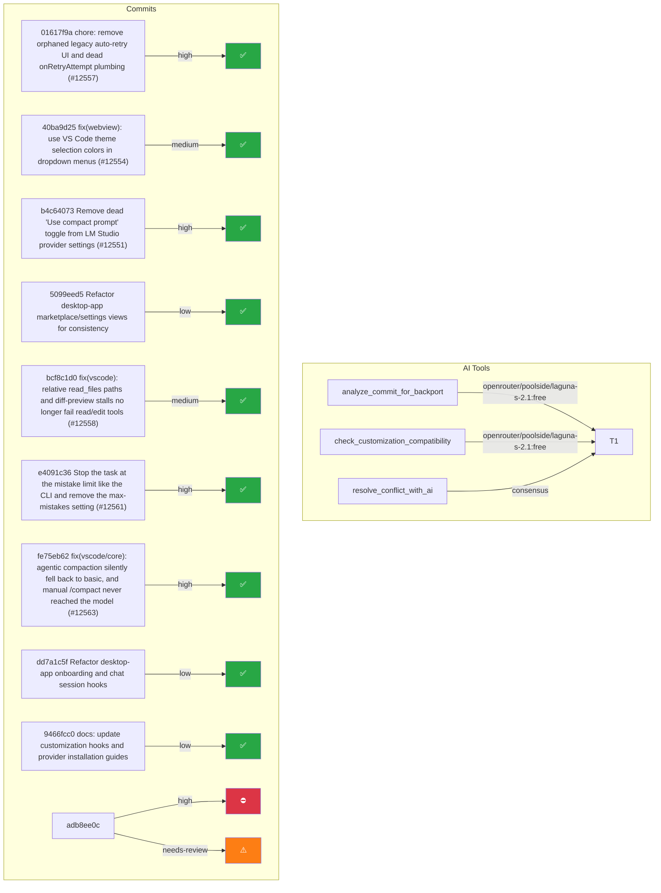

# Backport Agent — Detailed Run Report

> This file is generated automatically. It is intended for human analysts and
> AI reasoning models to assess agent performance, decision quality, and LLM behavior.

**Run timestamp**: 2026-08-03T11:07:37.131Z
**Models used**: fast=`mistral/mistral-code-agent-latest`  powerful=`openrouter/poolside/laguna-s-2.1:free`
**Prompt log**: `/Users/rlemeill/Development/tea-ching-cline/.backport-agent/run-1785753491691.prompts.jsonl`

---

## Summary (PR body)

## Backport Agent — Sync Report

**Date**: 2026-08-03T11:07:37.131Z
**Upstream ref**: `cline/cline.git@main`
**Cut date**: `2026-06-27T00:00:00.000Z` 
**Fork ref**: `TEA-ching/cline@keypool-live`
**Sync branch**: `sync/upstream-main-2026-08-03-104039`

### Summary

- ✅ Applied: 9
- ⚠️ Needs human review: 1
- ⛔ Blocked (not attempted): 1

### Applied commits

- `01617f9a` [high] chore: remove orphaned legacy auto-retry UI and dead onRetryAttempt plumbing (#12557)
- `40ba9d25` [medium] fix(webview): use VS Code theme selection colors in dropdown menus (#12554)
- `b4c64073` [high] Remove dead "Use compact prompt" toggle from LM Studio provider settings (#12551)
- `5099eed5` [low] Refactor desktop-app marketplace/settings views for consistency
- `bcf8c1d0` [medium] fix(vscode): relative read_files paths and diff-preview stalls no longer fail read/edit tools (#12558)
- `e4091c36` [high] Stop the task at the mistake limit like the CLI and remove the max-mistakes setting (#12561)
- `fe75eb62` [high] fix(vscode/core): agentic compaction silently fell back to basic, and manual /compact never reached the model (#12563)
- `dd7a1c5f` [low] Refactor desktop-app onboarding and chat session hooks
- `9466fcc0` [low] docs: update customization hooks and provider installation guides

### ⚠️ Human review required

- `adb8ee0c` fix(vscode): model ID under chat field stale / resets to gpt-4o for OpenAI Compatible (#12552)
  - Conflicted files: apps/vscode/src/shared/proto-conversions/models/api-configuration-conversion.ts, apps/vscode/src/shared/storage/state-keys.ts
  - Conflict-blocked: cherry-pick failed on apps/vscode/src/shared/proto-conversions/models/api-configuration-conversion.ts and apps/vscode/src/shared/storage/state-keys.ts. AI conflict resolution confidence was low; cherry-pick was aborted and requires human review before retry.

### Blocked commits (not attempted)

- `adb8ee0c` — Conflict-blocked: cherry-pick failed on apps/vscode/src/shared/proto-conversions/models/api-configuration-conversion.ts and apps/vscode/src/shared/storage/state-keys.ts. AI conflict resolution confidence was low; cherry-pick was aborted and requires human review before retry.

### Agent decision log

- Created sync branch sync/upstream-main-2026-08-03-104039
- Applied 9 commits cleanly
- Blocked 1 commit (adb8ee0c) due to conflicts requiring human review
- Ran high-risk validation suite (invariants, type checks, build, package, and mine tests) — all passed
- Ran final comprehensive validation (install, sdk build, vscode compile, vsix package, cli/chatbot build, and all tests) — all passed


---

## Agent Workflow Diagram

> Generated by the fast model from the run summary. Evaluate the agent's decision path.



---

## AI Sub-Agent Call Log (18 calls)

> Each entry is one sub-agent invocation. Review prompt/response pairs to assess
> reasoning quality, hallucinations, and decision accuracy.

### Call 1 / 18 — `check_customization_compatibility` ✅ OK

| Field | Value |
|---|---|
| **Timestamp** | 2026-08-03T10:40:28.226Z |
| **Tool** | `check_customization_compatibility` |
| **Model** | `openrouter/poolside/laguna-s-2.1:free` |
| **Duration** | 10749 ms |
| **Tokens in** | 11662 |
| **Tokens out** | 83 |
| **Cost** | $0.000000 |

**Prompt sent to sub-agent:**

```
Declared fork customisations:
  1. Pattern: apps/vscode/src/core/api/providers/cohere.ts,sdk/packages/llms/src/providers/vendors/cohere.ts,sdk/packages/llms/src/providers/vendors/cohere.test.ts,apps/vscode/src/core/prompts/system-prompt/variants/native-cohere/**,apps/vscode/webview-ui/src/components/settings/providers/CohereProvider.tsx,apps/vscode/webview-ui/src/components/settings/providers/CohereProvider.test.tsx,apps/vscode/src/shared/api.ts,apps/vscode/proto/cline/models.proto,apps/vscode/src/shared/proto-conversions/models/api-configuration-conversion.ts,apps/vscode/src/shared/storage/state-keys.ts,apps/vscode/src/sdk/cline-session-factory.ts,apps/vscode/webview-ui/src/components/settings/utils/providerUtils.ts,apps/vscode/webview-ui/src/components/settings/ApiOptions.tsx,apps/vscode/webview-ui/src/components/settings/providers/providerSettingsRegistry.ts,sdk/packages/llms/src/providers/builtins.ts,sdk/packages/llms/src/providers/builtin-types.ts,sdk/packages/llms/src/providers/ids.ts
     Description: Ajoute le fournisseur Cohere pour l'accès aux modèles de langage Cohere. Depuis 4.0.0, la logique vendor est dans sdk/packages/llms/src/providers/vendors/cohere.ts ; le legacy apps/vscode/src/core/api/providers/cohere.ts subsiste dans le fork. Le pont de la clé API entre l'extension VSCode et le SDK passe par PROVIDER_API_KEY_MAP dans cline-session-factory.ts — l'entrée 'cohere: "cohereApiKey"' est critique. Le fournisseur prend en charge la gestion des modèles Cohere, la configuration du raisonnement pour les modèles command-a* (mode thinking), la compatibilité des outils avec strict_tools, la correction des rapports d'utilisation des tokens via un wrapper fetch personnalisé, et un variant de prompt système dédié (native-cohere).

  2. Pattern: apps/vscode/src/core/api/providers/poolside.ts,sdk/packages/llms/src/providers/vendors/poolside.ts,sdk/packages/llms/src/providers/vendors/poolside.test.ts,apps/vscode/src/core/prompts/system-prompt/variants/poolside/**,apps/vscode/webview-ui/src/components/settings/providers/PoolsideProvider.tsx,apps/vscode/webview-ui/src/components/settings/providers/PoolsideProvider.test.tsx,apps/vscode/src/shared/api.ts,apps/vscode/proto/cline/models.proto,apps/vscode/src/shared/proto-conversions/models/api-configuration-conversion.ts,apps/vscode/src/shared/storage/state-keys.ts,apps/vscode/src/sdk/cline-session-factory.ts,sdk/packages/llms/src/providers/builtins.ts,sdk/packages/llms/src/providers/builtin-types.ts,sdk/packages/llms/src/providers/ids.ts,apps/vscode/webview-ui/src/components/settings/utils/providerUtils.ts,apps/vscode/webview-ui/src/components/settings/ApiOptions.tsx,apps/vscode/webview-ui/src/components/settings/providers/providerSettingsRegistry.ts
     Description: Ajoute le fournisseur Poolside pour l'accès aux modèles de langage Poolside. Depuis 4.0.0, la logique vendor est dans sdk/packages/llms/src/providers/vendors/poolside.ts ; le legacy apps/vscode/src/core/api/providers/poolside.ts subsiste dans le fork. SPÉCIFICITÉ CRITIQUE : l'API https://inference.poolside.ai requiert que le model ID inclue le préfixe "poolside/" (ex: "poolside/laguna-m.1"). Quand poolside est appelé en tant que sous-fournisseur via keypoollive, le composite ID "poolside/laguna-m.1" est parsé et le bare ID "laguna-m.1" est transmis — le vendor doit re-ajouter le préfixe. Le pont de la clé API passe par PROVIDER_API_KEY_MAP dans cline-session-factory.ts. Un variant de prompt système dédié (poolside) existe également.

  3. Pattern: apps/vscode/src/core/keypoollive/**,apps/vscode/src/core/api/providers/keypoollive.ts,apps/vscode/src/core/api/providers/__tests__/keypoollive.test.ts,apps/vscode/src/core/controller/models/keypool*.ts,apps/vscode/src/core/controller/models/resolveModelInfo.ts,apps/vscode/src/test/core/keypoollive/**,apps/vscode/src/sdk/cline-session-factory.ts,sdk/packages/llms/src/providers/vendors/keypoollive.ts,sdk/packages/llms/src/providers/vendors/keypoollive.test.ts,sdk/packages/llms/src/providers/vendors/keypoollive-browser.ts,sdk/packages/llms/src/providers/vendors/keypoollive-browser.example.ts,sdk/packages/llms/src/providers/ids.ts,sdk/packages/llms/src/providers/builtins.ts,sdk/packages/llms/src/providers/builtins-runtime.ts,sdk/packages/llms/src/providers/builtin-types.ts,sdk/packages/core/src/integration/keypoollive-tools.live.test.ts,sdk/packages/core/src/integration/keypoollive-vault.live.test.ts,apps/vscode/src/shared/api.ts,apps/vscode/proto/cline/models.proto,apps/vscode/src/shared/proto-conversions/models/api-configuration-conversion.ts,apps/vscode/src/shared/storage/state-keys.ts,apps/vscode/src/sdk/cline-session-factory.ts,apps/vscode/src/sdk/vscode-session-host.ts,apps/vscode/webview-ui/src/components/settings/providers/KeypoolLiveProvider.tsx,apps/vscode/webview-ui/src/components/settings/utils/providerUtils.ts,apps/vscode/webview-ui/src/utils/validate.ts,apps/vscode/webview-ui/src/components/settings/ApiOptions.tsx,sdk/packages/core/src/services/local-runtime-bootstrap.ts,sdk/packages/llms/src/providers/request-headers.ts
     Description: Ajoute le fournisseur KeypoolLive : accès à un coffre-fort de clés API chiffré (AiVault), gestion de pool de clés (KeyPool), rotation automatique, suivi d'utilisation via SQLite (KeypoolUsageDb), et gestion de session (SessionKeyManager). Le fournisseur est enregistré dans la chaîne complète : shared/api.ts → proto/cline/models.proto → api-configuration-conversion.ts → state-keys.ts (secrets) → cline-session-factory.ts → SDK vendor. Il expose onze RPC/contrôleurs keypool* (dont quatre RPCs gRPC historiques : keypoolGetVaultModels, keypoolRotateKey, keypoolGetUsageStats, keypoolGetErrorStats, plus keypoolCheckUpdate, keypoolGetLogMarkdown, keypoolGetRecentLogs, keypoolInjectEnvConfig, keypoolInstallUpdate, keypoolPurgeStats, keypoolSaveLogMarkdown). Un vendor navigateur (keypoollive-browser.ts) existe pour les contextes web.
FIXES POST-MIGRATION 4.0.0 appliqués dans le SDK vendor (keypoollive.ts) : - MAX_KEY_ATTEMPTS est dynamique (= nombre de clés dans le vault, via _poolKeys.length)
  et non hardcodé à 5. Sans ce fix, seules 5 clés sur N sont tentées lors d'une rotation.
- supportsImages est normalisé depuis inputModalities dans resolveNextApiConfig :
  certains fournisseurs vault (ex: Mistral) utilisent inputModalities: ["text","image"]
  au lieu d'un booléen supportsImages explicite.

FIXES dans la couche VSCode : - AiVault.ts normalise également supportsImages depuis inputModalities. - buildSessionConfig (cline-session-factory.ts) injecte KEYPOOL_VAULT_URL et
  KEYPOOL_LIVE_SECRET dans process.env ET injecte le contextWindow du vault
  (variable keypooliveContextWindow) pour le modèle sélectionné.
- resolveModelInfo inclut un step 4 de fallback vault (loadAiVault) pour keypoollive
  quand le catalog SDK retourne 'unknown'.
- providerUtils.ts keypoollive ne hardcode pas 128000 comme contextWindow par défaut.


Upstream diff to evaluate:
commit 01617f9a052ec83b55d3ae5501d9579f9cadba9a
Author: Saoud Rizwan <7799382+saoudrizwan@users.noreply.github.com>
Date:   Sat Jul 25 22:52:11 2026 -0700

    chore: remove orphaned legacy auto-retry UI and dead onRetryAttempt plumbing (#12557)
    
    The pre-SDK extension auto-retried failed API requests and surfaced
    'Auto-retrying in X seconds' rows (say:'error_retry') plus a retryStatus
    header on api_req_started. The SDK-based extension never emits either:
    errors map straight to an api_req_failed ask with a manual Retry button,
    and retrying is handled silently by the AI SDK / auth-refresh retry.
    
    Remove the orphaned webview rendering (ChatRow error_retry case,
    ErrorBlockTitle, combineErrorRetryMessages, isRequestInProgress chain,
    stories), the unused say types and proto enum values (reserved), the
    retryStatus field, and the never-invoked onRetryAttempt callback from
    ApiHandlerOptions, sdk-api-handler, and @cline/llms provider config.
    
    Legacy transcripts may still contain error_retry / api_req_retried rows;
    readUiMessages now drops them so old tasks don't render raw JSON.
    
    Co-authored-by: Cursor Agent <cursoragent@cursor.com>
    Co-authored-by: Saoud Rizwan <saoudrizwan@users.noreply.github.com>
---
 apps/vscode/proto/cline/ui.proto                   |  4 +-
 apps/vscode/src/sdk/legacy-state-reader.ts         | 10 ++-
 apps/vscode/src/sdk/sdk-api-handler.ts             |  1 -
 apps/vscode/src/sdk/task-proxy.ts                  |  1 -
 apps/vscode/src/shared/ExtensionMessage.ts         |  8 --
 apps/vscode/src/shared/api.ts                      |  1 -
 .../vscode/src/shared/combineErrorRetryMessages.ts | 87 ----------------------
 .../src/shared/proto-conversions/cline-message.ts  |  4 -
 apps/vscode/webview-ui/src/App.stories.tsx         | 48 ------------
 .../src/components/chat/BrowserSessionRow.tsx      |  4 +-
 .../webview-ui/src/components/chat/ChatRow.tsx     | 57 +-------------
 .../webview-ui/src/components/chat/ChatView.tsx    |  3 +-
 .../src/components/chat/ErrorBlockTitle.tsx        | 80 --------------------
 .../chat/__tests__/ErrorBlockTitle.spec.tsx        | 51 -------------
 .../components/messages/MessageRenderer.tsx        | 12 +--
 .../chat/chat-view/shared/buttonConfig.ts          |  1 -
 .../chat/chat-view/utils/messageUtils.ts           | 40 +---------
 sdk/packages/llms/src/providers/config.ts          |  8 --
 18 files changed, 20 insertions(+), 400 deletions(-)

diff --git a/apps/vscode/proto/cline/ui.proto b/apps/vscode/proto/cline/ui.proto
index 8a960129c9..62f68c0557 100644
--- a/apps/vscode/proto/cline/ui.proto
+++ b/apps/vscode/proto/cline/ui.proto
@@ -47,7 +47,7 @@ enum ClineSay {
   COMPLETION_RESULT_SAY = 6;
   USER_FEEDBACK = 7;
   USER_FEEDBACK_DIFF = 8;
-  API_REQ_RETRIED = 9;
+  reserved 9; // was API_REQ_RETRIED (legacy auto-retry, removed)
   COMMAND_SAY = 10;
   COMMAND_OUTPUT_SAY = 11;
   TOOL_SAY = 12;
@@ -66,7 +66,7 @@ enum ClineSay {
   LOAD_MCP_DOCUMENTATION = 25;
   INFO = 26;
   TASK_PROGRESS = 27;
-  ERROR_RETRY = 28;
+  reserved 28; // was ERROR_RETRY (legacy auto-retry, removed)
   HOOK_STATUS = 30;
   HOOK_OUTPUT_STREAM = 31;
   COMMAND_PERMISSION_DENIED = 32;
diff --git a/apps/vscode/src/sdk/legacy-state-reader.ts b/apps/vscode/src/sdk/legacy-state-reader.ts
index a7183515c0..ff94b8aaca 100644
--- a/apps/vscode/src/sdk/legacy-state-reader.ts
+++ b/apps/vscode/src/sdk/legacy-state-reader.ts
@@ -189,12 +189,20 @@ export function readApiConversationHistory(taskId: string, dataDir?: string): An
 	return readJsonFile<Anthropic.MessageParam[]>(apiConversationHistoryPath(taskId, dataDir), [])
 }
 
+/**
+ * Say types the legacy extension persisted but the current webview no longer
+ * renders (the pre-SDK auto-retry status rows). Dropped on read so old
+ * transcripts don't degrade into raw-JSON text rows.
+ */
+const REMOVED_LEGACY_SAY_TYPES = new Set(["error_retry", "api_req_retried"])
+
 /**
  * Read the UI messages for a specific task.
  * Returns an empty array if the file is missing or corrupt.
  */
 export function readUiMessages(taskId: string, dataDir?: string): ClineMessage[] {
-	return readJsonFile<ClineMessage[]>(uiMessagesPath(taskId, dataDir), [])
+	const messages = readJsonFile<ClineMessage[]>(uiMessagesPath(taskId, dataDir), [])
+	return messages.filter((message) => !REMOVED_LEGACY_SAY_TYPES.has((message as { say?: string }).say ?? ""))
 }
 
 /**
diff --git a/apps/vscode/src/sdk/sdk-api-handler.ts b/apps/vscode/src/sdk/sdk-api-handler.ts
index 5a30a92321..c96f1033c9 100644
--- a/apps/vscode/src/sdk/sdk-api-handler.ts
+++ b/apps/vscode/src/sdk/sdk-api-handler.ts
@@ -66,7 +66,6 @@ export function buildSdkProviderConfig(
 		// Use the proxy-aware fetch so gateway providers respect corporate proxy
 		// configuration (see .clinerules/network.md).
 		fetch,
-		onRetryAttempt: configuration.onRetryAttempt,
 		// Bedrock needs its region + structured AWS auth options forwarded to the
 		// SDK gateway. Without these, a pasted Bedrock API key / region is dropped.
 		...(providerId === "bedrock" ? buildBedrockProviderConfig(configuration, mode) : {}),
diff --git a/apps/vscode/src/sdk/task-proxy.ts b/apps/vscode/src/sdk/task-proxy.ts
index 0e1ad23542..ee58018353 100644
--- a/apps/vscode/src/sdk/task-proxy.ts
+++ b/apps/vscode/src/sdk/task-proxy.ts
@@ -141,7 +141,6 @@ interface TaskProxyTerminalManager {
  */
 interface TaskProxyState {
 	askResponse?: ClineAskResponse
-	autoRetryAttempts?: number
 	/** Focus chain checklist (stub — focus chain removed) */
 	currentFocusChainChecklist?: null
 	/** Abort flag for task cancellation (classic TaskState used boolean) */
diff --git a/apps/vscode/src/shared/ExtensionMessage.ts b/apps/vscode/src/shared/ExtensionMessage.ts
index f3ab226dfd..26c0434349 100644
--- a/apps/vscode/src/shared/ExtensionMessage.ts
+++ b/apps/vscode/src/shared/ExtensionMessage.ts
@@ -222,7 +222,6 @@ export type ClineAsk =
 export type ClineSay =
 	| "task"
 	| "error"
-	| "error_retry"
 	| "api_req_started"
 	| "api_req_finished"
 	| "text"
@@ -230,7 +229,6 @@ export type ClineSay =
 	| "completion_result"
 	| "user_feedback"
 	| "user_feedback_diff"
-	| "api_req_retried"
 	| "command"
 	| "command_output"
 	| "tool"
@@ -369,12 +367,6 @@ export interface ClineApiReqInfo {
 	cost?: number
 	cancelReason?: ClineApiReqCancelReason
 	streamingFailedMessage?: string
-	retryStatus?: {
-		attempt: number
-		maxAttempts: number
-		delaySec: number
-		errorSnippet?: string
-	}
 }
 
 /**
diff --git a/apps/vscode/src/shared/api.ts b/apps/vscode/src/shared/api.ts
index 14e43c02a6..4e13db0401 100644
--- a/apps/vscode/src/shared/api.ts
+++ b/apps/vscode/src/shared/api.ts
@@ -55,7 +55,6 @@ export const DEFAULT_API_PROVIDER = "openrouter" as ApiProvider
 
 export interface ApiHandlerOptions extends Partial<ApiHandlerSettings> {
 	ulid?: string // Used to identify the task in API requests
-	onRetryAttempt?: (attempt: number, maxRetries: number, delay: number, error: any) => void // Callback function
 }
 
 export type ApiConfiguration = ApiHandlerOptions
diff --git a/apps/vscode/src/shared/combineErrorRetryMessages.ts b/apps/vscode/src/shared/combineErrorRetryMessages.ts
deleted file mode 100644
index dec113d0b2..0000000000
--- a/apps/vscode/src/shared/combineErrorRetryMessages.ts
+++ /dev/null
@@ -1,87 +0,0 @@
-import { ClineMessage } from "./ExtensionMessage"
-
-/**
- * Consolidates error_retry messages in a retry sequence, keeping only the latest one,
- * and removes successful retry messages entirely.
- *
- * When an API request fails and auto-retry is enabled, multiple error_retry messages are created
- * (e.g., "Attempt 1 of 3", "Attempt 2 of 3", "Attempt 3 of 3"), interleaved with api_req_retried
- * messages. This function:
- * 1. Filters out earlier retry messages, showing only the most recent one
- * 2. Removes error_retry messages entirely when followed by a successful api_req_started
- *    (indicating the retry succeeded)
- *
- * @param messages - An array of ClineMessage objects to process.
- * @returns A new array of ClineMessage objects with error_retry sequences consolidated.
- *
- * @example
- * // During retry sequence - shows only latest attempt:
- * const messages: ClineMessage[] = [
- *   { type: 'say', say: 'error_retry', text: '{"attempt":1,"maxAttempts":3}', ts: 1000 },
- *   { type: 'say', say: 'api_req_retried', ts: 1001 },
- *   { type: 'say', say: 'error_retry', text: '{"attempt":2,"maxAttempts":3}', ts: 1002 },
- *   { type: 'say', say: 'api_req_retried', ts: 1003 },
- *   { type: 'say', say: 'error_retry', text: '{"attempt":3,"maxAttempts":3}', ts: 1004 },
- * ];
- * const result = combineErrorRetryMessages(messages);
- * // Result: [{ type: 'say', say: 'error_retry', text: '{"attempt":3,"maxAttempts":3}', ts: 1004 }]
- *
- * @example
- * // After successful retry - removes error_retry entirely:
- * const messages: ClineMessage[] = [
- *   { type: 'say', say: 'error_retry', text: '{"attempt":1,"maxAttempts":3}', ts: 1000 },
- *   { type: 'say', say: 'api_req_retried', ts: 1001 },
- *   { type: 'say', say: 'api_req_started', text: '{}', ts: 1002 },
- * ];
- * const result = combineErrorRetryMessages(messages);
- * // Result: [{ type: 'say', say: 'api_req_started', text: '{}', ts: 1002 }]
- */
-export function combineErrorRetryMessages(messages: ClineMessage[]): ClineMessage[] {
-	const result: ClineMessage[] = []
-
-	for (let i = 0; i < messages.length; i++) {
-		const message = messages[i]
-
-		if (message.say === "error_retry") {
-			// Look ahead to find if there's another error_retry before the next api_req_started
-			let hasLaterErrorRetry = false
-			let hasApiReqStartedBefore = false
-
-			for (let j = i + 1; j < messages.length; j++) {
-				const laterMessage = messages[j]
-				if (laterMessage.say === "api_req_started") {
-					hasApiReqStartedBefore = true
-					break
-				}
-				if (laterMessage.say === "error_retry") {
-					hasLaterErrorRetry = true
-					break
-				}
-			}
-
-			// Case 1: Another error_retry follows before api_req_started - skip this one
-			if (hasLaterErrorRetry) {
-				continue
-			}
-
-			// Case 2: api_req_started follows (no later error_retry) - retry succeeded
-			// Don't show the error_retry unless it has failed: true
-			if (hasApiReqStartedBefore) {
-				try {
-					const retryInfo = JSON.parse(message.text || "{}")
-					// Only skip if this wasn't a final failure message
-					if (!retryInfo.failed) {
-						continue
-					}
-				} catch {
-					// If we can't parse, still skip to be safe
-					continue
-				}
-			}
-		}
-
-		result.push(message)
-	}
-
-	return result
-}
diff --git a/apps/vscode/src/shared/proto-conversions/cline-message.ts b/apps/vscode/src/shared/proto-conversions/cline-message.ts
index f32d75f3d0..8eaeb5b80f 100644
--- a/apps/vscode/src/shared/proto-conversions/cline-message.ts
+++ b/apps/vscode/src/shared/proto-conversions/cline-message.ts
@@ -80,7 +80,6 @@ function convertClineSayToProtoEnum(say: AppClineSay | undefined): ClineSay | un
 		completion_result: ClineSay.COMPLETION_RESULT_SAY,
 		user_feedback: ClineSay.USER_FEEDBACK,
 		user_feedback_diff: ClineSay.USER_FEEDBACK_DIFF,
-		api_req_retried: ClineSay.API_REQ_RETRIED,
 		command: ClineSay.COMMAND_SAY,
 		command_output: ClineSay.COMMAND_OUTPUT_SAY,
 		tool: ClineSay.TOOL_SAY,
@@ -101,7 +100,6 @@ function convertClineSayToProtoEnum(say: AppClineSay | undefined): ClineSay | un
 		load_mcp_documentation: ClineSay.LOAD_MCP_DOCUMENTATION,
 		info: ClineSay.INFO,
 		task_progress: ClineSay.TASK_PROGRESS,
-		error_retry: ClineSay.ERROR_RETRY,
 		hook_status: ClineSay.HOOK_STATUS,
 		hook_output_stream: ClineSay.HOOK_OUTPUT_STREAM,
 		conditional_rules_applied: ClineSay.CONDITIONAL_RULES_APPLIED,
@@ -132,7 +130,6 @@ function convertProtoEnumToClineSay(say: ClineSay): AppClineSay | undefined {
 		[ClineSay.COMPLETION_RESULT_SAY]: "completion_result",
 		[ClineSay.USER_FEEDBACK]: "user_feedback",
 		[ClineSay.USER_FEEDBACK_DIFF]: "user_feedback_diff",
-		[ClineSay.API_REQ_RETRIED]: "api_req_retried",
 		[ClineSay.COMMAND_SAY]: "command",
 		[ClineSay.COMMAND_OUTPUT_SAY]: "command_output",
 		[ClineSay.TOOL_SAY]: "tool",
@@ -152,7 +149,6 @@ function convertProtoEnumToClineSay(say: ClineSay): AppClineSay | undefined {
 		[ClineSay.LOAD_MCP_DOCUMENTATION]: "load_mcp_documentation",
 		[ClineSay.INFO]: "info",
 		[ClineSay.TASK_PROGRESS]: "task_progress",
-		[ClineSay.ERROR_RETRY]: "error_retry",
 		[ClineSay.HOOK_STATUS]: "hook_status",
 		[ClineSay.HOOK_OUTPUT_STREAM]: "hook_output_stream",
 		[ClineSay.CONDITIONAL_RULES_APPLIED]: "conditional_rules_applied",
diff --git a/apps/vscode/webview-ui/src/App.stories.tsx b/apps/vscode/webview-ui/src/App.stories.tsx
index 30ab041678..253d339e53 100644
--- a/apps/vscode/webview-ui/src/App.stories.tsx
+++ b/apps/vscode/webview-ui/src/App.stories.tsx
@@ -855,54 +855,6 @@ export const ShellIntegrationWarning: Story = {
 	},
 }
 
-export const ErrorRetryInProgress: Story = {
-	decorators: [
-		createStoryDecorator({
-			clineMessages: [
-				createMessage(5, "say", "task", "Process a request"),
-				createMessage(4.7, "say", "text", "Attempting to process your request."),
-				createMessage(
-					4.5,
-					"say",
-					"error_retry",
-					JSON.stringify({ attempt: 2, maxAttempts: 5, delaySeconds: 10, failed: false }),
-				),
-			],
-		}),
-	],
-	parameters: {
-		docs: {
-			description: {
-				story: "Shows auto-retry in progress with attempt count and delay.",
-			},
-		},
-	},
-}
-
-export const ErrorRetryFailed: Story = {
-	decorators: [
-		createStoryDecorator({
-			clineMessages: [
-				createMessage(5, "say", "task", "Process a request"),
-				createMessage(4.7, "say", "text", "Attempting to process your request."),
-				createMessage(
-					4.5,
-					"say",
-					"error_retry",
-					JSON.stringify({ attempt: 5, maxAttempts: 5, delaySeconds: 0, failed: true }),
-				),
-			],
-		}),
-	],
-	parameters: {
-		docs: {
-			description: {
-				story: "Shows auto-retry failed after max attempts with manual intervention required.",
-			},
-		},
-	},
-}
-
 // Diff Edit Stories - New Format
 const createNewFormatMultiFileMessages = () => [
 	createMessage(5, "say", "task", "Help me refactor the authentication module"),
diff --git a/apps/vscode/webview-ui/src/components/chat/BrowserSessionRow.tsx b/apps/vscode/webview-ui/src/components/chat/BrowserSessionRow.tsx
index 2a449cf486..9a4ce34d0d 100644
--- a/apps/vscode/webview-ui/src/components/chat/BrowserSessionRow.tsx
+++ b/apps/vscode/webview-ui/src/components/chat/BrowserSessionRow.tsx
@@ -192,8 +192,7 @@ const BrowserSessionRow = memo((props: BrowserSessionRowProps) => {
 				message.say === "api_req_started" ||
 				message.say === "text" ||
 				message.say === "reasoning" ||
-				message.say === "browser_action" ||
-				message.say === "error_retry"
+				message.say === "browser_action"
 			) {
 				// These messages lead to the next result, so they should always go in nextActionMessages
 				nextActionMessages.push(message)
@@ -532,7 +531,6 @@ const BrowserSessionRowContent = memo(
 					case "api_req_started":
 					case "text":
 					case "reasoning":
-					case "error_retry":
 						return (
 							<div style={chatRowContentContainerStyle}>
 								<ChatRowContent
diff --git a/apps/vscode/webview-ui/src/components/chat/ChatRow.tsx b/apps/vscode/webview-ui/src/components/chat/ChatRow.tsx
index bf99baa65d..f4628a0f42 100644
--- a/apps/vscode/webview-ui/src/components/chat/ChatRow.tsx
+++ b/apps/vscode/webview-ui/src/components/chat/ChatRow.tsx
@@ -24,7 +24,6 @@ import {
 	Link2Icon,
 	LoaderCircleIcon,
 	PencilIcon,
-	RefreshCwIcon,
 	SearchIcon,
 	SettingsIcon,
 	SquareArrowOutUpRightIcon,
@@ -80,7 +79,6 @@ interface ChatRowProps {
 	mode?: Mode
 	reasoningContent?: string
 	responseStarted?: boolean
-	isRequestInProgress?: boolean
 }
 
 export interface QuoteButtonState {
@@ -145,7 +143,6 @@ export const ChatRowContent = memo(
 		onCancelCommand,
 		onLastRowContentChange,
 		mode,
-		isRequestInProgress,
 		reasoningContent,
 		responseStarted,
 	}: ChatRowContentProps) => {
@@ -195,16 +192,14 @@ export const ChatRowContent = memo(
 		const [cost, apiReqCancelReason, apiReqStreamingFailedMessage] = useMemo(() => {
 			if (message.text != null && message.say === "api_req_started") {
 				const info: ClineApiReqInfo = JSON.parse(message.text)
-				return [info.cost, info.cancelReason, info.streamingFailedMessage, info.retryStatus]
+				return [info.cost, info.cancelReason, info.streamingFailedMessage]
 			}
-			return [undefined, undefined, undefined, undefined, undefined]
+			return [undefined, undefined, undefined]
 		}, [message.text, message.say])
 
 		// when resuming task last won't be api_req_failed but a resume_task message so api_req_started will show loading spinner. that's why we just remove the last api_req_started that failed without streaming anything
 		const apiRequestFailedMessage =
-			isLast && lastModifiedMessage?.ask === "api_req_failed" // if request is retried then the latest message is a api_req_retried
-				? lastModifiedMessage?.text
-				: undefined
+			isLast && lastModifiedMessage?.ask === "api_req_failed" ? lastModifiedMessage?.text : undefined
 
 		const type = message.type === "ask" ? message.ask : message.say
 
@@ -965,52 +960,6 @@ export const ChatRowContent = memo(
 								</div>
 							</div>
 						)
-					case "error_retry":
-						try {
-							const retryInfo = JSON.parse(message.text || "{}")
-							const { attempt, maxAttempts, delaySeconds, failed, errorMessage } = retryInfo
-							const isFailed = failed === true
-
-							return (
-								<div className="flex flex-col gap-2">
-									{errorMessage && (
-										<p className="m-0 whitespace-pre-wrap text-error wrap-anywhere text-xs">{errorMessage}</p>
-									)}
-									<div className="flex flex-col bg-quote p-0 rounded-[3px] text-[12px] p-3">
-										<div className="flex items-center mb-1">
-											{isFailed && !isRequestInProgress ? (
-												<TriangleAlertIcon className="mr-2 size-2" />
-											) : (
-												<RefreshCwIcon className="mr-2 size-2 animate-spin" />
-											)}
-											<span className="font-medium text-foreground">
-												{isFailed ? "Auto-Retry Failed" : "Auto-Retry in Progress"}
-											</span>
-										</div>
-										<div className="text-foreground opacity-80">
-											{isFailed ? (
-												<span>
-													Auto-retry failed after <strong>{maxAttempts}</strong> attempts. Manual
-													intervention required.
-												</span>
-											) : (
-												<span>
-													Attempt <strong>{attempt}</strong> of <strong>{maxAttempts}</strong> -
-													Retrying in {delaySeconds} seconds...
-												</span>
-											)}
-										</div>
-									</div>
-								</div>
-							)
-						} catch (_e) {
-							// Fallback if JSON parsing fails
-							return (
-								<div className="text-foreground">
-									<MarkdownRow markdown={message.text} />
-								</div>
-							)
-						}
 					case "hook_status":
 						return <HookMessage CommandOutput={CommandOutputContent} message={message} />
 					case "hook_output_stream":
diff --git a/apps/vscode/webview-ui/src/components/chat/ChatView.tsx b/apps/vscode/webview-ui/src/components/chat/ChatView.tsx
index 925c64fdbe..f6c61a1e19 100644
--- a/apps/vscode/webview-ui/src/components/chat/ChatView.tsx
+++ b/apps/vscode/webview-ui/src/components/chat/ChatView.tsx
@@ -1,6 +1,5 @@
 import { combineApiRequests } from "@shared/combineApiRequests"
 import { combineCommandSequences } from "@shared/combineCommandSequences"
-import { combineErrorRetryMessages } from "@shared/combineErrorRetryMessages"
 import { combineHookSequences } from "@shared/combineHookSequences"
 import type { ClineMessage } from "@shared/ExtensionMessage"
 import { getApiMetrics, getLastApiReqTotalTokens } from "@shared/getApiMetrics"
@@ -124,7 +123,7 @@ const ChatView = ({ isHidden, showAnnouncement, hideAnnouncement, showHistoryVie
 		const slicedMessages = displayMessages.slice(1)
 		// Only combine hook sequences if hooks are enabled
 		const withHooks = hooksEnabled ? combineHookSequences(slicedMessages) : slicedMessages
-		return combineErrorRetryMessages(combineApiRequests(combineCommandSequences(withHooks)))
+		return combineApiRequests(combineCommandSequences(withHooks))
 	}, [displayMessages, hooksEnabled])
 	// has to be after api_req_finished are all reduced into api_req_started messages
 	const apiMetrics = useMemo(() => getApiMetrics(modifiedMessages), [modifiedMessages])
diff --git a/apps/vscode/webview-ui/src/components/chat/ErrorBlockTitle.tsx b/apps/vscode/webview-ui/src/components/chat/ErrorBlockTitle.tsx
deleted file mode 100644
index 077162db65..0000000000
--- a/apps/vscode/webview-ui/src/components/chat/ErrorBlockTitle.tsx
+++ /dev/null
@@ -1,80 +0,0 @@
-import React from "react"
-import { ClineError, ClineErrorType } from "../../../../src/services/error/ClineError"
-import { ProgressIndicator } from "./ChatRow"
-
-interface ErrorBlockTitleProps {
-	cost?: number
-	apiReqCancelReason?: string
-	apiRequestFailedMessage?: string
-	retryStatus?: {
-		attempt: number
-		maxAttempts: number
-		delaySec?: number
-		errorSnippet?: string
-	}
-}
-
-export const ErrorBlockTitle = ({
-	cost,
-	apiReqCancelReason,
-	apiRequestFailedMessage,
-	retryStatus,
-}: ErrorBlockTitleProps): [React.ReactElement, React.ReactElement] => {
-	const getIconSpan = (iconName: string, colorClass: string) => (
-		<div className="w-4 h-4 flex items-center justify-center">
-			<span className={`codicon codicon-${iconName} text-base -mb-0.5 ${colorClass}`} />
-		</div>
-	)
-
-	const icon =
-		apiReqCancelReason != null ? (
-			apiReqCancelReason === "user_cancelled" ? (
-				getIconSpan("error", "text-(--vscode-descriptionForeground)")
-			) : (
-				getIconSpan("error", "text-(--vscode-errorForeground)")
-			)
-		) : cost != null ? (
-			getIconSpan("check", "text-(--vscode-charts-green)")
-		) : apiRequestFailedMessage ? (
-			getIconSpan("error", "text-(--vscode-errorForeground)")
-		) : (
-			<ProgressIndicator />
-		)
-
-	const title = (() => {
-		// Default loading state
-		const details = { title: "API Request...", classNames: ["font-bold"] }
-		// Handle cancellation states first
-		if (apiReqCancelReason === "user_cancelled") {
-			details.title = "API Request Cancelled"
-			details.classNames.push("text-(--vscode-foreground)")
-		} else if (apiReqCancelReason != null) {
-			details.title = "API Request Failed"
-			details.classNames.push("text-(--vscode-errorForeground)")
-		} else if (cost != null) {
-			// Handle completed request
-			details.title = "API Request"
-			details.classNames.push("text-(--vscode-foreground)")
-		} else if (apiRequestFailedMessage) {
-			// Handle failed request
-			const clineError = ClineError.parse(apiRequestFailedMessage)
-			const titleText = clineError?.isErrorType(ClineErrorType.Entitlement)
-				? "ClinePass Required"
-				: clineError?.isErrorType(ClineErrorType.Balance)
-					? "Credit Limit Reached"
-					: clineError?.isErrorType(ClineErrorType.SpendLimit)
-						? "Spend Limit Reached"
-						: "API Request Failed"
-			details.title = titleText
-			details.classNames.push("font-bold text-(--vscode-errorForeground)")
-		} else if (retryStatus) {
-			// Handle retry state
-			details.title = "API Request"
-			details.classNames.push("text-(--vscode-foreground)")
-		}
-
-		return <span className={details.classNames.join(" ")}>{details.title}</span>
-	})()
-
-	return [icon, title]
-}
diff --git a/apps/vscode/webview-ui/src/components/chat/__tests__/ErrorBlockTitle.spec.tsx b/apps/vscode/webview-ui/src/components/chat/__tests__/ErrorBlockTitle.spec.tsx
deleted file mode 100644
index 688309d3a1..0000000000
--- a/apps/vscode/webview-ui/src/components/chat/__tests__/ErrorBlockTitle.spec.tsx
+++ /dev/null
@@ -1,51 +0,0 @@
-import { describe, expect, it } from "vitest"
-import { ErrorBlockTitle } from "../ErrorBlockTitle"
-
-describe("ErrorBlockTitle", () => {
-	it("should return icon and title for API request cancelled", () => {
-		const [icon, title] = ErrorBlockTitle({
-			apiReqCancelReason: "user_cancelled",
-		})
-
-		expect(icon).toBeDefined()
-		expect(title).toBeDefined()
-	})
-
-	it("should return icon and title for completed API request", () => {
-		const [icon, title] = ErrorBlockTitle({
-			cost: 0.001,
-		})
-
-		expect(icon).toBeDefined()
-		expect(title).toBeDefined()
-	})
-
-	it("should return icon and title for failed API request", () => {
-		const [icon, title] = ErrorBlockTitle({
-			apiRequestFailedMessage: "Request failed",
-		})
-
-		expect(icon).toBeDefined()
-		expect(title).toBeDefined()
-	})
-
-	it("should return icon and title for retry status", () => {
-		const [icon, title] = ErrorBlockTitle({
-			retryStatus: {
-				attempt: 2,
-				maxAttempts: 3,
-				delaySec: 5,
-			},
-		})
-
-		expect(icon).toBeDefined()
-		expect(title).toBeDefined()
-	})
-
-	it("should return icon and title for default API request", () => {
-		const [icon, title] = ErrorBlockTitle({})
-
-		expect(icon).toBeDefined()
-		expect(title).toBeDefined()
-	})
-})
diff --git a/apps/vscode/webview-ui/src/components/chat/chat-view/components/messages/MessageRenderer.tsx b/apps/vscode/webview-ui/src/components/chat/chat-view/components/messages/MessageRenderer.tsx
index 13be520a1a..ec129fdd53 100644
--- a/apps/vscode/webview-ui/src/components/chat/chat-view/components/messages/MessageRenderer.tsx
+++ b/apps/vscode/webview-ui/src/components/chat/chat-view/components/messages/MessageRenderer.tsx
@@ -6,7 +6,7 @@ import ChatRow from "@/components/chat/ChatRow"
 import { useExtensionState } from "@/context/ExtensionStateContext"
 import { cn } from "@/lib/utils"
 import type { MessageHandlers } from "../../types/chatTypes"
-import { findReasoningForApiReq, isTextMessagePendingToolCall, isToolGroup } from "../../utils/messageUtils"
+import { findReasoningForApiReq, isToolGroup } from "../../utils/messageUtils"
 import { ToolGroupRenderer } from "./ToolGroupRenderer"
 
 interface MessageRendererProps {
@@ -55,15 +55,6 @@ const MessageRenderer: React.FC<MessageRendererProps> = ({
 		return { reasoning: undefined, responseStarted: false }
 	}, [messageOrGroup, modifiedMessages])
 
-	// Check if a text message is waiting for tool call completion
-	const isRequestInProgress = useMemo(() => {
-		if (!Array.isArray(messageOrGroup) && messageOrGroup.say === "text") {
-			// Use modifiedMessages so this stays consistent with the rendered list.
-			return isTextMessagePendingToolCall(messageOrGroup.ts, modifiedMessages)
-		}
-		return false
-	}, [messageOrGroup, modifiedMessages])
-
 	// Tool group (low-stakes tools grouped together)
 	// Determine if this is the last tool group to show active items
 	const isLastToolGroup = useMemo(() => {
@@ -110,7 +101,6 @@ const MessageRenderer: React.FC<MessageRendererProps> = ({
 				inputValue={inputValue}
 				isExpanded={expandedRows[messageOrGroup.ts] || false}
 				isLast={isLastMessage}
-				isRequestInProgress={isRequestInProgress}
 				key={messageOrGroup.ts}
 				lastModifiedMessage={modifiedMessages.at(-1)}
 				message={messageOrGroup}
diff --git a/apps/vscode/webview-ui/src/components/chat/chat-view/shared/buttonConfig.ts b/apps/vscode/webview-ui/src/components/chat/chat-view/shared/buttonConfig.ts
index 1bd00d37b0..8fc02b91fe 100644
--- a/apps/vscode/webview-ui/src/components/chat/chat-view/shared/buttonConfig.ts
+++ b/apps/vscode/webview-ui/src/components/chat/chat-view/shared/buttonConfig.ts
@@ -337,7 +337,6 @@ function isInertStatusMessage(message: ClineMessage): boolean {
 
 	return [
 		"api_req_finished",
-		"api_req_retried",
 		"deleted_api_reqs",
 		"mcp_server_request_started",
 		"subagent_usage",
diff --git a/apps/vscode/webview-ui/src/components/chat/chat-view/utils/messageUtils.ts b/apps/vscode/webview-ui/src/components/chat/chat-view/utils/messageUtils.ts
index 6bfec30ab6..0c7a91d230 100644
--- a/apps/vscode/webview-ui/src/components/chat/chat-view/utils/messageUtils.ts
+++ b/apps/vscode/webview-ui/src/components/chat/chat-view/utils/messageUtils.ts
@@ -138,7 +138,6 @@ export function filterVisibleMessages(messages: ClineMessage[]): ClineMessage[]
 		}
 		switch (message.say) {
 			case "api_req_finished": // combineApiRequests removes this from modifiedMessages anyways
-			case "api_req_retried": // this message is used to update the latest api_req_started that the request was retried
 			case "deleted_api_reqs": // aggregated api_req metrics from deleted messages
 			case "subagent_usage": // aggregated subagent usage metrics for task-level accounting
 			case "task_progress": // task progress messages are displayed in TaskHeader, not in main chat
@@ -185,15 +184,9 @@ function isBrowserSessionMessage(message: ClineMessage): boolean {
 		return message.ask === "browser_action_launch"
 	}
 	if (message.type === "say") {
-		return [
-			"browser_action_launch",
-			"api_req_started",
-			"text",
-			"browser_action",
-			"browser_action_result",
-			"reasoning",
-			"error_retry",
-		].includes(message.say ?? "")
+		return ["browser_action_launch", "api_req_started", "text", "browser_action", "browser_action_result", "reasoning"].includes(
+			message.say ?? "",
+		)
 	}
 	return false
 }
@@ -304,33 +297,6 @@ export function findReasoningForApiReq(
 	}
 }
 
-/**
- * Check if a text message's associated API request is still in progress.
- * Returns true if there's no cost yet on the parent api_req_started.
- */
-export function isTextMessagePendingToolCall(textTs: number, allMessages: ClineMessage[]): boolean {
-	// Find the api_req_started that precedes this text message
-	const textIndex = allMessages.findIndex((m) => m.ts === textTs)
-	if (textIndex === -1) {
-		return false
-	}
-
-	// Look backwards for the most recent api_req_started
-	for (let i = textIndex - 1; i >= 0; i--) {
-		const msg = allMessages[i]
-		if (msg.say === "api_req_started" && msg.text) {
-			try {
-				const info = JSON.parse(msg.text)
-				// If no cost, the request is still in progress
-				return info.cost == null
-			} catch {
-				return false
-			}
-		}
-	}
-	return false
-}
-
 /**
  * Filter a tool group to exclude tools that are in the "current activities" range.
  * Returns the filtered array of messages (may be empty).
diff --git a/sdk/packages/llms/src/providers/config.ts b/sdk/packages/llms/src/providers/config.ts
index 3ae60da871..eb7962050c 100644
--- a/sdk/packages/llms/src/providers/config.ts
+++ b/sdk/packages/llms/src/providers/config.ts
@@ -310,14 +310,6 @@ export interface ProviderConfig
 	/** Task/session ID for telemetry */
 	taskId?: string;
 
-	/** Retry callback */
-	onRetryAttempt?: (
-		attempt: number,
-		maxRetries: number,
-		delay: number,
-		error: unknown,
-	) => void;
-
 	/** AbortSignal for cancelling requests */
 	abortSignal?: AbortSignal;

Output the JSON object now.
```

**Response received:**

````
```json
{
  "compatible": true,
  "affectedCustomizations": [],
  "semanticConflicts": [],
  "warnings": [],
  "recommendation": "No semantic conflicts detected; the upstream change removes dead auto-retry UI plumbing that does not overlap with the fork's custom provider logic (Cohere/Poolside/KeypoolLive)."
}
```
````

---

### Call 2 / 18 — `analyze_commit_for_backport` ✅ OK

| Field | Value |
|---|---|
| **Timestamp** | 2026-08-03T10:40:36.294Z |
| **Tool** | `analyze_commit_for_backport` |
| **Model** | `openrouter/poolside/laguna-s-2.1:free` |
| **Duration** | 7996 ms |
| **Tokens in** | 14906 |
| **Tokens out** | 250 |
| **Cost** | $0.000000 |

**Prompt sent to sub-agent:**

```
Commit SHA: 01617f9a052ec83b55d3ae5501d9579f9cadba9a
Commit message:
chore: remove orphaned legacy auto-retry UI and dead onRetryAttempt plumbing (#12557)

Changed files (18):
apps/vscode/proto/cline/ui.proto
apps/vscode/src/sdk/legacy-state-reader.ts
apps/vscode/src/sdk/sdk-api-handler.ts
apps/vscode/src/sdk/task-proxy.ts
apps/vscode/src/shared/ExtensionMessage.ts
apps/vscode/src/shared/api.ts
DELETE:apps/vscode/src/shared/combineErrorRetryMessages.ts
apps/vscode/src/shared/proto-conversions/cline-message.ts
apps/vscode/webview-ui/src/App.stories.tsx
apps/vscode/webview-ui/src/components/chat/BrowserSessionRow.tsx
apps/vscode/webview-ui/src/components/chat/ChatRow.tsx
apps/vscode/webview-ui/src/components/chat/ChatView.tsx
DELETE:apps/vscode/webview-ui/src/components/chat/ErrorBlockTitle.tsx
DELETE:apps/vscode/webview-ui/src/components/chat/__tests__/ErrorBlockTitle.spec.tsx
apps/vscode/webview-ui/src/components/chat/chat-view/components/messages/MessageRenderer.tsx
apps/vscode/webview-ui/src/components/chat/chat-view/shared/buttonConfig.ts
apps/vscode/webview-ui/src/components/chat/chat-view/utils/messageUtils.ts
sdk/packages/llms/src/providers/config.ts

Diff:
commit 01617f9a052ec83b55d3ae5501d9579f9cadba9a
Author: Saoud Rizwan <7799382+saoudrizwan@users.noreply.github.com>
Date:   Sat Jul 25 22:52:11 2026 -0700

    chore: remove orphaned legacy auto-retry UI and dead onRetryAttempt plumbing (#12557)
    
    The pre-SDK extension auto-retried failed API requests and surfaced
    'Auto-retrying in X seconds' rows (say:'error_retry') plus a retryStatus
    header on api_req_started. The SDK-based extension never emits either:
    errors map straight to an api_req_failed ask with a manual Retry button,
    and retrying is handled silently by the AI SDK / auth-refresh retry.
    
    Remove the orphaned webview rendering (ChatRow error_retry case,
    ErrorBlockTitle, combineErrorRetryMessages, isRequestInProgress chain,
    stories), the unused say types and proto enum values (reserved), the
    retryStatus field, and the never-invoked onRetryAttempt callback from
    ApiHandlerOptions, sdk-api-handler, and @cline/llms provider config.
    
    Legacy transcripts may still contain error_retry / api_req_retried rows;
    readUiMessages now drops them so old tasks don't render raw JSON.
    
    Co-authored-by: Cursor Agent <cursoragent@cursor.com>
    Co-authored-by: Saoud Rizwan <saoudrizwan@users.noreply.github.com>
---
 apps/vscode/proto/cline/ui.proto                   |  4 +-
 apps/vscode/src/sdk/legacy-state-reader.ts         | 10 ++-
 apps/vscode/src/sdk/sdk-api-handler.ts             |  1 -
 apps/vscode/src/sdk/task-proxy.ts                  |  1 -
 apps/vscode/src/shared/ExtensionMessage.ts         |  8 --
 apps/vscode/src/shared/api.ts                      |  1 -
 .../vscode/src/shared/combineErrorRetryMessages.ts | 87 ----------------------
 .../src/shared/proto-conversions/cline-message.ts  |  4 -
 apps/vscode/webview-ui/src/App.stories.tsx         | 48 ------------
 .../src/components/chat/BrowserSessionRow.tsx      |  4 +-
 .../webview-ui/src/components/chat/ChatRow.tsx     | 57 +-------------
 .../webview-ui/src/components/chat/ChatView.tsx    |  3 +-
 .../src/components/chat/ErrorBlockTitle.tsx        | 80 --------------------
 .../chat/__tests__/ErrorBlockTitle.spec.tsx        | 51 -------------
 .../components/messages/MessageRenderer.tsx        | 12 +--
 .../chat/chat-view/shared/buttonConfig.ts          |  1 -
 .../chat/chat-view/utils/messageUtils.ts           | 40 +---------
 sdk/packages/llms/src/providers/config.ts          |  8 --
 18 files changed, 20 insertions(+), 400 deletions(-)

diff --git a/apps/vscode/proto/cline/ui.proto b/apps/vscode/proto/cline/ui.proto
index 8a960129c9..62f68c0557 100644
--- a/apps/vscode/proto/cline/ui.proto
+++ b/apps/vscode/proto/cline/ui.proto
@@ -47,7 +47,7 @@ enum ClineSay {
   COMPLETION_RESULT_SAY = 6;
   USER_FEEDBACK = 7;
   USER_FEEDBACK_DIFF = 8;
-  API_REQ_RETRIED = 9;
+  reserved 9; // was API_REQ_RETRIED (legacy auto-retry, removed)
   COMMAND_SAY = 10;
   COMMAND_OUTPUT_SAY = 11;
   TOOL_SAY = 12;
@@ -66,7 +66,7 @@ enum ClineSay {
   LOAD_MCP_DOCUMENTATION = 25;
   INFO = 26;
   TASK_PROGRESS = 27;
-  ERROR_RETRY = 28;
+  reserved 28; // was ERROR_RETRY (legacy auto-retry, removed)
   HOOK_STATUS = 30;
   HOOK_OUTPUT_STREAM = 31;
   COMMAND_PERMISSION_DENIED = 32;
diff --git a/apps/vscode/src/sdk/legacy-state-reader.ts b/apps/vscode/src/sdk/legacy-state-reader.ts
index a7183515c0..ff94b8aaca 100644
--- a/apps/vscode/src/sdk/legacy-state-reader.ts
+++ b/apps/vscode/src/sdk/legacy-state-reader.ts
@@ -189,12 +189,20 @@ export function readApiConversationHistory(taskId: string, dataDir?: string): An
 	return readJsonFile<Anthropic.MessageParam[]>(apiConversationHistoryPath(taskId, dataDir), [])
 }
 
+/**
+ * Say types the legacy extension persisted but the current webview no longer
+ * renders (the pre-SDK auto-retry status rows). Dropped on read so old
+ * transcripts don't degrade into raw-JSON text rows.
+ */
+const REMOVED_LEGACY_SAY_TYPES = new Set(["error_retry", "api_req_retried"])
+
 /**
  * Read the UI messages for a specific task.
  * Returns an empty array if the file is missing or corrupt.
  */
 export function readUiMessages(taskId: string, dataDir?: string): ClineMessage[] {
-	return readJsonFile<ClineMessage[]>(uiMessagesPath(taskId, dataDir), [])
+	const messages = readJsonFile<ClineMessage[]>(uiMessagesPath(taskId, dataDir), [])
+	return messages.filter((message) => !REMOVED_LEGACY_SAY_TYPES.has((message as { say?: string }).say ?? ""))
 }
 
 /**
diff --git a/apps/vscode/src/sdk/sdk-api-handler.ts b/apps/vscode/src/sdk/sdk-api-handler.ts
index 5a30a92321..c96f1033c9 100644
--- a/apps/vscode/src/sdk/sdk-api-handler.ts
+++ b/apps/vscode/src/sdk/sdk-api-handler.ts
@@ -66,7 +66,6 @@ export function buildSdkProviderConfig(
 		// Use the proxy-aware fetch so gateway providers respect corporate proxy
 		// configuration (see .clinerules/network.md).
 		fetch,
-		onRetryAttempt: configuration.onRetryAttempt,
 		// Bedrock needs its region + structured AWS auth options forwarded to the
 		// SDK gateway. Without these, a pasted Bedrock API key / region is dropped.
 		...(providerId === "bedrock" ? buildBedrockProviderConfig(configuration, mode) : {}),
diff --git a/apps/vscode/src/sdk/task-proxy.ts b/apps/vscode/src/sdk/task-proxy.ts
index 0e1ad23542..ee58018353 100644
--- a/apps/vscode/src/sdk/task-proxy.ts
+++ b/apps/vscode/src/sdk/task-proxy.ts
@@ -141,7 +141,6 @@ interface TaskProxyTerminalManager {
  */
 interface TaskProxyState {
 	askResponse?: ClineAskResponse
-	autoRetryAttempts?: number
 	/** Focus chain checklist (stub — focus chain removed) */
 	currentFocusChainChecklist?: null
 	/** Abort flag for task cancellation (classic TaskState used boolean) */
diff --git a/apps/vscode/src/shared/ExtensionMessage.ts b/apps/vscode/src/shared/ExtensionMessage.ts
index f3ab226dfd..26c0434349 100644
--- a/apps/vscode/src/shared/ExtensionMessage.ts
+++ b/apps/vscode/src/shared/ExtensionMessage.ts
@@ -222,7 +222,6 @@ export type ClineAsk =
 export type ClineSay =
 	| "task"
 	| "error"
-	| "error_retry"
 	| "api_req_started"
 	| "api_req_finished"
 	| "text"
@@ -230,7 +229,6 @@ export type ClineSay =
 	| "completion_result"
 	| "user_feedback"
 	| "user_feedback_diff"
-	| "api_req_retried"
 	| "command"
 	| "command_output"
 	| "tool"
@@ -369,12 +367,6 @@ export interface ClineApiReqInfo {
 	cost?: number
 	cancelReason?: ClineApiReqCancelReason
 	streamingFailedMessage?: string
-	retryStatus?: {
-		attempt: number
-		maxAttempts: number
-		delaySec: number
-		errorSnippet?: string
-	}
 }
 
 /**
diff --git a/apps/vscode/src/shared/api.ts b/apps/vscode/src/shared/api.ts
index 14e43c02a6..4e13db0401 100644
--- a/apps/vscode/src/shared/api.ts
+++ b/apps/vscode/src/shared/api.ts
@@ -55,7 +55,6 @@ export const DEFAULT_API_PROVIDER = "openrouter" as ApiProvider
 
 export interface ApiHandlerOptions extends Partial<ApiHandlerSettings> {
 	ulid?: string // Used to identify the task in API requests
-	onRetryAttempt?: (attempt: number, maxRetries: number, delay: number, error: any) => void // Callback function
 }
 
 export type ApiConfiguration = ApiHandlerOptions
diff --git a/apps/vscode/src/shared/combineErrorRetryMessages.ts b/apps/vscode/src/shared/combineErrorRetryMessages.ts
deleted file mode 100644
index dec113d0b2..0000000000
--- a/apps/vscode/src/shared/combineErrorRetryMessages.ts
+++ /dev/null
@@ -1,87 +0,0 @@
-import { ClineMessage } from "./ExtensionMessage"
-
-/**
- * Consolidates error_retry messages in a retry sequence, keeping only the latest one,
- * and removes successful retry messages entirely.
- *
- * When an API request fails and auto-retry is enabled, multiple error_retry messages are created
- * (e.g., "Attempt 1 of 3", "Attempt 2 of 3", "Attempt 3 of 3"), interleaved with api_req_retried
- * messages. This function:
- * 1. Filters out earlier retry messages, showing only the most recent one
- * 2. Removes error_retry messages entirely when followed by a successful api_req_started
- *    (indicating the retry succeeded)
- *
- * @param messages - An array of ClineMessage objects to process.
- * @returns A new array of ClineMessage objects with error_retry sequences consolidated.
- *
- * @example
- * // During retry sequence - shows only latest attempt:
- * const messages: ClineMessage[] = [
- *   { type: 'say', say: 'error_retry', text: '{"attempt":1,"maxAttempts":3}', ts: 1000 },
- *   { type: 'say', say: 'api_req_retried', ts: 1001 },
- *   { type: 'say', say: 'error_retry', text: '{"attempt":2,"maxAttempts":3}', ts: 1002 },
- *   { type: 'say', say: 'api_req_retried', ts: 1003 },
- *   { type: 'say', say: 'error_retry', text: '{"attempt":3,"maxAttempts":3}', ts: 1004 },
- * ];
- * const result = combineErrorRetryMessages(messages);
- * // Result: [{ type: 'say', say: 'error_retry', text: '{"attempt":3,"maxAttempts":3}', ts: 1004 }]
- *
- * @example
- * // After successful retry - removes error_retry entirely:
- * const messages: ClineMessage[] = [
- *   { type: 'say', say: 'error_retry', text: '{"attempt":1,"maxAttempts":3}', ts: 1000 },
- *   { type: 'say', say: 'api_req_retried', ts: 1001 },
- *   { type: 'say', say: 'api_req_started', text: '{}', ts: 1002 },
- * ];
- * const result = combineErrorRetryMessages(messages);
- * // Result: [{ type: 'say', say: 'api_req_started', text: '{}', ts: 1002 }]
- */
-export function combineErrorRetryMessages(messages: ClineMessage[]): ClineMessage[] {
-	const result: ClineMessage[] = []
-
-	for (let i = 0; i < messages.length; i++) {
-		const message = messages[i]
-
-		if (message.say === "error_retry") {
-			// Look ahead to find if there's another error_retry before the next api_req_started
-			let hasLaterErrorRetry = false
-			let hasApiReqStartedBefore = false
-
-			for (let j = i + 1; j < messages.length; j++) {
-				const laterMessage = messages[j]
-				if (laterMessage.say === "api_req_started") {
-					hasApiReqStartedBefore = true
-					break
-				}
-				if (laterMessage.say === "error_retry") {
-					hasLaterErrorRetry = true
-					break
-				}
-			}
-
-			// Case 1: Another error_retry follows before api_req_started - skip this one
-			if (hasLaterErrorRetry) {
-				continue
-			}
-
-			// Case 2: api_req_started follows (no later error_retry) - retry succeeded
-			// Don't show the error_retry unless it has failed: true
-			if (hasApiReqStartedBefore) {
-				try {
-					const retryInfo = JSON.parse(message.text || "{}")
-					// Only skip if this wasn't a final failure message
-					if (!retryInfo.failed) {
-						continue
-					}
-				} catch {
-					// If we can't parse, still skip to be safe
-					continue
-				}
-			}
-		}
-
-		result.push(message)
-	}
-
-	return result
-}
diff --git a/apps/vscode/src/shared/proto-conversions/cline-message.ts b/apps/vscode/src/shared/proto-conversions/cline-message.ts
index f32d75f3d0..8eaeb5b80f 100644
--- a/apps/vscode/src/shared/proto-conversions/cline-message.ts
+++ b/apps/vscode/src/shared/proto-conversions/cline-message.ts
@@ -80,7 +80,6 @@ function convertClineSayToProtoEnum(say: AppClineSay | undefined): ClineSay | un
 		completion_result: ClineSay.COMPLETION_RESULT_SAY,
 		user_feedback: ClineSay.USER_FEEDBACK,
 		user_feedback_diff: ClineSay.USER_FEEDBACK_DIFF,
-		api_req_retried: ClineSay.API_REQ_RETRIED,
 		command: ClineSay.COMMAND_SAY,
 		command_output: ClineSay.COMMAND_OUTPUT_SAY,
 		tool: ClineSay.TOOL_SAY,
@@ -101,7 +100,6 @@ function convertClineSayToProtoEnum(say: AppClineSay | undefined): ClineSay | un
 		load_mcp_documentation: ClineSay.LOAD_MCP_DOCUMENTATION,
 		info: ClineSay.INFO,
 		task_progress: ClineSay.TASK_PROGRESS,
-		error_retry: ClineSay.ERROR_RETRY,
 		hook_status: ClineSay.HOOK_STATUS,
 		hook_output_stream: ClineSay.HOOK_OUTPUT_STREAM,
 		conditional_rules_applied: ClineSay.CONDITIONAL_RULES_APPLIED,
@@ -132,7 +130,6 @@ function convertProtoEnumToClineSay(say: ClineSay): AppClineSay | undefined {
 		[ClineSay.COMPLETION_RESULT_SAY]: "completion_result",
 		[ClineSay.USER_FEEDBACK]: "user_feedback",
 		[ClineSay.USER_FEEDBACK_DIFF]: "user_feedback_diff",
-		[ClineSay.API_REQ_RETRIED]: "api_req_retried",
 		[ClineSay.COMMAND_SAY]: "command",
 		[ClineSay.COMMAND_OUTPUT_SAY]: "command_output",
 		[ClineSay.TOOL_SAY]: "tool",
@@ -152,7 +149,6 @@ function convertProtoEnumToClineSay(say: ClineSay): AppClineSay | undefined {
 		[ClineSay.LOAD_MCP_DOCUMENTATION]: "load_mcp_documentation",
 		[ClineSay.INFO]: "info",
 		[ClineSay.TASK_PROGRESS]: "task_progress",
-		[ClineSay.ERROR_RETRY]: "error_retry",
 		[ClineSay.HOOK_STATUS]: "hook_status",
 		[ClineSay.HOOK_OUTPUT_STREAM]: "hook_output_stream",
 		[ClineSay.CONDITIONAL_RULES_APPLIED]: "conditional_rules_applied",
diff --git a/apps/vscode/webview-ui/src/App.stories.tsx b/apps/vscode/webview-ui/src/App.stories.tsx
index 30ab041678..253d339e53 100644
--- a/apps/vscode/webview-ui/src/App.stories.tsx
+++ b/apps/vscode/webview-ui/src/App.stories.tsx
@@ -855,54 +855,6 @@ export const ShellIntegrationWarning: Story = {
 	},
 }
 
-export const ErrorRetryInProgress: Story = {
-	decorators: [
-		createStoryDecorator({
-			clineMessages: [
-				createMessage(5, "say", "task", "Process a request"),
-				createMessage(4.7, "say", "text", "Attempting to process your request."),
-				createMessage(
-					4.5,
-					"say",
-					"error_retry",
-					JSON.stringify({ attempt: 2, maxAttempts: 5, delaySeconds: 10, failed: false }),
-				),
-			],
-		}),
-	],
-	parameters: {
-		docs: {
-			description: {
-				story: "Shows auto-retry in progress with attempt count and delay.",
-			},
-		},
-	},
-}
-
-export const ErrorRetryFailed: Story = {
-	decorators: [
-		createStoryDecorator({
-			clineMessages: [
-				createMessage(5, "say", "task", "Process a request"),
-				createMessage(4.7, "say", "text", "Attempting to process your request."),
-				createMessage(
-					4.5,
-					"say",
-					"error_retry",
-					JSON.stringify({ attempt: 5, maxAttempts: 5, delaySeconds: 0, failed: true }),
-				),
-			],
-		}),
-	],
-	parameters: {
-		docs: {
-			description: {
-				story: "Shows auto-retry failed after max attempts with manual intervention required.",
-			},
-		},
-	},
-}
-
 // Diff Edit Stories - New Format
 const createNewFormatMultiFileMessages = () => [
 	createMessage(5, "say", "task", "Help me refactor the authentication module"),
diff --git a/apps/vscode/webview-ui/src/components/chat/BrowserSessionRow.tsx b/apps/vscode/webview-ui/src/components/chat/BrowserSessionRow.tsx
index 2a449cf486..9a4ce34d0d 100644
--- a/apps/vscode/webview-ui/src/components/chat/BrowserSessionRow.tsx
+++ b/apps/vscode/webview-ui/src/components/chat/BrowserSessionRow.tsx
@@ -192,8 +192,7 @@ const BrowserSessionRow = memo((props: BrowserSessionRowProps) => {
 				message.say === "api_req_started" ||
 				message.say === "text" ||
 				message.say === "reasoning" ||
-				message.say === "browser_action" ||
-				message.say === "error_retry"
+				message.say === "browser_action"
 			) {
 				// These messages lead to the next result, so they should always go in nextActionMessages
 				nextActionMessages.push(message)
@@ -532,7 +531,6 @@ const BrowserSessionRowContent = memo(
 					case "api_req_started":
 					case "text":
 					case "reasoning":
-					case "error_retry":
 						return (
 							<div style={chatRowContentContainerStyle}>
 								<ChatRowContent
diff --git a/apps/vscode/webview-ui/src/components/chat/ChatRow.tsx b/apps/vscode/webview-ui/src/components/chat/ChatRow.tsx
index bf99baa65d..f4628a0f42 100644
--- a/apps/vscode/webview-ui/src/components/chat/ChatRow.tsx
+++ b/apps/vscode/webview-ui/src/components/chat/ChatRow.tsx
@@ -24,7 +24,6 @@ import {
 	Link2Icon,
 	LoaderCircleIcon,
 	PencilIcon,
-	RefreshCwIcon,
 	SearchIcon,
 	SettingsIcon,
 	SquareArrowOutUpRightIcon,
@@ -80,7 +79,6 @@ interface ChatRowProps {
 	mode?: Mode
 	reasoningContent?: string
 	responseStarted?: boolean
-	isRequestInProgress?: boolean
 }
 
 export interface QuoteButtonState {
@@ -145,7 +143,6 @@ export const ChatRowContent = memo(
 		onCancelCommand,
 		onLastRowContentChange,
 		mode,
-		isRequestInProgress,
 		reasoningContent,
 		responseStarted,
 	}: ChatRowContentProps) => {
@@ -195,16 +192,14 @@ export const ChatRowContent = memo(
 		const [cost, apiReqCancelReason, apiReqStreamingFailedMessage] = useMemo(() => {
 			if (message.text != null && message.say === "api_req_started") {
 				const info: ClineApiReqInfo = JSON.parse(message.text)
-				return [info.cost, info.cancelReason, info.streamingFailedMessage, info.retryStatus]
+				return [info.cost, info.cancelReason, info.streamingFailedMessage]
 			}
-			return [undefined, undefined, undefined, undefined, undefined]
+			return [undefined, undefined, undefined]
 		}, [message.text, message.say])
 
 		// when resuming task last won't be api_req_failed but a resume_task message so api_req_started will show loading spinner. that's why we just remove the last api_req_started that failed without streaming anything
 		const apiRequestFailedMessage =
-			isLast && lastModifiedMessage?.ask === "api_req_failed" // if request is retried then the latest message is a api_req_retried
-				? lastModifiedMessage?.text
-				: undefined
+			isLast && lastModifiedMessage?.ask === "api_req_failed" ? lastModifiedMessage?.text : undefined
 
 		const type = message.type === "ask" ? message.ask : message.say
 
@@ -965,52 +960,6 @@ export const ChatRowContent = memo(
 								</div>
 							</div>
 						)
-					case "error_retry":
-						try {
-							const retryInfo = JSON.parse(message.text || "{}")
-							const { attempt, maxAttempts, delaySeconds, failed, errorMessage } = retryInfo
-							const isFailed = failed === true
-
-							return (
-								<div className="flex flex-col gap-2">
-									{errorMessage && (
-										<p className="m-0 whitespace-pre-wrap text-error wrap-anywhere text-xs">{errorMessage}</p>
-									)}
-									<div className="flex flex-col bg-quote p-0 rounded-[3px] text-[12px] p-3">
-										<div className="flex items-center mb-1">
-											{isFailed && !isRequestInProgress ? (
-												<TriangleAlertIcon className="mr-2 size-2" />
-											) : (
-												<RefreshCwIcon className="mr-2 size-2 animate-spin" />
-											)}
-											<span className="font-medium text-foreground">
-												{isFailed ? "Auto-Retry Failed" : "Auto-Retry in Progress"}
-											</span>
-										</div>
-										<div className="text-foreground opacity-80">
-											{isFailed ? (
-												<span>
-													Auto-retry failed after <strong>{maxAttempts}</strong> attempts. Manual
-													intervention required.
-												</span>
-											) : (
-												<span>
-													Attempt <strong>{attempt}</strong> of <strong>{maxAttempts}</strong> -
-													Retrying in {delaySeconds} seconds...
-												</span>
-											)}
-										</div>
-									</div>
-								</div>
-							)
-						} catch (_e) {
-							// Fallback if JSON parsing fails
-							return (
-								<div className="text-foreground">
-									<MarkdownRow markdown={message.text} />
-								</div>
-							)
-						}
 					case "hook_status":
 						return <HookMessage CommandOutput={CommandOutputContent} message={message} />
 					case "hook_output_stream":
diff --git a/apps/vscode/webview-ui/src/components/chat/ChatView.tsx b/apps/vscode/webview-ui/src/components/chat/ChatView.tsx
index 925c64fdbe..f6c61a1e19 100644
--- a/apps/vscode/webview-ui/src/components/chat/ChatView.tsx
+++ b/apps/vscode/webview-ui/src/components/chat/ChatView.tsx
@@ -1,6 +1,5 @@
 import { combineApiRequests } from "@shared/combineApiRequests"
 import { combineCommandSequences } from "@shared/combineCommandSequences"
-import { combineErrorRetryMessages } from "@shared/combineErrorRetryMessages"
 import { combineHookSequences } from "@shared/combineHookSequences"
 import type { ClineMessage } from "@shared/ExtensionMessage"
 import { getApiMetrics, getLastApiReqTotalTokens } from "@shared/getApiMetrics"
@@ -124,7 +123,7 @@ const ChatView = ({ isHidden, showAnnouncement, hideAnnouncement, showHistoryVie
 		const slicedMessages = displayMessages.slice(1)
 		// Only combine hook sequences if hooks are enabled
 		const withHooks = hooksEnabled ? combineHookSequences(slicedMessages) : slicedMessages
-		return combineErrorRetryMessages(combineApiRequests(combineCommandSequences(withHooks)))
+		return combineApiRequests(combineCommandSequences(withHooks))
 	}, [displayMessages, hooksEnabled])
 	// has to be after api_req_finished are all reduced into api_req_started messages
 	const apiMetrics = useMemo(() => getApiMetrics(modifiedMessages), [modifiedMessages])
diff --git a/apps/vscode/webview-ui/src/components/chat/ErrorBlockTitle.tsx b/apps/vscode/webview-ui/src/components/chat/ErrorBlockTitle.tsx
deleted file mode 100644
index 077162db65..0000000000
--- a/apps/vscode/webview-ui/src/components/chat/ErrorBlockTitle.tsx
+++ /dev/null
@@ -1,80 +0,0 @@
-import React from "react"
-import { ClineError, ClineErrorType } from "../../../../src/services/error/ClineError"
-import { ProgressIndicator } from "./ChatRow"
-
-interface ErrorBlockTitleProps {
-	cost?: number
-	apiReqCancelReason?: string
-	apiRequestFailedMessage?: string
-	retryStatus?: {
-		attempt: number
-		maxAttempts: number
-		delaySec?: number
-		errorSnippet?: string
-	}
-}
-
-export const ErrorBlockTitle = ({
-	cost,
-	apiReqCancelReason,
-	apiRequestFailedMessage,
-	retryStatus,
-}: ErrorBlockTitleProps): [React.ReactElement, React.ReactElement] => {
-	const getIconSpan = (iconName: string, colorClass: string) => (
-		<div className="w-4 h-4 flex items-center justify-center">
-			<span className={`codicon codicon-${iconName} text-base -mb-0.5 ${colorClass}`} />
-		</div>
-	)
-
-	const icon =
-		apiReqCancelReason != null ? (
-			apiReqCancelReason === "user_cancelled" ? (
-				getIconSpan("error", "text-(--vscode-descriptionForeground)")
-			) : (
-				getIconSpan("error", "text-(--vscode-errorForeground)")
-			)
-		) : cost != null ? (
-			getIconSpan("check", "text-(--vscode-charts-green)")
-		) : apiRequestFailedMessage ? (
-			getIconSpan("error", "text-(--vscode-errorForeground)")
-		) : (
-			<ProgressIndicator />
-		)
-
-	const title = (() => {
-		// Default loading state
-		const details = { title: "API Request...", classNames: ["font-bold"] }
-		// Handle cancellation states first
-		if (apiReqCancelReason === "user_cancelled") {
-			details.title = "API Request Cancelled"
-			details.classNames.push("text-(--vscode-foreground)")
-		} else if (apiReqCancelReason != null) {
-			details.title = "API Request Failed"
-			details.classNames.push("text-(--vscode-errorForeground)")
-		} else if (cost != null) {
-			// Handle completed request
-			details.title = "API Request"
-			details.classNames.push("text-(--vscode-foreground)")
-		} else if (apiRequestFailedMessage) {
-			// Handle failed request
-			const clineError = ClineError.parse(apiRequestFailedMessage)
-			const titleText = clineError?.isErrorType(ClineErrorType.Entitlement)
-				? "ClinePass Required"
-				: clineError?.isErrorType(ClineErrorType.Balance)
-					? "Credit Limit Reached"
-					: clineError?.isErrorType(ClineErrorType.SpendLimit)
-						? "Spend Limit Reached"
-						: "API Request Failed"
-			details.title = titleText
-			details.classNames.push("font-bold text-(--vscode-errorForeground)")
-		} else if (retryStatus) {
-			// Handle retry state
-			details.title = "API Request"
-			details.classNames.push("text-(--vscode-foreground)")
-		}
-
-		return <span className={details.classNames.join(" ")}>{details.title}</span>
-	})()
-
-	return [icon, title]
-}
diff --git a/apps/vscode/webview-ui/src/components/chat/__tests__/ErrorBlockTitle.spec.tsx b/apps/vscode/webview-ui/src/components/chat/__tests__/ErrorBlockTitle.spec.tsx
deleted file mode 100644
index 688309d3a1..0000000000
--- a/apps/vscode/webview-ui/src/components/chat/__tests__/ErrorBlockTitle.spec.tsx
+++ /dev/null
@@ -1,51 +0,0 @@
-import { describe, expect, it } from "vitest"
-import { ErrorBlockTitle } from "../ErrorBlockTitle"
-
-describe("ErrorBlockTitle", () => {
-	it("should return icon and title for API request cancelled", () => {
-		const [icon, title] = ErrorBlockTitle({
-			apiReqCancelReason: "user_cancelled",
-		})
-
-		expect(icon).toBeDefined()
-		expect(title).toBeDefined()
-	})
-
-	it("should return icon and title for completed API request", () => {
-		const [icon, title] = ErrorBlockTitle({
-			cost: 0.001,
-		})
-
-		expect(icon).toBeDefined()
-		expect(title).toBeDefined()
-	})
-
-	it("should return icon and title for failed API request", () => {
-		const [icon, title] = ErrorBlockTitle({
-			apiRequestFailedMessage: "Request failed",
-		})
-
-		expect(icon).toBeDefined()
-		expect(title).toBeDefined()
-	})
-
-	it("should return icon and title for retry status", () => {
-		const [icon, title] = ErrorBlockTitle({
-			retryStatus: {
-				attempt: 2,
-				maxAttempts: 3,
-				delaySec: 5,
-			},
-		})
-
-		expect(icon).toBeDefined()
-		expect(title).toBeDefined()
-	})
-
-	it("should return icon and title for default API request", () => {
-		const [icon, title] = ErrorBlockTitle({})
-
-		expect(icon).toBeDefined()
-		expect(title).toBeDefined()
-	})
-})
diff --git a/apps/vscode/webview-ui/src/components/chat/chat-view/components/messages/MessageRenderer.tsx b/apps/vscode/webview-ui/src/components/chat/chat-view/components/messages/MessageRenderer.tsx
index 13be520a1a..ec129fdd53 100644
--- a/apps/vscode/webview-ui/src/components/chat/chat-view/components/messages/MessageRenderer.tsx
+++ b/apps/vscode/webview-ui/src/components/chat/chat-view/components/messages/MessageRenderer.tsx
@@ -6,7 +6,7 @@ import ChatRow from "@/components/chat/ChatRow"
 import { useExtensionState } from "@/context/ExtensionStateContext"
 import { cn } from "@/lib/utils"
 import type { MessageHandlers } from "../../types/chatTypes"
-import { findReasoningForApiReq, isTextMessagePendingToolCall, isToolGroup } from "../../utils/messageUtils"
+import { findReasoningForApiReq, isToolGroup } from "../../utils/messageUtils"
 import { ToolGroupRenderer } from "./ToolGroupRenderer"
 
 interface MessageRendererProps {
@@ -55,15 +55,6 @@ const MessageRenderer: React.FC<MessageRendererProps> = ({
 		return { reasoning: undefined, responseStarted: false }
 	}, [messageOrGroup, modifiedMessages])
 
-	// Check if a text message is waiting for tool call completion
-	const isRequestInProgress = useMemo(() => {
-		if (!Array.isArray(messageOrGroup) && messageOrGroup.say === "text") {
-			// Use modifiedMessages so this stays consistent with the rendered list.
-			return isTextMessagePendingToolCall(messageOrGroup.ts, modifiedMessages)
-		}
-		return false
-	}, [messageOrGroup, modifiedMessages])
-
 	// Tool group (low-stakes tools grouped together)
 	// Determine if this is the last tool group to show active items
 	const isLastToolGroup = useMemo(() => {
@@ -110,7 +101,6 @@ const MessageRenderer: React.FC<MessageRendererProps> = ({
 				inputValue={inputValue}
 				isExpanded={expandedRows[messageOrGroup.ts] || false}
 				isLast={isLastMessage}
-				isRequestInProgress={isRequestInProgress}
 				key={messageOrGroup.ts}
 				lastModifiedMessage={modifiedMessages.at(-1)}
 				message={messageOrGroup}
diff --git a/apps/vscode/webview-ui/src/components/chat/chat-view/shared/buttonConfig.ts b/apps/vscode/webview-ui/src/components/chat/chat-view/shared/buttonConfig.ts
index 1bd00d37b0..8fc02b91fe 100644
--- a/apps/vscode/webview-ui/src/components/chat/chat-view/shared/buttonConfig.ts
+++ b/apps/vscode/webview-ui/src/components/chat/chat-view/shared/buttonConfig.ts
@@ -337,7 +337,6 @@ function isInertStatusMessage(message: ClineMessage): boolean {
 
 	return [
 		"api_req_finished",
-		"api_req_retried",
 		"deleted_api_reqs",
 		"mcp_server_request_started",
 		"subagent_usage",
diff --git a/apps/vscode/webview-ui/src/components/chat/chat-view/utils/messageUtils.ts b/apps/vscode/webview-ui/src/components/chat/chat-view/utils/messageUtils.ts
index 6bfec30ab6..0c7a91d230 100644
--- a/apps/vscode/webview-ui/src/components/chat/chat-view/utils/messageUtils.ts
+++ b/apps/vscode/webview-ui/src/components/chat/chat-view/utils/messageUtils.ts
@@ -138,7 +138,6 @@ export function filterVisibleMessages(messages: ClineMessage[]): ClineMessage[]
 		}
 		switch (message.say) {
 			case "api_req_finished": // combineApiRequests removes this from modifiedMessages anyways
-			case "api_req_retried": // this message is used to update the latest api_req_started that the request was retried
 			case "deleted_api_reqs": // aggregated api_req metrics from deleted messages
 			case "subagent_usage": // aggregated subagent usage metrics for task-level accounting
 			case "task_progress": // task progress messages are displayed in TaskHeader, not in main chat
@@ -185,15 +184,9 @@ function isBrowserSessionMessage(message: ClineMessage): boolean {
 		return message.ask === "browser_action_launch"
 	}
 	if (message.type === "say") {
-		return [
-			"browser_action_launch",
-			"api_req_started",
-			"text",
-			"browser_action",
-			"browser_action_result",
-			"reasoning",
-			"error_retry",
-		].includes(message.say ?? "")
+		return ["browser_action_launch", "api_req_started", "text", "browser_action", "browser_action_result", "reasoning"].includes(
+			message.say ?? "",
+		)
 	}
 	return false
 }
@@ -304,33 +297,6 @@ export function findReasoningForApiReq(
 	}
 }
 
-/**
- * Check if a text message's associated API request is still in progress.
- * Returns true if there's no cost yet on the parent api_req_started.
- */
-export function isTextMessagePendingToolCall(textTs: number, allMessages: ClineMessage[]): boolean {
-	// Find the api_req_started that precedes this text message
-	const textIndex = allMessages.findIndex((m) => m.ts === textTs)
-	if (textIndex === -1) {
-		return false
-	}
-
-	// Look backwards for the most recent api_req_started
-	for (let i = textIndex - 1; i >= 0; i--) {
-		const msg = allMessages[i]
-		if (msg.say === "api_req_started" && msg.text) {
-			try {
-				const info = JSON.parse(msg.text)
-				// If no cost, the request is still in progress
-				return info.cost == null
-			} catch {
-				return false
-			}
-		}
-	}
-	return false
-}
-
 /**
  * Filter a tool group to exclude tools that are in the "current activities" range.
  * Returns the filtered array of messages (may be empty).
diff --git a/sdk/packages/llms/src/providers/config.ts b/sdk/packages/llms/src/providers/config.ts
index 3ae60da871..eb7962050c 100644
--- a/sdk/packages/llms/src/providers/config.ts
+++ b/sdk/packages/llms/src/providers/config.ts
@@ -310,14 +310,6 @@ export interface ProviderConfig
 	/** Task/session ID for telemetry */
 	taskId?: string;
 
-	/** Retry callback */
-	onRetryAttempt?: (
-		attempt: number,
-		maxRetries: number,
-		delay: number,
-		error: unknown,
-	) => void;
-
 	/** AbortSignal for cancelling requests */
 	abortSignal?: AbortSignal;

Output the JSON object now.
```

**Response received:**

````
```json
{
  "summary": "Removes dead legacy auto-retry UI plumbing (error_retry, retryStatus, onRetryAttempt) and filters legacy retry messages from old transcripts on read. Touches shared message types and webview rendering only.",
  "keyChanges": [
    "Filters out error_retry/api_req_retried messages in legacy-state-reader.ts readUiMessages",
    "Removes onRetryAttempt callback and retryStatus field from api types",
    "Drops error_retry case and ErrorBlockTitle component from webview",
    "Reserves proto enum values API_REQ_RETRIED and ERROR_RETRY",
    "Removes isTextMessagePendingToolCall and related plumbing"
  ],
  "backportComplexity": "moderate",
  "semanticRiskFactors": [
    "Modifies shared ExtensionMessage ClineSay type and ClineApiReqInfo interface relied on by fork",
    "Removes onRetryAttempt from ApiHandlerOptions which fork's cline-session-factory passes fetch config",
    "Filters legacy say types which could affect replay/combineApiRequests logic in fork customizations"
  ],
  "recommendation": "apply-with-care"
}
```
````

---

### Call 3 / 18 — `check_customization_compatibility` ❌ Error

| Field | Value |
|---|---|
| **Timestamp** | 2026-08-03T10:40:52.632Z |
| **Tool** | `check_customization_compatibility` |
| **Model** | `mistral/mistral-code-agent-latest` |
| **Duration** | 0 ms |
| **Error** | Schema validation failed: [
  {
    "origin": "string",
    "code": "too_big",
    "maximum": 200,
    "inclusive": true,
    "path": [
      "warnings",
      1
    ],
    "message": "Too big: expected string to have <=200 characters"
  }
] |

**Prompt sent to sub-agent:**

```
Declared fork customisations:
  1. Pattern: apps/vscode/src/core/api/providers/cohere.ts,sdk/packages/llms/src/providers/vendors/cohere.ts,sdk/packages/llms/src/providers/vendors/cohere.test.ts,apps/vscode/src/core/prompts/system-prompt/variants/native-cohere/**,apps/vscode/webview-ui/src/components/settings/providers/CohereProvider.tsx,apps/vscode/webview-ui/src/components/settings/providers/CohereProvider.test.tsx,apps/vscode/src/shared/api.ts,apps/vscode/proto/cline/models.proto,apps/vscode/src/shared/proto-conversions/models/api-configuration-conversion.ts,apps/vscode/src/shared/storage/state-keys.ts,apps/vscode/src/sdk/cline-session-factory.ts,apps/vscode/webview-ui/src/components/settings/utils/providerUtils.ts,apps/vscode/webview-ui/src/components/settings/ApiOptions.tsx,apps/vscode/webview-ui/src/components/settings/providers/providerSettingsRegistry.ts,sdk/packages/llms/src/providers/builtins.ts,sdk/packages/llms/src/providers/builtin-types.ts,sdk/packages/llms/src/providers/ids.ts
     Description: Ajoute le fournisseur Cohere pour l'accès aux modèles de langage Cohere. Depuis 4.0.0, la logique vendor est dans sdk/packages/llms/src/providers/vendors/cohere.ts ; le legacy apps/vscode/src/core/api/providers/cohere.ts subsiste dans le fork. Le pont de la clé API entre l'extension VSCode et le SDK passe par PROVIDER_API_KEY_MAP dans cline-session-factory.ts — l'entrée 'cohere: "cohereApiKey"' est critique. Le fournisseur prend en charge la gestion des modèles Cohere, la configuration du raisonnement pour les modèles command-a* (mode thinking), la compatibilité des outils avec strict_tools, la correction des rapports d'utilisation des tokens via un wrapper fetch personnalisé, et un variant de prompt système dédié (native-cohere).

  2. Pattern: apps/vscode/src/core/api/providers/poolside.ts,sdk/packages/llms/src/providers/vendors/poolside.ts,sdk/packages/llms/src/providers/vendors/poolside.test.ts,apps/vscode/src/core/prompts/system-prompt/variants/poolside/**,apps/vscode/webview-ui/src/components/settings/providers/PoolsideProvider.tsx,apps/vscode/webview-ui/src/components/settings/providers/PoolsideProvider.test.tsx,apps/vscode/src/shared/api.ts,apps/vscode/proto/cline/models.proto,apps/vscode/src/shared/proto-conversions/models/api-configuration-conversion.ts,apps/vscode/src/shared/storage/state-keys.ts,apps/vscode/src/sdk/cline-session-factory.ts,sdk/packages/llms/src/providers/builtins.ts,sdk/packages/llms/src/providers/builtin-types.ts,sdk/packages/llms/src/providers/ids.ts,apps/vscode/webview-ui/src/components/settings/utils/providerUtils.ts,apps/vscode/webview-ui/src/components/settings/ApiOptions.tsx,apps/vscode/webview-ui/src/components/settings/providers/providerSettingsRegistry.ts
     Description: Ajoute le fournisseur Poolside pour l'accès aux modèles de langage Poolside. Depuis 4.0.0, la logique vendor est dans sdk/packages/llms/src/providers/vendors/poolside.ts ; le legacy apps/vscode/src/core/api/providers/poolside.ts subsiste dans le fork. SPÉCIFICITÉ CRITIQUE : l'API https://inference.poolside.ai requiert que le model ID inclue le préfixe "poolside/" (ex: "poolside/laguna-m.1"). Quand poolside est appelé en tant que sous-fournisseur via keypoollive, le composite ID "poolside/laguna-m.1" est parsé et le bare ID "laguna-m.1" est transmis — le vendor doit re-ajouter le préfixe. Le pont de la clé API passe par PROVIDER_API_KEY_MAP dans cline-session-factory.ts. Un variant de prompt système dédié (poolside) existe également.

  3. Pattern: apps/vscode/src/core/keypoollive/**,apps/vscode/src/core/api/providers/keypoollive.ts,apps/vscode/src/core/api/providers/__tests__/keypoollive.test.ts,apps/vscode/src/core/controller/models/keypool*.ts,apps/vscode/src/core/controller/models/resolveModelInfo.ts,apps/vscode/src/test/core/keypoollive/**,apps/vscode/src/sdk/cline-session-factory.ts,sdk/packages/llms/src/providers/vendors/keypoollive.ts,sdk/packages/llms/src/providers/vendors/keypoollive.test.ts,sdk/packages/llms/src/providers/vendors/keypoollive-browser.ts,sdk/packages/llms/src/providers/vendors/keypoollive-browser.example.ts,sdk/packages/llms/src/providers/ids.ts,sdk/packages/llms/src/providers/builtins.ts,sdk/packages/llms/src/providers/builtins-runtime.ts,sdk/packages/llms/src/providers/builtin-types.ts,sdk/packages/core/src/integration/keypoollive-tools.live.test.ts,sdk/packages/core/src/integration/keypoollive-vault.live.test.ts,apps/vscode/src/shared/api.ts,apps/vscode/proto/cline/models.proto,apps/vscode/src/shared/proto-conversions/models/api-configuration-conversion.ts,apps/vscode/src/shared/storage/state-keys.ts,apps/vscode/src/sdk/cline-session-factory.ts,apps/vscode/src/sdk/vscode-session-host.ts,apps/vscode/webview-ui/src/components/settings/providers/KeypoolLiveProvider.tsx,apps/vscode/webview-ui/src/components/settings/utils/providerUtils.ts,apps/vscode/webview-ui/src/utils/validate.ts,apps/vscode/webview-ui/src/components/settings/ApiOptions.tsx,sdk/packages/core/src/services/local-runtime-bootstrap.ts,sdk/packages/llms/src/providers/request-headers.ts
     Description: Ajoute le fournisseur KeypoolLive : accès à un coffre-fort de clés API chiffré (AiVault), gestion de pool de clés (KeyPool), rotation automatique, suivi d'utilisation via SQLite (KeypoolUsageDb), et gestion de session (SessionKeyManager). Le fournisseur est enregistré dans la chaîne complète : shared/api.ts → proto/cline/models.proto → api-configuration-conversion.ts → state-keys.ts (secrets) → cline-session-factory.ts → SDK vendor. Il expose onze RPC/contrôleurs keypool* (dont quatre RPCs gRPC historiques : keypoolGetVaultModels, keypoolRotateKey, keypoolGetUsageStats, keypoolGetErrorStats, plus keypoolCheckUpdate, keypoolGetLogMarkdown, keypoolGetRecentLogs, keypoolInjectEnvConfig, keypoolInstallUpdate, keypoolPurgeStats, keypoolSaveLogMarkdown). Un vendor navigateur (keypoollive-browser.ts) existe pour les contextes web.
FIXES POST-MIGRATION 4.0.0 appliqués dans le SDK vendor (keypoollive.ts) : - MAX_KEY_ATTEMPTS est dynamique (= nombre de clés dans le vault, via _poolKeys.length)
  et non hardcodé à 5. Sans ce fix, seules 5 clés sur N sont tentées lors d'une rotation.
- supportsImages est normalisé depuis inputModalities dans resolveNextApiConfig :
  certains fournisseurs vault (ex: Mistral) utilisent inputModalities: ["text","image"]
  au lieu d'un booléen supportsImages explicite.

FIXES dans la couche VSCode : - AiVault.ts normalise également supportsImages depuis inputModalities. - buildSessionConfig (cline-session-factory.ts) injecte KEYPOOL_VAULT_URL et
  KEYPOOL_LIVE_SECRET dans process.env ET injecte le contextWindow du vault
  (variable keypooliveContextWindow) pour le modèle sélectionné.
- resolveModelInfo inclut un step 4 de fallback vault (loadAiVault) pour keypoollive
  quand le catalog SDK retourne 'unknown'.
- providerUtils.ts keypoollive ne hardcode pas 128000 comme contextWindow par défaut.


Upstream diff to evaluate:
commit adb8ee0c4dc1a8e41af9b431e2de8e6bcf4d7875
Author: Saoud Rizwan <7799382+saoudrizwan@users.noreply.github.com>
Date:   Sat Jul 25 22:53:58 2026 -0700

    fix(vscode): model ID under chat field stale / resets to gpt-4o for OpenAI Compatible (#12552)
    
    * fix(vscode): fold SDK openai-compatible provider id to legacy openai spelling
    
    The settings provider dropdown sources ids from the SDK catalog, so picking
    OpenAI Compatible stored 'openai-compatible' into plan/actModeApiProvider.
    Every provider-keyed code path (webview model label, planModeOpenAiModelId
    slots, session factory) expects the legacy 'openai' spelling, so the model
    id under the chat field went stale after Done and fell back to the catalog
    default (gpt-4o).
    
    - parseProviderId + toLegacyApiProvider now alias openai-compatible -> openai
    - state-keys load transform migrates already-stored SDK spellings
    - convertProtoToApiProvider normalizes provider ids written from the webview
    - commitModelSelection writes the legacy spelling and posts state to the
      webview so model-only commits refresh the chat model label immediately
    - session factory normalizes provider ids from state and providers.json
    
    * fix(vscode): make toLegacyApiProvider alias lookup case-insensitive
    
    parseProviderId lowercases before its alias lookup, but toLegacyApiProvider
    (used directly by convertProtoToApiProvider and the state-keys load
    transform) matched aliases case-sensitively, so a mixed-case
    'OpenAI-Compatible' would not fold. Fall back to a lowercased lookup while
    preserving original casing for unknown ids.
    
    * fix(vscode): treat spelling-only provider differences as the same provider
    
    Addresses the Bugbot finding on PR #12552: stale snapshots can still hold
    the SDK spelling (openai-compatible) while new writes use the legacy
    spelling (openai). Normalize both sides of the provider comparisons in
    SdkProviderChangeCoordinator.providerForMode and
    SdkController.isSelectionForActiveModeProvider so a spelling-only
    difference neither restarts the active session nor skips the lightweight
    in-session model update.
    
    ---------
    
    Co-authored-by: Cursor Agent <cursoragent@cursor.com>
---
 .../__tests__/providerCatalogHandlers.test.ts      | 57 ++++++++++++++++++++++
 .../core/controller/models/commitModelSelection.ts |  7 ++-
 .../controller/models/providerCatalogShared.ts     |  1 +
 apps/vscode/src/sdk/SdkController.ts               | 10 +++-
 apps/vscode/src/sdk/cline-session-factory.ts       | 12 +++--
 .../src/sdk/model-catalog/provider-id.test.ts      |  6 +++
 apps/vscode/src/sdk/model-catalog/provider-id.ts   | 18 ++++++-
 .../sdk/sdk-provider-change-coordinator.test.ts    | 15 ++++++
 .../src/sdk/sdk-provider-change-coordinator.ts     |  8 ++-
 .../shared/model-catalog/provider-helpers.test.ts  |  5 ++
 .../src/shared/model-catalog/provider-helpers.ts   | 16 +++++-
 .../models/api-configuration-conversion.ts         | 10 ++--
 .../shared/storage/__tests__/state-keys.test.ts    | 10 ++++
 apps/vscode/src/shared/storage/state-keys.ts       | 14 +++++-
 .../hooks/useNormalizedApiConfiguration.test.ts    | 20 ++++++++
 .../src/hooks/useNormalizedApiConfiguration.ts     |  9 +++-
 16 files changed, 203 insertions(+), 15 deletions(-)

diff --git a/apps/vscode/src/core/controller/models/__tests__/providerCatalogHandlers.test.ts b/apps/vscode/src/core/controller/models/__tests__/providerCatalogHandlers.test.ts
index b0b43656e1..7ae95f20ce 100644
--- a/apps/vscode/src/core/controller/models/__tests__/providerCatalogHandlers.test.ts
+++ b/apps/vscode/src/core/controller/models/__tests__/providerCatalogHandlers.test.ts
@@ -279,6 +279,63 @@ describe("provider model catalog handlers", () => {
 		expect(stateManager.flushPendingState).toHaveBeenCalledTimes(1)
 	})
 
+	// The settings UI sources provider ids from the SDK catalog, whose OpenAI
+	// Compatible built-in is spelled `openai-compatible`. Committing under that
+	// spelling must land on the legacy `openai` state keys
+	// (`actModeApiProvider` / `actModeOpenAiModelId`), otherwise the chat view
+	// and session factory (both keyed by `openai`) read stale or default
+	// models (gpt-4o) instead of the user's selection.
+	it("commitModelSelection folds the SDK openai-compatible spelling to legacy openai state keys", async () => {
+		const { commitModelSelection } = await import("../commitModelSelection")
+		const providerId = parseProviderId("openai-compatible")
+		expect(providerId).toBe("openai")
+		const store = makeStore({ providerId })
+		const stateManager: TestStateManager = {
+			setGlobalStateBatch: vi.fn(),
+			flushPendingState: vi.fn(async () => undefined),
+		}
+		const controller = makeController(store, makeCatalog(), stateManager)
+
+		await commitModelSelection(controller, {
+			providerId: "openai-compatible",
+			mode: "act",
+			modelId: "my-custom-model",
+		})
+
+		expect(store.commitSelection).toHaveBeenCalledWith(providerId, "act", {
+			providerId,
+			modelId: "my-custom-model",
+			overrides: undefined,
+		})
+		expect(stateManager.setGlobalStateBatch).toHaveBeenCalledWith({
+			actModeApiProvider: "openai",
+			actModeOpenAiModelId: "my-custom-model",
+		})
+	})
+
+	// The model label under the chat input renders from pushed extension
+	// state; a model-only commit must push state itself instead of waiting
+	// for an unrelated action (e.g. sending a message) to refresh it.
+	it("commitModelSelection posts updated state to the webview when available", async () => {
+		const { commitModelSelection } = await import("../commitModelSelection")
+		const providerId = parseProviderId("deepseek")
+		const store = makeStore({ providerId })
+		const stateManager: TestStateManager = {
+			setGlobalStateBatch: vi.fn(),
+			flushPendingState: vi.fn(async () => undefined),
+		}
+		const postStateToWebview = vi.fn(async () => undefined)
+		const controller = { ...makeController(store, makeCatalog(), stateManager), postStateToWebview }
+
+		await commitModelSelection(controller, {
+			providerId: "deepseek",
+			mode: "act",
+			modelId: "deepseek-v4-flash",
+		})
+
+		expect(postStateToWebview).toHaveBeenCalledTimes(1)
+	})
+
 	// The overrides field is tri-state: absent preserves the model's stored
 	// overrides, an explicitly empty message clears them, and a populated
 	// message replaces them. The two boundary cases are pinned here because
diff --git a/apps/vscode/src/core/controller/models/commitModelSelection.ts b/apps/vscode/src/core/controller/models/commitModelSelection.ts
index 26be87efcf..e515eccaf4 100644
--- a/apps/vscode/src/core/controller/models/commitModelSelection.ts
+++ b/apps/vscode/src/core/controller/models/commitModelSelection.ts
@@ -24,7 +24,7 @@ export async function commitModelSelection(
 
 	if (hasProviderCatalogStateController(controller)) {
 		controller.stateManager.setGlobalStateBatch({
-			[`${mode}ModeApiProvider`]: providerId,
+			[`${mode}ModeApiProvider`]: toLegacyApiProvider(providerId.toString()),
 			[getProviderModelIdKey(toLegacyApiProvider(providerId.toString()), mode)]: selection.modelId,
 		})
 		await controller.stateManager.flushPendingState?.()
@@ -32,6 +32,11 @@ export async function commitModelSelection(
 		if (nextApiConfiguration) {
 			controller.handleApiConfigurationChanged?.(previousApiConfiguration ?? {}, nextApiConfiguration)
 		}
+		// A model-only commit changes state the chat view renders (the model
+		// label under the input reads `apiConfiguration` from pushed state),
+		// so push the updated state instead of waiting for an unrelated
+		// action (e.g. sending a message) to refresh it.
+		await controller.postStateToWebview?.()
 	}
 
 	return Empty.create()
diff --git a/apps/vscode/src/core/controller/models/providerCatalogShared.ts b/apps/vscode/src/core/controller/models/providerCatalogShared.ts
index 5ad0e23616..44439880df 100644
--- a/apps/vscode/src/core/controller/models/providerCatalogShared.ts
+++ b/apps/vscode/src/core/controller/models/providerCatalogShared.ts
@@ -42,6 +42,7 @@ export interface ProviderCatalogStateController extends ProviderCatalogControlle
 		getApiConfiguration?(): ApiConfiguration
 	}
 	handleApiConfigurationChanged?(previous: ApiConfiguration, next: ApiConfiguration): void
+	postStateToWebview?(): Promise<void>
 }
 
 export function hasProviderCatalogStateController(
diff --git a/apps/vscode/src/sdk/SdkController.ts b/apps/vscode/src/sdk/SdkController.ts
index 9e58a9ade2..371dde39f0 100644
--- a/apps/vscode/src/sdk/SdkController.ts
+++ b/apps/vscode/src/sdk/SdkController.ts
@@ -42,6 +42,7 @@ import { ClineError } from "@/services/error/ClineError"
 import { McpHub } from "@/services/mcp/McpHub"
 import { telemetryService } from "@/services/telemetry"
 import type { ClineExtensionContext } from "@/shared/cline"
+import { toLegacyApiProvider } from "@/shared/model-catalog/provider-helpers"
 import { ShowMessageRequest, ShowMessageType } from "@/shared/proto/host/window"
 import { Logger } from "@/shared/services/Logger"
 import { isClineManagedProvider } from "@/shared/utils/cline"
@@ -671,7 +672,14 @@ export class Controller {
 
 			const apiConfig = this.stateManager.getApiConfiguration()
 			const activeProvider = mode === "plan" ? apiConfig.planModeApiProvider : apiConfig.actModeApiProvider
-			return activeProvider === event.providerId.toString()
+			if (activeProvider === undefined) {
+				return false
+			}
+			// Normalize both sides so stale SDK spellings in cached state
+			// (e.g. `openai-compatible`) still match the parse-normalized
+			// event id and model-only commits keep the lightweight
+			// in-session update path.
+			return toLegacyApiProvider(activeProvider) === toLegacyApiProvider(event.providerId.toString())
 		} catch {
 			return false
 		}
diff --git a/apps/vscode/src/sdk/cline-session-factory.ts b/apps/vscode/src/sdk/cline-session-factory.ts
index 30e66fd2d3..9e19c6a608 100644
--- a/apps/vscode/src/sdk/cline-session-factory.ts
+++ b/apps/vscode/src/sdk/cline-session-factory.ts
@@ -29,6 +29,7 @@ import type { ApiConfiguration } from "@shared/api"
 import { ClineClient } from "@shared/cline"
 import type { HistoryItem } from "@shared/HistoryItem"
 import { DEFAULT_LANGUAGE_SETTINGS, getLanguageKey, type LanguageDisplay } from "@shared/Languages"
+import { toLegacyApiProvider } from "@shared/model-catalog/provider-helpers"
 import { Logger } from "@shared/services/Logger"
 import type { Settings } from "@shared/storage/state-keys"
 import type { Mode } from "@shared/storage/types"
@@ -666,9 +667,12 @@ export async function buildSessionConfig(input: SessionConfigInput): Promise<Cor
 		const stateManager = StateManager.get()
 		apiConfig = stateManager.getApiConfiguration()
 
-		// Resolve the provider for the current mode
+		// Resolve the provider for the current mode. State written by older
+		// builds or other hosts may carry SDK catalog spellings (e.g.
+		// `openai-compatible`); fold them back to the legacy spelling the
+		// provider-keyed maps below are keyed by.
 		const modeProvider = mode === "plan" ? apiConfig.planModeApiProvider : apiConfig.actModeApiProvider
-		providerId = modeProvider
+		providerId = modeProvider ? toLegacyApiProvider(modeProvider) : modeProvider
 
 		if (providerId) {
 			// Resolve API key
@@ -721,7 +725,9 @@ export async function buildSessionConfig(input: SessionConfigInput): Promise<Cor
 			})
 
 			if (lastUsed?.provider && lastUsed?.apiKey) {
-				providerId = lastUsed.provider
+				// providers.json stores SDK provider ids (e.g. `openai-compatible`);
+				// normalize to the legacy spelling used across this factory.
+				providerId = toLegacyApiProvider(lastUsed.provider)
 				modelId = lastUsed.model
 				apiKey = lastUsed.apiKey
 				baseUrl = lastUsed.baseUrl
diff --git a/apps/vscode/src/sdk/model-catalog/provider-id.test.ts b/apps/vscode/src/sdk/model-catalog/provider-id.test.ts
index bc24f0af50..f84b4e0cfa 100644
--- a/apps/vscode/src/sdk/model-catalog/provider-id.test.ts
+++ b/apps/vscode/src/sdk/model-catalog/provider-id.test.ts
@@ -28,6 +28,12 @@ describe("parseProviderId", () => {
 		expect(parseProviderId("NOUSRESEARCH")).toBe("nousresearch")
 	})
 
+	it("folds the SDK openai-compatible spelling to the extension's openai id", () => {
+		expect(parseProviderId("openai-compatible")).toBe("openai")
+		expect(parseProviderId("  OpenAI-Compatible  ")).toBe("openai")
+		expect(warnSpy).not.toHaveBeenCalled()
+	})
+
 	it("warns once per non-empty unknown provider id", () => {
 		parseProviderId("provider-id-test-unknown-a")
 		parseProviderId("provider-id-test-unknown-a")
diff --git a/apps/vscode/src/sdk/model-catalog/provider-id.ts b/apps/vscode/src/sdk/model-catalog/provider-id.ts
index 2695284845..3907f9cbb4 100644
--- a/apps/vscode/src/sdk/model-catalog/provider-id.ts
+++ b/apps/vscode/src/sdk/model-catalog/provider-id.ts
@@ -61,7 +61,23 @@ const KNOWN_API_PROVIDERS = {
 	"cline-pass": true,
 } satisfies Record<ApiProvider, true>
 
-const normalizeProviderId = (raw: string): string => raw.trim().toLowerCase()
+/**
+ * Spelling aliases folded into the canonical extension provider id at parse
+ * time. The SDK catalog (and therefore the settings UI's provider listings)
+ * uses `openai-compatible` for the OpenAI Compatible built-in, while the
+ * extension's config/storage layer has always used `openai`. Normalizing here
+ * keeps every gRPC entry point (commit selection, provider config reads and
+ * writes, model resolution) operating on the single spelling the rest of the
+ * extension is keyed by.
+ */
+const PROVIDER_ID_ALIASES: Readonly<Record<string, string>> = {
+	"openai-compatible": "openai",
+}
+
+const normalizeProviderId = (raw: string): string => {
+	const lowered = raw.trim().toLowerCase()
+	return PROVIDER_ID_ALIASES[lowered] ?? lowered
+}
 
 const knownProviderIds = new Set(Object.keys(KNOWN_API_PROVIDERS).map(normalizeProviderId))
 const warnedUnknownProviderIds = new Set<string>()
diff --git a/apps/vscode/src/sdk/sdk-provider-change-coordinator.test.ts b/apps/vscode/src/sdk/sdk-provider-change-coordinator.test.ts
index 32905a5305..48d078f2bf 100644
--- a/apps/vscode/src/sdk/sdk-provider-change-coordinator.test.ts
+++ b/apps/vscode/src/sdk/sdk-provider-change-coordinator.test.ts
@@ -27,6 +27,21 @@ describe("SdkProviderChangeCoordinator", () => {
 		expect(options.sessions.replaceActiveSession).not.toHaveBeenCalled()
 	})
 
+	it("does nothing when only the provider spelling changes", () => {
+		const activeSession = makeActiveSession()
+		const { coordinator, options } = makeCoordinator({ activeSession })
+
+		// Stale snapshots can hold the SDK spelling (`openai-compatible`)
+		// while new writes use the legacy spelling (`openai`); this is the
+		// same provider, not a provider switch.
+		coordinator.handleApiConfigurationChanged(
+			{ actModeApiProvider: "openai-compatible" as never },
+			{ actModeApiProvider: "openai" },
+		)
+
+		expect(options.sessions.replaceActiveSession).not.toHaveBeenCalled()
+	})
+
 	it("does nothing without an active session", () => {
 		const { coordinator, options } = makeCoordinator()
 
diff --git a/apps/vscode/src/sdk/sdk-provider-change-coordinator.ts b/apps/vscode/src/sdk/sdk-provider-change-coordinator.ts
index 2507b9f40a..33909835f1 100644
--- a/apps/vscode/src/sdk/sdk-provider-change-coordinator.ts
+++ b/apps/vscode/src/sdk/sdk-provider-change-coordinator.ts
@@ -1,6 +1,7 @@
 import type { ApiConfiguration } from "@shared/api"
 import type { Mode } from "@shared/storage/types"
 import type { StateManager } from "@/core/storage/StateManager"
+import { toLegacyApiProvider } from "@/shared/model-catalog/provider-helpers"
 import { Logger } from "@/shared/services/Logger"
 import type { SdkMessageCoordinator } from "./sdk-message-coordinator"
 import type { SdkSessionConfigBuilder } from "./sdk-session-config-builder"
@@ -28,7 +29,12 @@ export interface SdkProviderChangeCoordinatorOptions {
 }
 
 function providerForMode(config: ApiConfiguration, mode: Mode): string | undefined {
-	return mode === "plan" ? config.planModeApiProvider : config.actModeApiProvider
+	const provider = mode === "plan" ? config.planModeApiProvider : config.actModeApiProvider
+	// Compare canonical spellings: previously-persisted snapshots can still
+	// hold SDK ids like `openai-compatible` while new writes use the legacy
+	// `openai` spelling; a spelling-only difference must not be treated as a
+	// provider switch (it would restart the active session for nothing).
+	return provider === undefined ? undefined : toLegacyApiProvider(provider)
 }
 
 export class SdkProviderChangeCoordinator {
diff --git a/apps/vscode/src/shared/model-catalog/provider-helpers.test.ts b/apps/vscode/src/shared/model-catalog/provider-helpers.test.ts
index 4a175a6810..33b4a8ff81 100644
--- a/apps/vscode/src/shared/model-catalog/provider-helpers.test.ts
+++ b/apps/vscode/src/shared/model-catalog/provider-helpers.test.ts
@@ -7,6 +7,11 @@ describe("toLegacyApiProvider", () => {
 		expect(toLegacyApiProvider("nousresearch")).toBe("nousResearch")
 	})
 
+	it("folds the SDK openai-compatible spelling to the legacy openai id", () => {
+		expect(toLegacyApiProvider("openai-compatible")).toBe("openai")
+		expect(toLegacyApiProvider("OpenAI-Compatible")).toBe("openai")
+	})
+
 	it("passes through other ids unchanged", () => {
 		expect(toLegacyApiProvider("deepseek")).toBe("deepseek")
 		expect(toLegacyApiProvider("anthropic")).toBe("anthropic")
diff --git a/apps/vscode/src/shared/model-catalog/provider-helpers.ts b/apps/vscode/src/shared/model-catalog/provider-helpers.ts
index 2229980838..6c033fed4b 100644
--- a/apps/vscode/src/shared/model-catalog/provider-helpers.ts
+++ b/apps/vscode/src/shared/model-catalog/provider-helpers.ts
@@ -4,12 +4,26 @@ import type { ApiProvider } from "@shared/api"
  * Convert SDK/catalog provider ids to the legacy `ApiProvider` spelling used
  * by `ApiConfiguration` keys. Most ids are identical; this helper remains as
  * the central boundary for any future spelling aliases.
+ *
+ * `openai-compatible` is the SDK's id for the OpenAI Compatible built-in,
+ * which the extension has always stored as `openai`. Without this alias,
+ * state written under the SDK spelling bypasses every `openai`-keyed code
+ * path (`planModeOpenAiModelId` slots, session-factory model resolution,
+ * the webview's model label), leaving the UI stuck on stale/default models.
  */
 const SDK_PROVIDER_ID_TO_LEGACY_API_PROVIDER: Partial<Record<string, ApiProvider>> = {
 	nousResearch: "nousResearch",
 	nousresearch: "nousResearch",
+	"openai-compatible": "openai",
 } satisfies Partial<Record<string, ApiProvider>>
 
 export function toLegacyApiProvider(providerId: string): ApiProvider {
-	return SDK_PROVIDER_ID_TO_LEGACY_API_PROVIDER[providerId] ?? (providerId as ApiProvider)
+	// Alias lookup is case-insensitive (like `parseProviderId`) so ids that
+	// bypassed parse-time normalization still fold; unknown ids pass through
+	// with their original casing preserved.
+	return (
+		SDK_PROVIDER_ID_TO_LEGACY_API_PROVIDER[providerId] ??
+		SDK_PROVIDER_ID_TO_LEGACY_API_PROVIDER[providerId.toLowerCase()] ??
+		(providerId as ApiProvider)
+	)
 }
diff --git a/apps/vscode/src/shared/proto-conversions/models/api-configuration-conversion.ts b/apps/vscode/src/shared/proto-conversions/models/api-configuration-conversion.ts
index a9d57ed6e2..696e057ff8 100644
--- a/apps/vscode/src/shared/proto-conversions/models/api-configuration-conversion.ts
+++ b/apps/vscode/src/shared/proto-conversions/models/api-configuration-conversion.ts
@@ -15,6 +15,7 @@ import {
 	ModelInfo,
 	OcaModelInfo,
 } from "../../api"
+import { toLegacyApiProvider } from "../../model-catalog/provider-helpers"
 import { OpenaiReasoningEffort } from "../../storage/types"
 
 // Convert application ThinkingConfig to proto ThinkingConfig
@@ -242,10 +243,13 @@ function convertProtoToOpenAiCompatibleModelInfo(
 
 // Provider ids travel over the wire as plain strings (matching the `ApiProvider`
 // union in `@shared/api`), so no enum mapping is needed in either direction.
-// This thin helper just supplies the default and the single cast boundary for
-// callers reading a provider id off a proto message.
+// This thin helper supplies the default and the single cast boundary for
+// callers reading a provider id off a proto message, and folds SDK catalog
+// spellings (e.g. `openai-compatible`) back to the legacy `ApiProvider`
+// spelling (`openai`) so they never leak into stored state, where every
+// provider-keyed code path expects the legacy id.
 export function convertProtoToApiProvider(provider: string | undefined): ApiProvider {
-	return (provider || "anthropic") as ApiProvider
+	return toLegacyApiProvider(provider || "anthropic")
 }
 
 // Converts application ApiConfiguration to proto ApiConfiguration
diff --git a/apps/vscode/src/shared/storage/__tests__/state-keys.test.ts b/apps/vscode/src/shared/storage/__tests__/state-keys.test.ts
index 5f763b8877..573ef10456 100644
--- a/apps/vscode/src/shared/storage/__tests__/state-keys.test.ts
+++ b/apps/vscode/src/shared/storage/__tests__/state-keys.test.ts
@@ -362,6 +362,16 @@ describe("State Keys Type Safety", () => {
 				expect(result.viewport).to.deep.equal({ width: 800, height: 600 })
 			}
 		})
+
+		it("should fold SDK provider spellings to legacy ApiProvider spellings on load", () => {
+			// State written by older builds (or other hosts) may store the SDK
+			// catalog id `openai-compatible`; the load transform migrates it to
+			// the legacy `openai` spelling the rest of the extension is keyed by.
+			expect(applyTransform("planModeApiProvider", "openai-compatible")).to.equal("openai")
+			expect(applyTransform("actModeApiProvider", "openai-compatible")).to.equal("openai")
+			expect(applyTransform("planModeApiProvider", "anthropic")).to.equal("anthropic")
+			expect(applyTransform("actModeApiProvider", "openai")).to.equal("openai")
+		})
 	})
 
 	describe("Metadata Properties", () => {
diff --git a/apps/vscode/src/shared/storage/state-keys.ts b/apps/vscode/src/shared/storage/state-keys.ts
index 75e2e25f15..f8045b1462 100644
--- a/apps/vscode/src/shared/storage/state-keys.ts
+++ b/apps/vscode/src/shared/storage/state-keys.ts
@@ -12,6 +12,7 @@ import { ClineRulesToggles } from "@shared/cline-rules"
 import { DEFAULT_FOCUS_CHAIN_SETTINGS, FocusChainSettings } from "@shared/FocusChainSettings"
 import { HistoryItem } from "@shared/HistoryItem"
 import { DEFAULT_MCP_DISPLAY_MODE, McpDisplayMode } from "@shared/McpDisplayMode"
+import { toLegacyApiProvider } from "@shared/model-catalog/provider-helpers"
 import { WorkspaceRoot } from "@shared/multi-root/types"
 import { GlobalInstructionsFile } from "@shared/remote-config/schema"
 import { Mode } from "@shared/storage/types"
@@ -237,8 +238,17 @@ const API_HANDLER_SETTINGS_FIELDS = {
 	actModeVercelAiGatewayModelInfo: { default: undefined as ModelInfo | undefined },
 
 	// Model-specific settings
-	planModeApiProvider: { default: DEFAULT_API_PROVIDER as ApiProvider },
-	actModeApiProvider: { default: DEFAULT_API_PROVIDER as ApiProvider },
+	// The transform folds SDK provider-id spellings (e.g. `openai-compatible`)
+	// back to the legacy `ApiProvider` spelling (`openai`) when state written
+	// by older builds or other hosts is loaded from disk.
+	planModeApiProvider: {
+		default: DEFAULT_API_PROVIDER as ApiProvider,
+		transform: (v: any) => (typeof v === "string" ? toLegacyApiProvider(v) : v),
+	},
+	actModeApiProvider: {
+		default: DEFAULT_API_PROVIDER as ApiProvider,
+		transform: (v: any) => (typeof v === "string" ? toLegacyApiProvider(v) : v),
+	},
 
 	// Deprecated model settings
 	hicapModelId: { default: undefined as string | undefined },
diff --git a/apps/vscode/webview-ui/src/hooks/useNormalizedApiConfiguration.test.ts b/apps/vscode/webview-ui/src/hooks/useNormalizedApiConfiguration.test.ts
index b400080891..76f4ae8070 100644
--- a/apps/vscode/webview-ui/src/hooks/useNormalizedApiConfiguration.test.ts
+++ b/apps/vscode/webview-ui/src/hooks/useNormalizedApiConfiguration.test.ts
@@ -130,6 +130,26 @@ describe("useNormalizedApiConfiguration", () => {
 		expect(mockResolveProviderModels).not.toHaveBeenCalled()
 	})
 
+	it("folds the SDK openai-compatible provider spelling to legacy openai and reads its model slot", async () => {
+		// State written by older builds (or other hosts) may still carry the
+		// SDK catalog spelling; the hook must read the OpenAI-specific model
+		// slot instead of the generic one and resolve under `openai`.
+		setApiConfiguration({
+			actModeApiProvider: "openai-compatible",
+			actModeApiModelId: "stale-generic-model",
+			actModeOpenAiModelId: "my-custom-model",
+		})
+		mockResolveModelInfo.mockResolvedValue(
+			ResolveModelInfoResponse.create({ providerId: "openai", modelId: "my-custom-model", source: "unknown" }),
+		)
+
+		const { result } = renderHook(() => useNormalizedApiConfiguration("act"))
+
+		await waitFor(() => expect(result.current.selectedModelId).toBe("my-custom-model"))
+		expect(result.current.selectedProvider).toBe("openai")
+		expect(mockResolveModelInfo).toHaveBeenCalledWith({ providerId: "openai", modelId: "my-custom-model" })
+	})
+
 	it("uses local provider-specific model fields instead of a stale generic id", async () => {
 		setApiConfiguration({
 			actModeApiProvider: "ollama",
diff --git a/apps/vscode/webview-ui/src/hooks/useNormalizedApiConfiguration.ts b/apps/vscode/webview-ui/src/hooks/useNormalizedApiConfiguration.ts
index 4f96705a6e..1375dd2ad9 100644
--- a/apps/vscode/webview-ui/src/hooks/useNormalizedApiConfiguration.ts
+++ b/apps/vscode/webview-ui/src/hooks/useNormalizedApiConfiguration.ts
@@ -1,4 +1,5 @@
 import type { ApiProvider, ModelInfo } from "@shared/api"
+import { toLegacyApiProvider } from "@shared/model-catalog/provider-helpers"
 import { ResolveModelInfoRequest } from "@shared/proto/cline/models"
 import { fromProtobufModelInfo } from "@shared/proto-conversions/models/typeConversion"
 import type { Mode } from "@shared/storage/types"
@@ -31,8 +32,12 @@ const unknownModelInfo: ModelInfo = {
  * here and the corresponding writer.
  */
 function getActiveProviderAndModelId(apiConfiguration: ReturnType<typeof useExtensionState>["apiConfiguration"], mode: Mode) {
-	const provider = ((mode === "plan" ? apiConfiguration?.planModeApiProvider : apiConfiguration?.actModeApiProvider) ||
-		"anthropic") as ApiProvider
+	// State written by older builds or other hosts may carry SDK catalog
+	// spellings (e.g. `openai-compatible`); fold them back to the legacy
+	// `ApiProvider` spelling so the provider-keyed lookups below resolve.
+	const provider = toLegacyApiProvider(
+		(mode === "plan" ? apiConfiguration?.planModeApiProvider : apiConfiguration?.actModeApiProvider) || "anthropic",
+	) as ApiProvider
 	const modeFields = getModeSpecificFields(apiConfiguration, mode)
 
 	const providerSpecificModelIds: Partial<Record<string, string | undefined>> = {

Output the JSON object now.
```

**Response received:**

```
(empty)
```

---

### Call 4 / 18 — `analyze_commit_for_backport` ✅ OK

| Field | Value |
|---|---|
| **Timestamp** | 2026-08-03T10:41:00.563Z |
| **Tool** | `analyze_commit_for_backport` |
| **Model** | `openrouter/poolside/laguna-s-2.1:free` |
| **Duration** | 7861 ms |
| **Tokens in** | 12725 |
| **Tokens out** | 239 |
| **Cost** | $0.000000 |

**Prompt sent to sub-agent:**

```
Commit SHA: adb8ee0c4dc1a8e41af9b431e2de8e6bcf4d7875
Commit message:
fix(vscode): model ID under chat field stale / resets to gpt-4o for OpenAI Compatible (#12552)

Changed files (16):
apps/vscode/src/core/controller/models/__tests__/providerCatalogHandlers.test.ts
apps/vscode/src/core/controller/models/commitModelSelection.ts
apps/vscode/src/core/controller/models/providerCatalogShared.ts
apps/vscode/src/sdk/SdkController.ts
apps/vscode/src/sdk/cline-session-factory.ts
apps/vscode/src/sdk/model-catalog/provider-id.test.ts
apps/vscode/src/sdk/model-catalog/provider-id.ts
apps/vscode/src/sdk/sdk-provider-change-coordinator.test.ts
apps/vscode/src/sdk/sdk-provider-change-coordinator.ts
apps/vscode/src/shared/model-catalog/provider-helpers.test.ts
apps/vscode/src/shared/model-catalog/provider-helpers.ts
apps/vscode/src/shared/proto-conversions/models/api-configuration-conversion.ts
apps/vscode/src/shared/storage/__tests__/state-keys.test.ts
apps/vscode/src/shared/storage/state-keys.ts
apps/vscode/webview-ui/src/hooks/useNormalizedApiConfiguration.test.ts
apps/vscode/webview-ui/src/hooks/useNormalizedApiConfiguration.ts

Diff:
commit adb8ee0c4dc1a8e41af9b431e2de8e6bcf4d7875
Author: Saoud Rizwan <7799382+saoudrizwan@users.noreply.github.com>
Date:   Sat Jul 25 22:53:58 2026 -0700

    fix(vscode): model ID under chat field stale / resets to gpt-4o for OpenAI Compatible (#12552)
    
    * fix(vscode): fold SDK openai-compatible provider id to legacy openai spelling
    
    The settings provider dropdown sources ids from the SDK catalog, so picking
    OpenAI Compatible stored 'openai-compatible' into plan/actModeApiProvider.
    Every provider-keyed code path (webview model label, planModeOpenAiModelId
    slots, session factory) expects the legacy 'openai' spelling, so the model
    id under the chat field went stale after Done and fell back to the catalog
    default (gpt-4o).
    
    - parseProviderId + toLegacyApiProvider now alias openai-compatible -> openai
    - state-keys load transform migrates already-stored SDK spellings
    - convertProtoToApiProvider normalizes provider ids written from the webview
    - commitModelSelection writes the legacy spelling and posts state to the
      webview so model-only commits refresh the chat model label immediately
    - session factory normalizes provider ids from state and providers.json
    
    * fix(vscode): make toLegacyApiProvider alias lookup case-insensitive
    
    parseProviderId lowercases before its alias lookup, but toLegacyApiProvider
    (used directly by convertProtoToApiProvider and the state-keys load
    transform) matched aliases case-sensitively, so a mixed-case
    'OpenAI-Compatible' would not fold. Fall back to a lowercased lookup while
    preserving original casing for unknown ids.
    
    * fix(vscode): treat spelling-only provider differences as the same provider
    
    Addresses the Bugbot finding on PR #12552: stale snapshots can still hold
    the SDK spelling (openai-compatible) while new writes use the legacy
    spelling (openai). Normalize both sides of the provider comparisons in
    SdkProviderChangeCoordinator.providerForMode and
    SdkController.isSelectionForActiveModeProvider so a spelling-only
    difference neither restarts the active session nor skips the lightweight
    in-session model update.
    
    ---------
    
    Co-authored-by: Cursor Agent <cursoragent@cursor.com>
---
 .../__tests__/providerCatalogHandlers.test.ts      | 57 ++++++++++++++++++++++
 .../core/controller/models/commitModelSelection.ts |  7 ++-
 .../controller/models/providerCatalogShared.ts     |  1 +
 apps/vscode/src/sdk/SdkController.ts               | 10 +++-
 apps/vscode/src/sdk/cline-session-factory.ts       | 12 +++--
 .../src/sdk/model-catalog/provider-id.test.ts      |  6 +++
 apps/vscode/src/sdk/model-catalog/provider-id.ts   | 18 ++++++-
 .../sdk/sdk-provider-change-coordinator.test.ts    | 15 ++++++
 .../src/sdk/sdk-provider-change-coordinator.ts     |  8 ++-
 .../shared/model-catalog/provider-helpers.test.ts  |  5 ++
 .../src/shared/model-catalog/provider-helpers.ts   | 16 +++++-
 .../models/api-configuration-conversion.ts         | 10 ++--
 .../shared/storage/__tests__/state-keys.test.ts    | 10 ++++
 apps/vscode/src/shared/storage/state-keys.ts       | 14 +++++-
 .../hooks/useNormalizedApiConfiguration.test.ts    | 20 ++++++++
 .../src/hooks/useNormalizedApiConfiguration.ts     |  9 +++-
 16 files changed, 203 insertions(+), 15 deletions(-)

diff --git a/apps/vscode/src/core/controller/models/__tests__/providerCatalogHandlers.test.ts b/apps/vscode/src/core/controller/models/__tests__/providerCatalogHandlers.test.ts
index b0b43656e1..7ae95f20ce 100644
--- a/apps/vscode/src/core/controller/models/__tests__/providerCatalogHandlers.test.ts
+++ b/apps/vscode/src/core/controller/models/__tests__/providerCatalogHandlers.test.ts
@@ -279,6 +279,63 @@ describe("provider model catalog handlers", () => {
 		expect(stateManager.flushPendingState).toHaveBeenCalledTimes(1)
 	})
 
+	// The settings UI sources provider ids from the SDK catalog, whose OpenAI
+	// Compatible built-in is spelled `openai-compatible`. Committing under that
+	// spelling must land on the legacy `openai` state keys
+	// (`actModeApiProvider` / `actModeOpenAiModelId`), otherwise the chat view
+	// and session factory (both keyed by `openai`) read stale or default
+	// models (gpt-4o) instead of the user's selection.
+	it("commitModelSelection folds the SDK openai-compatible spelling to legacy openai state keys", async () => {
+		const { commitModelSelection } = await import("../commitModelSelection")
+		const providerId = parseProviderId("openai-compatible")
+		expect(providerId).toBe("openai")
+		const store = makeStore({ providerId })
+		const stateManager: TestStateManager = {
+			setGlobalStateBatch: vi.fn(),
+			flushPendingState: vi.fn(async () => undefined),
+		}
+		const controller = makeController(store, makeCatalog(), stateManager)
+
+		await commitModelSelection(controller, {
+			providerId: "openai-compatible",
+			mode: "act",
+			modelId: "my-custom-model",
+		})
+
+		expect(store.commitSelection).toHaveBeenCalledWith(providerId, "act", {
+			providerId,
+			modelId: "my-custom-model",
+			overrides: undefined,
+		})
+		expect(stateManager.setGlobalStateBatch).toHaveBeenCalledWith({
+			actModeApiProvider: "openai",
+			actModeOpenAiModelId: "my-custom-model",
+		})
+	})
+
+	// The model label under the chat input renders from pushed extension
+	// state; a model-only commit must push state itself instead of waiting
+	// for an unrelated action (e.g. sending a message) to refresh it.
+	it("commitModelSelection posts updated state to the webview when available", async () => {
+		const { commitModelSelection } = await import("../commitModelSelection")
+		const providerId = parseProviderId("deepseek")
+		const store = makeStore({ providerId })
+		const stateManager: TestStateManager = {
+			setGlobalStateBatch: vi.fn(),
+			flushPendingState: vi.fn(async () => undefined),
+		}
+		const postStateToWebview = vi.fn(async () => undefined)
+		const controller = { ...makeController(store, makeCatalog(), stateManager), postStateToWebview }
+
+		await commitModelSelection(controller, {
+			providerId: "deepseek",
+			mode: "act",
+			modelId: "deepseek-v4-flash",
+		})
+
+		expect(postStateToWebview).toHaveBeenCalledTimes(1)
+	})
+
 	// The overrides field is tri-state: absent preserves the model's stored
 	// overrides, an explicitly empty message clears them, and a populated
 	// message replaces them. The two boundary cases are pinned here because
diff --git a/apps/vscode/src/core/controller/models/commitModelSelection.ts b/apps/vscode/src/core/controller/models/commitModelSelection.ts
index 26be87efcf..e515eccaf4 100644
--- a/apps/vscode/src/core/controller/models/commitModelSelection.ts
+++ b/apps/vscode/src/core/controller/models/commitModelSelection.ts
@@ -24,7 +24,7 @@ export async function commitModelSelection(
 
 	if (hasProviderCatalogStateController(controller)) {
 		controller.stateManager.setGlobalStateBatch({
-			[`${mode}ModeApiProvider`]: providerId,
+			[`${mode}ModeApiProvider`]: toLegacyApiProvider(providerId.toString()),
 			[getProviderModelIdKey(toLegacyApiProvider(providerId.toString()), mode)]: selection.modelId,
 		})
 		await controller.stateManager.flushPendingState?.()
@@ -32,6 +32,11 @@ export async function commitModelSelection(
 		if (nextApiConfiguration) {
 			controller.handleApiConfigurationChanged?.(previousApiConfiguration ?? {}, nextApiConfiguration)
 		}
+		// A model-only commit changes state the chat view renders (the model
+		// label under the input reads `apiConfiguration` from pushed state),
+		// so push the updated state instead of waiting for an unrelated
+		// action (e.g. sending a message) to refresh it.
+		await controller.postStateToWebview?.()
 	}
 
 	return Empty.create()
diff --git a/apps/vscode/src/core/controller/models/providerCatalogShared.ts b/apps/vscode/src/core/controller/models/providerCatalogShared.ts
index 5ad0e23616..44439880df 100644
--- a/apps/vscode/src/core/controller/models/providerCatalogShared.ts
+++ b/apps/vscode/src/core/controller/models/providerCatalogShared.ts
@@ -42,6 +42,7 @@ export interface ProviderCatalogStateController extends ProviderCatalogControlle
 		getApiConfiguration?(): ApiConfiguration
 	}
 	handleApiConfigurationChanged?(previous: ApiConfiguration, next: ApiConfiguration): void
+	postStateToWebview?(): Promise<void>
 }
 
 export function hasProviderCatalogStateController(
diff --git a/apps/vscode/src/sdk/SdkController.ts b/apps/vscode/src/sdk/SdkController.ts
index 9e58a9ade2..371dde39f0 100644
--- a/apps/vscode/src/sdk/SdkController.ts
+++ b/apps/vscode/src/sdk/SdkController.ts
@@ -42,6 +42,7 @@ import { ClineError } from "@/services/error/ClineError"
 import { McpHub } from "@/services/mcp/McpHub"
 import { telemetryService } from "@/services/telemetry"
 import type { ClineExtensionContext } from "@/shared/cline"
+import { toLegacyApiProvider } from "@/shared/model-catalog/provider-helpers"
 import { ShowMessageRequest, ShowMessageType } from "@/shared/proto/host/window"
 import { Logger } from "@/shared/services/Logger"
 import { isClineManagedProvider } from "@/shared/utils/cline"
@@ -671,7 +672,14 @@ export class Controller {
 
 			const apiConfig = this.stateManager.getApiConfiguration()
 			const activeProvider = mode === "plan" ? apiConfig.planModeApiProvider : apiConfig.actModeApiProvider
-			return activeProvider === event.providerId.toString()
+			if (activeProvider === undefined) {
+				return false
+			}
+			// Normalize both sides so stale SDK spellings in cached state
+			// (e.g. `openai-compatible`) still match the parse-normalized
+			// event id and model-only commits keep the lightweight
+			// in-session update path.
+			return toLegacyApiProvider(activeProvider) === toLegacyApiProvider(event.providerId.toString())
 		} catch {
 			return false
 		}
diff --git a/apps/vscode/src/sdk/cline-session-factory.ts b/apps/vscode/src/sdk/cline-session-factory.ts
index 30e66fd2d3..9e19c6a608 100644
--- a/apps/vscode/src/sdk/cline-session-factory.ts
+++ b/apps/vscode/src/sdk/cline-session-factory.ts
@@ -29,6 +29,7 @@ import type { ApiConfiguration } from "@shared/api"
 import { ClineClient } from "@shared/cline"
 import type { HistoryItem } from "@shared/HistoryItem"
 import { DEFAULT_LANGUAGE_SETTINGS, getLanguageKey, type LanguageDisplay } from "@shared/Languages"
+import { toLegacyApiProvider } from "@shared/model-catalog/provider-helpers"
 import { Logger } from "@shared/services/Logger"
 import type { Settings } from "@shared/storage/state-keys"
 import type { Mode } from "@shared/storage/types"
@@ -666,9 +667,12 @@ export async function buildSessionConfig(input: SessionConfigInput): Promise<Cor
 		const stateManager = StateManager.get()
 		apiConfig = stateManager.getApiConfiguration()
 
-		// Resolve the provider for the current mode
+		// Resolve the provider for the current mode. State written by older
+		// builds or other hosts may carry SDK catalog spellings (e.g.
+		// `openai-compatible`); fold them back to the legacy spelling the
+		// provider-keyed maps below are keyed by.
 		const modeProvider = mode === "plan" ? apiConfig.planModeApiProvider : apiConfig.actModeApiProvider
-		providerId = modeProvider
+		providerId = modeProvider ? toLegacyApiProvider(modeProvider) : modeProvider
 
 		if (providerId) {
 			// Resolve API key
@@ -721,7 +725,9 @@ export async function buildSessionConfig(input: SessionConfigInput): Promise<Cor
 			})
 
 			if (lastUsed?.provider && lastUsed?.apiKey) {
-				providerId = lastUsed.provider
+				// providers.json stores SDK provider ids (e.g. `openai-compatible`);
+				// normalize to the legacy spelling used across this factory.
+				providerId = toLegacyApiProvider(lastUsed.provider)
 				modelId = lastUsed.model
 				apiKey = lastUsed.apiKey
 				baseUrl = lastUsed.baseUrl
diff --git a/apps/vscode/src/sdk/model-catalog/provider-id.test.ts b/apps/vscode/src/sdk/model-catalog/provider-id.test.ts
index bc24f0af50..f84b4e0cfa 100644
--- a/apps/vscode/src/sdk/model-catalog/provider-id.test.ts
+++ b/apps/vscode/src/sdk/model-catalog/provider-id.test.ts
@@ -28,6 +28,12 @@ describe("parseProviderId", () => {
 		expect(parseProviderId("NOUSRESEARCH")).toBe("nousresearch")
 	})
 
+	it("folds the SDK openai-compatible spelling to the extension's openai id", () => {
+		expect(parseProviderId("openai-compatible")).toBe("openai")
+		expect(parseProviderId("  OpenAI-Compatible  ")).toBe("openai")
+		expect(warnSpy).not.toHaveBeenCalled()
+	})
+
 	it("warns once per non-empty unknown provider id", () => {
 		parseProviderId("provider-id-test-unknown-a")
 		parseProviderId("provider-id-test-unknown-a")
diff --git a/apps/vscode/src/sdk/model-catalog/provider-id.ts b/apps/vscode/src/sdk/model-catalog/provider-id.ts
index 2695284845..3907f9cbb4 100644
--- a/apps/vscode/src/sdk/model-catalog/provider-id.ts
+++ b/apps/vscode/src/sdk/model-catalog/provider-id.ts
@@ -61,7 +61,23 @@ const KNOWN_API_PROVIDERS = {
 	"cline-pass": true,
 } satisfies Record<ApiProvider, true>
 
-const normalizeProviderId = (raw: string): string => raw.trim().toLowerCase()
+/**
+ * Spelling aliases folded into the canonical extension provider id at parse
+ * time. The SDK catalog (and therefore the settings UI's provider listings)
+ * uses `openai-compatible` for the OpenAI Compatible built-in, while the
+ * extension's config/storage layer has always used `openai`. Normalizing here
+ * keeps every gRPC entry point (commit selection, provider config reads and
+ * writes, model resolution) operating on the single spelling the rest of the
+ * extension is keyed by.
+ */
+const PROVIDER_ID_ALIASES: Readonly<Record<string, string>> = {
+	"openai-compatible": "openai",
+}
+
+const normalizeProviderId = (raw: string): string => {
+	const lowered = raw.trim().toLowerCase()
+	return PROVIDER_ID_ALIASES[lowered] ?? lowered
+}
 
 const knownProviderIds = new Set(Object.keys(KNOWN_API_PROVIDERS).map(normalizeProviderId))
 const warnedUnknownProviderIds = new Set<string>()
diff --git a/apps/vscode/src/sdk/sdk-provider-change-coordinator.test.ts b/apps/vscode/src/sdk/sdk-provider-change-coordinator.test.ts
index 32905a5305..48d078f2bf 100644
--- a/apps/vscode/src/sdk/sdk-provider-change-coordinator.test.ts
+++ b/apps/vscode/src/sdk/sdk-provider-change-coordinator.test.ts
@@ -27,6 +27,21 @@ describe("SdkProviderChangeCoordinator", () => {
 		expect(options.sessions.replaceActiveSession).not.toHaveBeenCalled()
 	})
 
+	it("does nothing when only the provider spelling changes", () => {
+		const activeSession = makeActiveSession()
+		const { coordinator, options } = makeCoordinator({ activeSession })
+
+		// Stale snapshots can hold the SDK spelling (`openai-compatible`)
+		// while new writes use the legacy spelling (`openai`); this is the
+		// same provider, not a provider switch.
+		coordinator.handleApiConfigurationChanged(
+			{ actModeApiProvider: "openai-compatible" as never },
+			{ actModeApiProvider: "openai" },
+		)
+
+		expect(options.sessions.replaceActiveSession).not.toHaveBeenCalled()
+	})
+
 	it("does nothing without an active session", () => {
 		const { coordinator, options } = makeCoordinator()
 
diff --git a/apps/vscode/src/sdk/sdk-provider-change-coordinator.ts b/apps/vscode/src/sdk/sdk-provider-change-coordinator.ts
index 2507b9f40a..33909835f1 100644
--- a/apps/vscode/src/sdk/sdk-provider-change-coordinator.ts
+++ b/apps/vscode/src/sdk/sdk-provider-change-coordinator.ts
@@ -1,6 +1,7 @@
 import type { ApiConfiguration } from "@shared/api"
 import type { Mode } from "@shared/storage/types"
 import type { StateManager } from "@/core/storage/StateManager"
+import { toLegacyApiProvider } from "@/shared/model-catalog/provider-helpers"
 import { Logger } from "@/shared/services/Logger"
 import type { SdkMessageCoordinator } from "./sdk-message-coordinator"
 import type { SdkSessionConfigBuilder } from "./sdk-session-config-builder"
@@ -28,7 +29,12 @@ export interface SdkProviderChangeCoordinatorOptions {
 }
 
 function providerForMode(config: ApiConfiguration, mode: Mode): string | undefined {
-	return mode === "plan" ? config.planModeApiProvider : config.actModeApiProvider
+	const provider = mode === "plan" ? config.planModeApiProvider : config.actModeApiProvider
+	// Compare canonical spellings: previously-persisted snapshots can still
+	// hold SDK ids like `openai-compatible` while new writes use the legacy
+	// `openai` spelling; a spelling-only difference must not be treated as a
+	// provider switch (it would restart the active session for nothing).
+	return provider === undefined ? undefined : toLegacyApiProvider(provider)
 }
 
 export class SdkProviderChangeCoordinator {
diff --git a/apps/vscode/src/shared/model-catalog/provider-helpers.test.ts b/apps/vscode/src/shared/model-catalog/provider-helpers.test.ts
index 4a175a6810..33b4a8ff81 100644
--- a/apps/vscode/src/shared/model-catalog/provider-helpers.test.ts
+++ b/apps/vscode/src/shared/model-catalog/provider-helpers.test.ts
@@ -7,6 +7,11 @@ describe("toLegacyApiProvider", () => {
 		expect(toLegacyApiProvider("nousresearch")).toBe("nousResearch")
 	})
 
+	it("folds the SDK openai-compatible spelling to the legacy openai id", () => {
+		expect(toLegacyApiProvider("openai-compatible")).toBe("openai")
+		expect(toLegacyApiProvider("OpenAI-Compatible")).toBe("openai")
+	})
+
 	it("passes through other ids unchanged", () => {
 		expect(toLegacyApiProvider("deepseek")).toBe("deepseek")
 		expect(toLegacyApiProvider("anthropic")).toBe("anthropic")
diff --git a/apps/vscode/src/shared/model-catalog/provider-helpers.ts b/apps/vscode/src/shared/model-catalog/provider-helpers.ts
index 2229980838..6c033fed4b 100644
--- a/apps/vscode/src/shared/model-catalog/provider-helpers.ts
+++ b/apps/vscode/src/shared/model-catalog/provider-helpers.ts
@@ -4,12 +4,26 @@ import type { ApiProvider } from "@shared/api"
  * Convert SDK/catalog provider ids to the legacy `ApiProvider` spelling used
  * by `ApiConfiguration` keys. Most ids are identical; this helper remains as
  * the central boundary for any future spelling aliases.
+ *
+ * `openai-compatible` is the SDK's id for the OpenAI Compatible built-in,
+ * which the extension has always stored as `openai`. Without this alias,
+ * state written under the SDK spelling bypasses every `openai`-keyed code
+ * path (`planModeOpenAiModelId` slots, session-factory model resolution,
+ * the webview's model label), leaving the UI stuck on stale/default models.
  */
 const SDK_PROVIDER_ID_TO_LEGACY_API_PROVIDER: Partial<Record<string, ApiProvider>> = {
 	nousResearch: "nousResearch",
 	nousresearch: "nousResearch",
+	"openai-compatible": "openai",
 } satisfies Partial<Record<string, ApiProvider>>
 
 export function toLegacyApiProvider(providerId: string): ApiProvider {
-	return SDK_PROVIDER_ID_TO_LEGACY_API_PROVIDER[providerId] ?? (providerId as ApiProvider)
+	// Alias lookup is case-insensitive (like `parseProviderId`) so ids that
+	// bypassed parse-time normalization still fold; unknown ids pass through
+	// with their original casing preserved.
+	return (
+		SDK_PROVIDER_ID_TO_LEGACY_API_PROVIDER[providerId] ??
+		SDK_PROVIDER_ID_TO_LEGACY_API_PROVIDER[providerId.toLowerCase()] ??
+		(providerId as ApiProvider)
+	)
 }
diff --git a/apps/vscode/src/shared/proto-conversions/models/api-configuration-conversion.ts b/apps/vscode/src/shared/proto-conversions/models/api-configuration-conversion.ts
index a9d57ed6e2..696e057ff8 100644
--- a/apps/vscode/src/shared/proto-conversions/models/api-configuration-conversion.ts
+++ b/apps/vscode/src/shared/proto-conversions/models/api-configuration-conversion.ts
@@ -15,6 +15,7 @@ import {
 	ModelInfo,
 	OcaModelInfo,
 } from "../../api"
+import { toLegacyApiProvider } from "../../model-catalog/provider-helpers"
 import { OpenaiReasoningEffort } from "../../storage/types"
 
 // Convert application ThinkingConfig to proto ThinkingConfig
@@ -242,10 +243,13 @@ function convertProtoToOpenAiCompatibleModelInfo(
 
 // Provider ids travel over the wire as plain strings (matching the `ApiProvider`
 // union in `@shared/api`), so no enum mapping is needed in either direction.
-// This thin helper just supplies the default and the single cast boundary for
-// callers reading a provider id off a proto message.
+// This thin helper supplies the default and the single cast boundary for
+// callers reading a provider id off a proto message, and folds SDK catalog
+// spellings (e.g. `openai-compatible`) back to the legacy `ApiProvider`
+// spelling (`openai`) so they never leak into stored state, where every
+// provider-keyed code path expects the legacy id.
 export function convertProtoToApiProvider(provider: string | undefined): ApiProvider {
-	return (provider || "anthropic") as ApiProvider
+	return toLegacyApiProvider(provider || "anthropic")
 }
 
 // Converts application ApiConfiguration to proto ApiConfiguration
diff --git a/apps/vscode/src/shared/storage/__tests__/state-keys.test.ts b/apps/vscode/src/shared/storage/__tests__/state-keys.test.ts
index 5f763b8877..573ef10456 100644
--- a/apps/vscode/src/shared/storage/__tests__/state-keys.test.ts
+++ b/apps/vscode/src/shared/storage/__tests__/state-keys.test.ts
@@ -362,6 +362,16 @@ describe("State Keys Type Safety", () => {
 				expect(result.viewport).to.deep.equal({ width: 800, height: 600 })
 			}
 		})
+
+		it("should fold SDK provider spellings to legacy ApiProvider spellings on load", () => {
+			// State written by older builds (or other hosts) may store the SDK
+			// catalog id `openai-compatible`; the load transform migrates it to
+			// the legacy `openai` spelling the rest of the extension is keyed by.
+			expect(applyTransform("planModeApiProvider", "openai-compatible")).to.equal("openai")
+			expect(applyTransform("actModeApiProvider", "openai-compatible")).to.equal("openai")
+			expect(applyTransform("planModeApiProvider", "anthropic")).to.equal("anthropic")
+			expect(applyTransform("actModeApiProvider", "openai")).to.equal("openai")
+		})
 	})
 
 	describe("Metadata Properties", () => {
diff --git a/apps/vscode/src/shared/storage/state-keys.ts b/apps/vscode/src/shared/storage/state-keys.ts
index 75e2e25f15..f8045b1462 100644
--- a/apps/vscode/src/shared/storage/state-keys.ts
+++ b/apps/vscode/src/shared/storage/state-keys.ts
@@ -12,6 +12,7 @@ import { ClineRulesToggles } from "@shared/cline-rules"
 import { DEFAULT_FOCUS_CHAIN_SETTINGS, FocusChainSettings } from "@shared/FocusChainSettings"
 import { HistoryItem } from "@shared/HistoryItem"
 import { DEFAULT_MCP_DISPLAY_MODE, McpDisplayMode } from "@shared/McpDisplayMode"
+import { toLegacyApiProvider } from "@shared/model-catalog/provider-helpers"
 import { WorkspaceRoot } from "@shared/multi-root/types"
 import { GlobalInstructionsFile } from "@shared/remote-config/schema"
 import { Mode } from "@shared/storage/types"
@@ -237,8 +238,17 @@ const API_HANDLER_SETTINGS_FIELDS = {
 	actModeVercelAiGatewayModelInfo: { default: undefined as ModelInfo | undefined },
 
 	// Model-specific settings
-	planModeApiProvider: { default: DEFAULT_API_PROVIDER as ApiProvider },
-	actModeApiProvider: { default: DEFAULT_API_PROVIDER as ApiProvider },
+	// The transform folds SDK provider-id spellings (e.g. `openai-compatible`)
+	// back to the legacy `ApiProvider` spelling (`openai`) when state written
+	// by older builds or other hosts is loaded from disk.
+	planModeApiProvider: {
+		default: DEFAULT_API_PROVIDER as ApiProvider,
+		transform: (v: any) => (typeof v === "string" ? toLegacyApiProvider(v) : v),
+	},
+	actModeApiProvider: {
+		default: DEFAULT_API_PROVIDER as ApiProvider,
+		transform: (v: any) => (typeof v === "string" ? toLegacyApiProvider(v) : v),
+	},
 
 	// Deprecated model settings
 	hicapModelId: { default: undefined as string | undefined },
diff --git a/apps/vscode/webview-ui/src/hooks/useNormalizedApiConfiguration.test.ts b/apps/vscode/webview-ui/src/hooks/useNormalizedApiConfiguration.test.ts
index b400080891..76f4ae8070 100644
--- a/apps/vscode/webview-ui/src/hooks/useNormalizedApiConfiguration.test.ts
+++ b/apps/vscode/webview-ui/src/hooks/useNormalizedApiConfiguration.test.ts
@@ -130,6 +130,26 @@ describe("useNormalizedApiConfiguration", () => {
 		expect(mockResolveProviderModels).not.toHaveBeenCalled()
 	})
 
+	it("folds the SDK openai-compatible provider spelling to legacy openai and reads its model slot", async () => {
+		// State written by older builds (or other hosts) may still carry the
+		// SDK catalog spelling; the hook must read the OpenAI-specific model
+		// slot instead of the generic one and resolve under `openai`.
+		setApiConfiguration({
+			actModeApiProvider: "openai-compatible",
+			actModeApiModelId: "stale-generic-model",
+			actModeOpenAiModelId: "my-custom-model",
+		})
+		mockResolveModelInfo.mockResolvedValue(
+			ResolveModelInfoResponse.create({ providerId: "openai", modelId: "my-custom-model", source: "unknown" }),
+		)
+
+		const { result } = renderHook(() => useNormalizedApiConfiguration("act"))
+
+		await waitFor(() => expect(result.current.selectedModelId).toBe("my-custom-model"))
+		expect(result.current.selectedProvider).toBe("openai")
+		expect(mockResolveModelInfo).toHaveBeenCalledWith({ providerId: "openai", modelId: "my-custom-model" })
+	})
+
 	it("uses local provider-specific model fields instead of a stale generic id", async () => {
 		setApiConfiguration({
 			actModeApiProvider: "ollama",
diff --git a/apps/vscode/webview-ui/src/hooks/useNormalizedApiConfiguration.ts b/apps/vscode/webview-ui/src/hooks/useNormalizedApiConfiguration.ts
index 4f96705a6e..1375dd2ad9 100644
--- a/apps/vscode/webview-ui/src/hooks/useNormalizedApiConfiguration.ts
+++ b/apps/vscode/webview-ui/src/hooks/useNormalizedApiConfiguration.ts
@@ -1,4 +1,5 @@
 import type { ApiProvider, ModelInfo } from "@shared/api"
+import { toLegacyApiProvider } from "@shared/model-catalog/provider-helpers"
 import { ResolveModelInfoRequest } from "@shared/proto/cline/models"
 import { fromProtobufModelInfo } from "@shared/proto-conversions/models/typeConversion"
 import type { Mode } from "@shared/storage/types"
@@ -31,8 +32,12 @@ const unknownModelInfo: ModelInfo = {
  * here and the corresponding writer.
  */
 function getActiveProviderAndModelId(apiConfiguration: ReturnType<typeof useExtensionState>["apiConfiguration"], mode: Mode) {
-	const provider = ((mode === "plan" ? apiConfiguration?.planModeApiProvider : apiConfiguration?.actModeApiProvider) ||
-		"anthropic") as ApiProvider
+	// State written by older builds or other hosts may carry SDK catalog
+	// spellings (e.g. `openai-compatible`); fold them back to the legacy
+	// `ApiProvider` spelling so the provider-keyed lookups below resolve.
+	const provider = toLegacyApiProvider(
+		(mode === "plan" ? apiConfiguration?.planModeApiProvider : apiConfiguration?.actModeApiProvider) || "anthropic",
+	) as ApiProvider
 	const modeFields = getModeSpecificFields(apiConfiguration, mode)
 
 	const providerSpecificModelIds: Partial<Record<string, string | undefined>> = {

Output the JSON object now.
```

**Response received:**

````
```json
{
  "summary": "Backports a fix ensuring the 'OpenAI Compatible' SDK provider id is aliased to legacy 'openai' spelling across session factory, state keys, proto conversions, and webview normalization. Prevents stale/gpt-4o fallback for OpenAI Compatible users.",
  "keyChanges": [
    "Added PROVIDER_ID_ALIASES mapping 'openai-compatible' -> 'openai' in parseProviderId",
    "toLegacyApiProvider now case-insensitive and aliases 'openai-compatible'",
    "state-keys load transform migrates stored SDK spellings on load",
    "Session factory and proto conversion normalize provider ids",
    "Webview hook normalizes provider spelling before reading model slots"
  ],
  "backportComplexity": "moderate",
  "semanticRiskFactors": [
    "Modifies shared provider-id normalization used by multiple zones",
    "Changes persisted state key transforms (state-keys.ts) — migration impact",
    "Alters SdkProviderChangeCoordinator session-replace logic"
  ],
  "recommendation": "review-required"
}
```
````

---

### Call 5 / 18 — `resolve_conflict_with_ai:consensus` ✅ OK

| Field | Value |
|---|---|
| **Timestamp** | 2026-08-03T10:41:33.625Z |
| **Tool** | `resolve_conflict_with_ai:consensus` |
| **Model** | `openrouter/poolside/laguna-s-2.1:free` |
| **Duration** | 7942 ms |
| **Tokens in** | 871 |
| **Tokens out** | 224 |
| **Cost** | $0.000000 |

**Prompt sent to sub-agent:**

```
Resolve the merge conflict in file: apps/vscode/src/shared/proto-conversions/models/api-configuration-conversion.ts
Upstream commit message: fix(vscode): model ID under chat field stale / resets to gpt-4o for OpenAI Compatible (#12552)

Fork customisation context:
This file is part of the shared proto conversions and is used by multiple customizations. The upstream change adds an import for toLegacyApiProvider to normalize provider IDs. We should preserve the existing imports and add the new import.

--- BASE (common ancestor) ---
import {
    LiteLLMModelInfo,
    OpenAiCompatibleModelInfo,
    OpenRouterModelInfo,
    ModelsApiConfiguration as ProtoApiConfiguration,
    OcaModelInfo as ProtoOcaModelInfo,
    ThinkingConfig,
} from "@shared/proto/cline/models";
import {
    ApiConfiguration,
    ApiProvider,
    LiteLLMModelInfo as AppLiteLLMModelInfo,
    OpenAiCompatibleModelInfo as AppOpenAiCompatibleModelInfo,
    BedrockModelId,
    ModelInfo,
    OcaModelInfo,
} from "../../api";
import { OpenaiReasoningEffort } from "../../storage/types";

--- OURS (fork version) ---
import {
    LiteLLMModelInfo,
    OpenAiCompatibleModelInfo,
    OpenRouterModelInfo,
    ModelsApiConfiguration as ProtoApiConfiguration,
    OcaModelInfo as ProtoOcaModelInfo,
    ThinkingConfig,
} from "@shared/proto/cline/models";
import {
    ApiConfiguration,
    ApiProvider,
    LiteLLMModelInfo as AppLiteLLMModelInfo,
    OpenAiCompatibleModelInfo as AppOpenAiCompatibleModelInfo,
    BedrockModelId,
    ModelInfo,
    OcaModelInfo,
} from "../../api";
import { OpenaiReasoningEffort } from "../../storage/types";

--- THEIRS (upstream version) ---
import {
	LiteLLMModelInfo,
	OpenAiCompatibleModelInfo,
	OpenRouterModelInfo,
	ModelsApiConfiguration as ProtoApiConfiguration,
	OcaModelInfo as ProtoOcaModelInfo,
	ThinkingConfig,
} from "@shared/proto/cline/models"
import {
	ApiConfiguration,
	ApiProvider,
	LiteLLMModelInfo as AppLiteLLMModelInfo,
	OpenAiCompatibleModelInfo as AppOpenAiCompatibleModelInfo,
	BedrockModelId,
	ModelInfo,
	OcaModelInfo,
} from "../../api"
import { toLegacyApiProvider } from "../../model-catalog/provider-helpers"
import { OpenaiReasoningEffort } from "../../storage/types"

Output the JSON object now.
```

**Response received:**

```
{
  "resolvedContent": "import {\n    LiteLLMModelInfo,\n    OpenAiCompatibleModelInfo,\n    OpenRouterModelInfo,\n    ModelsApiConfiguration as ProtoApiConfiguration,\n    OcaModelInfo as ProtoOcaModelInfo,\n    ThinkingConfig,\n} from \"@shared/proto/cline/models\";\nimport {\n    ApiConfiguration,\n    ApiProvider,\n    LiteLLMModelInfo as AppLiteLLMModelInfo,\n    OpenAiCompatibleModelInfo as AppOpenAiCompatibleModelInfo,\n    BedrockModelId,\n    ModelInfo,\n    OcaModelInfo,\n} from \"../../api\";\nimport { toLegacyApiProvider } from \"../../model-catalog/provider-helpers\";\nimport { OpenaiReasoningEffort } from \"../../storage/types\";",
  "confidence": "high",
  "reasoning": "Preserved existing fork imports with semicolons and added the new upstream import for toLegalApiProvider while maintaining the fork's formatting style."
}
```

---

### Call 6 / 18 — `resolve_conflict_with_ai` ✅ OK

| Field | Value |
|---|---|
| **Timestamp** | 2026-08-03T10:41:33.626Z |
| **Tool** | `resolve_conflict_with_ai` |
| **Model** | `mistral/devstral-latest` |
| **Duration** | 6380 ms |
| **Tokens in** | 825 |
| **Tokens out** | 226 |
| **Cost** | $0.000000 |

**Prompt sent to sub-agent:**

```
Resolve the merge conflict in file: apps/vscode/src/shared/proto-conversions/models/api-configuration-conversion.ts
Upstream commit message: fix(vscode): model ID under chat field stale / resets to gpt-4o for OpenAI Compatible (#12552)

Fork customisation context:
This file is part of the shared proto conversions and is used by multiple customizations. The upstream change adds an import for toLegacyApiProvider to normalize provider IDs. We should preserve the existing imports and add the new import.

--- BASE (common ancestor) ---
import {
    LiteLLMModelInfo,
    OpenAiCompatibleModelInfo,
    OpenRouterModelInfo,
    ModelsApiConfiguration as ProtoApiConfiguration,
    OcaModelInfo as ProtoOcaModelInfo,
    ThinkingConfig,
} from "@shared/proto/cline/models";
import {
    ApiConfiguration,
    ApiProvider,
    LiteLLMModelInfo as AppLiteLLMModelInfo,
    OpenAiCompatibleModelInfo as AppOpenAiCompatibleModelInfo,
    BedrockModelId,
    ModelInfo,
    OcaModelInfo,
} from "../../api";
import { OpenaiReasoningEffort } from "../../storage/types";

--- OURS (fork version) ---
import {
    LiteLLMModelInfo,
    OpenAiCompatibleModelInfo,
    OpenRouterModelInfo,
    ModelsApiConfiguration as ProtoApiConfiguration,
    OcaModelInfo as ProtoOcaModelInfo,
    ThinkingConfig,
} from "@shared/proto/cline/models";
import {
    ApiConfiguration,
    ApiProvider,
    LiteLLMModelInfo as AppLiteLLMModelInfo,
    OpenAiCompatibleModelInfo as AppOpenAiCompatibleModelInfo,
    BedrockModelId,
    ModelInfo,
    OcaModelInfo,
} from "../../api";
import { OpenaiReasoningEffort } from "../../storage/types";

--- THEIRS (upstream version) ---
import {
	LiteLLMModelInfo,
	OpenAiCompatibleModelInfo,
	OpenRouterModelInfo,
	ModelsApiConfiguration as ProtoApiConfiguration,
	OcaModelInfo as ProtoOcaModelInfo,
	ThinkingConfig,
} from "@shared/proto/cline/models"
import {
	ApiConfiguration,
	ApiProvider,
	LiteLLMModelInfo as AppLiteLLMModelInfo,
	OpenAiCompatibleModelInfo as AppOpenAiCompatibleModelInfo,
	BedrockModelId,
	ModelInfo,
	OcaModelInfo,
} from "../../api"
import { toLegacyApiProvider } from "../../model-catalog/provider-helpers"
import { OpenaiReasoningEffort } from "../../storage/types"

Output the JSON object now.
```

**Response received:**

````
```json
{
  "resolvedContent": "import {\n    LiteLLMModelInfo,\n    OpenAiCompatibleModelInfo,\n    OpenRouterModelInfo,\n    ModelsApiConfiguration as ProtoApiConfiguration,\n    OcaModelInfo as ProtoOcaModelInfo,\n    ThinkingConfig,\n} from \"@shared/proto/cline/models\";\nimport {\n    ApiConfiguration,\n    ApiProvider,\n    LiteLLMModelInfo as AppLiteLLMModelInfo,\n    OpenAiCompatibleModelInfo as AppOpenAiCompatibleModelInfo,\n    BedrockModelId,\n    ModelInfo,\n    OcaModelInfo,\n} from \"../../api\";\nimport { toLegacyApiProvider } from \"../../model-catalog/provider-helpers\";\nimport { OpenaiReasoningEffort } from \"../../storage/types\";",
  "confidence": "high",
  "reasoning": "The resolution preserves all existing imports from the fork and adds the new import from upstream without any conflicts."
}
```
````

---

### Call 7 / 18 — `resolve_conflict_with_ai:consensus` ✅ OK

| Field | Value |
|---|---|
| **Timestamp** | 2026-08-03T10:42:09.435Z |
| **Tool** | `resolve_conflict_with_ai:consensus` |
| **Model** | `openrouter/poolside/laguna-s-2.1:free` |
| **Duration** | 9765 ms |
| **Tokens in** | 1175 |
| **Tokens out** | 333 |
| **Cost** | $0.000000 |

**Prompt sent to sub-agent:**

```
Resolve the merge conflict in file: apps/vscode/src/shared/storage/state-keys.ts
Upstream commit message: fix(vscode): model ID under chat field stale / resets to gpt-4o for OpenAI Compatible (#12552)

Fork customisation context:
This file is part of the shared storage keys and is used by multiple customizations. The upstream change adds an import for toLegacyApiProvider to normalize provider IDs. We should preserve the existing imports and add the new import.

--- BASE (common ancestor) ---
import { AutoApprovalSettings, DEFAULT_AUTO_APPROVAL_SETTINGS } from "@shared/AutoApprovalSettings";
import {
    ApiProvider,
    DEFAULT_API_PROVIDER,
    LiteLLMModelInfo,
    ModelInfo,
    type OcaModelInfo,
    OpenAiCompatibleModelInfo,
} from "@shared/api";
import { BrowserSettings, DEFAULT_BROWSER_SETTINGS } from "@shared/BrowserSettings";
import { ClineRulesToggles } from "@shared/cline-rules";
import { DEFAULT_FOCUS_CHAIN_SETTINGS, FocusChainSettings } from "@shared/FocusChainSettings";
import { HistoryItem } from "@shared/HistoryItem";
import { DEFAULT_MCP_DISPLAY_MODE, McpDisplayMode } from "@shared/McpDisplayMode";
import { WorkspaceRoot } from "@shared/multi-root/types";
import { GlobalInstructionsFile } from "@shared/remote-config/schema";
import { Mode } from "@shared/storage/types";
import { TelemetrySetting } from "@shared/TelemetrySetting";
import { UserInfo } from "@shared/UserInfo";
import { LanguageModelChatSelector } from "vscode";
import { type BlobStoreSettings } from "./types";

--- OURS (fork version) ---
import { AutoApprovalSettings, DEFAULT_AUTO_APPROVAL_SETTINGS } from "@shared/AutoApprovalSettings";
import {
    ApiProvider,
    DEFAULT_API_PROVIDER,
    LiteLLMModelInfo,
    ModelInfo,
    type OcaModelInfo,
    OpenAiCompatibleModelInfo,
} from "@shared/api";
import { BrowserSettings, DEFAULT_BROWSER_SETTINGS } from "@shared/BrowserSettings";
import { ClineRulesToggles } from "@shared/cline-rules";
import { DEFAULT_FOCUS_CHAIN_SETTINGS, FocusChainSettings } from "@shared/FocusChainSettings";
import { HistoryItem } from "@shared/HistoryItem";
import { DEFAULT_MCP_DISPLAY_MODE, McpDisplayMode } from "@shared/McpDisplayMode";
import { WorkspaceRoot } from "@shared/multi-root/types";
import { GlobalInstructionsFile } from "@shared/remote-config/schema";
import { Mode } from "@shared/storage/types";
import { TelemetrySetting } from "@shared/TelemetrySetting";
import { UserInfo } from "@shared/UserInfo";
import { LanguageModelChatSelector } from "vscode";
import { type BlobStoreSettings } from "./types";

--- THEIRS (upstream version) ---
import { AutoApprovalSettings, DEFAULT_AUTO_APPROVAL_SETTINGS } from "@shared/AutoApprovalSettings"
import {
	ApiProvider,
	DEFAULT_API_PROVIDER,
	LiteLLMModelInfo,
	ModelInfo,
	type OcaModelInfo,
	OpenAiCompatibleModelInfo,
} from "@shared/api"
import { BrowserSettings, DEFAULT_BROWSER_SETTINGS } from "@shared/BrowserSettings"
import { ClineRulesToggles } from "@shared/cline-rules"
import { DEFAULT_FOCUS_CHAIN_SETTINGS, FocusChainSettings } from "@shared/FocusChainSettings"
import { HistoryItem } from "@shared/HistoryItem"
import { DEFAULT_MCP_DISPLAY_MODE, McpDisplayMode } from "@shared/McpDisplayMode"
import { toLegacyApiProvider } from "@shared/model-catalog/provider-helpers"
import { WorkspaceRoot } from "@shared/multi-root/types"
import { GlobalInstructionsFile } from "@shared/remote-config/schema"
import { Mode } from "@shared/storage/types"
import { TelemetrySetting } from "@shared/TelemetrySetting"
import { UserInfo } from "@shared/UserInfo"
import { LanguageModelChatSelector } from "vscode"
import { type BlobStoreSettings } from "./types"

Output the JSON object now.
```

**Response received:**

```
{
  "resolvedContent": "import { AutoApprovalSettings, DEFAULT_AUTO_APPROVAL_SETTINGS } from \"@shared/AutoApprovalSettings\";\nimport {\n\tApiProvider,\n\tDEFAULT_API_PROVIDER,\n\tLiteLLMModelInfo,\n\tModelInfo,\n\ttype OcaModelInfo,\n\tOpenAiCompatibleModelInfo,\n} from \"@shared/api\"\nimport { BrowserSettings, DEFAULT_BROWSER_SETTINGS } from \"@shared/BrowserSettings\"\nimport { ClineRulesToggles } from \"@shared/cline-rules\"\nimport { DEFAULT_FOCUS_CHAIN_SETTINGS, FocusChainSettings } from \"@shared/FocusChainSettings\"\nimport { HistoryItem } from \"@shared/HistoryItem\"\nimport { DEFAULT_MCP_DISPLAY_MODE, McpDisplayMode } from \"@shared/McpDisplayMode\"\nimport { toLegacyApiProvider } from \"@shared/model-catalog/provider-helpers\"\nimport { WorkspaceRoot } from \"@shared/multi-root/types\"\nimport { GlobalInstructionsFile } from \"@shared/remote-config/schema\"\nimport { Mode } from \"@shared/storage/types\"\nimport { TelemetrySetting } from \"@shared/TelemetrySetting\"\nimport { UserInfo } from \"@shared/UserInfo\"\nimport { LanguageModelChatSelector } from \"vscode\"\nimport { type BlobStoreSettings } from \"./types\"\n",
  "confidence": "high",
  "reasoning": "Added the upstream import for toLegacyApiProvider while keeping all existing fork imports intact, matching the upstream semicolon styling for consistency."
}
```

---

### Call 8 / 18 — `resolve_conflict_with_ai` ✅ OK

| Field | Value |
|---|---|
| **Timestamp** | 2026-08-03T10:42:09.436Z |
| **Tool** | `resolve_conflict_with_ai` |
| **Model** | `mistral/devstral-latest` |
| **Duration** | 7636 ms |
| **Tokens in** | 1170 |
| **Tokens out** | 393 |
| **Cost** | $0.000000 |

**Prompt sent to sub-agent:**

```
Resolve the merge conflict in file: apps/vscode/src/shared/storage/state-keys.ts
Upstream commit message: fix(vscode): model ID under chat field stale / resets to gpt-4o for OpenAI Compatible (#12552)

Fork customisation context:
This file is part of the shared storage keys and is used by multiple customizations. The upstream change adds an import for toLegacyApiProvider to normalize provider IDs. We should preserve the existing imports and add the new import.

--- BASE (common ancestor) ---
import { AutoApprovalSettings, DEFAULT_AUTO_APPROVAL_SETTINGS } from "@shared/AutoApprovalSettings";
import {
    ApiProvider,
    DEFAULT_API_PROVIDER,
    LiteLLMModelInfo,
    ModelInfo,
    type OcaModelInfo,
    OpenAiCompatibleModelInfo,
} from "@shared/api";
import { BrowserSettings, DEFAULT_BROWSER_SETTINGS } from "@shared/BrowserSettings";
import { ClineRulesToggles } from "@shared/cline-rules";
import { DEFAULT_FOCUS_CHAIN_SETTINGS, FocusChainSettings } from "@shared/FocusChainSettings";
import { HistoryItem } from "@shared/HistoryItem";
import { DEFAULT_MCP_DISPLAY_MODE, McpDisplayMode } from "@shared/McpDisplayMode";
import { WorkspaceRoot } from "@shared/multi-root/types";
import { GlobalInstructionsFile } from "@shared/remote-config/schema";
import { Mode } from "@shared/storage/types";
import { TelemetrySetting } from "@shared/TelemetrySetting";
import { UserInfo } from "@shared/UserInfo";
import { LanguageModelChatSelector } from "vscode";
import { type BlobStoreSettings } from "./types";

--- OURS (fork version) ---
import { AutoApprovalSettings, DEFAULT_AUTO_APPROVAL_SETTINGS } from "@shared/AutoApprovalSettings";
import {
    ApiProvider,
    DEFAULT_API_PROVIDER,
    LiteLLMModelInfo,
    ModelInfo,
    type OcaModelInfo,
    OpenAiCompatibleModelInfo,
} from "@shared/api";
import { BrowserSettings, DEFAULT_BROWSER_SETTINGS } from "@shared/BrowserSettings";
import { ClineRulesToggles } from "@shared/cline-rules";
import { DEFAULT_FOCUS_CHAIN_SETTINGS, FocusChainSettings } from "@shared/FocusChainSettings";
import { HistoryItem } from "@shared/HistoryItem";
import { DEFAULT_MCP_DISPLAY_MODE, McpDisplayMode } from "@shared/McpDisplayMode";
import { WorkspaceRoot } from "@shared/multi-root/types";
import { GlobalInstructionsFile } from "@shared/remote-config/schema";
import { Mode } from "@shared/storage/types";
import { TelemetrySetting } from "@shared/TelemetrySetting";
import { UserInfo } from "@shared/UserInfo";
import { LanguageModelChatSelector } from "vscode";
import { type BlobStoreSettings } from "./types";

--- THEIRS (upstream version) ---
import { AutoApprovalSettings, DEFAULT_AUTO_APPROVAL_SETTINGS } from "@shared/AutoApprovalSettings"
import {
	ApiProvider,
	DEFAULT_API_PROVIDER,
	LiteLLMModelInfo,
	ModelInfo,
	type OcaModelInfo,
	OpenAiCompatibleModelInfo,
} from "@shared/api"
import { BrowserSettings, DEFAULT_BROWSER_SETTINGS } from "@shared/BrowserSettings"
import { ClineRulesToggles } from "@shared/cline-rules"
import { DEFAULT_FOCUS_CHAIN_SETTINGS, FocusChainSettings } from "@shared/FocusChainSettings"
import { HistoryItem } from "@shared/HistoryItem"
import { DEFAULT_MCP_DISPLAY_MODE, McpDisplayMode } from "@shared/McpDisplayMode"
import { toLegacyApiProvider } from "@shared/model-catalog/provider-helpers"
import { WorkspaceRoot } from "@shared/multi-root/types"
import { GlobalInstructionsFile } from "@shared/remote-config/schema"
import { Mode } from "@shared/storage/types"
import { TelemetrySetting } from "@shared/TelemetrySetting"
import { UserInfo } from "@shared/UserInfo"
import { LanguageModelChatSelector } from "vscode"
import { type BlobStoreSettings } from "./types"

Output the JSON object now.
```

**Response received:**

````
```json
{
  "resolvedContent": "import { AutoApprovalSettings, DEFAULT_AUTO_APPROVAL_SETTINGS } from \"@shared/AutoApprovalSettings\";\nimport {\n    ApiProvider,\n    DEFAULT_API_PROVIDER,\n    LiteLLMModelInfo,\n    ModelInfo,\n    type OcaModelInfo,\n    OpenAiCompatibleModelInfo,\n} from \"@shared/api\";\nimport { BrowserSettings, DEFAULT_BROWSER_SETTINGS } from \"@shared/BrowserSettings\";\nimport { ClineRulesToggles } from \"@shared/cline-rules\";\nimport { DEFAULT_FOCUS_CHAIN_SETTINGS, FocusChainSettings } from \"@shared/FocusChainSettings\";\nimport { HistoryItem } from \"@shared/HistoryItem\";\nimport { DEFAULT_MCP_DISPLAY_MODE, McpDisplayMode } from \"@shared/McpDisplayMode\";\nimport { toLegacyApiProvider } from \"@shared/model-catalog/provider-helpers\";\nimport { WorkspaceRoot } from \"@shared/multi-root/types\";\nimport { GlobalInstructionsFile } from \"@shared/remote-config/schema\";\nimport { Mode } from \"@shared/storage/types\";\nimport { TelemetrySetting } from \"@shared/TelemetrySetting\";\nimport { UserInfo } from \"@shared/UserInfo\";\nimport { LanguageModelChatSelector } from \"vscode\";\nimport { type BlobStoreSettings } from \"./types\";",
  "confidence": "high",
  "reasoning": "The upstream change only adds a new import for toLegacyApiProvider, which does not conflict with any existing fork customizations, so it can be safely integrated."
}
```
````

---

### Call 9 / 18 — `check_customization_compatibility` ✅ OK

| Field | Value |
|---|---|
| **Timestamp** | 2026-08-03T10:42:33.232Z |
| **Tool** | `check_customization_compatibility` |
| **Model** | `mistral/mistral-code-agent-latest` |
| **Duration** | 1884 ms |
| **Tokens in** | 6367 |
| **Tokens out** | 73 |
| **Cost** | $0.000000 |

**Prompt sent to sub-agent:**

```
Declared fork customisations:
  1. Pattern: apps/vscode/src/core/api/providers/cohere.ts,sdk/packages/llms/src/providers/vendors/cohere.ts,sdk/packages/llms/src/providers/vendors/cohere.test.ts,apps/vscode/src/core/prompts/system-prompt/variants/native-cohere/**,apps/vscode/webview-ui/src/components/settings/providers/CohereProvider.tsx,apps/vscode/webview-ui/src/components/settings/providers/CohereProvider.test.tsx,apps/vscode/src/shared/api.ts,apps/vscode/proto/cline/models.proto,apps/vscode/src/shared/proto-conversions/models/api-configuration-conversion.ts,apps/vscode/src/shared/storage/state-keys.ts,apps/vscode/src/sdk/cline-session-factory.ts,apps/vscode/webview-ui/src/components/settings/utils/providerUtils.ts,apps/vscode/webview-ui/src/components/settings/ApiOptions.tsx,apps/vscode/webview-ui/src/components/settings/providers/providerSettingsRegistry.ts,sdk/packages/llms/src/providers/builtins.ts,sdk/packages/llms/src/providers/builtin-types.ts,sdk/packages/llms/src/providers/ids.ts
     Description: Ajoute le fournisseur Cohere pour l'accès aux modèles de langage Cohere. Depuis 4.0.0, la logique vendor est dans sdk/packages/llms/src/providers/vendors/cohere.ts ; le legacy apps/vscode/src/core/api/providers/cohere.ts subsiste dans le fork. Le pont de la clé API entre l'extension VSCode et le SDK passe par PROVIDER_API_KEY_MAP dans cline-session-factory.ts — l'entrée 'cohere: "cohereApiKey"' est critique. Le fournisseur prend en charge la gestion des modèles Cohere, la configuration du raisonnement pour les modèles command-a* (mode thinking), la compatibilité des outils avec strict_tools, la correction des rapports d'utilisation des tokens via un wrapper fetch personnalisé, et un variant de prompt système dédié (native-cohere).

  2. Pattern: apps/vscode/src/core/api/providers/poolside.ts,sdk/packages/llms/src/providers/vendors/poolside.ts,sdk/packages/llms/src/providers/vendors/poolside.test.ts,apps/vscode/src/core/prompts/system-prompt/variants/poolside/**,apps/vscode/webview-ui/src/components/settings/providers/PoolsideProvider.tsx,apps/vscode/webview-ui/src/components/settings/providers/PoolsideProvider.test.tsx,apps/vscode/src/shared/api.ts,apps/vscode/proto/cline/models.proto,apps/vscode/src/shared/proto-conversions/models/api-configuration-conversion.ts,apps/vscode/src/shared/storage/state-keys.ts,apps/vscode/src/sdk/cline-session-factory.ts,sdk/packages/llms/src/providers/builtins.ts,sdk/packages/llms/src/providers/builtin-types.ts,sdk/packages/llms/src/providers/ids.ts,apps/vscode/webview-ui/src/components/settings/utils/providerUtils.ts,apps/vscode/webview-ui/src/components/settings/ApiOptions.tsx,apps/vscode/webview-ui/src/components/settings/providers/providerSettingsRegistry.ts
     Description: Ajoute le fournisseur Poolside pour l'accès aux modèles de langage Poolside. Depuis 4.0.0, la logique vendor est dans sdk/packages/llms/src/providers/vendors/poolside.ts ; le legacy apps/vscode/src/core/api/providers/poolside.ts subsiste dans le fork. SPÉCIFICITÉ CRITIQUE : l'API https://inference.poolside.ai requiert que le model ID inclue le préfixe "poolside/" (ex: "poolside/laguna-m.1"). Quand poolside est appelé en tant que sous-fournisseur via keypoollive, le composite ID "poolside/laguna-m.1" est parsé et le bare ID "laguna-m.1" est transmis — le vendor doit re-ajouter le préfixe. Le pont de la clé API passe par PROVIDER_API_KEY_MAP dans cline-session-factory.ts. Un variant de prompt système dédié (poolside) existe également.

  3. Pattern: apps/vscode/src/core/keypoollive/**,apps/vscode/src/core/api/providers/keypoollive.ts,apps/vscode/src/core/api/providers/__tests__/keypoollive.test.ts,apps/vscode/src/core/controller/models/keypool*.ts,apps/vscode/src/core/controller/models/resolveModelInfo.ts,apps/vscode/src/test/core/keypoollive/**,apps/vscode/src/sdk/cline-session-factory.ts,sdk/packages/llms/src/providers/vendors/keypoollive.ts,sdk/packages/llms/src/providers/vendors/keypoollive.test.ts,sdk/packages/llms/src/providers/vendors/keypoollive-browser.ts,sdk/packages/llms/src/providers/vendors/keypoollive-browser.example.ts,sdk/packages/llms/src/providers/ids.ts,sdk/packages/llms/src/providers/builtins.ts,sdk/packages/llms/src/providers/builtins-runtime.ts,sdk/packages/llms/src/providers/builtin-types.ts,sdk/packages/core/src/integration/keypoollive-tools.live.test.ts,sdk/packages/core/src/integration/keypoollive-vault.live.test.ts,apps/vscode/src/shared/api.ts,apps/vscode/proto/cline/models.proto,apps/vscode/src/shared/proto-conversions/models/api-configuration-conversion.ts,apps/vscode/src/shared/storage/state-keys.ts,apps/vscode/src/sdk/cline-session-factory.ts,apps/vscode/src/sdk/vscode-session-host.ts,apps/vscode/webview-ui/src/components/settings/providers/KeypoolLiveProvider.tsx,apps/vscode/webview-ui/src/components/settings/utils/providerUtils.ts,apps/vscode/webview-ui/src/utils/validate.ts,apps/vscode/webview-ui/src/components/settings/ApiOptions.tsx,sdk/packages/core/src/services/local-runtime-bootstrap.ts,sdk/packages/llms/src/providers/request-headers.ts
     Description: Ajoute le fournisseur KeypoolLive : accès à un coffre-fort de clés API chiffré (AiVault), gestion de pool de clés (KeyPool), rotation automatique, suivi d'utilisation via SQLite (KeypoolUsageDb), et gestion de session (SessionKeyManager). Le fournisseur est enregistré dans la chaîne complète : shared/api.ts → proto/cline/models.proto → api-configuration-conversion.ts → state-keys.ts (secrets) → cline-session-factory.ts → SDK vendor. Il expose onze RPC/contrôleurs keypool* (dont quatre RPCs gRPC historiques : keypoolGetVaultModels, keypoolRotateKey, keypoolGetUsageStats, keypoolGetErrorStats, plus keypoolCheckUpdate, keypoolGetLogMarkdown, keypoolGetRecentLogs, keypoolInjectEnvConfig, keypoolInstallUpdate, keypoolPurgeStats, keypoolSaveLogMarkdown). Un vendor navigateur (keypoollive-browser.ts) existe pour les contextes web.
FIXES POST-MIGRATION 4.0.0 appliqués dans le SDK vendor (keypoollive.ts) : - MAX_KEY_ATTEMPTS est dynamique (= nombre de clés dans le vault, via _poolKeys.length)
  et non hardcodé à 5. Sans ce fix, seules 5 clés sur N sont tentées lors d'une rotation.
- supportsImages est normalisé depuis inputModalities dans resolveNextApiConfig :
  certains fournisseurs vault (ex: Mistral) utilisent inputModalities: ["text","image"]
  au lieu d'un booléen supportsImages explicite.

FIXES dans la couche VSCode : - AiVault.ts normalise également supportsImages depuis inputModalities. - buildSessionConfig (cline-session-factory.ts) injecte KEYPOOL_VAULT_URL et
  KEYPOOL_LIVE_SECRET dans process.env ET injecte le contextWindow du vault
  (variable keypooliveContextWindow) pour le modèle sélectionné.
- resolveModelInfo inclut un step 4 de fallback vault (loadAiVault) pour keypoollive
  quand le catalog SDK retourne 'unknown'.
- providerUtils.ts keypoollive ne hardcode pas 128000 comme contextWindow par défaut.


Upstream diff to evaluate:
commit 40ba9d25ebbf2a52f362b8d55c6074b4c88a19b4
Author: Saoud Rizwan <7799382+saoudrizwan@users.noreply.github.com>
Date:   Sat Jul 25 22:54:45 2026 -0700

    fix(webview): use VS Code theme selection colors in dropdown menus (#12554)
    
    Co-authored-by: Cursor Agent <cursoragent@cursor.com>
    Co-authored-by: Saoud Rizwan <saoudrizwan@users.noreply.github.com>
---
 apps/vscode/webview-ui/src/components/settings/ApiOptions.tsx       | 2 ++
 .../webview-ui/src/components/settings/BasetenModelPicker.tsx       | 6 ++++--
 apps/vscode/webview-ui/src/components/settings/ClineModelPicker.tsx | 2 ++
 apps/vscode/webview-ui/src/components/settings/GroqModelPicker.tsx  | 6 ++++--
 apps/vscode/webview-ui/src/components/settings/HicapModelPicker.tsx | 6 ++++--
 .../webview-ui/src/components/settings/HuggingFaceModelPicker.tsx   | 6 ++++--
 .../vscode/webview-ui/src/components/settings/OllamaModelPicker.tsx | 2 ++
 .../webview-ui/src/components/settings/OpenRouterModelPicker.tsx    | 2 ++
 .../webview-ui/src/components/settings/RequestyModelPicker.tsx      | 2 ++
 .../vscode/webview-ui/src/components/settings/VercelModelPicker.tsx | 2 ++
 .../webview-ui/src/components/settings/common/ModelAutocomplete.tsx | 2 ++
 .../src/components/settings/providers/BedrockProvider.tsx           | 2 ++
 apps/vscode/webview-ui/src/components/ui/select.tsx                 | 2 +-
 apps/vscode/webview-ui/src/theme.css                                | 2 +-
 14 files changed, 34 insertions(+), 10 deletions(-)

diff --git a/apps/vscode/webview-ui/src/components/settings/ApiOptions.tsx b/apps/vscode/webview-ui/src/components/settings/ApiOptions.tsx
index 21d5897b61..335b190dac 100644
--- a/apps/vscode/webview-ui/src/components/settings/ApiOptions.tsx
+++ b/apps/vscode/webview-ui/src/components/settings/ApiOptions.tsx
@@ -571,8 +571,10 @@ const ProviderDropdownItem = styled.div<{ isSelected: boolean }>`
 	white-space: normal;
 
 	background-color: ${({ isSelected }) => (isSelected ? "var(--vscode-list-activeSelectionBackground)" : "inherit")};
+	color: ${({ isSelected }) => (isSelected ? "var(--vscode-list-activeSelectionForeground, inherit)" : "inherit")};
 
 	&:hover {
 		background-color: var(--vscode-list-activeSelectionBackground);
+		color: var(--vscode-list-activeSelectionForeground, inherit);
 	}
 `
diff --git a/apps/vscode/webview-ui/src/components/settings/BasetenModelPicker.tsx b/apps/vscode/webview-ui/src/components/settings/BasetenModelPicker.tsx
index b93508d56a..a978df3183 100644
--- a/apps/vscode/webview-ui/src/components/settings/BasetenModelPicker.tsx
+++ b/apps/vscode/webview-ui/src/components/settings/BasetenModelPicker.tsx
@@ -240,8 +240,10 @@ const BasetenModelPicker: React.FC<BasetenModelPickerProps> = ({ isPopup, curren
 							}}>
 							{modelSearchResults.map((item, index) => (
 								<div
-									className={`px-2.5 py-1.5 cursor-pointer break-all whitespace-normal hover:bg-(--vscode-list-activeSelectionBackground) ${
-										index === selectedIndex ? "bg-(--vscode-list-activeSelectionBackground)" : ""
+									className={`px-2.5 py-1.5 cursor-pointer break-all whitespace-normal hover:bg-(--vscode-list-activeSelectionBackground) hover:text-(--vscode-list-activeSelectionForeground) ${
+										index === selectedIndex
+											? "bg-(--vscode-list-activeSelectionBackground) text-(--vscode-list-activeSelectionForeground)"
+											: ""
 									}`}
 									key={item.id}
 									onClick={() => {
diff --git a/apps/vscode/webview-ui/src/components/settings/ClineModelPicker.tsx b/apps/vscode/webview-ui/src/components/settings/ClineModelPicker.tsx
index e88dec59f5..c7f2c16742 100644
--- a/apps/vscode/webview-ui/src/components/settings/ClineModelPicker.tsx
+++ b/apps/vscode/webview-ui/src/components/settings/ClineModelPicker.tsx
@@ -634,9 +634,11 @@ const DropdownItem = styled.div<{ isSelected: boolean }>`
 	white-space: normal;
 
 	background-color: ${({ isSelected }) => (isSelected ? "var(--vscode-list-activeSelectionBackground)" : "inherit")};
+	color: ${({ isSelected }) => (isSelected ? "var(--vscode-list-activeSelectionForeground, inherit)" : "inherit")};
 
 	&:hover {
 		background-color: var(--vscode-list-activeSelectionBackground);
+		color: var(--vscode-list-activeSelectionForeground, inherit);
 	}
 `
 
diff --git a/apps/vscode/webview-ui/src/components/settings/GroqModelPicker.tsx b/apps/vscode/webview-ui/src/components/settings/GroqModelPicker.tsx
index ed64fdb8f5..45bf1bf1a6 100644
--- a/apps/vscode/webview-ui/src/components/settings/GroqModelPicker.tsx
+++ b/apps/vscode/webview-ui/src/components/settings/GroqModelPicker.tsx
@@ -245,8 +245,10 @@ const GroqModelPicker: React.FC<GroqModelPickerProps> = ({ isPopup, currentMode
 							}}>
 							{modelSearchResults.map((item, index) => (
 								<div
-									className={`px-2.5 py-1.5 cursor-pointer break-all whitespace-normal hover:bg-(--vscode-list-activeSelectionBackground) ${
-										index === selectedIndex ? "bg-(--vscode-list-activeSelectionBackground)" : ""
+									className={`px-2.5 py-1.5 cursor-pointer break-all whitespace-normal hover:bg-(--vscode-list-activeSelectionBackground) hover:text-(--vscode-list-activeSelectionForeground) ${
+										index === selectedIndex
+											? "bg-(--vscode-list-activeSelectionBackground) text-(--vscode-list-activeSelectionForeground)"
+											: ""
 									}`}
 									dangerouslySetInnerHTML={{
 										__html: item.html,
diff --git a/apps/vscode/webview-ui/src/components/settings/HicapModelPicker.tsx b/apps/vscode/webview-ui/src/components/settings/HicapModelPicker.tsx
index 47348bc65a..7a80ed0dd2 100644
--- a/apps/vscode/webview-ui/src/components/settings/HicapModelPicker.tsx
+++ b/apps/vscode/webview-ui/src/components/settings/HicapModelPicker.tsx
@@ -209,8 +209,10 @@ const HicapModelPicker: React.FC<HicapModelPickerProps> = ({ isPopup, currentMod
 								return (
 									<div
 										className={`p-[5px_10px] cursor-pointer break-all whitespace-normal ${
-											index === selectedIndex ? "bg-[var(--vscode-list-activeSelectionBackground)]" : ""
-										} hover:bg-[var(--vscode-list-activeSelectionBackground)]`}
+											index === selectedIndex
+												? "bg-[var(--vscode-list-activeSelectionBackground)] text-[var(--vscode-list-activeSelectionForeground)]"
+												: ""
+										} hover:bg-[var(--vscode-list-activeSelectionBackground)] hover:text-[var(--vscode-list-activeSelectionForeground)]`}
 										key={item.id}
 										onClick={() => {
 											handleModelChange(item.id)
diff --git a/apps/vscode/webview-ui/src/components/settings/HuggingFaceModelPicker.tsx b/apps/vscode/webview-ui/src/components/settings/HuggingFaceModelPicker.tsx
index cc16c303e6..a212fb2346 100644
--- a/apps/vscode/webview-ui/src/components/settings/HuggingFaceModelPicker.tsx
+++ b/apps/vscode/webview-ui/src/components/settings/HuggingFaceModelPicker.tsx
@@ -222,8 +222,10 @@ const HuggingFaceModelPicker: React.FC<HuggingFaceModelPickerProps> = ({ isPopup
 							{modelSearchResults.map((result, index) => (
 								<div
 									className={`p-[5px_10px] cursor-pointer break-all whitespace-normal ${
-										index === selectedIndex ? "bg-(--vscode-list-activeSelectionBackground)" : ""
-									} hover:bg-(--vscode-list-activeSelectionBackground)`}
+										index === selectedIndex
+											? "bg-(--vscode-list-activeSelectionBackground) text-(--vscode-list-activeSelectionForeground)"
+											: ""
+									} hover:bg-(--vscode-list-activeSelectionBackground) hover:text-(--vscode-list-activeSelectionForeground)`}
 									key={result.id}
 									onClick={() => {
 										handleModelChange(result.id)
diff --git a/apps/vscode/webview-ui/src/components/settings/OllamaModelPicker.tsx b/apps/vscode/webview-ui/src/components/settings/OllamaModelPicker.tsx
index c1c79be2db..90c88230e1 100644
--- a/apps/vscode/webview-ui/src/components/settings/OllamaModelPicker.tsx
+++ b/apps/vscode/webview-ui/src/components/settings/OllamaModelPicker.tsx
@@ -217,8 +217,10 @@ const DropdownItem = styled.div<{ isSelected: boolean }>`
 	white-space: normal;
 
 	background-color: ${({ isSelected }) => (isSelected ? "var(--vscode-list-activeSelectionBackground)" : "inherit")};
+	color: ${({ isSelected }) => (isSelected ? "var(--vscode-list-activeSelectionForeground, inherit)" : "inherit")};
 
 	&:hover {
 		background-color: var(--vscode-list-activeSelectionBackground);
+		color: var(--vscode-list-activeSelectionForeground, inherit);
 	}
 `
diff --git a/apps/vscode/webview-ui/src/components/settings/OpenRouterModelPicker.tsx b/apps/vscode/webview-ui/src/components/settings/OpenRouterModelPicker.tsx
index 97c36f409c..4f66eae43e 100644
--- a/apps/vscode/webview-ui/src/components/settings/OpenRouterModelPicker.tsx
+++ b/apps/vscode/webview-ui/src/components/settings/OpenRouterModelPicker.tsx
@@ -403,8 +403,10 @@ const DropdownItem = styled.div<{ isSelected: boolean }>`
 	white-space: normal;
 
 	background-color: ${({ isSelected }) => (isSelected ? "var(--vscode-list-activeSelectionBackground)" : "inherit")};
+	color: ${({ isSelected }) => (isSelected ? "var(--vscode-list-activeSelectionForeground, inherit)" : "inherit")};
 
 	&:hover {
 		background-color: var(--vscode-list-activeSelectionBackground);
+		color: var(--vscode-list-activeSelectionForeground, inherit);
 	}
 `
diff --git a/apps/vscode/webview-ui/src/components/settings/RequestyModelPicker.tsx b/apps/vscode/webview-ui/src/components/settings/RequestyModelPicker.tsx
index de3a4fd2c9..247ef5b783 100644
--- a/apps/vscode/webview-ui/src/components/settings/RequestyModelPicker.tsx
+++ b/apps/vscode/webview-ui/src/components/settings/RequestyModelPicker.tsx
@@ -304,8 +304,10 @@ const DropdownItem = styled.div<{ isSelected: boolean }>`
   white-space: normal;
 
   background-color: ${({ isSelected }) => (isSelected ? "var(--vscode-list-activeSelectionBackground)" : "inherit")};
+  color: ${({ isSelected }) => (isSelected ? "var(--vscode-list-activeSelectionForeground, inherit)" : "inherit")};
 
   &:hover {
     background-color: var(--vscode-list-activeSelectionBackground);
+    color: var(--vscode-list-activeSelectionForeground, inherit);
   }
 `
diff --git a/apps/vscode/webview-ui/src/components/settings/VercelModelPicker.tsx b/apps/vscode/webview-ui/src/components/settings/VercelModelPicker.tsx
index c940248601..742acddec8 100644
--- a/apps/vscode/webview-ui/src/components/settings/VercelModelPicker.tsx
+++ b/apps/vscode/webview-ui/src/components/settings/VercelModelPicker.tsx
@@ -363,8 +363,10 @@ const DropdownItem = styled.div<{ isSelected: boolean }>`
 	white-space: normal;
 
 	background-color: ${({ isSelected }) => (isSelected ? "var(--vscode-list-activeSelectionBackground)" : "inherit")};
+	color: ${({ isSelected }) => (isSelected ? "var(--vscode-list-activeSelectionForeground, inherit)" : "inherit")};
 
 	&:hover {
 		background-color: var(--vscode-list-activeSelectionBackground);
+		color: var(--vscode-list-activeSelectionForeground, inherit);
 	}
 `
diff --git a/apps/vscode/webview-ui/src/components/settings/common/ModelAutocomplete.tsx b/apps/vscode/webview-ui/src/components/settings/common/ModelAutocomplete.tsx
index 15db84ed75..80e3ca6e1b 100644
--- a/apps/vscode/webview-ui/src/components/settings/common/ModelAutocomplete.tsx
+++ b/apps/vscode/webview-ui/src/components/settings/common/ModelAutocomplete.tsx
@@ -264,8 +264,10 @@ const DropdownItem = styled.div<{ $isSelected: boolean }>`
 	white-space: normal;
 
 	background-color: ${({ $isSelected }) => ($isSelected ? "var(--vscode-list-activeSelectionBackground)" : "inherit")};
+	color: ${({ $isSelected }) => ($isSelected ? "var(--vscode-list-activeSelectionForeground, inherit)" : "inherit")};
 
 	&:hover {
 		background-color: var(--vscode-list-activeSelectionBackground);
+		color: var(--vscode-list-activeSelectionForeground, inherit);
 	}
 `
diff --git a/apps/vscode/webview-ui/src/components/settings/providers/BedrockProvider.tsx b/apps/vscode/webview-ui/src/components/settings/providers/BedrockProvider.tsx
index f2190ce103..0c582eca12 100644
--- a/apps/vscode/webview-ui/src/components/settings/providers/BedrockProvider.tsx
+++ b/apps/vscode/webview-ui/src/components/settings/providers/BedrockProvider.tsx
@@ -653,8 +653,10 @@ const RegionDropdownItem = styled.div<{ isSelected: boolean }>`
 	text-align: left;
 
 	background-color: ${({ isSelected }) => (isSelected ? "var(--vscode-list-activeSelectionBackground)" : "inherit")};
+	color: ${({ isSelected }) => (isSelected ? "var(--vscode-list-activeSelectionForeground, inherit)" : "inherit")};
 
 	&:hover {
 		background-color: var(--vscode-list-activeSelectionBackground);
+		color: var(--vscode-list-activeSelectionForeground, inherit);
 	}
 `
diff --git a/apps/vscode/webview-ui/src/components/ui/select.tsx b/apps/vscode/webview-ui/src/components/ui/select.tsx
index 2838d9d595..541794d099 100644
--- a/apps/vscode/webview-ui/src/components/ui/select.tsx
+++ b/apps/vscode/webview-ui/src/components/ui/select.tsx
@@ -96,7 +96,7 @@ function SelectItem({ className, children, ...props }: React.ComponentProps<type
 	return (
 		<SelectPrimitive.Item
 			className={cn(
-				"focus:bg-button-background/50 focus:text-input [&_svg:not([class*='text-'])]:text-description relative flex w-full cursor-default items-center gap-2 rounded-xs py-1 pr-8 pl-2 text-xs outline-hidden select-none data-[disabled]:pointer-events-none data-[disabled]:opacity-50 [&_svg]:pointer-events-none [&_svg]:shrink-0 [&_svg:not([class*='size-'])]:size-2 *:[span]:last:flex *:[span]:last:items-center *:[span]:last:gap-2",
+				"focus:bg-selection focus:text-selection-foreground [&_svg:not([class*='text-'])]:text-description [&:focus_svg:not([class*='text-'])]:text-selection-foreground relative flex w-full cursor-default items-center gap-2 rounded-xs py-1 pr-8 pl-2 text-xs outline-hidden select-none data-[disabled]:pointer-events-none data-[disabled]:opacity-50 [&_svg]:pointer-events-none [&_svg]:shrink-0 [&_svg:not([class*='size-'])]:size-2 *:[span]:last:flex *:[span]:last:items-center *:[span]:last:gap-2",
 				className,
 			)}
 			data-slot="select-item"
diff --git a/apps/vscode/webview-ui/src/theme.css b/apps/vscode/webview-ui/src/theme.css
index 7de5d94fc9..4f99aa7bcc 100644
--- a/apps/vscode/webview-ui/src/theme.css
+++ b/apps/vscode/webview-ui/src/theme.css
@@ -165,7 +165,7 @@
 	--color-secondary: var(--secondary);
 	--color-secondary-foreground: var(--secondary-foreground);
 	--color-muted: color-mix(in srgb, var(--vscode-toolbar-hoverBackground) 65%, transparent);
-	--color-muted-foreground: var(--muted-foreground);
+	--color-muted-foreground: var(--vscode-editor-foldPlaceholderForeground);
 	--color-accent: var(--accent);
 	--color-accent-foreground: var(--accent-foreground);
 	--color-destructive: var(--destructive);

Output the JSON object now.
```

**Response received:**

````
```json
{
  "compatible": true,
  "affectedCustomizations": [],
  "semanticConflicts": [],
  "warnings": [],
  "recommendation": "The upstream change is purely cosmetic (theme colors in dropdown menus) and does not affect any custom provider logic or API behavior; safe to merge."
}
```
````

---

### Call 10 / 18 — `analyze_commit_for_backport` ✅ OK

| Field | Value |
|---|---|
| **Timestamp** | 2026-08-03T10:42:36.159Z |
| **Tool** | `analyze_commit_for_backport` |
| **Model** | `mistral/mistral-code-agent-latest` |
| **Duration** | 2863 ms |
| **Tokens in** | 9346 |
| **Tokens out** | 123 |
| **Cost** | $0.000000 |

**Prompt sent to sub-agent:**

```
Commit SHA: 40ba9d25ebbf2a52f362b8d55c6074b4c88a19b4
Commit message:
fix(webview): use VS Code theme selection colors in dropdown menus (#12554)

Changed files (13):
apps/vscode/webview-ui/src/components/settings/ApiOptions.tsx
apps/vscode/webview-ui/src/components/settings/BasetenModelPicker.tsx
apps/vscode/webview-ui/src/components/settings/ClineModelPicker.tsx
apps/vscode/webview-ui/src/components/settings/GroqModelPicker.tsx
apps/vscode/webview-ui/src/components/settings/HicapModelPicker.tsx
apps/vscode/webview-ui/src/components/settings/HuggingFaceModelPicker.tsx
apps/vscode/webview-ui/src/components/settings/OllamaModelPicker.tsx
apps/vscode/webview-ui/src/components/settings/OpenRouterModelPicker.tsx
apps/vscode/webview-ui/src/components/settings/RequestyModelPicker.tsx
apps/vscode/webview-ui/src/components/settings/VercelModelPicker.tsx
apps/vscode/webview-ui/src/components/settings/common/ModelAutocomplete.tsx
apps/vscode/webview-ui/src/components/settings/providers/BedrockProvider.tsx
apps/vscode/webview-ui/src/theme.css

Diff:
commit 40ba9d25ebbf2a52f362b8d55c6074b4c88a19b4
Author: Saoud Rizwan <7799382+saoudrizwan@users.noreply.github.com>
Date:   Sat Jul 25 22:54:45 2026 -0700

    fix(webview): use VS Code theme selection colors in dropdown menus (#12554)
    
    Co-authored-by: Cursor Agent <cursoragent@cursor.com>
    Co-authored-by: Saoud Rizwan <saoudrizwan@users.noreply.github.com>
---
 apps/vscode/webview-ui/src/components/settings/ApiOptions.tsx       | 2 ++
 .../webview-ui/src/components/settings/BasetenModelPicker.tsx       | 6 ++++--
 apps/vscode/webview-ui/src/components/settings/ClineModelPicker.tsx | 2 ++
 apps/vscode/webview-ui/src/components/settings/GroqModelPicker.tsx  | 6 ++++--
 apps/vscode/webview-ui/src/components/settings/HicapModelPicker.tsx | 6 ++++--
 .../webview-ui/src/components/settings/HuggingFaceModelPicker.tsx   | 6 ++++--
 .../vscode/webview-ui/src/components/settings/OllamaModelPicker.tsx | 2 ++
 .../webview-ui/src/components/settings/OpenRouterModelPicker.tsx    | 2 ++
 .../webview-ui/src/components/settings/RequestyModelPicker.tsx      | 2 ++
 .../vscode/webview-ui/src/components/settings/VercelModelPicker.tsx | 2 ++
 .../webview-ui/src/components/settings/common/ModelAutocomplete.tsx | 2 ++
 .../src/components/settings/providers/BedrockProvider.tsx           | 2 ++
 apps/vscode/webview-ui/src/components/ui/select.tsx                 | 2 +-
 apps/vscode/webview-ui/src/theme.css                                | 2 +-
 14 files changed, 34 insertions(+), 10 deletions(-)

diff --git a/apps/vscode/webview-ui/src/components/settings/ApiOptions.tsx b/apps/vscode/webview-ui/src/components/settings/ApiOptions.tsx
index 21d5897b61..335b190dac 100644
--- a/apps/vscode/webview-ui/src/components/settings/ApiOptions.tsx
+++ b/apps/vscode/webview-ui/src/components/settings/ApiOptions.tsx
@@ -571,8 +571,10 @@ const ProviderDropdownItem = styled.div<{ isSelected: boolean }>`
 	white-space: normal;
 
 	background-color: ${({ isSelected }) => (isSelected ? "var(--vscode-list-activeSelectionBackground)" : "inherit")};
+	color: ${({ isSelected }) => (isSelected ? "var(--vscode-list-activeSelectionForeground, inherit)" : "inherit")};
 
 	&:hover {
 		background-color: var(--vscode-list-activeSelectionBackground);
+		color: var(--vscode-list-activeSelectionForeground, inherit);
 	}
 `
diff --git a/apps/vscode/webview-ui/src/components/settings/BasetenModelPicker.tsx b/apps/vscode/webview-ui/src/components/settings/BasetenModelPicker.tsx
index b93508d56a..a978df3183 100644
--- a/apps/vscode/webview-ui/src/components/settings/BasetenModelPicker.tsx
+++ b/apps/vscode/webview-ui/src/components/settings/BasetenModelPicker.tsx
@@ -240,8 +240,10 @@ const BasetenModelPicker: React.FC<BasetenModelPickerProps> = ({ isPopup, curren
 							}}>
 							{modelSearchResults.map((item, index) => (
 								<div
-									className={`px-2.5 py-1.5 cursor-pointer break-all whitespace-normal hover:bg-(--vscode-list-activeSelectionBackground) ${
-										index === selectedIndex ? "bg-(--vscode-list-activeSelectionBackground)" : ""
+									className={`px-2.5 py-1.5 cursor-pointer break-all whitespace-normal hover:bg-(--vscode-list-activeSelectionBackground) hover:text-(--vscode-list-activeSelectionForeground) ${
+										index === selectedIndex
+											? "bg-(--vscode-list-activeSelectionBackground) text-(--vscode-list-activeSelectionForeground)"
+											: ""
 									}`}
 									key={item.id}
 									onClick={() => {
diff --git a/apps/vscode/webview-ui/src/components/settings/ClineModelPicker.tsx b/apps/vscode/webview-ui/src/components/settings/ClineModelPicker.tsx
index e88dec59f5..c7f2c16742 100644
--- a/apps/vscode/webview-ui/src/components/settings/ClineModelPicker.tsx
+++ b/apps/vscode/webview-ui/src/components/settings/ClineModelPicker.tsx
@@ -634,9 +634,11 @@ const DropdownItem = styled.div<{ isSelected: boolean }>`
 	white-space: normal;
 
 	background-color: ${({ isSelected }) => (isSelected ? "var(--vscode-list-activeSelectionBackground)" : "inherit")};
+	color: ${({ isSelected }) => (isSelected ? "var(--vscode-list-activeSelectionForeground, inherit)" : "inherit")};
 
 	&:hover {
 		background-color: var(--vscode-list-activeSelectionBackground);
+		color: var(--vscode-list-activeSelectionForeground, inherit);
 	}
 `
 
diff --git a/apps/vscode/webview-ui/src/components/settings/GroqModelPicker.tsx b/apps/vscode/webview-ui/src/components/settings/GroqModelPicker.tsx
index ed64fdb8f5..45bf1bf1a6 100644
--- a/apps/vscode/webview-ui/src/components/settings/GroqModelPicker.tsx
+++ b/apps/vscode/webview-ui/src/components/settings/GroqModelPicker.tsx
@@ -245,8 +245,10 @@ const GroqModelPicker: React.FC<GroqModelPickerProps> = ({ isPopup, currentMode
 							}}>
 							{modelSearchResults.map((item, index) => (
 								<div
-									className={`px-2.5 py-1.5 cursor-pointer break-all whitespace-normal hover:bg-(--vscode-list-activeSelectionBackground) ${
-										index === selectedIndex ? "bg-(--vscode-list-activeSelectionBackground)" : ""
+									className={`px-2.5 py-1.5 cursor-pointer break-all whitespace-normal hover:bg-(--vscode-list-activeSelectionBackground) hover:text-(--vscode-list-activeSelectionForeground) ${
+										index === selectedIndex
+											? "bg-(--vscode-list-activeSelectionBackground) text-(--vscode-list-activeSelectionForeground)"
+											: ""
 									}`}
 									dangerouslySetInnerHTML={{
 										__html: item.html,
diff --git a/apps/vscode/webview-ui/src/components/settings/HicapModelPicker.tsx b/apps/vscode/webview-ui/src/components/settings/HicapModelPicker.tsx
index 47348bc65a..7a80ed0dd2 100644
--- a/apps/vscode/webview-ui/src/components/settings/HicapModelPicker.tsx
+++ b/apps/vscode/webview-ui/src/components/settings/HicapModelPicker.tsx
@@ -209,8 +209,10 @@ const HicapModelPicker: React.FC<HicapModelPickerProps> = ({ isPopup, currentMod
 								return (
 									<div
 										className={`p-[5px_10px] cursor-pointer break-all whitespace-normal ${
-											index === selectedIndex ? "bg-[var(--vscode-list-activeSelectionBackground)]" : ""
-										} hover:bg-[var(--vscode-list-activeSelectionBackground)]`}
+											index === selectedIndex
+												? "bg-[var(--vscode-list-activeSelectionBackground)] text-[var(--vscode-list-activeSelectionForeground)]"
+												: ""
+										} hover:bg-[var(--vscode-list-activeSelectionBackground)] hover:text-[var(--vscode-list-activeSelectionForeground)]`}
 										key={item.id}
 										onClick={() => {
 											handleModelChange(item.id)
diff --git a/apps/vscode/webview-ui/src/components/settings/HuggingFaceModelPicker.tsx b/apps/vscode/webview-ui/src/components/settings/HuggingFaceModelPicker.tsx
index cc16c303e6..a212fb2346 100644
--- a/apps/vscode/webview-ui/src/components/settings/HuggingFaceModelPicker.tsx
+++ b/apps/vscode/webview-ui/src/components/settings/HuggingFaceModelPicker.tsx
@@ -222,8 +222,10 @@ const HuggingFaceModelPicker: React.FC<HuggingFaceModelPickerProps> = ({ isPopup
 							{modelSearchResults.map((result, index) => (
 								<div
 									className={`p-[5px_10px] cursor-pointer break-all whitespace-normal ${
-										index === selectedIndex ? "bg-(--vscode-list-activeSelectionBackground)" : ""
-									} hover:bg-(--vscode-list-activeSelectionBackground)`}
+										index === selectedIndex
+											? "bg-(--vscode-list-activeSelectionBackground) text-(--vscode-list-activeSelectionForeground)"
+											: ""
+									} hover:bg-(--vscode-list-activeSelectionBackground) hover:text-(--vscode-list-activeSelectionForeground)`}
 									key={result.id}
 									onClick={() => {
 										handleModelChange(result.id)
diff --git a/apps/vscode/webview-ui/src/components/settings/OllamaModelPicker.tsx b/apps/vscode/webview-ui/src/components/settings/OllamaModelPicker.tsx
index c1c79be2db..90c88230e1 100644
--- a/apps/vscode/webview-ui/src/components/settings/OllamaModelPicker.tsx
+++ b/apps/vscode/webview-ui/src/components/settings/OllamaModelPicker.tsx
@@ -217,8 +217,10 @@ const DropdownItem = styled.div<{ isSelected: boolean }>`
 	white-space: normal;
 
 	background-color: ${({ isSelected }) => (isSelected ? "var(--vscode-list-activeSelectionBackground)" : "inherit")};
+	color: ${({ isSelected }) => (isSelected ? "var(--vscode-list-activeSelectionForeground, inherit)" : "inherit")};
 
 	&:hover {
 		background-color: var(--vscode-list-activeSelectionBackground);
+		color: var(--vscode-list-activeSelectionForeground, inherit);
 	}
 `
diff --git a/apps/vscode/webview-ui/src/components/settings/OpenRouterModelPicker.tsx b/apps/vscode/webview-ui/src/components/settings/OpenRouterModelPicker.tsx
index 97c36f409c..4f66eae43e 100644
--- a/apps/vscode/webview-ui/src/components/settings/OpenRouterModelPicker.tsx
+++ b/apps/vscode/webview-ui/src/components/settings/OpenRouterModelPicker.tsx
@@ -403,8 +403,10 @@ const DropdownItem = styled.div<{ isSelected: boolean }>`
 	white-space: normal;
 
 	background-color: ${({ isSelected }) => (isSelected ? "var(--vscode-list-activeSelectionBackground)" : "inherit")};
+	color: ${({ isSelected }) => (isSelected ? "var(--vscode-list-activeSelectionForeground, inherit)" : "inherit")};
 
 	&:hover {
 		background-color: var(--vscode-list-activeSelectionBackground);
+		color: var(--vscode-list-activeSelectionForeground, inherit);
 	}
 `
diff --git a/apps/vscode/webview-ui/src/components/settings/RequestyModelPicker.tsx b/apps/vscode/webview-ui/src/components/settings/RequestyModelPicker.tsx
index de3a4fd2c9..247ef5b783 100644
--- a/apps/vscode/webview-ui/src/components/settings/RequestyModelPicker.tsx
+++ b/apps/vscode/webview-ui/src/components/settings/RequestyModelPicker.tsx
@@ -304,8 +304,10 @@ const DropdownItem = styled.div<{ isSelected: boolean }>`
   white-space: normal;
 
   background-color: ${({ isSelected }) => (isSelected ? "var(--vscode-list-activeSelectionBackground)" : "inherit")};
+  color: ${({ isSelected }) => (isSelected ? "var(--vscode-list-activeSelectionForeground, inherit)" : "inherit")};
 
   &:hover {
     background-color: var(--vscode-list-activeSelectionBackground);
+    color: var(--vscode-list-activeSelectionForeground, inherit);
   }
 `
diff --git a/apps/vscode/webview-ui/src/components/settings/VercelModelPicker.tsx b/apps/vscode/webview-ui/src/components/settings/VercelModelPicker.tsx
index c940248601..742acddec8 100644
--- a/apps/vscode/webview-ui/src/components/settings/VercelModelPicker.tsx
+++ b/apps/vscode/webview-ui/src/components/settings/VercelModelPicker.tsx
@@ -363,8 +363,10 @@ const DropdownItem = styled.div<{ isSelected: boolean }>`
 	white-space: normal;
 
 	background-color: ${({ isSelected }) => (isSelected ? "var(--vscode-list-activeSelectionBackground)" : "inherit")};
+	color: ${({ isSelected }) => (isSelected ? "var(--vscode-list-activeSelectionForeground, inherit)" : "inherit")};
 
 	&:hover {
 		background-color: var(--vscode-list-activeSelectionBackground);
+		color: var(--vscode-list-activeSelectionForeground, inherit);
 	}
 `
diff --git a/apps/vscode/webview-ui/src/components/settings/common/ModelAutocomplete.tsx b/apps/vscode/webview-ui/src/components/settings/common/ModelAutocomplete.tsx
index 15db84ed75..80e3ca6e1b 100644
--- a/apps/vscode/webview-ui/src/components/settings/common/ModelAutocomplete.tsx
+++ b/apps/vscode/webview-ui/src/components/settings/common/ModelAutocomplete.tsx
@@ -264,8 +264,10 @@ const DropdownItem = styled.div<{ $isSelected: boolean }>`
 	white-space: normal;
 
 	background-color: ${({ $isSelected }) => ($isSelected ? "var(--vscode-list-activeSelectionBackground)" : "inherit")};
+	color: ${({ $isSelected }) => ($isSelected ? "var(--vscode-list-activeSelectionForeground, inherit)" : "inherit")};
 
 	&:hover {
 		background-color: var(--vscode-list-activeSelectionBackground);
+		color: var(--vscode-list-activeSelectionForeground, inherit);
 	}
 `
diff --git a/apps/vscode/webview-ui/src/components/settings/providers/BedrockProvider.tsx b/apps/vscode/webview-ui/src/components/settings/providers/BedrockProvider.tsx
index f2190ce103..0c582eca12 100644
--- a/apps/vscode/webview-ui/src/components/settings/providers/BedrockProvider.tsx
+++ b/apps/vscode/webview-ui/src/components/settings/providers/BedrockProvider.tsx
@@ -653,8 +653,10 @@ const RegionDropdownItem = styled.div<{ isSelected: boolean }>`
 	text-align: left;
 
 	background-color: ${({ isSelected }) => (isSelected ? "var(--vscode-list-activeSelectionBackground)" : "inherit")};
+	color: ${({ isSelected }) => (isSelected ? "var(--vscode-list-activeSelectionForeground, inherit)" : "inherit")};
 
 	&:hover {
 		background-color: var(--vscode-list-activeSelectionBackground);
+		color: var(--vscode-list-activeSelectionForeground, inherit);
 	}
 `
diff --git a/apps/vscode/webview-ui/src/components/ui/select.tsx b/apps/vscode/webview-ui/src/components/ui/select.tsx
index 2838d9d595..541794d099 100644
--- a/apps/vscode/webview-ui/src/components/ui/select.tsx
+++ b/apps/vscode/webview-ui/src/components/ui/select.tsx
@@ -96,7 +96,7 @@ function SelectItem({ className, children, ...props }: React.ComponentProps<type
 	return (
 		<SelectPrimitive.Item
 			className={cn(
-				"focus:bg-button-background/50 focus:text-input [&_svg:not([class*='text-'])]:text-description relative flex w-full cursor-default items-center gap-2 rounded-xs py-1 pr-8 pl-2 text-xs outline-hidden select-none data-[disabled]:pointer-events-none data-[disabled]:opacity-50 [&_svg]:pointer-events-none [&_svg]:shrink-0 [&_svg:not([class*='size-'])]:size-2 *:[span]:last:flex *:[span]:last:items-center *:[span]:last:gap-2",
+				"focus:bg-selection focus:text-selection-foreground [&_svg:not([class*='text-'])]:text-description [&:focus_svg:not([class*='text-'])]:text-selection-foreground relative flex w-full cursor-default items-center gap-2 rounded-xs py-1 pr-8 pl-2 text-xs outline-hidden select-none data-[disabled]:pointer-events-none data-[disabled]:opacity-50 [&_svg]:pointer-events-none [&_svg]:shrink-0 [&_svg:not([class*='size-'])]:size-2 *:[span]:last:flex *:[span]:last:items-center *:[span]:last:gap-2",
 				className,
 			)}
 			data-slot="select-item"
diff --git a/apps/vscode/webview-ui/src/theme.css b/apps/vscode/webview-ui/src/theme.css
index 7de5d94fc9..4f99aa7bcc 100644
--- a/apps/vscode/webview-ui/src/theme.css
+++ b/apps/vscode/webview-ui/src/theme.css
@@ -165,7 +165,7 @@
 	--color-secondary: var(--secondary);
 	--color-secondary-foreground: var(--secondary-foreground);
 	--color-muted: color-mix(in srgb, var(--vscode-toolbar-hoverBackground) 65%, transparent);
-	--color-muted-foreground: var(--muted-foreground);
+	--color-muted-foreground: var(--vscode-editor-foldPlaceholderForeground);
 	--color-accent: var(--accent);
 	--color-accent-foreground: var(--accent-foreground);
 	--color-destructive: var(--destructive);

Output the JSON object now.
```

**Response received:**

````
```json
{
  "summary": "Updates dropdown menus in webview settings to use VS Code theme colors for selection foreground, improving visual consistency.",
  "keyChanges": [
    "Adds `--vscode-list-activeSelectionForeground` to selected/hover states in dropdowns",
    "Updates theme.css to use VS Code's fold placeholder foreground for muted text",
    "Applies changes to 12 model picker and provider components"
  ],
  "backportComplexity": "trivial",
  "semanticRiskFactors": [],
  "recommendation": "apply"
}
```
````

---

### Call 11 / 18 — `check_customization_compatibility` ✅ OK

| Field | Value |
|---|---|
| **Timestamp** | 2026-08-03T10:43:29.275Z |
| **Tool** | `check_customization_compatibility` |
| **Model** | `openrouter/poolside/laguna-s-2.1:free` |
| **Duration** | 4473 ms |
| **Tokens in** | 8612 |
| **Tokens out** | 191 |
| **Cost** | $0.000000 |

**Prompt sent to sub-agent:**

```
Declared fork customisations:
  1. Pattern: apps/vscode/src/core/api/providers/cohere.ts,sdk/packages/llms/src/providers/vendors/cohere.ts,sdk/packages/llms/src/providers/vendors/cohere.test.ts,apps/vscode/src/core/prompts/system-prompt/variants/native-cohere/**,apps/vscode/webview-ui/src/components/settings/providers/CohereProvider.tsx,apps/vscode/webview-ui/src/components/settings/providers/CohereProvider.test.tsx,apps/vscode/src/shared/api.ts,apps/vscode/proto/cline/models.proto,apps/vscode/src/shared/proto-conversions/models/api-configuration-conversion.ts,apps/vscode/src/shared/storage/state-keys.ts,apps/vscode/src/sdk/cline-session-factory.ts,apps/vscode/webview-ui/src/components/settings/utils/providerUtils.ts,apps/vscode/webview-ui/src/components/settings/ApiOptions.tsx,apps/vscode/webview-ui/src/components/settings/providers/providerSettingsRegistry.ts,sdk/packages/llms/src/providers/builtins.ts,sdk/packages/llms/src/providers/builtin-types.ts,sdk/packages/llms/src/providers/ids.ts
     Description: Ajoute le fournisseur Cohere pour l'accès aux modèles de langage Cohere. Depuis 4.0.0, la logique vendor est dans sdk/packages/llms/src/providers/vendors/cohere.ts ; le legacy apps/vscode/src/core/api/providers/cohere.ts subsiste dans le fork. Le pont de la clé API entre l'extension VSCode et le SDK passe par PROVIDER_API_KEY_MAP dans cline-session-factory.ts — l'entrée 'cohere: "cohereApiKey"' est critique. Le fournisseur prend en charge la gestion des modèles Cohere, la configuration du raisonnement pour les modèles command-a* (mode thinking), la compatibilité des outils avec strict_tools, la correction des rapports d'utilisation des tokens via un wrapper fetch personnalisé, et un variant de prompt système dédié (native-cohere).

  2. Pattern: apps/vscode/src/core/api/providers/poolside.ts,sdk/packages/llms/src/providers/vendors/poolside.ts,sdk/packages/llms/src/providers/vendors/poolside.test.ts,apps/vscode/src/core/prompts/system-prompt/variants/poolside/**,apps/vscode/webview-ui/src/components/settings/providers/PoolsideProvider.tsx,apps/vscode/webview-ui/src/components/settings/providers/PoolsideProvider.test.tsx,apps/vscode/src/shared/api.ts,apps/vscode/proto/cline/models.proto,apps/vscode/src/shared/proto-conversions/models/api-configuration-conversion.ts,apps/vscode/src/shared/storage/state-keys.ts,apps/vscode/src/sdk/cline-session-factory.ts,sdk/packages/llms/src/providers/builtins.ts,sdk/packages/llms/src/providers/builtin-types.ts,sdk/packages/llms/src/providers/ids.ts,apps/vscode/webview-ui/src/components/settings/utils/providerUtils.ts,apps/vscode/webview-ui/src/components/settings/ApiOptions.tsx,apps/vscode/webview-ui/src/components/settings/providers/providerSettingsRegistry.ts
     Description: Ajoute le fournisseur Poolside pour l'accès aux modèles de langage Poolside. Depuis 4.0.0, la logique vendor est dans sdk/packages/llms/src/providers/vendors/poolside.ts ; le legacy apps/vscode/src/core/api/providers/poolside.ts subsiste dans le fork. SPÉCIFICITÉ CRITIQUE : l'API https://inference.poolside.ai requiert que le model ID inclue le préfixe "poolside/" (ex: "poolside/laguna-m.1"). Quand poolside est appelé en tant que sous-fournisseur via keypoollive, le composite ID "poolside/laguna-m.1" est parsé et le bare ID "laguna-m.1" est transmis — le vendor doit re-ajouter le préfixe. Le pont de la clé API passe par PROVIDER_API_KEY_MAP dans cline-session-factory.ts. Un variant de prompt système dédié (poolside) existe également.

  3. Pattern: apps/vscode/src/core/keypoollive/**,apps/vscode/src/core/api/providers/keypoollive.ts,apps/vscode/src/core/api/providers/__tests__/keypoollive.test.ts,apps/vscode/src/core/controller/models/keypool*.ts,apps/vscode/src/core/controller/models/resolveModelInfo.ts,apps/vscode/src/test/core/keypoollive/**,apps/vscode/src/sdk/cline-session-factory.ts,sdk/packages/llms/src/providers/vendors/keypoollive.ts,sdk/packages/llms/src/providers/vendors/keypoollive.test.ts,sdk/packages/llms/src/providers/vendors/keypoollive-browser.ts,sdk/packages/llms/src/providers/vendors/keypoollive-browser.example.ts,sdk/packages/llms/src/providers/ids.ts,sdk/packages/llms/src/providers/builtins.ts,sdk/packages/llms/src/providers/builtins-runtime.ts,sdk/packages/llms/src/providers/builtin-types.ts,sdk/packages/core/src/integration/keypoollive-tools.live.test.ts,sdk/packages/core/src/integration/keypoollive-vault.live.test.ts,apps/vscode/src/shared/api.ts,apps/vscode/proto/cline/models.proto,apps/vscode/src/shared/proto-conversions/models/api-configuration-conversion.ts,apps/vscode/src/shared/storage/state-keys.ts,apps/vscode/src/sdk/cline-session-factory.ts,apps/vscode/src/sdk/vscode-session-host.ts,apps/vscode/webview-ui/src/components/settings/providers/KeypoolLiveProvider.tsx,apps/vscode/webview-ui/src/components/settings/utils/providerUtils.ts,apps/vscode/webview-ui/src/utils/validate.ts,apps/vscode/webview-ui/src/components/settings/ApiOptions.tsx,sdk/packages/core/src/services/local-runtime-bootstrap.ts,sdk/packages/llms/src/providers/request-headers.ts
     Description: Ajoute le fournisseur KeypoolLive : accès à un coffre-fort de clés API chiffré (AiVault), gestion de pool de clés (KeyPool), rotation automatique, suivi d'utilisation via SQLite (KeypoolUsageDb), et gestion de session (SessionKeyManager). Le fournisseur est enregistré dans la chaîne complète : shared/api.ts → proto/cline/models.proto → api-configuration-conversion.ts → state-keys.ts (secrets) → cline-session-factory.ts → SDK vendor. Il expose onze RPC/contrôleurs keypool* (dont quatre RPCs gRPC historiques : keypoolGetVaultModels, keypoolRotateKey, keypoolGetUsageStats, keypoolGetErrorStats, plus keypoolCheckUpdate, keypoolGetLogMarkdown, keypoolGetRecentLogs, keypoolInjectEnvConfig, keypoolInstallUpdate, keypoolPurgeStats, keypoolSaveLogMarkdown). Un vendor navigateur (keypoollive-browser.ts) existe pour les contextes web.
FIXES POST-MIGRATION 4.0.0 appliqués dans le SDK vendor (keypoollive.ts) : - MAX_KEY_ATTEMPTS est dynamique (= nombre de clés dans le vault, via _poolKeys.length)
  et non hardcodé à 5. Sans ce fix, seules 5 clés sur N sont tentées lors d'une rotation.
- supportsImages est normalisé depuis inputModalities dans resolveNextApiConfig :
  certains fournisseurs vault (ex: Mistral) utilisent inputModalities: ["text","image"]
  au lieu d'un booléen supportsImages explicite.

FIXES dans la couche VSCode : - AiVault.ts normalise également supportsImages depuis inputModalities. - buildSessionConfig (cline-session-factory.ts) injecte KEYPOOL_VAULT_URL et
  KEYPOOL_LIVE_SECRET dans process.env ET injecte le contextWindow du vault
  (variable keypooliveContextWindow) pour le modèle sélectionné.
- resolveModelInfo inclut un step 4 de fallback vault (loadAiVault) pour keypoollive
  quand le catalog SDK retourne 'unknown'.
- providerUtils.ts keypoollive ne hardcode pas 128000 comme contextWindow par défaut.


Upstream diff to evaluate:
commit b4c640733b9f73b2ed604ab7e4f16a43d0833af7
Author: Saoud Rizwan <7799382+saoudrizwan@users.noreply.github.com>
Date:   Sat Jul 25 22:57:10 2026 -0700

    Remove dead "Use compact prompt" toggle from LM Studio provider settings (#12551)
    
    * Remove dead 'Use compact prompt' toggle from LM Studio settings
    
    The compact system prompt option was never wired up in the SDK-based
    extension: the customPrompt value was stored in state and echoed back
    to the webview, but nothing in the session factory or SDK ever read it
    to alter the system prompt. Remove the checkbox (only shown for the
    LM Studio provider) and all the dead state/proto plumbing behind it.
    
    Co-authored-by: Saoud Rizwan <saoudrizwan@users.noreply.github.com>
    
    * Add changeset for compact prompt toggle removal
    
    Co-authored-by: Saoud Rizwan <saoudrizwan@users.noreply.github.com>
    
    * Reserve removed custom_prompt field number/name in Settings proto
    
    Teach generate-state-proto.mjs to preserve reserved statements in the
    generated Secrets/Settings messages so removed fields keep their wire
    identity reserved across regenerations, and reserve field 150 and the
    custom_prompt name (plus the name in UpdateSettingsRequest).
    
    Addresses Greptile review feedback on #12551.
    
    Co-authored-by: Saoud Rizwan <saoudrizwan@users.noreply.github.com>
    
    * Never assign reserved proto field numbers to new Settings fields
    
    If the highest-numbered field was removed and reserved, the generator
    would hand that same number to the next new field, emitting both a
    reserved statement and a live field at the same number. Parse reserved
    numbers (including ranges) from the existing message, skip them when
    assigning new numbers, and fail fast if an active field collides with
    a reservation.
    
    Addresses Bugbot review feedback on #12551.
    
    Co-authored-by: Saoud Rizwan <saoudrizwan@users.noreply.github.com>
    
    * Format generate-state-proto.mjs
    
    Co-authored-by: Saoud Rizwan <saoudrizwan@users.noreply.github.com>
    
    ---------
    
    Co-authored-by: Cursor Agent <cursoragent@cursor.com>
    Co-authored-by: Saoud Rizwan <saoudrizwan@users.noreply.github.com>
---
 .changeset/brave-moons-refuse.md                   |   5 +
 apps/vscode/proto/cline/state.proto                |   7 +-
 apps/vscode/scripts/generate-state-proto.mjs       | 108 ++++++++++++++++++---
 apps/vscode/src/core/api/index.ts                  |   1 -
 .../controller/state/getStateToPostToWebview.ts    |   2 -
 .../src/core/controller/state/updateSettings.ts    |   6 --
 .../src/core/controller/state/updateSettingsCli.ts |   5 -
 .../core/controller/state/updateTaskSettings.ts    |   5 -
 apps/vscode/src/core/controller/task/newTask.ts    |   3 -
 apps/vscode/src/shared/ExtensionMessage.ts         |   1 -
 apps/vscode/src/shared/storage/state-keys.ts       |   1 -
 .../settings/UseCustomPromptCheckbox.tsx           |  38 --------
 .../settings/providers/LMStudioProvider.tsx        |   3 -
 .../src/context/ExtensionStateContext.tsx          |   1 -
 14 files changed, 104 insertions(+), 82 deletions(-)

diff --git a/.changeset/brave-moons-refuse.md b/.changeset/brave-moons-refuse.md
new file mode 100644
index 0000000000..8c2a8c7397
--- /dev/null
+++ b/.changeset/brave-moons-refuse.md
@@ -0,0 +1,5 @@
+---
+"claude-dev": patch
+---
+
+Remove the non-functional "Use compact prompt" toggle from LM Studio provider settings
diff --git a/apps/vscode/proto/cline/state.proto b/apps/vscode/proto/cline/state.proto
index 435dbb811b..4af1edbf47 100644
--- a/apps/vscode/proto/cline/state.proto
+++ b/apps/vscode/proto/cline/state.proto
@@ -112,6 +112,8 @@ message Secrets {
 // in src/shared/storage/state-keys.ts and use the scripts/generate-state-proto.mjs
 // script to regenerate this list.
 message Settings {
+  reserved 150; // was custom_prompt (removed - compact prompt setting no longer supported)
+  reserved "custom_prompt";
   optional string lite_llm_base_url = 1;
   optional bool lite_llm_use_prompt_cache = 2;
   optional string anthropic_base_url = 4;
@@ -254,7 +256,6 @@ message Settings {
   optional string preferred_language = 145;
   optional PlanActMode mode = 147;
   optional FocusChainSettings focus_chain_settings = 149;
-  optional string custom_prompt = 150;
   optional bool hooks_enabled = 152;
   optional bool subagents_enabled = 153;
   optional bool background_edit_enabled = 155;
@@ -392,7 +393,8 @@ message UpdateSettingsRequest {
   reserved 38; // was skills_enabled (removed - now always enabled)
   reserved 43; // was lazy_teammate_mode_enabled (removed)
   reserved 12; // was terminal_output_line_limit (removed; SDK command output limits are character-based)
-  reserved "native_tool_call_enabled", "cline_web_tools_enabled", "enable_parallel_tool_calling", "double_check_completion_enabled";
+  reserved 19; // was custom_prompt (removed - compact prompt setting no longer supported)
+  reserved "native_tool_call_enabled", "cline_web_tools_enabled", "enable_parallel_tool_calling", "double_check_completion_enabled", "custom_prompt";
 
   Metadata metadata = 1;
   optional ModelsApiConfiguration api_configuration = 2;
@@ -409,7 +411,6 @@ message UpdateSettingsRequest {
   reserved 16; // was strict_plan_mode_enabled (removed)
   optional FocusChainSettings focus_chain_settings = 17;
   optional bool use_auto_condense = 18;
-  optional string custom_prompt = 19;
   optional BrowserSettingsUpdate browser_settings = 20;
   optional string default_terminal_profile = 21;
   optional bool yolo_mode_toggled = 22;
diff --git a/apps/vscode/scripts/generate-state-proto.mjs b/apps/vscode/scripts/generate-state-proto.mjs
index 32875fb0c2..f70ad0a1b6 100644
--- a/apps/vscode/scripts/generate-state-proto.mjs
+++ b/apps/vscode/scripts/generate-state-proto.mjs
@@ -297,28 +297,86 @@ function parseProtoMessageFieldNumbers(protoContent, messageName) {
 }
 
 /**
- * Load field number mappings from existing proto file
+ * Parse `reserved` statements from an existing proto message definition so they
+ * survive regeneration (removed fields must keep their numbers/names reserved).
+ */
+function parseProtoMessageReservedStatements(protoContent, messageName) {
+	const messageRegex = new RegExp(`message\\s+${messageName}\\s*\\{([^}]*(?:\\{[^}]*\\}[^}]*)*)\\}`, "s")
+	const match = protoContent.match(messageRegex)
+
+	if (!match) {
+		return []
+	}
+
+	return [...match[1].matchAll(/^[ \t]*(reserved\b[^\n]*)$/gm)].map((m) => m[1].trim())
+}
+
+/**
+ * Extract the set of field numbers covered by `reserved` statements
+ * (single numbers, comma lists, and `N to M` ranges; name reservations are ignored).
+ */
+function parseReservedFieldNumbers(reservedStatements) {
+	const reservedNumbers = new Set()
+
+	for (const statement of reservedStatements) {
+		// Strip the keyword, trailing semicolon, and any comment
+		const body = statement
+			.replace(/^reserved\b/, "")
+			.replace(/;.*$/, "")
+			.trim()
+
+		// Name reservations (quoted) carry no numbers
+		if (body.includes('"') || body.includes("'")) {
+			continue
+		}
+
+		for (const part of body.split(",")) {
+			const rangeMatch = part.trim().match(/^(\d+)\s+to\s+(\d+|max)$/)
+			if (rangeMatch) {
+				const start = Number.parseInt(rangeMatch[1], 10)
+				// "to max" reserves everything upward; represent with Infinity
+				const end = rangeMatch[2] === "max" ? Number.POSITIVE_INFINITY : Number.parseInt(rangeMatch[2], 10)
+				if (end === Number.POSITIVE_INFINITY) {
+					throw new Error(`"reserved ${part.trim()}" leaves no field numbers available for new fields`)
+				}
+				for (let n = start; n <= end; n++) {
+					reservedNumbers.add(n)
+				}
+			} else if (/^\d+$/.test(part.trim())) {
+				reservedNumbers.add(Number.parseInt(part.trim(), 10))
+			}
+		}
+	}
+
+	return reservedNumbers
+}
+
+/**
+ * Load field number mappings and reserved statements from existing proto file
  */
 async function loadFieldNumbersFromProto() {
 	try {
 		const protoContent = await fs.readFile(STATE_PROTO_PATH, "utf-8")
 		const secrets = parseProtoMessageFieldNumbers(protoContent, "Secrets")
 		const settings = parseProtoMessageFieldNumbers(protoContent, "Settings")
+		const secretsReserved = parseProtoMessageReservedStatements(protoContent, "Secrets")
+		const settingsReserved = parseProtoMessageReservedStatements(protoContent, "Settings")
 
 		console.log(`  Found ${Object.keys(secrets).length} existing Secrets fields`)
 		console.log(`  Found ${Object.keys(settings).length} existing Settings fields`)
 
-		return { Secrets: secrets, Settings: settings }
+		return { Secrets: secrets, Settings: settings, SecretsReserved: secretsReserved, SettingsReserved: settingsReserved }
 	} catch {
 		// Proto file doesn't exist, start fresh
-		return { Secrets: {}, Settings: {} }
+		return { Secrets: {}, Settings: {}, SecretsReserved: [], SettingsReserved: [] }
 	}
 }
 
 /**
- * Assign field numbers, preserving existing assignments and adding new ones
+ * Assign field numbers, preserving existing assignments and adding new ones.
+ * Reserved numbers are never handed out to new fields.
  */
-function assignFieldNumbers(fields, existingNumbers, startNumber = 1) {
+function assignFieldNumbers(fields, existingNumbers, startNumber = 1, reservedNumbers = new Set()) {
 	const result = {}
 	let nextNumber = startNumber
 
@@ -347,13 +405,21 @@ function assignFieldNumbers(fields, existingNumbers, startNumber = 1) {
 
 		const existingFieldNumber = normalizedFieldNumber ?? rawFieldNumber
 		if (existingFieldNumber !== undefined) {
+			if (reservedNumbers.has(existingFieldNumber)) {
+				throw new Error(
+					`Field "${field.name}" uses number ${existingFieldNumber}, which is also covered by a reserved statement. Remove the field or the reservation.`,
+				)
+			}
 			result[field.name] = existingFieldNumber
 		}
 	}
 
-	// Assign new numbers for new fields
+	// Assign new numbers for new fields, skipping reserved numbers
 	for (const field of fields) {
 		if (result[field.name] === undefined) {
+			while (reservedNumbers.has(nextNumber)) {
+				nextNumber++
+			}
 			result[field.name] = nextNumber++
 		}
 	}
@@ -364,9 +430,14 @@ function assignFieldNumbers(fields, existingNumbers, startNumber = 1) {
 /**
  * Generate proto message definition
  */
-function generateProtoMessage(messageName, fields, fieldNumbers) {
+function generateProtoMessage(messageName, fields, fieldNumbers, reservedStatements = []) {
 	const lines = [`message ${messageName} {`]
 
+	// Re-emit reserved statements so removed field numbers/names stay reserved
+	for (const statement of reservedStatements) {
+		lines.push(`  ${statement}`)
+	}
+
 	// Sort fields by field number for consistent output
 	const sortedFields = [...fields].sort((a, b) => fieldNumbers[a.name] - fieldNumbers[b.name])
 
@@ -385,13 +456,13 @@ function generateProtoMessage(messageName, fields, fieldNumbers) {
 /**
  * Generate Secrets message from SECRETS_KEYS
  */
-function generateSecretsMessage(secretsKeys, fieldNumbers) {
+function generateSecretsMessage(secretsKeys, fieldNumbers, reservedStatements) {
 	const fields = secretsKeys.map((key) => ({
 		name: key,
 		protoType: "string",
 	}))
 
-	return generateProtoMessage("Secrets", fields, fieldNumbers)
+	return generateProtoMessage("Secrets", fields, fieldNumbers, reservedStatements)
 }
 
 /**
@@ -430,17 +501,28 @@ async function main() {
 	// Load existing field numbers from proto file
 	const existingFieldNumbers = await loadFieldNumbersFromProto()
 
-	// Assign field numbers (preserving existing, adding new ones)
+	// Assign field numbers (preserving existing, adding new ones, never reusing reserved ones)
 	const secretsFieldNumbers = assignFieldNumbers(
 		secretsKeys.map((k) => ({ name: k })),
 		existingFieldNumbers.Secrets,
 		1,
+		parseReservedFieldNumbers(existingFieldNumbers.SecretsReserved),
+	)
+	const settingsFieldNumbers = assignFieldNumbers(
+		settingsFields,
+		existingFieldNumbers.Settings,
+		1,
+		parseReservedFieldNumbers(existingFieldNumbers.SettingsReserved),
 	)
-	const settingsFieldNumbers = assignFieldNumbers(settingsFields, existingFieldNumbers.Settings, 1)
 
 	// Generate messages
-	const secretsMessage = generateSecretsMessage(secretsKeys, secretsFieldNumbers)
-	const settingsMessage = generateProtoMessage("Settings", settingsFields, settingsFieldNumbers)
+	const secretsMessage = generateSecretsMessage(secretsKeys, secretsFieldNumbers, existingFieldNumbers.SecretsReserved)
+	const settingsMessage = generateProtoMessage(
+		"Settings",
+		settingsFields,
+		settingsFieldNumbers,
+		existingFieldNumbers.SettingsReserved,
+	)
 
 	// Read existing proto file
 	let protoContent = await fs.readFile(STATE_PROTO_PATH, "utf-8")
diff --git a/apps/vscode/src/core/api/index.ts b/apps/vscode/src/core/api/index.ts
index 5f13dcd24d..cc443c9916 100644
--- a/apps/vscode/src/core/api/index.ts
+++ b/apps/vscode/src/core/api/index.ts
@@ -19,5 +19,4 @@ export interface ApiProviderInfo {
 	providerId: string
 	model: ApiHandlerModel
 	mode: Mode
-	customPrompt?: string // "compact"
 }
diff --git a/apps/vscode/src/core/controller/state/getStateToPostToWebview.ts b/apps/vscode/src/core/controller/state/getStateToPostToWebview.ts
index 65889e71e4..e6fc131be6 100644
--- a/apps/vscode/src/core/controller/state/getStateToPostToWebview.ts
+++ b/apps/vscode/src/core/controller/state/getStateToPostToWebview.ts
@@ -63,7 +63,6 @@ export async function getStateToPostToWebview(controller: {
 	const isNewUser = stateManager.getGlobalStateKey("isNewUser")
 	const welcomeViewCompleted = !!stateManager.getGlobalStateKey("welcomeViewCompleted")
 
-	const customPrompt = stateManager.getGlobalSettingsKey("customPrompt")
 	const mcpResponsesCollapsed = stateManager.getGlobalStateKey("mcpResponsesCollapsed")
 	const maxConsecutiveMistakes = stateManager.getGlobalSettingsKey("maxConsecutiveMistakes")
 	const favoritedModelIds = stateManager.getGlobalStateKey("favoritedModelIds")
@@ -152,7 +151,6 @@ export async function getStateToPostToWebview(controller: {
 		onboardingModels,
 		mcpResponsesCollapsed,
 		maxConsecutiveMistakes,
-		customPrompt,
 		taskHistory: processedTaskHistory,
 		shouldShowAnnouncement,
 		favoritedModelIds,
diff --git a/apps/vscode/src/core/controller/state/updateSettings.ts b/apps/vscode/src/core/controller/state/updateSettings.ts
index b118cb22b5..57824bd226 100644
--- a/apps/vscode/src/core/controller/state/updateSettings.ts
+++ b/apps/vscode/src/core/controller/state/updateSettings.ts
@@ -188,12 +188,6 @@ export async function updateSettings(controller: Controller, request: UpdateSett
 			setCompactionStrategyGlobally(strategy)
 		}
 
-		// Update custom prompt choice
-		if (request.customPrompt !== undefined) {
-			const value = request.customPrompt === "compact" ? "compact" : undefined
-			controller.stateManager.setGlobalState("customPrompt", value)
-		}
-
 		// Update browser settings
 		if (request.browserSettings !== undefined) {
 			// Get current browser settings to preserve fields not in the request
diff --git a/apps/vscode/src/core/controller/state/updateSettingsCli.ts b/apps/vscode/src/core/controller/state/updateSettingsCli.ts
index 35270c69fa..544ef66883 100644
--- a/apps/vscode/src/core/controller/state/updateSettingsCli.ts
+++ b/apps/vscode/src/core/controller/state/updateSettingsCli.ts
@@ -37,7 +37,6 @@ export async function updateSettingsCli(controller: Controller, request: UpdateS
 			planModeReasoningEffort,
 			actModeReasoningEffort,
 			mode,
-			customPrompt,
 			planModeApiProvider,
 			actModeApiProvider,
 			// Fields requiring special logic (telemetry, merging, etc.)
@@ -96,10 +95,6 @@ export async function updateSettingsCli(controller: Controller, request: UpdateS
 			controller.stateManager.setGlobalState("mode", converted)
 		}
 
-		if (customPrompt === "compact") {
-			controller.stateManager.setGlobalState("customPrompt", "compact")
-		}
-
 		if (planModeApiProvider !== undefined) {
 			const converted = convertProtoToApiProvider(planModeApiProvider)
 			controller.stateManager.setGlobalState("planModeApiProvider", converted)
diff --git a/apps/vscode/src/core/controller/state/updateTaskSettings.ts b/apps/vscode/src/core/controller/state/updateTaskSettings.ts
index 08889f3acd..a1c98271f7 100644
--- a/apps/vscode/src/core/controller/state/updateTaskSettings.ts
+++ b/apps/vscode/src/core/controller/state/updateTaskSettings.ts
@@ -37,7 +37,6 @@ export async function updateTaskSettings(controller: Controller, request: Update
 				planModeReasoningEffort,
 				actModeReasoningEffort,
 				mode,
-				customPrompt,
 				planModeApiProvider,
 				actModeApiProvider,
 				// Fields requiring special logic
@@ -87,10 +86,6 @@ export async function updateTaskSettings(controller: Controller, request: Update
 				controller.stateManager.setTaskSettings(taskId, "mode", converted)
 			}
 
-			if (customPrompt === "compact") {
-				controller.stateManager.setTaskSettings(taskId, "customPrompt", "compact")
-			}
-
 			if (planModeApiProvider !== undefined) {
 				const converted = convertProtoToApiProvider(planModeApiProvider)
 				controller.stateManager.setTaskSettings(taskId, "planModeApiProvider", converted)
diff --git a/apps/vscode/src/core/controller/task/newTask.ts b/apps/vscode/src/core/controller/task/newTask.ts
index 7431a5d752..0e53825843 100644
--- a/apps/vscode/src/core/controller/task/newTask.ts
+++ b/apps/vscode/src/core/controller/task/newTask.ts
@@ -60,9 +60,6 @@ export async function newTask(controller: Controller, request: NewTaskRequest):
 			...(request.taskSettings?.mode !== undefined && {
 				mode: convertPlanActMode(request.taskSettings.mode),
 			}),
-			...(request.taskSettings?.customPrompt === "compact" && {
-				customPrompt: "compact",
-			}),
 			...(request.taskSettings?.planModeApiProvider !== undefined && {
 				planModeApiProvider: convertProtoToApiProvider(request.taskSettings.planModeApiProvider),
 			}),
diff --git a/apps/vscode/src/shared/ExtensionMessage.ts b/apps/vscode/src/shared/ExtensionMessage.ts
index 26c0434349..28ac65cdcb 100644
--- a/apps/vscode/src/shared/ExtensionMessage.ts
+++ b/apps/vscode/src/shared/ExtensionMessage.ts
@@ -117,7 +117,6 @@ export interface ExtensionState {
 	compactionStrategy?: string
 	subagentsEnabled?: boolean
 	worktreesEnabled?: ClineFeatureSetting
-	customPrompt?: string
 	favoritedModelIds: string[]
 	// NEW: Add workspace information
 	workspaceRoots: WorkspaceRoot[]
diff --git a/apps/vscode/src/shared/storage/state-keys.ts b/apps/vscode/src/shared/storage/state-keys.ts
index f8045b1462..aa1ec1112a 100644
--- a/apps/vscode/src/shared/storage/state-keys.ts
+++ b/apps/vscode/src/shared/storage/state-keys.ts
@@ -282,7 +282,6 @@ const USER_SETTINGS_FIELDS = {
 	preferredLanguage: { default: "English" as string },
 	mode: { default: "act" as Mode },
 	focusChainSettings: { default: DEFAULT_FOCUS_CHAIN_SETTINGS as FocusChainSettings },
-	customPrompt: { default: undefined as "compact" | undefined },
 	backgroundEditEnabled: { default: false as boolean },
 	optOutOfRemoteConfig: { default: false as boolean },
 	showFeatureTips: { default: true as boolean },
diff --git a/apps/vscode/webview-ui/src/components/settings/UseCustomPromptCheckbox.tsx b/apps/vscode/webview-ui/src/components/settings/UseCustomPromptCheckbox.tsx
deleted file mode 100644
index eac4d5c7f7..0000000000
--- a/apps/vscode/webview-ui/src/components/settings/UseCustomPromptCheckbox.tsx
+++ /dev/null
@@ -1,38 +0,0 @@
-import { VSCodeCheckbox } from "@vscode/webview-ui-toolkit/react"
-import React, { useCallback, useState } from "react"
-import { useExtensionState } from "@/context/ExtensionStateContext"
-import { updateSetting } from "./utils/settingsHandlers"
-
-interface CustomPromptCheckboxProps {
-	providerId: string
-}
-
-/**
- * Checkbox to enable or disable the use of a compact prompt for local models providers.
- */
-const UseCustomPromptCheckbox: React.FC<CustomPromptCheckboxProps> = ({ providerId }) => {
-	const { customPrompt } = useExtensionState()
-	const [isCompactPromptEnabled, setIsCompactPromptEnabled] = useState<boolean>(customPrompt === "compact")
-
-	const toggleCompactPrompt = useCallback((isChecked: boolean) => {
-		setIsCompactPromptEnabled(isChecked)
-		updateSetting("customPrompt", isChecked ? "compact" : "")
-	}, [])
-
-	return (
-		<div id={providerId}>
-			<VSCodeCheckbox checked={isCompactPromptEnabled} onChange={() => toggleCompactPrompt(!isCompactPromptEnabled)}>
-				Use compact prompt
-			</VSCodeCheckbox>
-			<div className="text-xs text-description">
-				A system prompt optimized for smaller context window (e.g. 8k or less).
-				<div className="text-error flex align-middle">
-					<i className="codicon codicon-x" />
-					Does not support Mcp and Focus Chain
-				</div>
-			</div>
-		</div>
-	)
-}
-
-export default UseCustomPromptCheckbox
diff --git a/apps/vscode/webview-ui/src/components/settings/providers/LMStudioProvider.tsx b/apps/vscode/webview-ui/src/components/settings/providers/LMStudioProvider.tsx
index bcaddb2ccb..f7404fc981 100644
--- a/apps/vscode/webview-ui/src/components/settings/providers/LMStudioProvider.tsx
+++ b/apps/vscode/webview-ui/src/components/settings/providers/LMStudioProvider.tsx
@@ -3,7 +3,6 @@ import type { Mode } from "@shared/storage/types"
 import { VSCodeDropdown, VSCodeLink, VSCodeOption, VSCodeTextField } from "@vscode/webview-ui-toolkit/react"
 import { useCallback, useEffect, useMemo, useState } from "react"
 import { useInterval } from "react-use"
-import UseCustomPromptCheckbox from "@/components/settings/UseCustomPromptCheckbox"
 import { useExtensionState } from "@/context/ExtensionStateContext"
 import { useProviderConfig } from "@/hooks/useProviderConfig"
 import { useProviderModelSelection } from "@/hooks/useProviderModelSelection"
@@ -194,8 +193,6 @@ export const LMStudioProvider = ({ currentMode }: LMStudioProviderProps) => {
 				value={String(currentLoadedContext ?? lmStudioMaxTokens ?? "0")}
 			/>
 
-			<UseCustomPromptCheckbox providerId="lmstudio" />
-
 			<div className="text-xs text-description">
 				LM Studio allows you to run models locally on your computer. For instructions on how to get started, see their
 				<VSCodeLink href="https://lmstudio.ai/docs" style={{ display: "inline", fontSize: "inherit" }}>
diff --git a/apps/vscode/webview-ui/src/context/ExtensionStateContext.tsx b/apps/vscode/webview-ui/src/context/ExtensionStateContext.tsx
index bb945e0cc7..ad6542486d 100644
--- a/apps/vscode/webview-ui/src/context/ExtensionStateContext.tsx
+++ b/apps/vscode/webview-ui/src/context/ExtensionStateContext.tsx
@@ -299,7 +299,6 @@ export const ExtensionStateContextProvider: React.FC<{
 		onboardingModels: undefined,
 		mcpResponsesCollapsed: false, // Default value (expanded), will be overwritten by extension state
 		yoloModeToggled: false,
-		customPrompt: undefined,
 		useAutoCondense: false,
 		compactionStrategy: "basic",
 		subagentsEnabled: false,

Output the JSON object now.
```

**Response received:**

````
```json
{
  "compatible": true,
  "affectedCustomizations": [
    "Cohere provider (no customPrompt dependency — safe)",
    "Poolside provider (no customPrompt dependency — safe)",
    "KeypoolLive provider (no customPrompt dependency — safe)"
  ],
  "semanticConflicts": [],
  "warnings": [
    "upstream removed customPrompt from state-keys.ts, ExtensionState.ts, and proto — fork must ensure it does not reintroduce customPrompt in these shared paths",
    "proto generator now enforces reserved field numbers; fork's custom proto edits (if any) must comply"
  ],
  "recommendation": "No semantic conflict detected for Cohere, Poolside, or KeypoolLive — verify the fork has not reintroduced customPrompt usage in shared state or proto files after upstream removal."
}
```
````

---

### Call 12 / 18 — `analyze_commit_for_backport` ✅ OK

| Field | Value |
|---|---|
| **Timestamp** | 2026-08-03T10:43:39.246Z |
| **Tool** | `analyze_commit_for_backport` |
| **Model** | `openrouter/poolside/laguna-s-2.1:free` |
| **Duration** | 9906 ms |
| **Tokens in** | 11789 |
| **Tokens out** | 239 |
| **Cost** | $0.000000 |

**Prompt sent to sub-agent:**

```
Commit SHA: b4c640733b9f73b2ed604ab7e4f16a43d0833af7
Commit message:
Remove dead "Use compact prompt" toggle from LM Studio provider settings (#12551)

Changed files (14):
.changeset/brave-moons-refuse.md
apps/vscode/proto/cline/state.proto
apps/vscode/scripts/generate-state-proto.mjs
apps/vscode/src/core/api/index.ts
apps/vscode/src/core/controller/state/getStateToPostToWebview.ts
apps/vscode/src/core/controller/state/updateSettings.ts
apps/vscode/src/core/controller/state/updateSettingsCli.ts
apps/vscode/src/core/controller/state/updateTaskSettings.ts
apps/vscode/src/core/controller/task/newTask.ts
apps/vscode/src/shared/ExtensionMessage.ts
apps/vscode/src/shared/storage/state-keys.ts
DELETE:apps/vscode/webview-ui/src/components/settings/UseCustomPromptCheckbox.tsx
apps/vscode/webview-ui/src/components/settings/providers/LMStudioProvider.tsx
apps/vscode/webview-ui/src/context/ExtensionStateContext.tsx

Diff:
commit b4c640733b9f73b2ed604ab7e4f16a43d0833af7
Author: Saoud Rizwan <7799382+saoudrizwan@users.noreply.github.com>
Date:   Sat Jul 25 22:57:10 2026 -0700

    Remove dead "Use compact prompt" toggle from LM Studio provider settings (#12551)
    
    * Remove dead 'Use compact prompt' toggle from LM Studio settings
    
    The compact system prompt option was never wired up in the SDK-based
    extension: the customPrompt value was stored in state and echoed back
    to the webview, but nothing in the session factory or SDK ever read it
    to alter the system prompt. Remove the checkbox (only shown for the
    LM Studio provider) and all the dead state/proto plumbing behind it.
    
    Co-authored-by: Saoud Rizwan <saoudrizwan@users.noreply.github.com>
    
    * Add changeset for compact prompt toggle removal
    
    Co-authored-by: Saoud Rizwan <saoudrizwan@users.noreply.github.com>
    
    * Reserve removed custom_prompt field number/name in Settings proto
    
    Teach generate-state-proto.mjs to preserve reserved statements in the
    generated Secrets/Settings messages so removed fields keep their wire
    identity reserved across regenerations, and reserve field 150 and the
    custom_prompt name (plus the name in UpdateSettingsRequest).
    
    Addresses Greptile review feedback on #12551.
    
    Co-authored-by: Saoud Rizwan <saoudrizwan@users.noreply.github.com>
    
    * Never assign reserved proto field numbers to new Settings fields
    
    If the highest-numbered field was removed and reserved, the generator
    would hand that same number to the next new field, emitting both a
    reserved statement and a live field at the same number. Parse reserved
    numbers (including ranges) from the existing message, skip them when
    assigning new numbers, and fail fast if an active field collides with
    a reservation.
    
    Addresses Bugbot review feedback on #12551.
    
    Co-authored-by: Saoud Rizwan <saoudrizwan@users.noreply.github.com>
    
    * Format generate-state-proto.mjs
    
    Co-authored-by: Saoud Rizwan <saoudrizwan@users.noreply.github.com>
    
    ---------
    
    Co-authored-by: Cursor Agent <cursoragent@cursor.com>
    Co-authored-by: Saoud Rizwan <saoudrizwan@users.noreply.github.com>
---
 .changeset/brave-moons-refuse.md                   |   5 +
 apps/vscode/proto/cline/state.proto                |   7 +-
 apps/vscode/scripts/generate-state-proto.mjs       | 108 ++++++++++++++++++---
 apps/vscode/src/core/api/index.ts                  |   1 -
 .../controller/state/getStateToPostToWebview.ts    |   2 -
 .../src/core/controller/state/updateSettings.ts    |   6 --
 .../src/core/controller/state/updateSettingsCli.ts |   5 -
 .../core/controller/state/updateTaskSettings.ts    |   5 -
 apps/vscode/src/core/controller/task/newTask.ts    |   3 -
 apps/vscode/src/shared/ExtensionMessage.ts         |   1 -
 apps/vscode/src/shared/storage/state-keys.ts       |   1 -
 .../settings/UseCustomPromptCheckbox.tsx           |  38 --------
 .../settings/providers/LMStudioProvider.tsx        |   3 -
 .../src/context/ExtensionStateContext.tsx          |   1 -
 14 files changed, 104 insertions(+), 82 deletions(-)

diff --git a/.changeset/brave-moons-refuse.md b/.changeset/brave-moons-refuse.md
new file mode 100644
index 0000000000..8c2a8c7397
--- /dev/null
+++ b/.changeset/brave-moons-refuse.md
@@ -0,0 +1,5 @@
+---
+"claude-dev": patch
+---
+
+Remove the non-functional "Use compact prompt" toggle from LM Studio provider settings
diff --git a/apps/vscode/proto/cline/state.proto b/apps/vscode/proto/cline/state.proto
index 435dbb811b..4af1edbf47 100644
--- a/apps/vscode/proto/cline/state.proto
+++ b/apps/vscode/proto/cline/state.proto
@@ -112,6 +112,8 @@ message Secrets {
 // in src/shared/storage/state-keys.ts and use the scripts/generate-state-proto.mjs
 // script to regenerate this list.
 message Settings {
+  reserved 150; // was custom_prompt (removed - compact prompt setting no longer supported)
+  reserved "custom_prompt";
   optional string lite_llm_base_url = 1;
   optional bool lite_llm_use_prompt_cache = 2;
   optional string anthropic_base_url = 4;
@@ -254,7 +256,6 @@ message Settings {
   optional string preferred_language = 145;
   optional PlanActMode mode = 147;
   optional FocusChainSettings focus_chain_settings = 149;
-  optional string custom_prompt = 150;
   optional bool hooks_enabled = 152;
   optional bool subagents_enabled = 153;
   optional bool background_edit_enabled = 155;
@@ -392,7 +393,8 @@ message UpdateSettingsRequest {
   reserved 38; // was skills_enabled (removed - now always enabled)
   reserved 43; // was lazy_teammate_mode_enabled (removed)
   reserved 12; // was terminal_output_line_limit (removed; SDK command output limits are character-based)
-  reserved "native_tool_call_enabled", "cline_web_tools_enabled", "enable_parallel_tool_calling", "double_check_completion_enabled";
+  reserved 19; // was custom_prompt (removed - compact prompt setting no longer supported)
+  reserved "native_tool_call_enabled", "cline_web_tools_enabled", "enable_parallel_tool_calling", "double_check_completion_enabled", "custom_prompt";
 
   Metadata metadata = 1;
   optional ModelsApiConfiguration api_configuration = 2;
@@ -409,7 +411,6 @@ message UpdateSettingsRequest {
   reserved 16; // was strict_plan_mode_enabled (removed)
   optional FocusChainSettings focus_chain_settings = 17;
   optional bool use_auto_condense = 18;
-  optional string custom_prompt = 19;
   optional BrowserSettingsUpdate browser_settings = 20;
   optional string default_terminal_profile = 21;
   optional bool yolo_mode_toggled = 22;
diff --git a/apps/vscode/scripts/generate-state-proto.mjs b/apps/vscode/scripts/generate-state-proto.mjs
index 32875fb0c2..f70ad0a1b6 100644
--- a/apps/vscode/scripts/generate-state-proto.mjs
+++ b/apps/vscode/scripts/generate-state-proto.mjs
@@ -297,28 +297,86 @@ function parseProtoMessageFieldNumbers(protoContent, messageName) {
 }
 
 /**
- * Load field number mappings from existing proto file
+ * Parse `reserved` statements from an existing proto message definition so they
+ * survive regeneration (removed fields must keep their numbers/names reserved).
+ */
+function parseProtoMessageReservedStatements(protoContent, messageName) {
+	const messageRegex = new RegExp(`message\\s+${messageName}\\s*\\{([^}]*(?:\\{[^}]*\\}[^}]*)*)\\}`, "s")
+	const match = protoContent.match(messageRegex)
+
+	if (!match) {
+		return []
+	}
+
+	return [...match[1].matchAll(/^[ \t]*(reserved\b[^\n]*)$/gm)].map((m) => m[1].trim())
+}
+
+/**
+ * Extract the set of field numbers covered by `reserved` statements
+ * (single numbers, comma lists, and `N to M` ranges; name reservations are ignored).
+ */
+function parseReservedFieldNumbers(reservedStatements) {
+	const reservedNumbers = new Set()
+
+	for (const statement of reservedStatements) {
+		// Strip the keyword, trailing semicolon, and any comment
+		const body = statement
+			.replace(/^reserved\b/, "")
+			.replace(/;.*$/, "")
+			.trim()
+
+		// Name reservations (quoted) carry no numbers
+		if (body.includes('"') || body.includes("'")) {
+			continue
+		}
+
+		for (const part of body.split(",")) {
+			const rangeMatch = part.trim().match(/^(\d+)\s+to\s+(\d+|max)$/)
+			if (rangeMatch) {
+				const start = Number.parseInt(rangeMatch[1], 10)
+				// "to max" reserves everything upward; represent with Infinity
+				const end = rangeMatch[2] === "max" ? Number.POSITIVE_INFINITY : Number.parseInt(rangeMatch[2], 10)
+				if (end === Number.POSITIVE_INFINITY) {
+					throw new Error(`"reserved ${part.trim()}" leaves no field numbers available for new fields`)
+				}
+				for (let n = start; n <= end; n++) {
+					reservedNumbers.add(n)
+				}
+			} else if (/^\d+$/.test(part.trim())) {
+				reservedNumbers.add(Number.parseInt(part.trim(), 10))
+			}
+		}
+	}
+
+	return reservedNumbers
+}
+
+/**
+ * Load field number mappings and reserved statements from existing proto file
  */
 async function loadFieldNumbersFromProto() {
 	try {
 		const protoContent = await fs.readFile(STATE_PROTO_PATH, "utf-8")
 		const secrets = parseProtoMessageFieldNumbers(protoContent, "Secrets")
 		const settings = parseProtoMessageFieldNumbers(protoContent, "Settings")
+		const secretsReserved = parseProtoMessageReservedStatements(protoContent, "Secrets")
+		const settingsReserved = parseProtoMessageReservedStatements(protoContent, "Settings")
 
 		console.log(`  Found ${Object.keys(secrets).length} existing Secrets fields`)
 		console.log(`  Found ${Object.keys(settings).length} existing Settings fields`)
 
-		return { Secrets: secrets, Settings: settings }
+		return { Secrets: secrets, Settings: settings, SecretsReserved: secretsReserved, SettingsReserved: settingsReserved }
 	} catch {
 		// Proto file doesn't exist, start fresh
-		return { Secrets: {}, Settings: {} }
+		return { Secrets: {}, Settings: {}, SecretsReserved: [], SettingsReserved: [] }
 	}
 }
 
 /**
- * Assign field numbers, preserving existing assignments and adding new ones
+ * Assign field numbers, preserving existing assignments and adding new ones.
+ * Reserved numbers are never handed out to new fields.
  */
-function assignFieldNumbers(fields, existingNumbers, startNumber = 1) {
+function assignFieldNumbers(fields, existingNumbers, startNumber = 1, reservedNumbers = new Set()) {
 	const result = {}
 	let nextNumber = startNumber
 
@@ -347,13 +405,21 @@ function assignFieldNumbers(fields, existingNumbers, startNumber = 1) {
 
 		const existingFieldNumber = normalizedFieldNumber ?? rawFieldNumber
 		if (existingFieldNumber !== undefined) {
+			if (reservedNumbers.has(existingFieldNumber)) {
+				throw new Error(
+					`Field "${field.name}" uses number ${existingFieldNumber}, which is also covered by a reserved statement. Remove the field or the reservation.`,
+				)
+			}
 			result[field.name] = existingFieldNumber
 		}
 	}
 
-	// Assign new numbers for new fields
+	// Assign new numbers for new fields, skipping reserved numbers
 	for (const field of fields) {
 		if (result[field.name] === undefined) {
+			while (reservedNumbers.has(nextNumber)) {
+				nextNumber++
+			}
 			result[field.name] = nextNumber++
 		}
 	}
@@ -364,9 +430,14 @@ function assignFieldNumbers(fields, existingNumbers, startNumber = 1) {
 /**
  * Generate proto message definition
  */
-function generateProtoMessage(messageName, fields, fieldNumbers) {
+function generateProtoMessage(messageName, fields, fieldNumbers, reservedStatements = []) {
 	const lines = [`message ${messageName} {`]
 
+	// Re-emit reserved statements so removed field numbers/names stay reserved
+	for (const statement of reservedStatements) {
+		lines.push(`  ${statement}`)
+	}
+
 	// Sort fields by field number for consistent output
 	const sortedFields = [...fields].sort((a, b) => fieldNumbers[a.name] - fieldNumbers[b.name])
 
@@ -385,13 +456,13 @@ function generateProtoMessage(messageName, fields, fieldNumbers) {
 /**
  * Generate Secrets message from SECRETS_KEYS
  */
-function generateSecretsMessage(secretsKeys, fieldNumbers) {
+function generateSecretsMessage(secretsKeys, fieldNumbers, reservedStatements) {
 	const fields = secretsKeys.map((key) => ({
 		name: key,
 		protoType: "string",
 	}))
 
-	return generateProtoMessage("Secrets", fields, fieldNumbers)
+	return generateProtoMessage("Secrets", fields, fieldNumbers, reservedStatements)
 }
 
 /**
@@ -430,17 +501,28 @@ async function main() {
 	// Load existing field numbers from proto file
 	const existingFieldNumbers = await loadFieldNumbersFromProto()
 
-	// Assign field numbers (preserving existing, adding new ones)
+	// Assign field numbers (preserving existing, adding new ones, never reusing reserved ones)
 	const secretsFieldNumbers = assignFieldNumbers(
 		secretsKeys.map((k) => ({ name: k })),
 		existingFieldNumbers.Secrets,
 		1,
+		parseReservedFieldNumbers(existingFieldNumbers.SecretsReserved),
+	)
+	const settingsFieldNumbers = assignFieldNumbers(
+		settingsFields,
+		existingFieldNumbers.Settings,
+		1,
+		parseReservedFieldNumbers(existingFieldNumbers.SettingsReserved),
 	)
-	const settingsFieldNumbers = assignFieldNumbers(settingsFields, existingFieldNumbers.Settings, 1)
 
 	// Generate messages
-	const secretsMessage = generateSecretsMessage(secretsKeys, secretsFieldNumbers)
-	const settingsMessage = generateProtoMessage("Settings", settingsFields, settingsFieldNumbers)
+	const secretsMessage = generateSecretsMessage(secretsKeys, secretsFieldNumbers, existingFieldNumbers.SecretsReserved)
+	const settingsMessage = generateProtoMessage(
+		"Settings",
+		settingsFields,
+		settingsFieldNumbers,
+		existingFieldNumbers.SettingsReserved,
+	)
 
 	// Read existing proto file
 	let protoContent = await fs.readFile(STATE_PROTO_PATH, "utf-8")
diff --git a/apps/vscode/src/core/api/index.ts b/apps/vscode/src/core/api/index.ts
index 5f13dcd24d..cc443c9916 100644
--- a/apps/vscode/src/core/api/index.ts
+++ b/apps/vscode/src/core/api/index.ts
@@ -19,5 +19,4 @@ export interface ApiProviderInfo {
 	providerId: string
 	model: ApiHandlerModel
 	mode: Mode
-	customPrompt?: string // "compact"
 }
diff --git a/apps/vscode/src/core/controller/state/getStateToPostToWebview.ts b/apps/vscode/src/core/controller/state/getStateToPostToWebview.ts
index 65889e71e4..e6fc131be6 100644
--- a/apps/vscode/src/core/controller/state/getStateToPostToWebview.ts
+++ b/apps/vscode/src/core/controller/state/getStateToPostToWebview.ts
@@ -63,7 +63,6 @@ export async function getStateToPostToWebview(controller: {
 	const isNewUser = stateManager.getGlobalStateKey("isNewUser")
 	const welcomeViewCompleted = !!stateManager.getGlobalStateKey("welcomeViewCompleted")
 
-	const customPrompt = stateManager.getGlobalSettingsKey("customPrompt")
 	const mcpResponsesCollapsed = stateManager.getGlobalStateKey("mcpResponsesCollapsed")
 	const maxConsecutiveMistakes = stateManager.getGlobalSettingsKey("maxConsecutiveMistakes")
 	const favoritedModelIds = stateManager.getGlobalStateKey("favoritedModelIds")
@@ -152,7 +151,6 @@ export async function getStateToPostToWebview(controller: {
 		onboardingModels,
 		mcpResponsesCollapsed,
 		maxConsecutiveMistakes,
-		customPrompt,
 		taskHistory: processedTaskHistory,
 		shouldShowAnnouncement,
 		favoritedModelIds,
diff --git a/apps/vscode/src/core/controller/state/updateSettings.ts b/apps/vscode/src/core/controller/state/updateSettings.ts
index b118cb22b5..57824bd226 100644
--- a/apps/vscode/src/core/controller/state/updateSettings.ts
+++ b/apps/vscode/src/core/controller/state/updateSettings.ts
@@ -188,12 +188,6 @@ export async function updateSettings(controller: Controller, request: UpdateSett
 			setCompactionStrategyGlobally(strategy)
 		}
 
-		// Update custom prompt choice
-		if (request.customPrompt !== undefined) {
-			const value = request.customPrompt === "compact" ? "compact" : undefined
-			controller.stateManager.setGlobalState("customPrompt", value)
-		}
-
 		// Update browser settings
 		if (request.browserSettings !== undefined) {
 			// Get current browser settings to preserve fields not in the request
diff --git a/apps/vscode/src/core/controller/state/updateSettingsCli.ts b/apps/vscode/src/core/controller/state/updateSettingsCli.ts
index 35270c69fa..544ef66883 100644
--- a/apps/vscode/src/core/controller/state/updateSettingsCli.ts
+++ b/apps/vscode/src/core/controller/state/updateSettingsCli.ts
@@ -37,7 +37,6 @@ export async function updateSettingsCli(controller: Controller, request: UpdateS
 			planModeReasoningEffort,
 			actModeReasoningEffort,
 			mode,
-			customPrompt,
 			planModeApiProvider,
 			actModeApiProvider,
 			// Fields requiring special logic (telemetry, merging, etc.)
@@ -96,10 +95,6 @@ export async function updateSettingsCli(controller: Controller, request: UpdateS
 			controller.stateManager.setGlobalState("mode", converted)
 		}
 
-		if (customPrompt === "compact") {
-			controller.stateManager.setGlobalState("customPrompt", "compact")
-		}
-
 		if (planModeApiProvider !== undefined) {
 			const converted = convertProtoToApiProvider(planModeApiProvider)
 			controller.stateManager.setGlobalState("planModeApiProvider", converted)
diff --git a/apps/vscode/src/core/controller/state/updateTaskSettings.ts b/apps/vscode/src/core/controller/state/updateTaskSettings.ts
index 08889f3acd..a1c98271f7 100644
--- a/apps/vscode/src/core/controller/state/updateTaskSettings.ts
+++ b/apps/vscode/src/core/controller/state/updateTaskSettings.ts
@@ -37,7 +37,6 @@ export async function updateTaskSettings(controller: Controller, request: Update
 				planModeReasoningEffort,
 				actModeReasoningEffort,
 				mode,
-				customPrompt,
 				planModeApiProvider,
 				actModeApiProvider,
 				// Fields requiring special logic
@@ -87,10 +86,6 @@ export async function updateTaskSettings(controller: Controller, request: Update
 				controller.stateManager.setTaskSettings(taskId, "mode", converted)
 			}
 
-			if (customPrompt === "compact") {
-				controller.stateManager.setTaskSettings(taskId, "customPrompt", "compact")
-			}
-
 			if (planModeApiProvider !== undefined) {
 				const converted = convertProtoToApiProvider(planModeApiProvider)
 				controller.stateManager.setTaskSettings(taskId, "planModeApiProvider", converted)
diff --git a/apps/vscode/src/core/controller/task/newTask.ts b/apps/vscode/src/core/controller/task/newTask.ts
index 7431a5d752..0e53825843 100644
--- a/apps/vscode/src/core/controller/task/newTask.ts
+++ b/apps/vscode/src/core/controller/task/newTask.ts
@@ -60,9 +60,6 @@ export async function newTask(controller: Controller, request: NewTaskRequest):
 			...(request.taskSettings?.mode !== undefined && {
 				mode: convertPlanActMode(request.taskSettings.mode),
 			}),
-			...(request.taskSettings?.customPrompt === "compact" && {
-				customPrompt: "compact",
-			}),
 			...(request.taskSettings?.planModeApiProvider !== undefined && {
 				planModeApiProvider: convertProtoToApiProvider(request.taskSettings.planModeApiProvider),
 			}),
diff --git a/apps/vscode/src/shared/ExtensionMessage.ts b/apps/vscode/src/shared/ExtensionMessage.ts
index 26c0434349..28ac65cdcb 100644
--- a/apps/vscode/src/shared/ExtensionMessage.ts
+++ b/apps/vscode/src/shared/ExtensionMessage.ts
@@ -117,7 +117,6 @@ export interface ExtensionState {
 	compactionStrategy?: string
 	subagentsEnabled?: boolean
 	worktreesEnabled?: ClineFeatureSetting
-	customPrompt?: string
 	favoritedModelIds: string[]
 	// NEW: Add workspace information
 	workspaceRoots: WorkspaceRoot[]
diff --git a/apps/vscode/src/shared/storage/state-keys.ts b/apps/vscode/src/shared/storage/state-keys.ts
index f8045b1462..aa1ec1112a 100644
--- a/apps/vscode/src/shared/storage/state-keys.ts
+++ b/apps/vscode/src/shared/storage/state-keys.ts
@@ -282,7 +282,6 @@ const USER_SETTINGS_FIELDS = {
 	preferredLanguage: { default: "English" as string },
 	mode: { default: "act" as Mode },
 	focusChainSettings: { default: DEFAULT_FOCUS_CHAIN_SETTINGS as FocusChainSettings },
-	customPrompt: { default: undefined as "compact" | undefined },
 	backgroundEditEnabled: { default: false as boolean },
 	optOutOfRemoteConfig: { default: false as boolean },
 	showFeatureTips: { default: true as boolean },
diff --git a/apps/vscode/webview-ui/src/components/settings/UseCustomPromptCheckbox.tsx b/apps/vscode/webview-ui/src/components/settings/UseCustomPromptCheckbox.tsx
deleted file mode 100644
index eac4d5c7f7..0000000000
--- a/apps/vscode/webview-ui/src/components/settings/UseCustomPromptCheckbox.tsx
+++ /dev/null
@@ -1,38 +0,0 @@
-import { VSCodeCheckbox } from "@vscode/webview-ui-toolkit/react"
-import React, { useCallback, useState } from "react"
-import { useExtensionState } from "@/context/ExtensionStateContext"
-import { updateSetting } from "./utils/settingsHandlers"
-
-interface CustomPromptCheckboxProps {
-	providerId: string
-}
-
-/**
- * Checkbox to enable or disable the use of a compact prompt for local models providers.
- */
-const UseCustomPromptCheckbox: React.FC<CustomPromptCheckboxProps> = ({ providerId }) => {
-	const { customPrompt } = useExtensionState()
-	const [isCompactPromptEnabled, setIsCompactPromptEnabled] = useState<boolean>(customPrompt === "compact")
-
-	const toggleCompactPrompt = useCallback((isChecked: boolean) => {
-		setIsCompactPromptEnabled(isChecked)
-		updateSetting("customPrompt", isChecked ? "compact" : "")
-	}, [])
-
-	return (
-		<div id={providerId}>
-			<VSCodeCheckbox checked={isCompactPromptEnabled} onChange={() => toggleCompactPrompt(!isCompactPromptEnabled)}>
-				Use compact prompt
-			</VSCodeCheckbox>
-			<div className="text-xs text-description">
-				A system prompt optimized for smaller context window (e.g. 8k or less).
-				<div className="text-error flex align-middle">
-					<i className="codicon codicon-x" />
-					Does not support Mcp and Focus Chain
-				</div>
-			</div>
-		</div>
-	)
-}
-
-export default UseCustomPromptCheckbox
diff --git a/apps/vscode/webview-ui/src/components/settings/providers/LMStudioProvider.tsx b/apps/vscode/webview-ui/src/components/settings/providers/LMStudioProvider.tsx
index bcaddb2ccb..f7404fc981 100644
--- a/apps/vscode/webview-ui/src/components/settings/providers/LMStudioProvider.tsx
+++ b/apps/vscode/webview-ui/src/components/settings/providers/LMStudioProvider.tsx
@@ -3,7 +3,6 @@ import type { Mode } from "@shared/storage/types"
 import { VSCodeDropdown, VSCodeLink, VSCodeOption, VSCodeTextField } from "@vscode/webview-ui-toolkit/react"
 import { useCallback, useEffect, useMemo, useState } from "react"
 import { useInterval } from "react-use"
-import UseCustomPromptCheckbox from "@/components/settings/UseCustomPromptCheckbox"
 import { useExtensionState } from "@/context/ExtensionStateContext"
 import { useProviderConfig } from "@/hooks/useProviderConfig"
 import { useProviderModelSelection } from "@/hooks/useProviderModelSelection"
@@ -194,8 +193,6 @@ export const LMStudioProvider = ({ currentMode }: LMStudioProviderProps) => {
 				value={String(currentLoadedContext ?? lmStudioMaxTokens ?? "0")}
 			/>
 
-			<UseCustomPromptCheckbox providerId="lmstudio" />
-
 			<div className="text-xs text-description">
 				LM Studio allows you to run models locally on your computer. For instructions on how to get started, see their
 				<VSCodeLink href="https://lmstudio.ai/docs" style={{ display: "inline", fontSize: "inherit" }}>
diff --git a/apps/vscode/webview-ui/src/context/ExtensionStateContext.tsx b/apps/vscode/webview-ui/src/context/ExtensionStateContext.tsx
index bb945e0cc7..ad6542486d 100644
--- a/apps/vscode/webview-ui/src/context/ExtensionStateContext.tsx
+++ b/apps/vscode/webview-ui/src/context/ExtensionStateContext.tsx
@@ -299,7 +299,6 @@ export const ExtensionStateContextProvider: React.FC<{
 		onboardingModels: undefined,
 		mcpResponsesCollapsed: false, // Default value (expanded), will be overwritten by extension state
 		yoloModeToggled: false,
-		customPrompt: undefined,
 		useAutoCondense: false,
 		compactionStrategy: "basic",
 		subagentsEnabled: false,

Output the JSON object now.
```

**Response received:**

````
```json
{
  "summary": "Removes a dead 'Use compact prompt' toggle from LM Studio settings and associated state/proto plumbing. The feature was never wired into the SDK; this cleans up the unused code and improves the proto generator to preserve reserved field numbers.",
  "keyChanges": [
    "Delete UseCustomPromptCheckbox.tsx and remove all customPrompt references from webview, state, controllers, and proto."
  ],
  "keyChanges": [
    "Remove `customPrompt` field, state key, extension message field, and LM Studio provider checkbox.",
    "Reserve field 150 and 'custom_prompt' name in state.proto Settings and UpdateSettingsRequest.",
    "Improve generate-state-proto.mjs to parse, preserve, and skip reserved numbers when assigning new fields.",
    "Co-authored by Cursor Agent and Saoud Rizwan; adds changeset.",
    "No provider registration or runtime behavior changes; dead-code removal only."
  ],
  "backportComplexity": "trivial",
  "semanticRiskFactors": [],
  "recommendation": "apply"
}
```
````

---

### Call 13 / 18 — `check_customization_compatibility` ❌ Error

| Field | Value |
|---|---|
| **Timestamp** | 2026-08-03T10:45:15.651Z |
| **Tool** | `check_customization_compatibility` |
| **Model** | `mistral/mistral-code-agent-latest` |
| **Duration** | 0 ms |
| **Error** | Schema validation failed: [
  {
    "origin": "string",
    "code": "too_big",
    "maximum": 200,
    "inclusive": true,
    "path": [
      "warnings",
      0
    ],
    "message": "Too big: expected string to have <=200 characters"
  },
  {
    "origin": "string",
    "code": "too_big",
    "maximum": 200,
    "inclusive": true,
    "path": [
      "warnings",
      1
    ],
    "message": "Too big: expected string to have <=200 characters"
  }
] |

**Prompt sent to sub-agent:**

```
Declared fork customisations:
  1. Pattern: apps/vscode/src/core/keypoollive/**,apps/vscode/src/core/api/providers/keypoollive.ts,apps/vscode/src/core/api/providers/__tests__/keypoollive.test.ts,apps/vscode/src/core/controller/models/keypool*.ts,apps/vscode/src/core/controller/models/resolveModelInfo.ts,apps/vscode/src/test/core/keypoollive/**,apps/vscode/src/sdk/cline-session-factory.ts,sdk/packages/llms/src/providers/vendors/keypoollive.ts,sdk/packages/llms/src/providers/vendors/keypoollive.test.ts,sdk/packages/llms/src/providers/vendors/keypoollive-browser.ts,sdk/packages/llms/src/providers/vendors/keypoollive-browser.example.ts,sdk/packages/llms/src/providers/ids.ts,sdk/packages/llms/src/providers/builtins.ts,sdk/packages/llms/src/providers/builtins-runtime.ts,sdk/packages/llms/src/providers/builtin-types.ts,sdk/packages/core/src/integration/keypoollive-tools.live.test.ts,sdk/packages/core/src/integration/keypoollive-vault.live.test.ts,apps/vscode/src/shared/api.ts,apps/vscode/proto/cline/models.proto,apps/vscode/src/shared/proto-conversions/models/api-configuration-conversion.ts,apps/vscode/src/shared/storage/state-keys.ts,apps/vscode/src/sdk/cline-session-factory.ts,apps/vscode/src/sdk/vscode-session-host.ts,apps/vscode/webview-ui/src/components/settings/providers/KeypoolLiveProvider.tsx,apps/vscode/webview-ui/src/components/settings/utils/providerUtils.ts,apps/vscode/webview-ui/src/utils/validate.ts,apps/vscode/webview-ui/src/components/settings/ApiOptions.tsx,sdk/packages/core/src/services/local-runtime-bootstrap.ts,sdk/packages/llms/src/providers/request-headers.ts
     Description: Ajoute le fournisseur KeypoolLive : accès à un coffre-fort de clés API chiffré (AiVault), gestion de pool de clés (KeyPool), rotation automatique, suivi d'utilisation via SQLite (KeypoolUsageDb), et gestion de session (SessionKeyManager). Le fournisseur est enregistré dans la chaîne complète : shared/api.ts → proto/cline/models.proto → api-configuration-conversion.ts → state-keys.ts (secrets) → cline-session-factory.ts → SDK vendor. Il expose onze RPC/contrôleurs keypool* (dont quatre RPCs gRPC historiques : keypoolGetVaultModels, keypoolRotateKey, keypoolGetUsageStats, keypoolGetErrorStats, plus keypoolCheckUpdate, keypoolGetLogMarkdown, keypoolGetRecentLogs, keypoolInjectEnvConfig, keypoolInstallUpdate, keypoolPurgeStats, keypoolSaveLogMarkdown). Un vendor navigateur (keypoollive-browser.ts) existe pour les contextes web.
FIXES POST-MIGRATION 4.0.0 appliqués dans le SDK vendor (keypoollive.ts) : - MAX_KEY_ATTEMPTS est dynamique (= nombre de clés dans le vault, via _poolKeys.length)
  et non hardcodé à 5. Sans ce fix, seules 5 clés sur N sont tentées lors d'une rotation.
- supportsImages est normalisé depuis inputModalities dans resolveNextApiConfig :
  certains fournisseurs vault (ex: Mistral) utilisent inputModalities: ["text","image"]
  au lieu d'un booléen supportsImages explicite.

FIXES dans la couche VSCode : - AiVault.ts normalise également supportsImages depuis inputModalities. - buildSessionConfig (cline-session-factory.ts) injecte KEYPOOL_VAULT_URL et
  KEYPOOL_LIVE_SECRET dans process.env ET injecte le contextWindow du vault
  (variable keypooliveContextWindow) pour le modèle sélectionné.
- resolveModelInfo inclut un step 4 de fallback vault (loadAiVault) pour keypoollive
  quand le catalog SDK retourne 'unknown'.
- providerUtils.ts keypoollive ne hardcode pas 128000 comme contextWindow par défaut.


Upstream diff to evaluate:
commit bcf8c1d03ea68825f2f385b1f8289783c2581aa9
Author: Saoud Rizwan <7799382+saoudrizwan@users.noreply.github.com>
Date:   Sun Jul 26 00:22:29 2026 -0700

    fix(vscode): relative read_files paths and diff-preview stalls no longer fail read/edit tools (#12558)
    
    * fix(core): resolve relative read_files paths against the session cwd
    
    The built-in FileReadExecutor resolved relative paths against process.cwd(),
    which in a VS Code extension host is typically '/' rather than the workspace.
    Every relative-path read failed with ENOENT, so models fell back to reading
    files through the terminal. Resolve relative paths against the tool's
    configured cwd in createReadFilesTool before invoking the executor.
    
    Co-authored-by: Saoud Rizwan <saoudrizwan@users.noreply.github.com>
    
    * fix(vscode): never let a stalled diff preview open fail or delay an edit
    
    Thrown errors from opening the edit diff preview were already swallowed, but
    a hung vscode.diff call was unbounded: on auto-approve it burned the editor
    tool's 30s execution timeout (failing the whole edit), and on manual approval
    it delayed the approval ask indefinitely. Bound the preview open with a 5s
    timeout; on timeout the edit proceeds without a preview and the late-opening
    tab is closed once the open settles.
    
    Co-authored-by: Saoud Rizwan <saoudrizwan@users.noreply.github.com>
    
    * style(core): order node:path import first for biome
    
    Co-authored-by: Saoud Rizwan <saoudrizwan@users.noreply.github.com>
    
    * refactor(vscode): flatten the preview-open timeout into a plain race
    
    Replace the custom timeout error class, the race helper with timer
    bookkeeping, and the two-branch cleanup with a single Promise.race and one
    settle-then-close line. Same behavior: a rejected or stalled preview open
    never blocks the approval ask or fails the edit, and any late-appearing tab
    is closed once the open settles.
    
    Co-authored-by: Saoud Rizwan <saoudrizwan@users.noreply.github.com>
    
    * refactor(vscode): move the read_files cwd fix out of the SDK into the host
    
    Revert the SDK change and instead override the read_files executor in the
    extension, alongside the existing editor/apply_patch/askQuestion overrides.
    The override resolves relative paths against the workspace root before
    delegating to the SDK's built-in reader, since the extension host's
    process.cwd() is usually '/' and every relative-path read failed with ENOENT,
    pushing the model into terminal fallbacks. The SDK is left untouched.
    
    Co-authored-by: Saoud Rizwan <saoudrizwan@users.noreply.github.com>
    
    ---------
    
    Co-authored-by: Cursor Agent <cursoragent@cursor.com>
    Co-authored-by: Saoud Rizwan <saoudrizwan@users.noreply.github.com>
---
 apps/vscode/src/sdk/SdkController.ts               |  4 ++
 .../src/sdk/sdk-diff-edit-coordinator.test.ts      | 57 ++++++++++++++++++++++
 apps/vscode/src/sdk/sdk-diff-edit-coordinator.ts   | 53 +++++++++++++++-----
 apps/vscode/src/sdk/sdk-session-lifecycle.ts       |  4 ++
 .../src/sdk/vscode-file-read-executor.test.ts      | 48 ++++++++++++++++++
 apps/vscode/src/sdk/vscode-file-read-executor.ts   | 27 ++++++++++
 apps/vscode/src/sdk/vscode-session-host.ts         |  8 +++
 apps/vscode/src/test/cline-core-vitest-stub.ts     | 10 +++-
 8 files changed, 197 insertions(+), 14 deletions(-)

diff --git a/apps/vscode/src/sdk/SdkController.ts b/apps/vscode/src/sdk/SdkController.ts
index 371dde39f0..1b1273959a 100644
--- a/apps/vscode/src/sdk/SdkController.ts
+++ b/apps/vscode/src/sdk/SdkController.ts
@@ -96,6 +96,7 @@ import { StatePostDebouncer } from "./state-post-debouncer"
 import { createTaskProxy, type TaskProxy } from "./task-proxy"
 import { syncTelemetrySettingFromSharedGlobalSettings } from "./telemetry-settings-sync"
 import { TurnStateTracker } from "./turn-state-tracker"
+import { createWorkspaceFileReadExecutor } from "./vscode-file-read-executor"
 import { VscodeSessionHost } from "./vscode-session-host"
 import type { VscodeTerminalExecutionMode } from "./vscode-terminal-execution-mode"
 import { WebviewGrpcBridge } from "./webview-grpc-bridge"
@@ -334,6 +335,9 @@ export class Controller {
 			askQuestion: (question, options, context) => this.interactions.handleAskQuestion(question, options, context),
 			editorExecutor: (input, cwd, context) => this.diffEdits.executeEditorTool(input, cwd, context),
 			applyPatchExecutor: (input, cwd, context) => this.diffEdits.executeApplyPatchTool(input, cwd, context),
+			// The SDK's built-in reader resolves relative paths against the extension
+			// host's process.cwd() (usually "/"); resolve them against the workspace instead.
+			readFileExecutor: createWorkspaceFileReadExecutor(() => this.getWorkspaceRoot()),
 			onSessionEvent: (event) => {
 				this.sessionEvents.handleSessionEvent(event).catch((err) => {
 					Logger.error("[SdkController] Failed to handle session event:", err)
diff --git a/apps/vscode/src/sdk/sdk-diff-edit-coordinator.test.ts b/apps/vscode/src/sdk/sdk-diff-edit-coordinator.test.ts
index e6ec1a309c..ed6c0c273c 100644
--- a/apps/vscode/src/sdk/sdk-diff-edit-coordinator.test.ts
+++ b/apps/vscode/src/sdk/sdk-diff-edit-coordinator.test.ts
@@ -11,14 +11,26 @@ class FakeEditPreview extends EditPreview {
 	opened: EditPreviewContent | undefined
 	closed = 0
 	failOpen = false
+	hangOpen = false
+	private releaseOpen: (() => void) | undefined
 
 	override async open(content: EditPreviewContent): Promise<void> {
 		if (this.failOpen) {
 			throw new Error("fake open failure")
 		}
+		if (this.hangOpen) {
+			await new Promise<void>((resolve) => {
+				this.releaseOpen = resolve
+			})
+		}
 		this.opened = content
 	}
 
+	/** Lets a hung open() (hangOpen = true) finally settle. */
+	finishOpen(): void {
+		this.releaseOpen?.()
+	}
+
 	override async close(): Promise<void> {
 		this.closed++
 	}
@@ -360,6 +372,51 @@ describe("SdkDiffEditCoordinator", () => {
 		expect(previews[0].closed).toBe(1)
 	})
 
+	it("does not block openForApproval on a hung preview open, and closes the late tab once it settles", async () => {
+		coordinator = makeCoordinator({ previewOpenTimeoutMs: 30 })
+		previewTweak = (preview) => {
+			preview.hangOpen = true
+		}
+		await writeFile("a.ts", "old content")
+		const input = { path: "a.ts", old_text: "old", new_text: "new" }
+
+		// A wedged vscode.diff must not block the approval ask indefinitely.
+		await coordinator.openForApproval("tc1", "editor", input)
+		expect(previews).toHaveLength(1)
+		expect(previews[0].opened).toBeUndefined() // still hung
+
+		// The timed-out open never registered a session, so the executor treats this as
+		// auto-approve; that preview open hangs too and is also bounded by the timeout.
+		const result = await coordinator.executeEditorTool(input, tempDir, makeContext("tc1"))
+		expect(result).toBe("fallback editor result")
+		expect(fallbackEditor).toHaveBeenCalledOnce()
+
+		// When the hung opens finally settle, their tabs are closed instead of lingering.
+		previews[0].finishOpen()
+		previews[1].finishOpen()
+		await sleep(0)
+		expect(previews[0].closed).toBe(1)
+		expect(previews[1].closed).toBe(1)
+	})
+
+	it("still applies auto-approved edits when the preview open hangs past the timeout", async () => {
+		coordinator = makeCoordinator({ previewOpenTimeoutMs: 30 })
+		previewTweak = (preview) => {
+			preview.hangOpen = true
+		}
+		await writeFile("a.ts", "old content")
+		const input = { path: "a.ts", old_text: "old", new_text: "new" }
+
+		const result = await coordinator.executeEditorTool(input, tempDir, makeContext("tc1"))
+
+		expect(result).toBe("fallback editor result")
+		expect(fallbackEditor).toHaveBeenCalledOnce()
+
+		previews[0].finishOpen()
+		await sleep(0)
+		expect(previews[0].closed).toBe(1)
+	})
+
 	it("still applies auto-approved edits when the preview fails to open, and closes the partial preview", async () => {
 		previewTweak = (preview) => {
 			preview.failOpen = true
diff --git a/apps/vscode/src/sdk/sdk-diff-edit-coordinator.ts b/apps/vscode/src/sdk/sdk-diff-edit-coordinator.ts
index 75260363b4..eaf9e2a4e3 100644
--- a/apps/vscode/src/sdk/sdk-diff-edit-coordinator.ts
+++ b/apps/vscode/src/sdk/sdk-diff-edit-coordinator.ts
@@ -22,6 +22,13 @@ import { Logger } from "@/shared/services/Logger"
  */
 const AUTO_APPROVE_PREVIEW_LINGER_MS = 1_500
 
+/**
+ * Upper bound on opening a diff preview. `vscode.diff` can stall on a busy or wedged
+ * workbench; the preview is purely cosmetic, so a stall must never block the approval
+ * ask or eat into the edit tool's own execution timeout — the edit proceeds without it.
+ */
+const PREVIEW_OPEN_TIMEOUT_MS = 5_000
+
 export interface SdkDiffEditCoordinatorOptions {
 	/** Workspace root used to resolve relative tool paths. */
 	getCwd: () => Promise<string>
@@ -35,6 +42,8 @@ export interface SdkDiffEditCoordinatorOptions {
 	fallbackApplyPatchExecutor?: ApplyPatchExecutor
 	/** Test seam: overrides the auto-approve preview linger. */
 	autoApprovePreviewLingerMs?: number
+	/** Test seam: overrides how long a preview open may take before the edit proceeds without it. */
+	previewOpenTimeoutMs?: number
 }
 
 interface DiffEditSession {
@@ -63,11 +72,13 @@ export class SdkDiffEditCoordinator {
 	private readonly fallbackEditorExecutor: EditorExecutor
 	private readonly fallbackApplyPatchExecutor: ApplyPatchExecutor
 	private readonly autoApprovePreviewLingerMs: number
+	private readonly previewOpenTimeoutMs: number
 
 	constructor(private readonly options: SdkDiffEditCoordinatorOptions) {
 		this.fallbackEditorExecutor = options.fallbackEditorExecutor ?? createEditorExecutor()
 		this.fallbackApplyPatchExecutor = options.fallbackApplyPatchExecutor ?? createApplyPatchExecutor()
 		this.autoApprovePreviewLingerMs = options.autoApprovePreviewLingerMs ?? AUTO_APPROVE_PREVIEW_LINGER_MS
+		this.previewOpenTimeoutMs = options.previewOpenTimeoutMs ?? PREVIEW_OPEN_TIMEOUT_MS
 	}
 
 	/**
@@ -261,19 +272,31 @@ export class SdkDiffEditCoordinator {
 			content.editType === "create"
 				? `${fileName}: New File (Preview)`
 				: `${fileName}: Original ↔ Cline's Changes (Preview)`
-		try {
-			await preview.open({
-				title,
-				absolutePath: content.absolutePath,
-				displayPath: content.displayPath,
-				leftContent: content.leftContent,
-				rightContent: content.rightContent,
-			})
-		} catch (error) {
-			// open() can fail after partially opening (the session isn't registered yet,
-			// so discardPreview couldn't reach it) — close directly to avoid an orphaned tab.
-			await preview.close().catch(() => {})
-			throw error
+		// The preview is cosmetic, so a vscode.diff call that rejects or stalls must never
+		// block the approval ask or fail the edit: race the open against a timer and let
+		// callers catch the failure and proceed without a preview.
+		const opened = preview.open({
+			title,
+			absolutePath: content.absolutePath,
+			displayPath: content.displayPath,
+			leftContent: content.leftContent,
+			rightContent: content.rightContent,
+		})
+		const failure = await Promise.race([
+			opened.then(
+				() => undefined,
+				(error) => new Error(`diff preview failed to open: ${error}`),
+			),
+			delay(this.previewOpenTimeoutMs).then(
+				() => new Error(`diff preview did not open within ${this.previewOpenTimeoutMs}ms`),
+			),
+		])
+		if (failure) {
+			// Whenever the open settles — a failed open may have partially opened a tab, a
+			// stalled one may open late — close it so no orphaned tab lingers. (The session
+			// is never registered on failure, so discardPreview couldn't reach it.)
+			void opened.catch(() => {}).finally(() => preview.close().catch(() => {}))
+			throw failure
 		}
 		this.sessions.set(toolCallId, { preview, absolutePath: content.absolutePath })
 	}
@@ -339,6 +362,10 @@ function resolveEditPath(cwd: string, inputPath: string): string {
 	return resolved
 }
 
+function delay(ms: number): Promise<void> {
+	return new Promise((resolve) => setTimeout(resolve, ms))
+}
+
 /** Waits `ms`, resolving early (never rejecting) if the signal aborts. */
 function lingerDelay(ms: number, signal?: AbortSignal): Promise<void> {
 	if (signal?.aborted) {
diff --git a/apps/vscode/src/sdk/sdk-session-lifecycle.ts b/apps/vscode/src/sdk/sdk-session-lifecycle.ts
index 61efb0a975..6eaae60e01 100644
--- a/apps/vscode/src/sdk/sdk-session-lifecycle.ts
+++ b/apps/vscode/src/sdk/sdk-session-lifecycle.ts
@@ -21,6 +21,7 @@ type RequestToolApprovalHandler = NonNullable<Parameters<typeof VscodeSessionHos
 type AskQuestionHandler = NonNullable<Parameters<typeof VscodeSessionHost.create>[0]["askQuestion"]>
 type EditorExecutorHandler = NonNullable<Parameters<typeof VscodeSessionHost.create>[0]["editorExecutor"]>
 type ApplyPatchExecutorHandler = NonNullable<Parameters<typeof VscodeSessionHost.create>[0]["applyPatchExecutor"]>
+type ReadFileExecutorHandler = NonNullable<Parameters<typeof VscodeSessionHost.create>[0]["readFileExecutor"]>
 
 export interface SdkSessionLifecycleOptions {
 	mcpHub: McpHub
@@ -30,6 +31,8 @@ export interface SdkSessionLifecycleOptions {
 	editorExecutor?: EditorExecutorHandler
 	/** Custom `apply_patch` executor (reverts the diff preview, then applies via the SDK default). */
 	applyPatchExecutor?: ApplyPatchExecutorHandler
+	/** Custom `read_files` executor (resolves relative paths against the workspace root). */
+	readFileExecutor?: ReadFileExecutorHandler
 	onSessionEvent: (event: CoreSessionEvent) => void
 	/** Lazy factory for the VscodeTerminalManager (foreground terminal support). */
 	getTerminalManager?: () => VscodeTerminalManager
@@ -324,6 +327,7 @@ export class SdkSessionLifecycle {
 				askQuestion: this.options.askQuestion,
 				editorExecutor: this.options.editorExecutor,
 				applyPatchExecutor: this.options.applyPatchExecutor,
+				readFileExecutor: this.options.readFileExecutor,
 				getTerminalManager: this.options.getTerminalManager,
 				foregroundCommands: this.options.foregroundCommands,
 				getRemoteConfigIntegration: this.options.getRemoteConfigIntegration,
diff --git a/apps/vscode/src/sdk/vscode-file-read-executor.test.ts b/apps/vscode/src/sdk/vscode-file-read-executor.test.ts
new file mode 100644
index 0000000000..ab1e26690c
--- /dev/null
+++ b/apps/vscode/src/sdk/vscode-file-read-executor.test.ts
@@ -0,0 +1,48 @@
+import type { AgentToolContext } from "@cline/core"
+import * as fs from "fs/promises"
+import * as os from "os"
+import * as path from "path"
+import { afterEach, beforeEach, describe, expect, it } from "vitest"
+import { createWorkspaceFileReadExecutor } from "./vscode-file-read-executor"
+
+const context: AgentToolContext = { agentId: "agent", iteration: 1 }
+
+describe("createWorkspaceFileReadExecutor", () => {
+	let workspaceRoot: string
+	const readFile = createWorkspaceFileReadExecutor(async () => workspaceRoot)
+
+	beforeEach(async () => {
+		workspaceRoot = await fs.mkdtemp(path.join(os.tmpdir(), "read-executor-test-"))
+		await fs.mkdir(path.join(workspaceRoot, "src"))
+		await fs.writeFile(path.join(workspaceRoot, "src", "app.ts"), "line one\nline two\n")
+	})
+
+	afterEach(async () => {
+		await fs.rm(workspaceRoot, { recursive: true, force: true })
+	})
+
+	it("resolves relative paths against the workspace root, not process.cwd()", async () => {
+		// The extension host's process.cwd() is not the workspace; a relative read
+		// must still land on the workspace file.
+		expect(process.cwd()).not.toBe(workspaceRoot)
+		const content = await readFile({ path: "src/app.ts" }, context)
+		expect(content).toContain("line one")
+	})
+
+	it("passes absolute paths through unchanged", async () => {
+		const content = await readFile({ path: path.join(workspaceRoot, "src", "app.ts") }, context)
+		expect(content).toContain("line two")
+	})
+
+	it("preserves line-range options on resolved relative reads", async () => {
+		const content = await readFile({ path: "src/app.ts", start_line: 2, end_line: 2 }, context)
+		expect(content).toContain("line two")
+		expect(content).not.toContain("line one")
+	})
+
+	it("reports the resolved workspace path for missing relative files", async () => {
+		await expect(readFile({ path: "src/missing.ts" }, context)).rejects.toThrow(
+			path.join(workspaceRoot, "src", "missing.ts"),
+		)
+	})
+})
diff --git a/apps/vscode/src/sdk/vscode-file-read-executor.ts b/apps/vscode/src/sdk/vscode-file-read-executor.ts
new file mode 100644
index 0000000000..50bf500cbe
--- /dev/null
+++ b/apps/vscode/src/sdk/vscode-file-read-executor.ts
@@ -0,0 +1,27 @@
+import { createDefaultExecutors, type ToolExecutors } from "@cline/core"
+import * as path from "path"
+
+type FileReadExecutor = NonNullable<ToolExecutors["readFile"]>
+
+/**
+ * `read_files` executor override that resolves relative paths against the workspace
+ * root before delegating to the SDK's built-in file reader.
+ *
+ * The built-in executor resolves relative paths against `process.cwd()`, which in a
+ * VS Code extension host is usually "/" — not the workspace — so every relative-path
+ * read failed with ENOENT and pushed the model into terminal fallbacks. The terminal
+ * and editor tools already run against the workspace root; this makes reads match.
+ */
+export function createWorkspaceFileReadExecutor(getWorkspaceRoot: () => Promise<string>): FileReadExecutor {
+	const readFile = createDefaultExecutors().readFile
+	if (!readFile) {
+		throw new Error("SDK default executors did not provide a readFile executor")
+	}
+	return async (request, context) => {
+		if (path.isAbsolute(request.path)) {
+			return readFile(request, context)
+		}
+		const workspaceRoot = await getWorkspaceRoot()
+		return readFile({ ...request, path: path.resolve(workspaceRoot, request.path) }, context)
+	}
+}
diff --git a/apps/vscode/src/sdk/vscode-session-host.ts b/apps/vscode/src/sdk/vscode-session-host.ts
index 380f75c76c..a6f187eec7 100644
--- a/apps/vscode/src/sdk/vscode-session-host.ts
+++ b/apps/vscode/src/sdk/vscode-session-host.ts
@@ -64,6 +64,11 @@ export interface VscodeSessionHostOptions {
 	 * delegating to the SDK's default patch application).
 	 */
 	applyPatchExecutor?: ApplyPatchExecutor
+	/**
+	 * Custom `read_files` executor (resolves relative paths against the workspace root
+	 * instead of the extension host's process.cwd(), which is usually "/").
+	 */
+	readFileExecutor?: ToolExecutors["readFile"]
 	/** Per-tool approval policies derived from the user's auto-approval settings. */
 	toolPolicies?: Record<string, ToolPolicy>
 	/** Shared SDK telemetry service owned by SdkController. */
@@ -107,6 +112,9 @@ export class VscodeSessionHost implements SdkSessionHost {
 		if (options.applyPatchExecutor) {
 			toolExecutors.applyPatch = options.applyPatchExecutor
 		}
+		if (options.readFileExecutor) {
+			toolExecutors.readFile = options.readFileExecutor
+		}
 		if (options.getTerminalManager) {
 			// Setting bash to undefined suppresses the SDK's createShellTool():
 			// createDefaultTools() checks `enableBash && executors.bash` — falsy
diff --git a/apps/vscode/src/test/cline-core-vitest-stub.ts b/apps/vscode/src/test/cline-core-vitest-stub.ts
index 7f5486dbdf..17df196065 100644
--- a/apps/vscode/src/test/cline-core-vitest-stub.ts
+++ b/apps/vscode/src/test/cline-core-vitest-stub.ts
@@ -1,5 +1,6 @@
 import { readFileSync, writeFileSync } from "node:fs"
 import { getGeneratedModelsForProvider, MODEL_COLLECTIONS_BY_PROVIDER_ID } from "@cline/llms"
+import { createFileReadExecutor } from "../../../../sdk/packages/core/src/extensions/tools/executors/file-read"
 
 export interface OAuthCredentials {
 	accessToken?: string
@@ -116,7 +117,14 @@ export {
 export { PatchActionType } from "../../../../sdk/packages/core/src/extensions/tools/executors/apply-patch-parser"
 export { createEditorExecutor } from "../../../../sdk/packages/core/src/extensions/tools/executors/editor"
 export type { EditFileInput } from "../../../../sdk/packages/core/src/extensions/tools/schemas"
-export type { ApplyPatchExecutor, EditorExecutor } from "../../../../sdk/packages/core/src/extensions/tools/types"
+export type { ApplyPatchExecutor, EditorExecutor, ToolExecutors } from "../../../../sdk/packages/core/src/extensions/tools/types"
+
+// Real file-read executor (dependency-light: node:fs/node:path + @cline/shared/storage)
+// so the workspace read override and its tests exercise the actual read semantics.
+// Only the readFile executor is provided; the heavy executors are not needed in tests.
+export function createDefaultExecutors() {
+	return { readFile: createFileReadExecutor() }
+}
 
 export interface SessionHistoryRecord {
 	id: string

Output the JSON object now.
```

**Response received:**

```
(empty)
```

---

### Call 14 / 18 — `analyze_commit_for_backport` ✅ OK

| Field | Value |
|---|---|
| **Timestamp** | 2026-08-03T10:46:35.817Z |
| **Tool** | `analyze_commit_for_backport` |
| **Model** | `openrouter/poolside/laguna-s-2.1:free` |
| **Duration** | 80093 ms |
| **Tokens in** | 11066 |
| **Tokens out** | 3506 |
| **Cost** | $0.000000 |

**Prompt sent to sub-agent:**

```
Commit SHA: bcf8c1d03ea68825f2f385b1f8289783c2581aa9
Commit message:
fix(vscode): relative read_files paths and diff-preview stalls no longer fail read/edit tools (#12558)

Changed files (8):
apps/vscode/src/sdk/SdkController.ts
apps/vscode/src/sdk/sdk-diff-edit-coordinator.test.ts
apps/vscode/src/sdk/sdk-diff-edit-coordinator.ts
apps/vscode/src/sdk/sdk-session-lifecycle.ts
apps/vscode/src/sdk/vscode-file-read-executor.test.ts
apps/vscode/src/sdk/vscode-file-read-executor.ts
apps/vscode/src/sdk/vscode-session-host.ts
apps/vscode/src/test/cline-core-vitest-stub.ts

Diff:
commit bcf8c1d03ea68825f2f385b1f8289783c2581aa9
Author: Saoud Rizwan <7799382+saoudrizwan@users.noreply.github.com>
Date:   Sun Jul 26 00:22:29 2026 -0700

    fix(vscode): relative read_files paths and diff-preview stalls no longer fail read/edit tools (#12558)
    
    * fix(core): resolve relative read_files paths against the session cwd
    
    The built-in FileReadExecutor resolved relative paths against process.cwd(),
    which in a VS Code extension host is typically '/' rather than the workspace.
    Every relative-path read failed with ENOENT, so models fell back to reading
    files through the terminal. Resolve relative paths against the tool's
    configured cwd in createReadFilesTool before invoking the executor.
    
    Co-authored-by: Saoud Rizwan <saoudrizwan@users.noreply.github.com>
    
    * fix(vscode): never let a stalled diff preview open fail or delay an edit
    
    Thrown errors from opening the edit diff preview were already swallowed, but
    a hung vscode.diff call was unbounded: on auto-approve it burned the editor
    tool's 30s execution timeout (failing the whole edit), and on manual approval
    it delayed the approval ask indefinitely. Bound the preview open with a 5s
    timeout; on timeout the edit proceeds without a preview and the late-opening
    tab is closed once the open settles.
    
    Co-authored-by: Saoud Rizwan <saoudrizwan@users.noreply.github.com>
    
    * style(core): order node:path import first for biome
    
    Co-authored-by: Saoud Rizwan <saoudrizwan@users.noreply.github.com>
    
    * refactor(vscode): flatten the preview-open timeout into a plain race
    
    Replace the custom timeout error class, the race helper with timer
    bookkeeping, and the two-branch cleanup with a single Promise.race and one
    settle-then-close line. Same behavior: a rejected or stalled preview open
    never blocks the approval ask or fails the edit, and any late-appearing tab
    is closed once the open settles.
    
    Co-authored-by: Saoud Rizwan <saoudrizwan@users.noreply.github.com>
    
    * refactor(vscode): move the read_files cwd fix out of the SDK into the host
    
    Revert the SDK change and instead override the read_files executor in the
    extension, alongside the existing editor/apply_patch/askQuestion overrides.
    The override resolves relative paths against the workspace root before
    delegating to the SDK's built-in reader, since the extension host's
    process.cwd() is usually '/' and every relative-path read failed with ENOENT,
    pushing the model into terminal fallbacks. The SDK is left untouched.
    
    Co-authored-by: Saoud Rizwan <saoudrizwan@users.noreply.github.com>
    
    ---------
    
    Co-authored-by: Cursor Agent <cursoragent@cursor.com>
    Co-authored-by: Saoud Rizwan <saoudrizwan@users.noreply.github.com>
---
 apps/vscode/src/sdk/SdkController.ts               |  4 ++
 .../src/sdk/sdk-diff-edit-coordinator.test.ts      | 57 ++++++++++++++++++++++
 apps/vscode/src/sdk/sdk-diff-edit-coordinator.ts   | 53 +++++++++++++++-----
 apps/vscode/src/sdk/sdk-session-lifecycle.ts       |  4 ++
 .../src/sdk/vscode-file-read-executor.test.ts      | 48 ++++++++++++++++++
 apps/vscode/src/sdk/vscode-file-read-executor.ts   | 27 ++++++++++
 apps/vscode/src/sdk/vscode-session-host.ts         |  8 +++
 apps/vscode/src/test/cline-core-vitest-stub.ts     | 10 +++-
 8 files changed, 197 insertions(+), 14 deletions(-)

diff --git a/apps/vscode/src/sdk/SdkController.ts b/apps/vscode/src/sdk/SdkController.ts
index 371dde39f0..1b1273959a 100644
--- a/apps/vscode/src/sdk/SdkController.ts
+++ b/apps/vscode/src/sdk/SdkController.ts
@@ -96,6 +96,7 @@ import { StatePostDebouncer } from "./state-post-debouncer"
 import { createTaskProxy, type TaskProxy } from "./task-proxy"
 import { syncTelemetrySettingFromSharedGlobalSettings } from "./telemetry-settings-sync"
 import { TurnStateTracker } from "./turn-state-tracker"
+import { createWorkspaceFileReadExecutor } from "./vscode-file-read-executor"
 import { VscodeSessionHost } from "./vscode-session-host"
 import type { VscodeTerminalExecutionMode } from "./vscode-terminal-execution-mode"
 import { WebviewGrpcBridge } from "./webview-grpc-bridge"
@@ -334,6 +335,9 @@ export class Controller {
 			askQuestion: (question, options, context) => this.interactions.handleAskQuestion(question, options, context),
 			editorExecutor: (input, cwd, context) => this.diffEdits.executeEditorTool(input, cwd, context),
 			applyPatchExecutor: (input, cwd, context) => this.diffEdits.executeApplyPatchTool(input, cwd, context),
+			// The SDK's built-in reader resolves relative paths against the extension
+			// host's process.cwd() (usually "/"); resolve them against the workspace instead.
+			readFileExecutor: createWorkspaceFileReadExecutor(() => this.getWorkspaceRoot()),
 			onSessionEvent: (event) => {
 				this.sessionEvents.handleSessionEvent(event).catch((err) => {
 					Logger.error("[SdkController] Failed to handle session event:", err)
diff --git a/apps/vscode/src/sdk/sdk-diff-edit-coordinator.test.ts b/apps/vscode/src/sdk/sdk-diff-edit-coordinator.test.ts
index e6ec1a309c..ed6c0c273c 100644
--- a/apps/vscode/src/sdk/sdk-diff-edit-coordinator.test.ts
+++ b/apps/vscode/src/sdk/sdk-diff-edit-coordinator.test.ts
@@ -11,14 +11,26 @@ class FakeEditPreview extends EditPreview {
 	opened: EditPreviewContent | undefined
 	closed = 0
 	failOpen = false
+	hangOpen = false
+	private releaseOpen: (() => void) | undefined
 
 	override async open(content: EditPreviewContent): Promise<void> {
 		if (this.failOpen) {
 			throw new Error("fake open failure")
 		}
+		if (this.hangOpen) {
+			await new Promise<void>((resolve) => {
+				this.releaseOpen = resolve
+			})
+		}
 		this.opened = content
 	}
 
+	/** Lets a hung open() (hangOpen = true) finally settle. */
+	finishOpen(): void {
+		this.releaseOpen?.()
+	}
+
 	override async close(): Promise<void> {
 		this.closed++
 	}
@@ -360,6 +372,51 @@ describe("SdkDiffEditCoordinator", () => {
 		expect(previews[0].closed).toBe(1)
 	})
 
+	it("does not block openForApproval on a hung preview open, and closes the late tab once it settles", async () => {
+		coordinator = makeCoordinator({ previewOpenTimeoutMs: 30 })
+		previewTweak = (preview) => {
+			preview.hangOpen = true
+		}
+		await writeFile("a.ts", "old content")
+		const input = { path: "a.ts", old_text: "old", new_text: "new" }
+
+		// A wedged vscode.diff must not block the approval ask indefinitely.
+		await coordinator.openForApproval("tc1", "editor", input)
+		expect(previews).toHaveLength(1)
+		expect(previews[0].opened).toBeUndefined() // still hung
+
+		// The timed-out open never registered a session, so the executor treats this as
+		// auto-approve; that preview open hangs too and is also bounded by the timeout.
+		const result = await coordinator.executeEditorTool(input, tempDir, makeContext("tc1"))
+		expect(result).toBe("fallback editor result")
+		expect(fallbackEditor).toHaveBeenCalledOnce()
+
+		// When the hung opens finally settle, their tabs are closed instead of lingering.
+		previews[0].finishOpen()
+		previews[1].finishOpen()
+		await sleep(0)
+		expect(previews[0].closed).toBe(1)
+		expect(previews[1].closed).toBe(1)
+	})
+
+	it("still applies auto-approved edits when the preview open hangs past the timeout", async () => {
+		coordinator = makeCoordinator({ previewOpenTimeoutMs: 30 })
+		previewTweak = (preview) => {
+			preview.hangOpen = true
+		}
+		await writeFile("a.ts", "old content")
+		const input = { path: "a.ts", old_text: "old", new_text: "new" }
+
+		const result = await coordinator.executeEditorTool(input, tempDir, makeContext("tc1"))
+
+		expect(result).toBe("fallback editor result")
+		expect(fallbackEditor).toHaveBeenCalledOnce()
+
+		previews[0].finishOpen()
+		await sleep(0)
+		expect(previews[0].closed).toBe(1)
+	})
+
 	it("still applies auto-approved edits when the preview fails to open, and closes the partial preview", async () => {
 		previewTweak = (preview) => {
 			preview.failOpen = true
diff --git a/apps/vscode/src/sdk/sdk-diff-edit-coordinator.ts b/apps/vscode/src/sdk/sdk-diff-edit-coordinator.ts
index 75260363b4..eaf9e2a4e3 100644
--- a/apps/vscode/src/sdk/sdk-diff-edit-coordinator.ts
+++ b/apps/vscode/src/sdk/sdk-diff-edit-coordinator.ts
@@ -22,6 +22,13 @@ import { Logger } from "@/shared/services/Logger"
  */
 const AUTO_APPROVE_PREVIEW_LINGER_MS = 1_500
 
+/**
+ * Upper bound on opening a diff preview. `vscode.diff` can stall on a busy or wedged
+ * workbench; the preview is purely cosmetic, so a stall must never block the approval
+ * ask or eat into the edit tool's own execution timeout — the edit proceeds without it.
+ */
+const PREVIEW_OPEN_TIMEOUT_MS = 5_000
+
 export interface SdkDiffEditCoordinatorOptions {
 	/** Workspace root used to resolve relative tool paths. */
 	getCwd: () => Promise<string>
@@ -35,6 +42,8 @@ export interface SdkDiffEditCoordinatorOptions {
 	fallbackApplyPatchExecutor?: ApplyPatchExecutor
 	/** Test seam: overrides the auto-approve preview linger. */
 	autoApprovePreviewLingerMs?: number
+	/** Test seam: overrides how long a preview open may take before the edit proceeds without it. */
+	previewOpenTimeoutMs?: number
 }
 
 interface DiffEditSession {
@@ -63,11 +72,13 @@ export class SdkDiffEditCoordinator {
 	private readonly fallbackEditorExecutor: EditorExecutor
 	private readonly fallbackApplyPatchExecutor: ApplyPatchExecutor
 	private readonly autoApprovePreviewLingerMs: number
+	private readonly previewOpenTimeoutMs: number
 
 	constructor(private readonly options: SdkDiffEditCoordinatorOptions) {
 		this.fallbackEditorExecutor = options.fallbackEditorExecutor ?? createEditorExecutor()
 		this.fallbackApplyPatchExecutor = options.fallbackApplyPatchExecutor ?? createApplyPatchExecutor()
 		this.autoApprovePreviewLingerMs = options.autoApprovePreviewLingerMs ?? AUTO_APPROVE_PREVIEW_LINGER_MS
+		this.previewOpenTimeoutMs = options.previewOpenTimeoutMs ?? PREVIEW_OPEN_TIMEOUT_MS
 	}
 
 	/**
@@ -261,19 +272,31 @@ export class SdkDiffEditCoordinator {
 			content.editType === "create"
 				? `${fileName}: New File (Preview)`
 				: `${fileName}: Original ↔ Cline's Changes (Preview)`
-		try {
-			await preview.open({
-				title,
-				absolutePath: content.absolutePath,
-				displayPath: content.displayPath,
-				leftContent: content.leftContent,
-				rightContent: content.rightContent,
-			})
-		} catch (error) {
-			// open() can fail after partially opening (the session isn't registered yet,
-			// so discardPreview couldn't reach it) — close directly to avoid an orphaned tab.
-			await preview.close().catch(() => {})
-			throw error
+		// The preview is cosmetic, so a vscode.diff call that rejects or stalls must never
+		// block the approval ask or fail the edit: race the open against a timer and let
+		// callers catch the failure and proceed without a preview.
+		const opened = preview.open({
+			title,
+			absolutePath: content.absolutePath,
+			displayPath: content.displayPath,
+			leftContent: content.leftContent,
+			rightContent: content.rightContent,
+		})
+		const failure = await Promise.race([
+			opened.then(
+				() => undefined,
+				(error) => new Error(`diff preview failed to open: ${error}`),
+			),
+			delay(this.previewOpenTimeoutMs).then(
+				() => new Error(`diff preview did not open within ${this.previewOpenTimeoutMs}ms`),
+			),
+		])
+		if (failure) {
+			// Whenever the open settles — a failed open may have partially opened a tab, a
+			// stalled one may open late — close it so no orphaned tab lingers. (The session
+			// is never registered on failure, so discardPreview couldn't reach it.)
+			void opened.catch(() => {}).finally(() => preview.close().catch(() => {}))
+			throw failure
 		}
 		this.sessions.set(toolCallId, { preview, absolutePath: content.absolutePath })
 	}
@@ -339,6 +362,10 @@ function resolveEditPath(cwd: string, inputPath: string): string {
 	return resolved
 }
 
+function delay(ms: number): Promise<void> {
+	return new Promise((resolve) => setTimeout(resolve, ms))
+}
+
 /** Waits `ms`, resolving early (never rejecting) if the signal aborts. */
 function lingerDelay(ms: number, signal?: AbortSignal): Promise<void> {
 	if (signal?.aborted) {
diff --git a/apps/vscode/src/sdk/sdk-session-lifecycle.ts b/apps/vscode/src/sdk/sdk-session-lifecycle.ts
index 61efb0a975..6eaae60e01 100644
--- a/apps/vscode/src/sdk/sdk-session-lifecycle.ts
+++ b/apps/vscode/src/sdk/sdk-session-lifecycle.ts
@@ -21,6 +21,7 @@ type RequestToolApprovalHandler = NonNullable<Parameters<typeof VscodeSessionHos
 type AskQuestionHandler = NonNullable<Parameters<typeof VscodeSessionHost.create>[0]["askQuestion"]>
 type EditorExecutorHandler = NonNullable<Parameters<typeof VscodeSessionHost.create>[0]["editorExecutor"]>
 type ApplyPatchExecutorHandler = NonNullable<Parameters<typeof VscodeSessionHost.create>[0]["applyPatchExecutor"]>
+type ReadFileExecutorHandler = NonNullable<Parameters<typeof VscodeSessionHost.create>[0]["readFileExecutor"]>
 
 export interface SdkSessionLifecycleOptions {
 	mcpHub: McpHub
@@ -30,6 +31,8 @@ export interface SdkSessionLifecycleOptions {
 	editorExecutor?: EditorExecutorHandler
 	/** Custom `apply_patch` executor (reverts the diff preview, then applies via the SDK default). */
 	applyPatchExecutor?: ApplyPatchExecutorHandler
+	/** Custom `read_files` executor (resolves relative paths against the workspace root). */
+	readFileExecutor?: ReadFileExecutorHandler
 	onSessionEvent: (event: CoreSessionEvent) => void
 	/** Lazy factory for the VscodeTerminalManager (foreground terminal support). */
 	getTerminalManager?: () => VscodeTerminalManager
@@ -324,6 +327,7 @@ export class SdkSessionLifecycle {
 				askQuestion: this.options.askQuestion,
 				editorExecutor: this.options.editorExecutor,
 				applyPatchExecutor: this.options.applyPatchExecutor,
+				readFileExecutor: this.options.readFileExecutor,
 				getTerminalManager: this.options.getTerminalManager,
 				foregroundCommands: this.options.foregroundCommands,
 				getRemoteConfigIntegration: this.options.getRemoteConfigIntegration,
diff --git a/apps/vscode/src/sdk/vscode-file-read-executor.test.ts b/apps/vscode/src/sdk/vscode-file-read-executor.test.ts
new file mode 100644
index 0000000000..ab1e26690c
--- /dev/null
+++ b/apps/vscode/src/sdk/vscode-file-read-executor.test.ts
@@ -0,0 +1,48 @@
+import type { AgentToolContext } from "@cline/core"
+import * as fs from "fs/promises"
+import * as os from "os"
+import * as path from "path"
+import { afterEach, beforeEach, describe, expect, it } from "vitest"
+import { createWorkspaceFileReadExecutor } from "./vscode-file-read-executor"
+
+const context: AgentToolContext = { agentId: "agent", iteration: 1 }
+
+describe("createWorkspaceFileReadExecutor", () => {
+	let workspaceRoot: string
+	const readFile = createWorkspaceFileReadExecutor(async () => workspaceRoot)
+
+	beforeEach(async () => {
+		workspaceRoot = await fs.mkdtemp(path.join(os.tmpdir(), "read-executor-test-"))
+		await fs.mkdir(path.join(workspaceRoot, "src"))
+		await fs.writeFile(path.join(workspaceRoot, "src", "app.ts"), "line one\nline two\n")
+	})
+
+	afterEach(async () => {
+		await fs.rm(workspaceRoot, { recursive: true, force: true })
+	})
+
+	it("resolves relative paths against the workspace root, not process.cwd()", async () => {
+		// The extension host's process.cwd() is not the workspace; a relative read
+		// must still land on the workspace file.
+		expect(process.cwd()).not.toBe(workspaceRoot)
+		const content = await readFile({ path: "src/app.ts" }, context)
+		expect(content).toContain("line one")
+	})
+
+	it("passes absolute paths through unchanged", async () => {
+		const content = await readFile({ path: path.join(workspaceRoot, "src", "app.ts") }, context)
+		expect(content).toContain("line two")
+	})
+
+	it("preserves line-range options on resolved relative reads", async () => {
+		const content = await readFile({ path: "src/app.ts", start_line: 2, end_line: 2 }, context)
+		expect(content).toContain("line two")
+		expect(content).not.toContain("line one")
+	})
+
+	it("reports the resolved workspace path for missing relative files", async () => {
+		await expect(readFile({ path: "src/missing.ts" }, context)).rejects.toThrow(
+			path.join(workspaceRoot, "src", "missing.ts"),
+		)
+	})
+})
diff --git a/apps/vscode/src/sdk/vscode-file-read-executor.ts b/apps/vscode/src/sdk/vscode-file-read-executor.ts
new file mode 100644
index 0000000000..50bf500cbe
--- /dev/null
+++ b/apps/vscode/src/sdk/vscode-file-read-executor.ts
@@ -0,0 +1,27 @@
+import { createDefaultExecutors, type ToolExecutors } from "@cline/core"
+import * as path from "path"
+
+type FileReadExecutor = NonNullable<ToolExecutors["readFile"]>
+
+/**
+ * `read_files` executor override that resolves relative paths against the workspace
+ * root before delegating to the SDK's built-in file reader.
+ *
+ * The built-in executor resolves relative paths against `process.cwd()`, which in a
+ * VS Code extension host is usually "/" — not the workspace — so every relative-path
+ * read failed with ENOENT and pushed the model into terminal fallbacks. The terminal
+ * and editor tools already run against the workspace root; this makes reads match.
+ */
+export function createWorkspaceFileReadExecutor(getWorkspaceRoot: () => Promise<string>): FileReadExecutor {
+	const readFile = createDefaultExecutors().readFile
+	if (!readFile) {
+		throw new Error("SDK default executors did not provide a readFile executor")
+	}
+	return async (request, context) => {
+		if (path.isAbsolute(request.path)) {
+			return readFile(request, context)
+		}
+		const workspaceRoot = await getWorkspaceRoot()
+		return readFile({ ...request, path: path.resolve(workspaceRoot, request.path) }, context)
+	}
+}
diff --git a/apps/vscode/src/sdk/vscode-session-host.ts b/apps/vscode/src/sdk/vscode-session-host.ts
index 380f75c76c..a6f187eec7 100644
--- a/apps/vscode/src/sdk/vscode-session-host.ts
+++ b/apps/vscode/src/sdk/vscode-session-host.ts
@@ -64,6 +64,11 @@ export interface VscodeSessionHostOptions {
 	 * delegating to the SDK's default patch application).
 	 */
 	applyPatchExecutor?: ApplyPatchExecutor
+	/**
+	 * Custom `read_files` executor (resolves relative paths against the workspace root
+	 * instead of the extension host's process.cwd(), which is usually "/").
+	 */
+	readFileExecutor?: ToolExecutors["readFile"]
 	/** Per-tool approval policies derived from the user's auto-approval settings. */
 	toolPolicies?: Record<string, ToolPolicy>
 	/** Shared SDK telemetry service owned by SdkController. */
@@ -107,6 +112,9 @@ export class VscodeSessionHost implements SdkSessionHost {
 		if (options.applyPatchExecutor) {
 			toolExecutors.applyPatch = options.applyPatchExecutor
 		}
+		if (options.readFileExecutor) {
+			toolExecutors.readFile = options.readFileExecutor
+		}
 		if (options.getTerminalManager) {
 			// Setting bash to undefined suppresses the SDK's createShellTool():
 			// createDefaultTools() checks `enableBash && executors.bash` — falsy
diff --git a/apps/vscode/src/test/cline-core-vitest-stub.ts b/apps/vscode/src/test/cline-core-vitest-stub.ts
index 7f5486dbdf..17df196065 100644
--- a/apps/vscode/src/test/cline-core-vitest-stub.ts
+++ b/apps/vscode/src/test/cline-core-vitest-stub.ts
@@ -1,5 +1,6 @@
 import { readFileSync, writeFileSync } from "node:fs"
 import { getGeneratedModelsForProvider, MODEL_COLLECTIONS_BY_PROVIDER_ID } from "@cline/llms"
+import { createFileReadExecutor } from "../../../../sdk/packages/core/src/extensions/tools/executors/file-read"
 
 export interface OAuthCredentials {
 	accessToken?: string
@@ -116,7 +117,14 @@ export {
 export { PatchActionType } from "../../../../sdk/packages/core/src/extensions/tools/executors/apply-patch-parser"
 export { createEditorExecutor } from "../../../../sdk/packages/core/src/extensions/tools/executors/editor"
 export type { EditFileInput } from "../../../../sdk/packages/core/src/extensions/tools/schemas"
-export type { ApplyPatchExecutor, EditorExecutor } from "../../../../sdk/packages/core/src/extensions/tools/types"
+export type { ApplyPatchExecutor, EditorExecutor, ToolExecutors } from "../../../../sdk/packages/core/src/extensions/tools/types"
+
+// Real file-read executor (dependency-light: node:fs/node:path + @cline/shared/storage)
+// so the workspace read override and its tests exercise the actual read semantics.
+// Only the readFile executor is provided; the heavy executors are not needed in tests.
+export function createDefaultExecutors() {
+	return { readFile: createFileReadExecutor() }
+}
 
 export interface SessionHistoryRecord {
 	id: string

Output the JSON object now.
```

**Response received:**

```
{"summary":"Fixes VS Code extension: resolves relative read_files paths against workspace root and bounds diff-preview open with a 5s timeout to prevent stalls. Adds a new optional readFileExecutor threaded through the SDK hosting layer.", "keyChanges":["Resolves relative read_files paths against workspace root instead of process.cwd()","Bounds diff preview vscode.diff open with 5s timeout; edit proceeds without preview on stall","Adds readFileExecutor option to VscodeSessionHost and SdkSessionLifecycle","New vscode-file-read-executor.ts with createWorkspaceFileReadExecutor","Adds tests for new executor and hung/failing preview behavior"], "backportComplexity":"moderate", "semanticRiskFactors":["New readFileExecutor field added to VscodeSessionHostOptions and SdkSessionLifecycleOptions — additive but touches core hosting types", "cline-core-vitest-stub.ts now provides local createDefaultExecutors returning only readFile — may shadow SDK's re-exported version in fork tests", "Diff preview 5s timeout changes edit approval timing — could marginally affect keypoollive session retry/continuation behavior"], "recommendation":"apply-with-care"}
```

---

### Call 15 / 18 — `check_customization_compatibility` ❌ Error

| Field | Value |
|---|---|
| **Timestamp** | 2026-08-03T10:47:07.842Z |
| **Tool** | `check_customization_compatibility` |
| **Model** | `mistral/mistral-code-agent-latest` |
| **Duration** | 0 ms |
| **Error** | Unexpected token '*', "**Compatib"... is not valid JSON |

**Prompt sent to sub-agent:**

```
Declared fork customisations:
  1. Pattern: apps/vscode/src/core/api/providers/cohere.ts,sdk/packages/llms/src/providers/vendors/cohere.ts,sdk/packages/llms/src/providers/vendors/cohere.test.ts,apps/vscode/src/core/prompts/system-prompt/variants/native-cohere/**,apps/vscode/webview-ui/src/components/settings/providers/CohereProvider.tsx,apps/vscode/webview-ui/src/components/settings/providers/CohereProvider.test.tsx,apps/vscode/src/shared/api.ts,apps/vscode/proto/cline/models.proto,apps/vscode/src/shared/proto-conversions/models/api-configuration-conversion.ts,apps/vscode/src/shared/storage/state-keys.ts,apps/vscode/src/sdk/cline-session-factory.ts,apps/vscode/webview-ui/src/components/settings/utils/providerUtils.ts,apps/vscode/webview-ui/src/components/settings/ApiOptions.tsx,apps/vscode/webview-ui/src/components/settings/providers/providerSettingsRegistry.ts,sdk/packages/llms/src/providers/builtins.ts,sdk/packages/llms/src/providers/builtin-types.ts,sdk/packages/llms/src/providers/ids.ts
     Description: Ajoute le fournisseur Cohere pour l'accès aux modèles de langage Cohere. Depuis 4.0.0, la logique vendor est dans sdk/packages/llms/src/providers/vendors/cohere.ts ; le legacy apps/vscode/src/core/api/providers/cohere.ts subsiste dans le fork. Le pont de la clé API entre l'extension VSCode et le SDK passe par PROVIDER_API_KEY_MAP dans cline-session-factory.ts — l'entrée 'cohere: "cohereApiKey"' est critique. Le fournisseur prend en charge la gestion des modèles Cohere, la configuration du raisonnement pour les modèles command-a* (mode thinking), la compatibilité des outils avec strict_tools, la correction des rapports d'utilisation des tokens via un wrapper fetch personnalisé, et un variant de prompt système dédié (native-cohere).

  2. Pattern: apps/vscode/src/core/api/providers/poolside.ts,sdk/packages/llms/src/providers/vendors/poolside.ts,sdk/packages/llms/src/providers/vendors/poolside.test.ts,apps/vscode/src/core/prompts/system-prompt/variants/poolside/**,apps/vscode/webview-ui/src/components/settings/providers/PoolsideProvider.tsx,apps/vscode/webview-ui/src/components/settings/providers/PoolsideProvider.test.tsx,apps/vscode/src/shared/api.ts,apps/vscode/proto/cline/models.proto,apps/vscode/src/shared/proto-conversions/models/api-configuration-conversion.ts,apps/vscode/src/shared/storage/state-keys.ts,apps/vscode/src/sdk/cline-session-factory.ts,sdk/packages/llms/src/providers/builtins.ts,sdk/packages/llms/src/providers/builtin-types.ts,sdk/packages/llms/src/providers/ids.ts,apps/vscode/webview-ui/src/components/settings/utils/providerUtils.ts,apps/vscode/webview-ui/src/components/settings/ApiOptions.tsx,apps/vscode/webview-ui/src/components/settings/providers/providerSettingsRegistry.ts
     Description: Ajoute le fournisseur Poolside pour l'accès aux modèles de langage Poolside. Depuis 4.0.0, la logique vendor est dans sdk/packages/llms/src/providers/vendors/poolside.ts ; le legacy apps/vscode/src/core/api/providers/poolside.ts subsiste dans le fork. SPÉCIFICITÉ CRITIQUE : l'API https://inference.poolside.ai requiert que le model ID inclue le préfixe "poolside/" (ex: "poolside/laguna-m.1"). Quand poolside est appelé en tant que sous-fournisseur via keypoollive, le composite ID "poolside/laguna-m.1" est parsé et le bare ID "laguna-m.1" est transmis — le vendor doit re-ajouter le préfixe. Le pont de la clé API passe par PROVIDER_API_KEY_MAP dans cline-session-factory.ts. Un variant de prompt système dédié (poolside) existe également.

  3. Pattern: apps/vscode/src/core/keypoollive/**,apps/vscode/src/core/api/providers/keypoollive.ts,apps/vscode/src/core/api/providers/__tests__/keypoollive.test.ts,apps/vscode/src/core/controller/models/keypool*.ts,apps/vscode/src/core/controller/models/resolveModelInfo.ts,apps/vscode/src/test/core/keypoollive/**,apps/vscode/src/sdk/cline-session-factory.ts,sdk/packages/llms/src/providers/vendors/keypoollive.ts,sdk/packages/llms/src/providers/vendors/keypoollive.test.ts,sdk/packages/llms/src/providers/vendors/keypoollive-browser.ts,sdk/packages/llms/src/providers/vendors/keypoollive-browser.example.ts,sdk/packages/llms/src/providers/ids.ts,sdk/packages/llms/src/providers/builtins.ts,sdk/packages/llms/src/providers/builtins-runtime.ts,sdk/packages/llms/src/providers/builtin-types.ts,sdk/packages/core/src/integration/keypoollive-tools.live.test.ts,sdk/packages/core/src/integration/keypoollive-vault.live.test.ts,apps/vscode/src/shared/api.ts,apps/vscode/proto/cline/models.proto,apps/vscode/src/shared/proto-conversions/models/api-configuration-conversion.ts,apps/vscode/src/shared/storage/state-keys.ts,apps/vscode/src/sdk/cline-session-factory.ts,apps/vscode/src/sdk/vscode-session-host.ts,apps/vscode/webview-ui/src/components/settings/providers/KeypoolLiveProvider.tsx,apps/vscode/webview-ui/src/components/settings/utils/providerUtils.ts,apps/vscode/webview-ui/src/utils/validate.ts,apps/vscode/webview-ui/src/components/settings/ApiOptions.tsx,sdk/packages/core/src/services/local-runtime-bootstrap.ts,sdk/packages/llms/src/providers/request-headers.ts
     Description: Ajoute le fournisseur KeypoolLive : accès à un coffre-fort de clés API chiffré (AiVault), gestion de pool de clés (KeyPool), rotation automatique, suivi d'utilisation via SQLite (KeypoolUsageDb), et gestion de session (SessionKeyManager). Le fournisseur est enregistré dans la chaîne complète : shared/api.ts → proto/cline/models.proto → api-configuration-conversion.ts → state-keys.ts (secrets) → cline-session-factory.ts → SDK vendor. Il expose onze RPC/contrôleurs keypool* (dont quatre RPCs gRPC historiques : keypoolGetVaultModels, keypoolRotateKey, keypoolGetUsageStats, keypoolGetErrorStats, plus keypoolCheckUpdate, keypoolGetLogMarkdown, keypoolGetRecentLogs, keypoolInjectEnvConfig, keypoolInstallUpdate, keypoolPurgeStats, keypoolSaveLogMarkdown). Un vendor navigateur (keypoollive-browser.ts) existe pour les contextes web.
FIXES POST-MIGRATION 4.0.0 appliqués dans le SDK vendor (keypoollive.ts) : - MAX_KEY_ATTEMPTS est dynamique (= nombre de clés dans le vault, via _poolKeys.length)
  et non hardcodé à 5. Sans ce fix, seules 5 clés sur N sont tentées lors d'une rotation.
- supportsImages est normalisé depuis inputModalities dans resolveNextApiConfig :
  certains fournisseurs vault (ex: Mistral) utilisent inputModalities: ["text","image"]
  au lieu d'un booléen supportsImages explicite.

FIXES dans la couche VSCode : - AiVault.ts normalise également supportsImages depuis inputModalities. - buildSessionConfig (cline-session-factory.ts) injecte KEYPOOL_VAULT_URL et
  KEYPOOL_LIVE_SECRET dans process.env ET injecte le contextWindow du vault
  (variable keypooliveContextWindow) pour le modèle sélectionné.
- resolveModelInfo inclut un step 4 de fallback vault (loadAiVault) pour keypoollive
  quand le catalog SDK retourne 'unknown'.
- providerUtils.ts keypoollive ne hardcode pas 128000 comme contextWindow par défaut.


Upstream diff to evaluate:
commit e4091c3686339032ae1bb6303af2e8b2a1fad398
Author: Saoud Rizwan <7799382+saoudrizwan@users.noreply.github.com>
Date:   Sun Jul 26 00:53:41 2026 -0700

    Stop the task at the mistake limit like the CLI and remove the max-mistakes setting (#12561)
    
    * fix(vscode): stop the task at the mistake limit like the CLI, drop the max-mistakes setting
    
    When the SDK's consecutive-mistake limit is hit, the extension used to
    block on an ask (Proceed Anyways / Start New Task) while the agent loop
    kept running against the provider — reproduced 2,100+ consecutive API
    requests behind the unanswered prompt.
    
    Replicate the CLI's non-interactive resolver instead: show an error row
    and resolve the decision as an immediate stop. The run aborts cleanly at
    the turn boundary, the turn phase becomes awaiting_followup, and the
    user continues whenever they want by sending a new message (which also
    resets the SDK's mistake tracking on the next productive turn).
    
    Also remove the extension's maxConsecutiveMistakes setting (state key,
    settings RPC, webview state, proto fields now reserved). It was never
    wired into the SDK session config — the SDK's own default governs — so
    the setting was dead weight. Legacy mistake_limit_reached asks from
    persisted conversations still render via the existing webview paths.
    
    * fix(proto): reserve retired Settings field 139 (max_consecutive_mistakes)
    
    The original removal added 'reserved 139' but the proto generator at the
    branch base had no reserved-statement support and silently dropped it on
    regeneration. Main (b4c640733) taught generate-state-proto.mjs to
    preserve reserved statements, so after the merge the reservation now
    survives. Also reserve the field name, mirroring the custom_prompt
    removal pattern.
    
    ---------
    
    Co-authored-by: Cursor Agent <cursoragent@cursor.com>
---
 apps/vscode/proto/cline/state.proto                |  5 +-
 .../controller/state/getStateToPostToWebview.ts    |  2 -
 .../src/core/controller/state/updateSettings.ts    |  5 --
 .../hostbridge/client/host-grpc-client-base.ts     |  7 +-
 .../src/sdk/sdk-followup-coordinator.test.ts       |  2 -
 apps/vscode/src/sdk/sdk-followup-coordinator.ts    |  4 -
 .../src/sdk/sdk-interaction-coordinator.test.ts    | 95 ++++++++--------------
 apps/vscode/src/sdk/sdk-interaction-coordinator.ts | 64 +++------------
 apps/vscode/src/shared/ExtensionMessage.ts         |  1 -
 apps/vscode/src/shared/storage/state-keys.ts       |  1 -
 .../src/components/chat/BrowserSessionRow.tsx      |  2 +-
 .../chat/chat-view/shared/buttonConfig.ts          | 10 +--
 .../chat/chat-view/utils/messageUtils.ts           | 11 ++-
 .../src/context/ExtensionStateContext.tsx          |  1 -
 14 files changed, 64 insertions(+), 146 deletions(-)

diff --git a/apps/vscode/proto/cline/state.proto b/apps/vscode/proto/cline/state.proto
index 4af1edbf47..3f9df55d4c 100644
--- a/apps/vscode/proto/cline/state.proto
+++ b/apps/vscode/proto/cline/state.proto
@@ -114,6 +114,8 @@ message Secrets {
 message Settings {
   reserved 150; // was custom_prompt (removed - compact prompt setting no longer supported)
   reserved "custom_prompt";
+  reserved 139; // was max_consecutive_mistakes (removed; the SDK owns the mistake limit)
+  reserved "max_consecutive_mistakes";
   optional string lite_llm_base_url = 1;
   optional bool lite_llm_use_prompt_cache = 2;
   optional string anthropic_base_url = 4;
@@ -250,7 +252,6 @@ message Settings {
   optional bool enable_checkpoints_setting = 135;
   optional int32 shell_integration_timeout = 136;
   optional string default_terminal_profile = 137;
-  optional int32 max_consecutive_mistakes = 139;
   optional bool yolo_mode_toggled = 142;
   optional bool use_auto_condense = 143;
   optional string preferred_language = 145;
@@ -417,7 +418,7 @@ message UpdateSettingsRequest {
   optional bool multi_root_enabled = 25;
   optional bool hooks_enabled = 26;
   optional string vscode_terminal_execution_mode = 27;
-  optional int32 max_consecutive_mistakes = 28;
+  reserved 28; // was max_consecutive_mistakes (removed; the SDK owns the mistake limit)
   optional bool subagents_enabled = 29;
   optional int32 subagent_terminal_output_line_limit = 30;
   optional string cline_env = 31;
diff --git a/apps/vscode/src/core/controller/state/getStateToPostToWebview.ts b/apps/vscode/src/core/controller/state/getStateToPostToWebview.ts
index e6fc131be6..58c030b5b7 100644
--- a/apps/vscode/src/core/controller/state/getStateToPostToWebview.ts
+++ b/apps/vscode/src/core/controller/state/getStateToPostToWebview.ts
@@ -64,7 +64,6 @@ export async function getStateToPostToWebview(controller: {
 	const welcomeViewCompleted = !!stateManager.getGlobalStateKey("welcomeViewCompleted")
 
 	const mcpResponsesCollapsed = stateManager.getGlobalStateKey("mcpResponsesCollapsed")
-	const maxConsecutiveMistakes = stateManager.getGlobalSettingsKey("maxConsecutiveMistakes")
 	const favoritedModelIds = stateManager.getGlobalStateKey("favoritedModelIds")
 	const lastDismissedInfoBannerVersion = stateManager.getGlobalStateKey("lastDismissedInfoBannerVersion") || 0
 	const lastDismissedModelBannerVersion = stateManager.getGlobalStateKey("lastDismissedModelBannerVersion") || 0
@@ -150,7 +149,6 @@ export async function getStateToPostToWebview(controller: {
 		welcomeViewCompleted,
 		onboardingModels,
 		mcpResponsesCollapsed,
-		maxConsecutiveMistakes,
 		taskHistory: processedTaskHistory,
 		shouldShowAnnouncement,
 		favoritedModelIds,
diff --git a/apps/vscode/src/core/controller/state/updateSettings.ts b/apps/vscode/src/core/controller/state/updateSettings.ts
index 57824bd226..856f1e4857 100644
--- a/apps/vscode/src/core/controller/state/updateSettings.ts
+++ b/apps/vscode/src/core/controller/state/updateSettings.ts
@@ -130,11 +130,6 @@ export async function updateSettings(controller: Controller, request: UpdateSett
 			controller.handleTerminalExecutionModeChanged(previousMode, nextMode)
 		}
 
-		// Update max consecutive mistakes
-		if (request.maxConsecutiveMistakes !== undefined) {
-			controller.stateManager.setGlobalState("maxConsecutiveMistakes", Number(request.maxConsecutiveMistakes))
-		}
-
 		if (request.hooksEnabled !== undefined) {
 			const wasEnabled = controller.stateManager.getGlobalSettingsKey("hooksEnabled") ?? true
 			const isEnabled = !!request.hooksEnabled
diff --git a/apps/vscode/src/hosts/vscode/hostbridge/client/host-grpc-client-base.ts b/apps/vscode/src/hosts/vscode/hostbridge/client/host-grpc-client-base.ts
index 6dcc88dc02..12bdd9ae04 100644
--- a/apps/vscode/src/hosts/vscode/hostbridge/client/host-grpc-client-base.ts
+++ b/apps/vscode/src/hosts/vscode/hostbridge/client/host-grpc-client-base.ts
@@ -66,11 +66,10 @@ export function createGrpcClient<T extends ProtoService>(service: T): GrpcClient
 						// If the result is a function, it's the cancel function
 						if (typeof result === "function") {
 							return result
-						} else {
-							// This shouldn't happen, but just in case
-							Logger.error(`Expected cancel function but got response object for streaming request: ${requestId}`)
-							return () => {}
 						}
+						// This shouldn't happen, but just in case
+						Logger.error(`Expected cancel function but got response object for streaming request: ${requestId}`)
+						return () => {}
 					} catch (error) {
 						Logger.error(`Error in streaming request: ${error}`)
 						if (options.onError) {
diff --git a/apps/vscode/src/sdk/sdk-followup-coordinator.test.ts b/apps/vscode/src/sdk/sdk-followup-coordinator.test.ts
index 202844640f..143ab16985 100644
--- a/apps/vscode/src/sdk/sdk-followup-coordinator.test.ts
+++ b/apps/vscode/src/sdk/sdk-followup-coordinator.test.ts
@@ -413,7 +413,6 @@ function makeCoordinator(input: Partial<MakeCoordinatorInput> = {}) {
 			getGlobalSettingsKey: vi.fn(() => input.mode ?? "act"),
 		} as unknown as StateManager,
 		interactions: {
-			resolvePendingMistakeLimit: vi.fn(() => false),
 			resolvePendingToolApproval: vi.fn(() => false),
 			resolvePendingAskQuestion: vi.fn(() => false),
 		},
@@ -454,7 +453,6 @@ function makeCoordinator(input: Partial<MakeCoordinatorInput> = {}) {
 		onResumeFailed: vi.fn(),
 	} as unknown as SdkFollowupCoordinatorOptions & {
 		interactions: SdkFollowupCoordinatorOptions["interactions"] & {
-			resolvePendingMistakeLimit: ReturnType<typeof vi.fn>
 			resolvePendingToolApproval: ReturnType<typeof vi.fn>
 			resolvePendingAskQuestion: ReturnType<typeof vi.fn>
 		}
diff --git a/apps/vscode/src/sdk/sdk-followup-coordinator.ts b/apps/vscode/src/sdk/sdk-followup-coordinator.ts
index 9a6345476d..dd0f503b73 100644
--- a/apps/vscode/src/sdk/sdk-followup-coordinator.ts
+++ b/apps/vscode/src/sdk/sdk-followup-coordinator.ts
@@ -54,10 +54,6 @@ export class SdkFollowupCoordinator {
 		askResponse?: ClineAskResponse,
 		turnPhaseAtSubmit?: TurnPhase,
 	): Promise<void> {
-		if (this.options.interactions.resolvePendingMistakeLimit(prompt, askResponse)) {
-			return
-		}
-
 		if (this.options.interactions.resolvePendingToolApproval(prompt, askResponse, images, files)) {
 			return
 		}
diff --git a/apps/vscode/src/sdk/sdk-interaction-coordinator.test.ts b/apps/vscode/src/sdk/sdk-interaction-coordinator.test.ts
index 232a3d6121..2e57f66251 100644
--- a/apps/vscode/src/sdk/sdk-interaction-coordinator.test.ts
+++ b/apps/vscode/src/sdk/sdk-interaction-coordinator.test.ts
@@ -358,7 +358,7 @@ describe("SdkInteractionCoordinator", () => {
 		])
 	})
 
-	it("emits mistake_limit_reached and resolves proceed as SDK recovery guidance", async () => {
+	it("shows an error row and stops immediately when the mistake limit is reached", async () => {
 		const task = createTaskProxy("session-123", vi.fn(), vi.fn())
 		const setTurnPhase = vi.fn()
 		const coordinator = new SdkInteractionCoordinator({
@@ -368,82 +368,53 @@ describe("SdkInteractionCoordinator", () => {
 			setTurnPhase,
 		})
 
-		const decisionPromise = coordinator.handleConsecutiveMistakeLimitReached({
-			iteration: 4,
-			consecutiveMistakes: 3,
-			maxConsecutiveMistakes: 3,
-			reason: "tool_execution_failed",
-			details: "bad arguments",
-		})
-		await vi.waitFor(() => expect(task.messageStateHandler.getClineMessages()).toHaveLength(1))
-
-		expect(task.messageStateHandler.getClineMessages()[0]).toMatchObject({
-			type: "ask",
-			ask: "mistake_limit_reached",
-			partial: false,
+		// CLI parity: the decision resolves right away as a stop — no pending
+		// prompt that would leave the agent loop running against the provider.
+		await expect(
+			coordinator.handleConsecutiveMistakeLimitReached({
+				iteration: 4,
+				consecutiveMistakes: 3,
+				maxConsecutiveMistakes: 3,
+				reason: "tool_execution_failed",
+				details: "bad arguments",
+			}),
+		).resolves.toEqual({
+			action: "stop",
+			reason: "mistake_limit_reached: tool_execution_failed: bad arguments",
 		})
-		expect(setTurnPhase).toHaveBeenCalledWith("error", task.messageStateHandler.getClineMessages()[0].ts)
 
-		expect(coordinator.resolvePendingMistakeLimit("try smaller steps", "yesButtonClicked")).toBe(true)
-		await expect(decisionPromise).resolves.toEqual({
-			action: "continue",
-			guidance: "mistake_limit_reached: try smaller steps",
-		})
 		expect(task.messageStateHandler.getClineMessages()).toMatchObject([
-			{ type: "ask", ask: "mistake_limit_reached" },
-			{ type: "say", say: "user_feedback", text: "try smaller steps" },
+			{
+				type: "say",
+				say: "error",
+				partial: false,
+			},
 		])
-		expect(setTurnPhase).toHaveBeenLastCalledWith("streaming")
+		const errorText = task.messageStateHandler.getClineMessages()[0].text ?? ""
+		expect(errorText).toContain("3 errors in a row")
+		expect(errorText).toContain("tool_execution_failed: bad arguments")
+		expect(errorText).toContain("Send a message to give Cline guidance")
 	})
 
-	it("resolves mistake-limit no-button responses as stop decisions", async () => {
+	it("summarizes the mistake limit without details using the iteration", async () => {
 		const task = createTaskProxy("session-123", vi.fn(), vi.fn())
-		const setTurnPhase = vi.fn()
 		const coordinator = new SdkInteractionCoordinator({
 			messages: new SdkMessageCoordinator({ getTask: () => task }),
 			getSessionId: () => "session-123",
 			postStateToWebview: vi.fn().mockResolvedValue(undefined),
-			setTurnPhase,
 		})
 
-		const decisionPromise = coordinator.handleConsecutiveMistakeLimitReached({
-			iteration: 4,
-			consecutiveMistakes: 3,
-			maxConsecutiveMistakes: 3,
-			reason: "tool_execution_failed",
-		})
-		await vi.waitFor(() => expect(task.messageStateHandler.getClineMessages()).toHaveLength(1))
-
-		expect(coordinator.resolvePendingMistakeLimit(undefined, "noButtonClicked")).toBe(true)
-
-		await expect(decisionPromise).resolves.toEqual({
+		await expect(
+			coordinator.handleConsecutiveMistakeLimitReached({
+				iteration: 4,
+				consecutiveMistakes: 3,
+				maxConsecutiveMistakes: 3,
+				reason: "tool_execution_failed",
+			}),
+		).resolves.toEqual({
 			action: "stop",
-			reason: "stopped after mistake_limit_reached prompt",
+			reason: "mistake_limit_reached: tool_execution_failed at iteration 4",
 		})
-		expect(task.messageStateHandler.getClineMessages()).toMatchObject([{ type: "ask", ask: "mistake_limit_reached" }])
-		expect(setTurnPhase).toHaveBeenLastCalledWith("streaming")
-	})
-
-	it("clears pending mistake-limit prompts as stop decisions", async () => {
-		const task = createTaskProxy("session-123", vi.fn(), vi.fn())
-		const coordinator = new SdkInteractionCoordinator({
-			messages: new SdkMessageCoordinator({ getTask: () => task }),
-			getSessionId: () => "session-123",
-			postStateToWebview: vi.fn().mockResolvedValue(undefined),
-		})
-
-		const decisionPromise = coordinator.handleConsecutiveMistakeLimitReached({
-			iteration: 4,
-			consecutiveMistakes: 3,
-			maxConsecutiveMistakes: 3,
-			reason: "tool_execution_failed",
-		})
-		await vi.waitFor(() => expect(task.messageStateHandler.getClineMessages()).toHaveLength(1))
-
-		coordinator.clearPending("Task cleared")
-
-		await expect(decisionPromise).resolves.toEqual({ action: "stop", reason: "Task cleared" })
-		expect(coordinator.resolvePendingMistakeLimit(undefined, "yesButtonClicked")).toBe(false)
 	})
 
 	it("clears pending tool approvals as rejected", async () => {
diff --git a/apps/vscode/src/sdk/sdk-interaction-coordinator.ts b/apps/vscode/src/sdk/sdk-interaction-coordinator.ts
index 99e029e90a..d68b0f0fb4 100644
--- a/apps/vscode/src/sdk/sdk-interaction-coordinator.ts
+++ b/apps/vscode/src/sdk/sdk-interaction-coordinator.ts
@@ -47,7 +47,6 @@ export interface SdkInteractionCoordinatorOptions {
 export class SdkInteractionCoordinator {
 	private pendingAskResolve: ((answer: string) => void) | undefined
 	private pendingToolApprovalResolve: ((result: { approved: boolean; reason?: string }) => void) | undefined
-	private pendingMistakeLimitResolve: ((decision: ConsecutiveMistakeLimitDecision) => void) | undefined
 	private pendingToolApprovalMessage:
 		| {
 				toolCallId: string
@@ -58,29 +57,33 @@ export class SdkInteractionCoordinator {
 
 	constructor(private readonly options: SdkInteractionCoordinatorOptions) {}
 
+	/**
+	 * CLI-parity mistake-limit handling: show an error row and stop the run
+	 * immediately. The session stays resumable, so the user continues
+	 * whenever they want by sending a new message (which also resets the
+	 * SDK's mistake tracking). A blocking ask here would leave the agent
+	 * loop running against the provider while the prompt sits unanswered.
+	 */
 	async handleConsecutiveMistakeLimitReached(
 		context: ConsecutiveMistakeLimitContext,
 	): Promise<ConsecutiveMistakeLimitDecision> {
 		const detail = context.details?.trim()
 		const latest = detail ? `${context.reason}: ${detail}` : `${context.reason} at iteration ${context.iteration}`
-		const askMessage: ClineMessage = {
+		const errorMessage: ClineMessage = {
 			ts: this.nextMessageTs(),
-			type: "ask",
-			ask: "mistake_limit_reached",
-			text: `Cline ran into repeated tool errors (${context.consecutiveMistakes}/${context.maxConsecutiveMistakes}).\n\nLatest: ${latest}`,
+			type: "say",
+			say: "error",
+			text: `Cline ran into ${context.consecutiveMistakes} errors in a row and stopped the task.\n\nLatest: ${latest}\n\nSend a message to give Cline guidance and continue the task.`,
 			partial: false,
 		}
 
-		this.options.messages.appendAndEmit([askMessage], {
+		this.options.messages.appendAndEmit([errorMessage], {
 			type: "status",
 			payload: { sessionId: this.options.getSessionId(), status: "running" },
 		})
-		this.options.setTurnPhase?.("error", askMessage.ts)
 		await this.options.postStateToWebview()
 
-		return new Promise<ConsecutiveMistakeLimitDecision>((resolve) => {
-			this.pendingMistakeLimitResolve = resolve
-		})
+		return { action: "stop", reason: `mistake_limit_reached: ${latest}` }
 	}
 
 	async handleRequestToolApproval(request: ToolApprovalRequest): Promise<{ approved: boolean; reason?: string }> {
@@ -232,49 +235,8 @@ export class SdkInteractionCoordinator {
 		return true
 	}
 
-	resolvePendingMistakeLimit(prompt: string | undefined, responseType: ClineAskResponse | undefined): boolean {
-		if (!this.pendingMistakeLimitResolve) {
-			return false
-		}
-
-		const resolve = this.pendingMistakeLimitResolve
-		this.pendingMistakeLimitResolve = undefined
-		this.options.setTurnPhase?.("streaming")
-
-		if (responseType === "noButtonClicked") {
-			resolve({ action: "stop", reason: "stopped after mistake_limit_reached prompt" })
-			return true
-		}
-
-		const trimmedPrompt = prompt?.trim()
-		if (trimmedPrompt) {
-			const userMessage: ClineMessage = {
-				ts: this.nextMessageTs(),
-				type: "say",
-				say: "user_feedback",
-				text: trimmedPrompt,
-				partial: false,
-			}
-			this.options.messages.appendAndEmit([userMessage], {
-				type: "status",
-				payload: { sessionId: this.options.getSessionId(), status: "running" },
-			})
-		}
-
-		const guidance = trimmedPrompt
-			? `mistake_limit_reached: ${trimmedPrompt}`
-			: "mistake_limit_reached: retry with a different approach, validate tool parameters before calls, and avoid repeating failed steps."
-
-		resolve({ action: "continue", guidance })
-		return true
-	}
-
 	clearPending(reason: string): void {
 		this.pendingAskResolve = undefined
-		if (this.pendingMistakeLimitResolve) {
-			this.pendingMistakeLimitResolve({ action: "stop", reason })
-			this.pendingMistakeLimitResolve = undefined
-		}
 		const pendingMessage = this.pendingToolApprovalMessage
 		this.pendingToolApprovalMessage = undefined
 		if (this.pendingToolApprovalResolve) {
diff --git a/apps/vscode/src/shared/ExtensionMessage.ts b/apps/vscode/src/shared/ExtensionMessage.ts
index 28ac65cdcb..31fea686b6 100644
--- a/apps/vscode/src/shared/ExtensionMessage.ts
+++ b/apps/vscode/src/shared/ExtensionMessage.ts
@@ -88,7 +88,6 @@ export interface ExtensionState {
 	telemetrySetting: TelemetrySetting
 	shellIntegrationTimeout: number
 	terminalReuseEnabled?: boolean
-	maxConsecutiveMistakes: number
 	defaultTerminalProfile?: string
 	vscodeTerminalExecutionMode: string
 	backgroundCommandRunning?: boolean
diff --git a/apps/vscode/src/shared/storage/state-keys.ts b/apps/vscode/src/shared/storage/state-keys.ts
index aa1ec1112a..216eaab1e6 100644
--- a/apps/vscode/src/shared/storage/state-keys.ts
+++ b/apps/vscode/src/shared/storage/state-keys.ts
@@ -272,7 +272,6 @@ const USER_SETTINGS_FIELDS = {
 	enableCheckpointsSetting: { default: true as boolean },
 	shellIntegrationTimeout: { default: 4000 as number },
 	defaultTerminalProfile: { default: "default" as string },
-	maxConsecutiveMistakes: { default: 3 as number },
 	hooksEnabled: { default: true as boolean },
 	yoloModeToggled: { default: false as boolean },
 	autoApproveAllToggled: { default: false as boolean },
diff --git a/apps/vscode/webview-ui/src/components/chat/BrowserSessionRow.tsx b/apps/vscode/webview-ui/src/components/chat/BrowserSessionRow.tsx
index 9a4ce34d0d..807d53f0dd 100644
--- a/apps/vscode/webview-ui/src/components/chat/BrowserSessionRow.tsx
+++ b/apps/vscode/webview-ui/src/components/chat/BrowserSessionRow.tsx
@@ -356,7 +356,7 @@ const BrowserSessionRow = memo((props: BrowserSessionRowProps) => {
 				{isBrowsing && !isLastMessageResume ? (
 					<ProgressIndicator />
 				) : (
-					<span className="codicon codicon-inspect" style={browserIconStyle}></span>
+					<span className="codicon codicon-inspect" style={browserIconStyle} />
 				)}
 				<span style={approveTextStyle}>
 					{isAutoApproved ? "Cline is using the browser:" : "Cline wants to use the browser:"}
diff --git a/apps/vscode/webview-ui/src/components/chat/chat-view/shared/buttonConfig.ts b/apps/vscode/webview-ui/src/components/chat/chat-view/shared/buttonConfig.ts
index 8fc02b91fe..09ba1aa63c 100644
--- a/apps/vscode/webview-ui/src/components/chat/chat-view/shared/buttonConfig.ts
+++ b/apps/vscode/webview-ui/src/components/chat/chat-view/shared/buttonConfig.ts
@@ -335,13 +335,9 @@ function isInertStatusMessage(message: ClineMessage): boolean {
 		}
 	}
 
-	return [
-		"api_req_finished",
-		"deleted_api_reqs",
-		"mcp_server_request_started",
-		"subagent_usage",
-		"task_progress",
-	].includes(message.say || "")
+	return ["api_req_finished", "deleted_api_reqs", "mcp_server_request_started", "subagent_usage", "task_progress"].includes(
+		message.say || "",
+	)
 }
 
 /**
diff --git a/apps/vscode/webview-ui/src/components/chat/chat-view/utils/messageUtils.ts b/apps/vscode/webview-ui/src/components/chat/chat-view/utils/messageUtils.ts
index 0c7a91d230..b579924279 100644
--- a/apps/vscode/webview-ui/src/components/chat/chat-view/utils/messageUtils.ts
+++ b/apps/vscode/webview-ui/src/components/chat/chat-view/utils/messageUtils.ts
@@ -184,9 +184,14 @@ function isBrowserSessionMessage(message: ClineMessage): boolean {
 		return message.ask === "browser_action_launch"
 	}
 	if (message.type === "say") {
-		return ["browser_action_launch", "api_req_started", "text", "browser_action", "browser_action_result", "reasoning"].includes(
-			message.say ?? "",
-		)
+		return [
+			"browser_action_launch",
+			"api_req_started",
+			"text",
+			"browser_action",
+			"browser_action_result",
+			"reasoning",
+		].includes(message.say ?? "")
 	}
 	return false
 }
diff --git a/apps/vscode/webview-ui/src/context/ExtensionStateContext.tsx b/apps/vscode/webview-ui/src/context/ExtensionStateContext.tsx
index ad6542486d..c1fafbf899 100644
--- a/apps/vscode/webview-ui/src/context/ExtensionStateContext.tsx
+++ b/apps/vscode/webview-ui/src/context/ExtensionStateContext.tsx
@@ -292,7 +292,6 @@ export const ExtensionStateContextProvider: React.FC<{
 		shellIntegrationTimeout: 4000,
 		terminalReuseEnabled: true,
 		vscodeTerminalExecutionMode: "backgroundExec",
-		maxConsecutiveMistakes: 3,
 		defaultTerminalProfile: "default",
 		isNewUser: false,
 		welcomeViewCompleted: false,

Output the JSON object now.
```

**Response received:**

```
(empty)
```

---

### Call 16 / 18 — `analyze_commit_for_backport` ✅ OK

| Field | Value |
|---|---|
| **Timestamp** | 2026-08-03T10:47:14.742Z |
| **Tool** | `analyze_commit_for_backport` |
| **Model** | `openrouter/poolside/laguna-s-2.1:free` |
| **Duration** | 6847 ms |
| **Tokens in** | 12045 |
| **Tokens out** | 232 |
| **Cost** | $0.000000 |

**Prompt sent to sub-agent:**

```
Commit SHA: e4091c3686339032ae1bb6303af2e8b2a1fad398
Commit message:
Stop the task at the mistake limit like the CLI and remove the max-mistakes setting (#12561)

Changed files (14):
apps/vscode/proto/cline/state.proto
apps/vscode/src/core/controller/state/getStateToPostToWebview.ts
apps/vscode/src/core/controller/state/updateSettings.ts
apps/vscode/src/hosts/vscode/hostbridge/client/host-grpc-client-base.ts
apps/vscode/src/sdk/sdk-followup-coordinator.test.ts
apps/vscode/src/sdk/sdk-followup-coordinator.ts
apps/vscode/src/sdk/sdk-interaction-coordinator.test.ts
apps/vscode/src/sdk/sdk-interaction-coordinator.ts
apps/vscode/src/shared/ExtensionMessage.ts
apps/vscode/src/shared/storage/state-keys.ts
apps/vscode/webview-ui/src/components/chat/BrowserSessionRow.tsx
apps/vscode/webview-ui/src/components/chat/chat-view/shared/buttonConfig.ts
apps/vscode/webview-ui/src/components/chat/chat-view/utils/messageUtils.ts
apps/vscode/webview-ui/src/context/ExtensionStateContext.tsx

Diff:
commit e4091c3686339032ae1bb6303af2e8b2a1fad398
Author: Saoud Rizwan <7799382+saoudrizwan@users.noreply.github.com>
Date:   Sun Jul 26 00:53:41 2026 -0700

    Stop the task at the mistake limit like the CLI and remove the max-mistakes setting (#12561)
    
    * fix(vscode): stop the task at the mistake limit like the CLI, drop the max-mistakes setting
    
    When the SDK's consecutive-mistake limit is hit, the extension used to
    block on an ask (Proceed Anyways / Start New Task) while the agent loop
    kept running against the provider — reproduced 2,100+ consecutive API
    requests behind the unanswered prompt.
    
    Replicate the CLI's non-interactive resolver instead: show an error row
    and resolve the decision as an immediate stop. The run aborts cleanly at
    the turn boundary, the turn phase becomes awaiting_followup, and the
    user continues whenever they want by sending a new message (which also
    resets the SDK's mistake tracking on the next productive turn).
    
    Also remove the extension's maxConsecutiveMistakes setting (state key,
    settings RPC, webview state, proto fields now reserved). It was never
    wired into the SDK session config — the SDK's own default governs — so
    the setting was dead weight. Legacy mistake_limit_reached asks from
    persisted conversations still render via the existing webview paths.
    
    * fix(proto): reserve retired Settings field 139 (max_consecutive_mistakes)
    
    The original removal added 'reserved 139' but the proto generator at the
    branch base had no reserved-statement support and silently dropped it on
    regeneration. Main (b4c640733) taught generate-state-proto.mjs to
    preserve reserved statements, so after the merge the reservation now
    survives. Also reserve the field name, mirroring the custom_prompt
    removal pattern.
    
    ---------
    
    Co-authored-by: Cursor Agent <cursoragent@cursor.com>
---
 apps/vscode/proto/cline/state.proto                |  5 +-
 .../controller/state/getStateToPostToWebview.ts    |  2 -
 .../src/core/controller/state/updateSettings.ts    |  5 --
 .../hostbridge/client/host-grpc-client-base.ts     |  7 +-
 .../src/sdk/sdk-followup-coordinator.test.ts       |  2 -
 apps/vscode/src/sdk/sdk-followup-coordinator.ts    |  4 -
 .../src/sdk/sdk-interaction-coordinator.test.ts    | 95 ++++++++--------------
 apps/vscode/src/sdk/sdk-interaction-coordinator.ts | 64 +++------------
 apps/vscode/src/shared/ExtensionMessage.ts         |  1 -
 apps/vscode/src/shared/storage/state-keys.ts       |  1 -
 .../src/components/chat/BrowserSessionRow.tsx      |  2 +-
 .../chat/chat-view/shared/buttonConfig.ts          | 10 +--
 .../chat/chat-view/utils/messageUtils.ts           | 11 ++-
 .../src/context/ExtensionStateContext.tsx          |  1 -
 14 files changed, 64 insertions(+), 146 deletions(-)

diff --git a/apps/vscode/proto/cline/state.proto b/apps/vscode/proto/cline/state.proto
index 4af1edbf47..3f9df55d4c 100644
--- a/apps/vscode/proto/cline/state.proto
+++ b/apps/vscode/proto/cline/state.proto
@@ -114,6 +114,8 @@ message Secrets {
 message Settings {
   reserved 150; // was custom_prompt (removed - compact prompt setting no longer supported)
   reserved "custom_prompt";
+  reserved 139; // was max_consecutive_mistakes (removed; the SDK owns the mistake limit)
+  reserved "max_consecutive_mistakes";
   optional string lite_llm_base_url = 1;
   optional bool lite_llm_use_prompt_cache = 2;
   optional string anthropic_base_url = 4;
@@ -250,7 +252,6 @@ message Settings {
   optional bool enable_checkpoints_setting = 135;
   optional int32 shell_integration_timeout = 136;
   optional string default_terminal_profile = 137;
-  optional int32 max_consecutive_mistakes = 139;
   optional bool yolo_mode_toggled = 142;
   optional bool use_auto_condense = 143;
   optional string preferred_language = 145;
@@ -417,7 +418,7 @@ message UpdateSettingsRequest {
   optional bool multi_root_enabled = 25;
   optional bool hooks_enabled = 26;
   optional string vscode_terminal_execution_mode = 27;
-  optional int32 max_consecutive_mistakes = 28;
+  reserved 28; // was max_consecutive_mistakes (removed; the SDK owns the mistake limit)
   optional bool subagents_enabled = 29;
   optional int32 subagent_terminal_output_line_limit = 30;
   optional string cline_env = 31;
diff --git a/apps/vscode/src/core/controller/state/getStateToPostToWebview.ts b/apps/vscode/src/core/controller/state/getStateToPostToWebview.ts
index e6fc131be6..58c030b5b7 100644
--- a/apps/vscode/src/core/controller/state/getStateToPostToWebview.ts
+++ b/apps/vscode/src/core/controller/state/getStateToPostToWebview.ts
@@ -64,7 +64,6 @@ export async function getStateToPostToWebview(controller: {
 	const welcomeViewCompleted = !!stateManager.getGlobalStateKey("welcomeViewCompleted")
 
 	const mcpResponsesCollapsed = stateManager.getGlobalStateKey("mcpResponsesCollapsed")
-	const maxConsecutiveMistakes = stateManager.getGlobalSettingsKey("maxConsecutiveMistakes")
 	const favoritedModelIds = stateManager.getGlobalStateKey("favoritedModelIds")
 	const lastDismissedInfoBannerVersion = stateManager.getGlobalStateKey("lastDismissedInfoBannerVersion") || 0
 	const lastDismissedModelBannerVersion = stateManager.getGlobalStateKey("lastDismissedModelBannerVersion") || 0
@@ -150,7 +149,6 @@ export async function getStateToPostToWebview(controller: {
 		welcomeViewCompleted,
 		onboardingModels,
 		mcpResponsesCollapsed,
-		maxConsecutiveMistakes,
 		taskHistory: processedTaskHistory,
 		shouldShowAnnouncement,
 		favoritedModelIds,
diff --git a/apps/vscode/src/core/controller/state/updateSettings.ts b/apps/vscode/src/core/controller/state/updateSettings.ts
index 57824bd226..856f1e4857 100644
--- a/apps/vscode/src/core/controller/state/updateSettings.ts
+++ b/apps/vscode/src/core/controller/state/updateSettings.ts
@@ -130,11 +130,6 @@ export async function updateSettings(controller: Controller, request: UpdateSett
 			controller.handleTerminalExecutionModeChanged(previousMode, nextMode)
 		}
 
-		// Update max consecutive mistakes
-		if (request.maxConsecutiveMistakes !== undefined) {
-			controller.stateManager.setGlobalState("maxConsecutiveMistakes", Number(request.maxConsecutiveMistakes))
-		}
-
 		if (request.hooksEnabled !== undefined) {
 			const wasEnabled = controller.stateManager.getGlobalSettingsKey("hooksEnabled") ?? true
 			const isEnabled = !!request.hooksEnabled
diff --git a/apps/vscode/src/hosts/vscode/hostbridge/client/host-grpc-client-base.ts b/apps/vscode/src/hosts/vscode/hostbridge/client/host-grpc-client-base.ts
index 6dcc88dc02..12bdd9ae04 100644
--- a/apps/vscode/src/hosts/vscode/hostbridge/client/host-grpc-client-base.ts
+++ b/apps/vscode/src/hosts/vscode/hostbridge/client/host-grpc-client-base.ts
@@ -66,11 +66,10 @@ export function createGrpcClient<T extends ProtoService>(service: T): GrpcClient
 						// If the result is a function, it's the cancel function
 						if (typeof result === "function") {
 							return result
-						} else {
-							// This shouldn't happen, but just in case
-							Logger.error(`Expected cancel function but got response object for streaming request: ${requestId}`)
-							return () => {}
 						}
+						// This shouldn't happen, but just in case
+						Logger.error(`Expected cancel function but got response object for streaming request: ${requestId}`)
+						return () => {}
 					} catch (error) {
 						Logger.error(`Error in streaming request: ${error}`)
 						if (options.onError) {
diff --git a/apps/vscode/src/sdk/sdk-followup-coordinator.test.ts b/apps/vscode/src/sdk/sdk-followup-coordinator.test.ts
index 202844640f..143ab16985 100644
--- a/apps/vscode/src/sdk/sdk-followup-coordinator.test.ts
+++ b/apps/vscode/src/sdk/sdk-followup-coordinator.test.ts
@@ -413,7 +413,6 @@ function makeCoordinator(input: Partial<MakeCoordinatorInput> = {}) {
 			getGlobalSettingsKey: vi.fn(() => input.mode ?? "act"),
 		} as unknown as StateManager,
 		interactions: {
-			resolvePendingMistakeLimit: vi.fn(() => false),
 			resolvePendingToolApproval: vi.fn(() => false),
 			resolvePendingAskQuestion: vi.fn(() => false),
 		},
@@ -454,7 +453,6 @@ function makeCoordinator(input: Partial<MakeCoordinatorInput> = {}) {
 		onResumeFailed: vi.fn(),
 	} as unknown as SdkFollowupCoordinatorOptions & {
 		interactions: SdkFollowupCoordinatorOptions["interactions"] & {
-			resolvePendingMistakeLimit: ReturnType<typeof vi.fn>
 			resolvePendingToolApproval: ReturnType<typeof vi.fn>
 			resolvePendingAskQuestion: ReturnType<typeof vi.fn>
 		}
diff --git a/apps/vscode/src/sdk/sdk-followup-coordinator.ts b/apps/vscode/src/sdk/sdk-followup-coordinator.ts
index 9a6345476d..dd0f503b73 100644
--- a/apps/vscode/src/sdk/sdk-followup-coordinator.ts
+++ b/apps/vscode/src/sdk/sdk-followup-coordinator.ts
@@ -54,10 +54,6 @@ export class SdkFollowupCoordinator {
 		askResponse?: ClineAskResponse,
 		turnPhaseAtSubmit?: TurnPhase,
 	): Promise<void> {
-		if (this.options.interactions.resolvePendingMistakeLimit(prompt, askResponse)) {
-			return
-		}
-
 		if (this.options.interactions.resolvePendingToolApproval(prompt, askResponse, images, files)) {
 			return
 		}
diff --git a/apps/vscode/src/sdk/sdk-interaction-coordinator.test.ts b/apps/vscode/src/sdk/sdk-interaction-coordinator.test.ts
index 232a3d6121..2e57f66251 100644
--- a/apps/vscode/src/sdk/sdk-interaction-coordinator.test.ts
+++ b/apps/vscode/src/sdk/sdk-interaction-coordinator.test.ts
@@ -358,7 +358,7 @@ describe("SdkInteractionCoordinator", () => {
 		])
 	})
 
-	it("emits mistake_limit_reached and resolves proceed as SDK recovery guidance", async () => {
+	it("shows an error row and stops immediately when the mistake limit is reached", async () => {
 		const task = createTaskProxy("session-123", vi.fn(), vi.fn())
 		const setTurnPhase = vi.fn()
 		const coordinator = new SdkInteractionCoordinator({
@@ -368,82 +368,53 @@ describe("SdkInteractionCoordinator", () => {
 			setTurnPhase,
 		})
 
-		const decisionPromise = coordinator.handleConsecutiveMistakeLimitReached({
-			iteration: 4,
-			consecutiveMistakes: 3,
-			maxConsecutiveMistakes: 3,
-			reason: "tool_execution_failed",
-			details: "bad arguments",
-		})
-		await vi.waitFor(() => expect(task.messageStateHandler.getClineMessages()).toHaveLength(1))
-
-		expect(task.messageStateHandler.getClineMessages()[0]).toMatchObject({
-			type: "ask",
-			ask: "mistake_limit_reached",
-			partial: false,
+		// CLI parity: the decision resolves right away as a stop — no pending
+		// prompt that would leave the agent loop running against the provider.
+		await expect(
+			coordinator.handleConsecutiveMistakeLimitReached({
+				iteration: 4,
+				consecutiveMistakes: 3,
+				maxConsecutiveMistakes: 3,
+				reason: "tool_execution_failed",
+				details: "bad arguments",
+			}),
+		).resolves.toEqual({
+			action: "stop",
+			reason: "mistake_limit_reached: tool_execution_failed: bad arguments",
 		})
-		expect(setTurnPhase).toHaveBeenCalledWith("error", task.messageStateHandler.getClineMessages()[0].ts)
 
-		expect(coordinator.resolvePendingMistakeLimit("try smaller steps", "yesButtonClicked")).toBe(true)
-		await expect(decisionPromise).resolves.toEqual({
-			action: "continue",
-			guidance: "mistake_limit_reached: try smaller steps",
-		})
 		expect(task.messageStateHandler.getClineMessages()).toMatchObject([
-			{ type: "ask", ask: "mistake_limit_reached" },
-			{ type: "say", say: "user_feedback", text: "try smaller steps" },
+			{
+				type: "say",
+				say: "error",
+				partial: false,
+			},
 		])
-		expect(setTurnPhase).toHaveBeenLastCalledWith("streaming")
+		const errorText = task.messageStateHandler.getClineMessages()[0].text ?? ""
+		expect(errorText).toContain("3 errors in a row")
+		expect(errorText).toContain("tool_execution_failed: bad arguments")
+		expect(errorText).toContain("Send a message to give Cline guidance")
 	})
 
-	it("resolves mistake-limit no-button responses as stop decisions", async () => {
+	it("summarizes the mistake limit without details using the iteration", async () => {
 		const task = createTaskProxy("session-123", vi.fn(), vi.fn())
-		const setTurnPhase = vi.fn()
 		const coordinator = new SdkInteractionCoordinator({
 			messages: new SdkMessageCoordinator({ getTask: () => task }),
 			getSessionId: () => "session-123",
 			postStateToWebview: vi.fn().mockResolvedValue(undefined),
-			setTurnPhase,
 		})
 
-		const decisionPromise = coordinator.handleConsecutiveMistakeLimitReached({
-			iteration: 4,
-			consecutiveMistakes: 3,
-			maxConsecutiveMistakes: 3,
-			reason: "tool_execution_failed",
-		})
-		await vi.waitFor(() => expect(task.messageStateHandler.getClineMessages()).toHaveLength(1))
-
-		expect(coordinator.resolvePendingMistakeLimit(undefined, "noButtonClicked")).toBe(true)
-
-		await expect(decisionPromise).resolves.toEqual({
+		await expect(
+			coordinator.handleConsecutiveMistakeLimitReached({
+				iteration: 4,
+				consecutiveMistakes: 3,
+				maxConsecutiveMistakes: 3,
+				reason: "tool_execution_failed",
+			}),
+		).resolves.toEqual({
 			action: "stop",
-			reason: "stopped after mistake_limit_reached prompt",
+			reason: "mistake_limit_reached: tool_execution_failed at iteration 4",
 		})
-		expect(task.messageStateHandler.getClineMessages()).toMatchObject([{ type: "ask", ask: "mistake_limit_reached" }])
-		expect(setTurnPhase).toHaveBeenLastCalledWith("streaming")
-	})
-
-	it("clears pending mistake-limit prompts as stop decisions", async () => {
-		const task = createTaskProxy("session-123", vi.fn(), vi.fn())
-		const coordinator = new SdkInteractionCoordinator({
-			messages: new SdkMessageCoordinator({ getTask: () => task }),
-			getSessionId: () => "session-123",
-			postStateToWebview: vi.fn().mockResolvedValue(undefined),
-		})
-
-		const decisionPromise = coordinator.handleConsecutiveMistakeLimitReached({
-			iteration: 4,
-			consecutiveMistakes: 3,
-			maxConsecutiveMistakes: 3,
-			reason: "tool_execution_failed",
-		})
-		await vi.waitFor(() => expect(task.messageStateHandler.getClineMessages()).toHaveLength(1))
-
-		coordinator.clearPending("Task cleared")
-
-		await expect(decisionPromise).resolves.toEqual({ action: "stop", reason: "Task cleared" })
-		expect(coordinator.resolvePendingMistakeLimit(undefined, "yesButtonClicked")).toBe(false)
 	})
 
 	it("clears pending tool approvals as rejected", async () => {
diff --git a/apps/vscode/src/sdk/sdk-interaction-coordinator.ts b/apps/vscode/src/sdk/sdk-interaction-coordinator.ts
index 99e029e90a..d68b0f0fb4 100644
--- a/apps/vscode/src/sdk/sdk-interaction-coordinator.ts
+++ b/apps/vscode/src/sdk/sdk-interaction-coordinator.ts
@@ -47,7 +47,6 @@ export interface SdkInteractionCoordinatorOptions {
 export class SdkInteractionCoordinator {
 	private pendingAskResolve: ((answer: string) => void) | undefined
 	private pendingToolApprovalResolve: ((result: { approved: boolean; reason?: string }) => void) | undefined
-	private pendingMistakeLimitResolve: ((decision: ConsecutiveMistakeLimitDecision) => void) | undefined
 	private pendingToolApprovalMessage:
 		| {
 				toolCallId: string
@@ -58,29 +57,33 @@ export class SdkInteractionCoordinator {
 
 	constructor(private readonly options: SdkInteractionCoordinatorOptions) {}
 
+	/**
+	 * CLI-parity mistake-limit handling: show an error row and stop the run
+	 * immediately. The session stays resumable, so the user continues
+	 * whenever they want by sending a new message (which also resets the
+	 * SDK's mistake tracking). A blocking ask here would leave the agent
+	 * loop running against the provider while the prompt sits unanswered.
+	 */
 	async handleConsecutiveMistakeLimitReached(
 		context: ConsecutiveMistakeLimitContext,
 	): Promise<ConsecutiveMistakeLimitDecision> {
 		const detail = context.details?.trim()
 		const latest = detail ? `${context.reason}: ${detail}` : `${context.reason} at iteration ${context.iteration}`
-		const askMessage: ClineMessage = {
+		const errorMessage: ClineMessage = {
 			ts: this.nextMessageTs(),
-			type: "ask",
-			ask: "mistake_limit_reached",
-			text: `Cline ran into repeated tool errors (${context.consecutiveMistakes}/${context.maxConsecutiveMistakes}).\n\nLatest: ${latest}`,
+			type: "say",
+			say: "error",
+			text: `Cline ran into ${context.consecutiveMistakes} errors in a row and stopped the task.\n\nLatest: ${latest}\n\nSend a message to give Cline guidance and continue the task.`,
 			partial: false,
 		}
 
-		this.options.messages.appendAndEmit([askMessage], {
+		this.options.messages.appendAndEmit([errorMessage], {
 			type: "status",
 			payload: { sessionId: this.options.getSessionId(), status: "running" },
 		})
-		this.options.setTurnPhase?.("error", askMessage.ts)
 		await this.options.postStateToWebview()
 
-		return new Promise<ConsecutiveMistakeLimitDecision>((resolve) => {
-			this.pendingMistakeLimitResolve = resolve
-		})
+		return { action: "stop", reason: `mistake_limit_reached: ${latest}` }
 	}
 
 	async handleRequestToolApproval(request: ToolApprovalRequest): Promise<{ approved: boolean; reason?: string }> {
@@ -232,49 +235,8 @@ export class SdkInteractionCoordinator {
 		return true
 	}
 
-	resolvePendingMistakeLimit(prompt: string | undefined, responseType: ClineAskResponse | undefined): boolean {
-		if (!this.pendingMistakeLimitResolve) {
-			return false
-		}
-
-		const resolve = this.pendingMistakeLimitResolve
-		this.pendingMistakeLimitResolve = undefined
-		this.options.setTurnPhase?.("streaming")
-
-		if (responseType === "noButtonClicked") {
-			resolve({ action: "stop", reason: "stopped after mistake_limit_reached prompt" })
-			return true
-		}
-
-		const trimmedPrompt = prompt?.trim()
-		if (trimmedPrompt) {
-			const userMessage: ClineMessage = {
-				ts: this.nextMessageTs(),
-				type: "say",
-				say: "user_feedback",
-				text: trimmedPrompt,
-				partial: false,
-			}
-			this.options.messages.appendAndEmit([userMessage], {
-				type: "status",
-				payload: { sessionId: this.options.getSessionId(), status: "running" },
-			})
-		}
-
-		const guidance = trimmedPrompt
-			? `mistake_limit_reached: ${trimmedPrompt}`
-			: "mistake_limit_reached: retry with a different approach, validate tool parameters before calls, and avoid repeating failed steps."
-
-		resolve({ action: "continue", guidance })
-		return true
-	}
-
 	clearPending(reason: string): void {
 		this.pendingAskResolve = undefined
-		if (this.pendingMistakeLimitResolve) {
-			this.pendingMistakeLimitResolve({ action: "stop", reason })
-			this.pendingMistakeLimitResolve = undefined
-		}
 		const pendingMessage = this.pendingToolApprovalMessage
 		this.pendingToolApprovalMessage = undefined
 		if (this.pendingToolApprovalResolve) {
diff --git a/apps/vscode/src/shared/ExtensionMessage.ts b/apps/vscode/src/shared/ExtensionMessage.ts
index 28ac65cdcb..31fea686b6 100644
--- a/apps/vscode/src/shared/ExtensionMessage.ts
+++ b/apps/vscode/src/shared/ExtensionMessage.ts
@@ -88,7 +88,6 @@ export interface ExtensionState {
 	telemetrySetting: TelemetrySetting
 	shellIntegrationTimeout: number
 	terminalReuseEnabled?: boolean
-	maxConsecutiveMistakes: number
 	defaultTerminalProfile?: string
 	vscodeTerminalExecutionMode: string
 	backgroundCommandRunning?: boolean
diff --git a/apps/vscode/src/shared/storage/state-keys.ts b/apps/vscode/src/shared/storage/state-keys.ts
index aa1ec1112a..216eaab1e6 100644
--- a/apps/vscode/src/shared/storage/state-keys.ts
+++ b/apps/vscode/src/shared/storage/state-keys.ts
@@ -272,7 +272,6 @@ const USER_SETTINGS_FIELDS = {
 	enableCheckpointsSetting: { default: true as boolean },
 	shellIntegrationTimeout: { default: 4000 as number },
 	defaultTerminalProfile: { default: "default" as string },
-	maxConsecutiveMistakes: { default: 3 as number },
 	hooksEnabled: { default: true as boolean },
 	yoloModeToggled: { default: false as boolean },
 	autoApproveAllToggled: { default: false as boolean },
diff --git a/apps/vscode/webview-ui/src/components/chat/BrowserSessionRow.tsx b/apps/vscode/webview-ui/src/components/chat/BrowserSessionRow.tsx
index 9a4ce34d0d..807d53f0dd 100644
--- a/apps/vscode/webview-ui/src/components/chat/BrowserSessionRow.tsx
+++ b/apps/vscode/webview-ui/src/components/chat/BrowserSessionRow.tsx
@@ -356,7 +356,7 @@ const BrowserSessionRow = memo((props: BrowserSessionRowProps) => {
 				{isBrowsing && !isLastMessageResume ? (
 					<ProgressIndicator />
 				) : (
-					<span className="codicon codicon-inspect" style={browserIconStyle}></span>
+					<span className="codicon codicon-inspect" style={browserIconStyle} />
 				)}
 				<span style={approveTextStyle}>
 					{isAutoApproved ? "Cline is using the browser:" : "Cline wants to use the browser:"}
diff --git a/apps/vscode/webview-ui/src/components/chat/chat-view/shared/buttonConfig.ts b/apps/vscode/webview-ui/src/components/chat/chat-view/shared/buttonConfig.ts
index 8fc02b91fe..09ba1aa63c 100644
--- a/apps/vscode/webview-ui/src/components/chat/chat-view/shared/buttonConfig.ts
+++ b/apps/vscode/webview-ui/src/components/chat/chat-view/shared/buttonConfig.ts
@@ -335,13 +335,9 @@ function isInertStatusMessage(message: ClineMessage): boolean {
 		}
 	}
 
-	return [
-		"api_req_finished",
-		"deleted_api_reqs",
-		"mcp_server_request_started",
-		"subagent_usage",
-		"task_progress",
-	].includes(message.say || "")
+	return ["api_req_finished", "deleted_api_reqs", "mcp_server_request_started", "subagent_usage", "task_progress"].includes(
+		message.say || "",
+	)
 }
 
 /**
diff --git a/apps/vscode/webview-ui/src/components/chat/chat-view/utils/messageUtils.ts b/apps/vscode/webview-ui/src/components/chat/chat-view/utils/messageUtils.ts
index 0c7a91d230..b579924279 100644
--- a/apps/vscode/webview-ui/src/components/chat/chat-view/utils/messageUtils.ts
+++ b/apps/vscode/webview-ui/src/components/chat/chat-view/utils/messageUtils.ts
@@ -184,9 +184,14 @@ function isBrowserSessionMessage(message: ClineMessage): boolean {
 		return message.ask === "browser_action_launch"
 	}
 	if (message.type === "say") {
-		return ["browser_action_launch", "api_req_started", "text", "browser_action", "browser_action_result", "reasoning"].includes(
-			message.say ?? "",
-		)
+		return [
+			"browser_action_launch",
+			"api_req_started",
+			"text",
+			"browser_action",
+			"browser_action_result",
+			"reasoning",
+		].includes(message.say ?? "")
 	}
 	return false
 }
diff --git a/apps/vscode/webview-ui/src/context/ExtensionStateContext.tsx b/apps/vscode/webview-ui/src/context/ExtensionStateContext.tsx
index ad6542486d..c1fafbf899 100644
--- a/apps/vscode/webview-ui/src/context/ExtensionStateContext.tsx
+++ b/apps/vscode/webview-ui/src/context/ExtensionStateContext.tsx
@@ -292,7 +292,6 @@ export const ExtensionStateContextProvider: React.FC<{
 		shellIntegrationTimeout: 4000,
 		terminalReuseEnabled: true,
 		vscodeTerminalExecutionMode: "backgroundExec",
-		maxConsecutiveMistakes: 3,
 		defaultTerminalProfile: "default",
 		isNewUser: false,
 		welcomeViewCompleted: false,

Output the JSON object now.
```

**Response received:**

````
```json
{
  "summary": "Removes the extension's max-mistakes setting and switches to non-interactive CLI-style stop behavior when the SDK's mistake limit is hit. This affects state management, coordination logic, and webview messaging.",
  "keyChanges": [
    "Reserve proto fields for maxConsecutiveMistakes and stop blocking on ask prompts.",
    "Remove maxConsecutiveMistakes from state keys, extension messages, and webview defaults.",
    "Change mistake limit handling to immediately stop and show error instead of pending ask.",
    "Update coordination logic to drop resolvePendingMistakeLimit methods.",
    "Reformat some array literals in webview components for consistency."
  ],
  "backportComplexity": "moderate",
  "semanticRiskFactors": [
    "Removes setting that may be referenced by custom providers like keypoollive.",
    "Alters interaction coordinator behavior impacting error recovery flows.",
    "Proto field reservation might interact with fork's state persistence layers."
  ],
  "recommendation": "apply-with-care"
}
```
````

---

### Call 17 / 18 — `check_customization_compatibility` ✅ OK

| Field | Value |
|---|---|
| **Timestamp** | 2026-08-03T10:48:02.521Z |
| **Tool** | `check_customization_compatibility` |
| **Model** | `mistral/mistral-code-agent-latest` |
| **Duration** | 2689 ms |
| **Tokens in** | 9589 |
| **Tokens out** | 71 |
| **Cost** | $0.000000 |

**Prompt sent to sub-agent:**

```
Declared fork customisations:
  1. Pattern: sdk/packages/core/src/runtime/host/local-runtime-host.test.ts
     Description: Custom checkpoint run counting logic for KeypoolLive
     Current file content (1 file(s)):
      [sdk/packages/core/src/runtime/host/local-runtime-host.test.ts]
      import {
      	mkdirSync,
      	mkdtempSync,
      	readFileSync,
      	rmSync,
      	writeFileSync,
      } from "node:fs";
      import { tmpdir } from "node:os";
      import { dirname, join } from "node:path";
      import type { MessageWithMetadata } from "@cline/llms";
      import {
      	type AgentConfig,
      	type AgentEvent,
      	type AgentExtensionAutomationContext,
      	type AgentResult,
      	type AgentRuntimeEvent,
      	type BasicLogger,
      	isChatWorkspacePath,
      } from "@cline/shared";
      import {
      	resolveChatWorkspacePath,
      	setClineDir,
      	setHomeDir,
      } from "@cline/shared/storage";
      import simpleGit from "simple-git";
      import { afterEach, beforeEach, describe, expect, it, vi } from "vitest";
      import { TelemetryService } from "../../services/telemetry/TelemetryService";
      import { createSessionCompactionState } from "../../session/models/session-compaction";
      import type { SessionManifest } from "../../session/models/session-manifest";
      import { FileSessionService } from "../../session/services/file-session-service";
      import { SessionSource } from "../../types/common";
      import type { CoreSessionConfig } from "../../types/config";
      import { LocalRuntimeHost as RuntimeHostUnderTest } from "./local-runtime-host";
      import { type StartSessionInput, splitCoreSessionConfig } from "./runtime-host";
      
      const distinctId = "test-machine-id";
      
      function createResult(overrides: Partial<AgentResult> = {}): AgentResult {
      	return {
      		text: "ok",
      		iterations: 1,
      		finishReason: "completed",
      		usage: {
      			inputTokens: 1,
      			outputTokens: 2,
      			totalCost: 0,
      		},
      		messages: [],
      		toolCalls: [],
      		durationMs: 1,
      		model: {
      			id: "mock-model",
      			provider: "mock-provider",
      		},
      		startedAt: new Date("2026-01-01T00:00:00.000Z"),
      		endedAt: new Date("2026-01-01T00:00:01.000Z"),
      		...overrides,
      	};
      }
      
      function createManifest(sessionId: string): SessionManifest {
      	return {
      		version: 1,
      		session_id: sessionId,
      		source: SessionSource.CLI,
      		pid: process.pid,
      		started_at: "2026-01-01T00:00:00.000Z",
      		status: "running",
      		interactive: false,
      		provider: "mock-provider",
      		m
  2. Pattern: apps/vscode/src/core/api/providers/cohere.ts,sdk/packages/llms/src/providers/vendors/cohere.ts,sdk/packages/llms/src/providers/vendors/cohere.test.ts,apps/vscode/src/core/prompts/system-prompt/variants/native-cohere/**,apps/vscode/webview-ui/src/components/settings/providers/CohereProvider.tsx,apps/vscode/webview-ui/src/components/settings/providers/CohereProvider.test.tsx,apps/vscode/src/shared/api.ts,apps/vscode/proto/cline/models.proto,apps/vscode/src/shared/proto-conversions/models/api-configuration-conversion.ts,apps/vscode/src/shared/storage/state-keys.ts,apps/vscode/src/sdk/cline-session-factory.ts,apps/vscode/webview-ui/src/components/settings/utils/providerUtils.ts,apps/vscode/webview-ui/src/components/settings/ApiOptions.tsx,apps/vscode/webview-ui/src/components/settings/providers/providerSettingsRegistry.ts,sdk/packages/llms/src/providers/builtins.ts,sdk/packages/llms/src/providers/builtin-types.ts,sdk/packages/llms/src/providers/ids.ts
     Description: Ajoute le fournisseur Cohere pour l'accès aux modèles de langage Cohere. Depuis 4.0.0, la logique vendor est dans sdk/packages/llms/src/providers/vendors/cohere.ts ; le legacy apps/vscode/src/core/api/providers/cohere.ts subsiste dans le fork. Le pont de la clé API entre l'extension VSCode et le SDK passe par PROVIDER_API_KEY_MAP dans cline-session-factory.ts — l'entrée 'cohere: "cohereApiKey"' est critique. Le fournisseur prend en charge la gestion des modèles Cohere, la configuration du raisonnement pour les modèles command-a* (mode thinking), la compatibilité des outils avec strict_tools, la correction des rapports d'utilisation des tokens via un wrapper fetch personnalisé, et un variant de prompt système dédié (native-cohere).

  3. Pattern: apps/vscode/src/core/api/providers/poolside.ts,sdk/packages/llms/src/providers/vendors/poolside.ts,sdk/packages/llms/src/providers/vendors/poolside.test.ts,apps/vscode/src/core/prompts/system-prompt/variants/poolside/**,apps/vscode/webview-ui/src/components/settings/providers/PoolsideProvider.tsx,apps/vscode/webview-ui/src/components/settings/providers/PoolsideProvider.test.tsx,apps/vscode/src/shared/api.ts,apps/vscode/proto/cline/models.proto,apps/vscode/src/shared/proto-conversions/models/api-configuration-conversion.ts,apps/vscode/src/shared/storage/state-keys.ts,apps/vscode/src/sdk/cline-session-factory.ts,sdk/packages/llms/src/providers/builtins.ts,sdk/packages/llms/src/providers/builtin-types.ts,sdk/packages/llms/src/providers/ids.ts,apps/vscode/webview-ui/src/components/settings/utils/providerUtils.ts,apps/vscode/webview-ui/src/components/settings/ApiOptions.tsx,apps/vscode/webview-ui/src/components/settings/providers/providerSettingsRegistry.ts
     Description: Ajoute le fournisseur Poolside pour l'accès aux modèles de langage Poolside. Depuis 4.0.0, la logique vendor est dans sdk/packages/llms/src/providers/vendors/poolside.ts ; le legacy apps/vscode/src/core/api/providers/poolside.ts subsiste dans le fork. SPÉCIFICITÉ CRITIQUE : l'API https://inference.poolside.ai requiert que le model ID inclue le préfixe "poolside/" (ex: "poolside/laguna-m.1"). Quand poolside est appelé en tant que sous-fournisseur via keypoollive, le composite ID "poolside/laguna-m.1" est parsé et le bare ID "laguna-m.1" est transmis — le vendor doit re-ajouter le préfixe. Le pont de la clé API passe par PROVIDER_API_KEY_MAP dans cline-session-factory.ts. Un variant de prompt système dédié (poolside) existe également.

  4. Pattern: apps/vscode/src/core/keypoollive/**,apps/vscode/src/core/api/providers/keypoollive.ts,apps/vscode/src/core/api/providers/__tests__/keypoollive.test.ts,apps/vscode/src/core/controller/models/keypool*.ts,apps/vscode/src/core/controller/models/resolveModelInfo.ts,apps/vscode/src/test/core/keypoollive/**,apps/vscode/src/sdk/cline-session-factory.ts,sdk/packages/llms/src/providers/vendors/keypoollive.ts,sdk/packages/llms/src/providers/vendors/keypoollive.test.ts,sdk/packages/llms/src/providers/vendors/keypoollive-browser.ts,sdk/packages/llms/src/providers/vendors/keypoollive-browser.example.ts,sdk/packages/llms/src/providers/ids.ts,sdk/packages/llms/src/providers/builtins.ts,sdk/packages/llms/src/providers/builtins-runtime.ts,sdk/packages/llms/src/providers/builtin-types.ts,sdk/packages/core/src/integration/keypoollive-tools.live.test.ts,sdk/packages/core/src/integration/keypoollive-vault.live.test.ts,apps/vscode/src/shared/api.ts,apps/vscode/proto/cline/models.proto,apps/vscode/src/shared/proto-conversions/models/api-configuration-conversion.ts,apps/vscode/src/shared/storage/state-keys.ts,apps/vscode/src/sdk/cline-session-factory.ts,apps/vscode/src/sdk/vscode-session-host.ts,apps/vscode/webview-ui/src/components/settings/providers/KeypoolLiveProvider.tsx,apps/vscode/webview-ui/src/components/settings/utils/providerUtils.ts,apps/vscode/webview-ui/src/utils/validate.ts,apps/vscode/webview-ui/src/components/settings/ApiOptions.tsx,sdk/packages/core/src/services/local-runtime-bootstrap.ts,sdk/packages/llms/src/providers/request-headers.ts
     Description: Ajoute le fournisseur KeypoolLive : accès à un coffre-fort de clés API chiffré (AiVault), gestion de pool de clés (KeyPool), rotation automatique, suivi d'utilisation via SQLite (KeypoolUsageDb), et gestion de session (SessionKeyManager). Le fournisseur est enregistré dans la chaîne complète : shared/api.ts → proto/cline/models.proto → api-configuration-conversion.ts → state-keys.ts (secrets) → cline-session-factory.ts → SDK vendor. Il expose onze RPC/contrôleurs keypool* (dont quatre RPCs gRPC historiques : keypoolGetVaultModels, keypoolRotateKey, keypoolGetUsageStats, keypoolGetErrorStats, plus keypoolCheckUpdate, keypoolGetLogMarkdown, keypoolGetRecentLogs, keypoolInjectEnvConfig, keypoolInstallUpdate, keypoolPurgeStats, keypoolSaveLogMarkdown). Un vendor navigateur (keypoollive-browser.ts) existe pour les contextes web.
FIXES POST-MIGRATION 4.0.0 appliqués dans le SDK vendor (keypoollive.ts) : - MAX_KEY_ATTEMPTS est dynamique (= nombre de clés dans le vault, via _poolKeys.length)
  et non hardcodé à 5. Sans ce fix, seules 5 clés sur N sont tentées lors d'une rotation.
- supportsImages est normalisé depuis inputModalities dans resolveNextApiConfig :
  certains fournisseurs vault (ex: Mistral) utilisent inputModalities: ["text","image"]
  au lieu d'un booléen supportsImages explicite.

FIXES dans la couche VSCode : - AiVault.ts normalise également supportsImages depuis inputModalities. - buildSessionConfig (cline-session-factory.ts) injecte KEYPOOL_VAULT_URL et
  KEYPOOL_LIVE_SECRET dans process.env ET injecte le contextWindow du vault
  (variable keypooliveContextWindow) pour le modèle sélectionné.
- resolveModelInfo inclut un step 4 de fallback vault (loadAiVault) pour keypoollive
  quand le catalog SDK retourne 'unknown'.
- providerUtils.ts keypoollive ne hardcode pas 128000 comme contextWindow par défaut.

  5. Pattern: sdk/packages/core/src/hooks/checkpoint-run-counting.ts,sdk/packages/core/src/hooks/checkpoint-run-counting.test.ts,sdk/packages/core/src/session/checkpoint-message-filter.ts,sdk/packages/core/src/session/checkpoint-message-filter.test.ts,sdk/packages/core/src/hooks/checkpoint-hooks.ts,sdk/packages/core/src/hooks/checkpoint-hooks.test.ts,sdk/packages/core/src/session/checkpoint-restore.ts,sdk/packages/core/src/session/checkpoint-restore.test.ts,sdk/packages/core/src/services/local-runtime-bootstrap.ts,sdk/packages/agents/src/agent-runtime.ts,sdk/packages/agents/src/agent-runtime.test.ts,sdk/packages/core/src/runtime/orchestration/session-runtime-orchestrator.ts,sdk/packages/core/src/runtime/orchestration/session-runtime-orchestrator.test.ts,sdk/packages/core/src/runtime/host/local-runtime-host.ts,sdk/packages/core/src/runtime/host/local-runtime-host.test.ts,sdk/packages/core/src/session/services/persistence-service.ts,sdk/packages/core/src/session/services/persistence-service.test.ts
     Description: BUGFIX AMONT (pas une fonctionnalité du fork) — à retirer dès qu'upstream corrige le problème sous-jacent. Symptôme observé : "No checkpoint found at or before run N in session ..." lors d'un clic sur Restore/Reset dans l'UI, quasi systématique avec le fournisseur keypoollive (mais reproductible avec n'importe quel fournisseur générant des continuations internes fréquentes — retries, rotation de clé, reprise après erreur).
CAUSE RACINE (amont, pas spécifique au fork) : dans sdk/packages/agents/src/agent-runtime.ts, `run()` et `continue()` sont strictement identiques (les deux appellent `execute()`), qui appelle inconditionnellement `callBeforeRunHooks()` à CHAQUE invocation — qu'il s'agisse d'un nouveau tour utilisateur ou d'une continuation interne. Le hook checkpoint (sdk/packages/core/src/hooks/checkpoint-hooks.ts) incrémentait son `runCount` sur ce même signal : il comptait donc des invocations internes, pas des tours utilisateur visibles. Côté webview (apps/vscode/src/sdk/sdk-checkpoints.ts), le comptage se fait sur les messages ClineMessage réellement visibles. Les deux échelles divergent fortement (ex : runCount=131 côté SDK pour 6 tours visibles côté UI), et rien ne les réconciliait — d'où l'échec quasi garanti de la recherche de checkpoint. Confirmé identique sur upstream/main et sur upstream v4.0.0 (dernière release taguée de cette lignée) : ce n'est pas une régression du fork. (Deux bugs annexes de perte de métadonnées ont aussi été corrigés au passage dans local-runtime-host.ts, avant la découverte de cette cause racine — voir l'historique git pour le détail si besoin.)
BUG ANNEXE #3 (découvert après un premier round de test réel, sessions très actives avec beaucoup d'appels d'outils rapprochés) : même après le fix ci-dessus, une session avec ~800 messages en quelques minutes perdait quand même la quasi-totalité de son historique de checkpoints (une seule entrée survivait sur 14 runs réels). Cause : dans sdk/packages/core/src/session/services/persistence-service.ts, `UnifiedSessionPersistenceService.updateSession()` relit bien une ligne fraîche à chaque tentative de sa boucle de retry OCC (verrou de statut), mais réutilise à CHAQUE tentative la MÊME métadonnée déjà calculée par l'appelant avant même le début de la boucle, au lieu de la refusionner contre l'état frais relu. Deux écritures de métadonnées concurrentes pour la même session (ex: un checkpoint et une mise à jour de coût/usage pour le même tour) peuvent alors s'écraser silencieusement l'une l'autre — celle qui gagne le retry écrase l'autre sans qu'aucune des deux ne voie d'erreur. Fix : nouvelle méthode interne `mergeSessionMetadata()` (non exposée sur l'API publique RuntimeHost/ClineCore, pour ne pas casser les appelants existants de `updateSession()` qui attendent un remplacement pur) qui réapplique le resolver de fusion contre la ligne fraîchement relue à CHAQUE tentative de retry. `LocalRuntimeHost.persistSessionMetadata` l'utilise en priorité, avec repli sur l'ancien comportement si le backend ne l'implémente pas (double de test, etc.).
FIX DU FORK : le runCount du checkpoint est recalculé à partir du nombre de messages utilisateur "genuine" (non synthétiques) présents dans l'historique du snapshot de l'agent, au lieu d'un compteur incrémenté à chaque execute(). Ceci nécessite de distinguer les messages utilisateur réels des messages utilisateur synthétiques injectés par le système, via metadata.kind — plusieurs de ces tags n'existaient pas et ont été ajoutés (completion_reminder, recovery_notice, loop_detection_notice, mistake_stop_notice ; compaction_summary existait déjà). Deux fichiers neufs, 100% fork, portent la logique de filtrage : checkpoint-run-counting.ts (couche AgentMessage vivante, tool_result a son propre rôle "tool") et checkpoint-message-filter.ts (couche LlmsProviders.Message persistée, tool_result est imbriqué dans des messages role:"user" — les deux couches ont des règles différentes, ne pas les unifier).
CRITÈRE DE DÉMONTAGE — à vérifier à chaque backport touchant un fichier de `related_files` : 1. Si sdk/packages/agents/src/agent-runtime.ts distingue désormais
   explicitement run() de continue() (paramètre, flag sur le snapshot,
   ou hook séparé), OU
2. Si sdk/packages/core/src/hooks/checkpoint-hooks.ts ne repose plus sur
   un compteur runCount incrémenté par un hook beforeRun mais calcule
   déjà le numéro de run à partir du contenu des messages,
ALORS la partie comptage-par-message (checkpoint-run-counting.ts, checkpoint-message-filter.ts, checkpoint-hooks.ts, checkpoint-restore.ts, local-runtime-bootstrap.ts, agent-runtime.ts, session-runtime-orchestrator.ts) est obsolète : prendre la version amont de ces fichiers, supprimer les fichiers de `paths` correspondants, et retirer les invariants associés. 3. Séparément : si `UnifiedSessionPersistenceService.updateSession()`
   (persistence-service.ts) refusionne déjà le resolver de métadonnées
   contre la ligne fraîchement relue à chaque tentative de retry OCC
   (plutôt que de réutiliser une valeur figée), ALORS le bug annexe #3
   est corrigé en amont : supprimer `mergeSessionMetadata()` et son
   usage dans local-runtime-host.ts, et repasser par `updateSession()`
   directement.
Ne pas tenter de fusionner les deux logiques dans un cas comme dans l'autre. Vérification manuelle recommandée avant de retirer : reproduire une session avec plusieurs continuations internes (ex: forcer un retry) puis un vrai nouveau message, éditer/restaurer le prompt le plus ancien — doit réussir sans "No checkpoint found". Pour le bug #3, reproduire une session très active (beaucoup d'appels d'outils rapprochés) et vérifier que l'historique de checkpoints contient bien toutes les entrées attendues, pas seulement la dernière.


Upstream diff to evaluate:
commit fe75eb62715d61853f53a1ea2e0db04ee429f31f
Author: Saoud Rizwan <7799382+saoudrizwan@users.noreply.github.com>
Date:   Sun Jul 26 01:20:08 2026 -0700

    fix(vscode/core): agentic compaction silently fell back to basic, and manual /compact never reached the model (#12563)
    
    * fix(vscode): resolve base URL and knownModels for compaction summarizer
    
    The agentic compaction summarizer creates its LLM handler from the
    session's ProviderConfig alone. For the OpenAI Compatible provider
    stored under its SDK spelling (openai-compatible), resolveBaseUrl had
    no mapping, so ProviderConfig was built without a baseUrl and the
    summarizer silently hit the provider default endpoint (api.openai.com),
    failed auth, and fell back to basic compaction - the UI still showed
    'Context compacted' with no hint that agentic summarization never ran.
    
    - resolveBaseUrl: accept the SDK spelling of the OpenAI Compatible
      provider, and fall back to the providers.json base URL (mirroring
      resolveApiKey) when legacy state has none.
    - buildSessionConfig: expose knownModels at the top level of
      CoreSessionConfig, so manual compaction (sdk-compaction.ts) budgets
      against the real model context window instead of the 64k fallback.
    
    Co-authored-by: Saoud Rizwan <saoudrizwan@users.noreply.github.com>
    
    * fix(core): project compaction sidecar even when auto-compaction is disabled
    
    Manual /compact persists a compaction sidecar and promises the next turn
    will use the compacted working context, but the runtime host only wired
    the compaction-state-aware prepareTurn when compaction was enabled. With
    Auto Compact off (the VS Code extension default), a manual /compact was
    a silent no-op for the model: the sidecar was saved and the UI showed
    'Context compacted', yet every subsequent request still sent the full
    canonical transcript.
    
    createCompactionStateAwarePrepareTurn already supports an undefined
    compact fn (project existing state, never re-compact), so wire it
    unconditionally; sessions without a sidecar are unaffected. Also keep a
    resumed/initial sidecar instead of dropping it when compaction is
    disabled.
    
    Co-authored-by: Saoud Rizwan <saoudrizwan@users.noreply.github.com>
    
    ---------
    
    Co-authored-by: Cursor Agent <cursoragent@cursor.com>
    Co-authored-by: Saoud Rizwan <saoudrizwan@users.noreply.github.com>
---
 apps/vscode/src/sdk/cline-session-factory.test.ts  |  58 ++++++++++-
 apps/vscode/src/sdk/cline-session-factory.ts       |  29 +++++-
 .../core/src/extensions/context/compaction.test.ts |  48 +++++++++
 .../src/runtime/host/local-runtime-host.test.ts    |  47 +++++++--
 .../core/src/runtime/host/local-runtime-host.ts    | 108 +++++++++++----------
 5 files changed, 228 insertions(+), 62 deletions(-)

diff --git a/apps/vscode/src/sdk/cline-session-factory.test.ts b/apps/vscode/src/sdk/cline-session-factory.test.ts
index f5d3fcffd0..a27509ca11 100644
--- a/apps/vscode/src/sdk/cline-session-factory.test.ts
+++ b/apps/vscode/src/sdk/cline-session-factory.test.ts
@@ -376,6 +376,60 @@ describe("buildSessionConfig", () => {
 		expect(mocks.providerSettingsManager.getProviderSettings).toHaveBeenCalledWith("openai-compatible")
 	})
 
+	it("resolves the OpenAI Compatible base URL when the provider is stored under its SDK spelling", async () => {
+		mocks.stateManager.getApiConfiguration.mockReturnValue({
+			actModeApiProvider: "openai-compatible",
+			actModeApiModelId: "openai/gpt-4o-mini",
+			openAiApiKey: "compat-key",
+			openAiBaseUrl: "http://127.0.0.1:4141/v1",
+		} as any)
+
+		const config = await buildSessionConfig({ cwd: "/tmp/workspace" })
+
+		expect(config.providerId).toBe("openai-compatible")
+		// Without the base URL, ProviderConfig consumers that don't re-resolve
+		// settings (e.g. the compaction summarizer) would hit the provider
+		// default endpoint (api.openai.com) instead of the configured one.
+		expect(config.baseUrl).toBe("http://127.0.0.1:4141/v1")
+		expect(config.providerConfig).toMatchObject({
+			providerId: "openai-compatible",
+			baseUrl: "http://127.0.0.1:4141/v1",
+		})
+	})
+
+	it("falls back to the providers.json base URL when legacy state has none", async () => {
+		mocks.providerSettingsManager.getProviderSettings.mockImplementation((providerId?: string) => {
+			if (providerId !== "openai-compatible") {
+				return undefined
+			}
+			return {
+				provider: "openai-compatible",
+				apiKey: "compat-key",
+				baseUrl: "http://127.0.0.1:4141/v1",
+			} as any
+		})
+		mocks.stateManager.getApiConfiguration.mockReturnValue({
+			actModeApiProvider: "openai-compatible",
+			actModeApiModelId: "openai/gpt-4o-mini",
+		} as any)
+
+		const config = await buildSessionConfig({ cwd: "/tmp/workspace" })
+
+		expect(config.baseUrl).toBe("http://127.0.0.1:4141/v1")
+		expect(config.providerConfig).toMatchObject({
+			providerId: "openai-compatible",
+			baseUrl: "http://127.0.0.1:4141/v1",
+		})
+	})
+
+	it("exposes knownModels at the top level so manual compaction can budget against the model catalog", async () => {
+		const config = await buildSessionConfig({ cwd: "/tmp/workspace" })
+
+		const providerConfigKnownModels = (config.providerConfig as { knownModels?: Record<string, unknown> }).knownModels
+		expect(providerConfigKnownModels).toBeDefined()
+		expect(config.knownModels).toBe(providerConfigKnownModels)
+	})
+
 	it("resolves OpenAI Codex through the shared OAuth provider registry", async () => {
 		mocks.providerSettingsManager.getProviderSettings.mockReturnValue({
 			provider: "openai-codex",
@@ -509,7 +563,9 @@ describe("buildSessionConfig", () => {
 
 		expect(config.providerId).toBe("openai-compatible")
 		expect(config.modelId).toBe("custom-reasoner")
-		expect(config.knownModels).toBeUndefined()
+		// knownModels is exposed both inside providerConfig (inference) and at
+		// the top level (manual compaction budgets).
+		expect(config.knownModels).toBeDefined()
 		expect((config.providerConfig as any).knownModels).toBeDefined()
 		expect((config.providerConfig as any).maxOutputTokens).toBeUndefined()
 		expect((config as any).maxTokensPerTurn).toBe(4_096)
diff --git a/apps/vscode/src/sdk/cline-session-factory.ts b/apps/vscode/src/sdk/cline-session-factory.ts
index 9e19c6a608..4369bb9ee2 100644
--- a/apps/vscode/src/sdk/cline-session-factory.ts
+++ b/apps/vscode/src/sdk/cline-session-factory.ts
@@ -608,6 +608,10 @@ export function resolveBaseUrl(providerId: string, config: ApiConfiguration): st
 	const baseUrlMap: Record<string, keyof ApiConfiguration> = {
 		anthropic: "anthropicBaseUrl",
 		openai: "openAiBaseUrl",
+		// The OpenAI Compatible provider may be stored under its SDK spelling
+		// (settings written through the SDK settings store) instead of the
+		// extension's legacy "openai" id; both use the same legacy state field.
+		"openai-compatible": "openAiBaseUrl",
 		ollama: "ollamaBaseUrl",
 		lmstudio: "lmStudioBaseUrl",
 		gemini: "geminiBaseUrl",
@@ -620,7 +624,26 @@ export function resolveBaseUrl(providerId: string, config: ApiConfiguration): st
 
 	const field = baseUrlMap[providerId]
 	if (field) {
-		return normalizeSdkBaseUrl(providerId, config[field])
+		const fromState = normalizeSdkBaseUrl(providerId, config[field])
+		if (fromState) {
+			return fromState
+		}
+	}
+
+	// SDK-backed providers save their base URL in providers.json instead of
+	// legacy ApiConfiguration fields. Fall back to that store (mirroring
+	// resolveApiKey) so ProviderConfig consumers that don't re-resolve settings
+	// themselves — e.g. the compaction summarizer's createHandlerAsync — still
+	// reach the configured endpoint instead of the provider default.
+	try {
+		const manager = getProviderSettingsManager()
+		const settingsBaseUrl = manager.getProviderSettings(providerSettingsProviderId(providerId))?.baseUrl
+		const normalized = normalizeSdkBaseUrl(providerId, settingsBaseUrl)
+		if (normalized) {
+			return normalized
+		}
+	} catch {
+		Logger.warn(`[SessionFactory] Failed to read ${providerId} base URL from providers.json`)
 	}
 
 	return undefined
@@ -862,6 +885,10 @@ export async function buildSessionConfig(input: SessionConfigInput): Promise<Cor
 		apiKey,
 		baseUrl,
 		providerConfig,
+		// Also expose the catalog at the top level: manual compaction
+		// (sdk-compaction.ts) budgets against config.knownModels[modelId] and
+		// otherwise falls back to a conservative 64k input budget.
+		...(knownModels && Object.keys(knownModels).length > 0 ? { knownModels } : {}),
 		cwd,
 		workspaceRoot,
 		systemPrompt,
diff --git a/sdk/packages/core/src/extensions/context/compaction.test.ts b/sdk/packages/core/src/extensions/context/compaction.test.ts
index 61d1de91f4..75e543a9c4 100644
--- a/sdk/packages/core/src/extensions/context/compaction.test.ts
+++ b/sdk/packages/core/src/extensions/context/compaction.test.ts
@@ -3675,6 +3675,54 @@ describe("createContextCompactionPrepareTurn", () => {
 		expect(secondResult).toBeUndefined();
 	});
 
+	it("projects existing sidecar state without a compact fn (manual /compact with auto-compaction disabled)", async () => {
+		const originalMessages: LlmsProviders.Message[] = [
+			{ role: "user", content: "original request" },
+			{ role: "assistant", content: "original answer" },
+		];
+		const compactedMessages: LlmsProviders.Message[] = [
+			{ role: "user", content: "summary of the session so far" },
+		];
+		const existingState = createSessionCompactionState({
+			sourceMessages: originalMessages,
+			compactedMessages,
+			updatedAt: "2026-01-01T00:00:00.000Z",
+		});
+		const saveState = vi.fn();
+		const prepareTurn = createCompactionStateAwarePrepareTurn({
+			compact: undefined,
+			getState: () => existingState,
+			saveState,
+		});
+		const currentMessages: LlmsProviders.Message[] = [
+			...originalMessages,
+			{ role: "user", content: "follow-up request" },
+		];
+
+		const result = await prepareTurn({
+			agentId: "agent-1",
+			conversationId: "conv-1",
+			parentAgentId: null,
+			iteration: 1,
+			abortSignal: new AbortController().signal,
+			systemPrompt: "",
+			tools: [],
+			messages: currentMessages,
+			apiMessages: currentMessages,
+			model: {
+				id: "mock-model",
+				provider: "anthropic",
+				info: { id: "mock-model", maxInputTokens: 100_000 },
+			},
+		});
+
+		expect(result?.messages).toEqual([
+			...compactedMessages,
+			{ role: "user", content: "follow-up request" },
+		]);
+		expect(saveState).not.toHaveBeenCalled();
+	});
+
 	it("keeps stale sidecar state when replacement compaction returns no result", async () => {
 		const originalMessages: LlmsProviders.Message[] = [
 			{ role: "user", content: "original" },
diff --git a/sdk/packages/core/src/runtime/host/local-runtime-host.test.ts b/sdk/packages/core/src/runtime/host/local-runtime-host.test.ts
index fd161d87ca..968de304a9 100644
--- a/sdk/packages/core/src/runtime/host/local-runtime-host.test.ts
+++ b/sdk/packages/core/src/runtime/host/local-runtime-host.test.ts
@@ -4765,7 +4765,11 @@ describe("LocalRuntimeHost", () => {
 		);
 	});
 
-	it("does not project compaction state when compaction is disabled", async () => {
+	// Manual /compact persists a sidecar regardless of the auto-compaction
+	// setting, so the projection must stay wired even when compaction is
+	// disabled — otherwise a manual compaction would silently never reach the
+	// model. Without a sidecar the prepareTurn is a no-op.
+	it("projects compaction state even when compaction is disabled", async () => {
 		const sessionId = "sess-compaction-disabled";
 		const manifest = createManifest(sessionId);
 		const initialMessages: MessageWithMetadata[] = [
@@ -4833,13 +4837,42 @@ describe("LocalRuntimeHost", () => {
 		);
 
 		const prepareTurn = createAgent.mock.calls[0]?.[0]?.prepareTurn;
-		expect(prepareTurn).toBeUndefined();
-		expect(sessionService.persistSessionCompactionState).not.toHaveBeenCalled();
+		expect(prepareTurn).toBeDefined();
 
-		await expect(
-			manager.updateSessionCompactionState(sessionId, initialCompactionState),
-		).resolves.toEqual({ updated: true });
-		expect(createAgent.mock.calls[0]?.[0]?.prepareTurn).toBeUndefined();
+		// The initial sidecar is persisted alongside the initial messages and
+		// projected into the next turn's working context (compacted messages
+		// plus the canonical tail), without re-compacting.
+		expect(sessionService.persistSessionCompactionState).toHaveBeenCalledWith(
+			sessionId,
+			expect.objectContaining({
+				conversation_id: sessionId,
+				messages: initialCompactionState.messages,
+			}),
+		);
+		const followUpMessages = [
+			...initialMessages,
+			{ role: "user", content: "follow-up" },
+		];
+		const projected = await prepareTurn({
+			agentId: "agent-root-1",
+			conversationId: sessionId,
+			parentAgentId: null,
+			iteration: 1,
+			abortSignal: new AbortController().signal,
+			systemPrompt: "",
+			tools: [],
+			messages: followUpMessages,
+			apiMessages: followUpMessages,
+			model: {
+				id: "mock-model",
+				provider: "anthropic",
+				info: { id: "mock-model", maxInputTokens: 100_000 },
+			},
+		});
+		expect(projected?.messages).toEqual([
+			{ role: "user", content: "projected summary" },
+			{ role: "user", content: "follow-up" },
+		]);
 	});
 
 	it("persists active manual compaction state against the persisted transcript", async () => {
diff --git a/sdk/packages/core/src/runtime/host/local-runtime-host.ts b/sdk/packages/core/src/runtime/host/local-runtime-host.ts
index f9e0670df7..926a9bb216 100644
--- a/sdk/packages/core/src/runtime/host/local-runtime-host.ts
+++ b/sdk/packages/core/src/runtime/host/local-runtime-host.ts
@@ -567,60 +567,62 @@ export class LocalRuntimeHost implements RuntimeHost {
 		const compact = createContextCompactionPrepareTurn(configWithProvider);
 		const rawInitialCompactionState =
 			explicitInitialCompactionState ?? resumedCompactionState;
-		const initialCompactionState =
-			compact && rawInitialCompactionState
-				? {
-						...rawInitialCompactionState,
-						conversation_id:
-							rawInitialCompactionState.conversation_id?.trim() || sessionId,
-					}
-				: undefined;
-		const prepareTurn = compact
-			? createCompactionStateAwarePrepareTurn({
-					compact,
-					getState: () => activeSessionRef?.compactionState,
-					saveState: async (state) => {
-						const activeSession = activeSessionRef;
-						if (!activeSession) return;
-						const stateForSession = {
-							...state,
-							conversation_id: activeSession.sessionId,
-						};
-						try {
-							const result = await this.persistActiveSessionCompactionState(
-								activeSession,
-								stateForSession,
-							);
-							if (!result.updated) {
-								configWithProvider.logger?.debug?.(
-									"Skipped stale session compaction state",
-									{
-										sessionId: activeSession.sessionId,
-										sourceMessageCount: stateForSession.source_message_count,
-									},
-								);
-							}
-						} catch (error) {
-							configWithProvider.logger?.error?.(
-								"Failed to persist session compaction state",
-								{ sessionId: activeSession.sessionId, error },
-							);
-							captureSdkError(configWithProvider.telemetry, {
-								component: "core",
-								operation: "session.persist_compaction_state",
-								severity: "warn",
-								handled: true,
-								error,
-								context: {
-									sessionId: activeSession.sessionId,
-									providerId: configWithProvider.providerId,
-									modelId: configWithProvider.modelId,
-								},
-							});
-						}
-					},
-				})
+		// A compaction sidecar must keep projecting into the working context even
+		// when auto-compaction is disabled (`compact` undefined): manual /compact
+		// persists a sidecar and promises the next turn will use it. The
+		// state-aware prepareTurn handles `compact: undefined` by projecting the
+		// existing state without re-compacting, and no-ops when no state exists.
+		const initialCompactionState = rawInitialCompactionState
+			? {
+					...rawInitialCompactionState,
+					conversation_id:
+						rawInitialCompactionState.conversation_id?.trim() || sessionId,
+				}
 			: undefined;
+		const prepareTurn = createCompactionStateAwarePrepareTurn({
+			compact,
+			getState: () => activeSessionRef?.compactionState,
+			saveState: async (state) => {
+				const activeSession = activeSessionRef;
+				if (!activeSession) return;
+				const stateForSession = {
+					...state,
+					conversation_id: activeSession.sessionId,
+				};
+				try {
+					const result = await this.persistActiveSessionCompactionState(
+						activeSession,
+						stateForSession,
+					);
+					if (!result.updated) {
+						configWithProvider.logger?.debug?.(
+							"Skipped stale session compaction state",
+							{
+								sessionId: activeSession.sessionId,
+								sourceMessageCount: stateForSession.source_message_count,
+							},
+						);
+					}
+				} catch (error) {
+					configWithProvider.logger?.error?.(
+						"Failed to persist session compaction state",
+						{ sessionId: activeSession.sessionId, error },
+					);
+					captureSdkError(configWithProvider.telemetry, {
+						component: "core",
+						operation: "session.persist_compaction_state",
+						severity: "warn",
+						handled: true,
+						error,
+						context: {
+							sessionId: activeSession.sessionId,
+							providerId: configWithProvider.providerId,
+							modelId: configWithProvider.modelId,
+						},
+					});
+				}
+			},
+		});
 
 		const agentConfig = {
 			sessionId,

Output the JSON object now.
```

**Response received:**

````
```json
{
  "compatible": true,
  "affectedCustomizations": [],
  "semanticConflicts": [],
  "warnings": [],
  "recommendation": "The upstream changes are focused on compaction and session configuration, which do not intersect with the fork's customizations. Safe to merge."
}
```
````

---

### Call 18 / 18 — `analyze_commit_for_backport` ✅ OK

| Field | Value |
|---|---|
| **Timestamp** | 2026-08-03T10:48:06.126Z |
| **Tool** | `analyze_commit_for_backport` |
| **Model** | `mistral/mistral-code-agent-latest` |
| **Duration** | 3546 ms |
| **Tokens in** | 10090 |
| **Tokens out** | 170 |
| **Cache read** | 4736 |
| **Cost** | $0.000000 |

**Prompt sent to sub-agent:**

```
Commit SHA: fe75eb62715d61853f53a1ea2e0db04ee429f31f
Commit message:
fix(vscode/core): agentic compaction silently fell back to basic, and manual /compact never reached the model (#12563)

Changed files (5):
apps/vscode/src/sdk/cline-session-factory.test.ts
apps/vscode/src/sdk/cline-session-factory.ts
sdk/packages/core/src/extensions/context/compaction.test.ts
sdk/packages/core/src/runtime/host/local-runtime-host.test.ts
sdk/packages/core/src/runtime/host/local-runtime-host.ts

Diff:
commit fe75eb62715d61853f53a1ea2e0db04ee429f31f
Author: Saoud Rizwan <7799382+saoudrizwan@users.noreply.github.com>
Date:   Sun Jul 26 01:20:08 2026 -0700

    fix(vscode/core): agentic compaction silently fell back to basic, and manual /compact never reached the model (#12563)
    
    * fix(vscode): resolve base URL and knownModels for compaction summarizer
    
    The agentic compaction summarizer creates its LLM handler from the
    session's ProviderConfig alone. For the OpenAI Compatible provider
    stored under its SDK spelling (openai-compatible), resolveBaseUrl had
    no mapping, so ProviderConfig was built without a baseUrl and the
    summarizer silently hit the provider default endpoint (api.openai.com),
    failed auth, and fell back to basic compaction - the UI still showed
    'Context compacted' with no hint that agentic summarization never ran.
    
    - resolveBaseUrl: accept the SDK spelling of the OpenAI Compatible
      provider, and fall back to the providers.json base URL (mirroring
      resolveApiKey) when legacy state has none.
    - buildSessionConfig: expose knownModels at the top level of
      CoreSessionConfig, so manual compaction (sdk-compaction.ts) budgets
      against the real model context window instead of the 64k fallback.
    
    Co-authored-by: Saoud Rizwan <saoudrizwan@users.noreply.github.com>
    
    * fix(core): project compaction sidecar even when auto-compaction is disabled
    
    Manual /compact persists a compaction sidecar and promises the next turn
    will use the compacted working context, but the runtime host only wired
    the compaction-state-aware prepareTurn when compaction was enabled. With
    Auto Compact off (the VS Code extension default), a manual /compact was
    a silent no-op for the model: the sidecar was saved and the UI showed
    'Context compacted', yet every subsequent request still sent the full
    canonical transcript.
    
    createCompactionStateAwarePrepareTurn already supports an undefined
    compact fn (project existing state, never re-compact), so wire it
    unconditionally; sessions without a sidecar are unaffected. Also keep a
    resumed/initial sidecar instead of dropping it when compaction is
    disabled.
    
    Co-authored-by: Saoud Rizwan <saoudrizwan@users.noreply.github.com>
    
    ---------
    
    Co-authored-by: Cursor Agent <cursoragent@cursor.com>
    Co-authored-by: Saoud Rizwan <saoudrizwan@users.noreply.github.com>
---
 apps/vscode/src/sdk/cline-session-factory.test.ts  |  58 ++++++++++-
 apps/vscode/src/sdk/cline-session-factory.ts       |  29 +++++-
 .../core/src/extensions/context/compaction.test.ts |  48 +++++++++
 .../src/runtime/host/local-runtime-host.test.ts    |  47 +++++++--
 .../core/src/runtime/host/local-runtime-host.ts    | 108 +++++++++++----------
 5 files changed, 228 insertions(+), 62 deletions(-)

diff --git a/apps/vscode/src/sdk/cline-session-factory.test.ts b/apps/vscode/src/sdk/cline-session-factory.test.ts
index f5d3fcffd0..a27509ca11 100644
--- a/apps/vscode/src/sdk/cline-session-factory.test.ts
+++ b/apps/vscode/src/sdk/cline-session-factory.test.ts
@@ -376,6 +376,60 @@ describe("buildSessionConfig", () => {
 		expect(mocks.providerSettingsManager.getProviderSettings).toHaveBeenCalledWith("openai-compatible")
 	})
 
+	it("resolves the OpenAI Compatible base URL when the provider is stored under its SDK spelling", async () => {
+		mocks.stateManager.getApiConfiguration.mockReturnValue({
+			actModeApiProvider: "openai-compatible",
+			actModeApiModelId: "openai/gpt-4o-mini",
+			openAiApiKey: "compat-key",
+			openAiBaseUrl: "http://127.0.0.1:4141/v1",
+		} as any)
+
+		const config = await buildSessionConfig({ cwd: "/tmp/workspace" })
+
+		expect(config.providerId).toBe("openai-compatible")
+		// Without the base URL, ProviderConfig consumers that don't re-resolve
+		// settings (e.g. the compaction summarizer) would hit the provider
+		// default endpoint (api.openai.com) instead of the configured one.
+		expect(config.baseUrl).toBe("http://127.0.0.1:4141/v1")
+		expect(config.providerConfig).toMatchObject({
+			providerId: "openai-compatible",
+			baseUrl: "http://127.0.0.1:4141/v1",
+		})
+	})
+
+	it("falls back to the providers.json base URL when legacy state has none", async () => {
+		mocks.providerSettingsManager.getProviderSettings.mockImplementation((providerId?: string) => {
+			if (providerId !== "openai-compatible") {
+				return undefined
+			}
+			return {
+				provider: "openai-compatible",
+				apiKey: "compat-key",
+				baseUrl: "http://127.0.0.1:4141/v1",
+			} as any
+		})
+		mocks.stateManager.getApiConfiguration.mockReturnValue({
+			actModeApiProvider: "openai-compatible",
+			actModeApiModelId: "openai/gpt-4o-mini",
+		} as any)
+
+		const config = await buildSessionConfig({ cwd: "/tmp/workspace" })
+
+		expect(config.baseUrl).toBe("http://127.0.0.1:4141/v1")
+		expect(config.providerConfig).toMatchObject({
+			providerId: "openai-compatible",
+			baseUrl: "http://127.0.0.1:4141/v1",
+		})
+	})
+
+	it("exposes knownModels at the top level so manual compaction can budget against the model catalog", async () => {
+		const config = await buildSessionConfig({ cwd: "/tmp/workspace" })
+
+		const providerConfigKnownModels = (config.providerConfig as { knownModels?: Record<string, unknown> }).knownModels
+		expect(providerConfigKnownModels).toBeDefined()
+		expect(config.knownModels).toBe(providerConfigKnownModels)
+	})
+
 	it("resolves OpenAI Codex through the shared OAuth provider registry", async () => {
 		mocks.providerSettingsManager.getProviderSettings.mockReturnValue({
 			provider: "openai-codex",
@@ -509,7 +563,9 @@ describe("buildSessionConfig", () => {
 
 		expect(config.providerId).toBe("openai-compatible")
 		expect(config.modelId).toBe("custom-reasoner")
-		expect(config.knownModels).toBeUndefined()
+		// knownModels is exposed both inside providerConfig (inference) and at
+		// the top level (manual compaction budgets).
+		expect(config.knownModels).toBeDefined()
 		expect((config.providerConfig as any).knownModels).toBeDefined()
 		expect((config.providerConfig as any).maxOutputTokens).toBeUndefined()
 		expect((config as any).maxTokensPerTurn).toBe(4_096)
diff --git a/apps/vscode/src/sdk/cline-session-factory.ts b/apps/vscode/src/sdk/cline-session-factory.ts
index 9e19c6a608..4369bb9ee2 100644
--- a/apps/vscode/src/sdk/cline-session-factory.ts
+++ b/apps/vscode/src/sdk/cline-session-factory.ts
@@ -608,6 +608,10 @@ export function resolveBaseUrl(providerId: string, config: ApiConfiguration): st
 	const baseUrlMap: Record<string, keyof ApiConfiguration> = {
 		anthropic: "anthropicBaseUrl",
 		openai: "openAiBaseUrl",
+		// The OpenAI Compatible provider may be stored under its SDK spelling
+		// (settings written through the SDK settings store) instead of the
+		// extension's legacy "openai" id; both use the same legacy state field.
+		"openai-compatible": "openAiBaseUrl",
 		ollama: "ollamaBaseUrl",
 		lmstudio: "lmStudioBaseUrl",
 		gemini: "geminiBaseUrl",
@@ -620,7 +624,26 @@ export function resolveBaseUrl(providerId: string, config: ApiConfiguration): st
 
 	const field = baseUrlMap[providerId]
 	if (field) {
-		return normalizeSdkBaseUrl(providerId, config[field])
+		const fromState = normalizeSdkBaseUrl(providerId, config[field])
+		if (fromState) {
+			return fromState
+		}
+	}
+
+	// SDK-backed providers save their base URL in providers.json instead of
+	// legacy ApiConfiguration fields. Fall back to that store (mirroring
+	// resolveApiKey) so ProviderConfig consumers that don't re-resolve settings
+	// themselves — e.g. the compaction summarizer's createHandlerAsync — still
+	// reach the configured endpoint instead of the provider default.
+	try {
+		const manager = getProviderSettingsManager()
+		const settingsBaseUrl = manager.getProviderSettings(providerSettingsProviderId(providerId))?.baseUrl
+		const normalized = normalizeSdkBaseUrl(providerId, settingsBaseUrl)
+		if (normalized) {
+			return normalized
+		}
+	} catch {
+		Logger.warn(`[SessionFactory] Failed to read ${providerId} base URL from providers.json`)
 	}
 
 	return undefined
@@ -862,6 +885,10 @@ export async function buildSessionConfig(input: SessionConfigInput): Promise<Cor
 		apiKey,
 		baseUrl,
 		providerConfig,
+		// Also expose the catalog at the top level: manual compaction
+		// (sdk-compaction.ts) budgets against config.knownModels[modelId] and
+		// otherwise falls back to a conservative 64k input budget.
+		...(knownModels && Object.keys(knownModels).length > 0 ? { knownModels } : {}),
 		cwd,
 		workspaceRoot,
 		systemPrompt,
diff --git a/sdk/packages/core/src/extensions/context/compaction.test.ts b/sdk/packages/core/src/extensions/context/compaction.test.ts
index 61d1de91f4..75e543a9c4 100644
--- a/sdk/packages/core/src/extensions/context/compaction.test.ts
+++ b/sdk/packages/core/src/extensions/context/compaction.test.ts
@@ -3675,6 +3675,54 @@ describe("createContextCompactionPrepareTurn", () => {
 		expect(secondResult).toBeUndefined();
 	});
 
+	it("projects existing sidecar state without a compact fn (manual /compact with auto-compaction disabled)", async () => {
+		const originalMessages: LlmsProviders.Message[] = [
+			{ role: "user", content: "original request" },
+			{ role: "assistant", content: "original answer" },
+		];
+		const compactedMessages: LlmsProviders.Message[] = [
+			{ role: "user", content: "summary of the session so far" },
+		];
+		const existingState = createSessionCompactionState({
+			sourceMessages: originalMessages,
+			compactedMessages,
+			updatedAt: "2026-01-01T00:00:00.000Z",
+		});
+		const saveState = vi.fn();
+		const prepareTurn = createCompactionStateAwarePrepareTurn({
+			compact: undefined,
+			getState: () => existingState,
+			saveState,
+		});
+		const currentMessages: LlmsProviders.Message[] = [
+			...originalMessages,
+			{ role: "user", content: "follow-up request" },
+		];
+
+		const result = await prepareTurn({
+			agentId: "agent-1",
+			conversationId: "conv-1",
+			parentAgentId: null,
+			iteration: 1,
+			abortSignal: new AbortController().signal,
+			systemPrompt: "",
+			tools: [],
+			messages: currentMessages,
+			apiMessages: currentMessages,
+			model: {
+				id: "mock-model",
+				provider: "anthropic",
+				info: { id: "mock-model", maxInputTokens: 100_000 },
+			},
+		});
+
+		expect(result?.messages).toEqual([
+			...compactedMessages,
+			{ role: "user", content: "follow-up request" },
+		]);
+		expect(saveState).not.toHaveBeenCalled();
+	});
+
 	it("keeps stale sidecar state when replacement compaction returns no result", async () => {
 		const originalMessages: LlmsProviders.Message[] = [
 			{ role: "user", content: "original" },
diff --git a/sdk/packages/core/src/runtime/host/local-runtime-host.test.ts b/sdk/packages/core/src/runtime/host/local-runtime-host.test.ts
index fd161d87ca..968de304a9 100644
--- a/sdk/packages/core/src/runtime/host/local-runtime-host.test.ts
+++ b/sdk/packages/core/src/runtime/host/local-runtime-host.test.ts
@@ -4765,7 +4765,11 @@ describe("LocalRuntimeHost", () => {
 		);
 	});
 
-	it("does not project compaction state when compaction is disabled", async () => {
+	// Manual /compact persists a sidecar regardless of the auto-compaction
+	// setting, so the projection must stay wired even when compaction is
+	// disabled — otherwise a manual compaction would silently never reach the
+	// model. Without a sidecar the prepareTurn is a no-op.
+	it("projects compaction state even when compaction is disabled", async () => {
 		const sessionId = "sess-compaction-disabled";
 		const manifest = createManifest(sessionId);
 		const initialMessages: MessageWithMetadata[] = [
@@ -4833,13 +4837,42 @@ describe("LocalRuntimeHost", () => {
 		);
 
 		const prepareTurn = createAgent.mock.calls[0]?.[0]?.prepareTurn;
-		expect(prepareTurn).toBeUndefined();
-		expect(sessionService.persistSessionCompactionState).not.toHaveBeenCalled();
+		expect(prepareTurn).toBeDefined();
 
-		await expect(
-			manager.updateSessionCompactionState(sessionId, initialCompactionState),
-		).resolves.toEqual({ updated: true });
-		expect(createAgent.mock.calls[0]?.[0]?.prepareTurn).toBeUndefined();
+		// The initial sidecar is persisted alongside the initial messages and
+		// projected into the next turn's working context (compacted messages
+		// plus the canonical tail), without re-compacting.
+		expect(sessionService.persistSessionCompactionState).toHaveBeenCalledWith(
+			sessionId,
+			expect.objectContaining({
+				conversation_id: sessionId,
+				messages: initialCompactionState.messages,
+			}),
+		);
+		const followUpMessages = [
+			...initialMessages,
+			{ role: "user", content: "follow-up" },
+		];
+		const projected = await prepareTurn({
+			agentId: "agent-root-1",
+			conversationId: sessionId,
+			parentAgentId: null,
+			iteration: 1,
+			abortSignal: new AbortController().signal,
+			systemPrompt: "",
+			tools: [],
+			messages: followUpMessages,
+			apiMessages: followUpMessages,
+			model: {
+				id: "mock-model",
+				provider: "anthropic",
+				info: { id: "mock-model", maxInputTokens: 100_000 },
+			},
+		});
+		expect(projected?.messages).toEqual([
+			{ role: "user", content: "projected summary" },
+			{ role: "user", content: "follow-up" },
+		]);
 	});
 
 	it("persists active manual compaction state against the persisted transcript", async () => {
diff --git a/sdk/packages/core/src/runtime/host/local-runtime-host.ts b/sdk/packages/core/src/runtime/host/local-runtime-host.ts
index f9e0670df7..926a9bb216 100644
--- a/sdk/packages/core/src/runtime/host/local-runtime-host.ts
+++ b/sdk/packages/core/src/runtime/host/local-runtime-host.ts
@@ -567,60 +567,62 @@ export class LocalRuntimeHost implements RuntimeHost {
 		const compact = createContextCompactionPrepareTurn(configWithProvider);
 		const rawInitialCompactionState =
 			explicitInitialCompactionState ?? resumedCompactionState;
-		const initialCompactionState =
-			compact && rawInitialCompactionState
-				? {
-						...rawInitialCompactionState,
-						conversation_id:
-							rawInitialCompactionState.conversation_id?.trim() || sessionId,
-					}
-				: undefined;
-		const prepareTurn = compact
-			? createCompactionStateAwarePrepareTurn({
-					compact,
-					getState: () => activeSessionRef?.compactionState,
-					saveState: async (state) => {
-						const activeSession = activeSessionRef;
-						if (!activeSession) return;
-						const stateForSession = {
-							...state,
-							conversation_id: activeSession.sessionId,
-						};
-						try {
-							const result = await this.persistActiveSessionCompactionState(
-								activeSession,
-								stateForSession,
-							);
-							if (!result.updated) {
-								configWithProvider.logger?.debug?.(
-									"Skipped stale session compaction state",
-									{
-										sessionId: activeSession.sessionId,
-										sourceMessageCount: stateForSession.source_message_count,
-									},
-								);
-							}
-						} catch (error) {
-							configWithProvider.logger?.error?.(
-								"Failed to persist session compaction state",
-								{ sessionId: activeSession.sessionId, error },
-							);
-							captureSdkError(configWithProvider.telemetry, {
-								component: "core",
-								operation: "session.persist_compaction_state",
-								severity: "warn",
-								handled: true,
-								error,
-								context: {
-									sessionId: activeSession.sessionId,
-									providerId: configWithProvider.providerId,
-									modelId: configWithProvider.modelId,
-								},
-							});
-						}
-					},
-				})
+		// A compaction sidecar must keep projecting into the working context even
+		// when auto-compaction is disabled (`compact` undefined): manual /compact
+		// persists a sidecar and promises the next turn will use it. The
+		// state-aware prepareTurn handles `compact: undefined` by projecting the
+		// existing state without re-compacting, and no-ops when no state exists.
+		const initialCompactionState = rawInitialCompactionState
+			? {
+					...rawInitialCompactionState,
+					conversation_id:
+						rawInitialCompactionState.conversation_id?.trim() || sessionId,
+				}
 			: undefined;
+		const prepareTurn = createCompactionStateAwarePrepareTurn({
+			compact,
+			getState: () => activeSessionRef?.compactionState,
+			saveState: async (state) => {
+				const activeSession = activeSessionRef;
+				if (!activeSession) return;
+				const stateForSession = {
+					...state,
+					conversation_id: activeSession.sessionId,
+				};
+				try {
+					const result = await this.persistActiveSessionCompactionState(
+						activeSession,
+						stateForSession,
+					);
+					if (!result.updated) {
+						configWithProvider.logger?.debug?.(
+							"Skipped stale session compaction state",
+							{
+								sessionId: activeSession.sessionId,
+								sourceMessageCount: stateForSession.source_message_count,
+							},
+						);
+					}
+				} catch (error) {
+					configWithProvider.logger?.error?.(
+						"Failed to persist session compaction state",
+						{ sessionId: activeSession.sessionId, error },
+					);
+					captureSdkError(configWithProvider.telemetry, {
+						component: "core",
+						operation: "session.persist_compaction_state",
+						severity: "warn",
+						handled: true,
+						error,
+						context: {
+							sessionId: activeSession.sessionId,
+							providerId: configWithProvider.providerId,
+							modelId: configWithProvider.modelId,
+						},
+					});
+				}
+			},
+		});
 
 		const agentConfig = {
 			sessionId,

Output the JSON object now.
```

**Response received:**

````
```json
{
  "summary": "Fixes agentic compaction silently falling back to basic and manual /compact not reaching the model. Resolves base URL for OpenAI Compatible provider and exposes knownModels for manual compaction.",
  "keyChanges": [
    "Resolve base URL for OpenAI Compatible provider",
    "Expose knownModels at top level for manual compaction",
    "Project compaction state even when auto-compaction is disabled",
    "Add tests for compaction state projection",
    "Update session config to include knownModels"
  ],
  "backportComplexity": "moderate",
  "semanticRiskFactors": [
    "Changes provider configuration resolution logic",
    "Modifies session state handling for compaction"
  ],
  "recommendation": "apply-with-care"
}
```
````

---

## Performance Summary

**Total AI time**: 170630 ms across 18 call(s)
**Total input tokens**: 122238
**Total output tokens**: 6353

| Tool | Calls | Total ms | Avg ms | Input tok | Output tok |
|---|---|---|---|---|---|
| `check_customization_compatibility` | 7 | 19795 | 2828 | 36230 | 418 |
| `analyze_commit_for_backport` | 7 | 119112 | 17016 | 81967 | 4759 |
| `resolve_conflict_with_ai:consensus` | 2 | 17707 | 8854 | 2046 | 557 |
| `resolve_conflict_with_ai` | 2 | 14016 | 7008 | 1995 | 619 |

## Decision Quality Metrics

> Automated quality signals derived from tool output guards, schema validation,
> hallucination detection, and consensus checks.  Review flagged items manually.

### Conflict Resolution Quality

| Metric | Value |
|---|---|
| Total conflict resolutions | 2 |
| Confidence: high / medium / low | 1 / 0 / 1 |
| Conflict markers detected (guard triggered) | 0 |
| Syntax balance failures | 0 |
| Consensus divergences (if enabled) | 1 |
| Total guard activations | 1 |

**Guard details:**

- `resolve_conflict_with_ai` — guards: consensus_divergence:0.36

### Commit Analysis Quality

| Metric | Value |
|---|---|
| Total analyze calls | 7 |
| Commits with semantic risk factors | 5 |
| Possible hallucinated references (total) | 1 |

### Compatibility Check Quality

| Metric | Value |
|---|---|
| Total compatibility checks | 7 |
| Checks with file content enrichment | 4 |
| Incompatible results | 0 |

### ⚠️ AI Assessment Contradictions

> 2 contradiction(s) were detected by `reconcile_ai_assessments`.
> These are cases where analyze_commit recommended apply but check_customization found issues.

- **SHA**: `bcf8c1d0`  analyze=`apply-with-care`  compatible=`false`  final=`review-required`
- **SHA**: `e4091c36`  analyze=`apply-with-care`  compatible=`false`  final=`review-required`

### Audit Event Timeline

| Timestamp | Tool | Event | Details |
|---|---|---|---|
| 10:38:11 | `loadCustomizations` | `manifest_loaded` | sourceKind="file", path=".backport-agent/customizations.yaml", sha256_16="6b63cdd33abb331e" |
| 10:40:11 | `classify_commit_risk` | `risk_classified` | sha="01617f9a052ec83b55d3ae5501d9579f9cadba9, level="high", changedFileCount=18 |
| 10:40:12 | `classify_commit_risk` | `risk_classified` | sha="adb8ee0c4dc1a8e41af9b431e2de8e6bcf4d787, level="high", changedFileCount=16 |
| 10:40:12 | `classify_commit_risk` | `risk_classified` | sha="40ba9d25ebbf2a52f362b8d55c6074b4c88a19b, level="medium", changedFileCount=14 |
| 10:40:12 | `classify_commit_risk` | `risk_classified` | sha="b4c640733b9f73b2ed604ab7e4f16a43d0833af, level="high", changedFileCount=14 |
| 10:40:12 | `classify_commit_risk` | `risk_classified` | sha="5099eed5ee69795d15a7d315571646394b91ac5, level="low", changedFileCount=3 |
| 10:40:12 | `classify_commit_risk` | `risk_classified` | sha="bcf8c1d03ea68825f2f385b1f8289783c2581aa, level="medium", changedFileCount=8 |
| 10:40:12 | `classify_commit_risk` | `risk_classified` | sha="e4091c3686339032ae1bb6303af2e8b2a1fad39, level="high", changedFileCount=14 |
| 10:40:12 | `classify_commit_risk` | `risk_classified` | sha="fe75eb62715d61853f53a1ea2e0db04ee429f31, level="high", changedFileCount=5 |
| 10:40:12 | `classify_commit_risk` | `risk_classified` | sha="dd7a1c5fa6ad4c6290def996bd9000090b734d6, level="low", changedFileCount=8 |
| 10:40:13 | `classify_commit_risk` | `risk_classified` | sha="9466fcc0183f5c9b698d100dca5dd8befa4b247, level="low", changedFileCount=4 |
| 10:40:17 | `check_customization_compatibility` | `deterministic_customization_match` | sha="01617f9a052ec83b55d3ae5501d9579f9cadba9, matchedIds=["cohere-provider","poolside-provider",", explicitCount=0 |
| 10:40:28 | `check_customization_compatibility` | `compatibility_check_complete` | compatible=true, affectedCustomizations=[], semanticConflictsCount=0 |
| 10:40:36 | `analyze_commit_for_backport` | `analysis_complete` | sha="01617f9a052ec83b55d3ae5501d9579f9cadba9, recommendation="apply-with-care", complexity="moderate" |
| 10:40:38 | `reconcile_ai_assessments` | `no_contradiction` | sha="01617f9a052ec83b55d3ae5501d9579f9cadba9, analyzeRecommendation="apply-with-care", compatibilityCompatible=true |
| 10:40:47 | `check_customization_compatibility` | `deterministic_customization_match` | sha="adb8ee0c4dc1a8e41af9b431e2de8e6bcf4d787, matchedIds=["cohere-provider","poolside-provider",", explicitCount=0 |
| 10:40:52 | `check_customization_compatibility` | `compatibility_check_failed` | error="Schema validation failed: [\n  {\n    \ |
| 10:41:00 | `analyze_commit_for_backport` | `analysis_complete` | sha="adb8ee0c4dc1a8e41af9b431e2de8e6bcf4d787, recommendation="review-required", complexity="moderate" |
| 10:41:03 | `reconcile_ai_assessments` | `no_contradiction` | sha="adb8ee0c4dc1a8e41af9b431e2de8e6bcf4d787, analyzeRecommendation="review-required", compatibilityCompatible=false |
| 10:41:33 | `resolve_conflict_with_ai` | `consensus_passed` | filePath="apps/vscode/src/shared/proto-conversion, similarity=1 |
| 10:41:33 | `resolve_conflict_with_ai` | `resolution_complete` | filePath="apps/vscode/src/shared/proto-conversion, modelId="mistral/devstral-latest", label="specialist" |
| 10:42:09 | `resolve_conflict_with_ai` | `consensus_divergence` | filePath="apps/vscode/src/shared/storage/state-ke, similarity=0.36363636363636365, threshold=0.7 |
| 10:42:09 | `resolve_conflict_with_ai` | `resolution_complete` | filePath="apps/vscode/src/shared/storage/state-ke, modelId="mistral/devstral-latest", label="specialist" |
| 10:42:31 | `check_customization_compatibility` | `deterministic_customization_match` | sha="40ba9d25ebbf2a52f362b8d55c6074b4c88a19b, matchedIds=["cohere-provider","poolside-provider",", explicitCount=0 |
| 10:42:33 | `check_customization_compatibility` | `compatibility_check_complete` | compatible=true, affectedCustomizations=[], semanticConflictsCount=0 |
| 10:42:36 | `analyze_commit_for_backport` | `analysis_complete` | sha="40ba9d25ebbf2a52f362b8d55c6074b4c88a19b, recommendation="apply", complexity="trivial" |
| 10:42:46 | `reconcile_ai_assessments` | `no_contradiction` | sha="40ba9d25ebbf2a52f362b8d55c6074b4c88a19b, analyzeRecommendation="apply", compatibilityCompatible=true |
| 10:43:24 | `check_customization_compatibility` | `deterministic_customization_match` | sha="b4c640733b9f73b2ed604ab7e4f16a43d0833af, matchedIds=["cohere-provider","poolside-provider",", explicitCount=0 |
| 10:43:29 | `check_customization_compatibility` | `compatibility_check_complete` | compatible=true, affectedCustomizations=["Cohere provider (no customPrompt depen, semanticConflictsCount=0 |
| 10:43:39 | `analyze_commit_for_backport` | `analysis_complete` | sha="b4c640733b9f73b2ed604ab7e4f16a43d0833af, recommendation="apply", complexity="trivial" |
| 10:43:56 | `reconcile_ai_assessments` | `no_contradiction` | sha="b4c640733b9f73b2ed604ab7e4f16a43d0833af, analyzeRecommendation="apply", compatibilityCompatible=true |
| 10:45:05 | `check_customization_compatibility` | `deterministic_customization_match` | sha="bcf8c1d03ea68825f2f385b1f8289783c2581aa, matchedIds=["keypoollive-provider"], explicitCount=0 |
| 10:45:15 | `check_customization_compatibility` | `compatibility_check_failed` | error="Schema validation failed: [\n  {\n    \ |
| 10:46:35 | `analyze_commit_for_backport` | `hallucination_suspects` | sha="bcf8c1d03ea68825f2f385b1f8289783c2581aa, suspects=["process.c"] |
| 10:46:35 | `analyze_commit_for_backport` | `analysis_complete` | sha="bcf8c1d03ea68825f2f385b1f8289783c2581aa, recommendation="apply-with-care", complexity="moderate" |
| 10:46:38 | `reconcile_ai_assessments` | `contradiction_detected` | sha="bcf8c1d03ea68825f2f385b1f8289783c2581aa, analyzeRecommendation="apply-with-care", compatibilityCompatible=false |
| 10:46:46 | `check_customization_compatibility` | `deterministic_customization_match` | sha="e4091c3686339032ae1bb6303af2e8b2a1fad39, matchedIds=["cohere-provider","poolside-provider",", explicitCount=0 |
| 10:47:07 | `check_customization_compatibility` | `compatibility_check_failed` | error="Unexpected token '*', \"**Compatib\"... |
| 10:47:14 | `analyze_commit_for_backport` | `analysis_complete` | sha="e4091c3686339032ae1bb6303af2e8b2a1fad39, recommendation="apply-with-care", complexity="moderate" |
| 10:47:21 | `reconcile_ai_assessments` | `contradiction_detected` | sha="e4091c3686339032ae1bb6303af2e8b2a1fad39, analyzeRecommendation="apply-with-care", compatibilityCompatible=false |
| 10:47:59 | `check_customization_compatibility` | `deterministic_customization_match` | sha="fe75eb62715d61853f53a1ea2e0db04ee429f31, matchedIds=["cohere-provider","poolside-provider",", explicitCount=1 |
| 10:48:02 | `check_customization_compatibility` | `compatibility_check_complete` | compatible=true, affectedCustomizations=[], semanticConflictsCount=0 |
| 10:48:06 | `analyze_commit_for_backport` | `analysis_complete` | sha="fe75eb62715d61853f53a1ea2e0db04ee429f31, recommendation="apply-with-care", complexity="moderate" |
| 10:48:09 | `reconcile_ai_assessments` | `no_contradiction` | sha="fe75eb62715d61853f53a1ea2e0db04ee429f31, analyzeRecommendation="apply-with-care", compatibilityCompatible=true |
