# Backport Agent — Detailed Run Report

> This file is generated automatically. It is intended for human analysts and
> AI reasoning models to assess agent performance, decision quality, and LLM behavior.

**Run timestamp**: 2026-08-03T13:18:14.813Z
**Models used**: fast=`mistral/mistral-code-agent-latest`  powerful=`openrouter/poolside/laguna-s-2.1:free`
**Prompt log**: `/Users/rlemeill/Development/tea-ching-cline/.backport-agent/run-1785761553161.prompts.jsonl`

---

## Summary (PR body)

## Backport Agent — Sync Report

**Date**: 2026-08-03T13:18:14.813Z
**Upstream ref**: `cline/cline.git@main`
**Cut date**: `2026-06-27T00:00:00.000Z` 
**Fork ref**: `TEA-ching/cline@keypool-live`
**Sync branch**: `sync/upstream-main-2026-08-03-130132`

### Summary

- ✅ Applied: 7
- ⚠️ Needs human review: 0
- ⛔ Blocked (not attempted): 0

### Applied commits

- `c3dc4a95` [low] fix(cli): use unique keys for read_files rows (#12144)
- `8c7095b8` [low] test(cli): avoid hard-coded dialog background color (#12579)
- `9d9b7aa6` [low] Add data dirs when running specific environments (#12585)
- `372f0293` [low] docs: add Poolside provider setup guide (#12586)
- `fabbc144` [low] perf(desktop): make the app feel snappy end-to-end (#12568)
- `9c4841ea` [low] chore(desktop): release v0.0.5
- `1bd200e9` [high] ci: strip cloud-agent promo wrappers from PR bodies (#12588)

### Agent decision log

- Created sync branch sync/upstream-main-2026-08-03-130132
- Applied 7 commits (6 low-risk, 1 high-risk marked as apply)
- Skipped 3 high-risk commits marked as review-required due to AI analysis failures or semantic risk factors
- All validation passed (high risk level + final comprehensive validation)


---

## Agent Workflow Diagram

> Generated by the fast model from the run summary. Evaluate the agent's decision path.

```mermaid
flowchart TD
    c3dc4a95["c3dc4a95 fix(cli): use unique keys for read_files rows (#12144)"]:::applied
    8c7095b8["8c7095b8 test(cli): avoid hard-coded dialog background color (#12579)"]:::applied
    9d9b7aa6["9d9b7aa6 Add data dirs when running specific environments (#12585)"]:::applied
    372f0293["372f0293 docs: add Poolside provider setup guide (#12586)"]:::applied
    fabbc144["fabbc144 perf(desktop): make the app feel snappy end-to-end (#12568)"]:::applied
    9c4841ea["9c4841ea chore(desktop): release v0.0.5"]:::applied
    1bd200e9["1bd200e9 ci: strip cloud-agent promo wrappers from PR bodies (#12588)"]:::applied

    classDef applied fill:#00ff00,stroke:#000
    classDef blocked fill:#ff0000,stroke:#000
    classDef needs-review fill:#ffa500,stroke:#000
    classDef skipped fill:#808080,stroke:#000
```



---

## AI Sub-Agent Call Log (5 calls)

> Each entry is one sub-agent invocation. Review prompt/response pairs to assess
> reasoning quality, hallucinations, and decision accuracy.

### Call 1 / 5 — `analyze_commit_for_backport` ❌ Error

| Field | Value |
|---|---|
| **Timestamp** | 2026-08-03T12:56:04.619Z |
| **Tool** | `analyze_commit_for_backport` |
| **Model** | `openrouter/poolside/laguna-s-2.1:free` |
| **Duration** | 0 ms |
| **Error** | Schema validation failed: [
  {
    "origin": "string",
    "code": "too_big",
    "maximum": 150,
    "inclusive": true,
    "path": [
      "keyChanges",
      0
    ],
    "message": "Too big: expected string to have <=150 characters"
  }
] |

**Prompt sent to sub-agent:**

```
Commit SHA: 05535e844c7d47c114b6c01ea96ba16aa5dd8898
Commit message:
chore(vscode): remove unused OpenTelemetry dependencies (#12573)

Changed files (4):
apps/vscode/package.json
apps/vscode/src/shared/services/config/otel-config.ts
bun.lock
sdk/packages/shared/src/services/telemetry.ts

Diff:
commit 05535e844c7d47c114b6c01ea96ba16aa5dd8898
Author: Dominic Cooney <dominic.cooney@cline.bot>
Date:   Tue Jul 28 02:29:13 2026 +0900

    chore(vscode): remove unused OpenTelemetry dependencies (#12573)
    
    Co-authored-by: Cline Agent <cline-agent@users.noreply.github.com>
---
 apps/vscode/package.json                           |   7 -
 .../src/shared/services/config/otel-config.ts      |   4 +-
 bun.lock                                           | 181 ---------------------
 sdk/packages/shared/src/services/telemetry.ts      |   2 +-
 4 files changed, 3 insertions(+), 191 deletions(-)

diff --git a/apps/vscode/package.json b/apps/vscode/package.json
index a6b2eef789..139ff8916e 100644
--- a/apps/vscode/package.json
+++ b/apps/vscode/package.json
@@ -483,16 +483,9 @@
 		"@opentelemetry/exporter-metrics-otlp-grpc": "^0.56.0",
 		"@opentelemetry/exporter-metrics-otlp-http": "^0.56.0",
 		"@opentelemetry/exporter-metrics-otlp-proto": "^0.56.0",
-		"@opentelemetry/exporter-prometheus": "^0.56.0",
-		"@opentelemetry/exporter-trace-otlp-http": "^0.56.0",
-		"@opentelemetry/instrumentation": "^0.205.0",
-		"@opentelemetry/instrumentation-http": "^0.205.0",
 		"@opentelemetry/resources": "^1.30.1",
 		"@opentelemetry/sdk-logs": "^0.56.0",
 		"@opentelemetry/sdk-metrics": "^1.30.1",
-		"@opentelemetry/sdk-node": "^0.56.0",
-		"@opentelemetry/sdk-trace-base": "^2.1.0",
-		"@opentelemetry/sdk-trace-node": "^1.30.1",
 		"@opentelemetry/semantic-conventions": "^1.37.0",
 		"@playwright/test": "^1.55.1",
 		"@streamparser/json": "^0.0.22",
diff --git a/apps/vscode/src/shared/services/config/otel-config.ts b/apps/vscode/src/shared/services/config/otel-config.ts
index d347ee6360..5e82002df2 100644
--- a/apps/vscode/src/shared/services/config/otel-config.ts
+++ b/apps/vscode/src/shared/services/config/otel-config.ts
@@ -10,7 +10,7 @@ export interface OpenTelemetryClientConfig {
 
 	/**
 	 * Metrics exporter type(s) - can be comma-separated for multiple exporters
-	 * Examples: "console", "otlp", "prometheus", "console,otlp"
+	 * Examples: "console", "otlp", "console,otlp"
 	 */
 	metricsExporter?: string
 
@@ -148,7 +148,7 @@ function getOtelConfig(): OpenTelemetryClientConfig {
  *
  * Supported Environment Variables:
  * - CLINE_OTEL_TELEMETRY_ENABLED: "1" to enable OpenTelemetry (default: off)
- * - CLINE_OTEL_METRICS_EXPORTER: Comma-separated list: "console", "otlp", "prometheus"
+ * - CLINE_OTEL_METRICS_EXPORTER: Comma-separated list: "console", "otlp"
  * - CLINE_OTEL_LOGS_EXPORTER: Comma-separated list: "console", "otlp"
  * - CLINE_OTEL_EXPORTER_OTLP_PROTOCOL: "grpc", "http/json", or "http/protobuf"
  * - CLINE_OTEL_EXPORTER_OTLP_ENDPOINT: OTLP collector endpoint (if not using specific endpoints)
diff --git a/bun.lock b/bun.lock
index de539b262d..09dc6314f1 100644
--- a/bun.lock
+++ b/bun.lock
@@ -375,16 +375,9 @@
         "@opentelemetry/exporter-metrics-otlp-grpc": "^0.56.0",
         "@opentelemetry/exporter-metrics-otlp-http": "^0.56.0",
         "@opentelemetry/exporter-metrics-otlp-proto": "^0.56.0",
-        "@opentelemetry/exporter-prometheus": "^0.56.0",
-        "@opentelemetry/exporter-trace-otlp-http": "^0.56.0",
-        "@opentelemetry/instrumentation": "^0.205.0",
-        "@opentelemetry/instrumentation-http": "^0.205.0",
         "@opentelemetry/resources": "^1.30.1",
         "@opentelemetry/sdk-logs": "^0.56.0",
         "@opentelemetry/sdk-metrics": "^1.30.1",
-        "@opentelemetry/sdk-node": "^0.56.0",
-        "@opentelemetry/sdk-trace-base": "^2.1.0",
-        "@opentelemetry/sdk-trace-node": "^1.30.1",
         "@opentelemetry/semantic-conventions": "^1.37.0",
         "@playwright/test": "^1.55.1",
         "@streamparser/json": "^0.0.22",
@@ -1681,38 +1674,20 @@
 
     "@opentelemetry/exporter-metrics-otlp-proto": ["@opentelemetry/exporter-metrics-otlp-proto@0.56.0", "", { "dependencies": { "@opentelemetry/core": "1.29.0", "@opentelemetry/exporter-metrics-otlp-http": "0.56.0", "@opentelemetry/otlp-exporter-base": "0.56.0", "@opentelemetry/otlp-transformer": "0.56.0", "@opentelemetry/resources": "1.29.0", "@opentelemetry/sdk-metrics": "1.29.0" }, "peerDependencies": { "@opentelemetry/api": "^1.3.0" } }, "sha512-1FZvTmgIts5crkVIETIpIJ9Gyp7dFqgNWeZmzAzmYzWBX2QBK9fdvxs9ZWbLFKR1j9nN0Urh/w/J+lDJgbSGNg=="],
 
-    "@opentelemetry/exporter-prometheus": ["@opentelemetry/exporter-prometheus@0.56.0", "", { "dependencies": { "@opentelemetry/core": "1.29.0", "@opentelemetry/resources": "1.29.0", "@opentelemetry/sdk-metrics": "1.29.0" }, "peerDependencies": { "@opentelemetry/api": "^1.3.0" } }, "sha512-5kFcTumUveNREskg6n4aaXx2o3ADc9YxDkArGCIegzErlc3zfzreO4Y7HDc/fYBnV9aIhJUk5P8yotyVCuymkQ=="],
-
-    "@opentelemetry/exporter-trace-otlp-grpc": ["@opentelemetry/exporter-trace-otlp-grpc@0.56.0", "", { "dependencies": { "@grpc/grpc-js": "^1.7.1", "@opentelemetry/core": "1.29.0", "@opentelemetry/otlp-grpc-exporter-base": "0.56.0", "@opentelemetry/otlp-transformer": "0.56.0", "@opentelemetry/resources": "1.29.0", "@opentelemetry/sdk-trace-base": "1.29.0" }, "peerDependencies": { "@opentelemetry/api": "^1.3.0" } }, "sha512-9hRHue78CV2XShAt30HadBK8XEtOBiQmnkYquR1RQyf2RYIdJvhiypEZ+Jh3NGW8Qi14icTII/1oPTQlhuyQdQ=="],
-
     "@opentelemetry/exporter-trace-otlp-http": ["@opentelemetry/exporter-trace-otlp-http@0.214.0", "", { "dependencies": { "@opentelemetry/core": "2.6.1", "@opentelemetry/otlp-exporter-base": "0.214.0", "@opentelemetry/otlp-transformer": "0.214.0", "@opentelemetry/resources": "2.6.1", "@opentelemetry/sdk-trace-base": "2.6.1" }, "peerDependencies": { "@opentelemetry/api": "^1.3.0" } }, "sha512-kIN8nTBMgV2hXzV/a20BCFilPZdAIMYYJGSgfMMRm/Xa+07y5hRDS2Vm12A/z8Cdu3Sq++ZvJfElokX2rkgGgw=="],
 
-    "@opentelemetry/exporter-trace-otlp-proto": ["@opentelemetry/exporter-trace-otlp-proto@0.56.0", "", { "dependencies": { "@opentelemetry/core": "1.29.0", "@opentelemetry/otlp-exporter-base": "0.56.0", "@opentelemetry/otlp-transformer": "0.56.0", "@opentelemetry/resources": "1.29.0", "@opentelemetry/sdk-trace-base": "1.29.0" }, "peerDependencies": { "@opentelemetry/api": "^1.3.0" } }, "sha512-UYVtz8Kp1QZpZFg83ZrnwRIxF2wavNyi1XaIKuQNFjlYuGCh8JH4+GOuHUU4G8cIzOkWdjNR559vv0Q+MCz+1w=="],
-
-    "@opentelemetry/exporter-zipkin": ["@opentelemetry/exporter-zipkin@1.29.0", "", { "dependencies": { "@opentelemetry/core": "1.29.0", "@opentelemetry/resources": "1.29.0", "@opentelemetry/sdk-trace-base": "1.29.0", "@opentelemetry/semantic-conventions": "1.28.0" }, "peerDependencies": { "@opentelemetry/api": "^1.0.0" } }, "sha512-9wNUxbl/sju2AvA3UhL2kLF1nfhJ4dVJgvktc3hx80Bg/fWHvF6ik4R3woZ/5gYFqZ97dcuik0dWPQEzLPNBtg=="],
-
-    "@opentelemetry/instrumentation": ["@opentelemetry/instrumentation@0.205.0", "", { "dependencies": { "@opentelemetry/api-logs": "0.205.0", "import-in-the-middle": "^1.8.1", "require-in-the-middle": "^7.1.1" }, "peerDependencies": { "@opentelemetry/api": "^1.3.0" } }, "sha512-cgvm7tvQdu9Qo7VurJP84wJ7ZV9F6WqDDGZpUc6rUEXwjV7/bXWs0kaYp9v+1Vh1+3TZCD3i6j/lUBcPhu8NhA=="],
-
-    "@opentelemetry/instrumentation-http": ["@opentelemetry/instrumentation-http@0.205.0", "", { "dependencies": { "@opentelemetry/core": "2.1.0", "@opentelemetry/instrumentation": "0.205.0", "@opentelemetry/semantic-conventions": "^1.29.0", "forwarded-parse": "2.1.2" }, "peerDependencies": { "@opentelemetry/api": "^1.3.0" } }, "sha512-6fOgRlV7ypBuEzCQP7vXkLQxz3UL1FhE24rAlMRbwGvPAnZLvutcG/fq9FI/n+VU23dOpYexocYsXCf5oy/AXw=="],
-
     "@opentelemetry/otlp-exporter-base": ["@opentelemetry/otlp-exporter-base@0.214.0", "", { "dependencies": { "@opentelemetry/core": "2.6.1", "@opentelemetry/otlp-transformer": "0.214.0" }, "peerDependencies": { "@opentelemetry/api": "^1.3.0" } }, "sha512-u1Gdv0/E9wP+apqWf7Wv2npXmgJtxsW2XL0TEv9FZloTZRuMBKmu8cYVXwS4Hm3q/f/3FuCnPTgiwYvIqRSpRg=="],
 
     "@opentelemetry/otlp-grpc-exporter-base": ["@opentelemetry/otlp-grpc-exporter-base@0.56.0", "", { "dependencies": { "@grpc/grpc-js": "^1.7.1", "@opentelemetry/core": "1.29.0", "@opentelemetry/otlp-exporter-base": "0.56.0", "@opentelemetry/otlp-transformer": "0.56.0" }, "peerDependencies": { "@opentelemetry/api": "^1.3.0" } }, "sha512-QqM4si8Ew8CW5xVk4mYbfusJzMXyk6tkYA5SI0w/5NBxmiZZaYPwQQ2cu58XUH2IMPAsi71yLJVJQaWBBCta0A=="],
 
     "@opentelemetry/otlp-transformer": ["@opentelemetry/otlp-transformer@0.214.0", "", { "dependencies": { "@opentelemetry/api-logs": "0.214.0", "@opentelemetry/core": "2.6.1", "@opentelemetry/resources": "2.6.1", "@opentelemetry/sdk-logs": "0.214.0", "@opentelemetry/sdk-metrics": "2.6.1", "@opentelemetry/sdk-trace-base": "2.6.1", "protobufjs": "^7.0.0" }, "peerDependencies": { "@opentelemetry/api": "^1.3.0" } }, "sha512-DSaYcuBRh6uozfsWN3R8HsN0yDhCuWP7tOFdkUOVaWD1KVJg8m4qiLUsg/tNhTLS9HUYUcwNpwL2eroLtsZZ/w=="],
 
-    "@opentelemetry/propagator-b3": ["@opentelemetry/propagator-b3@1.30.1", "", { "dependencies": { "@opentelemetry/core": "1.30.1" }, "peerDependencies": { "@opentelemetry/api": ">=1.0.0 <1.10.0" } }, "sha512-oATwWWDIJzybAZ4pO76ATN5N6FFbOA1otibAVlS8v90B4S1wClnhRUk7K+2CHAwN1JKYuj4jh/lpCEG5BAqFuQ=="],
-
-    "@opentelemetry/propagator-jaeger": ["@opentelemetry/propagator-jaeger@1.30.1", "", { "dependencies": { "@opentelemetry/core": "1.30.1" }, "peerDependencies": { "@opentelemetry/api": ">=1.0.0 <1.10.0" } }, "sha512-Pj/BfnYEKIOImirH76M4hDaBSx6HyZ2CXUqk+Kj02m6BB80c/yo4BdWkn/1gDFfU+YPY+bPR2U0DKBfdxCKwmg=="],
-
     "@opentelemetry/resources": ["@opentelemetry/resources@2.9.0", "", { "dependencies": { "@opentelemetry/core": "2.9.0", "@opentelemetry/semantic-conventions": "^1.29.0" }, "peerDependencies": { "@opentelemetry/api": ">=1.3.0 <1.10.0" } }, "sha512-jyA5MBLQ+Dkl3+JsZkUoUvL7yHvU64kLsvpXKarWm6347Sl1t1bXFTFykUePNpT5WH5pm9a2Qtt03iIYQhZ1Fg=="],
 
     "@opentelemetry/sdk-logs": ["@opentelemetry/sdk-logs@0.214.0", "", { "dependencies": { "@opentelemetry/api-logs": "0.214.0", "@opentelemetry/core": "2.6.1", "@opentelemetry/resources": "2.6.1", "@opentelemetry/semantic-conventions": "^1.29.0" }, "peerDependencies": { "@opentelemetry/api": ">=1.4.0 <1.10.0" } }, "sha512-zf6acnScjhsaBUU22zXZ/sLWim1dfhUAbGXdMmHmNG3LfBnQ3DKsOCITb2IZwoUsNNMTogqFKBnlIPPftUgGwA=="],
 
     "@opentelemetry/sdk-metrics": ["@opentelemetry/sdk-metrics@2.9.0", "", { "dependencies": { "@opentelemetry/core": "2.9.0", "@opentelemetry/resources": "2.9.0" }, "peerDependencies": { "@opentelemetry/api": ">=1.9.0 <1.10.0" } }, "sha512-Xx8RGS4H5XEBl01WuCreMIpiah9cCXMbSkeuIePPdD2cUpq/vUzYmj8E/MK1OsbOc93FuAD4jfn2WOacKwLn7Q=="],
 
-    "@opentelemetry/sdk-node": ["@opentelemetry/sdk-node@0.56.0", "", { "dependencies": { "@opentelemetry/api-logs": "0.56.0", "@opentelemetry/core": "1.29.0", "@opentelemetry/exporter-logs-otlp-grpc": "0.56.0", "@opentelemetry/exporter-logs-otlp-http": "0.56.0", "@opentelemetry/exporter-logs-otlp-proto": "0.56.0", "@opentelemetry/exporter-trace-otlp-grpc": "0.56.0", "@opentelemetry/exporter-trace-otlp-http": "0.56.0", "@opentelemetry/exporter-trace-otlp-proto": "0.56.0", "@opentelemetry/exporter-zipkin": "1.29.0", "@opentelemetry/instrumentation": "0.56.0", "@opentelemetry/resources": "1.29.0", "@opentelemetry/sdk-logs": "0.56.0", "@opentelemetry/sdk-metrics": "1.29.0", "@opentelemetry/sdk-trace-base": "1.29.0", "@opentelemetry/sdk-trace-node": "1.29.0", "@opentelemetry/semantic-conventions": "1.28.0" }, "peerDependencies": { "@opentelemetry/api": ">=1.3.0 <1.10.0" } }, "sha512-FOY7tWboBBxqftLNHPJFmDXo9fRoPd2PlzfEvSd6058BJM9gY4pWCg8lbVlu03aBrQjcfCTAhXk/tz1Yqd/m6g=="],
-
     "@opentelemetry/sdk-trace": ["@opentelemetry/sdk-trace@2.9.0", "", { "dependencies": { "@opentelemetry/core": "2.9.0", "@opentelemetry/resources": "2.9.0", "@opentelemetry/semantic-conventions": "^1.29.0" }, "peerDependencies": { "@opentelemetry/api": ">=1.3.0 <1.10.0" } }, "sha512-sGA19HvtrrSKYsseHphluH6j3p6Xa3fqc7c7y8f/7mYWejc1lyDFcpSdD1kYa50HCLUeEo4zA5bW0pniaPszuw=="],
 
     "@opentelemetry/sdk-trace-base": ["@opentelemetry/sdk-trace-base@2.9.0", "", { "dependencies": { "@opentelemetry/core": "2.9.0", "@opentelemetry/resources": "2.9.0", "@opentelemetry/sdk-trace": "2.9.0", "@opentelemetry/semantic-conventions": "^1.29.0" }, "peerDependencies": { "@opentelemetry/api": ">=1.3.0 <1.10.0" } }, "sha512-cp9zmTl62R8PJrpvFcmc8N2JQU/xfa0S+61q511Nji+QxCfZ8Ifvg7H27G8cANe4crg4RTrWsVvanHiXjSp6ag=="],
@@ -2593,8 +2568,6 @@
 
     "@types/shell-quote": ["@types/shell-quote@1.7.5", "", {}, "sha512-+UE8GAGRPbJVQDdxi16dgadcBfQ+KG2vgZhV1+3A1XmHbmwcdwhCUwIdy+d3pAGrbvgRoVSjeI9vOWyq376Yzw=="],
 
-    "@types/shimmer": ["@types/shimmer@1.2.0", "", {}, "sha512-UE7oxhQLLd9gub6JKIAhDq06T0F6FnztwMNRvYgjeQSBeMc1ZG/tA47EwfduvkuQS8apbkM/lpLpWsaCeYsXVg=="],
-
     "@types/should": ["@types/should@11.2.0", "", {}, "sha512-+J77XoXmKIXcLK5fWS5B3j31F4wfdclzk+lRxFcKfXTHzZfd153u8w96W30dQBIT4kwKobjvYa0kIb0BWJX21Q=="],
 
     "@types/sinon": ["@types/sinon@21.0.1", "", { "dependencies": { "@types/sinonjs__fake-timers": "*" } }, "sha512-5yoJSqLbjH8T9V2bksgRayuhpZy+723/z6wBOR+Soe4ZlXC0eW8Na71TeaZPUWDQvM7LYKa9UGFc6LRqxiR5fQ=="],
@@ -2729,8 +2702,6 @@
 
     "acorn": ["acorn@8.17.0", "", { "bin": { "acorn": "bin/acorn" } }, "sha512-xRQbDb9BnwDafYNn6Vwl839DYVjqXYb1XVGtWAZ1kcDc6iwAL4hg3B1dZlRiuENFeO2H53gFG3in621AdERVAg=="],
 
-    "acorn-import-attributes": ["acorn-import-attributes@1.9.5", "", { "peerDependencies": { "acorn": "^8" } }, "sha512-n02Vykv5uA3eHGM/Z2dQrcD56kL8TyDb2p1+0P83PClMnC/nc+anbQRhIOWnSq4Ke/KvDPrY3C9hDtC/A3eHnQ=="],
-
     "acorn-jsx": ["acorn-jsx@5.3.2", "", { "peerDependencies": { "acorn": "^6.0.0 || ^7.0.0 || ^8.0.0" } }, "sha512-rq9s+JNhf0IChjtDXxllJ7g41oZk5SlXtp0LHwyA5cejwn7vKmKp4pPri6YEePv2PU65sAsegbXtIinmDFDXgQ=="],
 
     "acorn-walk": ["acorn-walk@8.3.5", "", { "dependencies": { "acorn": "^8.11.0" } }, "sha512-HEHNfbars9v4pgpW6SO1KSPkfoS0xVOM/9UzkJltjlsHZmJasxg8aXkuZa7SMf8vKGIBhpUsPluQSqhJFCqebw=="],
@@ -2945,8 +2916,6 @@
 
     "ci-info": ["ci-info@3.9.0", "", {}, "sha512-NIxF55hv4nSqQswkAeiOi1r83xy8JldOFDTWiug55KBu9Jnblncd2U6ViHmYgHf01TPZS77NJBhBMKdWj9HQMQ=="],
 
-    "cjs-module-lexer": ["cjs-module-lexer@1.4.3", "", {}, "sha512-9z8TZaGM1pfswYeXrUpzPrkx8UnWYdhJclsiYMm6x/w5+nN+8Tf/LnAgfLGQCm59qAOxU8WwHEq2vNwF6i4j+Q=="],
-
     "class-variance-authority": ["class-variance-authority@0.7.1", "", { "dependencies": { "clsx": "^2.1.1" } }, "sha512-Ka+9Trutv7G8M6WT6SeiRWz792K5qEqIGEGzXKhAE6xOWAY6pPH8U+9IY3oCMv6kqTmLsv7Xh/2w2RigkePMsg=="],
 
     "classcat": ["classcat@5.0.5", "", {}, "sha512-JhZUT7JFcQy/EzW605k/ktHtncoo9vnyW/2GspNYwFlN1C/WmjuV/xtS04e9SOkL2sTdw0VAZ2UGCcQ9lR6p6w=="],
@@ -3443,8 +3412,6 @@
 
     "forwarded": ["forwarded@0.2.0", "", {}, "sha512-buRG0fpBtRHSTCOASe6hD258tEubFoRLb4ZNA6NxMVHNw2gOcwHo9wyablzMzOA5z9xA9L1KNjk/Nt6MT9aYow=="],
 
-    "forwarded-parse": ["forwarded-parse@2.1.2", "", {}, "sha512-alTFZZQDKMporBH77856pXgzhEzaUVmLCDk+egLgIgHst3Tpndzz8MnKe+GzRJRfvVdn69HhpW7cmXzvtLvJAw=="],
-
     "fraction.js": ["fraction.js@5.3.4", "", {}, "sha512-1X1NTtiJphryn/uLQz3whtY6jK3fTqoE3ohKs0tT+Ujr1W59oopxmoEh7Lu5p6vBaPbgoM0bzveAW4Qi5RyWDQ=="],
 
     "framer-motion": ["framer-motion@12.42.2", "", { "dependencies": { "motion-dom": "^12.42.2", "motion-utils": "^12.39.0", "tslib": "^2.4.0" }, "peerDependencies": { "@emotion/is-prop-valid": "*", "react": "^18.0.0 || ^19.0.0", "react-dom": "^18.0.0 || ^19.0.0" }, "optionalPeers": ["@emotion/is-prop-valid", "react", "react-dom"] }, "sha512-5XY9luDiu0oHfHBjpDthFMh0ES+122w6p/papSJBweMkO8Sn+PW2QaEgRblQBpWFnuvZS5qvarpt/hO2pjGmnw=="],
@@ -3631,8 +3598,6 @@
 
     "import-fresh": ["import-fresh@3.3.1", "", { "dependencies": { "parent-module": "^1.0.0", "resolve-from": "^4.0.0" } }, "sha512-TR3KfrTZTYLPB6jUjfx6MF9WcWrHL9su5TObK4ZkYgBdWKPOFoSoQIdEuTuR82pmtxH2spWG9h6etwfr1pLBqQ=="],
 
-    "import-in-the-middle": ["import-in-the-middle@1.15.0", "", { "dependencies": { "acorn": "^8.14.0", "acorn-import-attributes": "^1.9.5", "cjs-module-lexer": "^1.2.2", "module-details-from-path": "^1.0.3" } }, "sha512-bpQy+CrsRmYmoPMAE/0G33iwRqwW4ouqdRg8jgbH3aKuCtOc8lxgmYXg2dMM92CRiGP660EtBcymH/eVUpCSaA=="],
-
     "import-meta-resolve": ["import-meta-resolve@4.2.0", "", {}, "sha512-Iqv2fzaTQN28s/FwZAoFq0ZSs/7hMAHJVX+w8PZl3cY19Pxk6jFFalxQoIfW2826i/fDLXv8IiEZRIT0lDuWcg=="],
 
     "imurmurhash": ["imurmurhash@0.1.4", "", {}, "sha512-JmXMZ6wuvDmLiHEml9ykzqO6lwFbof0GG4IkcGaENdCRDDmMVnny7s5HsIgHCbaq0w2MyPhDqkhTUgS2LU2PHA=="],
@@ -4103,8 +4068,6 @@
 
     "mocha": ["mocha@11.7.6", "", { "dependencies": { "browser-stdout": "^1.3.1", "chokidar": "^4.0.1", "debug": "^4.3.5", "diff": "^7.0.0", "escape-string-regexp": "^4.0.0", "find-up": "^5.0.0", "glob": "^10.4.5", "he": "^1.2.0", "is-path-inside": "^3.0.3", "js-yaml": "^4.1.0", "log-symbols": "^4.1.0", "minimatch": "^9.0.5", "ms": "^2.1.3", "picocolors": "^1.1.1", "serialize-javascript": "^6.0.2", "strip-json-comments": "^3.1.1", "supports-color": "^8.1.1", "workerpool": "^9.2.0", "yargs": "^17.7.2", "yargs-parser": "^21.1.1", "yargs-unparser": "^2.0.0" }, "bin": { "mocha": "bin/mocha.js", "_mocha": "bin/_mocha" } }, "sha512-nS9xOGbw2I3cjCpxwZAEJ9xK9lmJ08vEkQvLtz4du9ZrF9UrjRpeJGiIgl2Z+Qs++pmB4ecDe48Fwsh+j+j7xA=="],
 
-    "module-details-from-path": ["module-details-from-path@1.0.4", "", {}, "sha512-EGWKgxALGMgzvxYF1UyGTy0HXX/2vHLkw6+NvDKW2jypWbHpjQuj4UMcqQWXHERJhVGKikolT06G3bcKe4fi7w=="],
-
     "motion": ["motion@12.42.2", "", { "dependencies": { "framer-motion": "^12.42.2", "tslib": "^2.4.0" }, "peerDependencies": { "@emotion/is-prop-valid": "*", "react": "^18.0.0 || ^19.0.0", "react-dom": "^18.0.0 || ^19.0.0" }, "optionalPeers": ["@emotion/is-prop-valid", "react", "react-dom"] }, "sha512-Atvv11yUKIid41cVrRBDVX5m8tF8kNpExRSlbpt6APClhDjtwQssgFHhQzejxw7/7YYbjHSPKBVbHo05BuJT5Q=="],
 
     "motion-dom": ["motion-dom@12.42.2", "", { "dependencies": { "motion-utils": "^12.39.0" } }, "sha512-5gIMWLp/PycBtJRJWRgjxke5n8dlvkSn2DrYW+tr3XcqAZY1xZh6BJyooJXCM8wdfM7wfMjkBJNLge1CKPUIRA=="],
@@ -4511,8 +4474,6 @@
 
     "require-from-string": ["require-from-string@2.0.2", "", {}, "sha512-Xf0nWe6RseziFMu+Ap9biiUbmplq6S9/p+7w7YXP/JBHhrUDDUhwa+vANyubuqfZWTveU//DYVGsDG7RKL/vEw=="],
 
-    "require-in-the-middle": ["require-in-the-middle@7.5.2", "", { "dependencies": { "debug": "^4.3.5", "module-details-from-path": "^1.0.3", "resolve": "^1.22.8" } }, "sha512-gAZ+kLqBdHarXB64XpAe2VCjB7rIRv+mU8tfRWziHRJ5umKsIHN2tLLv6EtMw7WCdP19S0ERVMldNvxYCHnhSQ=="],
-
     "reselect": ["reselect@5.2.0", "", {}, "sha512-AgZ3UOZm3YndfrJ4OYjgrT7bmCm/1iqkjvEfH/oYjzh6PD2qw4QuT3jjnXIrpdt4MTpMXclMT3lXbmRY+XRakw=="],
 
     "resize-observer-polyfill": ["resize-observer-polyfill@1.5.1", "", {}, "sha512-LwZrotdHOo12nQuZlHEmtuXdqGoOD0OhaxopaNFxWzInpEgaLWoVuAMbTzixuosCx2nEG58ngzW3vxdWoxIgdg=="],
@@ -4599,8 +4560,6 @@
 
     "shiki": ["shiki@4.3.1", "", { "dependencies": { "@shikijs/core": "4.3.1", "@shikijs/engine-javascript": "4.3.1", "@shikijs/engine-oniguruma": "4.3.1", "@shikijs/langs": "4.3.1", "@shikijs/themes": "4.3.1", "@shikijs/types": "4.3.1", "@shikijs/vscode-textmate": "^10.0.2", "@types/hast": "^3.0.4" } }, "sha512-oR+qDVi2OjX1tmDpyv+3KviX01KzO6Af+0NNnKnsp9491UEGz2YpxTuJboS/6VhYpTdqzmuJBuiTlrAWWJAssw=="],
 
-    "shimmer": ["shimmer@1.2.1", "", {}, "sha512-sQTKC1Re/rM6XyFM6fIAGHRPVGvyXfgzIDvzoq608vM+jeyVD0Tu1E6Np0Kc2zAIFWIj963V2800iF/9LPieQw=="],
-
     "should": ["should@13.2.3", "", { "dependencies": { "should-equal": "^2.0.0", "should-format": "^3.0.3", "should-type": "^1.4.0", "should-type-adaptors": "^1.0.1", "should-util": "^1.0.0" } }, "sha512-ggLesLtu2xp+ZxI+ysJTmNjh2U0TsC+rQ/pfED9bUZZ4DKefP27D+7YJVVTvKsmjLpIi9jAa7itwDGkDDmt1GQ=="],
 
     "should-equal": ["should-equal@2.0.0", "", { "dependencies": { "should-type": "^1.4.0" } }, "sha512-ZP36TMrK9euEuWQYBig9W55WPC7uo37qzAEmbjHz4gfyuXrEUgF8cUvQVO+w+d3OMfPvSRQJ22lSm8MQJ43LTA=="],
@@ -5253,48 +5212,12 @@
 
     "@opentelemetry/exporter-metrics-otlp-proto/@opentelemetry/sdk-metrics": ["@opentelemetry/sdk-metrics@1.29.0", "", { "dependencies": { "@opentelemetry/core": "1.29.0", "@opentelemetry/resources": "1.29.0" }, "peerDependencies": { "@opentelemetry/api": ">=1.3.0 <1.10.0" } }, "sha512-MkVtuzDjXZaUJSuJlHn6BSXjcQlMvHcsDV7LjY4P6AJeffMa4+kIGDjzsCf6DkAh6Vqlwag5EWEam3KZOX5Drw=="],
 
-    "@opentelemetry/exporter-prometheus/@opentelemetry/core": ["@opentelemetry/core@1.29.0", "", { "dependencies": { "@opentelemetry/semantic-conventions": "1.28.0" }, "peerDependencies": { "@opentelemetry/api": ">=1.0.0 <1.10.0" } }, "sha512-gmT7vAreXl0DTHD2rVZcw3+l2g84+5XiHIqdBUxXbExymPCvSsGOpiwMmn8nkiJur28STV31wnhIDrzWDPzjfA=="],
-
-    "@opentelemetry/exporter-prometheus/@opentelemetry/resources": ["@opentelemetry/resources@1.29.0", "", { "dependencies": { "@opentelemetry/core": "1.29.0", "@opentelemetry/semantic-conventions": "1.28.0" }, "peerDependencies": { "@opentelemetry/api": ">=1.0.0 <1.10.0" } }, "sha512-s7mLXuHZE7RQr1wwweGcaRp3Q4UJJ0wazeGlc/N5/XSe6UyXfsh1UQGMADYeg7YwD+cEdMtU1yJAUXdnFzYzyQ=="],
-
-    "@opentelemetry/exporter-prometheus/@opentelemetry/sdk-metrics": ["@opentelemetry/sdk-metrics@1.29.0", "", { "dependencies": { "@opentelemetry/core": "1.29.0", "@opentelemetry/resources": "1.29.0" }, "peerDependencies": { "@opentelemetry/api": ">=1.3.0 <1.10.0" } }, "sha512-MkVtuzDjXZaUJSuJlHn6BSXjcQlMvHcsDV7LjY4P6AJeffMa4+kIGDjzsCf6DkAh6Vqlwag5EWEam3KZOX5Drw=="],
-
-    "@opentelemetry/exporter-trace-otlp-grpc/@opentelemetry/core": ["@opentelemetry/core@1.29.0", "", { "dependencies": { "@opentelemetry/semantic-conventions": "1.28.0" }, "peerDependencies": { "@opentelemetry/api": ">=1.0.0 <1.10.0" } }, "sha512-gmT7vAreXl0DTHD2rVZcw3+l2g84+5XiHIqdBUxXbExymPCvSsGOpiwMmn8nkiJur28STV31wnhIDrzWDPzjfA=="],
-
-    "@opentelemetry/exporter-trace-otlp-grpc/@opentelemetry/otlp-transformer": ["@opentelemetry/otlp-transformer@0.56.0", "", { "dependencies": { "@opentelemetry/api-logs": "0.56.0", "@opentelemetry/core": "1.29.0", "@opentelemetry/resources": "1.29.0", "@opentelemetry/sdk-logs": "0.56.0", "@opentelemetry/sdk-metrics": "1.29.0", "@opentelemetry/sdk-trace-base": "1.29.0", "protobufjs": "^7.3.0" }, "peerDependencies": { "@opentelemetry/api": "^1.3.0" } }, "sha512-kVkH/W2W7EpgWWpyU5VnnjIdSD7Y7FljQYObAQSKdRcejiwMj2glypZtUdfq1LTJcv4ht0jyTrw1D3CCxssNtQ=="],
-
-    "@opentelemetry/exporter-trace-otlp-grpc/@opentelemetry/resources": ["@opentelemetry/resources@1.29.0", "", { "dependencies": { "@opentelemetry/core": "1.29.0", "@opentelemetry/semantic-conventions": "1.28.0" }, "peerDependencies": { "@opentelemetry/api": ">=1.0.0 <1.10.0" } }, "sha512-s7mLXuHZE7RQr1wwweGcaRp3Q4UJJ0wazeGlc/N5/XSe6UyXfsh1UQGMADYeg7YwD+cEdMtU1yJAUXdnFzYzyQ=="],
-
-    "@opentelemetry/exporter-trace-otlp-grpc/@opentelemetry/sdk-trace-base": ["@opentelemetry/sdk-trace-base@1.29.0", "", { "dependencies": { "@opentelemetry/core": "1.29.0", "@opentelemetry/resources": "1.29.0", "@opentelemetry/semantic-conventions": "1.28.0" }, "peerDependencies": { "@opentelemetry/api": ">=1.0.0 <1.10.0" } }, "sha512-hEOpAYLKXF3wGJpXOtWsxEtqBgde0SCv+w+jvr3/UusR4ll3QrENEGnSl1WDCyRrpqOQ5NCNOvZch9UFVa7MnQ=="],
-
     "@opentelemetry/exporter-trace-otlp-http/@opentelemetry/core": ["@opentelemetry/core@2.6.1", "", { "dependencies": { "@opentelemetry/semantic-conventions": "^1.29.0" }, "peerDependencies": { "@opentelemetry/api": ">=1.0.0 <1.10.0" } }, "sha512-8xHSGWpJP9wBxgBpnqGL0R3PbdWQndL1Qp50qrg71+B28zK5OQmUgcDKLJgzyAAV38t4tOyLMGDD60LneR5W8g=="],
 
     "@opentelemetry/exporter-trace-otlp-http/@opentelemetry/resources": ["@opentelemetry/resources@2.6.1", "", { "dependencies": { "@opentelemetry/core": "2.6.1", "@opentelemetry/semantic-conventions": "^1.29.0" }, "peerDependencies": { "@opentelemetry/api": ">=1.3.0 <1.10.0" } }, "sha512-lID/vxSuKWXM55XhAKNoYXu9Cutoq5hFdkbTdI/zDKQktXzcWBVhNsOkiZFTMU9UtEWuGRNe0HUgmsFldIdxVA=="],
 
     "@opentelemetry/exporter-trace-otlp-http/@opentelemetry/sdk-trace-base": ["@opentelemetry/sdk-trace-base@2.6.1", "", { "dependencies": { "@opentelemetry/core": "2.6.1", "@opentelemetry/resources": "2.6.1", "@opentelemetry/semantic-conventions": "^1.29.0" }, "peerDependencies": { "@opentelemetry/api": ">=1.3.0 <1.10.0" } }, "sha512-r86ut4T1e8vNwB35CqCcKd45yzqH6/6Wzvpk2/cZB8PsPLlZFTvrh8yfOS3CYZYcUmAx4hHTZJ8AO8Dj8nrdhw=="],
 
-    "@opentelemetry/exporter-trace-otlp-proto/@opentelemetry/core": ["@opentelemetry/core@1.29.0", "", { "dependencies": { "@opentelemetry/semantic-conventions": "1.28.0" }, "peerDependencies": { "@opentelemetry/api": ">=1.0.0 <1.10.0" } }, "sha512-gmT7vAreXl0DTHD2rVZcw3+l2g84+5XiHIqdBUxXbExymPCvSsGOpiwMmn8nkiJur28STV31wnhIDrzWDPzjfA=="],
-
-    "@opentelemetry/exporter-trace-otlp-proto/@opentelemetry/otlp-exporter-base": ["@opentelemetry/otlp-exporter-base@0.56.0", "", { "dependencies": { "@opentelemetry/core": "1.29.0", "@opentelemetry/otlp-transformer": "0.56.0" }, "peerDependencies": { "@opentelemetry/api": "^1.3.0" } }, "sha512-eURvv0fcmBE+KE1McUeRo+u0n18ZnUeSc7lDlW/dzlqFYasEbsztTK4v0Qf8C4vEY+aMTjPKUxBG0NX2Te3Pmw=="],
-
-    "@opentelemetry/exporter-trace-otlp-proto/@opentelemetry/otlp-transformer": ["@opentelemetry/otlp-transformer@0.56.0", "", { "dependencies": { "@opentelemetry/api-logs": "0.56.0", "@opentelemetry/core": "1.29.0", "@opentelemetry/resources": "1.29.0", "@opentelemetry/sdk-logs": "0.56.0", "@opentelemetry/sdk-metrics": "1.29.0", "@opentelemetry/sdk-trace-base": "1.29.0", "protobufjs": "^7.3.0" }, "peerDependencies": { "@opentelemetry/api": "^1.3.0" } }, "sha512-kVkH/W2W7EpgWWpyU5VnnjIdSD7Y7FljQYObAQSKdRcejiwMj2glypZtUdfq1LTJcv4ht0jyTrw1D3CCxssNtQ=="],
-
-    "@opentelemetry/exporter-trace-otlp-proto/@opentelemetry/resources": ["@opentelemetry/resources@1.29.0", "", { "dependencies": { "@opentelemetry/core": "1.29.0", "@opentelemetry/semantic-conventions": "1.28.0" }, "peerDependencies": { "@opentelemetry/api": ">=1.0.0 <1.10.0" } }, "sha512-s7mLXuHZE7RQr1wwweGcaRp3Q4UJJ0wazeGlc/N5/XSe6UyXfsh1UQGMADYeg7YwD+cEdMtU1yJAUXdnFzYzyQ=="],
-
-    "@opentelemetry/exporter-trace-otlp-proto/@opentelemetry/sdk-trace-base": ["@opentelemetry/sdk-trace-base@1.29.0", "", { "dependencies": { "@opentelemetry/core": "1.29.0", "@opentelemetry/resources": "1.29.0", "@opentelemetry/semantic-conventions": "1.28.0" }, "peerDependencies": { "@opentelemetry/api": ">=1.0.0 <1.10.0" } }, "sha512-hEOpAYLKXF3wGJpXOtWsxEtqBgde0SCv+w+jvr3/UusR4ll3QrENEGnSl1WDCyRrpqOQ5NCNOvZch9UFVa7MnQ=="],
-
-    "@opentelemetry/exporter-zipkin/@opentelemetry/core": ["@opentelemetry/core@1.29.0", "", { "dependencies": { "@opentelemetry/semantic-conventions": "1.28.0" }, "peerDependencies": { "@opentelemetry/api": ">=1.0.0 <1.10.0" } }, "sha512-gmT7vAreXl0DTHD2rVZcw3+l2g84+5XiHIqdBUxXbExymPCvSsGOpiwMmn8nkiJur28STV31wnhIDrzWDPzjfA=="],
-
-    "@opentelemetry/exporter-zipkin/@opentelemetry/resources": ["@opentelemetry/resources@1.29.0", "", { "dependencies": { "@opentelemetry/core": "1.29.0", "@opentelemetry/semantic-conventions": "1.28.0" }, "peerDependencies": { "@opentelemetry/api": ">=1.0.0 <1.10.0" } }, "sha512-s7mLXuHZE7RQr1wwweGcaRp3Q4UJJ0wazeGlc/N5/XSe6UyXfsh1UQGMADYeg7YwD+cEdMtU1yJAUXdnFzYzyQ=="],
-
-    "@opentelemetry/exporter-zipkin/@opentelemetry/sdk-trace-base": ["@opentelemetry/sdk-trace-base@1.29.0", "", { "dependencies": { "@opentelemetry/core": "1.29.0", "@opentelemetry/resources": "1.29.0", "@opentelemetry/semantic-conventions": "1.28.0" }, "peerDependencies": { "@opentelemetry/api": ">=1.0.0 <1.10.0" } }, "sha512-hEOpAYLKXF3wGJpXOtWsxEtqBgde0SCv+w+jvr3/UusR4ll3QrENEGnSl1WDCyRrpqOQ5NCNOvZch9UFVa7MnQ=="],
-
-    "@opentelemetry/exporter-zipkin/@opentelemetry/semantic-conventions": ["@opentelemetry/semantic-conventions@1.28.0", "", {}, "sha512-lp4qAiMTD4sNWW4DbKLBkfiMZ4jbAboJIGOQr5DvciMRI494OapieI9qiODpOt0XBr1LjIDy1xAGAnVs5supTA=="],
-
-    "@opentelemetry/instrumentation/@opentelemetry/api-logs": ["@opentelemetry/api-logs@0.205.0", "", { "dependencies": { "@opentelemetry/api": "^1.3.0" } }, "sha512-wBlPk1nFB37Hsm+3Qy73yQSobVn28F4isnWIBvKpd5IUH/eat8bwcL02H9yzmHyyPmukeccSl2mbN5sDQZYnPg=="],
-
-    "@opentelemetry/instrumentation-http/@opentelemetry/core": ["@opentelemetry/core@2.1.0", "", { "dependencies": { "@opentelemetry/semantic-conventions": "^1.29.0" }, "peerDependencies": { "@opentelemetry/api": ">=1.0.0 <1.10.0" } }, "sha512-RMEtHsxJs/GiHHxYT58IY57UXAQTuUnZVco6ymDEqTNlJKTimM4qPUPVe8InNFyBjhHBEAx4k3Q8LtNayBsbUQ=="],
-
     "@opentelemetry/otlp-exporter-base/@opentelemetry/core": ["@opentelemetry/core@2.6.1", "", { "dependencies": { "@opentelemetry/semantic-conventions": "^1.29.0" }, "peerDependencies": { "@opentelemetry/api": ">=1.0.0 <1.10.0" } }, "sha512-8xHSGWpJP9wBxgBpnqGL0R3PbdWQndL1Qp50qrg71+B28zK5OQmUgcDKLJgzyAAV38t4tOyLMGDD60LneR5W8g=="],
 
     "@opentelemetry/otlp-grpc-exporter-base/@opentelemetry/core": ["@opentelemetry/core@1.29.0", "", { "dependencies": { "@opentelemetry/semantic-conventions": "1.28.0" }, "peerDependencies": { "@opentelemetry/api": ">=1.0.0 <1.10.0" } }, "sha512-gmT7vAreXl0DTHD2rVZcw3+l2g84+5XiHIqdBUxXbExymPCvSsGOpiwMmn8nkiJur28STV31wnhIDrzWDPzjfA=="],
@@ -5311,36 +5234,10 @@
 
     "@opentelemetry/otlp-transformer/@opentelemetry/sdk-trace-base": ["@opentelemetry/sdk-trace-base@2.6.1", "", { "dependencies": { "@opentelemetry/core": "2.6.1", "@opentelemetry/resources": "2.6.1", "@opentelemetry/semantic-conventions": "^1.29.0" }, "peerDependencies": { "@opentelemetry/api": ">=1.3.0 <1.10.0" } }, "sha512-r86ut4T1e8vNwB35CqCcKd45yzqH6/6Wzvpk2/cZB8PsPLlZFTvrh8yfOS3CYZYcUmAx4hHTZJ8AO8Dj8nrdhw=="],
 
-    "@opentelemetry/propagator-b3/@opentelemetry/core": ["@opentelemetry/core@1.30.1", "", { "dependencies": { "@opentelemetry/semantic-conventions": "1.28.0" }, "peerDependencies": { "@opentelemetry/api": ">=1.0.0 <1.10.0" } }, "sha512-OOCM2C/QIURhJMuKaekP3TRBxBKxG/TWWA0TL2J6nXUtDnuCtccy49LUJF8xPFXMX+0LMcxFpCo8M9cGY1W6rQ=="],
-
-    "@opentelemetry/propagator-jaeger/@opentelemetry/core": ["@opentelemetry/core@1.30.1", "", { "dependencies": { "@opentelemetry/semantic-conventions": "1.28.0" }, "peerDependencies": { "@opentelemetry/api": ">=1.0.0 <1.10.0" } }, "sha512-OOCM2C/QIURhJMuKaekP3TRBxBKxG/TWWA0TL2J6nXUtDnuCtccy49LUJF8xPFXMX+0LMcxFpCo8M9cGY1W6rQ=="],
-
     "@opentelemetry/sdk-logs/@opentelemetry/core": ["@opentelemetry/core@2.6.1", "", { "dependencies": { "@opentelemetry/semantic-conventions": "^1.29.0" }, "peerDependencies": { "@opentelemetry/api": ">=1.0.0 <1.10.0" } }, "sha512-8xHSGWpJP9wBxgBpnqGL0R3PbdWQndL1Qp50qrg71+B28zK5OQmUgcDKLJgzyAAV38t4tOyLMGDD60LneR5W8g=="],
 
     "@opentelemetry/sdk-logs/@opentelemetry/resources": ["@opentelemetry/resources@2.6.1", "", { "dependencies": { "@opentelemetry/core": "2.6.1", "@opentelemetry/semantic-conventions": "^1.29.0" }, "peerDependencies": { "@opentelemetry/api": ">=1.3.0 <1.10.0" } }, "sha512-lID/vxSuKWXM55XhAKNoYXu9Cutoq5hFdkbTdI/zDKQktXzcWBVhNsOkiZFTMU9UtEWuGRNe0HUgmsFldIdxVA=="],
 
-    "@opentelemetry/sdk-node/@opentelemetry/api-logs": ["@opentelemetry/api-logs@0.56.0", "", { "dependencies": { "@opentelemetry/api": "^1.3.0" } }, "sha512-Wr39+94UNNG3Ei9nv3pHd4AJ63gq5nSemMRpCd8fPwDL9rN3vK26lzxfH27mw16XzOSO+TpyQwBAMaLxaPWG0g=="],
-
-    "@opentelemetry/sdk-node/@opentelemetry/core": ["@opentelemetry/core@1.29.0", "", { "dependencies": { "@opentelemetry/semantic-conventions": "1.28.0" }, "peerDependencies": { "@opentelemetry/api": ">=1.0.0 <1.10.0" } }, "sha512-gmT7vAreXl0DTHD2rVZcw3+l2g84+5XiHIqdBUxXbExymPCvSsGOpiwMmn8nkiJur28STV31wnhIDrzWDPzjfA=="],
-
-    "@opentelemetry/sdk-node/@opentelemetry/exporter-logs-otlp-http": ["@opentelemetry/exporter-logs-otlp-http@0.56.0", "", { "dependencies": { "@opentelemetry/api-logs": "0.56.0", "@opentelemetry/core": "1.29.0", "@opentelemetry/otlp-exporter-base": "0.56.0", "@opentelemetry/otlp-transformer": "0.56.0", "@opentelemetry/sdk-logs": "0.56.0" }, "peerDependencies": { "@opentelemetry/api": "^1.3.0" } }, "sha512-gN/itg2B30pa+yAqiuIHBCf3E77sSBlyWVzb+U/MDLzEMOwfnexlMvOWULnIO1l2xR2MNLEuPCQAOrL92JHEJg=="],
-
-    "@opentelemetry/sdk-node/@opentelemetry/exporter-trace-otlp-http": ["@opentelemetry/exporter-trace-otlp-http@0.56.0", "", { "dependencies": { "@opentelemetry/core": "1.29.0", "@opentelemetry/otlp-exporter-base": "0.56.0", "@opentelemetry/otlp-transformer": "0.56.0", "@ope
... [truncated]

Output the JSON object now.
```

**Response received:**

```
(empty)
```

---

### Call 2 / 5 — `check_customization_compatibility` ✅ OK

| Field | Value |
|---|---|
| **Timestamp** | 2026-08-03T12:56:08.702Z |
| **Tool** | `check_customization_compatibility` |
| **Model** | `openrouter/poolside/laguna-s-2.1:free` |
| **Duration** | 3930 ms |
| **Tokens in** | 14612 |
| **Tokens out** | 74 |
| **Cost** | $0.000000 |

**Prompt sent to sub-agent:**

```
Declared fork customisations:
  1. Pattern: apps/vscode/assets/icons/**,assets/icons/**,apps/vscode/package.json
     Description: Le displayName de l'extension VS Code est "ClinePool" (au lieu de "Cline") et le publisher est "sctg-development" (directement dans package.json ; le workflow de release réécrit aussi repository.url/homepage/author). Les icônes (icon.png, icon.svg, robot_panel_dark.png, robot_panel_light.png, sleepy-cline.svg, cline-bot.*) ont été remplacées par les visuels SCTG, ainsi que l'icône racine du dépôt (assets/icons/). HISTORIQUE : le commit 0e093700a a écrasé displayName lors d'un merge upstream ; le check d'invariants détecte désormais cette régression.


Upstream diff to evaluate:
commit 05535e844c7d47c114b6c01ea96ba16aa5dd8898
Author: Dominic Cooney <dominic.cooney@cline.bot>
Date:   Tue Jul 28 02:29:13 2026 +0900

    chore(vscode): remove unused OpenTelemetry dependencies (#12573)
    
    Co-authored-by: Cline Agent <cline-agent@users.noreply.github.com>
---
 apps/vscode/package.json                           |   7 -
 .../src/shared/services/config/otel-config.ts      |   4 +-
 bun.lock                                           | 181 ---------------------
 sdk/packages/shared/src/services/telemetry.ts      |   2 +-
 4 files changed, 3 insertions(+), 191 deletions(-)

diff --git a/apps/vscode/package.json b/apps/vscode/package.json
index a6b2eef789..139ff8916e 100644
--- a/apps/vscode/package.json
+++ b/apps/vscode/package.json
@@ -483,16 +483,9 @@
 		"@opentelemetry/exporter-metrics-otlp-grpc": "^0.56.0",
 		"@opentelemetry/exporter-metrics-otlp-http": "^0.56.0",
 		"@opentelemetry/exporter-metrics-otlp-proto": "^0.56.0",
-		"@opentelemetry/exporter-prometheus": "^0.56.0",
-		"@opentelemetry/exporter-trace-otlp-http": "^0.56.0",
-		"@opentelemetry/instrumentation": "^0.205.0",
-		"@opentelemetry/instrumentation-http": "^0.205.0",
 		"@opentelemetry/resources": "^1.30.1",
 		"@opentelemetry/sdk-logs": "^0.56.0",
 		"@opentelemetry/sdk-metrics": "^1.30.1",
-		"@opentelemetry/sdk-node": "^0.56.0",
-		"@opentelemetry/sdk-trace-base": "^2.1.0",
-		"@opentelemetry/sdk-trace-node": "^1.30.1",
 		"@opentelemetry/semantic-conventions": "^1.37.0",
 		"@playwright/test": "^1.55.1",
 		"@streamparser/json": "^0.0.22",
diff --git a/apps/vscode/src/shared/services/config/otel-config.ts b/apps/vscode/src/shared/services/config/otel-config.ts
index d347ee6360..5e82002df2 100644
--- a/apps/vscode/src/shared/services/config/otel-config.ts
+++ b/apps/vscode/src/shared/services/config/otel-config.ts
@@ -10,7 +10,7 @@ export interface OpenTelemetryClientConfig {
 
 	/**
 	 * Metrics exporter type(s) - can be comma-separated for multiple exporters
-	 * Examples: "console", "otlp", "prometheus", "console,otlp"
+	 * Examples: "console", "otlp", "console,otlp"
 	 */
 	metricsExporter?: string
 
@@ -148,7 +148,7 @@ function getOtelConfig(): OpenTelemetryClientConfig {
  *
  * Supported Environment Variables:
  * - CLINE_OTEL_TELEMETRY_ENABLED: "1" to enable OpenTelemetry (default: off)
- * - CLINE_OTEL_METRICS_EXPORTER: Comma-separated list: "console", "otlp", "prometheus"
+ * - CLINE_OTEL_METRICS_EXPORTER: Comma-separated list: "console", "otlp"
  * - CLINE_OTEL_LOGS_EXPORTER: Comma-separated list: "console", "otlp"
  * - CLINE_OTEL_EXPORTER_OTLP_PROTOCOL: "grpc", "http/json", or "http/protobuf"
  * - CLINE_OTEL_EXPORTER_OTLP_ENDPOINT: OTLP collector endpoint (if not using specific endpoints)
diff --git a/bun.lock b/bun.lock
index de539b262d..09dc6314f1 100644
--- a/bun.lock
+++ b/bun.lock
@@ -375,16 +375,9 @@
         "@opentelemetry/exporter-metrics-otlp-grpc": "^0.56.0",
         "@opentelemetry/exporter-metrics-otlp-http": "^0.56.0",
         "@opentelemetry/exporter-metrics-otlp-proto": "^0.56.0",
-        "@opentelemetry/exporter-prometheus": "^0.56.0",
-        "@opentelemetry/exporter-trace-otlp-http": "^0.56.0",
-        "@opentelemetry/instrumentation": "^0.205.0",
-        "@opentelemetry/instrumentation-http": "^0.205.0",
         "@opentelemetry/resources": "^1.30.1",
         "@opentelemetry/sdk-logs": "^0.56.0",
         "@opentelemetry/sdk-metrics": "^1.30.1",
-        "@opentelemetry/sdk-node": "^0.56.0",
-        "@opentelemetry/sdk-trace-base": "^2.1.0",
-        "@opentelemetry/sdk-trace-node": "^1.30.1",
         "@opentelemetry/semantic-conventions": "^1.37.0",
         "@playwright/test": "^1.55.1",
         "@streamparser/json": "^0.0.22",
@@ -1681,38 +1674,20 @@
 
     "@opentelemetry/exporter-metrics-otlp-proto": ["@opentelemetry/exporter-metrics-otlp-proto@0.56.0", "", { "dependencies": { "@opentelemetry/core": "1.29.0", "@opentelemetry/exporter-metrics-otlp-http": "0.56.0", "@opentelemetry/otlp-exporter-base": "0.56.0", "@opentelemetry/otlp-transformer": "0.56.0", "@opentelemetry/resources": "1.29.0", "@opentelemetry/sdk-metrics": "1.29.0" }, "peerDependencies": { "@opentelemetry/api": "^1.3.0" } }, "sha512-1FZvTmgIts5crkVIETIpIJ9Gyp7dFqgNWeZmzAzmYzWBX2QBK9fdvxs9ZWbLFKR1j9nN0Urh/w/J+lDJgbSGNg=="],
 
-    "@opentelemetry/exporter-prometheus": ["@opentelemetry/exporter-prometheus@0.56.0", "", { "dependencies": { "@opentelemetry/core": "1.29.0", "@opentelemetry/resources": "1.29.0", "@opentelemetry/sdk-metrics": "1.29.0" }, "peerDependencies": { "@opentelemetry/api": "^1.3.0" } }, "sha512-5kFcTumUveNREskg6n4aaXx2o3ADc9YxDkArGCIegzErlc3zfzreO4Y7HDc/fYBnV9aIhJUk5P8yotyVCuymkQ=="],
-
-    "@opentelemetry/exporter-trace-otlp-grpc": ["@opentelemetry/exporter-trace-otlp-grpc@0.56.0", "", { "dependencies": { "@grpc/grpc-js": "^1.7.1", "@opentelemetry/core": "1.29.0", "@opentelemetry/otlp-grpc-exporter-base": "0.56.0", "@opentelemetry/otlp-transformer": "0.56.0", "@opentelemetry/resources": "1.29.0", "@opentelemetry/sdk-trace-base": "1.29.0" }, "peerDependencies": { "@opentelemetry/api": "^1.3.0" } }, "sha512-9hRHue78CV2XShAt30HadBK8XEtOBiQmnkYquR1RQyf2RYIdJvhiypEZ+Jh3NGW8Qi14icTII/1oPTQlhuyQdQ=="],
-
     "@opentelemetry/exporter-trace-otlp-http": ["@opentelemetry/exporter-trace-otlp-http@0.214.0", "", { "dependencies": { "@opentelemetry/core": "2.6.1", "@opentelemetry/otlp-exporter-base": "0.214.0", "@opentelemetry/otlp-transformer": "0.214.0", "@opentelemetry/resources": "2.6.1", "@opentelemetry/sdk-trace-base": "2.6.1" }, "peerDependencies": { "@opentelemetry/api": "^1.3.0" } }, "sha512-kIN8nTBMgV2hXzV/a20BCFilPZdAIMYYJGSgfMMRm/Xa+07y5hRDS2Vm12A/z8Cdu3Sq++ZvJfElokX2rkgGgw=="],
 
-    "@opentelemetry/exporter-trace-otlp-proto": ["@opentelemetry/exporter-trace-otlp-proto@0.56.0", "", { "dependencies": { "@opentelemetry/core": "1.29.0", "@opentelemetry/otlp-exporter-base": "0.56.0", "@opentelemetry/otlp-transformer": "0.56.0", "@opentelemetry/resources": "1.29.0", "@opentelemetry/sdk-trace-base": "1.29.0" }, "peerDependencies": { "@opentelemetry/api": "^1.3.0" } }, "sha512-UYVtz8Kp1QZpZFg83ZrnwRIxF2wavNyi1XaIKuQNFjlYuGCh8JH4+GOuHUU4G8cIzOkWdjNR559vv0Q+MCz+1w=="],
-
-    "@opentelemetry/exporter-zipkin": ["@opentelemetry/exporter-zipkin@1.29.0", "", { "dependencies": { "@opentelemetry/core": "1.29.0", "@opentelemetry/resources": "1.29.0", "@opentelemetry/sdk-trace-base": "1.29.0", "@opentelemetry/semantic-conventions": "1.28.0" }, "peerDependencies": { "@opentelemetry/api": "^1.0.0" } }, "sha512-9wNUxbl/sju2AvA3UhL2kLF1nfhJ4dVJgvktc3hx80Bg/fWHvF6ik4R3woZ/5gYFqZ97dcuik0dWPQEzLPNBtg=="],
-
-    "@opentelemetry/instrumentation": ["@opentelemetry/instrumentation@0.205.0", "", { "dependencies": { "@opentelemetry/api-logs": "0.205.0", "import-in-the-middle": "^1.8.1", "require-in-the-middle": "^7.1.1" }, "peerDependencies": { "@opentelemetry/api": "^1.3.0" } }, "sha512-cgvm7tvQdu9Qo7VurJP84wJ7ZV9F6WqDDGZpUc6rUEXwjV7/bXWs0kaYp9v+1Vh1+3TZCD3i6j/lUBcPhu8NhA=="],
-
-    "@opentelemetry/instrumentation-http": ["@opentelemetry/instrumentation-http@0.205.0", "", { "dependencies": { "@opentelemetry/core": "2.1.0", "@opentelemetry/instrumentation": "0.205.0", "@opentelemetry/semantic-conventions": "^1.29.0", "forwarded-parse": "2.1.2" }, "peerDependencies": { "@opentelemetry/api": "^1.3.0" } }, "sha512-6fOgRlV7ypBuEzCQP7vXkLQxz3UL1FhE24rAlMRbwGvPAnZLvutcG/fq9FI/n+VU23dOpYexocYsXCf5oy/AXw=="],
-
     "@opentelemetry/otlp-exporter-base": ["@opentelemetry/otlp-exporter-base@0.214.0", "", { "dependencies": { "@opentelemetry/core": "2.6.1", "@opentelemetry/otlp-transformer": "0.214.0" }, "peerDependencies": { "@opentelemetry/api": "^1.3.0" } }, "sha512-u1Gdv0/E9wP+apqWf7Wv2npXmgJtxsW2XL0TEv9FZloTZRuMBKmu8cYVXwS4Hm3q/f/3FuCnPTgiwYvIqRSpRg=="],
 
     "@opentelemetry/otlp-grpc-exporter-base": ["@opentelemetry/otlp-grpc-exporter-base@0.56.0", "", { "dependencies": { "@grpc/grpc-js": "^1.7.1", "@opentelemetry/core": "1.29.0", "@opentelemetry/otlp-exporter-base": "0.56.0", "@opentelemetry/otlp-transformer": "0.56.0" }, "peerDependencies": { "@opentelemetry/api": "^1.3.0" } }, "sha512-QqM4si8Ew8CW5xVk4mYbfusJzMXyk6tkYA5SI0w/5NBxmiZZaYPwQQ2cu58XUH2IMPAsi71yLJVJQaWBBCta0A=="],
 
     "@opentelemetry/otlp-transformer": ["@opentelemetry/otlp-transformer@0.214.0", "", { "dependencies": { "@opentelemetry/api-logs": "0.214.0", "@opentelemetry/core": "2.6.1", "@opentelemetry/resources": "2.6.1", "@opentelemetry/sdk-logs": "0.214.0", "@opentelemetry/sdk-metrics": "2.6.1", "@opentelemetry/sdk-trace-base": "2.6.1", "protobufjs": "^7.0.0" }, "peerDependencies": { "@opentelemetry/api": "^1.3.0" } }, "sha512-DSaYcuBRh6uozfsWN3R8HsN0yDhCuWP7tOFdkUOVaWD1KVJg8m4qiLUsg/tNhTLS9HUYUcwNpwL2eroLtsZZ/w=="],
 
-    "@opentelemetry/propagator-b3": ["@opentelemetry/propagator-b3@1.30.1", "", { "dependencies": { "@opentelemetry/core": "1.30.1" }, "peerDependencies": { "@opentelemetry/api": ">=1.0.0 <1.10.0" } }, "sha512-oATwWWDIJzybAZ4pO76ATN5N6FFbOA1otibAVlS8v90B4S1wClnhRUk7K+2CHAwN1JKYuj4jh/lpCEG5BAqFuQ=="],
-
-    "@opentelemetry/propagator-jaeger": ["@opentelemetry/propagator-jaeger@1.30.1", "", { "dependencies": { "@opentelemetry/core": "1.30.1" }, "peerDependencies": { "@opentelemetry/api": ">=1.0.0 <1.10.0" } }, "sha512-Pj/BfnYEKIOImirH76M4hDaBSx6HyZ2CXUqk+Kj02m6BB80c/yo4BdWkn/1gDFfU+YPY+bPR2U0DKBfdxCKwmg=="],
-
     "@opentelemetry/resources": ["@opentelemetry/resources@2.9.0", "", { "dependencies": { "@opentelemetry/core": "2.9.0", "@opentelemetry/semantic-conventions": "^1.29.0" }, "peerDependencies": { "@opentelemetry/api": ">=1.3.0 <1.10.0" } }, "sha512-jyA5MBLQ+Dkl3+JsZkUoUvL7yHvU64kLsvpXKarWm6347Sl1t1bXFTFykUePNpT5WH5pm9a2Qtt03iIYQhZ1Fg=="],
 
     "@opentelemetry/sdk-logs": ["@opentelemetry/sdk-logs@0.214.0", "", { "dependencies": { "@opentelemetry/api-logs": "0.214.0", "@opentelemetry/core": "2.6.1", "@opentelemetry/resources": "2.6.1", "@opentelemetry/semantic-conventions": "^1.29.0" }, "peerDependencies": { "@opentelemetry/api": ">=1.4.0 <1.10.0" } }, "sha512-zf6acnScjhsaBUU22zXZ/sLWim1dfhUAbGXdMmHmNG3LfBnQ3DKsOCITb2IZwoUsNNMTogqFKBnlIPPftUgGwA=="],
 
     "@opentelemetry/sdk-metrics": ["@opentelemetry/sdk-metrics@2.9.0", "", { "dependencies": { "@opentelemetry/core": "2.9.0", "@opentelemetry/resources": "2.9.0" }, "peerDependencies": { "@opentelemetry/api": ">=1.9.0 <1.10.0" } }, "sha512-Xx8RGS4H5XEBl01WuCreMIpiah9cCXMbSkeuIePPdD2cUpq/vUzYmj8E/MK1OsbOc93FuAD4jfn2WOacKwLn7Q=="],
 
-    "@opentelemetry/sdk-node": ["@opentelemetry/sdk-node@0.56.0", "", { "dependencies": { "@opentelemetry/api-logs": "0.56.0", "@opentelemetry/core": "1.29.0", "@opentelemetry/exporter-logs-otlp-grpc": "0.56.0", "@opentelemetry/exporter-logs-otlp-http": "0.56.0", "@opentelemetry/exporter-logs-otlp-proto": "0.56.0", "@opentelemetry/exporter-trace-otlp-grpc": "0.56.0", "@opentelemetry/exporter-trace-otlp-http": "0.56.0", "@opentelemetry/exporter-trace-otlp-proto": "0.56.0", "@opentelemetry/exporter-zipkin": "1.29.0", "@opentelemetry/instrumentation": "0.56.0", "@opentelemetry/resources": "1.29.0", "@opentelemetry/sdk-logs": "0.56.0", "@opentelemetry/sdk-metrics": "1.29.0", "@opentelemetry/sdk-trace-base": "1.29.0", "@opentelemetry/sdk-trace-node": "1.29.0", "@opentelemetry/semantic-conventions": "1.28.0" }, "peerDependencies": { "@opentelemetry/api": ">=1.3.0 <1.10.0" } }, "sha512-FOY7tWboBBxqftLNHPJFmDXo9fRoPd2PlzfEvSd6058BJM9gY4pWCg8lbVlu03aBrQjcfCTAhXk/tz1Yqd/m6g=="],
-
     "@opentelemetry/sdk-trace": ["@opentelemetry/sdk-trace@2.9.0", "", { "dependencies": { "@opentelemetry/core": "2.9.0", "@opentelemetry/resources": "2.9.0", "@opentelemetry/semantic-conventions": "^1.29.0" }, "peerDependencies": { "@opentelemetry/api": ">=1.3.0 <1.10.0" } }, "sha512-sGA19HvtrrSKYsseHphluH6j3p6Xa3fqc7c7y8f/7mYWejc1lyDFcpSdD1kYa50HCLUeEo4zA5bW0pniaPszuw=="],
 
     "@opentelemetry/sdk-trace-base": ["@opentelemetry/sdk-trace-base@2.9.0", "", { "dependencies": { "@opentelemetry/core": "2.9.0", "@opentelemetry/resources": "2.9.0", "@opentelemetry/sdk-trace": "2.9.0", "@opentelemetry/semantic-conventions": "^1.29.0" }, "peerDependencies": { "@opentelemetry/api": ">=1.3.0 <1.10.0" } }, "sha512-cp9zmTl62R8PJrpvFcmc8N2JQU/xfa0S+61q511Nji+QxCfZ8Ifvg7H27G8cANe4crg4RTrWsVvanHiXjSp6ag=="],
@@ -2593,8 +2568,6 @@
 
     "@types/shell-quote": ["@types/shell-quote@1.7.5", "", {}, "sha512-+UE8GAGRPbJVQDdxi16dgadcBfQ+KG2vgZhV1+3A1XmHbmwcdwhCUwIdy+d3pAGrbvgRoVSjeI9vOWyq376Yzw=="],
 
-    "@types/shimmer": ["@types/shimmer@1.2.0", "", {}, "sha512-UE7oxhQLLd9gub6JKIAhDq06T0F6FnztwMNRvYgjeQSBeMc1ZG/tA47EwfduvkuQS8apbkM/lpLpWsaCeYsXVg=="],
-
     "@types/should": ["@types/should@11.2.0", "", {}, "sha512-+J77XoXmKIXcLK5fWS5B3j31F4wfdclzk+lRxFcKfXTHzZfd153u8w96W30dQBIT4kwKobjvYa0kIb0BWJX21Q=="],
 
     "@types/sinon": ["@types/sinon@21.0.1", "", { "dependencies": { "@types/sinonjs__fake-timers": "*" } }, "sha512-5yoJSqLbjH8T9V2bksgRayuhpZy+723/z6wBOR+Soe4ZlXC0eW8Na71TeaZPUWDQvM7LYKa9UGFc6LRqxiR5fQ=="],
@@ -2729,8 +2702,6 @@
 
     "acorn": ["acorn@8.17.0", "", { "bin": { "acorn": "bin/acorn" } }, "sha512-xRQbDb9BnwDafYNn6Vwl839DYVjqXYb1XVGtWAZ1kcDc6iwAL4hg3B1dZlRiuENFeO2H53gFG3in621AdERVAg=="],
 
-    "acorn-import-attributes": ["acorn-import-attributes@1.9.5", "", { "peerDependencies": { "acorn": "^8" } }, "sha512-n02Vykv5uA3eHGM/Z2dQrcD56kL8TyDb2p1+0P83PClMnC/nc+anbQRhIOWnSq4Ke/KvDPrY3C9hDtC/A3eHnQ=="],
-
     "acorn-jsx": ["acorn-jsx@5.3.2", "", { "peerDependencies": { "acorn": "^6.0.0 || ^7.0.0 || ^8.0.0" } }, "sha512-rq9s+JNhf0IChjtDXxllJ7g41oZk5SlXtp0LHwyA5cejwn7vKmKp4pPri6YEePv2PU65sAsegbXtIinmDFDXgQ=="],
 
     "acorn-walk": ["acorn-walk@8.3.5", "", { "dependencies": { "acorn": "^8.11.0" } }, "sha512-HEHNfbars9v4pgpW6SO1KSPkfoS0xVOM/9UzkJltjlsHZmJasxg8aXkuZa7SMf8vKGIBhpUsPluQSqhJFCqebw=="],
@@ -2945,8 +2916,6 @@
 
     "ci-info": ["ci-info@3.9.0", "", {}, "sha512-NIxF55hv4nSqQswkAeiOi1r83xy8JldOFDTWiug55KBu9Jnblncd2U6ViHmYgHf01TPZS77NJBhBMKdWj9HQMQ=="],
 
-    "cjs-module-lexer": ["cjs-module-lexer@1.4.3", "", {}, "sha512-9z8TZaGM1pfswYeXrUpzPrkx8UnWYdhJclsiYMm6x/w5+nN+8Tf/LnAgfLGQCm59qAOxU8WwHEq2vNwF6i4j+Q=="],
-
     "class-variance-authority": ["class-variance-authority@0.7.1", "", { "dependencies": { "clsx": "^2.1.1" } }, "sha512-Ka+9Trutv7G8M6WT6SeiRWz792K5qEqIGEGzXKhAE6xOWAY6pPH8U+9IY3oCMv6kqTmLsv7Xh/2w2RigkePMsg=="],
 
     "classcat": ["classcat@5.0.5", "", {}, "sha512-JhZUT7JFcQy/EzW605k/ktHtncoo9vnyW/2GspNYwFlN1C/WmjuV/xtS04e9SOkL2sTdw0VAZ2UGCcQ9lR6p6w=="],
@@ -3443,8 +3412,6 @@
 
     "forwarded": ["forwarded@0.2.0", "", {}, "sha512-buRG0fpBtRHSTCOASe6hD258tEubFoRLb4ZNA6NxMVHNw2gOcwHo9wyablzMzOA5z9xA9L1KNjk/Nt6MT9aYow=="],
 
-    "forwarded-parse": ["forwarded-parse@2.1.2", "", {}, "sha512-alTFZZQDKMporBH77856pXgzhEzaUVmLCDk+egLgIgHst3Tpndzz8MnKe+GzRJRfvVdn69HhpW7cmXzvtLvJAw=="],
-
     "fraction.js": ["fraction.js@5.3.4", "", {}, "sha512-1X1NTtiJphryn/uLQz3whtY6jK3fTqoE3ohKs0tT+Ujr1W59oopxmoEh7Lu5p6vBaPbgoM0bzveAW4Qi5RyWDQ=="],
 
     "framer-motion": ["framer-motion@12.42.2", "", { "dependencies": { "motion-dom": "^12.42.2", "motion-utils": "^12.39.0", "tslib": "^2.4.0" }, "peerDependencies": { "@emotion/is-prop-valid": "*", "react": "^18.0.0 || ^19.0.0", "react-dom": "^18.0.0 || ^19.0.0" }, "optionalPeers": ["@emotion/is-prop-valid", "react", "react-dom"] }, "sha512-5XY9luDiu0oHfHBjpDthFMh0ES+122w6p/papSJBweMkO8Sn+PW2QaEgRblQBpWFnuvZS5qvarpt/hO2pjGmnw=="],
@@ -3631,8 +3598,6 @@
 
     "import-fresh": ["import-fresh@3.3.1", "", { "dependencies": { "parent-module": "^1.0.0", "resolve-from": "^4.0.0" } }, "sha512-TR3KfrTZTYLPB6jUjfx6MF9WcWrHL9su5TObK4ZkYgBdWKPOFoSoQIdEuTuR82pmtxH2spWG9h6etwfr1pLBqQ=="],
 
-    "import-in-the-middle": ["import-in-the-middle@1.15.0", "", { "dependencies": { "acorn": "^8.14.0", "acorn-import-attributes": "^1.9.5", "cjs-module-lexer": "^1.2.2", "module-details-from-path": "^1.0.3" } }, "sha512-bpQy+CrsRmYmoPMAE/0G33iwRqwW4ouqdRg8jgbH3aKuCtOc8lxgmYXg2dMM92CRiGP660EtBcymH/eVUpCSaA=="],
-
     "import-meta-resolve": ["import-meta-resolve@4.2.0", "", {}, "sha512-Iqv2fzaTQN28s/FwZAoFq0ZSs/7hMAHJVX+w8PZl3cY19Pxk6jFFalxQoIfW2826i/fDLXv8IiEZRIT0lDuWcg=="],
 
     "imurmurhash": ["imurmurhash@0.1.4", "", {}, "sha512-JmXMZ6wuvDmLiHEml9ykzqO6lwFbof0GG4IkcGaENdCRDDmMVnny7s5HsIgHCbaq0w2MyPhDqkhTUgS2LU2PHA=="],
@@ -4103,8 +4068,6 @@
 
     "mocha": ["mocha@11.7.6", "", { "dependencies": { "browser-stdout": "^1.3.1", "chokidar": "^4.0.1", "debug": "^4.3.5", "diff": "^7.0.0", "escape-string-regexp": "^4.0.0", "find-up": "^5.0.0", "glob": "^10.4.5", "he": "^1.2.0", "is-path-inside": "^3.0.3", "js-yaml": "^4.1.0", "log-symbols": "^4.1.0", "minimatch": "^9.0.5", "ms": "^2.1.3", "picocolors": "^1.1.1", "serialize-javascript": "^6.0.2", "strip-json-comments": "^3.1.1", "supports-color": "^8.1.1", "workerpool": "^9.2.0", "yargs": "^17.7.2", "yargs-parser": "^21.1.1", "yargs-unparser": "^2.0.0" }, "bin": { "mocha": "bin/mocha.js", "_mocha": "bin/_mocha" } }, "sha512-nS9xOGbw2I3cjCpxwZAEJ9xK9lmJ08vEkQvLtz4du9ZrF9UrjRpeJGiIgl2Z+Qs++pmB4ecDe48Fwsh+j+j7xA=="],
 
-    "module-details-from-path": ["module-details-from-path@1.0.4", "", {}, "sha512-EGWKgxALGMgzvxYF1UyGTy0HXX/2vHLkw6+NvDKW2jypWbHpjQuj4UMcqQWXHERJhVGKikolT06G3bcKe4fi7w=="],
-
     "motion": ["motion@12.42.2", "", { "dependencies": { "framer-motion": "^12.42.2", "tslib": "^2.4.0" }, "peerDependencies": { "@emotion/is-prop-valid": "*", "react": "^18.0.0 || ^19.0.0", "react-dom": "^18.0.0 || ^19.0.0" }, "optionalPeers": ["@emotion/is-prop-valid", "react", "react-dom"] }, "sha512-Atvv11yUKIid41cVrRBDVX5m8tF8kNpExRSlbpt6APClhDjtwQssgFHhQzejxw7/7YYbjHSPKBVbHo05BuJT5Q=="],
 
     "motion-dom": ["motion-dom@12.42.2", "", { "dependencies": { "motion-utils": "^12.39.0" } }, "sha512-5gIMWLp/PycBtJRJWRgjxke5n8dlvkSn2DrYW+tr3XcqAZY1xZh6BJyooJXCM8wdfM7wfMjkBJNLge1CKPUIRA=="],
@@ -4511,8 +4474,6 @@
 
     "require-from-string": ["require-from-string@2.0.2", "", {}, "sha512-Xf0nWe6RseziFMu+Ap9biiUbmplq6S9/p+7w7YXP/JBHhrUDDUhwa+vANyubuqfZWTveU//DYVGsDG7RKL/vEw=="],
 
-    "require-in-the-middle": ["require-in-the-middle@7.5.2", "", { "dependencies": { "debug": "^4.3.5", "module-details-from-path": "^1.0.3", "resolve": "^1.22.8" } }, "sha512-gAZ+kLqBdHarXB64XpAe2VCjB7rIRv+mU8tfRWziHRJ5umKsIHN2tLLv6EtMw7WCdP19S0ERVMldNvxYCHnhSQ=="],
-
     "reselect": ["reselect@5.2.0", "", {}, "sha512-AgZ3UOZm3YndfrJ4OYjgrT7bmCm/1iqkjvEfH/oYjzh6PD2qw4QuT3jjnXIrpdt4MTpMXclMT3lXbmRY+XRakw=="],
 
     "resize-observer-polyfill": ["resize-observer-polyfill@1.5.1", "", {}, "sha512-LwZrotdHOo12nQuZlHEmtuXdqGoOD0OhaxopaNFxWzInpEgaLWoVuAMbTzixuosCx2nEG58ngzW3vxdWoxIgdg=="],
@@ -4599,8 +4560,6 @@
 
     "shiki": ["shiki@4.3.1", "", { "dependencies": { "@shikijs/core": "4.3.1", "@shikijs/engine-javascript": "4.3.1", "@shikijs/engine-oniguruma": "4.3.1", "@shikijs/langs": "4.3.1", "@shikijs/themes": "4.3.1", "@shikijs/types": "4.3.1", "@shikijs/vscode-textmate": "^10.0.2", "@types/hast": "^3.0.4" } }, "sha512-oR+qDVi2OjX1tmDpyv+3KviX01KzO6Af+0NNnKnsp9491UEGz2YpxTuJboS/6VhYpTdqzmuJBuiTlrAWWJAssw=="],
 
-    "shimmer": ["shimmer@1.2.1", "", {}, "sha512-sQTKC1Re/rM6XyFM6fIAGHRPVGvyXfgzIDvzoq608vM+jeyVD0Tu1E6Np0Kc2zAIFWIj963V2800iF/9LPieQw=="],
-
     "should": ["should@13.2.3", "", { "dependencies": { "should-equal": "^2.0.0", "should-format": "^3.0.3", "should-type": "^1.4.0", "should-type-adaptors": "^1.0.1", "should-util": "^1.0.0" } }, "sha512-ggLesLtu2xp+ZxI+ysJTmNjh2U0TsC+rQ/pfED9bUZZ4DKefP27D+7YJVVTvKsmjLpIi9jAa7itwDGkDDmt1GQ=="],
 
     "should-equal": ["should-equal@2.0.0", "", { "dependencies": { "should-type": "^1.4.0" } }, "sha512-ZP36TMrK9euEuWQYBig9W55WPC7uo37qzAEmbjHz4gfyuXrEUgF8cUvQVO+w+d3OMfPvSRQJ22lSm8MQJ43LTA=="],
@@ -5253,48 +5212,12 @@
 
     "@opentelemetry/exporter-metrics-otlp-proto/@opentelemetry/sdk-metrics": ["@opentelemetry/sdk-metrics@1.29.0", "", { "dependencies": { "@opentelemetry/core": "1.29.0", "@opentelemetry/resources": "1.29.0" }, "peerDependencies": { "@opentelemetry/api": ">=1.3.0 <1.10.0" } }, "sha512-MkVtuzDjXZaUJSuJlHn6BSXjcQlMvHcsDV7LjY4P6AJeffMa4+kIGDjzsCf6DkAh6Vqlwag5EWEam3KZOX5Drw=="],
 
-    "@opentelemetry/exporter-prometheus/@opentelemetry/core": ["@opentelemetry/core@1.29.0", "", { "dependencies": { "@opentelemetry/semantic-conventions": "1.28.0" }, "peerDependencies": { "@opentelemetry/api": ">=1.0.0 <1.10.0" } }, "sha512-gmT7vAreXl0DTHD2rVZcw3+l2g84+5XiHIqdBUxXbExymPCvSsGOpiwMmn8nkiJur28STV31wnhIDrzWDPzjfA=="],
-
-    "@opentelemetry/exporter-prometheus/@opentelemetry/resources": ["@opentelemetry/resources@1.29.0", "", { "dependencies": { "@opentelemetry/core": "1.29.0", "@opentelemetry/semantic-conventions": "1.28.0" }, "peerDependencies": { "@opentelemetry/api": ">=1.0.0 <1.10.0" } }, "sha512-s7mLXuHZE7RQr1wwweGcaRp3Q4UJJ0wazeGlc/N5/XSe6UyXfsh1UQGMADYeg7YwD+cEdMtU1yJAUXdnFzYzyQ=="],
-
-    "@opentelemetry/exporter-prometheus/@opentelemetry/sdk-metrics": ["@opentelemetry/sdk-metrics@1.29.0", "", { "dependencies": { "@opentelemetry/core": "1.29.0", "@opentelemetry/resources": "1.29.0" }, "peerDependencies": { "@opentelemetry/api": ">=1.3.0 <1.10.0" } }, "sha512-MkVtuzDjXZaUJSuJlHn6BSXjcQlMvHcsDV7LjY4P6AJeffMa4+kIGDjzsCf6DkAh6Vqlwag5EWEam3KZOX5Drw=="],
-
-    "@opentelemetry/exporter-trace-otlp-grpc/@opentelemetry/core": ["@opentelemetry/core@1.29.0", "", { "dependencies": { "@opentelemetry/semantic-conventions": "1.28.0" }, "peerDependencies": { "@opentelemetry/api": ">=1.0.0 <1.10.0" } }, "sha512-gmT7vAreXl0DTHD2rVZcw3+l2g84+5XiHIqdBUxXbExymPCvSsGOpiwMmn8nkiJur28STV31wnhIDrzWDPzjfA=="],
-
-    "@opentelemetry/exporter-trace-otlp-grpc/@opentelemetry/otlp-transformer": ["@opentelemetry/otlp-transformer@0.56.0", "", { "dependencies": { "@opentelemetry/api-logs": "0.56.0", "@opentelemetry/core": "1.29.0", "@opentelemetry/resources": "1.29.0", "@opentelemetry/sdk-logs": "0.56.0", "@opentelemetry/sdk-metrics": "1.29.0", "@opentelemetry/sdk-trace-base": "1.29.0", "protobufjs": "^7.3.0" }, "peerDependencies": { "@opentelemetry/api": "^1.3.0" } }, "sha512-kVkH/W2W7EpgWWpyU5VnnjIdSD7Y7FljQYObAQSKdRcejiwMj2glypZtUdfq1LTJcv4ht0jyTrw1D3CCxssNtQ=="],
-
-    "@opentelemetry/exporter-trace-otlp-grpc/@opentelemetry/resources": ["@opentelemetry/resources@1.29.0", "", { "dependencies": { "@opentelemetry/core": "1.29.0", "@opentelemetry/semantic-conventions": "1.28.0" }, "peerDependencies": { "@opentelemetry/api": ">=1.0.0 <1.10.0" } }, "sha512-s7mLXuHZE7RQr1wwweGcaRp3Q4UJJ0wazeGlc/N5/XSe6UyXfsh1UQGMADYeg7YwD+cEdMtU1yJAUXdnFzYzyQ=="],
-
-    "@opentelemetry/exporter-trace-otlp-grpc/@opentelemetry/sdk-trace-base": ["@opentelemetry/sdk-trace-base@1.29.0", "", { "dependencies": { "@opentelemetry/core": "1.29.0", "@opentelemetry/resources": "1.29.0", "@opentelemetry/semantic-conventions": "1.28.0" }, "peerDependencies": { "@opentelemetry/api": ">=1.0.0 <1.10.0" } }, "sha512-hEOpAYLKXF3wGJpXOtWsxEtqBgde0SCv+w+jvr3/UusR4ll3QrENEGnSl1WDCyRrpqOQ5NCNOvZch9UFVa7MnQ=="],
-
     "@opentelemetry/exporter-trace-otlp-http/@opentelemetry/core": ["@opentelemetry/core@2.6.1", "", { "dependencies": { "@opentelemetry/semantic-conventions": "^1.29.0" }, "peerDependencies": { "@opentelemetry/api": ">=1.0.0 <1.10.0" } }, "sha512-8xHSGWpJP9wBxgBpnqGL0R3PbdWQndL1Qp50qrg71+B28zK5OQmUgcDKLJgzyAAV38t4tOyLMGDD60LneR5W8g=="],
 
     "@opentelemetry/exporter-trace-otlp-http/@opentelemetry/resources": ["@opentelemetry/resources@2.6.1", "", { "dependencies": { "@opentelemetry/core": "2.6.1", "@opentelemetry/semantic-conventions": "^1.29.0" }, "peerDependencies": { "@opentelemetry/api": ">=1.3.0 <1.10.0" } }, "sha512-lID/vxSuKWXM55XhAKNoYXu9Cutoq5hFdkbTdI/zDKQktXzcWBVhNsOkiZFTMU9UtEWuGRNe0HUgmsFldIdxVA=="],
 
     "@opentelemetry/exporter-trace-otlp-http/@opentelemetry/sdk-trace-base": ["@opentelemetry/sdk-trace-base@2.6.1", "", { "dependencies": { "@opentelemetry/core": "2.6.1", "@opentelemetry/resources": "2.6.1", "@opentelemetry/semantic-conventions": "^1.29.0" }, "peerDependencies": { "@opentelemetry/api": ">=1.3.0 <1.10.0" } }, "sha512-r86ut4T1e8vNwB35CqCcKd45yzqH6/6Wzvpk2/cZB8PsPLlZFTvrh8yfOS3CYZYcUmAx4hHTZJ8AO8Dj8nrdhw=="],
 
-    "@opentelemetry/exporter-trace-otlp-proto/@opentelemetry/core": ["@opentelemetry/core@1.29.0", "", { "dependencies": { "@opentelemetry/semantic-conventions": "1.28.0" }, "peerDependencies": { "@opentelemetry/api": ">=1.0.0 <1.10.0" } }, "sha512-gmT7vAreXl0DTHD2rVZcw3+l2g84+5XiHIqdBUxXbExymPCvSsGOpiwMmn8nkiJur28STV31wnhIDrzWDPzjfA=="],
-
-    "@opentelemetry/exporter-trace-otlp-proto/@opentelemetry/otlp-exporter-base": ["@opentelemetry/otlp-exporter-base@0.56.0", "", { "dependencies": { "@opentelemetry/core": "1.29.0", "@opentelemetry/otlp-transformer": "0.56.0" }, "peerDependencies": { "@opentelemetry/api": "^1.3.0" } }, "sha512-eURvv0fcmBE+KE1McUeRo+u0n18ZnUeSc7lDlW/dzlqFYasEbsztTK4v0Qf8C4vEY+aMTjPKUxBG0NX2Te3Pmw=="],
-
-    "@opentelemetry/exporter-trace-otlp-proto/@opentelemetry/otlp-transformer": ["@opentelemetry/otlp-transformer@0.56.0", "", { "dependencies": { "@opentelemetry/api-logs": "0.56.0", "@opentelemetry/core": "1.29.0", "@opentelemetry/resources": "1.29.0", "@opentelemetry/sdk-logs": "0.56.0", "@opentelemetry/sdk-metrics": "1.29.0", "@opentelemetry/sdk-trace-base": "1.29.0", "protobufjs": "^7.3.0" }, "peerDependencies": { "@opentelemetry/api": "^1.3.0" } }, "sha512-kVkH/W2W7EpgWWpyU5VnnjIdSD7Y7FljQYObAQSKdRcejiwMj2glypZtUdfq1LTJcv4ht0jyTrw1D3CCxssNtQ=="],
-
-    "@opentelemetry/exporter-trace-otlp-proto/@opentelemetry/resources": ["@opentelemetry/resources@1.29.0", "", { "dependencies": { "@opentelemetry/core": "1.29.0", "@opentelemetry/semantic-conventions": "1.28.0" }, "peerDependencies": { "@opentelemetry/api": ">=1.0.0 <1.10.0" } }, "sha512-s7mLXuHZE7RQr1wwweGcaRp3Q4UJJ0wazeGlc/N5/XSe6UyXfsh1UQGMADYeg7YwD+cEdMtU1yJAUXdnFzYzyQ=="],
-
-    "@opentelemetry/exporter-trace-otlp-proto/@opentelemetry/sdk-trace-base": ["@opentelemetry/sdk-trace-base@1.29.0", "", { "dependencies": { "@opentelemetry/core": "1.29.0", "@opentelemetry/resources": "1.29.0", "@opentelemetry/semantic-conventions": "1.28.0" }, "peerDependencies": { "@opentelemetry/api": ">=1.0.0 <1.10.0" } }, "sha512-hEOpAYLKXF3wGJpXOtWsxEtqBgde0SCv+w+jvr3/UusR4ll3QrENEGnSl1WDCyRrpqOQ5NCNOvZch9UFVa7MnQ=="],
-
-    "@opentelemetry/exporter-zipkin/@opentelemetry/core": ["@opentelemetry/core@1.29.0", "", { "dependencies": { "@opentelemetry/semantic-conventions": "1.28.0" }, "peerDependencies": { "@opentelemetry/api": ">=1.0.0 <1.10.0" } }, "sha512-gmT7vAreXl0DTHD2rVZcw3+l2g84+5XiHIqdBUxXbExymPCvSsGOpiwMmn8nkiJur28STV31wnhIDrzWDPzjfA=="],
-
-    "@opentelemetry/exporter-zipkin/@opentelemetry/resources": ["@opentelemetry/resources@1.29.0", "", { "dependencies": { "@opentelemetry/core": "1.29.0", "@opentelemetry/semantic-conventions": "1.28.0" }, "peerDependencies": { "@opentelemetry/api": ">=1.0.0 <1.10.0" } }, "sha512-s7mLXuHZE7RQr1wwweGcaRp3Q4UJJ0wazeGlc/N5/XSe6UyXfsh1UQGMADYeg7YwD+cEdMtU1yJAUXdnFzYzyQ=="],
-
-    "@opentelemetry/exporter-zipkin/@opentelemetry/sdk-trace-base": ["@opentelemetry/sdk-trace-base@1.29.0", "", { "dependencies": { "@opentelemetry/core": "1.29.0", "@opentelemetry/resources": "1.29.0", "@opentelemetry/semantic-conventions": "1.28.0" }, "peerDependencies": { "@opentelemetry/api": ">=1.0.0 <1.10.0" } }, "sha512-hEOpAYLKXF3wGJpXOtWsxEtqBgde0SCv+w+jvr3/UusR4ll3QrENEGnSl1WDCyRrpqOQ5NCNOvZch9UFVa7MnQ=="],
-
-    "@opentelemetry/exporter-zipkin/@opentelemetry/semantic-conventions": ["@opentelemetry/semantic-conventions@1.28.0", "", {}, "sha512-lp4qAiMTD4sNWW4DbKLBkfiMZ4jbAboJIGOQr5DvciMRI494OapieI9qiODpOt0XBr1LjIDy1xAGAnVs5supTA=="],
-
-    "@opentelemetry/instrumentation/@opentelemetry/api-logs": ["@opentelemetry/api-logs@0.205.0", "", { "dependencies": { "@opentelemetry/api": "^1.3.0" } }, "sha512-wBlPk1nFB37Hsm+3Qy73yQSobVn28F4isnWIBvKpd5IUH/eat8bwcL02H9yzmHyyPmukeccSl2mbN5sDQZYnPg=="],
-
-    "@opentelemetry/instrumentation-http/@opentelemetry/core": ["@opentelemetry/core@2.1.0", "", { "dependencies": { "@opentelemetry/semantic-conventions": "^1.29.0" }, "peerDependencies": { "@opentelemetry/api": ">=1.0.0 <1.10.0" } }, "sha512-RMEtHsxJs/GiHHxYT58IY57UXAQTuUnZVco6ymDEqTNlJKTimM4qPUPVe8InNFyBjhHBEAx4k3Q8LtNayBsbUQ=="],
-
     "@opentelemetry/otlp-exporter-base/@opentelemetry/core": ["@opentelemetry/core@2.6.1", "", { "dependencies": { "@opentelemetry/semantic-conventions": "^1.29.0" }, "peerDependencies": { "@opentelemetry/api": ">=1.0.0 <1.10.0" } }, "sha512-8xHSGWpJP9wBxgBpnqGL0R3PbdWQndL1Qp50qrg71+B28zK5OQmUgcDKLJgzyAAV38t4tOyLMGDD60LneR5W8g=="],
 
     "@opentelemetry/otlp-grpc-exporter-base/@opentelemetry/core": ["@opentelemetry/core@1.29.0", "", { "dependencies": { "@opentelemetry/semantic-conventions": "1.28.0" }, "peerDependencies": { "@opentelemetry/api": ">=1.0.0 <1.10.0" } }, "sha512-gmT7vAreXl0DTHD2rVZcw3+l2g84+5XiHIqdBUxXbExymPCvSsGOpiwMmn8nkiJur28STV31wnhIDrzWDPzjfA=="],
@@ -5311,36 +5234,10 @@
 
     "@opentelemetry/otlp-transformer/@opentelemetry/sdk-trace-base": ["@opentelemetry/sdk-trace-base@2.6.1", "", { "dependencies": { "@opentelemetry/core": "2.6.1", "@opentelemetry/resources": "2.6.1", "@opentelemetry/semantic-conventions": "^1.29.0" }, "peerDependencies": { "@opentelemetry/api": ">=1.3.0 <1.10.0" } }, "sha512-r86ut4T1e8vNwB35CqCcKd45yzqH6/6Wzvpk2/cZB8PsPLlZFTvrh8yfOS3CYZYcUmAx4hHTZJ8AO8Dj8nrdhw=="],
 
-    "@opentelemetry/propagator-b3/@opentelemetry/core": ["@opentelemetry/core@1.30.1", "", { "dependencies": { "@opentelemetry/semantic-conventions": "1.28.0" }, "peerDependencies": { "@opentelemetry/api": ">=1.0.0 <1.10.0" } }, "sha512-OOCM2C/QIURhJMuKaekP3TRBxBKxG/TWWA0TL2J6nXUtDnuCtccy49LUJF8xPFXMX+0LMcxFpCo8M9cGY1W6rQ=="],
-
-    "@opentelemetry/propagator-jaeger/@opentelemetry/core": ["@opentelemetry/core@1.30.1", "", { "dependencies": { "@opentelemetry/semantic-conventions": "1.28.0" }, "peerDependencies": { "@opentelemetry/api": ">=1.0.0 <1.10.0" } }, "sha512-OOCM2C/QIURhJMuKaekP3TRBxBKxG/TWWA0TL2J6nXUtDnuCtccy49LUJF8xPFXMX+0LMcxFpCo8M9cGY1W6rQ=="],
-
     "@opentelemetry/sdk-logs/@opentelemetry/core": ["@opentelemetry/core@2.6.1", "", { "dependencies": { "@opentelemetry/semantic-conventions": "^1.29.0" }, "peerDependencies": { "@opentelemetry/api": ">=1.0.0 <1.10.0" } }, "sha512-8xHSGWpJP9wBxgBpnqGL0R3PbdWQndL1Qp50qrg71+B28zK5OQmUgcDKLJgzyAAV38t4tOyLMGDD60LneR5W8g=="],
 
     "@opentelemetry/sdk-logs/@opentelemetry/resources": ["@opentelemetry/resources@2.6.1", "", { "dependencies": { "@opentelemetry/core": "2.6.1", "@opentelemetry/semantic-conventions": "^1.29.0" }, "peerDependencies": { "@opentelemetry/api": ">=1.3.0 <1.10.0" } }, "sha512-lID/vxSuKWXM55XhAKNoYXu9Cutoq5hFdkbTdI/zDKQktXzcWBVhNsOkiZFTMU9UtEWuGRNe0HUgmsFldIdxVA=="],
 
-    "@opentelemetry/sdk-node/@opentelemetry/api-logs": ["@opentelemetry/api-logs@0.56.0", "", { "dependencies": { "@opentelemetry/api": "^1.3.0" } }, "sha512-Wr39+94UNNG3Ei9nv3pHd4AJ63gq5nSemMRpCd8fPwDL9rN3vK26lzxfH27mw16XzOSO+TpyQwBAMaLxaPWG0g=="],
-
-    "@opentelemetry/sdk-node/@opentelemetry/core": ["@opentelemetry/core@1.29.0", "", { "dependencies": { "@opentelemetry/semantic-conventions": "1.28.0" }, "peerDependencies": { "@opentelemetry/api": ">=1.0.0 <1.10.0" } }, "sha512-gmT7vAreXl0DTHD2rVZcw3+l2g84+5XiHIqdBUxXbExymPCvSsGOpiwMmn8nkiJur28STV31wnhIDrzWDPzjfA=="],
-
-    "@opentelemetry/sdk-node/@opentelemetry/exporter-logs-otlp-http": ["@opentelemetry/exporter-logs-otlp-http@0.56.0", "", { "dependencies": { "@opentelemetry/api-logs": "0.56.0", "@opentelemetry/core": "1.29.0", "@opentelemetry/otlp-exporter-base": "0.56.0", "@opentelemetry/otlp-transformer": "0.56.0", "@opentelemetry/sdk-logs": "0.56.0" }, "peerDependencies": { "@opentelemetry/api": "^1.3.0" } }, "sha512-gN/itg2B30pa+yAqiuIHBCf3E77sSBlyWVzb+U/MDLzEMOwfnexlMvOWULnIO1l2xR2MNLEuPCQAOrL92JHEJg=="],
-
-    "@opentelemetry/sdk-node/@opentelemetry/exporter-trace-otlp-http": ["@opentelemetry/exporter-trace-otlp-http@0.56.0", "", { "dependencies": { "@opentelemetry/core": "1.29.0", "@opentelemetry/otlp-exporter-base": "0.56.0", "@opentelemetry/otlp-transformer": "0.56.0", "@ope
... [truncated]

Output the JSON object now.
```

**Response received:**

````
```json
{
  "compatible": true,
  "affectedCustomizations": [],
  "semanticConflicts": [],
  "warnings": [],
  "recommendation": "No conflicts detected. The upstream change removes unused OpenTelemetry dependencies, which does not affect the fork's icon, displayName, publisher, or other custom assets."
}
```
````

---

### Call 3 / 5 — `analyze_commit_for_backport` ✅ OK

| Field | Value |
|---|---|
| **Timestamp** | 2026-08-03T12:56:17.605Z |
| **Tool** | `analyze_commit_for_backport` |
| **Model** | `mistral/mistral-code-agent-latest` |
| **Duration** | 8857 ms |
| **Tokens in** | 6001 |
| **Tokens out** | 150 |
| **Cost** | $0.000000 |

**Prompt sent to sub-agent:**

```
Commit SHA: 1bd200e90689632339154535739edb4fd91948f1
Commit message:
ci: strip cloud-agent promo wrappers from PR bodies (#12588)

Changed files (1):
.github/workflows/repo-strip-agent-badges.yml

Diff:
commit 1bd200e90689632339154535739edb4fd91948f1
Author: Saoud Rizwan <7799382+saoudrizwan@users.noreply.github.com>
Date:   Mon Jul 27 15:10:05 2026 -0700

    ci: strip cloud-agent promo wrappers from PR bodies (#12588)
    
    * ci: strip cloud-agent promo wrappers from PR bodies
    
    * ci: make PR body strip vendor-agnostic, pin github-script to SHA
---
 .github/workflows/repo-strip-agent-badges.yml | 65 +++++++++++++++++++++++++++
 1 file changed, 65 insertions(+)

diff --git a/.github/workflows/repo-strip-agent-badges.yml b/.github/workflows/repo-strip-agent-badges.yml
new file mode 100644
index 0000000000..1ce8977398
--- /dev/null
+++ b/.github/workflows/repo-strip-agent-badges.yml
@@ -0,0 +1,65 @@
+# Cloud coding agents append promotional badge blocks to PR bodies after the
+# agent's final turn, wrapped around <!-- <VENDOR>_AGENT_PR_BODY_BEGIN/END -->
+# marker comments. The agent itself never sees that content, so no repo rule or
+# agent instruction can prevent it. This strips it from the PR description on
+# open/edit, keeping only the agent-authored content between the markers.
+#
+# Uses pull_request_target so the token has write access on PRs from forks. That
+# trigger is only unsafe when a job checks out and executes PR code — this one
+# never checks out the repository, it only calls the REST API.
+name: repo-strip-agent-badges
+on:
+    pull_request_target:
+        types: [opened, edited]
+
+concurrency:
+    group: strip-agent-badges-${{ github.event.pull_request.number }}
+    cancel-in-progress: true
+
+jobs:
+    strip:
+        runs-on: ubuntu-latest
+        if: contains(github.event.pull_request.body, '_AGENT_PR_BODY')
+        permissions:
+            pull-requests: write
+        steps:
+            # Pinned to a commit SHA (not the mutable v7 tag) because this job holds
+            # write permissions under pull_request_target.
+            - uses: actions/github-script@f28e40c7f34bde8b3046d885e986cb6290c5673b # v7.1.0
+              with:
+                  script: |
+                      // Re-fetch instead of trusting the event payload: the body may have
+                      // been edited again between the event firing and this run (agent
+                      // harnesses edit PR bodies post-open), and updating from the stale
+                      // snapshot would clobber the newer content.
+                      const { data: pr } = await github.rest.pulls.get({
+                          ...context.repo,
+                          pull_number: context.payload.pull_request.number,
+                      })
+                      const body = pr.body || ""
+
+                      // The BEGIN/END comments wrap the agent-authored content; everything
+                      // outside them (vendor promo badges, "open in <tool>" links) is
+                      // appended by the harness. Keep only what's between the markers.
+                      // The backreference requires BEGIN and END to name the same vendor.
+                      // No markers -> no match -> body passes through unchanged.
+                      const cleaned = body
+                          .replace(
+                              /^[\s\S]*?<!--\s*([A-Z][A-Z0-9_]*?)_AGENT_PR_BODY_BEGIN\s*-->\r?\n?([\s\S]*?)<!--\s*\1_AGENT_PR_BODY_END\s*-->[\s\S]*$/,
+                              "$2",
+                          )
+                          .trimEnd()
+
+                      // No change means a previous run already cleaned this body. Returning
+                      // without an update is what stops `edited` from retriggering forever.
+                      if (cleaned === body) {
+                          core.info("nothing to strip")
+                          return
+                      }
+
+                      await github.rest.pulls.update({
+                          ...context.repo,
+                          pull_number: pr.number,
+                          body: cleaned,
+                      })
+                      core.info(`stripped ${body.length - cleaned.length} chars from PR #${pr.number}`)

Output the JSON object now.
```

**Response received:**

````
```json
{
  "summary": "Adds a GitHub Actions workflow to strip cloud-agent promotional content from PR bodies using marker comments.",
  "keyChanges": [
    "New workflow: .github/workflows/repo-strip-agent-badges.yml",
    "Uses pull_request_target to edit PR bodies on open/edit",
    "Strips content outside <!-- VENDOR_AGENT_PR_BODY_BEGIN/END --> markers",
    "Pinned github-script action for security",
    "Avoids infinite loops by checking for unchanged bodies"
  ],
  "backportComplexity": "trivial",
  "semanticRiskFactors": [],
  "recommendation": "apply"
}
```
````

---

### Call 4 / 5 — `analyze_commit_for_backport` ❌ Error

| Field | Value |
|---|---|
| **Timestamp** | 2026-08-03T12:56:23.230Z |
| **Tool** | `analyze_commit_for_backport` |
| **Model** | `openrouter/poolside/laguna-s-2.1:free` |
| **Duration** | 0 ms |
| **Error** | Unexpected token 'T', ..."summary": This commi"... is not valid JSON |

**Prompt sent to sub-agent:**

````
Commit SHA: 28ef954258ca349b71c063068ca14644898f9749
Commit message:
feat(ui): add host-safe theme and Markdown exports (#12439)

Changed files (11):
bun.lock
sdk/packages/ui/README.md
sdk/packages/ui/components/markdown.css
sdk/packages/ui/package.json
sdk/packages/ui/scripts/generate-theme.ts
sdk/packages/ui/scripts/smoke-package.ts
sdk/packages/ui/scripts/validate-theme.ts
sdk/packages/ui/tests/theme.test.ts
sdk/packages/ui/theme/base.css
sdk/packages/ui/theme/scoped-tokens.css
sdk/packages/ui/theme/tokens.css

Diff:
commit 28ef954258ca349b71c063068ca14644898f9749
Author: John Choi <97497948+johnwschoi@users.noreply.github.com>
Date:   Mon Jul 27 15:26:27 2026 -0700

    feat(ui): add host-safe theme and Markdown exports (#12439)
    
    * feat(ui): add host-safe theme and package contract
    
    * fix(ui): preserve scoped theme contract
    
    * refactor(ui): establish generated theme contract
    
    * chore(ui): refresh committed build
    
    * fix(ui): isolate markdown presentation
    
    * chore(ui): prepare next package preview
    
    * fix(ui): harden preview package contract
    
    * fix(ui): enforce clean package builds in CI
    
    * refactor(ui): rely on npm package builds
    
    * test(ui): make package smoke failures actionable
    
    * ci(sdk): restrict pull requests to main
    
    * test(ui): verify the published package contract
    
    * docs(ui): document the React types floor
    
    * chore(ui): keep package checks out of shared workflows
    
    * fix(ui): preserve standalone markdown cascade
    
    * fix(ui): reject stale generated theme builds
    
    * refactor(ui): narrow foundation to adoption needs
    
    * test(ui): verify packed CSS exports exist
    
    * fix(ui): restore publish contract safeguards
    
    * refactor(ui): keep foundation adoption-focused
    
    * test(ui): verify new packed CSS exports
---
 bun.lock                                  |   2 +-
 sdk/packages/ui/README.md                 |  23 +++++
 sdk/packages/ui/components/markdown.css   |  57 ++++++++++++
 sdk/packages/ui/package.json              |  11 ++-
 sdk/packages/ui/scripts/generate-theme.ts |  48 ++++++++++
 sdk/packages/ui/scripts/smoke-package.ts  |  20 ++++-
 sdk/packages/ui/scripts/validate-theme.ts |   2 +
 sdk/packages/ui/tests/theme.test.ts       |  13 ++-
 sdk/packages/ui/theme/base.css            |  47 +---------
 sdk/packages/ui/theme/scoped-tokens.css   | 140 ++++++++++++++++++++++++++++++
 sdk/packages/ui/theme/tokens.css          |   9 +-
 11 files changed, 318 insertions(+), 54 deletions(-)

diff --git a/bun.lock b/bun.lock
index 09dc6314f1..02adc1f65d 100644
--- a/bun.lock
+++ b/bun.lock
@@ -732,7 +732,7 @@
     },
     "sdk/packages/ui": {
       "name": "@cline/ui",
-      "version": "0.1.0",
+      "version": "0.2.0-next.0",
       "devDependencies": {
         "@fontsource-variable/schibsted-grotesk": "^5.2.8",
         "@fontsource/azeret-mono": "^5.2.9",
diff --git a/sdk/packages/ui/README.md b/sdk/packages/ui/README.md
index 4507220308..443bf245cd 100644
--- a/sdk/packages/ui/README.md
+++ b/sdk/packages/ui/README.md
@@ -28,7 +28,9 @@ Use `@cline/ui@next` only for deliberate previews. Monorepo consumers use
 | Import | Contents | Runtime requirement |
 | --- | --- | --- |
 | `@cline/ui/theme/tokens.css` | Light/dark custom properties only | CSS |
+| `@cline/ui/theme/scoped-tokens.css` | Light/dark custom properties scoped to `.cline-ui-theme` | CSS |
 | `@cline/ui/theme/theme.css` | Tailwind v4 semantic mapping and dark variant | Tailwind v4 |
+| `@cline/ui/components/markdown.css` | Optional framework-neutral Markdown and Streamdown treatment | Theme tokens |
 | `@cline/ui/theme/base.css` | Optional document, Markdown, scrollbar, selection, and cursor styles | Tailwind v4 |
 | `@cline/ui/theme/index.css` | Complete theme: tokens, Tailwind mapping, and base styles | Tailwind v4 |
 | `@cline/ui/components/agent-chat` | Conversation, message, reasoning, action, and tool-activity React primitives | React 18.3 or 19 |
@@ -38,6 +40,11 @@ The token entry point has no React, Tailwind, font-package, or desktop runtime
 dependency. Apps provide Schibsted Grotesk and Azeret Mono themselves, which
 lets each bundler control font loading and asset emission.
 
+`tokens.css` is the canonical token source; `scoped-tokens.css` is generated
+from it. Contributors change `tokens.css` and run `bun run generate:theme`;
+tests and CI reject drift in the scoped output. Consumers may import either
+public entry point.
+
 ## Theme usage
 
 For a Tailwind v4 app, import framework and consumer dependencies first:
@@ -55,6 +62,21 @@ An app that only needs framework-neutral values can import:
 @import "@cline/ui/theme/tokens.css";
 ```
 
+For an embedded surface, import scoped tokens and optional Markdown styles:
+
+```css
+@import "@cline/ui/theme/scoped-tokens.css";
+@import "@cline/ui/components/markdown.css";
+```
+
+```tsx
+<section className="cline-ui-theme">
+	<div className="cline-markdown">...</div>
+</section>
+```
+
+Dark values activate when `.dark` is on the wrapper or an ancestor.
+
 The theme follows the standard shadcn semantic contract (`--background`,
 `--foreground`, `--card`, `--primary`, `--border`, `--ring`, charts, and
 sidebar surfaces) and Tailwind theme names. This means shadcn components and
@@ -146,6 +168,7 @@ ownership model settle.
 ## Layering and compatibility
 
 - Import the Cline theme after Tailwind so its default typography values win.
+- Import `components/markdown.css` after either token entry point.
 - Import `agent-chat.css` after theme tokens.
 - Override `:root` or `.dark` after package imports for deliberate product
   variations; do not rename the default semantic contract.
diff --git a/sdk/packages/ui/components/markdown.css b/sdk/packages/ui/components/markdown.css
new file mode 100644
index 0000000000..99390f9dda
--- /dev/null
+++ b/sdk/packages/ui/components/markdown.css
@@ -0,0 +1,57 @@
+:is(.markdown, .cline-markdown) {
+	min-width: 0;
+	max-width: 100%;
+	font-size: var(--text-sm);
+	line-height: 1.625;
+	letter-spacing: var(--text-sm--letter-spacing);
+	overflow-wrap: anywhere;
+}
+
+:is(.markdown, .cline-markdown)
+	:is([data-streamdown="code-block"], [data-streamdown="table-wrapper"]) {
+	max-width: 100%;
+}
+
+:is(.markdown, .cline-markdown) [data-streamdown="code-block"] {
+	margin-block: 1rem;
+	border-radius: var(--radius-lg);
+}
+
+:is(.markdown, .cline-markdown) [data-streamdown="inline-code"] {
+	font-size: 0.9em;
+}
+
+:is(.markdown, .cline-markdown) [data-streamdown="code-block"] :is(pre, code) {
+	white-space: pre;
+	overflow-wrap: normal;
+	word-break: normal;
+}
+
+:is(.markdown, .cline-markdown) [data-streamdown="table-wrapper"] {
+	margin-block: 1rem;
+	overflow-x: auto;
+	border: 1px solid var(--border);
+	border-radius: var(--radius-lg);
+}
+
+:is(.markdown, .cline-markdown) [data-streamdown="table"] {
+	min-width: 100%;
+}
+
+:is(.markdown, .cline-markdown) [data-streamdown="image"] {
+	background-color: white;
+	padding: 0.25rem;
+}
+
+:is(.markdown, .cline-markdown) [data-streamdown="blocked-image"] {
+	display: inline-flex;
+	margin-block: 0.5rem;
+	padding: 0.25rem 0.5rem;
+	border: 1px solid var(--border);
+	border-radius: var(--radius-md);
+	background-color: color-mix(in oklab, var(--muted) 50%, transparent);
+	color: var(--muted-foreground);
+	font-size: var(--text-xs);
+	line-height: var(--text-xs--line-height);
+	letter-spacing: var(--text-xs--letter-spacing);
+}
diff --git a/sdk/packages/ui/package.json b/sdk/packages/ui/package.json
index 9e0bbc5746..ee96183457 100644
--- a/sdk/packages/ui/package.json
+++ b/sdk/packages/ui/package.json
@@ -1,6 +1,6 @@
 {
 	"name": "@cline/ui",
-	"version": "0.1.0",
+	"version": "0.2.0-next.0",
 	"description": "Shared Cline web theme and reusable agent UI components",
 	"repository": {
 		"type": "git",
@@ -19,7 +19,9 @@
 			"import": "./dist/components/agent-chat/index.js"
 		},
 		"./components/agent-chat.css": "./components/agent-chat/agent-chat.css",
+		"./components/markdown.css": "./components/markdown.css",
 		"./theme/index.css": "./theme/index.css",
+		"./theme/scoped-tokens.css": "./theme/scoped-tokens.css",
 		"./theme/tokens.css": "./theme/tokens.css",
 		"./theme/theme.css": "./theme/theme.css",
 		"./theme/base.css": "./theme/base.css",
@@ -28,6 +30,7 @@
 	"files": [
 		"components/agent-chat/agent-chat.css",
 		"components/agent-chat/index.tsx",
+		"components/markdown.css",
 		"dist",
 		"theme",
 		"ADOPTION.md",
@@ -47,13 +50,15 @@
 	],
 	"license": "Apache-2.0",
 	"scripts": {
-		"build": "bun scripts/validate-theme.ts && bun tsc -p tsconfig.build.json",
+		"build": "bun run check:theme-generated && bun scripts/validate-theme.ts && bun tsc -p tsconfig.build.json",
+		"check:theme-generated": "bun scripts/generate-theme.ts --check",
+		"generate:theme": "bun scripts/generate-theme.ts",
 		"prepack": "bun run build",
 		"storybook": "storybook dev",
 		"build-storybook": "storybook build --output-dir tmp/storybook-static",
 		"test:package": "bun run build && bun scripts/smoke-package.ts",
 		"typecheck": "bun tsc -p tsconfig.json --noEmit",
-		"test": "vitest run --config vitest.config.ts"
+		"test": "bun run check:theme-generated && vitest run --config vitest.config.ts"
 	},
 	"peerDependencies": {
 		"react": ">=18.3.0 <20",
diff --git a/sdk/packages/ui/scripts/generate-theme.ts b/sdk/packages/ui/scripts/generate-theme.ts
new file mode 100644
index 0000000000..7b2fe59a89
--- /dev/null
+++ b/sdk/packages/ui/scripts/generate-theme.ts
@@ -0,0 +1,48 @@
+import { readFileSync, writeFileSync } from "node:fs";
+import { join } from "node:path";
+
+const packageRoot = join(import.meta.dir, "..");
+const sourcePath = join(packageRoot, "theme", "tokens.css");
+const outputPath = join(packageRoot, "theme", "scoped-tokens.css");
+const checkOnly = process.argv.includes("--check");
+const generatedHeader = `/*
+ * Generated by scripts/generate-theme.ts from theme/tokens.css.
+ * Edit tokens.css, then run \`bun run generate:theme\`.
+ */
+
+`;
+
+function replaceSelector(
+	source: string,
+	selector: string,
+	replacement: string,
+): string {
+	const ruleStart = `${selector} {`;
+	if (source.split(ruleStart).length !== 2) {
+		throw new Error(`${ruleStart} must occur exactly once in ${sourcePath}`);
+	}
+	return source.replace(ruleStart, `${replacement} {`);
+}
+
+const source = readFileSync(sourcePath, "utf8");
+const sourceWithoutHeader = source.replace(/^\/\*[\s\S]*?\*\/\s*/, "");
+if (sourceWithoutHeader === source) {
+	throw new Error(`${sourcePath} must start with a contract comment`);
+}
+const generated =
+	generatedHeader +
+	replaceSelector(
+		replaceSelector(sourceWithoutHeader, ":root", ".cline-ui-theme"),
+		".dark",
+		".dark .cline-ui-theme,\n.cline-ui-theme.dark",
+	);
+
+if (checkOnly) {
+	if (readFileSync(outputPath, "utf8") !== generated) {
+		throw new Error(`${outputPath} is out of date`);
+	}
+	console.log("@cline/ui generated theme file is current");
+} else {
+	writeFileSync(outputPath, generated);
+	console.log("Generated @cline/ui scoped theme");
+}
diff --git a/sdk/packages/ui/scripts/smoke-package.ts b/sdk/packages/ui/scripts/smoke-package.ts
index d324056901..fccea7392d 100644
--- a/sdk/packages/ui/scripts/smoke-package.ts
+++ b/sdk/packages/ui/scripts/smoke-package.ts
@@ -9,8 +9,24 @@ import { tmpdir } from "node:os";
 import { basename, join, resolve } from "node:path";
 
 const packageRoot = join(import.meta.dir, "..");
-const importCheck =
-	'import { Conversation, Message } from "@cline/ui/components/agent-chat"; const css = import.meta.resolve("@cline/ui/components/agent-chat.css"); const tokens = import.meta.resolve("@cline/ui/theme/tokens.css"); if (!Conversation || !Message || !css || !tokens) process.exit(1);';
+const importCheck = `
+import { existsSync } from "node:fs";
+import { fileURLToPath } from "node:url";
+import { Conversation, Message } from "@cline/ui/components/agent-chat";
+
+for (const specifier of [
+	"@cline/ui/components/markdown.css",
+	"@cline/ui/theme/scoped-tokens.css",
+]) {
+	if (!existsSync(fileURLToPath(import.meta.resolve(specifier)))) {
+		throw new Error("packed CSS export does not exist: " + specifier);
+	}
+}
+
+const css = import.meta.resolve("@cline/ui/components/agent-chat.css");
+const tokens = import.meta.resolve("@cline/ui/theme/tokens.css");
+if (!Conversation || !Message || !css || !tokens) process.exit(1);
+`;
 
 async function run(command: string[], cwd: string): Promise<void> {
 	const child = Bun.spawn(command, {
diff --git a/sdk/packages/ui/scripts/validate-theme.ts b/sdk/packages/ui/scripts/validate-theme.ts
index 773d4e14eb..483e466d5f 100644
--- a/sdk/packages/ui/scripts/validate-theme.ts
+++ b/sdk/packages/ui/scripts/validate-theme.ts
@@ -59,7 +59,9 @@ if (
 	throw new Error("theme entry point must compose tokens, theme, and base CSS");
 }
 for (const subpath of [
+	"./components/markdown.css",
 	"./theme/index.css",
+	"./theme/scoped-tokens.css",
 	"./theme/tokens.css",
 	"./theme/theme.css",
 	"./theme/base.css",
diff --git a/sdk/packages/ui/tests/theme.test.ts b/sdk/packages/ui/tests/theme.test.ts
index 985dddb9de..da6e58b912 100644
--- a/sdk/packages/ui/tests/theme.test.ts
+++ b/sdk/packages/ui/tests/theme.test.ts
@@ -5,7 +5,10 @@ import { describe, expect, it } from "vitest";
 
 const packageRoot = fileURLToPath(new URL("..", import.meta.url));
 const themeDir = join(packageRoot, "theme");
+const componentsDir = join(packageRoot, "components");
 const read = (name: string) => readFileSync(join(themeDir, name), "utf8");
+const readComponent = (name: string) =>
+	readFileSync(join(componentsDir, name), "utf8");
 
 const semanticTokens = [
 	"background",
@@ -175,6 +178,7 @@ describe("@cline/ui theme contract", () => {
 	it("provides composable Tailwind and optional base entry points", () => {
 		const theme = read("theme.css");
 		const base = read("base.css");
+		const markdown = readComponent("markdown.css");
 		const index = read("index.css");
 
 		expect(theme).not.toContain("tokens.css");
@@ -198,7 +202,12 @@ describe("@cline/ui theme contract", () => {
 		for (const token of mappedColorTokens) {
 			expect(theme).toContain(`--color-${token}: var(--${token});`);
 		}
-		expect(base).toContain(":is(.markdown, .cline-markdown)");
+		expect(base).toContain(
+			'@import "../components/markdown.css" layer(components);',
+		);
+		expect(markdown).toContain(":is(.markdown, .cline-markdown)");
+		expect(markdown).not.toContain("@apply");
+		expect(markdown).not.toContain("@layer");
 		expect(base).toContain("--scrollbar-thumb");
 		expect(base).toContain("--selection-background");
 		expect(base).not.toContain("#__next");
@@ -214,7 +223,9 @@ describe("@cline/ui theme contract", () => {
 		) as { exports?: Record<string, string> };
 		for (const subpath of [
 			"./components/agent-chat.css",
+			"./components/markdown.css",
 			"./theme/index.css",
+			"./theme/scoped-tokens.css",
 			"./theme/tokens.css",
 			"./theme/theme.css",
 			"./theme/base.css",
diff --git a/sdk/packages/ui/theme/base.css b/sdk/packages/ui/theme/base.css
index 578293584b..05ad075528 100644
--- a/sdk/packages/ui/theme/base.css
+++ b/sdk/packages/ui/theme/base.css
@@ -1,3 +1,5 @@
+@import "../components/markdown.css" layer(components);
+
 :root {
 	color-scheme: light;
 }
@@ -20,51 +22,6 @@
 	}
 }
 
-@layer components {
-	:is(.markdown, .cline-markdown) {
-		@apply min-w-0 max-w-full text-sm leading-relaxed;
-		overflow-wrap: anywhere;
-	}
-
-	:is(.markdown, .cline-markdown)
-		:is([data-streamdown="code-block"], [data-streamdown="table-wrapper"]) {
-		@apply max-w-full;
-	}
-
-	:is(.markdown, .cline-markdown) [data-streamdown="code-block"] {
-		@apply my-4 rounded-lg;
-	}
-
-	:is(.markdown, .cline-markdown) [data-streamdown="inline-code"] {
-		font-size: 0.9em;
-	}
-
-	:is(.markdown, .cline-markdown)
-		[data-streamdown="code-block"]
-		:is(pre, code) {
-		white-space: pre;
-		overflow-wrap: normal;
-		word-break: normal;
-	}
-
-	:is(.markdown, .cline-markdown) [data-streamdown="table-wrapper"] {
-		@apply my-4 overflow-x-auto rounded-lg border border-border;
-	}
-
-	:is(.markdown, .cline-markdown) [data-streamdown="table"] {
-		@apply min-w-full;
-	}
-
-	:is(.markdown, .cline-markdown) [data-streamdown="image"] {
-		background-color: white;
-		padding: 0.25rem;
-	}
-
-	:is(.markdown, .cline-markdown) [data-streamdown="blocked-image"] {
-		@apply my-2 inline-flex rounded-md border border-border bg-muted/50 px-2 py-1 text-xs text-muted-foreground;
-	}
-}
-
 ::-webkit-scrollbar {
 	width: 6px;
 	height: 6px;
diff --git a/sdk/packages/ui/theme/scoped-tokens.css b/sdk/packages/ui/theme/scoped-tokens.css
new file mode 100644
index 0000000000..d5a578cb8e
--- /dev/null
+++ b/sdk/packages/ui/theme/scoped-tokens.css
@@ -0,0 +1,140 @@
+/*
+ * Generated by scripts/generate-theme.ts from theme/tokens.css.
+ * Edit tokens.css, then run `bun run generate:theme`.
+ */
+
+.cline-ui-theme {
+	/* Brand extensions for artwork; components should prefer semantic tokens. */
+	--brand-violet: oklch(0.55 0.22 293);
+	--primary-emphasis: oklch(0.45 0.23 293);
+	--brand-lilac: oklch(0.88 0.09 315);
+	--brand-magenta: oklch(0.75 0.15 330);
+	--brand-periwinkle: oklch(0.69 0.14 275);
+	--brand-cyan: oklch(0.87 0.07 210);
+
+	/* Standard Tailwind typography variables. Consumers provide the fonts. */
+	--font-sans: "Schibsted Grotesk Variable", sans-serif;
+	--font-mono:
+		"Azeret Mono", ui-monospace, "SFMono-Regular", Menlo, Consolas,
+		"Liberation Mono", monospace;
+	--font-weight-normal: 480;
+	--font-weight-medium: 560;
+	--font-weight-semibold: 640;
+	--font-weight-bold: 640;
+	--text-xs: 12px;
+	--text-xs--line-height: 16px;
+	--text-xs--letter-spacing: 0.0025em;
+	--text-sm: 14px;
+	--text-sm--line-height: 20px;
+	--text-sm--letter-spacing: 0em;
+	--text-base: 16px;
+	--text-base--line-height: 24px;
+	--text-base--letter-spacing: 0em;
+	--text-lg: 18px;
+	--text-lg--line-height: 26px;
+	--text-lg--letter-spacing: -0.0025em;
+	--text-xl: 20px;
+	--text-xl--line-height: 28px;
+	--text-xl--letter-spacing: -0.005em;
+	--text-2xl: 24px;
+	--text-2xl--line-height: 30px;
+	--text-2xl--letter-spacing: -0.00625em;
+	--text-3xl: 28px;
+	--text-3xl--line-height: 36px;
+	--text-3xl--letter-spacing: -0.0075em;
+	--text-4xl: 35px;
+	--text-4xl--line-height: 40px;
+	--text-4xl--letter-spacing: -0.01em;
+	--text-6xl: 60px;
+	--text-6xl--line-height: 60px;
+	--text-6xl--letter-spacing: -0.025em;
+
+	/* Global browser affordances. */
+	--scrollbar-thumb: oklch(0.72 0.01 285);
+	--scrollbar-thumb-hover: oklch(0.58 0.014 285);
+	--selection-background: oklch(0.7 0.16 293 / 22%);
+
+	/* Standard shadcn semantic surfaces. */
+	--background: oklch(0.992 0.003 285);
+	--foreground: oklch(0.21 0.012 285);
+	--card: oklch(1 0 0);
+	--card-foreground: var(--foreground);
+	--popover: oklch(1 0 0);
+	--popover-foreground: var(--foreground);
+	--primary: var(--brand-violet);
+	--primary-foreground: oklch(0.99 0 0);
+	--secondary: oklch(0.965 0.006 285);
+	--secondary-foreground: oklch(0.28 0.012 285);
+	--muted: oklch(0.968 0.005 285);
+	--muted-foreground: oklch(0.52 0.018 285);
+	--accent: oklch(0.952 0.009 285);
+	--accent-foreground: oklch(0.25 0.014 285);
+	--destructive: oklch(0.58 0.23 27);
+	--destructive-foreground: oklch(0.985 0 0);
+	--border: oklch(0.91 0.008 285);
+	--input: oklch(0.91 0.008 285);
+	--ring: oklch(0.61 0.18 293);
+	--chart-1: var(--primary);
+	--chart-2: oklch(0.66 0.14 185);
+	--chart-3: oklch(0.49 0.11 245);
+	--chart-4: oklch(0.78 0.17 80);
+	--chart-5: oklch(0.69 0.18 35);
+	--radius: 0.5rem;
+	--radius-sm: calc(var(--radius) - 4px);
+	--radius-md: calc(var(--radius) - 2px);
+	--radius-lg: var(--radius);
+	--radius-xl: calc(var(--radius) + 4px);
+	--sidebar: oklch(0.975 0.005 285);
+	--sidebar-foreground: var(--foreground);
+	--sidebar-primary: var(--primary);
+	--sidebar-primary-foreground: oklch(0.99 0 0);
+	--sidebar-accent: oklch(0.94 0.009 285);
+	--sidebar-accent-foreground: oklch(0.24 0.014 285);
+	--sidebar-border: oklch(0.9 0.008 285);
+	--sidebar-ring: oklch(0.61 0.18 293);
+}
+
+.dark .cline-ui-theme,
+.cline-ui-theme.dark {
+	--brand-violet: oklch(0.7 0.17 293);
+	--primary-emphasis: oklch(0.77 0.15 293);
+	--brand-lilac: oklch(0.68 0.13 315);
+	--brand-magenta: oklch(0.64 0.17 330);
+	--brand-periwinkle: oklch(0.63 0.16 275);
+	--brand-cyan: oklch(0.72 0.09 210);
+	--scrollbar-thumb: oklch(0.36 0.012 285);
+	--scrollbar-thumb-hover: oklch(0.46 0.016 285);
+	--selection-background: oklch(0.7 0.17 293 / 28%);
+	--background: oklch(0.17 0.012 285);
+	--foreground: oklch(0.96 0.008 285);
+	--card: oklch(0.205 0.014 285);
+	--card-foreground: var(--foreground);
+	--popover: oklch(0.215 0.014 285);
+	--popover-foreground: var(--foreground);
+	--primary: var(--brand-violet);
+	--primary-foreground: oklch(0.16 0.015 285);
+	--secondary: oklch(0.255 0.014 285);
+	--secondary-foreground: oklch(0.95 0.008 285);
+	--muted: oklch(0.255 0.012 285);
+	--muted-foreground: oklch(0.7 0.015 285);
+	--accent: oklch(0.275 0.018 285);
+	--accent-foreground: oklch(0.97 0.006 285);
+	--destructive: oklch(0.69 0.19 25);
+	--destructive-foreground: oklch(0.985 0 0);
+	--border: oklch(1 0 0 / 12%);
+	--input: oklch(1 0 0 / 16%);
+	--ring: oklch(0.7 0.15 293);
+	--chart-1: var(--primary);
+	--chart-2: oklch(0.67 0.12 185);
+	--chart-3: oklch(0.61 0.11 245);
+	--chart-4: oklch(0.72 0.14 80);
+	--chart-5: oklch(0.65 0.15 35);
+	--sidebar: oklch(0.19 0.012 285);
+	--sidebar-foreground: var(--foreground);
+	--sidebar-primary: var(--primary);
+	--sidebar-primary-foreground: oklch(0.16 0.015 285);
+	--sidebar-accent: oklch(0.265 0.016 285);
+	--sidebar-accent-foreground: oklch(0.97 0.006 285);
+	--sidebar-border: oklch(1 0 0 / 10%);
+	--sidebar-ring: oklch(0.7 0.15 293);
+}
diff --git a/sdk/packages/ui/theme/tokens.css b/sdk/packages/ui/theme/tokens.css
index 873f558f38..54623d1f9c 100644
--- a/sdk/packages/ui/theme/tokens.css
+++ b/sdk/packages/ui/theme/tokens.css
@@ -1,8 +1,9 @@
 /*
- * Default Cline web theme.
+ * Canonical Cline web theme tokens.
  *
  * Keep this file framework-neutral: variable blocks only, with no Tailwind
- * directives, resets, font imports, or app-specific selectors.
+ * directives, resets, font imports, or app-specific selectors. Generate the
+ * scoped entry point with `bun run generate:theme` after making changes.
  */
 
 :root {
@@ -82,6 +83,10 @@
 	--chart-4: oklch(0.78 0.17 80);
 	--chart-5: oklch(0.69 0.18 35);
 	--radius: 0.5rem;
+	--radius-sm: calc(var(--radius) - 4px);
+	--radius-md: calc(var(--radius) - 2px);
+	--radius-lg: var(--radius);
+	--radius-xl: calc(var(--radius) + 4px);
 	--sidebar: oklch(0.975 0.005 285);
 	--sidebar-foreground: var(--foreground);
 	--sidebar-primary: var(--primary);

Output the JSON object now.
````

**Response received:**

```
(empty)
```

---

### Call 5 / 5 — `analyze_commit_for_backport` ✅ OK

| Field | Value |
|---|---|
| **Timestamp** | 2026-08-03T13:00:55.182Z |
| **Tool** | `analyze_commit_for_backport` |
| **Model** | `openrouter/poolside/laguna-s-2.1:free` |
| **Duration** | 271826 ms |
| **Tokens in** | 15958 |
| **Tokens out** | 6541 |
| **Cost** | $0.000000 |

**Prompt sent to sub-agent:**

```
Commit SHA: 51e5daf8eb023577bad075e1ae25a024134e92bc
Commit message:
feat(core): persist and restore connector sessions (#12125)

Changed files (57):
apps/cli/src/commands/connect.test.ts
apps/cli/src/commands/connect.ts
apps/cli/src/commands/doctor.test.ts
apps/cli/src/commands/doctor.ts
apps/cli/src/connectors/adapters/discord.ts
apps/cli/src/connectors/adapters/gchat.ts
apps/cli/src/connectors/adapters/linear.ts
apps/cli/src/connectors/adapters/slack.ts
apps/cli/src/connectors/adapters/telegram.test.ts
apps/cli/src/connectors/adapters/telegram.ts
apps/cli/src/connectors/adapters/whatsapp.ts
apps/cli/src/connectors/base.test.ts
apps/cli/src/connectors/base.ts
apps/cli/src/connectors/common.test.ts
apps/cli/src/connectors/common.ts
DELETE:apps/cli/src/connectors/status.ts
apps/cli/src/connectors/types.ts
apps/cli/src/index.ts
apps/cli/src/main.test.ts
apps/cli/src/main.ts
apps/cline-hub/src/server/connectors.test.ts
apps/cline-hub/src/server/connectors.ts
apps/cline-hub/src/server/hub.ts
apps/cline-hub/src/server/state-payloads.ts
apps/examples/desktop-app/sidecar/connectors.test.ts
apps/examples/desktop-app/sidecar/connectors.ts
apps/examples/desktop-app/sidecar/index.ts
apps/examples/menubar/README.md
apps/examples/menubar/package.json
apps/examples/menubar/sidecar/connector-cli-launch.test.ts
apps/examples/menubar/sidecar/connector-cli-launch.ts
apps/examples/menubar/sidecar/index.ts
apps/examples/menubar/vitest.config.ts
bun.lock
sdk/ARCHITECTURE.md
sdk/packages/core/src/hub/daemon/entry.test.ts
sdk/packages/core/src/hub/daemon/entry.ts
sdk/packages/core/src/hub/daemon/index.test.ts
sdk/packages/core/src/hub/server/handlers/connector-handlers.test.ts
sdk/packages/core/src/hub/server/handlers/connector-handlers.ts
sdk/packages/core/src/index.ts
sdk/packages/core/src/services/connectors/active-connectors.test.ts
sdk/packages/core/src/services/connectors/active-connectors.ts
sdk/packages/core/src/services/connectors/connector-autostart.test.ts
sdk/packages/core/src/services/connectors/connector-autostart.ts
sdk/packages/core/src/services/connectors/daemon-connector-reconnect.test.ts
sdk/packages/core/src/services/connectors/daemon-connector-reconnect.ts
sdk/packages/shared/src/connectors/platforms.test.ts
sdk/packages/shared/src/connectors/platforms.ts
sdk/packages/shared/src/db/connector-store.test.ts
sdk/packages/shared/src/db/connector-store.ts
sdk/packages/shared/src/db/index.ts
sdk/packages/shared/src/index.ts
sdk/packages/shared/src/runtime/hub-daemon-env.test.ts
sdk/packages/shared/src/runtime/hub-daemon-env.ts
sdk/packages/shared/src/storage/index.ts
sdk/packages/shared/src/storage/paths.ts

Diff:
commit 51e5daf8eb023577bad075e1ae25a024134e92bc
Author: Bee <68532117+abeatrix@users.noreply.github.com>
Date:   Mon Jul 27 15:59:23 2026 -0700

    feat(core): persist and restore connector sessions (#12125)
    
    * feat(core): persist and restore connector sessions
    
    Persist successful connector runs for autostart and disable persistence when connectors are stopped. Reconnect saved connector channels during CLI daemon or hub startup so previously connected adapters are restored after restarts without blocking startup.
    
    * fix(core): harden connector autostart recovery
    
    * fix(core): address connector autostart edge cases
    
    * fix(core): address connector reconnect review feedback
    
    * fix(core): address remaining connector review feedback
    
    * fix(core): address connector persistence review feedback
    
    * fix(core): address connector lifecycle review feedback
    
    * fix(core): restart surviving connectors after hub restart
    
    * fix(core): refresh Telegram identity after token rotation
    
    * fix(hub): restart active connectors on start
    
    * fix(connectors): address lifecycle review regressions
    
    * fix(connectors): make reconnects instance-safe
    
    * fix(connectors): harden restart failure handling
---
 apps/cli/src/commands/connect.test.ts              | 494 +++++++++++++++++++++
 apps/cli/src/commands/connect.ts                   | 210 ++++++++-
 apps/cli/src/commands/doctor.test.ts               |   6 +
 apps/cli/src/commands/doctor.ts                    |  11 +-
 apps/cli/src/connectors/adapters/discord.ts        |  61 ++-
 apps/cli/src/connectors/adapters/gchat.ts          | 128 +++---
 apps/cli/src/connectors/adapters/linear.ts         |  50 ++-
 apps/cli/src/connectors/adapters/slack.ts          |  54 ++-
 apps/cli/src/connectors/adapters/telegram.test.ts  |  98 +++-
 apps/cli/src/connectors/adapters/telegram.ts       |  72 ++-
 apps/cli/src/connectors/adapters/whatsapp.ts       |  51 ++-
 apps/cli/src/connectors/base.test.ts               | 208 +++++++++
 apps/cli/src/connectors/base.ts                    |  97 +++-
 apps/cli/src/connectors/common.test.ts             |  18 +
 apps/cli/src/connectors/common.ts                  |  34 +-
 apps/cli/src/connectors/types.ts                   |  14 +-
 apps/cli/src/index.ts                              |  17 +-
 apps/cli/src/main.test.ts                          |  67 +++
 apps/cli/src/main.ts                               |  23 +-
 apps/cline-hub/src/server/connectors.test.ts       |  73 ++-
 apps/cline-hub/src/server/connectors.ts            | 101 +++--
 apps/cline-hub/src/server/hub.ts                   |   2 +
 apps/cline-hub/src/server/state-payloads.ts        |   2 +-
 .../desktop-app/sidecar/connectors.test.ts         |  49 ++
 apps/examples/desktop-app/sidecar/connectors.ts    | 133 +++---
 apps/examples/desktop-app/sidecar/index.ts         |   2 +
 apps/examples/menubar/README.md                    |   5 +
 apps/examples/menubar/package.json                 |   4 +-
 .../menubar/sidecar/connector-cli-launch.test.ts   |  58 +++
 .../menubar/sidecar/connector-cli-launch.ts        |  66 +++
 apps/examples/menubar/sidecar/index.ts             |   2 +
 apps/examples/menubar/vitest.config.ts             |   8 +
 bun.lock                                           |   1 +
 sdk/ARCHITECTURE.md                                |   9 +
 sdk/packages/core/src/hub/daemon/entry.test.ts     |  48 +-
 sdk/packages/core/src/hub/daemon/entry.ts          |  28 ++
 sdk/packages/core/src/hub/daemon/index.test.ts     |  14 +
 .../hub/server/handlers/connector-handlers.test.ts | 177 ++++++--
 .../src/hub/server/handlers/connector-handlers.ts  | 287 ++----------
 sdk/packages/core/src/index.ts                     |  11 +
 .../services/connectors/active-connectors.test.ts  |  62 +++
 .../src/services/connectors/active-connectors.ts   | 171 +++----
 .../connectors/connector-autostart.test.ts         | 192 ++++++++
 .../src/services/connectors/connector-autostart.ts | 152 +++++++
 .../connectors/daemon-connector-reconnect.test.ts  | 251 +++++++++++
 .../connectors/daemon-connector-reconnect.ts       | 152 +++++++
 .../shared/src/connectors/platforms.test.ts        | 124 ++++++
 sdk/packages/shared/src/connectors/platforms.ts    | 120 +++++
 sdk/packages/shared/src/db/connector-store.test.ts | 281 ++++++++++++
 sdk/packages/shared/src/db/connector-store.ts      | 460 +++++++++++++++++++
 sdk/packages/shared/src/db/index.ts                |  11 +
 sdk/packages/shared/src/index.ts                   |   6 +
 .../shared/src/runtime/hub-daemon-env.test.ts      |  29 ++
 sdk/packages/shared/src/runtime/hub-daemon-env.ts  |  43 ++
 sdk/packages/shared/src/storage/index.ts           |   1 +
 sdk/packages/shared/src/storage/paths.ts           |  13 +
 56 files changed, 4171 insertions(+), 690 deletions(-)

diff --git a/apps/cli/src/commands/connect.test.ts b/apps/cli/src/commands/connect.test.ts
new file mode 100644
index 0000000000..62c7ea9329
--- /dev/null
+++ b/apps/cli/src/commands/connect.test.ts
@@ -0,0 +1,494 @@
+import { afterEach, beforeEach, describe, expect, it, vi } from "vitest";
+import {
+	CLINE_CONNECTOR_DETACHED_CHILD_ENV,
+	CONNECT_ALREADY_RUNNING_EXIT_CODE,
+} from "../connectors/common";
+import type { ConnectIo, ConnectRunContext } from "../connectors/types";
+import {
+	runConnectAdapter,
+	runRestartConnector,
+	runStopAllConnectors,
+	stopAllConnectors,
+} from "./connect";
+
+const mocks = vi.hoisted(() => ({
+	disableConnectorAutostart: vi.fn(),
+	getPersistedConnectorConnection: vi.fn(),
+	getConnector: vi.fn(),
+	listActiveConnectors: vi.fn(),
+	listConnectors: vi.fn((): Array<{ name: string; description: string }> => []),
+	persistConnectorConnection: vi.fn(),
+	removePersistedConnectorConnection: vi.fn(),
+	run: vi.fn(),
+	validate: vi.fn(),
+}));
+
+vi.mock("@cline/core", () => ({
+	disableConnectorAutostart: mocks.disableConnectorAutostart,
+	getPersistedConnectorConnection: mocks.getPersistedConnectorConnection,
+	listActiveConnectors: mocks.listActiveConnectors,
+	persistConnectorConnection: mocks.persistConnectorConnection,
+	removePersistedConnectorConnection: mocks.removePersistedConnectorConnection,
+}));
+
+vi.mock("../connectors/registry", () => ({
+	getConnector: mocks.getConnector,
+	listConnectors: mocks.listConnectors,
+}));
+
+describe("runConnectAdapter", () => {
+	const previousDetachedChild = process.env[CLINE_CONNECTOR_DETACHED_CHILD_ENV];
+	const io: ConnectIo = {
+		writeln: vi.fn(),
+		writeErr: vi.fn(),
+	};
+
+	beforeEach(() => {
+		vi.clearAllMocks();
+		mocks.listConnectors.mockReturnValue([]);
+		mocks.listActiveConnectors.mockReturnValue([]);
+		mocks.run.mockImplementation(
+			async (_args: string[], _io: ConnectIo, context: ConnectRunContext) => {
+				context.setPersistenceInstanceId("cline_bot");
+				return 0;
+			},
+		);
+		mocks.validate.mockResolvedValue(0);
+		mocks.getConnector.mockResolvedValue({
+			name: "telegram",
+			description: "Telegram",
+			run: mocks.run,
+			validate: mocks.validate,
+			showHelp: vi.fn(),
+		});
+	});
+
+	afterEach(() => {
+		if (previousDetachedChild === undefined) {
+			delete process.env[CLINE_CONNECTOR_DETACHED_CHILD_ENV];
+		} else {
+			process.env[CLINE_CONNECTOR_DETACHED_CHILD_ENV] = previousDetachedChild;
+		}
+	});
+
+	it("persists a successful detached connector start", async () => {
+		await expect(
+			runConnectAdapter("telegram", ["-k", "token"], io),
+		).resolves.toBe(0);
+
+		expect(mocks.persistConnectorConnection).toHaveBeenCalledWith(
+			"telegram",
+			"cline_bot",
+			["-k", "token"],
+		);
+		expect(mocks.disableConnectorAutostart).not.toHaveBeenCalled();
+	});
+
+	it("persists a successful env-only connector start", async () => {
+		await expect(runConnectAdapter("telegram", [], io)).resolves.toBe(0);
+
+		expect(mocks.persistConnectorConnection).toHaveBeenCalledWith(
+			"telegram",
+			"cline_bot",
+			[],
+		);
+		expect(mocks.disableConnectorAutostart).not.toHaveBeenCalled();
+	});
+
+	it("persists connector-resolved launch arguments", async () => {
+		mocks.run.mockImplementation(
+			async (_args: string[], _io: ConnectIo, context: ConnectRunContext) => {
+				context.setPersistenceInstanceId("resolved_bot");
+				context.setPersistenceArgs([
+					"--bot-token",
+					"token",
+					"--bot-username",
+					"resolved_bot",
+				]);
+				return 0;
+			},
+		);
+
+		await expect(
+			runConnectAdapter("telegram", ["--bot-token", "token"], io),
+		).resolves.toBe(0);
+
+		expect(mocks.persistConnectorConnection).toHaveBeenCalledWith(
+			"telegram",
+			"resolved_bot",
+			["--bot-token", "token", "--bot-username", "resolved_bot"],
+		);
+	});
+
+	it("does not rewrite persistence when a connector is already running", async () => {
+		mocks.run.mockResolvedValue(CONNECT_ALREADY_RUNNING_EXIT_CODE);
+
+		await expect(
+			runConnectAdapter("telegram", ["-k", "token"], io),
+		).resolves.toBe(0);
+
+		expect(mocks.persistConnectorConnection).not.toHaveBeenCalled();
+		expect(mocks.disableConnectorAutostart).not.toHaveBeenCalled();
+	});
+
+	it.each([
+		"-i",
+		"--interactive",
+	])("disables autostart after a successful %s foreground run exits", async (interactiveFlag) => {
+		await expect(
+			runConnectAdapter("telegram", ["-k", "token", interactiveFlag], io),
+		).resolves.toBe(0);
+
+		expect(mocks.persistConnectorConnection).not.toHaveBeenCalled();
+		expect(mocks.disableConnectorAutostart).toHaveBeenCalledWith(
+			"telegram",
+			"cline_bot",
+		);
+	});
+
+	it("does not change persistence after a failed foreground run", async () => {
+		mocks.run.mockResolvedValue(1);
+
+		await expect(
+			runConnectAdapter("telegram", ["-k", "token", "-i"], io),
+		).resolves.toBe(1);
+
+		expect(mocks.persistConnectorConnection).not.toHaveBeenCalled();
+		expect(mocks.disableConnectorAutostart).not.toHaveBeenCalled();
+	});
+
+	it("does not persist a failed detached launch", async () => {
+		mocks.run.mockResolvedValue(1);
+
+		await expect(
+			runConnectAdapter("telegram", ["-k", "token"], io),
+		).resolves.toBe(1);
+
+		expect(mocks.persistConnectorConnection).not.toHaveBeenCalled();
+		expect(mocks.disableConnectorAutostart).not.toHaveBeenCalled();
+	});
+
+	it("leaves persistence unchanged when an internal detached child exits", async () => {
+		process.env[CLINE_CONNECTOR_DETACHED_CHILD_ENV] = "1";
+
+		await expect(
+			runConnectAdapter("telegram", ["-k", "token", "-i"], io),
+		).resolves.toBe(0);
+
+		expect(mocks.persistConnectorConnection).not.toHaveBeenCalled();
+		expect(mocks.disableConnectorAutostart).not.toHaveBeenCalled();
+	});
+
+	it("does not persist help invocations", async () => {
+		await expect(runConnectAdapter("telegram", ["--help"], io)).resolves.toBe(
+			0,
+		);
+
+		expect(mocks.persistConnectorConnection).not.toHaveBeenCalled();
+		expect(mocks.disableConnectorAutostart).not.toHaveBeenCalled();
+	});
+
+	it("leaves autostart unchanged during shared process cleanup", async () => {
+		const stopAll = vi.fn().mockResolvedValue({
+			stoppedProcesses: 1,
+			failedProcesses: 0,
+			stoppedSessions: 2,
+		});
+		mocks.listConnectors.mockReturnValue([
+			{ name: "telegram", description: "Telegram" },
+		]);
+		mocks.getConnector.mockResolvedValue({
+			name: "telegram",
+			description: "Telegram",
+			run: mocks.run,
+			showHelp: vi.fn(),
+			stopAll,
+		});
+
+		await expect(stopAllConnectors(io)).resolves.toEqual({
+			stoppedProcesses: 1,
+			failedProcesses: 0,
+			stoppedSessions: 2,
+			executed: 1,
+		});
+
+		expect(stopAll).toHaveBeenCalledWith(io);
+		expect(mocks.disableConnectorAutostart).not.toHaveBeenCalled();
+	});
+
+	it("disables autostart for an explicit stop-all command", async () => {
+		const stopAll = vi.fn().mockResolvedValue({
+			stoppedProcesses: 1,
+			failedProcesses: 0,
+			stoppedSessions: 2,
+		});
+		mocks.listConnectors.mockReturnValue([
+			{ name: "telegram", description: "Telegram" },
+		]);
+		mocks.getConnector.mockResolvedValue({
+			name: "telegram",
+			description: "Telegram",
+			run: mocks.run,
+			showHelp: vi.fn(),
+			stopAll,
+		});
+
+		await expect(runStopAllConnectors(io)).resolves.toBe(0);
+
+		expect(stopAll).toHaveBeenCalledWith(io);
+		expect(mocks.disableConnectorAutostart).toHaveBeenCalledWith();
+	});
+
+	it("validates a replacement before stopping the active instance", async () => {
+		const stopInstance = vi.fn().mockResolvedValue({
+			stoppedProcesses: 1,
+			failedProcesses: 0,
+			stoppedSessions: 0,
+		});
+		mocks.validate.mockResolvedValue(1);
+		mocks.listActiveConnectors.mockReturnValue([
+			{
+				id: "telegram:cline_bot",
+				type: "telegram",
+				instanceId: "cline_bot",
+				pid: 123,
+				hubUrl: "ws://127.0.0.1:4317",
+				botUsername: "cline_bot",
+			},
+		]);
+		mocks.getConnector.mockResolvedValue({
+			name: "telegram",
+			description: "Telegram",
+			run: mocks.run,
+			validate: mocks.validate,
+			showHelp: vi.fn(),
+			stopInstance,
+		});
+
+		await expect(
+			runRestartConnector("telegram", ["-k", "bad-token"], io),
+		).resolves.toBe(1);
+
+		expect(mocks.validate).toHaveBeenCalledWith(["-k", "bad-token"], io);
+		expect(stopInstance).not.toHaveBeenCalled();
+		expect(mocks.run).not.toHaveBeenCalled();
+	});
+
+	it("shows restart help without stopping an active instance", async () => {
+		const stopInstance = vi.fn().mockResolvedValue({
+			stoppedProcesses: 1,
+			failedProcesses: 0,
+			stoppedSessions: 0,
+		});
+		mocks.listActiveConnectors.mockReturnValue([
+			{
+				id: "telegram:cline_bot",
+				type: "telegram",
+				instanceId: "cline_bot",
+				pid: 123,
+				hubUrl: "ws://127.0.0.1:4317",
+				botUsername: "cline_bot",
+			},
+		]);
+		mocks.getConnector.mockResolvedValue({
+			name: "telegram",
+			description: "Telegram",
+			run: mocks.run,
+			validate: mocks.validate,
+			showHelp: vi.fn(),
+			stopInstance,
+		});
+
+		await expect(runRestartConnector("telegram", ["--help"], io)).resolves.toBe(
+			0,
+		);
+
+		expect(mocks.run).toHaveBeenCalledWith(["--help"], io, expect.any(Object));
+		expect(mocks.validate).not.toHaveBeenCalled();
+		expect(stopInstance).not.toHaveBeenCalled();
+	});
+
+	it("restores the last successful launch when a replacement fails", async () => {
+		const stopInstance = vi.fn().mockResolvedValue({
+			stoppedProcesses: 1,
+			failedProcesses: 0,
+			stoppedSessions: 0,
+		});
+		mocks.listActiveConnectors.mockReturnValue([
+			{
+				id: "telegram:cline_bot",
+				type: "telegram",
+				instanceId: "cline_bot",
+				pid: 123,
+				hubUrl: "ws://127.0.0.1:4317",
+				botUsername: "cline_bot",
+			},
+		]);
+		mocks.getPersistedConnectorConnection.mockReturnValue({
+			channel: "telegram",
+			instanceId: "cline_bot",
+			connectArgs: ["-k", "new-token"],
+			lastSuccessfulArgs: ["-k", "old-token"],
+			enabled: true,
+			updatedAt: "2026-07-25T00:00:00.000Z",
+			lastConnectedAt: "2026-07-25T00:00:00.000Z",
+		});
+		mocks.run
+			.mockResolvedValueOnce(1)
+			.mockImplementationOnce(
+				async (_args: string[], _io: ConnectIo, context: ConnectRunContext) => {
+					context.setPersistenceInstanceId("cline_bot");
+					return 0;
+				},
+			);
+		mocks.getConnector.mockResolvedValue({
+			name: "telegram",
+			description: "Telegram",
+			run: mocks.run,
+			validate: mocks.validate,
+			showHelp: vi.fn(),
+			stopInstance,
+		});
+
+		await expect(
+			runRestartConnector("telegram", ["-k", "new-token"], io),
+		).resolves.toBe(1);
+
+		expect(stopInstance).toHaveBeenCalledWith("cline_bot", io);
+		expect(mocks.run).toHaveBeenNthCalledWith(
+			1,
+			["-k", "new-token"],
+			io,
+			expect.any(Object),
+		);
+		expect(mocks.run).toHaveBeenNthCalledWith(
+			2,
+			["-k", "old-token"],
+			io,
+			expect.any(Object),
+		);
+		expect(mocks.disableConnectorAutostart).not.toHaveBeenCalled();
+		expect(mocks.persistConnectorConnection).toHaveBeenCalledWith(
+			"telegram",
+			"cline_bot",
+			["-k", "old-token"],
+		);
+	});
+
+	it("restarts an active instance without persisted rollback arguments", async () => {
+		const stopInstance = vi.fn().mockResolvedValue({
+			stoppedProcesses: 1,
+			failedProcesses: 0,
+			stoppedSessions: 0,
+		});
+		mocks.listActiveConnectors.mockReturnValue([
+			{
+				id: "telegram:cline_bot",
+				type: "telegram",
+				instanceId: "cline_bot",
+				pid: 123,
+				hubUrl: "ws://127.0.0.1:4317",
+				botUsername: "cline_bot",
+			},
+		]);
+		mocks.getPersistedConnectorConnection.mockReturnValue(undefined);
+		mocks.getConnector.mockResolvedValue({
+			name: "telegram",
+			description: "Telegram",
+			run: mocks.run,
+			validate: mocks.validate,
+			showHelp: vi.fn(),
+			stopInstance,
+		});
+
+		await expect(
+			runRestartConnector("telegram", ["-k", "new-token"], io),
+		).resolves.toBe(0);
+
+		expect(stopInstance).toHaveBeenCalledWith("cline_bot", io);
+		expect(mocks.run).toHaveBeenCalledWith(
+			["-k", "new-token"],
+			io,
+			expect.any(Object),
+		);
+	});
+
+	it("does not start a replacement when the active process cannot be stopped", async () => {
+		const stopInstance = vi.fn().mockResolvedValue({
+			stoppedProcesses: 0,
+			failedProcesses: 1,
+			stoppedSessions: 0,
+		});
+		mocks.listActiveConnectors.mockReturnValue([
+			{
+				id: "telegram:cline_bot",
+				type: "telegram",
+				instanceId: "cline_bot",
+				pid: 123,
+				hubUrl: "ws://127.0.0.1:4317",
+				botUsername: "cline_bot",
+			},
+		]);
+		mocks.getConnector.mockResolvedValue({
+			name: "telegram",
+			description: "Telegram",
+			run: mocks.run,
+			validate: mocks.validate,
+			showHelp: vi.fn(),
+			stopInstance,
+		});
+
+		await expect(
+			runRestartConnector("telegram", ["-k", "new-token"], io),
+		).resolves.toBe(1);
+
+		expect(stopInstance).toHaveBeenCalledWith("cline_bot", io);
+		expect(mocks.run).not.toHaveBeenCalled();
+	});
+
+	it("does not count an already-running instance as a successful replacement", async () => {
+		const stopInstance = vi.fn().mockResolvedValue({
+			stoppedProcesses: 1,
+			failedProcesses: 0,
+			stoppedSessions: 0,
+		});
+		mocks.listActiveConnectors.mockReturnValue([
+			{
+				id: "telegram:cline_bot",
+				type: "telegram",
+				instanceId: "cline_bot",
+				pid: 123,
+				hubUrl: "ws://127.0.0.1:4317",
+				botUsername: "cline_bot",
+			},
+		]);
+		mocks.getPersistedConnectorConnection.mockReturnValue({
+			channel: "telegram",
+			instanceId: "cline_bot",
+			connectArgs: ["-k", "new-token"],
+			lastSuccessfulArgs: ["-k", "old-token"],
+			enabled: true,
+			updatedAt: "2026-07-25T00:00:00.000Z",
+			lastConnectedAt: "2026-07-25T00:00:00.000Z",
+		});
+		mocks.run.mockResolvedValue(CONNECT_ALREADY_RUNNING_EXIT_CODE);
+		mocks.getConnector.mockResolvedValue({
+			name: "telegram",
+			description: "Telegram",
+			run: mocks.run,
+			validate: mocks.validate,
+			showHelp: vi.fn(),
+			stopInstance,
+		});
+
+		await expect(
+			runRestartConnector("telegram", ["-k", "new-token"], io),
+		).resolves.toBe(1);
+
+		expect(mocks.run).toHaveBeenCalledTimes(1);
+		expect(io.writeErr).toHaveBeenCalledWith(
+			"[connect] replacement was not started because telegram instance cline_bot is still running",
+		);
+		expect(mocks.persistConnectorConnection).not.toHaveBeenCalled();
+	});
+});
diff --git a/apps/cli/src/commands/connect.ts b/apps/cli/src/commands/connect.ts
index d88725fa8d..f0c50bd60d 100644
--- a/apps/cli/src/commands/connect.ts
+++ b/apps/cli/src/commands/connect.ts
@@ -1,10 +1,29 @@
+import {
+	disableConnectorAutostart,
+	getPersistedConnectorConnection,
+	listActiveConnectors,
+	persistConnectorConnection,
+	removePersistedConnectorConnection,
+} from "@cline/core";
+import {
+	CLINE_CONNECTOR_DETACHED_CHILD_ENV,
+	CONNECT_ALREADY_RUNNING_EXIT_CODE,
+} from "../connectors/common";
 import { getConnector, listConnectors } from "../connectors/registry";
-import type { ConnectIo, ConnectStopResult } from "../connectors/types";
+import type {
+	ConnectIo,
+	ConnectRunContext,
+	ConnectStopResult,
+} from "../connectors/types";
+
+const HELP_FLAGS = new Set(["-h", "--help"]);
+const INTERACTIVE_FLAGS = new Set(["-i", "--interactive"]);
 
 export async function stopAllConnectors(
 	io: ConnectIo,
 ): Promise<ConnectStopResult & { executed: number }> {
 	let stoppedProcesses = 0;
+	let failedProcesses = 0;
 	let stoppedSessions = 0;
 	let executed = 0;
 	for (const entry of listConnectors()) {
@@ -18,55 +37,224 @@ export async function stopAllConnectors(
 		executed += 1;
 		const result = await connector.stopAll(io);
 		stoppedProcesses += result.stoppedProcesses;
+		failedProcesses += result.failedProcesses;
 		stoppedSessions += result.stoppedSessions;
 	}
-	return { stoppedProcesses, stoppedSessions, executed };
+	return { stoppedProcesses, failedProcesses, stoppedSessions, executed };
 }
 
 export async function runStopAllConnectors(io: ConnectIo): Promise<number> {
-	const { stoppedProcesses, stoppedSessions, executed } =
+	const { stoppedProcesses, failedProcesses, stoppedSessions, executed } =
 		await stopAllConnectors(io);
 	if (executed === 0) {
 		io.writeln("[connect] no adapters support stop yet");
 		return 0;
 	}
+	disableConnectorAutostart();
 	io.writeln(
-		`[connect] stopped processes=${stoppedProcesses} sessions=${stoppedSessions}`,
+		`[connect] stopped processes=${stoppedProcesses} failed=${failedProcesses} sessions=${stoppedSessions}`,
 	);
-	return 0;
+	return failedProcesses === 0 ? 0 : 1;
 }
 
 export async function runStopConnector(
 	adapterName: string,
 	io: ConnectIo,
+	options: {
+		autostart: "disable" | "preserve";
+		instanceId?: string;
+	} = {
+		autostart: "disable",
+	},
 ): Promise<number> {
 	const connector = await getConnector(adapterName);
 	if (!connector) {
 		io.writeErr(`unknown connect adapter "${adapterName}"`);
 		return 1;
 	}
-	if (!connector.stopAll) {
+	const stop = options.instanceId
+		? connector.stopInstance
+			? () => connector.stopInstance?.(options.instanceId ?? "", io)
+			: undefined
+		: connector.stopAll
+			? () => connector.stopAll?.(io)
+			: undefined;
+	if (!stop) {
+		io.writeErr(`connect adapter "${adapterName}" does not support stop`);
+		return 1;
+	}
+	const result = await stop();
+	if (!result) {
 		io.writeErr(`connect adapter "${adapterName}" does not support stop`);
 		return 1;
 	}
-	const result: ConnectStopResult = await connector.stopAll(io);
+	if (options.autostart === "disable") {
+		disableConnectorAutostart(connector.name, options.instanceId);
+	}
 	io.writeln(
-		`[connect] ${connector.name} stopped processes=${result.stoppedProcesses} sessions=${result.stoppedSessions}`,
+		`[connect] ${connector.name}${options.instanceId ? ` instance=${options.instanceId}` : ""} stopped processes=${result.stoppedProcesses} failed=${result.failedProcesses} sessions=${result.stoppedSessions}`,
 	);
-	return 0;
+	return result.failedProcesses === 0 ? 0 : 1;
 }
 
-export async function runConnectAdapter(
+export async function runRestartConnector(
 	adapterName: string,
 	passthroughArgs: string[],
 	io: ConnectIo,
+	requestedInstanceId?: string,
 ): Promise<number> {
+	if (passthroughArgs.some((arg) => HELP_FLAGS.has(arg))) {
+		return await runConnectAdapter(adapterName, passthroughArgs, io);
+	}
 	const connector = await getConnector(adapterName);
 	if (!connector) {
 		io.writeErr(`unknown connect adapter "${adapterName}"`);
 		return 1;
 	}
-	return connector.run(passthroughArgs, io);
+	const activeInstances = listActiveConnectors().filter(
+		(record) => record.type === adapterName,
+	);
+	if (!requestedInstanceId && activeInstances.length > 1) {
+		io.writeErr(
+			`cannot safely restart ${adapterName}: ${activeInstances.length} instances are active; specify an instance`,
+		);
+		return 1;
+	}
+	const instanceId = requestedInstanceId ?? activeInstances[0]?.instanceId;
+	const targetIsActive =
+		instanceId !== undefined &&
+		activeInstances.some((record) => record.instanceId === instanceId);
+	if (!targetIsActive || !instanceId) {
+		return await runConnectAdapter(adapterName, passthroughArgs, io);
+	}
+
+	const validationExitCode = await connector.validate(passthroughArgs, io);
+	if (validationExitCode !== 0) {
+		return validationExitCode;
+	}
+	const previousConnection = getPersistedConnectorConnection(
+		adapterName,
+		instanceId,
+	);
+	const stopExitCode = await runStopConnector(adapterName, io, {
+		autostart: "preserve",
+		instanceId,
+	});
+	if (stopExitCode !== 0) {
+		return stopExitCode;
+	}
+	const replacement = await runConnectAdapterWithResult(
+		adapterName,
+		passthroughArgs,
+		io,
+	);
+	if (replacement.exitCode === 0) {
+		if (replacement.instanceId && replacement.instanceId !== instanceId) {
+			removePersistedConnectorConnection(adapterName, instanceId);
+		}
+		return 0;
+	}
+	if (replacement.exitCode === CONNECT_ALREADY_RUNNING_EXIT_CODE) {
+		io.writeErr(
+			`[connect] replacement was not started because ${adapterName} instance ${instanceId} is still running`,
+		);
+		return 1;
+	}
+	if (!previousConnection) {
+		io.writeErr(
+			`[connect] replacement failed and ${adapterName} instance ${instanceId} has no successful launch arguments for rollback`,
+		);
+		return replacement.exitCode;
+	}
+
+	io.writeErr(
+		`[connect] replacement failed; restoring ${adapterName} instance ${instanceId}`,
+	);
+	const rollback = await runConnectAdapterWithResult(
+		adapterName,
+		previousConnection.lastSuccessfulArgs,
+		io,
+	);
+	if (rollback.exitCode === 0) {
+		io.writeln(`[connect] restored ${adapterName} instance ${instanceId}`);
+	} else {
+		io.writeErr(
+			`[connect] failed to restore ${adapterName} instance ${instanceId}`,
+		);
+	}
+	return replacement.exitCode;
+}
+
+interface ConnectAdapterResult {
+	exitCode: number;
+	instanceId?: string;
+}
+
+async function runConnectAdapterWithResult(
+	adapterName: string,
+	passthroughArgs: string[],
+	io: ConnectIo,
+): Promise<ConnectAdapterResult> {
+	const connector = await getConnector(adapterName);
+	if (!connector) {
+		io.writeErr(`unknown connect adapter "${adapterName}"`);
+		return { exitCode: 1 };
+	}
+	let persistenceArgs = passthroughArgs;
+	let persistenceInstanceId: string | undefined;
+	const context: ConnectRunContext = {
+		setPersistenceArgs: (args) => {
+			persistenceArgs = [...args];
+		},
+		setPersistenceInstanceId: (instanceId) => {
+			persistenceInstanceId = instanceId;
+		},
+	};
+	const exitCode = await connector.run(passthroughArgs, io, context);
+	if (exitCode === CONNECT_ALREADY_RUNNING_EXIT_CODE) {
+		return { exitCode, instanceId: persistenceInstanceId };
+	}
+	const isHelpInvocation = passthroughArgs.some((arg) => HELP_FLAGS.has(arg));
+	const isInteractiveInvocation = passthroughArgs.some((arg) =>
+		INTERACTIVE_FLAGS.has(arg),
+	);
+	const isDetachedChild =
+		process.env[CLINE_CONNECTOR_DETACHED_CHILD_ENV] === "1";
+	if (
+		exitCode === 0 &&
+		!isHelpInvocation &&
+		!isDetachedChild &&
+		isInteractiveInvocation
+	) {
+		disableConnectorAutostart(connector.name, persistenceInstanceId);
+	} else if (
+		exitCode === 0 &&
+		!isHelpInvocation &&
+		!isDetachedChild &&
+		persistenceInstanceId
+	) {
+		persistConnectorConnection(
+			connector.name,
+			persistenceInstanceId,
+			persistenceArgs,
+		);
+	}
+	return { exitCode, instanceId: persistenceInstanceId };
+}
+
+export async function runConnectAdapter(
+	adapterName: string,
+	passthroughArgs: string[],
+	io: ConnectIo,
+): Promise<number> {
+	const result = await runConnectAdapterWithResult(
+		adapterName,
+		passthroughArgs,
+		io,
+	);
+	return result.exitCode === CONNECT_ALREADY_RUNNING_EXIT_CODE
+		? 0
+		: result.exitCode;
 }
 
 export function formatAdapterList(): string {
diff --git a/apps/cli/src/commands/doctor.test.ts b/apps/cli/src/commands/doctor.test.ts
index 46b1782287..0a5a92bf06 100644
--- a/apps/cli/src/commands/doctor.test.ts
+++ b/apps/cli/src/commands/doctor.test.ts
@@ -22,6 +22,7 @@ const {
 	mockClearHubDiscovery,
 	mockStopLocalHubServerGracefully,
 	mockEnsureFileExists,
+	mockListActiveConnectors,
 	mockStopAllConnectors,
 } = vi.hoisted(() => ({
 	mockSpawnSync: vi.fn(),
@@ -50,8 +51,10 @@ const {
 	mockClearHubDiscovery: vi.fn(),
 	mockStopLocalHubServerGracefully: vi.fn(async () => false),
 	mockEnsureFileExists: vi.fn(),
+	mockListActiveConnectors: vi.fn(() => []),
 	mockStopAllConnectors: vi.fn(async () => ({
 		stoppedProcesses: 0,
+		failedProcesses: 0,
 		stoppedSessions: 0,
 		executed: 0,
 	})),
@@ -70,6 +73,7 @@ vi.mock("@cline/core", () => ({
 	readHubDiscovery: mockReadHubDiscovery,
 	stopLocalHubServerGracefully: mockStopLocalHubServerGracefully,
 	ensureFileExists: mockEnsureFileExists,
+	listActiveConnectors: mockListActiveConnectors,
 }));
 
 vi.mock("../connectors/common", () => ({
@@ -100,6 +104,7 @@ describe("runDoctorCommand", () => {
 		mockStopLocalHubServerGracefully.mockResolvedValue(false);
 		mockStopAllConnectors.mockResolvedValue({
 			stoppedProcesses: 0,
+			failedProcesses: 0,
 			stoppedSessions: 0,
 			executed: 0,
 		});
@@ -283,6 +288,7 @@ describe("runDoctorCommand", () => {
 		mockSpawnSync.mockReturnValue({ status: 1, stdout: "" });
 		mockStopAllConnectors.mockResolvedValue({
 			stoppedProcesses: 2,
+			failedProcesses: 0,
 			stoppedSessions: 5,
 			executed: 3,
 		});
diff --git a/apps/cli/src/commands/doctor.ts b/apps/cli/src/commands/doctor.ts
index 60aa4acd47..4e3e7ca460 100644
--- a/apps/cli/src/commands/doctor.ts
+++ b/apps/cli/src/commands/doctor.ts
@@ -4,6 +4,7 @@ import { dirname, join } from "node:path";
 import {
 	clearHubDiscovery,
 	ensureFileExists,
+	listActiveConnectors,
 	probeHubServer,
 	readHubDiscovery,
 	resolveClineDataDir,
@@ -11,15 +12,15 @@ import {
 	resolveSharedHubOwnerContext,
 	stopLocalHubServerGracefully,
 } from "@cline/core";
-import { formatUptime, resolveClineBuildEnv } from "@cline/shared";
+import {
+	type ActiveConnectorRecord,
+	formatUptime,
+	resolveClineBuildEnv,
+} from "@cline/shared";
 import { Command } from "commander";
 import open from "open";
 import { version as cliVersion } from "../../package.json";
 import { isProcessRunning } from "../connectors/common";
-import {
-	type ActiveConnectorRecord,
-	listActiveConnectors,
-} from "../connectors/status";
 import { getCliBuildInfo } from "../utils/common";
 import { c, writeln } from "../utils/output";
 import { stopAllConnectors } from "./connect";
diff --git a/apps/cli/src/connectors/adapters/discord.ts b/apps/cli/src/connectors/adapters/discord.ts
index 718c70f00b..cc102011d9 100644
--- a/apps/cli/src/connectors/adapters/discord.ts
+++ b/apps/cli/src/connectors/adapters/discord.ts
@@ -59,6 +59,7 @@ import {
 import type {
 	ConnectCommandDefinition,
 	ConnectIo,
+	ConnectRunContext,
 	ConnectStopResult,
 } from "../types";
 import {
@@ -937,9 +938,18 @@ class DiscordConnector extends ConnectorBase<
 		);
 	}
 
-	protected override async runWithOptions(
+	override async stopInstance(
+		instanceId: string,
+		io: ConnectIo,
+	): Promise<ConnectStopResult> {
+		return await this.stopDiscordConnectorInstance(
+			this.resolveConnectorStatePath(instanceId),
+			io,
+		);
+	}
+
+	protected override async validateOptions(
 		options: ConnectDiscordOptions,
-		rawArgs: string[],
 		io: ConnectIo,
 	): Promise<number> {
 		if (!options.applicationId) {
@@ -960,7 +970,16 @@ class DiscordConnector extends ConnectorBase<
 			);
 			return 1;
 		}
+		return 0;
+	}
 
+	protected override async runWithOptions(
+		options: ConnectDiscordOptions,
+		rawArgs: string[],
+		io: ConnectIo,
+		context: ConnectRunContext,
+	): Promise<number> {
+		context.setPersistenceInstanceId(options.applicationId);
 		const statePath = this.resolveConnectorStatePath(options.applicationId);
 		const bindingsPath = this.resolveBindingsPath(options.applicationId);
 		const staleState = this.removeStaleState(
@@ -971,26 +990,24 @@ class DiscordConnector extends ConnectorBase<
 		if (staleState) {
 			clearBindingSessionIds<DiscordThreadState>(bindingsPat
... [truncated]

Output the JSON object now.
```

**Response received:**

````
```json
{
  "summary": "This commit adds connector session persistence and restoration across the CLI/hub layer (57 files), affecting connector adapters, CLI commands, and core SDK services without directly modifying any fork customization zones. The change is self-contained but substantial, modifying barrel files and relocating exports from a deleted status.ts module.",
  "keyChanges": [
    "Adds persistConnectorConnection/removePersistedConnectorConnection to @cline/core",
    "Modifies runConnectAdapter to persist successful detached connector starts",
    "Adds runRestartConnector with automatic rollback to last successful launch args",
    "Deletes apps/cli/src/connectors/status.ts, relocates exports to core and shared packages",
    "Restores saved connector channels during CLI daemon or hub startup"
  ],
  "backportComplexity": "moderate",
  "semanticRiskFactors": [
    "Modifies barrel files (core/src/index.ts, shared/src/index.ts) that could conflict if fork added exports",
    "Deletes status.ts with breaking relocation of listActiveConnectors and ActiveConnectorRecord exports",
    "Changes connector lifecycle behavior including autostart disabling on interactive runs"
  ],
  "recommendation": "apply-with-care"
}
```
````

---

## Performance Summary

**Total AI time**: 284613 ms across 5 call(s)
**Total input tokens**: 36571
**Total output tokens**: 6765

| Tool | Calls | Total ms | Avg ms | Input tok | Output tok |
|---|---|---|---|---|---|
| `analyze_commit_for_backport` | 4 | 280683 | 70171 | 21959 | 6691 |
| `check_customization_compatibility` | 1 | 3930 | 3930 | 14612 | 74 |

## Decision Quality Metrics

> Automated quality signals derived from tool output guards, schema validation,
> hallucination detection, and consensus checks.  Review flagged items manually.

### Commit Analysis Quality

| Metric | Value |
|---|---|
| Total analyze calls | 4 |
| Commits with semantic risk factors | 1 |
| Possible hallucinated references (total) | 0 |

### Compatibility Check Quality

| Metric | Value |
|---|---|
| Total compatibility checks | 1 |
| Checks with file content enrichment | 1 |
| Incompatible results | 0 |

### Audit Event Timeline

| Timestamp | Tool | Event | Details |
|---|---|---|---|
| 12:52:33 | `loadCustomizations` | `manifest_loaded` | sourceKind="file", path=".backport-agent/customizations.yaml", sha256_16="6b63cdd33abb331e" |
| 12:54:24 | `classify_commit_risk` | `risk_classified` | sha="c3dc4a95bc7c849ed9e78e22746352d3a8c21f1, level="low", changedFileCount=4 |
| 12:54:24 | `classify_commit_risk` | `risk_classified` | sha="05535e844c7d47c114b6c01ea96ba16aa5dd889, level="high", changedFileCount=4 |
| 12:54:25 | `classify_commit_risk` | `risk_classified` | sha="8c7095b80524d1fc3d559e6b5eb696f71a5f1b6, level="low", changedFileCount=1 |
| 12:54:25 | `classify_commit_risk` | `risk_classified` | sha="9d9b7aa6f8f445a5d4917b63681b979ca821f98, level="low", changedFileCount=1 |
| 12:54:25 | `classify_commit_risk` | `risk_classified` | sha="372f029343d4f4f628cb6486b570149cda68982, level="low", changedFileCount=2 |
| 12:54:25 | `classify_commit_risk` | `risk_classified` | sha="fabbc144d61b1aa5e0414fca02aa19d23ffab7a, level="low", changedFileCount=15 |
| 12:54:25 | `classify_commit_risk` | `risk_classified` | sha="1bd200e90689632339154535739edb4fd91948f, level="high", changedFileCount=1 |
| 12:54:25 | `classify_commit_risk` | `risk_classified` | sha="9c4841ea07bf3cde7b8ec8e042b3a7102d75915, level="low", changedFileCount=3 |
| 12:54:25 | `classify_commit_risk` | `risk_classified` | sha="28ef954258ca349b71c063068ca14644898f974, level="high", changedFileCount=11 |
| 12:54:26 | `classify_commit_risk` | `risk_classified` | sha="51e5daf8eb023577bad075e1ae25a024134e92b, level="high", changedFileCount=57 |
| 12:56:04 | `analyze_commit_for_backport` | `analysis_failed` | sha="05535e844c7d47c114b6c01ea96ba16aa5dd889, error="Schema validation failed: [\n  {\n    \ |
| 12:56:04 | `check_customization_compatibility` | `deterministic_customization_match` | sha="05535e844c7d47c114b6c01ea96ba16aa5dd889, matchedIds=["sctg-branding"], explicitCount=0 |
| 12:56:08 | `check_customization_compatibility` | `compatibility_check_complete` | compatible=true, affectedCustomizations=[], semanticConflictsCount=0 |
| 12:56:17 | `analyze_commit_for_backport` | `analysis_complete` | sha="1bd200e90689632339154535739edb4fd91948f, recommendation="apply", complexity="trivial" |
| 12:56:23 | `analyze_commit_for_backport` | `analysis_failed` | sha="28ef954258ca349b71c063068ca14644898f974, error="Unexpected token 'T', ...\"summary\": T |
| 13:00:55 | `analyze_commit_for_backport` | `analysis_complete` | sha="51e5daf8eb023577bad075e1ae25a024134e92b, recommendation="apply-with-care", complexity="moderate" |
| 13:01:04 | `reconcile_ai_assessments` | `no_contradiction` | sha="05535e844c7d47c114b6c01ea96ba16aa5dd889, analyzeRecommendation="review-required", compatibilityCompatible=true |
| 13:01:04 | `reconcile_ai_assessments` | `no_contradiction` | sha="1bd200e90689632339154535739edb4fd91948f, analyzeRecommendation="apply", compatibilityCompatible=true |
| 13:01:04 | `reconcile_ai_assessments` | `no_contradiction` | sha="28ef954258ca349b71c063068ca14644898f974, analyzeRecommendation="review-required", compatibilityCompatible=true |
| 13:01:04 | `reconcile_ai_assessments` | `no_contradiction` | sha="51e5daf8eb023577bad075e1ae25a024134e92b, analyzeRecommendation="apply-with-care", compatibilityCompatible=true |
