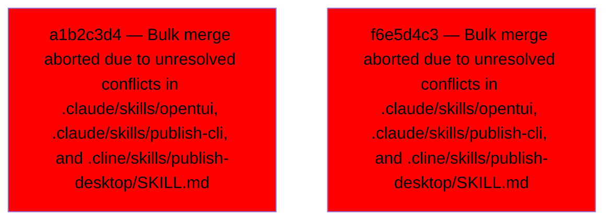

# Backport Agent — Detailed Run Report

> This file is generated automatically. It is intended for human analysts and
> AI reasoning models to assess agent performance, decision quality, and LLM behavior.

**Run timestamp**: 2026-08-09T14:17:38.178Z
**Models used**: fast=`mistral/mistral-code-agent-latest`  powerful=`openrouter/poolside/laguna-s-2.1:free`
**Prompt log**: `/Users/rlemeill/Development/tea-ching-cline/.backport-agent/run-1786284329383.prompts.jsonl`

---

## Summary (PR body)

## Backport Agent — Sync Report

**Date**: 2026-08-09T14:17:38.178Z
**Upstream ref**: `main`
**Cut date**: `2026-06-27T00:00:00.000Z` 
**Fork ref**: `keypool-live`
**Sync branch**: `sync/upstream-main-2026-08-09-140720`
**Sync mode**: bulk-merge _(one real `git merge` absorbing the full pending range — see below: every commit shares the same outcome)_

### Summary

- ✅ Applied: 0
- ⚠️ Needs human review: 0
- ⛔ Blocked (not attempted): 2

### Blocked commits (not attempted)

- `a1b2c3d4` [high] — Bulk merge aborted due to unresolved conflicts in .claude/skills/opentui, .claude/skills/publish-cli, and .cline/skills/publish-desktop/SKILL.md
- `f6e5d4c3` [high] — Bulk merge aborted due to unresolved conflicts in .claude/skills/opentui, .claude/skills/publish-cli, and .cline/skills/publish-desktop/SKILL.md

### Agent decision log

- Attempted bulk merge but encountered conflicts in symlinks and SKILL.md
- Aborted bulk merge due to unresolved conflicts and AI resolution failure


---

## Agent Workflow Diagram

> Generated by the fast model from the run summary. Evaluate the agent's decision path.



---

## AI Sub-Agent Call Log (7 calls)

> Each entry is one sub-agent invocation. Review prompt/response pairs to assess
> reasoning quality, hallucinations, and decision accuracy.

### Call 1 / 7 — `resolve_conflict_with_ai:consensus` ✅ OK

| Field | Value |
|---|---|
| **Timestamp** | 2026-08-09T14:08:28.207Z |
| **Tool** | `resolve_conflict_with_ai:consensus` |
| **Model** | `openrouter/poolside/laguna-s-2.1:free` |
| **Duration** | 15661 ms |
| **Tokens in** | 835 |
| **Tokens out** | 561 |
| **Cost** | $0.000000 |

**Prompt sent to sub-agent:**

```
Resolve the merge conflict in file: .claude/hooks/claude-code-for-web-setup.sh
Upstream commit message: undefined

--- BASE (common ancestor) ---
(file did not exist at merge base)

--- OURS (fork version) ---


--- THEIRS (upstream version) ---
#!/bin/bash
set -euo pipefail

# Only run in Claude Code remote environments
if [ "${CLAUDE_CODE_REMOTE:-}" != "true" ]; then
  exit 0
fi

cd "$CLAUDE_PROJECT_DIR"

echo "=== Claude Code for Web Setup ==="
echo ""

# Install latest gh CLI tool
echo "Installing GitHub CLI..."
GH_VERSION=$(curl -s https://api.github.com/repos/cli/cli/releases/latest | grep '"tag_name"' | cut -d'"' -f4 | sed 's/^v//')
curl -sL "https://github.com/cli/cli/releases/download/v${GH_VERSION}/gh_${GH_VERSION}_linux_amd64.tar.gz" -o /tmp/gh.tar.gz
tar -xzf /tmp/gh.tar.gz -C /tmp
sudo mv "/tmp/gh_${GH_VERSION}_linux_amd64/bin/gh" /usr/local/bin/gh
rm -rf /tmp/gh.tar.gz /tmp/gh_${GH_VERSION}_linux_amd64
echo "Installed gh version: $(gh --version | head -1)"
echo ""

# Check if GITHUB_TOKEN is set and configure gh
if [ -n "${GITHUB_TOKEN:-}" ]; then
  echo "GITHUB_TOKEN is configured - gh CLI is ready to use"
  echo ""
  echo "You can use gh commands directly, for example:"
  echo "  gh issue list --repo cline/cline --limit 5"
  echo "  gh pr list --repo cline/cline --state open"
  echo "  gh issue view 123 --repo cline/cline"
  echo ""
else
  echo "GITHUB_TOKEN is not set - gh CLI will have limited functionality"
  echo ""
  echo "To enable full GitHub API access:"
  echo "1. Create a Fine-grained Personal Access Token at https://github.com/settings/tokens?type=beta"
  echo "2. Add it as GITHUB_TOKEN in your Claude Code environment settings"
  echo ""
fi

# Install project dependencies
echo "Installing dependencies..."
bun run install:all

# Generate gRPC/protobuf types (required for TypeScript)
echo "Generating proto types..."
bun run protos

echo ""
echo "Session setup complete!"

Output the JSON object now.
```

**Response received:**

```
{
  "resolvedContent": "#!/bin/bash\nset -euo pipefail\n\n# Only run in Claude Code remote environments\nif [ \"${CLAUDE_CODE_REMOTE:-}\" != \"true\" ]; then\n  exit 0\nfi\n\ncd \"$CLAUDE_PROJECT_DIR\"\n\necho \"=== Claude Code for Web Setup ===\"\necho \"\"\n\n# Install latest gh CLI tool\necho \"Installing GitHub CLI...\"\nGH_VERSION=$(curl -s https://api.github.com/repos/cli/cli/releases/latest | grep '\"tag_name\"' | cut -d'\"' -f4 | sed 's/^v//')\ncurl -sL \"https://github.com/cli/cli/releases/download/v${GH_VERSION}/gh_${GH_VERSION}_linux_amd64.tar.gz\" -o /tmp/gh.tar.gz\ntar -xzf /tmp/gh.tar.gz -C /tmp\nsudo mv \"/tmp/gh_${GH_VERSION}_linux_amd64/bin/gh\" /usr/local/bin/gh\nrm -rf /tmp/gh.tar.gz /tmp/gh_${GH_VERSION}_linux_amd64\necho \"Installed gh version: $(gh --version | head -1)\"\necho \"\"\n\n# Check if GITHUB_TOKEN is set and configure gh\nif [ -n \"${GITHUB_TOKEN:-}\" ]; then\n  echo \"GITHUB_TOKEN is configured - gh CLI is ready to use\"\n  echo \"\"\n  echo \"You can use gh commands directly, for example:\"\n  echo \"  gh issue list --repo cline/cline --limit 5\"\n  echo \"  gh pr list --repo cline/cline --state open\"\n  echo \"  gh issue view 123 --repo cline/cline\"\n  echo \"\"\nelse\n  echo \"GITHUB_TOKEN is not set - gh CLI will have limited functionality\"\n  echo \"\"\n  echo \"To enable full GitHub API access:\"\n  echo \"1. Create a Fine-grained Personal Access Token at https://github.com/settings/tokens?type=beta\"\n  echo \"2. Add it as GITHUB_TOKEN in your Claude Code environment settings\"\n  echo \"\"\nfi\n\n# Install project dependencies\necho \"Installing dependencies...\"\nbun run install:all\n\n# Generate gRPC/protobuf types (required for TypeScript)\necho \"Generating proto types...\"\nbun run protos\n\necho \"\"\necho \"Session setup complete!\"\n",
  "confidence": "high",
  "reasoning": "The fork version was empty, so the entire upstream script is adopted without modification, preserving all intended functionality."
}
```

---

### Call 2 / 7 — `resolve_conflict_with_ai` ✅ OK

| Field | Value |
|---|---|
| **Timestamp** | 2026-08-09T14:08:28.207Z |
| **Tool** | `resolve_conflict_with_ai` |
| **Model** | `mistral/devstral-latest` |
| **Duration** | 7641 ms |
| **Tokens in** | 834 |
| **Tokens out** | 608 |
| **Cost** | $0.000000 |

**Prompt sent to sub-agent:**

```
Resolve the merge conflict in file: .claude/hooks/claude-code-for-web-setup.sh
Upstream commit message: undefined

--- BASE (common ancestor) ---
(file did not exist at merge base)

--- OURS (fork version) ---


--- THEIRS (upstream version) ---
#!/bin/bash
set -euo pipefail

# Only run in Claude Code remote environments
if [ "${CLAUDE_CODE_REMOTE:-}" != "true" ]; then
  exit 0
fi

cd "$CLAUDE_PROJECT_DIR"

echo "=== Claude Code for Web Setup ==="
echo ""

# Install latest gh CLI tool
echo "Installing GitHub CLI..."
GH_VERSION=$(curl -s https://api.github.com/repos/cli/cli/releases/latest | grep '"tag_name"' | cut -d'"' -f4 | sed 's/^v//')
curl -sL "https://github.com/cli/cli/releases/download/v${GH_VERSION}/gh_${GH_VERSION}_linux_amd64.tar.gz" -o /tmp/gh.tar.gz
tar -xzf /tmp/gh.tar.gz -C /tmp
sudo mv "/tmp/gh_${GH_VERSION}_linux_amd64/bin/gh" /usr/local/bin/gh
rm -rf /tmp/gh.tar.gz /tmp/gh_${GH_VERSION}_linux_amd64
echo "Installed gh version: $(gh --version | head -1)"
echo ""

# Check if GITHUB_TOKEN is set and configure gh
if [ -n "${GITHUB_TOKEN:-}" ]; then
  echo "GITHUB_TOKEN is configured - gh CLI is ready to use"
  echo ""
  echo "You can use gh commands directly, for example:"
  echo "  gh issue list --repo cline/cline --limit 5"
  echo "  gh pr list --repo cline/cline --state open"
  echo "  gh issue view 123 --repo cline/cline"
  echo ""
else
  echo "GITHUB_TOKEN is not set - gh CLI will have limited functionality"
  echo ""
  echo "To enable full GitHub API access:"
  echo "1. Create a Fine-grained Personal Access Token at https://github.com/settings/tokens?type=beta"
  echo "2. Add it as GITHUB_TOKEN in your Claude Code environment settings"
  echo ""
fi

# Install project dependencies
echo "Installing dependencies..."
bun run install:all

# Generate gRPC/protobuf types (required for TypeScript)
echo "Generating proto types..."
bun run protos

echo ""
echo "Session setup complete!"

Output the JSON object now.
```

**Response received:**

````
```json
{
  "resolvedContent": "#!/bin/bash\nset -euo pipefail\n\n# Only run in Claude Code remote environments\nif [ \"${CLAUDE_CODE_REMOTE:-}\" != \"true\" ]; then\n  exit 0\nfi\n\ncd \"$CLAUDE_PROJECT_DIR\"\n\necho \"=== Claude Code for Web Setup ===\"\necho \"\"\n\n# Install latest gh CLI tool\necho \"Installing GitHub CLI...\"\nGH_VERSION=$(curl -s https://api.github.com/repos/cli/cli/releases/latest | grep '\"tag_name\"' | cut -d'\"' -f4 | sed 's/^v//')\ncurl -sL \"https://github.com/cli/cli/releases/download/v${GH_VERSION}/gh_${GH_VERSION}_linux_amd64.tar.gz\" -o /tmp/gh.tar.gz\ntar -xzf /tmp/gh.tar.gz -C /tmp\nsudo mv \"/tmp/gh_${GH_VERSION}_linux_amd64/bin/gh\" /usr/local/bin/gh\nrm -rf /tmp/gh.tar.gz /tmp/gh_${GH_VERSION}_linux_amd64\necho \"Installed gh version: $(gh --version | head -1)\"\necho \"\"\n\n# Check if GITHUB_TOKEN is set and configure gh\nif [ -n \"${GITHUB_TOKEN:-}\" ]; then\n  echo \"GITHUB_TOKEN is configured - gh CLI is ready to use\"\n  echo \"\"\n  echo \"You can use gh commands directly, for example:\"\n  echo \"  gh issue list --repo cline/cline --limit 5\"\n  echo \"  gh pr list --repo cline/cline --state open\"\n  echo \"  gh issue view 123 --repo cline/cline\"\n  echo \"\"\nelse\n  echo \"GITHUB_TOKEN is not set - gh CLI will have limited functionality\"\n  echo \"\"\n  echo \"To enable full GitHub API access:\"\n  echo \"1. Create a Fine-grained Personal Access Token at https://github.com/settings/tokens?type=beta\"\n  echo \"2. Add it as GITHUB_TOKEN in your Claude Code environment settings\"\n  echo \"\"\nfi\n\n# Install project dependencies\necho \"Installing dependencies...\"\nbun run install:all\n\n# Generate gRPC/protobuf types (required for TypeScript)\necho \"Generating proto types...\"\nbun run protos\n\necho \"\"\necho \"Session setup complete!\"",
  "confidence": "high",
  "reasoning": "The fork version was empty, so the upstream version was accepted entirely as it introduces new functionality without any conflicts."
}
```
````

---

### Call 3 / 7 — `resolve_conflict_with_ai` ✅ OK

| Field | Value |
|---|---|
| **Timestamp** | 2026-08-09T14:09:23.873Z |
| **Tool** | `resolve_conflict_with_ai` |
| **Model** | `mistral/devstral-latest` |
| **Duration** | 3309 ms |
| **Tokens in** | 345 |
| **Tokens out** | 51 |
| **Cost** | $0.000000 |

**Prompt sent to sub-agent:**

```
Resolve the merge conflict in file: .claude/skills/opentui
Upstream commit message: undefined

--- BASE (common ancestor) ---
(file did not exist at merge base)

--- OURS (fork version) ---


--- THEIRS (upstream version) ---
../../.agents/skills/opentui

Output the JSON object now.
```

**Response received:**

````
```json
{
  "resolvedContent": "../../.agents/skills/opentui",
  "confidence": "high",
  "reasoning": "The fork version was empty, so the upstream content was preserved entirely."
}
```
````

---

### Call 4 / 7 — `resolve_conflict_with_ai:consensus` ✅ OK

| Field | Value |
|---|---|
| **Timestamp** | 2026-08-09T14:10:01.545Z |
| **Tool** | `resolve_conflict_with_ai:consensus` |
| **Model** | `openrouter/poolside/laguna-s-2.1:free` |
| **Duration** | 3172 ms |
| **Tokens in** | 354 |
| **Tokens out** | 54 |
| **Cost** | $0.000000 |

**Prompt sent to sub-agent:**

```
Resolve the merge conflict in file: .claude/skills/publish-cli
Upstream commit message: undefined

--- BASE (common ancestor) ---
(file did not exist at merge base)

--- OURS (fork version) ---


--- THEIRS (upstream version) ---
../../.cline/skills/publish-cli

Output the JSON object now.
```

**Response received:**

```
{
  "resolvedContent": "../../.cline/skills/publish-cli\n",
  "confidence": "high",
  "reasoning": "The fork version was empty, so adopting the upstream content directly resolves the conflict with no lost customizations."
}
```

---

### Call 5 / 7 — `resolve_conflict_with_ai` ✅ OK

| Field | Value |
|---|---|
| **Timestamp** | 2026-08-09T14:10:01.546Z |
| **Tool** | `resolve_conflict_with_ai` |
| **Model** | `mistral/devstral-latest` |
| **Duration** | 1535 ms |
| **Tokens in** | 343 |
| **Tokens out** | 54 |
| **Cost** | $0.000000 |

**Prompt sent to sub-agent:**

```
Resolve the merge conflict in file: .claude/skills/publish-cli
Upstream commit message: undefined

--- BASE (common ancestor) ---
(file did not exist at merge base)

--- OURS (fork version) ---


--- THEIRS (upstream version) ---
../../.cline/skills/publish-cli

Output the JSON object now.
```

**Response received:**

````
```json
{
  "resolvedContent": "../../.cline/skills/publish-cli",
  "confidence": "medium",
  "reasoning": "The fork version was empty, so the upstream content was preserved as the only meaningful change."
}
```
````

---

### Call 6 / 7 — `resolve_conflict_with_ai` ❌ Error

| Field | Value |
|---|---|
| **Timestamp** | 2026-08-09T14:13:31.387Z |
| **Tool** | `resolve_conflict_with_ai` |
| **Model** | `mistral/devstral-latest` |
| **Duration** | 0 ms |
| **Error** | Unterminated string in JSON at position 2194 (line 2 column 2193) |

**Prompt sent to sub-agent:**

````
Resolve the merge conflict in file: .cline/skills/publish-desktop/SKILL.md
Upstream commit message: undefined

--- BASE (common ancestor) ---
(file did not exist at merge base)

--- OURS (fork version) ---
---
name: publish-desktop
description: Use when preparing, tagging, and publishing a Cline Code desktop app (apps/examples/desktop-app) release. Guides changelog drafting, version bumps in package.json + tauri.conf.json, desktop-vX.Y.Z tags, and the desktop-publish GitHub workflow that builds, signs, notarizes, and updates the auto-update feed.
---

# Desktop App Release

Use this skill when the user asks to release the desktop app, publish Cline Code, bump the desktop version, create a `desktop-vX.Y.Z` tag, or trigger the desktop publish workflow.

> Working directory: run every command below from the repository root.

Desktop releases are macOS-only today (signed + notarized DMG for Apple Silicon and Intel) and are built entirely in GitHub Actions — there is no local publish path. Installed apps discover new releases automatically through the Tauri updater, so publishing a release is what ships the update to every existing user.

## Release contract

- Version sources (must match each other and the tag): `apps/examples/desktop-app/package.json` and `apps/examples/desktop-app/src-tauri/tauri.conf.json`. (`src-tauri/Cargo.toml` has its own version but `tauri.conf.json` overrides it; no need to touch it.)
- Release tag: `desktop-vX.Y.Z`, where `X.Y.Z` matches both version files.
- Release prep includes approved release notes, the version bumps, and an `apps/examples/desktop-app/CHANGELOG.md` update.
- Publish path: `.github/workflows/desktop-publish.yml` (workflow_dispatch, requires the tag to exist, point at the checked-out commit, and be reachable from `origin/main`).
- The workflow creates the `desktop-vX.Y.Z` GitHub release (DMGs + updater artifacts + `latest.json`) and refreshes the rolling `desktop-latest` release, which is the static auto-update feed every installed app polls. Never delete the `desktop-latest` release or tag.
- The changelog's top `## X.Y.Z` section is extracted verbatim into the GitHub release body, the Slack announcement, and the updater manifest notes.
- Always ask before pushing commits or tags.

## Workflow

1. Gather context.

```sh
git status --short --branch
git fetch origin --tags
git tag --list 'desktop-v*' --sort=-v:refname | head -10
node -p "require('./apps/examples/desktop-app/package.json').version"
node -p "require('./apps/examples/desktop-app/src-tauri/tauri.conf.json').version"
```

If there is no `desktop-v*` tag yet, this is the first release; use the desktop app's first commit as the baseline and say the baseline is inferred.

2. Collect release commits.

```sh
git log <last-desktop-tag>..HEAD --oneline --no-merges -- apps/examples/desktop-app sdk/packages .github/workflows/desktop-publish.yml
```

The sidecar bundles `@cline/core` and friends from the monorepo, so SDK changes ship inside the desktop app too. Fold user-visible SDK changes (providers, models, behavior fixes) into the notes; skip purely internal ones.

3. Draft user-facing release notes.

Flat bullet list, user-facing language. Present the draft and wait for approval before editing files.

4. Decide the version bump.

Ask whether this is patch, minor, major, or an explicit version. Do not guess if the user has not made it clear.

5. Update release files.

- `apps/examples/desktop-app/package.json` → new version
- `apps/examples/desktop-app/src-tauri/tauri.conf.json` → same version
- Prepend `## X.Y.Z` (no date) to `apps/examples/desktop-app/CHANGELOG.md` with the approved notes.

6. Verify before committing.

```sh
bun -F @cline/code typecheck
bun test apps/examples/desktop-app/scripts/generate-update-manifest.test.ts
```

The full desktop bundle can only be built on macOS; the workflow's build job is the real verification. For extra local confidence on a Mac checkout, `bun run package:desktop:mac --allow-unsigned-mac` from the app directory.

7. Commit release changes.

```sh
git add apps/examples/desktop-app/package.json apps/examples/desktop-app/src-tauri/tauri.conf.json apps/examples/desktop-app/CHANGELOG.md
git commit -m "chore(desktop): release vX.Y.Z"
```

Ask before pushing the release commit, then before creating and pushing the tag:

```sh
git push origin HEAD
git tag -a desktop-vX.Y.Z -m "Desktop vX.Y.Z"
git push origin refs/tags/desktop-vX.Y.Z
```

8. Publish.

The release commit must be on `main` and the tag pushed first.

```sh
gh workflow run desktop-publish.yml -f git_tag=desktop-vX.Y.Z -f confirm_publish=publish
gh run list --workflow=desktop-publish.yml --limit=1 --json url,status,conclusion,createdAt --jq '.[0]'
```

The workflow builds both architectures in parallel (aarch64 native, x86_64 cross-compiled), signs with the Developer ID certificate, notarizes with the App Store Connect API key, signs updater artifacts with the Tauri updater key, creates the GitHub release, refreshes `desktop-latest/latest.json`, and posts to Slack. Notarization typically adds 2–10 minutes.

If the workflow fails on missing credentials, see "Repo secrets (one-time setup)" below.

9. Verify the update feed after the run succeeds.

```sh
curl -sL https://github.com/cline/cline/releases/download/desktop-latest/latest.json | head -30
```

The `version` field must be the new release and both `darwin-aarch64` and `darwin-x86_64` URLs must point at the new `desktop-vX.Y.Z` assets. Installed apps pick the update up on next launch or within 2 hours.

10. Final response.

Report: version, tag, changelog updated, commit hash, what was pushed, workflow URL, and the feed verification result.

## Repo secrets (one-time setup)

The workflow needs these repository secrets. The Apple ones come from the same
Apple Developer account used for manual signing (see the app README's "macOS
signing & notarization" section for how to obtain them):

| Secret | Value |
| --- | --- |
| `APPLE_CERTIFICATE` | Base64 of the **Developer ID Application** identity exported from Keychain Access as `.p12` (must include the private key): `base64 -i certificate.p12 \| pbcopy` |
| `APPLE_CERTIFICATE_PASSWORD` | The password chosen when exporting the `.p12` |
| `APPLE_SIGNING_IDENTITY` | `Developer ID Application: <Team Name> (<TEAMID>)` — from `security find-identity -v -p codesigning` |
| `APPLE_API_KEY` | App Store Connect API **Key ID** (notarization) |
| `APPLE_API_KEY_CONTENT` | Contents of the `AuthKey_<KEYID>.p8` file |
| `APPLE_API_ISSUER` | App Store Connect **Issuer ID** (UUID from Users and Access → Integrations) |
| `TAURI_SIGNING_PRIVATE_KEY` | Contents of the Tauri updater private key (`tauri signer generate`). If this key is ever lost, shipped apps can no longer verify updates — guard it. |
| `TAURI_SIGNING_PRIVATE_KEY_PASSWORD` | Password for that key |

The Slack + telemetry secrets (`SLACK_RELEASE_BOT_TOKEN`, `TELEMETRY_SERVICE_API_KEY`,
OTEL settings) are shared with the CLI publish workflow and already configured.

--- THEIRS (upstream version) ---
---
name: publish-desktop
description: Use when preparing, tagging, and publishing a Cline Code desktop app (apps/examples/desktop-app) release. Guides changelog drafting, version bumps in package.json + tauri.conf.json, desktop-vX.Y.Z tags, and the desktop-publish GitHub workflow that builds, signs, notarizes, and updates the auto-update feed.
---

# Desktop App Release

Use this skill when the user asks to release the desktop app, publish Cline Code, bump the desktop version, create a `desktop-vX.Y.Z` tag, or trigger the desktop publish workflow.

> Working directory: run every command below from the repository root.

Desktop releases are macOS-only today (a single signed + notarized universal DMG that runs natively on both Apple Silicon and Intel) and are built entirely in GitHub Actions — there is no local publish path. Installed apps discover new releases automatically through the Tauri updater, so publishing a release is what ships the update to every existing user.

## Release contract

- Version sources (must match each other and the tag): `apps/examples/desktop-app/package.json` and `apps/examples/desktop-app/src-tauri/tauri.conf.json`. (`src-tauri/Cargo.toml` has its own version but `tauri.conf.json` overrides it; no need to touch it.)
- Release tag: `desktop-vX.Y.Z`, where `X.Y.Z` matches both version files.
- Release prep includes approved release notes, the version bumps, and an `apps/examples/desktop-app/CHANGELOG.md` update.
- Publish path: `.github/workflows/desktop-publish.yml` (workflow_dispatch, requires the tag to exist, point at the checked-out commit, and be reachable from `origin/main`).
- The workflow creates the `desktop-vX.Y.Z` GitHub release (universal DMG + updater artifact + `latest.json`) and refreshes the rolling `desktop-latest` release, which is the static auto-update feed every installed app polls. Never delete the `desktop-latest` release or tag.
- The changelog's top `## X.Y.Z` section is extracted verbatim into the GitHub release body, the Slack announcement, and the updater manifest notes.
- Always ask before pushing commits or tags.

## Workflow

1. Gather context.

```sh
git status --short --branch
git fetch origin --tags
git tag --list 'desktop-v*' --sort=-v:refname | head -10
node -p "require('./apps/examples/desktop-app/package.json').version"
node -p "require('./apps/examples/desktop-app/src-tauri/tauri.conf.json').version"
```

If there is no `desktop-v*` tag yet, this is the first release; use the desktop app's first commit as the baseline and say the baseline is inferred.

2. Collect release commits.

```sh
git log <last-desktop-tag>..HEAD --oneline --no-merges -- apps/examples/desktop-app sdk/packages .github/workflows/desktop-publish.yml
```

The sidecar bundles `@cline/core` and friends from the monorepo, so SDK changes ship inside the desktop app too. Fold user-visible SDK changes (providers, models, behavior fixes) into the notes; skip purely internal ones.

3. Draft user-facing release notes.

Flat bullet list, user-facing language. Present the draft and wait for approval before editing files.

4. Decide the version bump.

Ask whether this is patch, minor, major, or an explicit version. Do not guess if the user has not made it clear.

5. Update release files.

- `apps/examples/desktop-app/package.json` → new version
- `apps/examples/desktop-app/src-tauri/tauri.conf.json` → same version
- Prepend `## X.Y.Z` (no date) to `apps/examples/desktop-app/CHANGELOG.md` with the approved notes.

6. Verify before committing.

```sh
bun -F @cline/code typecheck
bun test apps/examples/desktop-app/scripts/generate-update-manifest.test.ts
```

The full desktop bundle can only be built on macOS; the workflow's build job is the real verification. For extra local confidence on a Mac checkout, `bun run package:desktop:mac --allow-unsigned-mac` from the app directory.

7. Commit release changes.

```sh
git add apps/examples/desktop-app/package.json apps/examples/desktop-app/src-tauri/tauri.conf.json apps/examples/desktop-app/CHANGELOG.md
git commit -m "chore(desktop): release vX.Y.Z"
```

Ask before pushing the release commit, then before creating and pushing the tag:

```sh
git push origin HEAD
git tag -a desktop-vX.Y.Z -m "Desktop vX.Y.Z"
git push origin refs/tags/desktop-vX.Y.Z
```

8. Publish.

The release commit must be on `main` and the tag pushed first.

```sh
gh workflow run desktop-publish.yml -f git_tag=desktop-vX.Y.Z -f confirm_publish=publish
gh run list --workflow=desktop-publish.yml --limit=1 --json url,status,conclusion,createdAt --jq '.[0]'
```

**The run pauses for approval.** `validate` runs immediately, then the `build`
job waits on the `PublishDesktop` environment until a required reviewer approves
it — the run sits in `waiting`, which is expected, not a hang. Approve it in the
run's web UI ("Review deployments"), or:

```sh
gh api repos/cline/cline/actions/runs/<run-id>/pending_deployments \
  --method POST -f state=approved -f comment="desktop vX.Y.Z" \
  -F 'environment_ids[]=19152605990'   # PublishDesktop
```

Nothing after `validate` runs — and no signing key is readable — until then.

The workflow builds one universal macOS bundle (`tauri build --target universal-apple-darwin` lipos the aarch64 + x86_64 Rust binaries; the Bun sidecar is lipo'd by `build-sidecar-bin.ts`), verifies every Mach-O in the bundle carries both slices, signs with the Developer ID certificate, notarizes with the App Store Connect API key, signs the updater artifact with the Tauri updater key, creates the GitHub release, refreshes `desktop-latest/latest.json`, and posts to Slack. Notarization typically adds 2–10 minutes.

If the workflow fails on missing credentials, see "Publish secrets (one-time setup)" below.

9. Verify the update feed after the run succeeds.

```sh
curl -sL https://github.com/cline/cline/releases/download/desktop-latest/latest.json | head -30
```

The `version` field must be the new release and both `darwin-aarch64` and `darwin-x86_64` entries must point at the same new `desktop-vX.Y.Z` universal `.app.tar.gz` asset (each slice of the fat binary requests its own arch key at runtime, so both keys serve the one artifact). Installed apps — including older per-arch installs — pick the update up on next launch or within 2 hours.

10. Final response.

Report: version, tag, changelog updated, commit hash, what was pushed, workflow URL, and the feed verification result.

## Publish secrets (one-time setup)

These live on the **`PublishDesktop` environment**, not at repository level, so
only the `build` job can read them and only after an approval. Set them under
Settings → Environments → PublishDesktop → Environment secrets. The environment
also restricts deployments to `main` and requires a reviewer.

Adding one of these as a *repository* secret is the common mistake. The build
would still succeed — an environment-gated job resolves repository secrets too,
with environment values simply taking precedence — so the credential would sit
repo-wide while everything looked fine. `validate` therefore fails the run if any
of them resolves in a job with no environment. If you hit that, delete the
repository-level copy rather than duplicating it.

If a secret is missing everywhere, the preflight in `build` fails the run naming
the missing entries. The Apple values come from the same Apple Developer account
used for manual signing (see the app README's "macOS signing & notarization"
section for how to obtain them):

| Secret | Value |
| --- | --- |
| `APPLE_CERTIFICATE` | Base64 of the **Developer ID Application** identity exported from Keychain Access as `.p12` (must include the private key): `base64 -i certificate.p12 \| pbcopy` |
| `APPLE_CERTIFICATE_PASSWORD` | The password chosen when exporting the `.p12` |
| `APPLE_SIGNING_IDENTITY` | `Developer ID Application: <Team Name> (<TEAMID>)` — from `security find-identity -v -p codesigning` |
| `APPLE_API_KEY` | App Store Connect API **Key ID** (notarization) |
| `APPLE_API_KEY_CONTENT` | Contents of the `AuthKey_<KEYID>.p8` file |
| `APPLE_API_ISSUER` | App Store Connect **Issuer ID** (UUID from Users and Access → Integrations) |
| `TAURI_SIGNING_PRIVATE_KEY` | Contents of the Tauri updater private key (`tauri signer generate`). If this key is ever lost, shipped apps can no longer verify updates — guard it. |
| `TAURI_SIGNING_PRIVATE_KEY_PASSWORD` | Password for that key |

The Slack + telemetry secrets (`SLACK_RELEASE_BOT_TOKEN`, `TELEMETRY_SERVICE_API_KEY`,
`ERROR_SERVICE_API_KEY`, OTEL settings) are shared with the CLI, SDK, and extension
publish workflows and already configured. **Do not move these into
`PublishDesktop`** — scoping them to this environment empties them in every other
publish workflow, silently, with no error beyond missing telemetry and a failed
Slack post.

Output the JSON object now.
````

**Response received:**

```
(empty)
```

---

### Call 7 / 7 — `resolve_conflict_with_ai` ❌ Error

| Field | Value |
|---|---|
| **Timestamp** | 2026-08-09T14:17:19.065Z |
| **Tool** | `resolve_conflict_with_ai` |
| **Model** | `openrouter/poolside/laguna-s-2.1:free` |
| **Duration** | 0 ms |
| **Error** | Unexpected token 's', "sh\ngit st"... is not valid JSON |

**Prompt sent to sub-agent:**

````
Resolve the merge conflict in file: .cline/skills/publish-desktop/SKILL.md
Upstream commit message: undefined

--- BASE (common ancestor) ---
(file did not exist at merge base)

--- OURS (fork version) ---
---
name: publish-desktop
description: Use when preparing, tagging, and publishing a Cline Code desktop app (apps/examples/desktop-app) release. Guides changelog drafting, version bumps in package.json + tauri.conf.json, desktop-vX.Y.Z tags, and the desktop-publish GitHub workflow that builds, signs, notarizes, and updates the auto-update feed.
---

# Desktop App Release

Use this skill when the user asks to release the desktop app, publish Cline Code, bump the desktop version, create a `desktop-vX.Y.Z` tag, or trigger the desktop publish workflow.

> Working directory: run every command below from the repository root.

Desktop releases are macOS-only today (signed + notarized DMG for Apple Silicon and Intel) and are built entirely in GitHub Actions — there is no local publish path. Installed apps discover new releases automatically through the Tauri updater, so publishing a release is what ships the update to every existing user.

## Release contract

- Version sources (must match each other and the tag): `apps/examples/desktop-app/package.json` and `apps/examples/desktop-app/src-tauri/tauri.conf.json`. (`src-tauri/Cargo.toml` has its own version but `tauri.conf.json` overrides it; no need to touch it.)
- Release tag: `desktop-vX.Y.Z`, where `X.Y.Z` matches both version files.
- Release prep includes approved release notes, the version bumps, and an `apps/examples/desktop-app/CHANGELOG.md` update.
- Publish path: `.github/workflows/desktop-publish.yml` (workflow_dispatch, requires the tag to exist, point at the checked-out commit, and be reachable from `origin/main`).
- The workflow creates the `desktop-vX.Y.Z` GitHub release (DMGs + updater artifacts + `latest.json`) and refreshes the rolling `desktop-latest` release, which is the static auto-update feed every installed app polls. Never delete the `desktop-latest` release or tag.
- The changelog's top `## X.Y.Z` section is extracted verbatim into the GitHub release body, the Slack announcement, and the updater manifest notes.
- Always ask before pushing commits or tags.

## Workflow

1. Gather context.

```sh
git status --short --branch
git fetch origin --tags
git tag --list 'desktop-v*' --sort=-v:refname | head -10
node -p "require('./apps/examples/desktop-app/package.json').version"
node -p "require('./apps/examples/desktop-app/src-tauri/tauri.conf.json').version"
```

If there is no `desktop-v*` tag yet, this is the first release; use the desktop app's first commit as the baseline and say the baseline is inferred.

2. Collect release commits.

```sh
git log <last-desktop-tag>..HEAD --oneline --no-merges -- apps/examples/desktop-app sdk/packages .github/workflows/desktop-publish.yml
```

The sidecar bundles `@cline/core` and friends from the monorepo, so SDK changes ship inside the desktop app too. Fold user-visible SDK changes (providers, models, behavior fixes) into the notes; skip purely internal ones.

3. Draft user-facing release notes.

Flat bullet list, user-facing language. Present the draft and wait for approval before editing files.

4. Decide the version bump.

Ask whether this is patch, minor, major, or an explicit version. Do not guess if the user has not made it clear.

5. Update release files.

- `apps/examples/desktop-app/package.json` → new version
- `apps/examples/desktop-app/src-tauri/tauri.conf.json` → same version
- Prepend `## X.Y.Z` (no date) to `apps/examples/desktop-app/CHANGELOG.md` with the approved notes.

6. Verify before committing.

```sh
bun -F @cline/code typecheck
bun test apps/examples/desktop-app/scripts/generate-update-manifest.test.ts
```

The full desktop bundle can only be built on macOS; the workflow's build job is the real verification. For extra local confidence on a Mac checkout, `bun run package:desktop:mac --allow-unsigned-mac` from the app directory.

7. Commit release changes.

```sh
git add apps/examples/desktop-app/package.json apps/examples/desktop-app/src-tauri/tauri.conf.json apps/examples/desktop-app/CHANGELOG.md
git commit -m "chore(desktop): release vX.Y.Z"
```

Ask before pushing the release commit, then before creating and pushing the tag:

```sh
git push origin HEAD
git tag -a desktop-vX.Y.Z -m "Desktop vX.Y.Z"
git push origin refs/tags/desktop-vX.Y.Z
```

8. Publish.

The release commit must be on `main` and the tag pushed first.

```sh
gh workflow run desktop-publish.yml -f git_tag=desktop-vX.Y.Z -f confirm_publish=publish
gh run list --workflow=desktop-publish.yml --limit=1 --json url,status,conclusion,createdAt --jq '.[0]'
```

The workflow builds both architectures in parallel (aarch64 native, x86_64 cross-compiled), signs with the Developer ID certificate, notarizes with the App Store Connect API key, signs updater artifacts with the Tauri updater key, creates the GitHub release, refreshes `desktop-latest/latest.json`, and posts to Slack. Notarization typically adds 2–10 minutes.

If the workflow fails on missing credentials, see "Repo secrets (one-time setup)" below.

9. Verify the update feed after the run succeeds.

```sh
curl -sL https://github.com/cline/cline/releases/download/desktop-latest/latest.json | head -30
```

The `version` field must be the new release and both `darwin-aarch64` and `darwin-x86_64` URLs must point at the new `desktop-vX.Y.Z` assets. Installed apps pick the update up on next launch or within 2 hours.

10. Final response.

Report: version, tag, changelog updated, commit hash, what was pushed, workflow URL, and the feed verification result.

## Repo secrets (one-time setup)

The workflow needs these repository secrets. The Apple ones come from the same
Apple Developer account used for manual signing (see the app README's "macOS
signing & notarization" section for how to obtain them):

| Secret | Value |
| --- | --- |
| `APPLE_CERTIFICATE` | Base64 of the **Developer ID Application** identity exported from Keychain Access as `.p12` (must include the private key): `base64 -i certificate.p12 \| pbcopy` |
| `APPLE_CERTIFICATE_PASSWORD` | The password chosen when exporting the `.p12` |
| `APPLE_SIGNING_IDENTITY` | `Developer ID Application: <Team Name> (<TEAMID>)` — from `security find-identity -v -p codesigning` |
| `APPLE_API_KEY` | App Store Connect API **Key ID** (notarization) |
| `APPLE_API_KEY_CONTENT` | Contents of the `AuthKey_<KEYID>.p8` file |
| `APPLE_API_ISSUER` | App Store Connect **Issuer ID** (UUID from Users and Access → Integrations) |
| `TAURI_SIGNING_PRIVATE_KEY` | Contents of the Tauri updater private key (`tauri signer generate`). If this key is ever lost, shipped apps can no longer verify updates — guard it. |
| `TAURI_SIGNING_PRIVATE_KEY_PASSWORD` | Password for that key |

The Slack + telemetry secrets (`SLACK_RELEASE_BOT_TOKEN`, `TELEMETRY_SERVICE_API_KEY`,
OTEL settings) are shared with the CLI publish workflow and already configured.

--- THEIRS (upstream version) ---
---
name: publish-desktop
description: Use when preparing, tagging, and publishing a Cline Code desktop app (apps/examples/desktop-app) release. Guides changelog drafting, version bumps in package.json + tauri.conf.json, desktop-vX.Y.Z tags, and the desktop-publish GitHub workflow that builds, signs, notarizes, and updates the auto-update feed.
---

# Desktop App Release

Use this skill when the user asks to release the desktop app, publish Cline Code, bump the desktop version, create a `desktop-vX.Y.Z` tag, or trigger the desktop publish workflow.

> Working directory: run every command below from the repository root.

Desktop releases are macOS-only today (a single signed + notarized universal DMG that runs natively on both Apple Silicon and Intel) and are built entirely in GitHub Actions — there is no local publish path. Installed apps discover new releases automatically through the Tauri updater, so publishing a release is what ships the update to every existing user.

## Release contract

- Version sources (must match each other and the tag): `apps/examples/desktop-app/package.json` and `apps/examples/desktop-app/src-tauri/tauri.conf.json`. (`src-tauri/Cargo.toml` has its own version but `tauri.conf.json` overrides it; no need to touch it.)
- Release tag: `desktop-vX.Y.Z`, where `X.Y.Z` matches both version files.
- Release prep includes approved release notes, the version bumps, and an `apps/examples/desktop-app/CHANGELOG.md` update.
- Publish path: `.github/workflows/desktop-publish.yml` (workflow_dispatch, requires the tag to exist, point at the checked-out commit, and be reachable from `origin/main`).
- The workflow creates the `desktop-vX.Y.Z` GitHub release (universal DMG + updater artifact + `latest.json`) and refreshes the rolling `desktop-latest` release, which is the static auto-update feed every installed app polls. Never delete the `desktop-latest` release or tag.
- The changelog's top `## X.Y.Z` section is extracted verbatim into the GitHub release body, the Slack announcement, and the updater manifest notes.
- Always ask before pushing commits or tags.

## Workflow

1. Gather context.

```sh
git status --short --branch
git fetch origin --tags
git tag --list 'desktop-v*' --sort=-v:refname | head -10
node -p "require('./apps/examples/desktop-app/package.json').version"
node -p "require('./apps/examples/desktop-app/src-tauri/tauri.conf.json').version"
```

If there is no `desktop-v*` tag yet, this is the first release; use the desktop app's first commit as the baseline and say the baseline is inferred.

2. Collect release commits.

```sh
git log <last-desktop-tag>..HEAD --oneline --no-merges -- apps/examples/desktop-app sdk/packages .github/workflows/desktop-publish.yml
```

The sidecar bundles `@cline/core` and friends from the monorepo, so SDK changes ship inside the desktop app too. Fold user-visible SDK changes (providers, models, behavior fixes) into the notes; skip purely internal ones.

3. Draft user-facing release notes.

Flat bullet list, user-facing language. Present the draft and wait for approval before editing files.

4. Decide the version bump.

Ask whether this is patch, minor, major, or an explicit version. Do not guess if the user has not made it clear.

5. Update release files.

- `apps/examples/desktop-app/package.json` → new version
- `apps/examples/desktop-app/src-tauri/tauri.conf.json` → same version
- Prepend `## X.Y.Z` (no date) to `apps/examples/desktop-app/CHANGELOG.md` with the approved notes.

6. Verify before committing.

```sh
bun -F @cline/code typecheck
bun test apps/examples/desktop-app/scripts/generate-update-manifest.test.ts
```

The full desktop bundle can only be built on macOS; the workflow's build job is the real verification. For extra local confidence on a Mac checkout, `bun run package:desktop:mac --allow-unsigned-mac` from the app directory.

7. Commit release changes.

```sh
git add apps/examples/desktop-app/package.json apps/examples/desktop-app/src-tauri/tauri.conf.json apps/examples/desktop-app/CHANGELOG.md
git commit -m "chore(desktop): release vX.Y.Z"
```

Ask before pushing the release commit, then before creating and pushing the tag:

```sh
git push origin HEAD
git tag -a desktop-vX.Y.Z -m "Desktop vX.Y.Z"
git push origin refs/tags/desktop-vX.Y.Z
```

8. Publish.

The release commit must be on `main` and the tag pushed first.

```sh
gh workflow run desktop-publish.yml -f git_tag=desktop-vX.Y.Z -f confirm_publish=publish
gh run list --workflow=desktop-publish.yml --limit=1 --json url,status,conclusion,createdAt --jq '.[0]'
```

**The run pauses for approval.** `validate` runs immediately, then the `build`
job waits on the `PublishDesktop` environment until a required reviewer approves
it — the run sits in `waiting`, which is expected, not a hang. Approve it in the
run's web UI ("Review deployments"), or:

```sh
gh api repos/cline/cline/actions/runs/<run-id>/pending_deployments \
  --method POST -f state=approved -f comment="desktop vX.Y.Z" \
  -F 'environment_ids[]=19152605990'   # PublishDesktop
```

Nothing after `validate` runs — and no signing key is readable — until then.

The workflow builds one universal macOS bundle (`tauri build --target universal-apple-darwin` lipos the aarch64 + x86_64 Rust binaries; the Bun sidecar is lipo'd by `build-sidecar-bin.ts`), verifies every Mach-O in the bundle carries both slices, signs with the Developer ID certificate, notarizes with the App Store Connect API key, signs the updater artifact with the Tauri updater key, creates the GitHub release, refreshes `desktop-latest/latest.json`, and posts to Slack. Notarization typically adds 2–10 minutes.

If the workflow fails on missing credentials, see "Publish secrets (one-time setup)" below.

9. Verify the update feed after the run succeeds.

```sh
curl -sL https://github.com/cline/cline/releases/download/desktop-latest/latest.json | head -30
```

The `version` field must be the new release and both `darwin-aarch64` and `darwin-x86_64` entries must point at the same new `desktop-vX.Y.Z` universal `.app.tar.gz` asset (each slice of the fat binary requests its own arch key at runtime, so both keys serve the one artifact). Installed apps — including older per-arch installs — pick the update up on next launch or within 2 hours.

10. Final response.

Report: version, tag, changelog updated, commit hash, what was pushed, workflow URL, and the feed verification result.

## Publish secrets (one-time setup)

These live on the **`PublishDesktop` environment**, not at repository level, so
only the `build` job can read them and only after an approval. Set them under
Settings → Environments → PublishDesktop → Environment secrets. The environment
also restricts deployments to `main` and requires a reviewer.

Adding one of these as a *repository* secret is the common mistake. The build
would still succeed — an environment-gated job resolves repository secrets too,
with environment values simply taking precedence — so the credential would sit
repo-wide while everything looked fine. `validate` therefore fails the run if any
of them resolves in a job with no environment. If you hit that, delete the
repository-level copy rather than duplicating it.

If a secret is missing everywhere, the preflight in `build` fails the run naming
the missing entries. The Apple values come from the same Apple Developer account
used for manual signing (see the app README's "macOS signing & notarization"
section for how to obtain them):

| Secret | Value |
| --- | --- |
| `APPLE_CERTIFICATE` | Base64 of the **Developer ID Application** identity exported from Keychain Access as `.p12` (must include the private key): `base64 -i certificate.p12 \| pbcopy` |
| `APPLE_CERTIFICATE_PASSWORD` | The password chosen when exporting the `.p12` |
| `APPLE_SIGNING_IDENTITY` | `Developer ID Application: <Team Name> (<TEAMID>)` — from `security find-identity -v -p codesigning` |
| `APPLE_API_KEY` | App Store Connect API **Key ID** (notarization) |
| `APPLE_API_KEY_CONTENT` | Contents of the `AuthKey_<KEYID>.p8` file |
| `APPLE_API_ISSUER` | App Store Connect **Issuer ID** (UUID from Users and Access → Integrations) |
| `TAURI_SIGNING_PRIVATE_KEY` | Contents of the Tauri updater private key (`tauri signer generate`). If this key is ever lost, shipped apps can no longer verify updates — guard it. |
| `TAURI_SIGNING_PRIVATE_KEY_PASSWORD` | Password for that key |

The Slack + telemetry secrets (`SLACK_RELEASE_BOT_TOKEN`, `TELEMETRY_SERVICE_API_KEY`,
`ERROR_SERVICE_API_KEY`, OTEL settings) are shared with the CLI, SDK, and extension
publish workflows and already configured. **Do not move these into
`PublishDesktop`** — scoping them to this environment empties them in every other
publish workflow, silently, with no error beyond missing telemetry and a failed
Slack post.

Output the JSON object now.
````

**Response received:**

```
(empty)
```

---

## Performance Summary

**Total AI time**: 31318 ms across 7 call(s)
**Total input tokens**: 2711
**Total output tokens**: 1328

| Tool | Calls | Total ms | Avg ms | Input tok | Output tok |
|---|---|---|---|---|---|
| `resolve_conflict_with_ai:consensus` | 2 | 18833 | 9417 | 1189 | 615 |
| `resolve_conflict_with_ai` | 5 | 12485 | 2497 | 1522 | 713 |

## Decision Quality Metrics

> Automated quality signals derived from tool output guards, schema validation,
> hallucination detection, and consensus checks.  Review flagged items manually.

### Conflict Resolution Quality

| Metric | Value |
|---|---|
| Total conflict resolutions | 5 |
| Confidence: high / medium / low | 2 / 1 / 0 |
| Conflict markers detected (guard triggered) | 0 |
| Syntax balance failures | 0 |
| Consensus divergences (if enabled) | 0 |
| Total guard activations | 0 |

### Audit Event Timeline

| Timestamp | Tool | Event | Details |
|---|---|---|---|
| 14:05:29 | `loadCustomizations` | `manifest_loaded` | sourceKind="file", path=".backport-agent/customizations.yaml", sha256_16="6b63cdd33abb331e" |
| 14:08:28 | `resolve_conflict_with_ai` | `consensus_passed` | filePath=".claude/hooks/claude-code-for-web-setup, similarity=1 |
| 14:08:28 | `resolve_conflict_with_ai` | `resolution_complete` | filePath=".claude/hooks/claude-code-for-web-setup, modelId="mistral/devstral-latest", label="specialist" |
| 14:09:23 | `resolve_conflict_with_ai` | `resolution_complete` | filePath=".claude/skills/opentui", modelId="mistral/devstral-latest", label="specialist" |
| 14:10:01 | `resolve_conflict_with_ai` | `consensus_passed` | filePath=".claude/skills/publish-cli", similarity=1 |
| 14:10:01 | `resolve_conflict_with_ai` | `resolution_complete` | filePath=".claude/skills/publish-cli", modelId="mistral/devstral-latest", label="specialist" |
| 14:17:19 | `resolve_conflict_with_ai` | `resolution_failed` | filePath=".cline/skills/publish-desktop/SKILL.md", error="Unexpected token 's', \"sh\\ngit st\".. |
