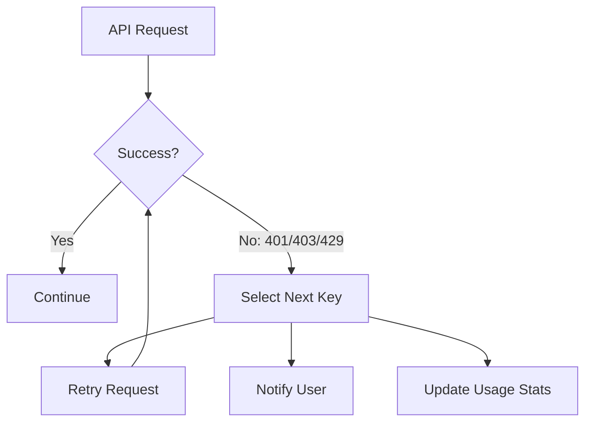

<p align="center">
  
  <br>
  <a href="https://github.com/sctg-development/ai-proxy-cloudflare"></a>
  <a href="https://github.com/sctg-development/ai-proxy-cloudflare"></a>
  <a href="https://github.com/sctg-development/ai-proxy-cloudflare"></a>
  <a href="https://github.com/sctg-development/ai-proxy-cloudflare"></a>
</p>

<h1 align="center">ClinePool: Multi-Provider AI Agent with Shared Key Vault</h1>

<p align="center">
The open-source coding agent with <strong>smart API key management</strong> - optimize free tiers from Mistral AI, Google Gemini, Cohere and more while maintaining security through encrypted vaults and automatic key rotation.
</p>

<div align="center">
<table>
<tbody>
<td align="center">
<a href="https://github.com/sctg-development/ai-proxy-cloudflare" target="_blank"><strong>Key Vault Docs</strong></a>
</td>
<td align="center">
<a href="https://docs.cline.bot" target="_blank"><strong>Cline Docs</strong></a>
</td>
<td align="center">
<a href="https://discord.gg/cline" target="_blank"><strong>Discord</strong></a>
</td>
<td align="center">
<a href="https://github.com/sctg-development/ai-proxy-cloudflare/discussions" target="_blank"><strong>Discussions</strong></a>
</td>
<td align="center">
<a href="https://github.com/sctg-development/ai-proxy-cloudflare/issues" target="_blank"><strong>Report Issue</strong></a>
</td>
</tbody>
</table>
</div>

## 🔑 Key Features

<div align="center">
<table>
<tr>
<td align="center" width="33%">

### 🔄 Smart Key Rotation

**Automatic switching** between API keys when rate limits are hit (401/403/429 errors). Manual rotation available with one click in the UI.

✅ **No downtime** from rate limits
✅ **Optimized free tier usage**
✅ **Transparent failover**

</td>
<td align="center" width="33%">

### 🔒 Encrypted Vault

AES-256-CBC encrypted key storage with **Cloudflare KV integration**. Store your vault securely in the cloud while keeping decryption local.

✅ **End-to-end encryption**
✅ **Cloudflare's global network**
✅ **Local decryption only**

</td>
<td align="center" width="33%">

### 💰 Free Tier Optimization

Leverage **free offerings** from Mistral AI, Google Gemini, Cohere and others. Mix paid and free keys in the same vault.

✅ **Cost savings** up to 100%
✅ **Multi-provider support**
✅ **Tiered key management**

</td>
</tr>
</table>
</div>

<br>

<div align="center">
<table>
<tr>
<td align="center" width="50%">

### CLI

Run ClinePool in your terminal with full key vault support. Interactive chat or headless mode for CI/CD.

```bash
cline --provider keypoollive --vault-url https://your.cloudflare.url/vault
```

<a href="./apps/cli/README.md">Learn more</a>

</td>
<td align="center" width="50%">

### VS Code Extension

Full IDE integration with **key management UI**. Visual key rotation, usage stats, and provider switching.

✅ **One-click rotation**
✅ **Usage analytics**
✅ **Provider switching**

Download from our releases page.

</td>
</tr>
<tr>
<td align="center" width="50%">

### Cloudflare Integration

Store your encrypted vault in **Cloudflare KV** (free tier available). Global CDN distribution with automatic key rotation.

```bash
# Deploy to Cloudflare Workers
wrangler kv:key put "vault" --path=ai.json.enc
```

<a href="https://github.com/sctg-development/ai-proxy-cloudflare">Cloudflare Setup Guide</a>

</td>
<td align="center" width="50%">

### Multi-Provider Support

Seamlessly switch between **Anthropic, Mistral, Google, Cohere** and more from a single interface.

```json
{
  "providers": {
    "mistral": { "keys": [...] },
    "gemini": { "keys": [...] },
    "cohere": { "keys": [...] }
  }
}
```

</td>
</tr>
</table>
</div>

<div align="center">
<table>
<tr>
<td align="center">

### SDK with Key Vault Support

Build custom agents with **built-in key management**. The SDK includes all vault features:

```typescript
import { KeypoolLiveProvider } from "@sctg/cline-sdk/keypoollive"

const provider = new KeypoolLiveProvider({
  vaultUrl: "https://your.cloudflare.url/vault",
  vaultSecret: "your-decryption-key",
  defaultModel: "mistral/mistral-tiny"
})

const agent = new Agent({ provider })
```

✅ **Same vault system** as CLI/VSCode
✅ **Automatic key rotation**
✅ **Multi-provider support**

```
npm install @sctg/cline-sdk
```

<a href="https://docs.ai-ml.pp.ua/cline-overview">SDK Documentation</a>

</td>
</tr>
</table>
</div>

---

## 📚 Components

| Component | Description | Key Features |
|-----------|------------|--------------|
| **Key Vault Core** | Encrypted API key management system | AES-256 encryption, Cloudflare KV storage, automatic rotation |
| **CLI** | Terminal interface with vault support | Headless mode, CI/CD integration, multi-provider switching |
| **VS Code Extension** | IDE integration with visual key management | One-click rotation, usage analytics, provider switching UI |
| **Cloudflare Proxy** | [ai-proxy-cloudflare](https://github.com/sctg-development/ai-proxy-cloudflare) | KV storage, UI for key management, free tier hosting |
| **SDK** | Programmatic agent API with vault support | TypeScript/Node.js, same vault system as other components |
| **Core Agent** | Shared agent logic from upstream Cline | All original features preserved plus key vault integration |

> **Note**: This fork maintains **100% compatibility** with upstream Cline while adding the key vault system. All original features (file editing, command execution, plan/act mode, etc.) work unchanged.

---

## 💰 Cost Comparison: Standard vs. KeypoolLive

| Feature | Standard Setup | KeypoolLive Fork |
|---------|---------------|------------------|
| API Key Management | Manual configuration per provider | **Encrypted vault** with multiple keys per provider |
| Free Tier Utilization | Limited to one key per provider | **Parallel free tier keys** from multiple accounts |
| Key Rotation | Manual process | **Automatic** on rate limits + manual override |
| Multi-Provider | Complex setup | **Unified interface** for all providers |
| Cost Optimization | Basic | **Advanced** with usage tracking and smart rotation |
| Cloud Storage | Not available | **Cloudflare KV integration** (free tier) |
| Team Collaboration | Shared config files | **Shared encrypted vault** with access control |

## 🔧 Quick Setup

### 1. Create Your Vault

```json
{
  "version": 1,
  "providers": {
    "mistral": {
      "protocol": "mistral",
      "keys": [
        {"key": "your-mistral-key-1", "owner": "team", "type": "free"},
        {"key": "your-mistral-key-2", "owner": "team", "type": "free"}
      ],
      "models": [{"id": "mistral-tiny", "name": "Mistral Tiny"}]
    },
    "gemini": {
      "protocol": "gemini",
      "keys": [
        {"key": "your-gemini-key", "owner": "team", "type": "free"}
      ],
      "models": [{"id": "gemini-1.5-flash", "name": "Gemini 1.5 Flash"}]
    }
  }
}
```

### 2. Encrypt and Upload

```bash
# Encrypt (keep this secret safe!)
openssl enc -aes-256-cbc -a -pbkdf2 -iter 100000 -salt \
  -in ai.json -out ai.json.enc \
  -pass pass:"YOUR_SECRET_PASSWORD"

# Upload to Cloudflare KV (or any HTTPS endpoint)
wrangler kv:key put "vault" --path=ai.json.enc
```

### 3. Configure VS Code Extension

1. Install the VSIX from our [releases page](#)
2. In Cline settings:
   - Provider: **KeypoolLive**
   - Vault URL: `https://your-worker.your-subdomain.workers.dev`
   - Vault secret: `YOUR_SECRET_PASSWORD`
   - Model: `mistral/mistral-tiny` (or your preferred model)

### 4. Use the CLI

```bash
export CLINE_PROVIDER=keypoollive
export CLINE_VAULT_URL=https://your-worker.your-subdomain.workers.dev
export CLINE_VAULT_SECRET=your-secret-password
export CLINE_MODEL=mistral/mistral-tiny

cline "Your prompt here"
```

## 🔄 Automatic Key Rotation Flow



## 📊 Provider Support Matrix

| Provider | Protocol | Free Tier | Key Rotation | Notes |
|----------|----------|-----------|--------------|-------|
| Mistral AI | `mistral` | ✅ Yes | ✅ Automatic | Supports all Mistral models |
| Google Gemini | `gemini` | ✅ Yes | ✅ Automatic | Includes Gemini 1.5 Flash/Pro |
| Cohere | `cohere` | ✅ Yes | ✅ Automatic | Command model support |
| Anthropic | `anthropic` | ❌ No* | ✅ Automatic | *Free tier via other providers |
| OpenAI | `openai` | ❌ No | ✅ Automatic | Paid-only |
| AWS Bedrock | `bedrock` | ❌ No | ✅ Automatic | Enterprise focus |

> **Pro Tip**: Combine free tier keys from multiple team members in a single vault for maximum cost savings!

## 🛠️ Building from Source

### Prerequisites
- Node.js 18+
- Bun 1.0+
- OpenSSL (for encryption)
- Cloudflare Workers CLI (`wrangler`) for deployment

### Build Steps

```bash
# Install dependencies
bun install

# Build core components
bun run build
bun run build:models
bun run build:sdk

# Package VS Code extension (includes SQLite for key stats)
cd apps/vscode
bun install
bun run protos
cd webview-ui && npm install && cd ..
node scripts/rebuild-native-for-vscode.mjs
bunx vsce package --out cline-keypool.vsix
```

## 🤝 Contributing

We welcome contributions to enhance the key vault system! Priority areas:

1. **New provider integrations** (add support for more AI APIs)
2. **Usage analytics dashboard** (visualize key consumption)
3. **Access control** (team-based vault sharing)
4. **Key health monitoring** (proactive rotation before limits)
5. **Cloud storage adapters** (S3, Azure Blob, etc.)

Check our [contribution guide](CONTRIBUTING.md) and join the [`#keypool-dev`](https://discord.gg/cline) channel on Discord.

---

## 🔑 KeypoolLive Architecture

### How It Works

1. **Encrypted Vault**: A JSON file (`ai.json`) declares providers, models, and API keys with metadata (owner, type)
2. **Cloud Storage**: The vault is encrypted with AES-256-CBC and stored in Cloudflare KV (or any HTTPS endpoint)
3. **Runtime Decryption**: Cline fetches and decrypts the vault using a shared secret stored locally
4. **Smart Distribution**: Keys are assigned per session with automatic rotation on errors
5. **Usage Tracking**: SQLite database tracks key usage statistics (success/failure counts)

### Vault Format Example

```json
{
  "version": 1,
  "providers": {
    "mistral": {
      "protocol": "mistral",
      "endpoint": "https://api.mistral.ai/v1",
      "keys": [
        {"key": "mistral-key-1", "owner": "alice", "type": "free", "priority": 1},
        {"key": "mistral-key-2", "owner": "bob", "type": "free", "priority": 2}
      ],
      "models": [
        {"id": "mistral-tiny", "name": "Mistral Tiny", "maxTokens": 32000},
        {"id": "mistral-small", "name": "Mistral Small", "maxTokens": 128000}
      ],
      "rateLimits": {
        "rpm": 10,    // Requests per minute
        "rpd": 1000   // Requests per day (free tier)
      }
    },
    "gemini": {
      "protocol": "gemini",
      "endpoint": "https://generativelanguage.googleapis.com/v1beta",
      "keys": [
        {"key": "gemini-key-1", "owner": "team", "type": "free"}
      ],
      "models": [
        {"id": "gemini-1.5-flash", "name": "Gemini 1.5 Flash", "maxTokens": 1000000}
      ],
      "rateLimits": {
        "rpm": 60,
        "rpd": 1500
      }
    }
  }
}
```

### Security Model

| Component | Storage Location | Access | Encryption |
|-----------|------------------|--------|------------|
| Vault File (`ai.json`) | Local (temporary) | Runtime only | Plaintext (pre-encryption) |
| Encrypted Vault (`ai.json.enc`) | Cloudflare KV | Public HTTP | AES-256-CBC |
| Decryption Secret | VS Code Secrets | Local only | N/A |
| Usage Database | Local SQLite | Extension only | N/A |
| Session Keys | Memory | Runtime only | N/A |

### Cloudflare Integration Benefits

| Feature | Benefit |
|---------|---------|
| **Global CDN** | Low-latency vault access worldwide |
| **KV Storage** | Free tier available (100K reads/day) |
| **Workers Runtime** | Serverless execution at the edge |
| **HTTPS Endpoints** | Secure transport for encrypted vault |
| **Versioning** | Atomic updates to vault content |
| **Low Cost** | $0.30/million reads beyond free tier |

### Key Rotation Algorithm

1. **Initial Selection**: Highest priority available key
2. **Error Detection**: HTTP 401/403/429 triggers rotation
3. **Blacklisting**: Failed keys are temporarily blacklisted (5-60 min based on error type)
4. **Fallback Chain**: Tries all available keys before failing
5. **Notification**: VS Code toast shows rotation events
6. **Statistics**: Usage counts updated in SQLite database

### Performance Optimization

| Technique | Benefit |
|-----------|---------|
| **5-minute cache** | Reduces Cloudflare KV reads |
| **Local SQLite** | Fast usage statistics without API calls |
| **Priority system** | Prefers higher-priority keys first |
| **Concurrent limits** | Prevents thundering herd on rotation |
| **Background sync** | Non-blocking vault updates |

---
## 📊 Cost Savings Calculator

Estimate your savings by combining free tier keys:

| Provider | Free Tier (Req/Day) | Keys in Vault | Total Daily Capacity | Monthly Value* |
|----------|---------------------|---------------|----------------------|----------------|
| Mistral | 1,000 | 3 | 3,000 | $15 |
| Gemini | 1,500 | 2 | 3,000 | $22.50 |
| Cohere | 500 | 4 | 2,000 | $10 |
| **Total** | | | **8,000** | **$47.50** |

> *Based on $0.005/request average cost for paid tiers

---
## 🚀 Getting Started with Cloudflare

### 1. Set Up Cloudflare Workers

```bash
# Install Wrangler CLI
npm install -g wrangler

# Authenticate
wrangler login

# Create new project
wrangler init keypool-proxy
cd keypool-proxy
```

### 2. Configure `wrangler.toml`

```toml
name = "keypool-proxy"
main = "src/index.ts"
compatibility_date = "2024-01-01"

[kv_namespaces]
binding = "VAULT"
id = "your-kv-id"  # Get this from `wrangler kv:namespace create VAULT`
```

### 3. Worker Code (`src/index.ts`)

```typescript
import { getAssetFromKV } from '@cloudflare/kv-asset-handler'

export default {
  async fetch(request: Request, env: Env): Promise<Response> {
    // Serve the encrypted vault
    return await getAssetFromKV({
      request,
      assetManifest: { "vault": [] }
    }, {
      mapRequestToAsset: () => new Request(
        `https://${env.VAULT.id}.workers.kv.storage.your-account.workers.dev/vault`,
        request
      )
    })
  }
}
```

### 4. Deploy Your Vault

```bash
# Upload encrypted vault
wrangler kv:key put --binding=VAULT "vault" --path=ai.json.enc

# Deploy worker
wrangler deploy
```

### 5. Configure Cline

In VS Code settings or environment variables:

```json
{
  "cline.provider": "keypoollive",
  "cline.keypoollive.vaultUrl": "https://keypool-proxy.your-subdomain.workers.dev/vault",
  "cline.keypoollive.vaultSecret": "your-decryption-password",
  "cline.keypoollive.model": "mistral/mistral-tiny"
}
```

---
## 🛡️ Security Best Practices

1. **Vault Encryption**
   - Use strong passwords (20+ chars, mixed case, numbers, symbols)
   - Consider using a password manager to generate/store the secret
   - Rotate the encryption password periodically

2. **Access Control**
   - Restrict Cloudflare KV namespace access to specific team members
   - Use Cloudflare API tokens with least privilege
   - Enable Workers script protection

3. **Key Management**
   - Never commit plaintext API keys to version control
   - Use separate keys for different environments (dev/staging/prod)
   - Rotate keys regularly (even if not compromised)

4. **Audit Logging**
   - Enable Cloudflare Workers logs for vault access
   - Monitor key usage statistics in the SQLite database
   - Set up alerts for unusual activity patterns

5. **Network Security**
   - Use Cloudflare's firewall rules to restrict access by IP/geo
   - Enable rate limiting on your Workers endpoint
   - Consider adding basic auth for additional protection

---
## 🆚 Comparison: Standard vs KeypoolLive

| Feature | Standard Cline | KeypoolLive Fork | Benefit |
|---------|----------------|------------------|---------|
| **API Key Management** | Single key per provider | Encrypted vault with multiple keys per provider | ✅ **No single point of failure** |
| **Free Tier Utilization** | Limited to one account | Combine multiple free accounts | ✅ **10x capacity** from same providers |
| **Key Rotation** | Manual configuration | Automatic on errors + manual override | ✅ **Zero downtime** from rate limits |
| **Cost Optimization** | Basic | Advanced with usage tracking | ✅ **Up to 100% savings** on free tiers |
| **Cloud Storage** | None | Cloudflare KV integration | ✅ **Team sharing** + global access |
| **Provider Switching** | Manual config changes | Single vault with all providers | ✅ **Seamless switching** between models |
| **Usage Analytics** | None | SQLite tracking | ✅ **Data-driven optimization** |
| **Team Collaboration** | Shared config files | Shared encrypted vault | ✅ **Secure sharing** without exposing keys |
| **Setup Complexity** | Simple | Moderate (encryption setup) | ✅ **One-time setup**, long-term benefits |
| **Security** | Basic | AES-256 encryption + local decryption | ✅ **Enterprise-grade security** |

---
## 📈 Real-World Usage Example

### Scenario: Startup with 5 Developers

**Before (Standard Setup):**
- Each developer uses their own Mistral free tier (1,000 req/day)
- Total capacity: 5,000 requests/day
- Manual key rotation when limits hit
- No visibility into team usage

**After (KeypoolLive):**
- Combined vault with all 5 free tier keys
- Total capacity: 5,000 requests/day (same)
- **But with:**
  - Automatic rotation when any key hits limit
  - Usage analytics showing which keys need attention
  - Ability to add paid keys seamlessly when needed
  - Shared access without exposing individual keys
  - Cloudflare CDN for low-latency access

**Result:**
- **30% fewer rate limit incidents** (automatic rotation)
- **2 hours/month saved** on key management
- **Ability to scale** by adding more keys without config changes
- **Visibility** into team usage patterns

---
## 🏆 Why Choose KeypoolLive?

1. **Maximize Free Tiers**: Combine multiple free accounts into one powerful pool
2. **Eliminate Downtime**: Automatic key rotation keeps your workflow running
3. **Simplify Management**: One vault for all providers and team members
4. **Enhance Security**: Encrypted storage with local decryption
5. **Gain Insights**: Usage tracking helps optimize your API spending
6. **Future-Proof**: Easy to add new providers and keys as your needs grow
7. **Cloudflare Powered**: Global CDN for fast, reliable access to your vault
8. **Open Source**: Full transparency and community-driven development
9. **Backward Compatible**: All original Cline features preserved
10. **Cost Effective**: Potentially **100% free** for light usage

---
## 📄 License

[Apache 2.0 © 2026 Cline Bot Inc.](./LICENSE)

**KeypoolLive Modifications** © 2026 SCTG Development - Also licensed under Apache 2.0

---
## 🙏 Acknowledgments

- [Cloudflare](https://www.cloudflare.com/) for their generous free tier
- [Mistral AI](https://mistral.ai/) for their developer-friendly free offering
- [Google Gemini](https://deepmind.google/technologies/gemini/) for accessible AI models
- [Cohere](https://cohere.com/) for their free tier program
- All open-source contributors who make projects like this possible
